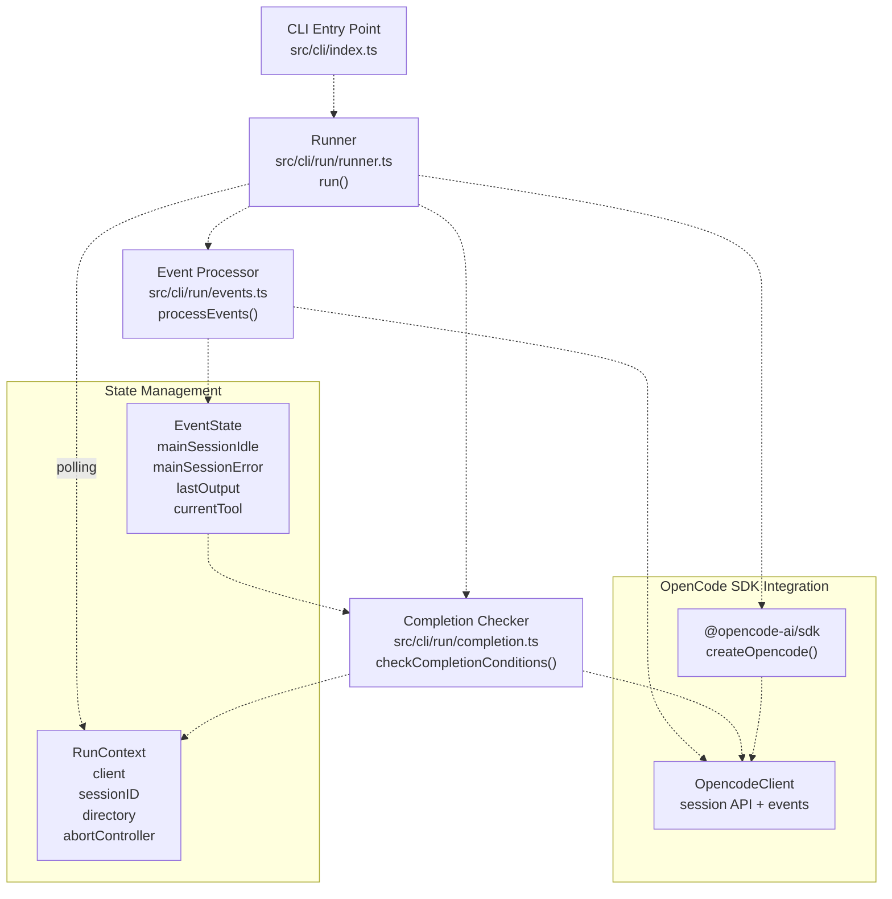
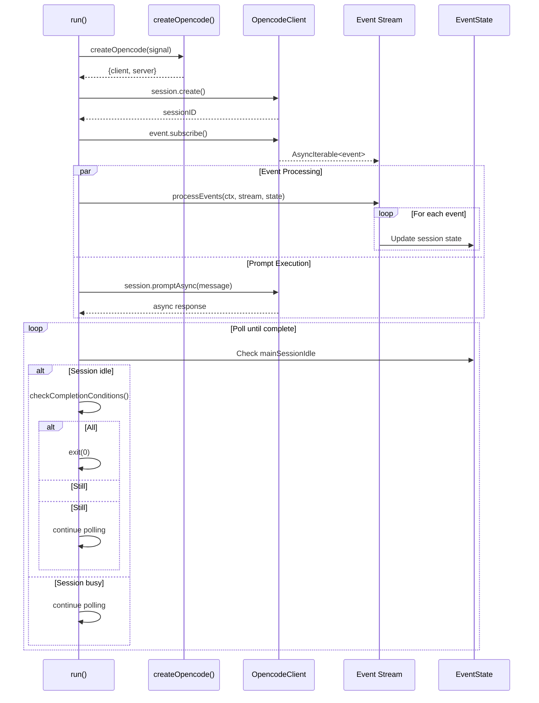
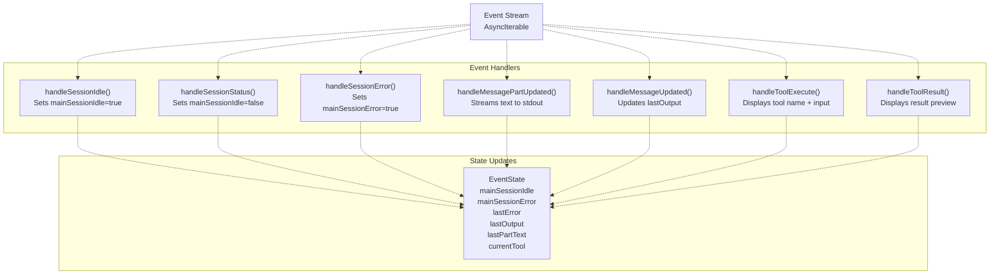
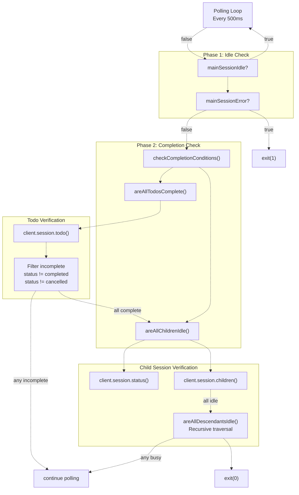

# CLI Run 명령

> **관련 소스 파일**
> * [.github/workflows/sisyphus-agent.yml](https://github.com/code-yeongyu/oh-my-opencode/blob/b92cd6ab/.github/workflows/sisyphus-agent.yml)
> * [src/cli/run/completion.test.ts](https://github.com/code-yeongyu/oh-my-opencode/blob/b92cd6ab/src/cli/run/completion.test.ts)
> * [src/cli/run/completion.ts](https://github.com/code-yeongyu/oh-my-opencode/blob/b92cd6ab/src/cli/run/completion.ts)
> * [src/cli/run/events.test.ts](https://github.com/code-yeongyu/oh-my-opencode/blob/b92cd6ab/src/cli/run/events.test.ts)
> * [src/cli/run/events.ts](https://github.com/code-yeongyu/oh-my-opencode/blob/b92cd6ab/src/cli/run/events.ts)
> * [src/cli/run/index.ts](https://github.com/code-yeongyu/oh-my-opencode/blob/b92cd6ab/src/cli/run/index.ts)
> * [src/cli/run/runner.ts](https://github.com/code-yeongyu/oh-my-opencode/blob/b92cd6ab/src/cli/run/runner.ts)
> * [src/cli/run/types.ts](https://github.com/code-yeongyu/oh-my-opencode/blob/b92cd6ab/src/cli/run/types.ts)

`oh-my-opencode run` 명령은 지능형 완료 감지 기능을 갖춘 비대화형 자동화 모드에서 에이전트 세션을 실행합니다. 이 명령은 수동 개입 없이 작업이 완료될 때까지 실행되어야 하는 CI/CD 환경을 위해 설계되었습니다. 명령은 세션 상태를 모니터링하고 이벤트를 실시간으로 처리하며, 모든 할 일(todos)과 백그라운드 작업이 완료된 경우에만 종료됩니다.

이 명령을 호출하는 GitHub Actions 워크플로우에 대한 정보는 [Sisyphus Agent Workflow](/code-yeongyu/oh-my-opencode/10.1-sisyphus-agent-workflow)를 참조하세요. 빌드 시스템 및 CLI 엔트리 포인트에 대한 자세한 내용은 [Build System](/code-yeongyu/oh-my-opencode/12.1-build-system)을 참조하세요.

## 명령 아키텍처

`run` 명령은 세션 관리, 이벤트 처리 및 완료 감지를 담당하는 여러 모듈에 걸쳐 구현되어 있습니다. 유지보수성과 테스트 가능성을 위해 아키텍처는 서로 다른 계층으로 관심사를 분리합니다.



**출처:** [src/cli/run/runner.ts L1-L121](https://github.com/code-yeongyu/oh-my-opencode/blob/b92cd6ab/src/cli/run/runner.ts#L1-L121)

 [src/cli/run/events.ts L1-L276](https://github.com/code-yeongyu/oh-my-opencode/blob/b92cd6ab/src/cli/run/events.ts#L1-L276)

 [src/cli/run/completion.ts L1-L79](https://github.com/code-yeongyu/oh-my-opencode/blob/b92cd6ab/src/cli/run/completion.ts#L1-L79)

 [src/cli/run/types.ts L1-L77](https://github.com/code-yeongyu/oh-my-opencode/blob/b92cd6ab/src/cli/run/types.ts#L1-L77)

### 핵심 컴포넌트

| 컴포넌트 | 파일 | 역할 |
| --- | --- | --- |
| `run()` | [src/cli/run/runner.ts L10-L121](https://github.com/code-yeongyu/oh-my-opencode/blob/b92cd6ab/src/cli/run/runner.ts#L10-L121) | 메인 오케스트레이터: 세션을 생성하고 이벤트 처리를 시작하며 완료 여부를 폴링(polling)함 |
| `processEvents()` | [src/cli/run/events.ts L34-L62](https://github.com/code-yeongyu/oh-my-opencode/blob/b92cd6ab/src/cli/run/events.ts#L34-L62) | 이벤트 스트림을 소비하고 상태를 업데이트하며 세션 수명 주기 이벤트를 처리함 |
| `checkCompletionConditions()` | [src/cli/run/completion.ts L4-L19](https://github.com/code-yeongyu/oh-my-opencode/blob/b92cd6ab/src/cli/run/completion.ts#L4-L19) | 할 일과 자식 세션을 확인하여 세션 완료 여부를 결정함 |
| `EventState` | [src/cli/run/events.ts L14-L31](https://github.com/code-yeongyu/oh-my-opencode/blob/b92cd6ab/src/cli/run/events.ts#L14-L31) | 세션 상태 추적: 유휴(idle) 상태, 오류, 출력, 현재 도구 |
| `RunContext` | [src/cli/run/types.ts L10-L15](https://github.com/code-yeongyu/oh-my-opencode/blob/b92cd6ab/src/cli/run/types.ts#L10-L15) | 공유 컨텍스트: 클라이언트, sessionID, 디렉토리, abortController |

**출처:** [src/cli/run/runner.ts L10-L121](https://github.com/code-yeongyu/oh-my-opencode/blob/b92cd6ab/src/cli/run/runner.ts#L10-L121)

 [src/cli/run/events.ts L14-L62](https://github.com/code-yeongyu/oh-my-opencode/blob/b92cd6ab/src/cli/run/events.ts#L14-L62)

 [src/cli/run/completion.ts L4-L19](https://github.com/code-yeongyu/oh-my-opencode/blob/b92cd6ab/src/cli/run/completion.ts#L4-L19)

 [src/cli/run/types.ts L10-L15](https://github.com/code-yeongyu/oh-my-opencode/blob/b92cd6ab/src/cli/run/types.ts#L10-L15)

## 세션 수명 주기

`run()` 함수는 생성부터 완료까지 전체 세션 수명 주기를 관리합니다. OpenCode 서버를 생성하고 이벤트 스트림을 설정하며 초기 프롬프트를 전송하고 완료 여부를 지속적으로 모니터링합니다.



**출처:** [src/cli/run/runner.ts L10-L121](https://github.com/code-yeongyu/oh-my-opencode/blob/b92cd6ab/src/cli/run/runner.ts#L10-L121)

### 세션 생성 및 초기화

[src/cli/run/runner.ts L32-L58](https://github.com/code-yeongyu/oh-my-opencode/blob/b92cd6ab/src/cli/run/runner.ts#L32-L58)

세션 생성 흐름:

1. 취소 지원을 위해 AbortController와 함께 **OpenCode 인스턴스 생성**
2. SIGINT(Ctrl+C) 및 타임아웃에 대한 **정리(cleanup) 핸들러 등록**
3. `"oh-my-opencode run"` 제목으로 **세션 생성**
4. 클라이언트, sessionID, 디렉토리 및 abortController로 **컨텍스트 초기화**

```javascript
const { client, server } = await createOpencode({
  signal: abortController.signal,
})

const sessionRes = await client.session.create({
  body: { title: "oh-my-opencode run" },
})

const ctx: RunContext = {
  client,
  sessionID,
  directory,
  abortController,
}
```

**출처:** [src/cli/run/runner.ts L32-L65](https://github.com/code-yeongyu/oh-my-opencode/blob/b92cd6ab/src/cli/run/runner.ts#L32-L65)

### 프롬프트 실행

[src/cli/run/runner.ts L67-L79](https://github.com/code-yeongyu/oh-my-opencode/blob/b92cd6ab/src/cli/run/runner.ts#L67-L79)

명령은 이벤트가 누락되지 않도록 프롬프트를 보내기 전에 이벤트를 구독합니다. 프롬프트는 `session.promptAsync()`를 사용하여 비동기적으로 전송됩니다.

```javascript
const events = await client.event.subscribe()
const eventState = createEventState()
const eventProcessor = processEvents(ctx, events.stream, eventState)

await client.session.promptAsync({
  path: { id: sessionID },
  body: {
    agent,
    parts: [{ type: "text", text: message }],
  },
  query: { directory },
})
```

**출처:** [src/cli/run/runner.ts L67-L79](https://github.com/code-yeongyu/oh-my-opencode/blob/b92cd6ab/src/cli/run/runner.ts#L67-L79)

## 이벤트 스트림 처리

이벤트 프로세서는 비동기 이벤트 스트림을 소비하고 세션 상태를 유지합니다. 세션 진행 상황, 에이전트 출력 및 도구 실행을 추적하기 위해 여러 이벤트 유형을 처리합니다.

### 이벤트 유형 및 핸들러



**출처:** [src/cli/run/events.ts L34-L275](https://github.com/code-yeongyu/oh-my-opencode/blob/b92cd6ab/src/cli/run/events.ts#L34-L275)

### 이벤트 핸들러 세부 정보

| 이벤트 유형 | 핸들러 | 상태 업데이트 | 목적 |
| --- | --- | --- | --- |
| `session.idle` | [handleSessionIdle L133-L144](https://github.com/code-yeongyu/oh-my-opencode/blob/b92cd6ab/handleSessionIdle()#L133-L144) | `mainSessionIdle = true` | 세션이 완료 확인 준비가 되었음을 나타냄 |
| `session.status` | [handleSessionStatus L146-L157](https://github.com/code-yeongyu/oh-my-opencode/blob/b92cd6ab/handleSessionStatus()#L146-L157) | `mainSessionIdle = false` | 세션이 바빠지면 유휴 플래그를 재설정함 |
| `session.error` | [handleSessionError L159-L174](https://github.com/code-yeongyu/oh-my-opencode/blob/b92cd6ab/handleSessionError()#L159-L174) | `mainSessionError = true``lastError = message` | 종료 처리를 위해 오류를 캡처함 |
| `message.part.updated` | [handleMessagePartUpdated L176-L197](https://github.com/code-yeongyu/oh-my-opencode/blob/b92cd6ab/handleMessagePartUpdated()#L176-L197) | `lastPartText` 증가 | 어시스턴트 텍스트 출력을 실시간으로 스트리밍함 |
| `message.updated` | [handleMessageUpdated L199-L220](https://github.com/code-yeongyu/oh-my-opencode/blob/b92cd6ab/handleMessageUpdated()#L199-L220) | `lastOutput` 교체 | 전체 메시지 내용을 캡처함 |
| `tool.execute` | [handleToolExecute L222-L250](https://github.com/code-yeongyu/oh-my-opencode/blob/b92cd6ab/handleToolExecute()#L222-L250) | `currentTool = name` | 미리보기와 함께 도구 호출을 표시함 |
| `tool.result` | [handleToolResult L252-L275](https://github.com/code-yeongyu/oh-my-opencode/blob/b92cd6ab/handleToolResult()#L252-L275) | `currentTool = null``lastPartText = ""` | 도구 결과 미리보기를 표시하고 상태를 재설정함 |

**출처:** [src/cli/run/events.ts L133-L275](https://github.com/code-yeongyu/oh-my-opencode/blob/b92cd6ab/src/cli/run/events.ts#L133-L275)

### 세션 필터링

모든 이벤트 핸들러는 메인 세션 이벤트만 처리되도록 `sessionID`로 이벤트를 필터링합니다. 자식 세션 이벤트(백그라운드 작업)는 무시되지만 상세 로그(verbose log)로 기록됩니다.

[src/cli/run/events.ts L64-L131](https://github.com/code-yeongyu/oh-my-opencode/blob/b92cd6ab/src/cli/run/events.ts#L64-L131)

```javascript
const sessionID = props?.sessionID ?? info?.sessionID
const isMainSession = sessionID === ctx.sessionID
const sessionTag = isMainSession
  ? pc.green("[MAIN]")
  : pc.yellow(`[${String(sessionID).slice(0, 8)}]`)
```

백그라운드 작업은 별도의 세션에서 실행되므로 이 필터링은 매우 중요합니다. 메인 세션은 자식 세션이 이벤트를 발생시킬 때가 아니라 자신의 작업이 완료되었을 때만 종료되어야 합니다.

**출처:** [src/cli/run/events.ts L64-L131](https://github.com/code-yeongyu/oh-my-opencode/blob/b92cd6ab/src/cli/run/events.ts#L64-L131)

## 완료 감지

완료 감지는 2단계 확인 방식을 사용합니다. 모든 할 일(todos)이 완료되어야 하며, 모든 자식 세션이 유휴 상태여야 합니다. 이를 통해 메인 에이전트의 작업과 위임된 모든 백그라운드 작업이 모두 종료되었음을 보장합니다.



**출처:** [src/cli/run/runner.ts L83-L104](https://github.com/code-yeongyu/oh-my-opencode/blob/b92cd6ab/src/cli/run/runner.ts#L83-L104)

 [src/cli/run/completion.ts L4-L79](https://github.com/code-yeongyu/oh-my-opencode/blob/b92cd6ab/src/cli/run/completion.ts#L4-L79)

### 할 일 완료 확인

[src/cli/run/completion.ts L21-L35](https://github.com/code-yeongyu/oh-my-opencode/blob/b92cd6ab/src/cli/run/completion.ts#L21-L35)

할 일 확인 단계에서는 세션의 모든 할 일을 가져와 완료되지 않은 항목을 필터링합니다. `completed` 및 `cancelled` 상태만 완료된 것으로 간주됩니다.

```javascript
async function areAllTodosComplete(ctx: RunContext): Promise<boolean> {
  const todosRes = await ctx.client.session.todo({ path: { id: ctx.sessionID } })
  const todos = (todosRes.data ?? []) as Todo[]

  const incompleteTodos = todos.filter(
    (t) => t.status !== "completed" && t.status !== "cancelled"
  )

  if (incompleteTodos.length > 0) {
    console.log(pc.dim(`  Waiting: ${incompleteTodos.length} todos remaining`))
    return false
  }

  return true
}
```

**출처:** [src/cli/run/completion.ts L21-L35](https://github.com/code-yeongyu/oh-my-opencode/blob/b92cd6ab/src/cli/run/completion.ts#L21-L35)

### 자식 세션 재귀 탐색

[src/cli/run/completion.ts L37-L79](https://github.com/code-yeongyu/oh-my-opencode/blob/b92cd6ab/src/cli/run/completion.ts#L37-L79)

자식 세션 확인 단계에서는 모든 하위 세션을 재귀적으로 탐색하여 여전히 작업 중인 세션이 없는지 확인합니다. 이는 백그라운드 작업이 자체적으로 또 다른 백그라운드 작업을 생성하는 경우를 처리합니다.

```typescript
async function areAllDescendantsIdle(
  ctx: RunContext,
  sessionID: string,
  allStatuses: Record<string, SessionStatus>
): Promise<boolean> {
  const childrenRes = await ctx.client.session.children({
    path: { id: sessionID },
  })
  const children = (childrenRes.data ?? []) as ChildSession[]

  for (const child of children) {
    const status = allStatuses[child.id]
    if (status && status.type !== "idle") {
      return false
    }

    const descendantsIdle = await areAllDescendantsIdle(
      ctx,
      child.id,
      allStatuses
    )
    if (!descendantsIdle) {
      return false
    }
  }

  return true
}
```

재귀적 탐색을 통해 증손자 세션까지 확인합니다. 이는 에이전트가 깊은 세션 계층 구조를 생성하는 `background_task` 또는 `call_omo_agent` 작업을 실행할 수 있기 때문에 필요합니다.

**출처:** [src/cli/run/completion.ts L49-L79](https://github.com/code-yeongyu/oh-my-opencode/blob/b92cd6ab/src/cli/run/completion.ts#L49-L79)

### 완료 폴링 루프

[src/cli/run/runner.ts L83-L104](https://github.com/code-yeongyu/oh-my-opencode/blob/b92cd6ab/src/cli/run/runner.ts#L83-L104)

메인 루프는 500ms(`POLL_INTERVAL_MS`)마다 폴링하며, 세션이 유휴 상태일 때만 완료 조건을 확인합니다.

```javascript
while (!abortController.signal.aborted) {
  await new Promise((resolve) => setTimeout(resolve, POLL_INTERVAL_MS))

  if (!eventState.mainSessionIdle) {
    continue
  }

  // 세션 오류 발생 여부 확인 - 오류 시 실패로 종료
  if (eventState.mainSessionError) {
    console.error(pc.red(`\n\nSession ended with error: ${eventState.lastError}`))
    console.error(pc.yellow("Check if todos were completed before the error."))
    cleanup()
    process.exit(1)
  }

  const shouldExit = await checkCompletionConditions(ctx)
  if (shouldExit) {
    console.log(pc.green("\n\nAll tasks completed."))
    cleanup()
    process.exit(0)
  }
}
```

이 설계는 에이전트가 활발히 작업하는 동안 불필요한 API 호출을 방지하고, 세션이 유휴 상태를 보고할 때만 완료 여부를 확인합니다.

**출처:** [src/cli/run/runner.ts L83-L104](https://github.com/code-yeongyu/oh-my-opencode/blob/b92cd6ab/src/cli/run/runner.ts#L83-L104)

 [src/cli/run/runner.ts L7-L8](https://github.com/code-yeongyu/oh-my-opencode/blob/b92cd6ab/src/cli/run/runner.ts#L7-L8)

## 종료 코드 및 오류 처리

이 명령은 성공, 실패 및 중단 상태를 나타내기 위해 표준 Unix 종료 코드를 사용합니다.

### 종료 코드 표

| 종료 코드 | 조건 | 트리거 |
| --- | --- | --- |
| `0` | 성공 | 모든 할 일 완료, 모든 자식 세션 유휴 상태 |
| `1` | 실패 | 세션 오류, API 오류 또는 예기치 않은 예외 |
| `130` | 중단됨 | SIGINT (Ctrl+C) 또는 타임아웃 도달 |

**출처:** [src/cli/run/runner.ts L92-L108](https://github.com/code-yeongyu/oh-my-opencode/blob/b92cd6ab/src/cli/run/runner.ts#L92-L108)

### 타임아웃 처리

[src/cli/run/runner.ts L20-L29](https://github.com/code-yeongyu/oh-my-opencode/blob/b92cd6ab/src/cli/run/runner.ts#L20-L29)

이 명령은 선택적 타임아웃 파라미터를 지원합니다(기본값: 0 = 타임아웃 없음). 설정된 경우, 지정된 시간이 지나면 타이머가 중단을 트리거합니다.

```javascript
let timeoutId: ReturnType<typeof setTimeout> | null = null

// timeout=0은 타임아웃 없음을 의미 (완료될 때까지 실행)
if (timeout > 0) {
  timeoutId = setTimeout(() => {
    console.log(pc.yellow("\nTimeout reached. Aborting..."))
    abortController.abort()
  }, timeout)
}
```

중단되면 명령은 실패가 아닌 중단을 나타내기 위해 종료 코드 130을 반환합니다.

**출처:** [src/cli/run/runner.ts L20-L29](https://github.com/code-yeongyu/oh-my-opencode/blob/b92cd6ab/src/cli/run/runner.ts#L20-L29)

 [src/cli/run/runner.ts L108](https://github.com/code-yeongyu/oh-my-opencode/blob/b92cd6ab/src/cli/run/runner.ts#L108-L108)

### 오류 감지 및 종료

[src/cli/run/runner.ts L90-L96](https://github.com/code-yeongyu/oh-my-opencode/blob/b92cd6ab/src/cli/run/runner.ts#L90-L96)

세션 오류는 `session.error` 이벤트를 통해 감지되며 즉시 종료 코드 1을 트리거합니다.

```
if (eventState.mainSessionError) {
  console.error(pc.red(`\n\nSession ended with error: ${eventState.lastError}`))
  console.error(pc.yellow("Check if todos were completed before the error."))
  cleanup()
  process.exit(1)
}
```

이를 통해 에이전트가 복구 불가능한 오류를 만났을 때 명령이 무한정 대기하는 것을 방지합니다.

**출처:** [src/cli/run/runner.ts L90-L96](https://github.com/code-yeongyu/oh-my-opencode/blob/b92cd6ab/src/cli/run/runner.ts#L90-L96)

 [src/cli/run/events.ts L159-L174](https://github.com/code-yeongyu/oh-my-opencode/blob/b92cd6ab/src/cli/run/events.ts#L159-L174)

### 시그널 처리

[src/cli/run/runner.ts L41-L45](https://github.com/code-yeongyu/oh-my-opencode/blob/b92cd6ab/src/cli/run/runner.ts#L41-L45)

이 명령은 Ctrl+C 시 정상적인 종료(graceful shutdown)를 위해 SIGINT 핸들러를 등록합니다.

```javascript
process.on("SIGINT", () => {
  console.log(pc.yellow("\nInterrupted. Shutting down..."))
  cleanup()
  process.exit(130)
})
```

정리 함수는 종료하기 전에 타임아웃을 해제하고 OpenCode 서버를 닫습니다.

**출처:** [src/cli/run/runner.ts L36-L45](https://github.com/code-yeongyu/oh-my-opencode/blob/b92cd6ab/src/cli/run/runner.ts#L36-L45)

## 사용 패턴

### 명령 호출

`run` 명령은 메시지 문자열과 선택적 파라미터를 허용합니다.

```typescript
export interface RunOptions {
  message: string        // 필수: 에이전트에게 보낼 프롬프트
  agent?: string        // 선택: 에이전트 이름 (기본값: Sisyphus)
  directory?: string    // 선택: 작업 디렉토리
  timeout?: number      // 선택: ms 단위 타임아웃 (0 = 타임아웃 없음)
}
```

**출처:** [src/cli/run/types.ts L3-L8](https://github.com/code-yeongyu/oh-my-opencode/blob/b92cd6ab/src/cli/run/types.ts#L3-L8)

### GitHub Actions 통합

[.github/workflows/sisyphus-agent.yml L293-L332](https://github.com/code-yeongyu/oh-my-opencode/blob/b92cd6ab/.github/workflows/sisyphus-agent.yml#L293-L332)

Sisyphus Agent 워크플로우는 `run` 명령의 실제 운영 환경 사용 사례를 보여줍니다.

```sql
PROMPT=$(cat <<'PROMPT_EOF'
Your username is @sisyphus-dev-ai, mentioned by @AUTHOR_PLACEHOLDER in REPO_PLACEHOLDER.

## Context
- Type: TYPE_PLACEHOLDER
- Number: #NUMBER_PLACEHOLDER
- Repository: REPO_PLACEHOLDER
- Default Branch: BRANCH_PLACEHOLDER

## User's Request
COMMENT_PLACEHOLDER

---

Write everything using the todo tools.
Then investigate and satisfy the request. Only if user requested to you to work explicitely, then use plan agent to plan, todo obsessivley then create a PR to `BRANCH_PLACEHOLDER` branch.
When done, report the result to the issue/PR with `gh issue comment NUMBER_PLACEHOLDER` or `gh pr comment NUMBER_PLACEHOLDER`.
PROMPT_EOF
)

stdbuf -oL -eL bun run dist/cli/index.js run "$PROMPT"
```

주요 특징:

* **버퍼링되지 않은 출력**: `stdbuf -oL -eL`을 통해 실시간 스트리밍 보장
* **템플릿 치환**: 플레이스홀더를 GitHub 컨텍스트로 교체
* **할 일 강제**: 추적을 위해 에이전트가 할 일 도구를 사용하도록 지시
* **보고 요구 사항**: 에이전트는 결과를 GitHub 이슈/PR에 다시 게시해야 함

**출처:** [.github/workflows/sisyphus-agent.yml L293-L332](https://github.com/code-yeongyu/oh-my-opencode/blob/b92cd6ab/.github/workflows/sisyphus-agent.yml#L293-L332)

### 출력 스트리밍

이벤트 프로세서는 에이전트가 생각하고 도구를 실행함에 따라 실시간으로 출력을 스트리밍합니다.

* **텍스트 스트리밍**: [src/cli/run/events.ts L176-L197](https://github.com/code-yeongyu/oh-my-opencode/blob/b92cd6ab/src/cli/run/events.ts#L176-L197) - 텍스트 부분을 표준 출력(stdout)에 점진적으로 기록
* **도구 실행**: [src/cli/run/events.ts L222-L250](https://github.com/code-yeongyu/oh-my-opencode/blob/b92cd6ab/src/cli/run/events.ts#L222-L250) - 번개 모양 이모지와 함께 도구 이름 및 입력 미리보기 표시
* **도구 결과**: [src/cli/run/events.ts L252-L275](https://github.com/code-yeongyu/oh-my-opencode/blob/b92cd6ab/src/cli/run/events.ts#L252-L275) - 트리 커넥터와 함께 잘린 출력 미리보기 표시

이는 터미널을 과도하게 채우지 않으면서도 진행 상황을 보여주는 콘솔 친화적인 인터페이스를 제공합니다.

**출처:** [src/cli/run/events.ts L176-L275](https://github.com/code-yeongyu/oh-my-opencode/blob/b92cd6ab/src/cli/run/events.ts#L176-L275)

### 상세 로깅 (Verbose Logging)

[src/cli/run/events.ts L64-L131](https://github.com/code-yeongyu/oh-my-opencode/blob/b92cd6ab/src/cli/run/events.ts#L64-L131)

이벤트 프로세서는 세션 태깅과 함께 모든 이벤트를 표준 에러(stderr)로 기록합니다.

* **메인 세션**: 녹색 `[MAIN]` 태그
* **자식 세션**: 노란색 `[sessionID]` 태그 (앞 8글자)
* **이벤트 세부 정보**: 유형 및 페이로드 요약이 포함된 흐릿한 텍스트

이를 통해 에이전트 출력(stdout)과 진단 정보(stderr)를 분리할 수 있으며, 이는 스트림을 별도로 캡처하는 CI/CD 환경에서 유용합니다.

**출처:** [src/cli/run/events.ts L64-L131](https://github.com/code-yeongyu/oh-my-opencode/blob/b92cd6ab/src/cli/run/events.ts#L64-L131)