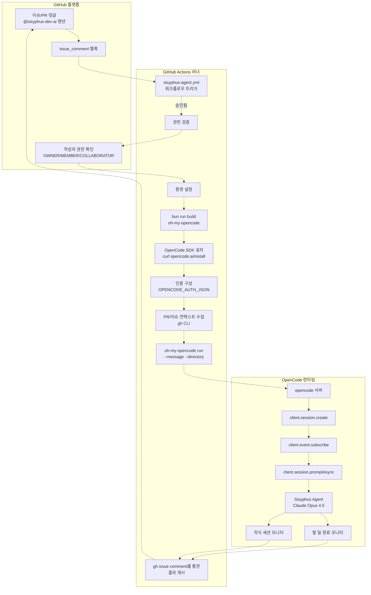
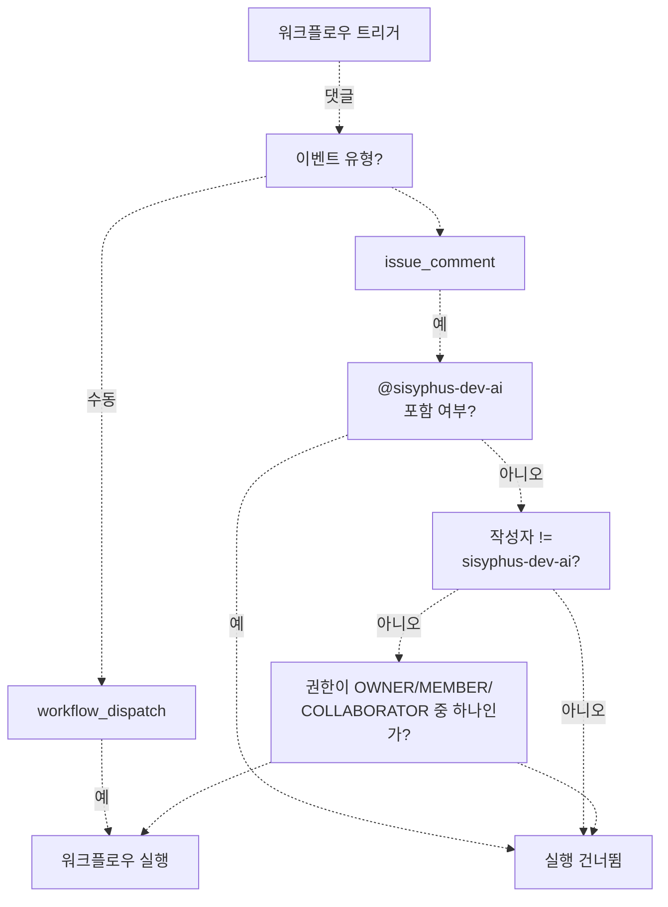
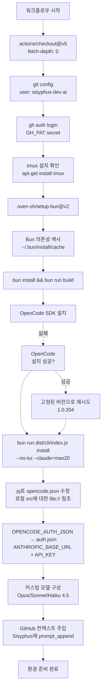
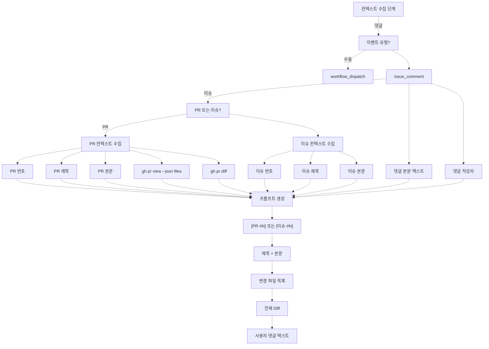
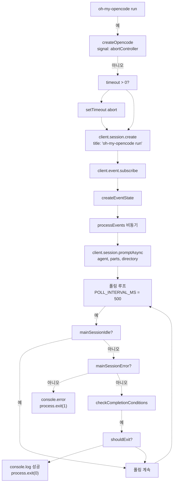
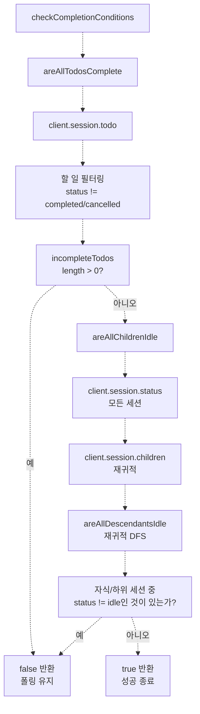
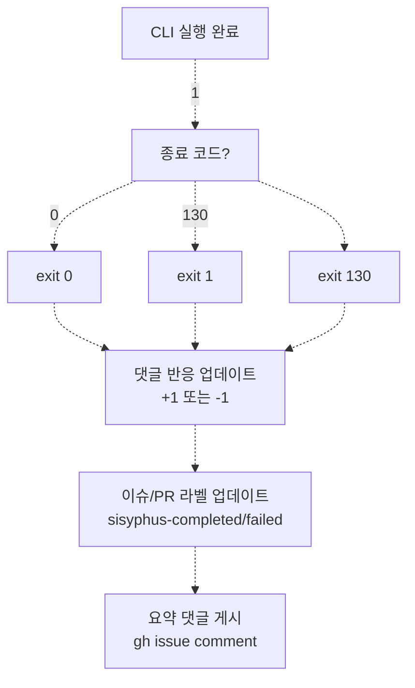

# GitHub Actions 통합

> **관련 소스 파일**
> * [.github/workflows/sisyphus-agent.yml](https://github.com/code-yeongyu/oh-my-opencode/blob/b92cd6ab/.github/workflows/sisyphus-agent.yml)
> * [README.ja.md](https://github.com/code-yeongyu/oh-my-opencode/blob/b92cd6ab/README.ja.md)
> * [README.ko.md](https://github.com/code-yeongyu/oh-my-opencode/blob/b92cd6ab/README.ko.md)
> * [README.md](https://github.com/code-yeongyu/oh-my-opencode/blob/b92cd6ab/README.md)
> * [README.zh-cn.md](https://github.com/code-yeongyu/oh-my-opencode/blob/b92cd6ab/README.zh-cn.md)
> * [src/cli/run/completion.test.ts](https://github.com/code-yeongyu/oh-my-opencode/blob/b92cd6ab/src/cli/run/completion.test.ts)
> * [src/cli/run/completion.ts](https://github.com/code-yeongyu/oh-my-opencode/blob/b92cd6ab/src/cli/run/completion.ts)
> * [src/cli/run/events.test.ts](https://github.com/code-yeongyu/oh-my-opencode/blob/b92cd6ab/src/cli/run/events.test.ts)
> * [src/cli/run/events.ts](https://github.com/code-yeongyu/oh-my-opencode/blob/b92cd6ab/src/cli/run/events.ts)
> * [src/cli/run/index.ts](https://github.com/code-yeongyu/oh-my-opencode/blob/b92cd6ab/src/cli/run/index.ts)
> * [src/cli/run/runner.ts](https://github.com/code-yeongyu/oh-my-opencode/blob/b92cd6ab/src/cli/run/runner.ts)
> * [src/cli/run/types.ts](https://github.com/code-yeongyu/oh-my-opencode/blob/b92cd6ab/src/cli/run/types.ts)
> * [src/shared/config-path.ts](https://github.com/code-yeongyu/oh-my-opencode/blob/b92cd6ab/src/shared/config-path.ts)

GitHub Actions 통합은 Sisyphus Agent 워크플로우를 통해 자동화된 저장소 작업을 가능하게 합니다. 이 시스템을 통해 메인테이너는 이슈나 풀 리퀘스트(Pull Request, PR) 댓글에서 `@sisyphus-dev-ai`를 멘션하여 AI 기반 개발 작업을 트리거할 수 있으며, 이는 요청된 작업을 실행하기 위해 완전히 구성된 oh-my-opencode 세션을 생성합니다.

워크플로우 구성 및 실행 단계에 대한 자세한 내용은 [Sisyphus Agent Workflow](/code-yeongyu/oh-my-opencode/10.1-sisyphus-agent-workflow)를 참조하십시오. 에이전트 실행을 구동하는 CLI 명령에 대해서는 [CLI Run Command](/code-yeongyu/oh-my-opencode/10.2-cli-run-command)를 참조하십시오.

## 시스템 아키텍처



**소스:** [.github/workflows/sisyphus-agent.yml L1-L252](https://github.com/code-yeongyu/oh-my-opencode/blob/b92cd6ab/.github/workflows/sisyphus-agent.yml#L1-L252)

 [src/cli/run/runner.ts L1-L122](https://github.com/code-yeongyu/oh-my-opencode/blob/b92cd6ab/src/cli/run/runner.ts#L1-L122)

## 워크플로우 트리거 메커니즘

워크플로우는 다음 두 가지 이벤트 유형에서 활성화됩니다:

| 이벤트 유형 | 트리거 조건 | 유스케이스 |
| --- | --- | --- |
| `issue_comment` | 댓글에 `@sisyphus-dev-ai` 포함 | 이슈/PR에서의 표준 사용자 상호작용 |
| `workflow_dispatch` | 커스텀 프롬프트를 사용한 수동 트리거 | 테스트 또는 직접 실행 |

**권한 요구 사항:**

* 댓글 작성자는 `OWNER`, `MEMBER` 또는 `COLLABORATOR` 권한을 보유해야 합니다.
* 루프 방지를 위해 `sisyphus-dev-ai` 본인의 멘션은 제외됩니다.
* 포크(Fork)된 PR 댓글은 시크릿(Secrets) 접근 권한을 받습니다 (issue_comment 이벤트의 특성).



**소스:** [.github/workflows/sisyphus-agent.yml L3-L22](https://github.com/code-yeongyu/oh-my-opencode/blob/b92cd6ab/.github/workflows/sisyphus-agent.yml#L3-L22)

## 환경 설정 흐름



**소스:** [.github/workflows/sisyphus-agent.yml L29-L229](https://github.com/code-yeongyu/oh-my-opencode/blob/b92cd6ab/.github/workflows/sisyphus-agent.yml#L29-L229)

## 컨텍스트 수집 및 프롬프트 구성

워크플로우는 에이전트를 실행하기 전에 포괄적인 컨텍스트를 수집합니다:



**소스:** [.github/workflows/sisyphus-agent.yml L231-L281](https://github.com/code-yeongyu/oh-my-opencode/blob/b92cd6ab/.github/workflows/sisyphus-agent.yml#L231-L281)

## CLI Run 명령 실행

`oh-my-opencode run` 명령은 에이전트 실행을 구동합니다:

| 구성 요소 | 구현 위치 | 목적 |
| --- | --- | --- |
| `run()` | [src/cli/run/runner.ts L10-L121](https://github.com/code-yeongyu/oh-my-opencode/blob/b92cd6ab/src/cli/run/runner.ts#L10-L121) | 메인 오케스트레이션 루프 |
| `createEventState()` | [src/cli/run/events.ts L23-L32](https://github.com/code-yeongyu/oh-my-opencode/blob/b92cd6ab/src/cli/run/events.ts#L23-L32) | 이벤트 추적 상태 초기화 |
| `processEvents()` | [src/cli/run/events.ts L34-L62](https://github.com/code-yeongyu/oh-my-opencode/blob/b92cd6ab/src/cli/run/events.ts#L34-L62) | 스트림 이벤트 처리 |
| `checkCompletionConditions()` | [src/cli/run/completion.ts L4-L19](https://github.com/code-yeongyu/oh-my-opencode/blob/b92cd6ab/src/cli/run/completion.ts#L4-L19) | 종료 시점 결정 |

**실행 흐름:**



**소스:** [src/cli/run/runner.ts L10-L121](https://github.com/code-yeongyu/oh-my-opencode/blob/b92cd6ab/src/cli/run/runner.ts#L10-L121)

 [src/cli/run/events.ts L23-L62](https://github.com/code-yeongyu/oh-my-opencode/blob/b92cd6ab/src/cli/run/events.ts#L23-L62)

 [src/cli/run/completion.ts L4-L19](https://github.com/code-yeongyu/oh-my-opencode/blob/b92cd6ab/src/cli/run/completion.ts#L4-L19)

## 완료 감지 로직

CLI는 세션이 종료되었는지 확인하기 위해 두 가지 조건을 모니터링합니다:



**주요 구현 세부 사항:**

* **할 일 완료(Todo Completion):** [src/cli/run/completion.ts L21-L35](https://github.com/code-yeongyu/oh-my-opencode/blob/b92cd6ab/src/cli/run/completion.ts#L21-L35)에서 `status !== "completed" && status !== "cancelled"`인 할 일을 필터링합니다.
* **자식 세션 모니터링:** [src/cli/run/completion.ts L37-L79](https://github.com/code-yeongyu/oh-my-opencode/blob/b92cd6ab/src/cli/run/completion.ts#L37-L79)에서 직계 자식뿐만 아니라 모든 하위 세션을 재귀적으로 확인합니다.
* **상태 조회:** `client.session.status()`를 통한 단일 대량 조회를 사용하여 N+1 쿼리 문제를 방지합니다.

**소스:** [src/cli/run/completion.ts L4-L79](https://github.com/code-yeongyu/oh-my-opencode/blob/b92cd6ab/src/cli/run/completion.ts#L4-L79)

## 이벤트 스트림 처리

이벤트 프로세서는 세션 수명 주기 이벤트를 추적합니다:

| 이벤트 유형 | 핸들러 | 상태 업데이트 |
| --- | --- | --- |
| `session.idle` | [src/cli/run/events.ts L133-L144](https://github.com/code-yeongyu/oh-my-opencode/blob/b92cd6ab/src/cli/run/events.ts#L133-L144) | `mainSessionIdle = true` 설정 |
| `session.status` | [src/cli/run/events.ts L146-L157](https://github.com/code-yeongyu/oh-my-opencode/blob/b92cd6ab/src/cli/run/events.ts#L146-L157) | 작업 중일 때 `mainSessionIdle = false`로 재설정 |
| `session.error` | [src/cli/run/events.ts L159-L174](https://github.com/code-yeongyu/oh-my-opencode/blob/b92cd6ab/src/cli/run/events.ts#L159-L174) | `mainSessionError = true` 설정 및 오류 텍스트 캡처 |
| `message.part.updated` | [src/cli/run/events.ts L176-L197](https://github.com/code-yeongyu/oh-my-opencode/blob/b92cd6ab/src/cli/run/events.ts#L176-L197) | 텍스트 파트를 stdout으로 스트리밍 |
| `message.updated` | [src/cli/run/events.ts L199-L220](https://github.com/code-yeongyu/oh-my-opencode/blob/b92cd6ab/src/cli/run/events.ts#L199-L220) | 폴백(Fallback) 텍스트 출력 |
| `tool.execute` | [src/cli/run/events.ts L222-L250](https://github.com/code-yeongyu/oh-my-opencode/blob/b92cd6ab/src/cli/run/events.ts#L222-L250) | 도구 호출 표시 |
| `tool.result` | [src/cli/run/events.ts L252-L257](https://github.com/code-yeongyu/oh-my-opencode/blob/b92cd6ab/src/cli/run/events.ts#L252-L257) | 도구 출력 표시 |

**상태 구조:**

```yaml
interface EventState {
  mainSessionIdle: boolean        // 세션이 유휴 상태가 되면 true
  mainSessionError: boolean       // 세션 오류 발생 시 true
  lastError: string | null        // 오류 메시지 텍스트
  lastOutput: string              // 마지막 message.updated 내용
  lastPartText: string            // 마지막 message.part 텍스트
  currentTool: string | null      // 현재 실행 중인 도구
}
```

**소스:** [src/cli/run/events.ts L14-L32](https://github.com/code-yeongyu/oh-my-opencode/blob/b92cd6ab/src/cli/run/events.ts#L14-L32)

 [src/cli/run/types.ts L1-L77](https://github.com/code-yeongyu/oh-my-opencode/blob/b92cd6ab/src/cli/run/types.ts#L1-L77)

## 인증 구성

워크플로우는 커스텀 인증 및 모델 구성을 주입합니다:

**인증 주입:**

* `OPENCODE_AUTH_JSON` 시크릿 → `~/.local/share/opencode/auth.json`
* `ANTHROPIC_BASE_URL` 및 `ANTHROPIC_API_KEY` → `opencode.json` 제공자(provider) 구성
* `GH_PAT` 시크릿 → Git 작업 및 gh CLI 인증

**커스텀 모델 구성:**

```json
{
  "provider": {
    "anthropic": {
      "baseURL": "$ANTHROPIC_BASE_URL",
      "apiKey": "$ANTHROPIC_API_KEY",
      "models": {
        "claude-opus-4-5-high": {
          "id": "claude-opus-4-5-20251101",
          "limit": { "context": 190000, "output": 128000 },
          "options": {
            "effort": "high",
            "thinking": { "type": "enabled", "budgetTokens": 64000 }
          }
        },
        "claude-sonnet-4-5-high": {
          "id": "claude-sonnet-4-5-20250929",
          "limit": { "context": 200000, "output": 128000 },
          "options": {
            "thinking": { "type": "enabled", "budgetTokens": 64000 }
          }
        }
      }
    }
  }
}
```

**소스:** [.github/workflows/sisyphus-agent.yml L80-L156](https://github.com/code-yeongyu/oh-my-opencode/blob/b92cd6ab/.github/workflows/sisyphus-agent.yml#L80-L156)

## GitHub 전용 프롬프트 컨텍스트

GitHub Actions 컨텍스트를 제공하기 위해 Sisyphus 에이전트 구성에 특수한 `prompt_append`가 주입됩니다:

**주요 지침:**

* **출력 라우팅:** 모든 출력은 `gh issue comment` 또는 `gh pr comment`를 통해 게시되어야 합니다 (콘솔은 사용자에게 보이지 않음).
* **댓글 형식:** 코드 블록 및 백틱(`)을 위해 Heredoc 구문이 필요합니다.
* **마크다운 규칙:** 코드 블록은 정확히 3개의 백틱과 언어 식별자를 가져야 합니다.
* **Git 작업:** 절대 main/master에 직접 푸시하지 말고, 항상 PR을 생성하십시오.
* **ID:** 커밋 시 이름은 `sisyphus-dev-ai`, 이메일은 `sisyphus-dev-ai@users.noreply.github.com`을 사용합니다.

**Heredoc 예시:**

```
gh issue comment 123 --body "$(cat <<'EOF'
백틱(`)과 여러 줄이 포함된 코드입니다.
완벽하게 작동합니다.
EOF
)"
```

**소스:** [.github/workflows/sisyphus-agent.yml L157-L222](https://github.com/code-yeongyu/oh-my-opencode/blob/b92cd6ab/.github/workflows/sisyphus-agent.yml#L157-L222)

## 실행 후 워크플로우

CLI 실행이 완료된 후, 워크플로우는 정리 및 보고 작업을 수행합니다:



**소스:** [.github/workflows/sisyphus-agent.yml L283-L344](https://github.com/code-yeongyu/oh-my-opencode/blob/b92cd6ab/.github/workflows/sisyphus-agent.yml#L283-L344)

## 로컬 플러그인 참조

워크플로우는 게시 전 변경 사항을 테스트하기 위해 플러그인에 대한 로컬 파일 참조를 사용합니다:

```sql
jq --arg path "file://$REPO_PATH/src/index.ts" '
  .plugin = [.plugin[] | select(. != "oh-my-opencode")] + [$path]
' "$OPENCODE_JSON" > /tmp/oc.json && mv /tmp/oc.json "$OPENCODE_JSON"
```

이를 통해 워크플로우는 다음을 수행할 수 있습니다:

1. 현재 브랜치에서 oh-my-opencode 빌드
2. NPM 패키지를 로컬 `src/index.ts` 엔트리 포인트로 오버라이드
3. NPM에 게시하지 않고 즉석에서 플러그인 변경 사항 테스트

**소스:** [.github/workflows/sisyphus-agent.yml L106-L113](https://github.com/code-yeongyu/oh-my-opencode/blob/b92cd6ab/.github/workflows/sisyphus-agent.yml#L106-L113)

## 권한 및 보안

**최소 토큰 권한:**

* 기본 `GITHUB_TOKEN`은 `contents: read` 권한만 가집니다.
* 모든 쓰기 작업은 `GH_PAT`(sisyphus-dev-ai의 개인 액세스 토큰)을 사용합니다.
* PAT는 체크아웃, git 작업, gh CLI, 댓글 게시 등에 필요합니다.

**권한 부여 흐름:**

1. 워크플로우는 실행 전 작성자의 권한(association)을 검증합니다.
2. `OWNER`, `MEMBER`, `COLLABORATOR`만 트리거할 수 있습니다.
3. 포크된 PR 댓글은 시크릿을 받습니다 (issue_comment 이벤트 설계).
4. 무한 루프를 방지하기 위해 본인 멘션은 차단됩니다.

**소스:** [.github/workflows/sisyphus-agent.yml L18-L33](https://github.com/code-yeongyu/oh-my-opencode/blob/b92cd6ab/.github/workflows/sisyphus-agent.yml#L18-L33)