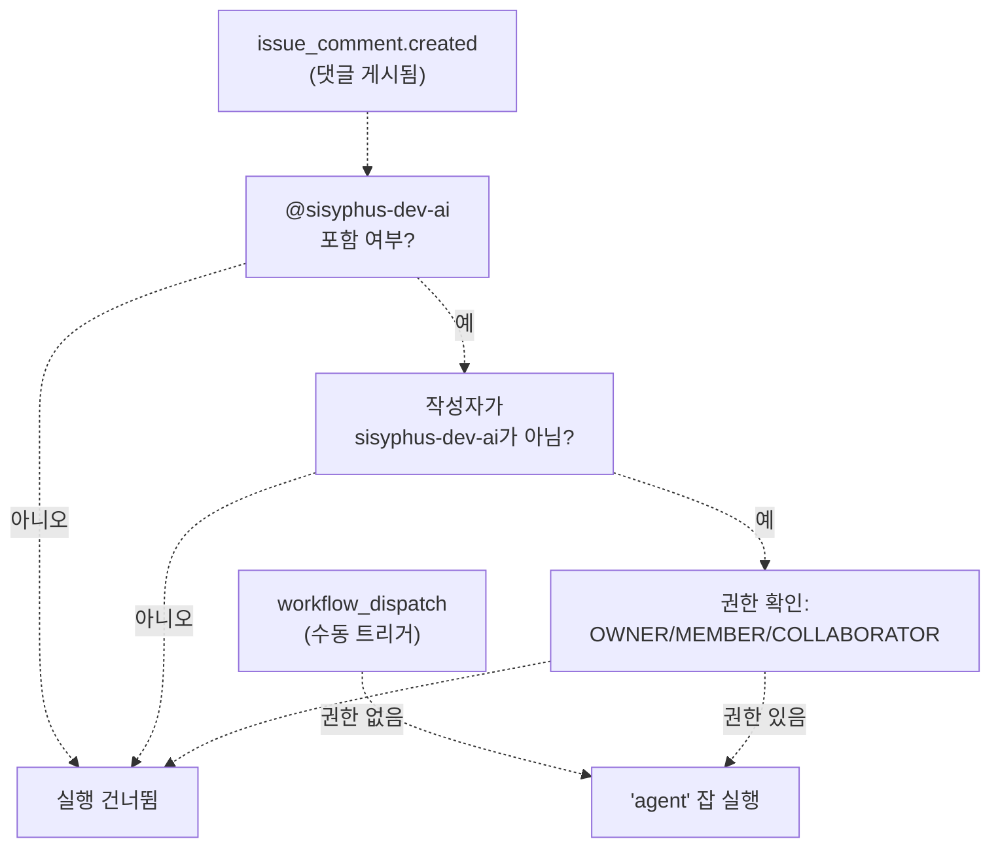
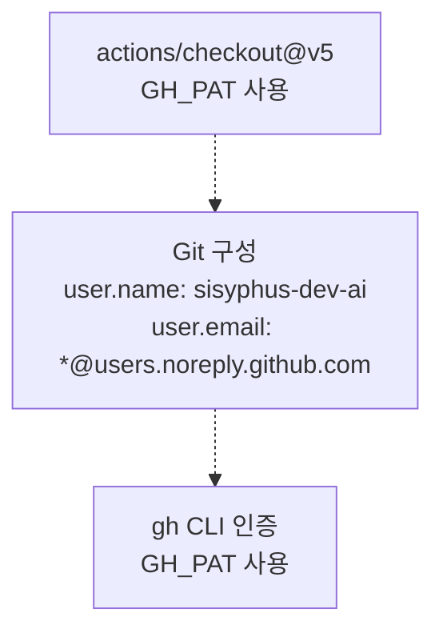
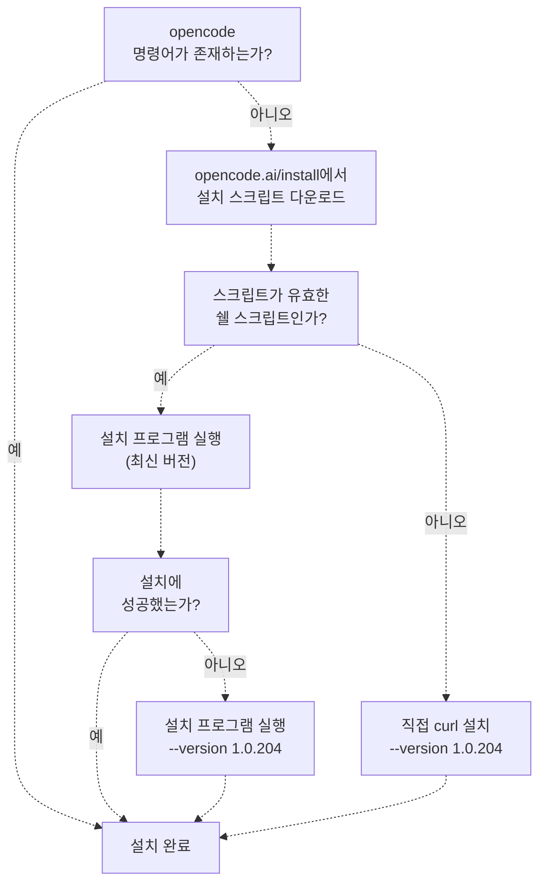
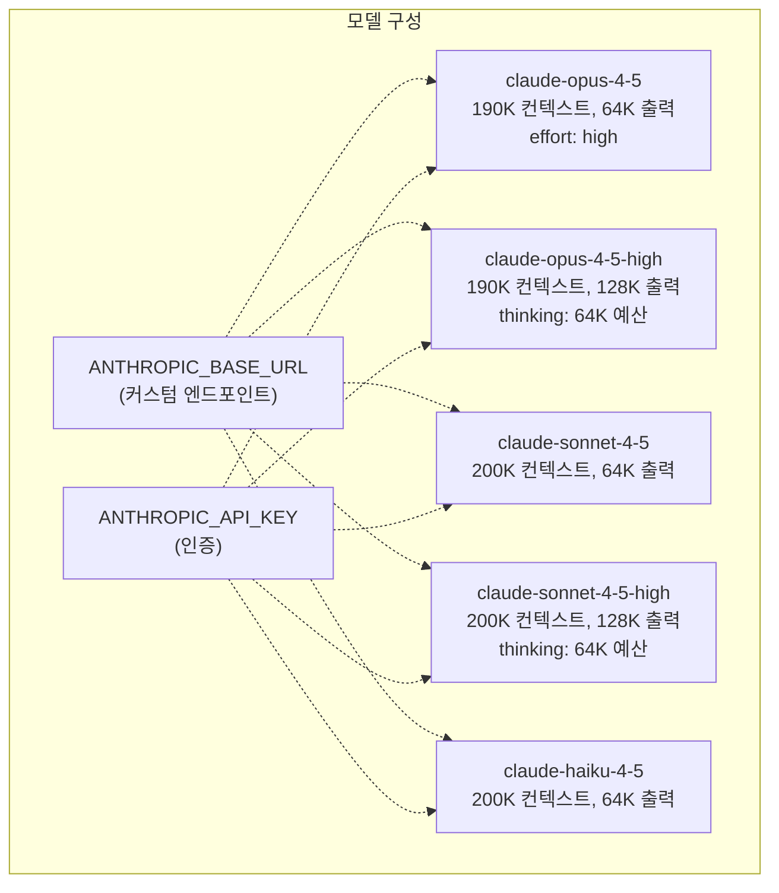
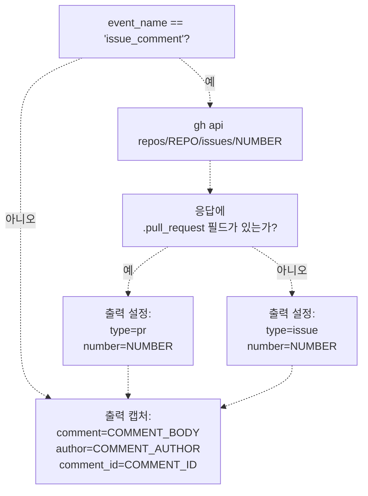
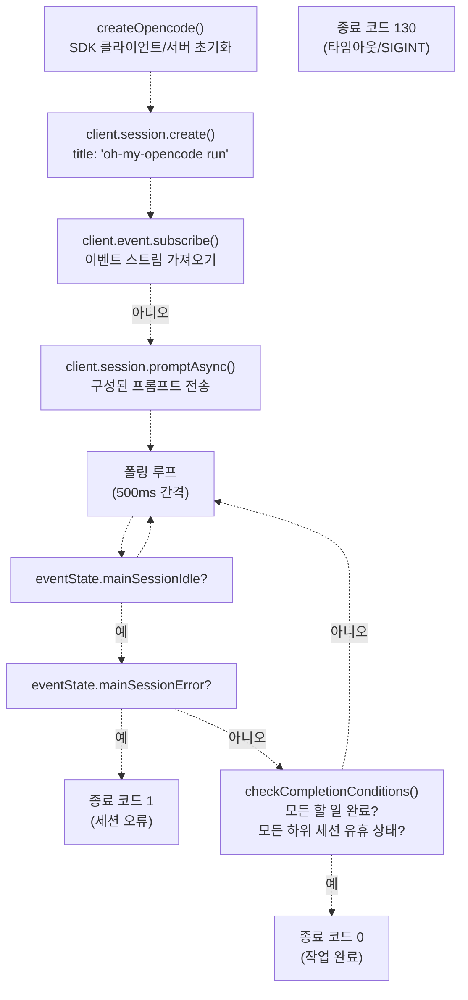
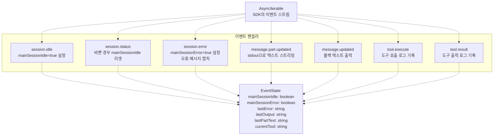
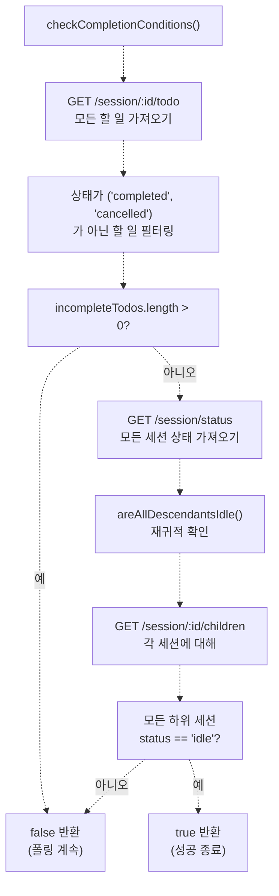
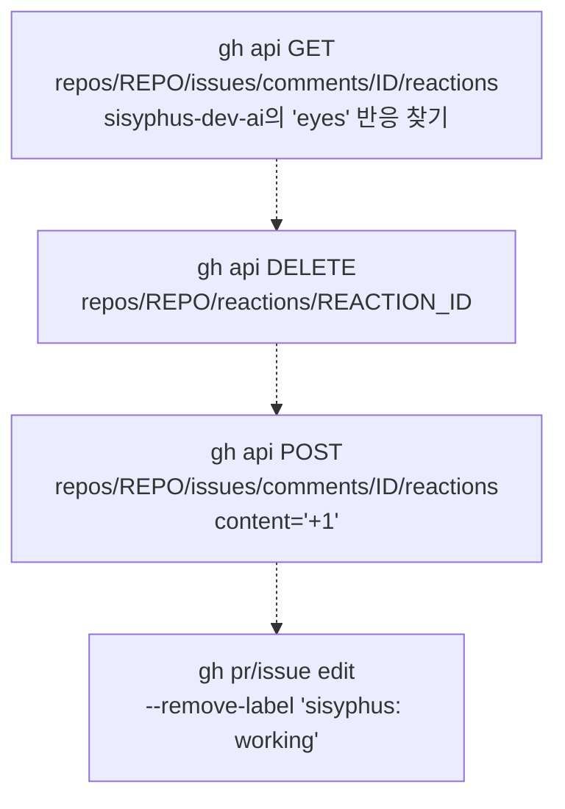

# Sisyphus 에이전트 워크플로우 (Sisyphus Agent Workflow)

> **관련 소스 파일**
> * [.github/workflows/sisyphus-agent.yml](https://github.com/code-yeongyu/oh-my-opencode/blob/b92cd6ab/.github/workflows/sisyphus-agent.yml)
> * [src/cli/run/completion.test.ts](https://github.com/code-yeongyu/oh-my-opencode/blob/b92cd6ab/src/cli/run/completion.test.ts)
> * [src/cli/run/completion.ts](https://github.com/code-yeongyu/oh-my-opencode/blob/b92cd6ab/src/cli/run/completion.ts)
> * [src/cli/run/events.test.ts](https://github.com/code-yeongyu/oh-my-opencode/blob/b92cd6ab/src/cli/run/events.test.ts)
> * [src/cli/run/events.ts](https://github.com/code-yeongyu/oh-my-opencode/blob/b92cd6ab/src/cli/run/events.ts)
> * [src/cli/run/index.ts](https://github.com/code-yeongyu/oh-my-opencode/blob/b92cd6ab/src/cli/run/index.ts)
> * [src/cli/run/runner.ts](https://github.com/code-yeongyu/oh-my-opencode/blob/b92cd6ab/src/cli/run/runner.ts)
> * [src/cli/run/types.ts](https://github.com/code-yeongyu/oh-my-opencode/blob/b92cd6ab/src/cli/run/types.ts)

Sisyphus 에이전트 워크플로우는 `@sisyphus-dev-ai` 봇이 이슈(Issue) 및 PR 댓글에서 직접 자율 코딩 작업을 수행할 수 있도록 하는 GitHub Actions 자동화입니다. 이 문서는 워크플로우 트리거(Trigger) 메커니즘, 환경 설정, OpenCode 구성, 작업 실행 및 완료 감지에 대해 다룹니다.

기본 오케스트레이터(Orchestrator) 에이전트로서의 Sisyphus와 단일 세션 내의 다단계 워크플로우에 대한 정보는 [Sisyphus Orchestrator](/code-yeongyu/oh-my-opencode/4.1-sisyphus-orchestrator)를 참조하십시오. CLI run 명령 아키텍처에 대한 자세한 내용은 [CLI Run Command](/code-yeongyu/oh-my-opencode/10.2-cli-run-command)를 참조하십시오.

## 워크플로우 개요 (Workflow Overview)

Sisyphus 에이전트 워크플로우는 다음과 같은 작업을 수행하는 GitHub Actions 잡(Job)으로 작동합니다:

1. 이슈/PR 댓글에서 `@sisyphus-dev-ai` 언급 시 트리거
2. 전체 개발 환경 설정 (Bun, tmux, OpenCode)
3. 소스에서 oh-my-opencode 빌드
4. 확장된 사고(Thinking) 기능을 갖춘 커스텀 Anthropic 모델 구성
5. 구성된 프롬프트(Prompt)로 에이전트 세션 실행
6. 할 일(Todo) 상태 및 하위 세션 추적을 통한 완료 모니터링
7. 변경 사항 푸시 및 GitHub 반응(Reaction)/라벨 업데이트

## 워크플로우 트리거 시스템 (Workflow Trigger System)

### 트리거 조건 (Trigger Conditions)

워크플로우는 [.github/workflows/sisyphus-agent.yml L3-L22](https://github.com/code-yeongyu/oh-my-opencode/blob/b92cd6ab/.github/workflows/sisyphus-agent.yml#L3-L22)에 정의된 두 가지 시나리오에서 활성화됩니다:



**출처:** [.github/workflows/sisyphus-agent.yml L3-L22](https://github.com/code-yeongyu/oh-my-opencode/blob/b92cd6ab/.github/workflows/sisyphus-agent.yml#L3-L22)

| 트리거 유형 | 조건 | 권한 |
| --- | --- | --- |
| `workflow_dispatch` | 선택적 커스텀 프롬프트를 사용한 수동 실행 | 제한 없음 |
| `issue_comment` | 댓글에 `@sisyphus-dev-ai` 포함 | OWNER, MEMBER 또는 COLLABORATOR여야 함 |

권한 확인은 외부 기여자의 남용을 방지하는 동시에, `issue_comment` 이벤트가 시크릿(Secrets)을 수신하므로 포크(Fork)된 PR에서도 작동할 수 있게 합니다.

## 환경 설정 단계 (Environment Setup Phase)

### 리포지토리 및 인증 구성

워크플로우는 리포지토리를 체크아웃하고 Git 자격 증명을 `sisyphus-dev-ai`로 구성하는 것으로 시작합니다 [.github/workflows/sisyphus-agent.yml L29-L45](https://github.com/code-yeongyu/oh-my-opencode/blob/b92cd6ab/.github/workflows/sisyphus-agent.yml#L29-L45):



`GH_PAT` (GitHub Personal Access Token) 시크릿을 통해 봇은 다음과 같은 작업을 수행할 수 있습니다:

* 기능 브랜치(Feature branch)에 커밋 푸시
* 풀 리퀘스트(PR) 생성 및 업데이트
* 댓글에 반응 추가
* 이슈/PR 라벨 수정

**출처:** [.github/workflows/sisyphus-agent.yml L29-L45](https://github.com/code-yeongyu/oh-my-opencode/blob/b92cd6ab/.github/workflows/sisyphus-agent.yml#L29-L45)

### 런타임 의존성 (Runtime Dependencies)

워크플로우는 시스템 의존성을 설치하고 Bun 모듈을 캐싱합니다 [.github/workflows/sisyphus-agent.yml L47-L70](https://github.com/code-yeongyu/oh-my-opencode/blob/b92cd6ab/.github/workflows/sisyphus-agent.yml#L47-L70):

| 의존성 | 버전 | 용도 | 캐시 키 |
| --- | --- | --- | --- |
| tmux | 최신 (apt) | `interactive_bash` 도구에 필요 | N/A |
| Bun | 최신 | 빌드 시스템 및 런타임 | `${{ runner.os }}-bun-${{ hashFiles('**/bun.lock') }}` |
| node_modules | N/A | JavaScript 의존성 | Bun 캐시와 공유 |

**출처:** [.github/workflows/sisyphus-agent.yml L47-L70](https://github.com/code-yeongyu/oh-my-opencode/blob/b92cd6ab/.github/workflows/sisyphus-agent.yml#L47-L70)

### 로컬 플러그인 빌드

워크플로우는 소스에서 oh-my-opencode를 빌드합니다 [.github/workflows/sisyphus-agent.yml L73-L76](https://github.com/code-yeongyu/oh-my-opencode/blob/b92cd6ab/.github/workflows/sisyphus-agent.yml#L73-L76):

```
bun install
bun run build
```

이를 통해 에이전트는 현재 커밋의 최신 코드를 사용하여 시스템이 자체 변경 사항을 테스트하고 배포할 수 있도록 합니다.

**출처:** [.github/workflows/sisyphus-agent.yml L73-L76](https://github.com/code-yeongyu/oh-my-opencode/blob/b92cd6ab/.github/workflows/sisyphus-agent.yml#L73-L76)

## OpenCode 설치 및 구성

### 폴백을 포함한 설치 전략 (Installation Strategy with Fallback)

워크플로우는 복원력 있는 설치 전략을 구현합니다 [.github/workflows/sisyphus-agent.yml L88-L102](https://github.com/code-yeongyu/oh-my-opencode/blob/b92cd6ab/.github/workflows/sisyphus-agent.yml#L88-L102):



폴백(Fallback) 메커니즘은 네트워크 문제나 손상된 다운로드 발생 시 버전을 `1.0.204`로 고정하여 신뢰할 수 있는 CI 실행을 보장합니다.

**출처:** [.github/workflows/sisyphus-agent.yml L88-L102](https://github.com/code-yeongyu/oh-my-opencode/blob/b92cd6ab/.github/workflows/sisyphus-agent.yml#L88-L102)

### 플러그인 구성 재정의 (Plugin Configuration Override)

표준 설치를 실행한 후, 워크플로우는 로컬 빌드를 사용하도록 플러그인 참조를 재정의합니다 [.github/workflows/sisyphus-agent.yml L108-L113](https://github.com/code-yeongyu/oh-my-opencode/blob/b92cd6ab/.github/workflows/sisyphus-agent.yml#L108-L113):

```sql
OPENCODE_JSON=~/.config/opencode/opencode.json
REPO_PATH=$(pwd)
jq --arg path "file://$REPO_PATH/src/index.ts" '
  .plugin = [.plugin[] | select(. != "oh-my-opencode")] + [$path]
' "$OPENCODE_JSON" > /tmp/oc.json && mv /tmp/oc.json "$OPENCODE_JSON"
```

이 `jq` 명령은 다음을 수행합니다:

1. 기존의 모든 `oh-my-opencode` 플러그인 항목을 제거합니다.
2. 로컬 소스 파일에 대한 `file://` 참조를 추가합니다.
3. 작업 디렉토리로부터의 핫 리로딩(Hot-reloading)을 활성화합니다.

**출처:** [.github/workflows/sisyphus-agent.yml L108-L113](https://github.com/code-yeongyu/oh-my-opencode/blob/b92cd6ab/.github/workflows/sisyphus-agent.yml#L108-L113)

### 커스텀 Anthropic 모델 구성

워크플로우는 확장된 기능을 갖춘 커스텀 모델 정의를 구성합니다 [.github/workflows/sisyphus-agent.yml L115-L155](https://github.com/code-yeongyu/oh-my-opencode/blob/b92cd6ab/.github/workflows/sisyphus-agent.yml#L115-L155):



**모델 사양:**

| 모델 ID | 표시 이름 | 컨텍스트 제한 | 출력 제한 | 특별 옵션 |
| --- | --- | --- | --- | --- |
| `claude-opus-4-5-20251101` | Opus 4.5 | 190,000 | 64,000 | `effort: "high"` |
| `claude-opus-4-5-20251101` | Opus 4.5 High | 190,000 | 128,000 | `effort: "high"`, `thinking.budgetTokens: 64000` |
| `claude-sonnet-4-5-20250929` | Sonnet 4.5 | 200,000 | 64,000 | 없음 |
| `claude-sonnet-4-5-20250929` | Sonnet 4.5 High | 200,000 | 128,000 | `thinking.budgetTokens: 64000` |
| `claude-haiku-4-5-20251001` | Haiku 4.5 | 200,000 | 64,000 | 없음 |

`-high` 변형은 복잡한 추론 작업을 위해 64K 토큰 예산의 확장 사고(Extended thinking) 모드를 활성화합니다.

**출처:** [.github/workflows/sisyphus-agent.yml L115-L155](https://github.com/code-yeongyu/oh-my-opencode/blob/b92cd6ab/.github/workflows/sisyphus-agent.yml#L115-L155)

### GitHub Actions 환경 프롬프트

워크플로우는 CI 환경에서 에이전트의 행동을 안내하기 위해 커스텀 프롬프트 추가분(Prompt append)을 주입합니다 [.github/workflows/sisyphus-agent.yml L157-L222](https://github.com/code-yeongyu/oh-my-opencode/blob/b92cd6ab/.github/workflows/sisyphus-agent.yml#L157-L222):

프롬프트에 의해 강제되는 주요 행동 규칙:

* **출력 메커니즘:** 모든 응답은 `gh issue comment` 또는 `gh pr comment`를 사용해야 합니다 (콘솔은 사용자에게 보이지 않음).
* **Heredoc 구문:** 코드와 백틱(Backtick)은 쉘 해석을 방지하기 위해 heredoc을 사용해야 합니다.
* **마크다운 포맷팅:** 언어 식별자가 포함된 엄격한 3-백틱 코드 블록을 사용합니다.
* **Git 워크플로우:** 코드 변경에는 PR이 필요합니다 (main/master에 직접 푸시 금지).
* **설정 요구 사항:** 작업을 실행하기 전에 `bun install`을 실행합니다.
* **통신 프로토콜:** 즉시 확인 메시지를 보내고, 완료 시 보고합니다.

**출처:** [.github/workflows/sisyphus-agent.yml L157-L222](https://github.com/code-yeongyu/oh-my-opencode/blob/b92cd6ab/.github/workflows/sisyphus-agent.yml#L157-L222)

### 인증 파일 설정

워크플로우는 인증 구성을 작성합니다 [.github/workflows/sisyphus-agent.yml L224-L226](https://github.com/code-yeongyu/oh-my-opencode/blob/b92cd6ab/.github/workflows/sisyphus-agent.yml#L224-L226):

```php
mkdir -p ~/.local/share/opencode
echo "$OPENCODE_AUTH_JSON" > ~/.local/share/opencode/auth.json
chmod 600 ~/.local/share/opencode/auth.json
```

이 JSON 블롭(Blob)에는 Claude, Gemini 및 ChatGPT 제공자를 위한 OAuth 토큰이 포함되어 있습니다.

**출처:** [.github/workflows/sisyphus-agent.yml L224-L226](https://github.com/code-yeongyu/oh-my-opencode/blob/b92cd6ab/.github/workflows/sisyphus-agent.yml#L224-L226)

## 컨텍스트 수집 단계 (Context Collection Phase)

### 이슈 vs PR 감지

워크플로우는 댓글이 이슈에서 발생했는지 또는 풀 리퀘스트에서 발생했는지 확인합니다 [.github/workflows/sisyphus-agent.yml L230-L261](https://github.com/code-yeongyu/oh-my-opencode/blob/b92cd6ab/.github/workflows/sisyphus-agent.yml#L230-L261):



GitHub의 `issue_comment` 이벤트는 이슈와 PR 모두에 대해 발생하기 때문에 이러한 감지가 필요합니다. 워크플로우는 GitHub API를 사용하여 `.pull_request` 필드를 확인하고 이를 구분합니다.

**출처:** [.github/workflows/sisyphus-agent.yml L230-L261](https://github.com/code-yeongyu/oh-my-opencode/blob/b92cd6ab/.github/workflows/sisyphus-agent.yml#L230-L261)

### 상태 표시기 (Status Indicators)

워크플로우는 진행 중인 작업을 보여주기 위해 시각적 표시기를 추가합니다 [.github/workflows/sisyphus-agent.yml L264-L291](https://github.com/code-yeongyu/oh-my-opencode/blob/b92cd6ab/.github/workflows/sisyphus-agent.yml#L264-L291):

| 표시기 | 유형 | 타이밍 | 용도 |
| --- | --- | --- | --- |
| 👀 (eyes) | 댓글 반응 | 실행 전 | 수신 확인 |
| `sisyphus: working` | 이슈/PR 라벨 | 실행 전 | 활성 상태 표시 |
| 👍 (thumbs up) | 댓글 반응 | 실행 후 | 완료 확인 |
| 라벨 제거 | 라벨 제거 | 실행 후 | 활성 상태 해제 |

**출처:** [.github/workflows/sisyphus-agent.yml L264-L291](https://github.com/code-yeongyu/oh-my-opencode/blob/b92cd6ab/.github/workflows/sisyphus-agent.yml#L264-L291)

## CLI Run 명령을 통한 작업 실행

### 프롬프트 구성 (Prompt Construction)

워크플로우는 플레이스홀더(Placeholder)를 사용하여 컨텍스트를 인식하는 프롬프트를 구성합니다 [.github/workflows/sisyphus-agent.yml L305-L330](https://github.com/code-yeongyu/oh-my-opencode/blob/b92cd6ab/.github/workflows/sisyphus-agent.yml#L305-L330):

```sql
Your username is @sisyphus-dev-ai, mentioned by @AUTHOR_PLACEHOLDER in REPO_PLACEHOLDER.

## Context
- Type: TYPE_PLACEHOLDER
- Number: #NUMBER_PLACEHOLDER
- Repository: REPO_PLACEHOLDER
- Default Branch: BRANCH_PLACEHOLDER

## User's Request
COMMENT_PLACEHOLDER

---

Write everything using the todo tools.
Then investigate and satisfy the request. Only if user requested to you to work explicitely, then use plan agent to plan, todo obsessivley then create a PR to `BRANCH_PLACEHOLDER` branch.
When done, report the result to the issue/PR with `gh issue comment NUMBER_PLACEHOLDER` or `gh pr comment NUMBER_PLACEHOLDER`.
```

플레이스홀더는 bash 매개변수 확장을 통해 실제 값으로 대체됩니다:

* `AUTHOR_PLACEHOLDER` → 댓글 작성자의 사용자 이름
* `REPO_PLACEHOLDER` → 리포지토리 이름 (예: `code-yeongyu/oh-my-opencode`)
* `TYPE_PLACEHOLDER` → `issue` 또는 `pr`
* `NUMBER_PLACEHOLDER` → 이슈/PR 번호
* `BRANCH_PLACEHOLDER` → 기본 브랜치 이름 (보통 `main` 또는 `master`)
* `COMMENT_PLACEHOLDER` → 전체 댓글 본문

**출처:** [.github/workflows/sisyphus-agent.yml L305-L330](https://github.com/code-yeongyu/oh-my-opencode/blob/b92cd6ab/.github/workflows/sisyphus-agent.yml#L305-L330)

### CLI Run 호출

워크플로우는 CLI run 명령을 사용하여 에이전트 세션을 실행합니다 [.github/workflows/sisyphus-agent.yml L332](https://github.com/code-yeongyu/oh-my-opencode/blob/b92cd6ab/.github/workflows/sisyphus-agent.yml#L332-L332):

```
stdbuf -oL -eL bun run dist/cli/index.js run "$PROMPT"
```

`stdbuf -oL -eL`은 GitHub Actions에서 실시간 로그 스트리밍을 위해 출력 버퍼링을 비활성화합니다.

**출처:** [.github/workflows/sisyphus-agent.yml L332](https://github.com/code-yeongyu/oh-my-opencode/blob/b92cd6ab/.github/workflows/sisyphus-agent.yml#L332-L332)

## 세션 모니터링 및 완료 감지

### CLI Run 아키텍처

CLI run 명령은 OpenCode 세션을 초기화하고 완료될 때까지 모니터링합니다 [src/cli/run/runner.ts L10-L121](https://github.com/code-yeongyu/oh-my-opencode/blob/b92cd6ab/src/cli/run/runner.ts#L10-L121):



**출처:** [src/cli/run/runner.ts L10-L121](https://github.com/code-yeongyu/oh-my-opencode/blob/b92cd6ab/src/cli/run/runner.ts#L10-L121)

### 이벤트 처리 시스템 (Event Processing System)

CLI는 OpenCode 이벤트를 처리하여 세션 상태를 추적합니다 [src/cli/run/events.ts L34-L62](https://github.com/code-yeongyu/oh-my-opencode/blob/b92cd6ab/src/cli/run/events.ts#L34-L62):



**주요 이벤트 유형:**

| 이벤트 유형 | 사용된 속성 | 상태 업데이트 | 콘솔 출력 |
| --- | --- | --- | --- |
| `session.idle` | `sessionID` | `mainSessionIdle = true` | 흐릿한 로그 라인 |
| `session.status` | `sessionID`, `status.type` | `busy`인 경우 리셋 | 흐릿한 로그 라인 |
| `session.error` | `sessionID`, `error` | `mainSessionError = true` | 빨간색 오류 메시지 |
| `message.part.updated` | `info.sessionID`, `part.text` | 증분 텍스트 | 직접 stdout |
| `message.updated` | `info.sessionID`, `content` | 전체 콘텐츠 | 폴백 stdout |
| `tool.execute` | `sessionID`, `name`, `input` | `currentTool = name` | 청록색 도구 이름 + 미리보기 |
| `tool.result` | `sessionID`, `output` | `currentTool = null` | 흐릿한 출력 미리보기 |

**출처:** [src/cli/run/events.ts L34-L62](https://github.com/code-yeongyu/oh-my-opencode/blob/b92cd6ab/src/cli/run/events.ts#L34-L62)
[src/cli/run/events.ts L133-L275](https://github.com/code-yeongyu/oh-my-opencode/blob/b92cd6ab/src/cli/run/events.ts#L133-L275)

### 완료 조건 (Completion Conditions)

`checkCompletionConditions` 함수는 실행을 종료할 수 있는지 여부를 결정합니다 [src/cli/run/completion.ts L4-L19](https://github.com/code-yeongyu/oh-my-opencode/blob/b92cd6ab/src/cli/run/completion.ts#L4-L19):



**완료 기준:**

1. **모든 할 일 완료:** `in_progress`, `blocked` 또는 `pending` 상태의 할 일이 없음.
2. **모든 하위 세션 유휴 상태:** 모든 하위 세션의 `status.type == "idle"`임을 보장하는 재귀적 확인.

이는 다음과 같은 상황에서 조기 종료되는 것을 방지합니다:

* Sisyphus가 백그라운드 에이전트(Librarian, Explore)를 생성한 경우
* 프론트엔드 엔지니어가 여전히 UI 변경 작업을 수행 중인 경우
* 중첩된 에이전트 위임이 진행 중인 경우

**출처:** [src/cli/run/completion.ts L4-L79](https://github.com/code-yeongyu/oh-my-opencode/blob/b92cd6ab/src/cli/run/completion.ts#L4-L79)

## 실행 후 처리 (Post-Execution Handling)

### 변경 사항 유지 (Change Persistence)

워크플로우는 에이전트가 수행한 모든 변경 사항을 커밋하고 푸시합니다 [.github/workflows/sisyphus-agent.yml L335-L348](https://github.com/code-yeongyu/oh-my-opencode/blob/b92cd6ab/.github/workflows/sisyphus-agent.yml#L335-L348):

```
if [[ -n "$(git status --porcelain)" ]]; then
  git add -A
  git commit -m "chore: changes by sisyphus-dev-ai" || true
fi

BRANCH=$(git branch --show-current)
if [[ "$BRANCH" != "main" && "$BRANCH" != "master" ]]; then
  git push origin "$BRANCH" || true
fi
```

**안전 메커니즘:** 워크플로우는 푸시하기 전에 `main` 또는 `master` 브랜치에 있지 않은지 명시적으로 확인합니다. 이는 보호된 브랜치에 실수로 직접 커밋하는 것을 방지합니다.

**출처:** [.github/workflows/sisyphus-agent.yml L335-L348](https://github.com/code-yeongyu/oh-my-opencode/blob/b92cd6ab/.github/workflows/sisyphus-agent.yml#L335-L348)

### 상태 업데이트 및 정리

워크플로우는 완료 상태를 반영하기 위해 GitHub 표시기를 업데이트합니다 [.github/workflows/sisyphus-agent.yml L350-L376](https://github.com/code-yeongyu/oh-my-opencode/blob/b92cd6ab/.github/workflows/sisyphus-agent.yml#L350-L376):



**상태 전환:**

| 단계 | 댓글 반응 | 이슈/PR 라벨 | 의미 |
| --- | --- | --- | --- |
| 실행 전 | 👀 (eyes) | `sisyphus: working` | 작업 진행 중 |
| 실행 후 | 👍 (thumbs up) | 라벨 제거 | 작업 완료 |

이를 통해 사용자는 로그를 읽지 않고도 시각적인 피드백을 받을 수 있습니다.

**출처:** [.github/workflows/sisyphus-agent.yml L350-L376](https://github.com/code-yeongyu/oh-my-opencode/blob/b92cd6ab/.github/workflows/sisyphus-agent.yml#L350-L376)

## 오류 처리 및 복원력 (Error Handling and Resilience)

### 세션 오류 감지

CLI는 세션에 오류가 발생하면 즉시 종료 코드 1로 종료됩니다 [src/cli/run/runner.ts L91-L96](https://github.com/code-yeongyu/oh-my-opencode/blob/b92cd6ab/src/cli/run/runner.ts#L91-L96):

```
if (eventState.mainSessionError) {
  console.error(pc.red(`\n\nSession ended with error: ${eventState.lastError}`))
  console.error(pc.yellow("Check if todos were completed before the error."))
  cleanup()
  process.exit(1)
}
```

이는 API 오류, 속도 제한(Rate limit) 또는 내부 예외로 인해 세션이 실패했을 때 워크플로우가 무한정 대기하는 것을 방지합니다.

**출처:** [src/cli/run/runner.ts L91-L96](https://github.com/code-yeongyu/oh-my-opencode/blob/b92cd6ab/src/cli/run/runner.ts#L91-L96)

### 타임아웃 구성 (Timeout Configuration)

CLI는 선택적 타임아웃 매개변수를 지원합니다 (기본값 0 = 타임아웃 없음) [src/cli/run/runner.ts L24-L29](https://github.com/code-yeongyu/oh-my-opencode/blob/b92cd6ab/src/cli/run/runner.ts#L24-L29):

```javascript
if (timeout > 0) {
  timeoutId = setTimeout(() => {
    console.log(pc.yellow("\nTimeout reached. Aborting..."))
    abortController.abort()
  }, timeout)
}
```

GitHub Actions 워크플로우는 타임아웃을 설정하지 않아 장기 실행 작업이 자연스럽게 완료될 수 있도록 합니다. GitHub Actions에는 안전장치로 기본 6시간의 잡 타임아웃이 있습니다.

**출처:** [src/cli/run/runner.ts L24-L29](https://github.com/code-yeongyu/oh-my-opencode/blob/b92cd6ab/src/cli/run/runner.ts#L24-L29)

### 항상 실행되는 정리 작업 (Always Run Cleanup)

실행 후 단계는 에이전트 작업이 실패하더라도 실행되도록 `if: always()`를 사용합니다 [.github/workflows/sisyphus-agent.yml L336-L351](https://github.com/code-yeongyu/oh-my-opencode/blob/b92cd6ab/.github/workflows/sisyphus-agent.yml#L336-L351):

```sql
- name: Push changes
  if: always()
  # ... 푸시 로직 ...

- name: Update reaction and remove label
  if: always()
  # ... 정리 로직 ...
```

이를 통해 다음 사항이 보장됩니다:

* 부분적인 작업이라도 커밋되고 푸시됩니다.
* GitHub 표시기가 업데이트되어 "working" 상태가 제거됩니다.
* 사용자는 완료 또는 실패에 대한 피드백을 받습니다.

**출처:** [.github/workflows/sisyphus-agent.yml L336-L351](https://github.com/code-yeongyu/oh-my-opencode/blob/b92cd6ab/.github/workflows/sisyphus-agent.yml#L336-L351)

## Sisyphus 오케스트레이터와의 통합

### 시스템 프롬프트 주입 (System Prompt Injection)

GitHub Actions 환경 프롬프트는 Sisyphus의 `prompt_append` 필드에 주입됩니다 [.github/workflows/sisyphus-agent.yml L222](https://github.com/code-yeongyu/oh-my-opencode/blob/b92cd6ab/.github/workflows/sisyphus-agent.yml#L222-L222). 이는 에이전트가 초기화될 때 Sisyphus의 기본 시스템 프롬프트 뒤에 추가됩니다. 이를 통해 모든 GitHub 관련 행동 규칙이 시작부터 활성화됩니다.

### 할 일 중심 실행 (Todo-Driven Execution)

구성된 프롬프트는 명시적으로 지시합니다: "Write everything using the todo tools" [.github/workflows/sisyphus-agent.yml L320](https://github.com/code-yeongyu/oh-my-opencode/blob/b92cd6ab/.github/workflows/sisyphus-agent.yml#L320-L320). 이는 Sisyphus가 작업을 추적 가능한 할 일(Todo)로 분해하도록 강제하며, CLI의 완료 감지가 `client.session.todo()` API를 통해 올바르게 작동할 수 있게 합니다.

### PR 생성 워크플로우

프롬프트에는 조건부 지침이 포함되어 있습니다: "Only if user requested to you to work explicitly, then use plan agent to plan, todo obsessively then create a PR" [.github/workflows/sisyphus-agent.yml L321](https://github.com/code-yeongyu/oh-my-opencode/blob/b92cd6ab/.github/workflows/sisyphus-agent.yml#L321-L321). 이는 정보 조회성 쿼리에 대해 Sisyphus가 불필요한 PR을 생성하는 것을 방지하는 동시에, 코드 변경 시 적절한 리뷰 워크플로우를 따르도록 보장합니다.

**출처:** [.github/workflows/sisyphus-agent.yml L157-L330](https://github.com/code-yeongyu/oh-my-opencode/blob/b92cd6ab/.github/workflows/sisyphus-agent.yml#L157-L330)