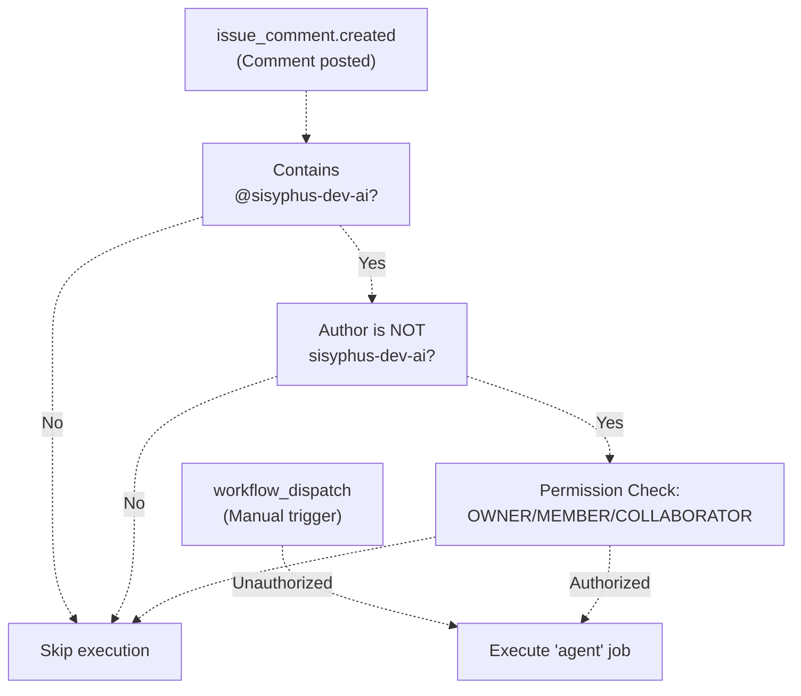
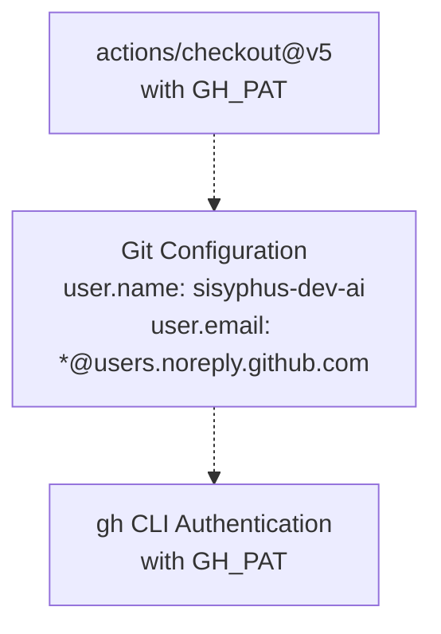
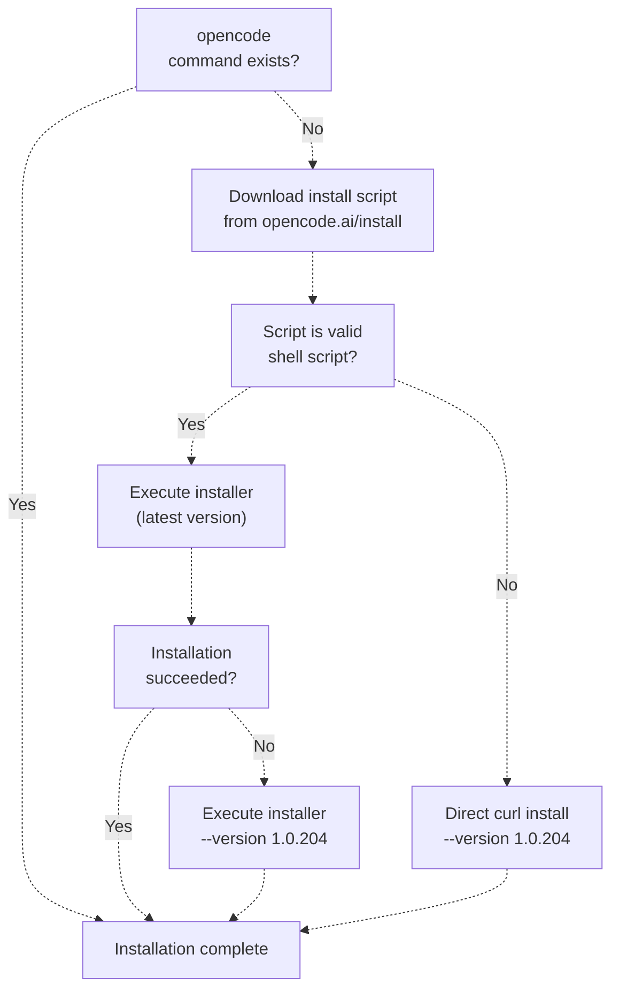
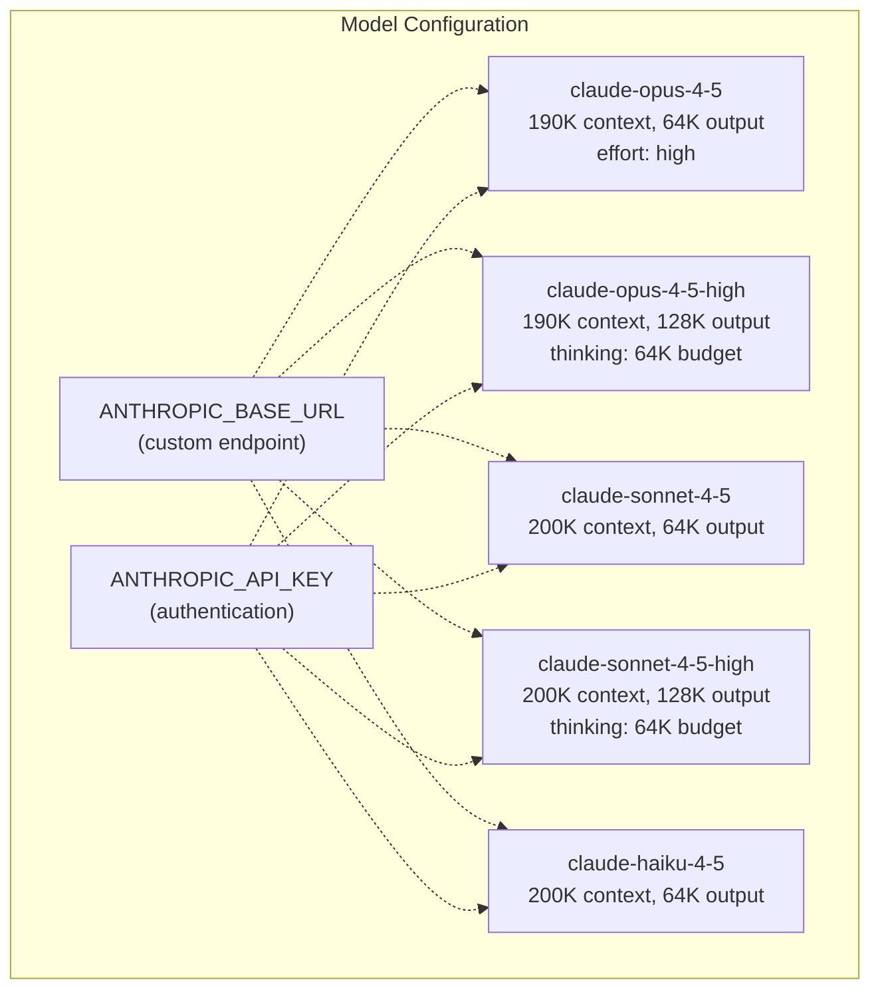
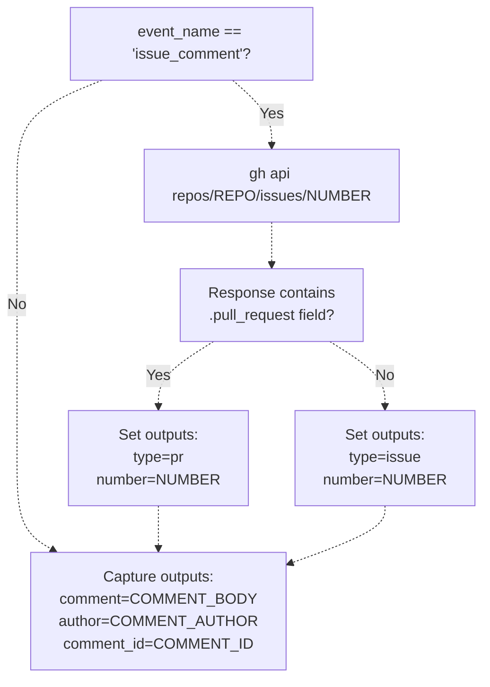
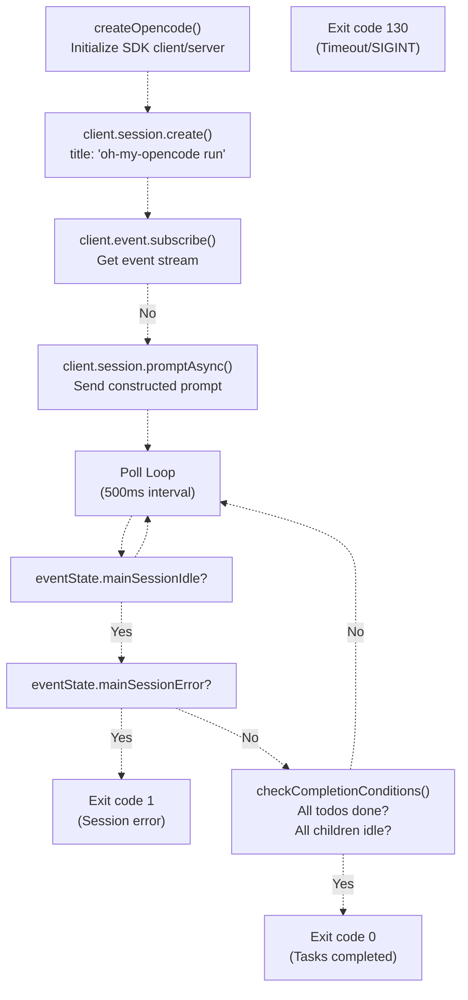
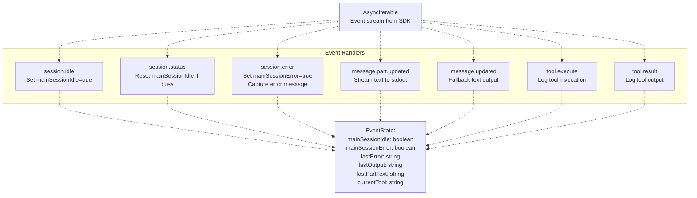
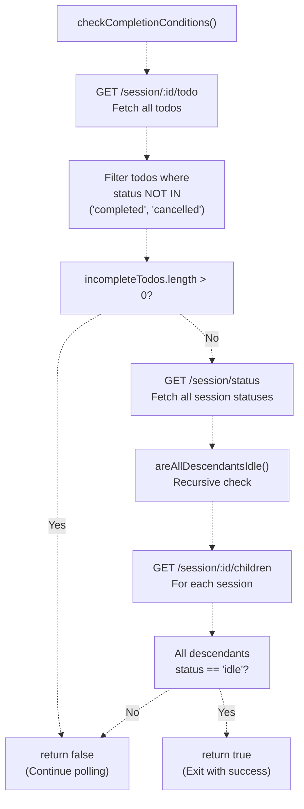
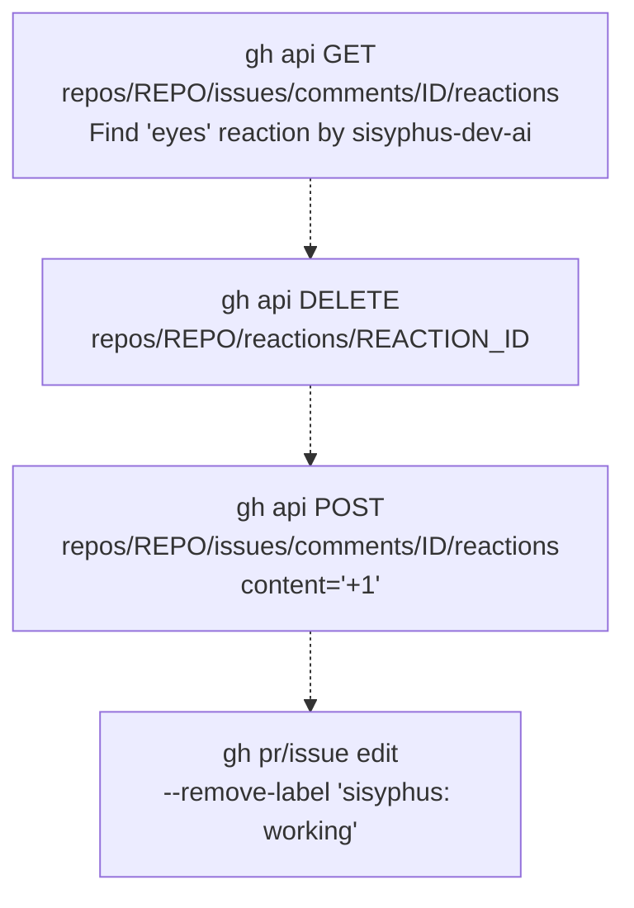

# Sisyphus Agent Workflow

> **Relevant source files**
> * [.github/workflows/sisyphus-agent.yml](https://github.com/code-yeongyu/oh-my-opencode/blob/b92cd6ab/.github/workflows/sisyphus-agent.yml)
> * [src/cli/run/completion.test.ts](https://github.com/code-yeongyu/oh-my-opencode/blob/b92cd6ab/src/cli/run/completion.test.ts)
> * [src/cli/run/completion.ts](https://github.com/code-yeongyu/oh-my-opencode/blob/b92cd6ab/src/cli/run/completion.ts)
> * [src/cli/run/events.test.ts](https://github.com/code-yeongyu/oh-my-opencode/blob/b92cd6ab/src/cli/run/events.test.ts)
> * [src/cli/run/events.ts](https://github.com/code-yeongyu/oh-my-opencode/blob/b92cd6ab/src/cli/run/events.ts)
> * [src/cli/run/index.ts](https://github.com/code-yeongyu/oh-my-opencode/blob/b92cd6ab/src/cli/run/index.ts)
> * [src/cli/run/runner.ts](https://github.com/code-yeongyu/oh-my-opencode/blob/b92cd6ab/src/cli/run/runner.ts)
> * [src/cli/run/types.ts](https://github.com/code-yeongyu/oh-my-opencode/blob/b92cd6ab/src/cli/run/types.ts)

The Sisyphus Agent Workflow is a GitHub Actions automation that enables the `@sisyphus-dev-ai` bot to execute autonomous coding tasks directly from issue and PR comments. This document covers the workflow trigger mechanism, environment setup, OpenCode configuration, task execution, and completion detection.

For information about Sisyphus as the primary orchestrator agent and its multi-phase workflow within a single session, see [Sisyphus Orchestrator](/code-yeongyu/oh-my-opencode/4.1-sisyphus-orchestrator). For details on the CLI run command architecture, see [CLI Run Command](/code-yeongyu/oh-my-opencode/10.2-cli-run-command).

## Workflow Overview

The Sisyphus Agent Workflow operates as a GitHub Actions job that:

1. Triggers on `@sisyphus-dev-ai` mentions in issue/PR comments
2. Sets up a complete development environment (Bun, tmux, OpenCode)
3. Builds oh-my-opencode from source
4. Configures custom Anthropic models with extended thinking capabilities
5. Executes an agent session with constructed prompts
6. Monitors completion via todo status and child session tracking
7. Pushes changes and updates GitHub reactions/labels

## Workflow Trigger System

### Trigger Conditions

The workflow activates under two scenarios defined in [.github/workflows/sisyphus-agent.yml L3-L22](https://github.com/code-yeongyu/oh-my-opencode/blob/b92cd6ab/.github/workflows/sisyphus-agent.yml#L3-L22)

:



**Sources:** [.github/workflows/sisyphus-agent.yml L3-L22](https://github.com/code-yeongyu/oh-my-opencode/blob/b92cd6ab/.github/workflows/sisyphus-agent.yml#L3-L22)

| Trigger Type | Condition | Authorization |
| --- | --- | --- |
| `workflow_dispatch` | Manual execution with optional custom prompt | No restrictions |
| `issue_comment` | Comment contains `@sisyphus-dev-ai` | Must be OWNER, MEMBER, or COLLABORATOR |

The authorization check prevents abuse from external contributors while allowing fork PRs to work (since `issue_comment` events receive secrets).

## Environment Setup Phase

### Repository and Authentication Configuration

The workflow begins by checking out the repository and configuring Git credentials as `sisyphus-dev-ai` [.github/workflows/sisyphus-agent.yml L29-L45](https://github.com/code-yeongyu/oh-my-opencode/blob/b92cd6ab/.github/workflows/sisyphus-agent.yml#L29-L45)

:



The `GH_PAT` (GitHub Personal Access Token) secret enables the bot to:

* Push commits to feature branches
* Create and update pull requests
* Add reactions to comments
* Modify issue/PR labels

**Sources:** [.github/workflows/sisyphus-agent.yml L29-L45](https://github.com/code-yeongyu/oh-my-opencode/blob/b92cd6ab/.github/workflows/sisyphus-agent.yml#L29-L45)

### Runtime Dependencies

The workflow installs system dependencies and caches Bun modules [.github/workflows/sisyphus-agent.yml L47-L70](https://github.com/code-yeongyu/oh-my-opencode/blob/b92cd6ab/.github/workflows/sisyphus-agent.yml#L47-L70)

:

| Dependency | Version | Purpose | Cache Key |
| --- | --- | --- | --- |
| tmux | Latest (apt) | Required by `interactive_bash` tool | N/A |
| Bun | Latest | Build system and runtime | `${{ runner.os }}-bun-${{ hashFiles('**/bun.lock') }}` |
| node_modules | N/A | JavaScript dependencies | Shared with Bun cache |

**Sources:** [.github/workflows/sisyphus-agent.yml L47-L70](https://github.com/code-yeongyu/oh-my-opencode/blob/b92cd6ab/.github/workflows/sisyphus-agent.yml#L47-L70)

### Build Local Plugin

The workflow builds oh-my-opencode from source [.github/workflows/sisyphus-agent.yml L73-L76](https://github.com/code-yeongyu/oh-my-opencode/blob/b92cd6ab/.github/workflows/sisyphus-agent.yml#L73-L76)

:

```
bun install
bun run build
```

This ensures the agent uses the latest code from the current commit, enabling the system to test and deploy its own changes.

**Sources:** [.github/workflows/sisyphus-agent.yml L73-L76](https://github.com/code-yeongyu/oh-my-opencode/blob/b92cd6ab/.github/workflows/sisyphus-agent.yml#L73-L76)

## OpenCode Installation and Configuration

### Installation Strategy with Fallback

The workflow implements a resilient installation strategy [.github/workflows/sisyphus-agent.yml L88-L102](https://github.com/code-yeongyu/oh-my-opencode/blob/b92cd6ab/.github/workflows/sisyphus-agent.yml#L88-L102)

:



The fallback mechanism handles network issues or corrupt downloads by pinning to version `1.0.204`, ensuring reliable CI execution.

**Sources:** [.github/workflows/sisyphus-agent.yml L88-L102](https://github.com/code-yeongyu/oh-my-opencode/blob/b92cd6ab/.github/workflows/sisyphus-agent.yml#L88-L102)

### Plugin Configuration Override

After running the standard installation, the workflow overrides the plugin reference to use the local build [.github/workflows/sisyphus-agent.yml L108-L113](https://github.com/code-yeongyu/oh-my-opencode/blob/b92cd6ab/.github/workflows/sisyphus-agent.yml#L108-L113)

:

```sql
OPENCODE_JSON=~/.config/opencode/opencode.json
REPO_PATH=$(pwd)
jq --arg path "file://$REPO_PATH/src/index.ts" '
  .plugin = [.plugin[] | select(. != "oh-my-opencode")] + [$path]
' "$OPENCODE_JSON" > /tmp/oc.json && mv /tmp/oc.json "$OPENCODE_JSON"
```

This `jq` command:

1. Removes any existing `oh-my-opencode` plugin entry
2. Adds a `file://` reference to the local source file
3. Enables hot-reloading from the working directory

**Sources:** [.github/workflows/sisyphus-agent.yml L108-L113](https://github.com/code-yeongyu/oh-my-opencode/blob/b92cd6ab/.github/workflows/sisyphus-agent.yml#L108-L113)

### Custom Anthropic Model Configuration

The workflow configures custom model definitions with extended capabilities [.github/workflows/sisyphus-agent.yml L115-L155](https://github.com/code-yeongyu/oh-my-opencode/blob/b92cd6ab/.github/workflows/sisyphus-agent.yml#L115-L155)

:



**Model Specifications:**

| Model ID | Display Name | Context Limit | Output Limit | Special Options |
| --- | --- | --- | --- | --- |
| `claude-opus-4-5-20251101` | Opus 4.5 | 190,000 | 64,000 | `effort: "high"` |
| `claude-opus-4-5-20251101` | Opus 4.5 High | 190,000 | 128,000 | `effort: "high"`, `thinking.budgetTokens: 64000` |
| `claude-sonnet-4-5-20250929` | Sonnet 4.5 | 200,000 | 64,000 | None |
| `claude-sonnet-4-5-20250929` | Sonnet 4.5 High | 200,000 | 128,000 | `thinking.budgetTokens: 64000` |
| `claude-haiku-4-5-20251001` | Haiku 4.5 | 200,000 | 64,000 | None |

The `-high` variants enable extended thinking mode with 64K token budgets for complex reasoning tasks.

**Sources:** [.github/workflows/sisyphus-agent.yml L115-L155](https://github.com/code-yeongyu/oh-my-opencode/blob/b92cd6ab/.github/workflows/sisyphus-agent.yml#L115-L155)

### GitHub Actions Environment Prompt

The workflow injects a custom prompt append to guide the agent's behavior in CI [.github/workflows/sisyphus-agent.yml L157-L222](https://github.com/code-yeongyu/oh-my-opencode/blob/b92cd6ab/.github/workflows/sisyphus-agent.yml#L157-L222)

:

Key behavioral rules enforced by the prompt:

* **Output mechanism:** All responses must use `gh issue comment` or `gh pr comment` (console not visible to user)
* **Heredoc syntax:** Code and backticks must use heredoc to prevent shell interpretation
* **Markdown formatting:** Strict 3-backtick code blocks with language identifiers
* **Git workflow:** Code changes require PRs (never push to main/master)
* **Setup requirement:** Run `bun install` before executing tasks
* **Communication protocol:** Acknowledge immediately, report when done

**Sources:** [.github/workflows/sisyphus-agent.yml L157-L222](https://github.com/code-yeongyu/oh-my-opencode/blob/b92cd6ab/.github/workflows/sisyphus-agent.yml#L157-L222)

### Authentication File Setup

The workflow writes the authentication configuration [.github/workflows/sisyphus-agent.yml L224-L226](https://github.com/code-yeongyu/oh-my-opencode/blob/b92cd6ab/.github/workflows/sisyphus-agent.yml#L224-L226)

:

```php
mkdir -p ~/.local/share/opencode
echo "$OPENCODE_AUTH_JSON" > ~/.local/share/opencode/auth.json
chmod 600 ~/.local/share/opencode/auth.json
```

This JSON blob contains OAuth tokens for Claude, Gemini, and ChatGPT providers.

**Sources:** [.github/workflows/sisyphus-agent.yml L224-L226](https://github.com/code-yeongyu/oh-my-opencode/blob/b92cd6ab/.github/workflows/sisyphus-agent.yml#L224-L226)

## Context Collection Phase

### Issue vs PR Detection

The workflow determines whether the comment originated from an issue or pull request [.github/workflows/sisyphus-agent.yml L230-L261](https://github.com/code-yeongyu/oh-my-opencode/blob/b92cd6ab/.github/workflows/sisyphus-agent.yml#L230-L261)

:



This detection is necessary because GitHub's `issue_comment` event fires for both issues and PRs. The workflow uses the GitHub API to check for the `.pull_request` field to disambiguate.

**Sources:** [.github/workflows/sisyphus-agent.yml L230-L261](https://github.com/code-yeongyu/oh-my-opencode/blob/b92cd6ab/.github/workflows/sisyphus-agent.yml#L230-L261)

### Status Indicators

The workflow adds visual indicators to show work in progress [.github/workflows/sisyphus-agent.yml L264-L291](https://github.com/code-yeongyu/oh-my-opencode/blob/b92cd6ab/.github/workflows/sisyphus-agent.yml#L264-L291)

:

| Indicator | Type | Timing | Purpose |
| --- | --- | --- | --- |
| 👀 (eyes) | Reaction on comment | Before execution | Acknowledge receipt |
| `sisyphus: working` | Label on issue/PR | Before execution | Show active status |
| 👍 (thumbs up) | Reaction on comment | After execution | Confirm completion |
| Remove label | Label removal | After execution | Clear active status |

**Sources:** [.github/workflows/sisyphus-agent.yml L264-L291](https://github.com/code-yeongyu/oh-my-opencode/blob/b92cd6ab/.github/workflows/sisyphus-agent.yml#L264-L291)

## Task Execution via CLI Run Command

### Prompt Construction

The workflow constructs a context-aware prompt with placeholders [.github/workflows/sisyphus-agent.yml L305-L330](https://github.com/code-yeongyu/oh-my-opencode/blob/b92cd6ab/.github/workflows/sisyphus-agent.yml#L305-L330)

:

```sql
Your username is @sisyphus-dev-ai, mentioned by @AUTHOR_PLACEHOLDER in REPO_PLACEHOLDER.

## Context
- Type: TYPE_PLACEHOLDER
- Number: #NUMBER_PLACEHOLDER
- Repository: REPO_PLACEHOLDER
- Default Branch: BRANCH_PLACEHOLDER

## User's Request
COMMENT_PLACEHOLDER

---

Write everything using the todo tools.
Then investigate and satisfy the request. Only if user requested to you to work explicitely, then use plan agent to plan, todo obsessivley then create a PR to `BRANCH_PLACEHOLDER` branch.
When done, report the result to the issue/PR with `gh issue comment NUMBER_PLACEHOLDER` or `gh pr comment NUMBER_PLACEHOLDER`.
```

The placeholders are replaced with actual values via bash parameter expansion:

* `AUTHOR_PLACEHOLDER` → Comment author's username
* `REPO_PLACEHOLDER` → Repository name (e.g., `code-yeongyu/oh-my-opencode`)
* `TYPE_PLACEHOLDER` → `issue` or `pr`
* `NUMBER_PLACEHOLDER` → Issue/PR number
* `BRANCH_PLACEHOLDER` → Default branch name (usually `main` or `master`)
* `COMMENT_PLACEHOLDER` → Full comment body

**Sources:** [.github/workflows/sisyphus-agent.yml L305-L330](https://github.com/code-yeongyu/oh-my-opencode/blob/b92cd6ab/.github/workflows/sisyphus-agent.yml#L305-L330)

### CLI Run Invocation

The workflow executes the agent session using the CLI run command [.github/workflows/sisyphus-agent.yml L332](https://github.com/code-yeongyu/oh-my-opencode/blob/b92cd6ab/.github/workflows/sisyphus-agent.yml#L332-L332)

:

```
stdbuf -oL -eL bun run dist/cli/index.js run "$PROMPT"
```

The `stdbuf -oL -eL` disables output buffering for real-time log streaming in GitHub Actions.

**Sources:** [.github/workflows/sisyphus-agent.yml L332](https://github.com/code-yeongyu/oh-my-opencode/blob/b92cd6ab/.github/workflows/sisyphus-agent.yml#L332-L332)

## Session Monitoring and Completion Detection

### CLI Run Architecture

The CLI run command initializes an OpenCode session and monitors it until completion [src/cli/run/runner.ts L10-L121](https://github.com/code-yeongyu/oh-my-opencode/blob/b92cd6ab/src/cli/run/runner.ts#L10-L121)

:



**Sources:** [src/cli/run/runner.ts L10-L121](https://github.com/code-yeongyu/oh-my-opencode/blob/b92cd6ab/src/cli/run/runner.ts#L10-L121)

### Event Processing System

The CLI processes OpenCode events to track session state [src/cli/run/events.ts L34-L62](https://github.com/code-yeongyu/oh-my-opencode/blob/b92cd6ab/src/cli/run/events.ts#L34-L62)

:



**Key Event Types:**

| Event Type | Properties Used | State Update | Console Output |
| --- | --- | --- | --- |
| `session.idle` | `sessionID` | `mainSessionIdle = true` | Dim log line |
| `session.status` | `sessionID`, `status.type` | Reset if `busy` | Dim log line |
| `session.error` | `sessionID`, `error` | `mainSessionError = true` | Red error message |
| `message.part.updated` | `info.sessionID`, `part.text` | Incremental text | Direct stdout |
| `message.updated` | `info.sessionID`, `content` | Full content | Fallback stdout |
| `tool.execute` | `sessionID`, `name`, `input` | `currentTool = name` | Cyan tool name + preview |
| `tool.result` | `sessionID`, `output` | `currentTool = null` | Dim output preview |

**Sources:** [src/cli/run/events.ts L34-L62](https://github.com/code-yeongyu/oh-my-opencode/blob/b92cd6ab/src/cli/run/events.ts#L34-L62)

 [src/cli/run/events.ts L133-L275](https://github.com/code-yeongyu/oh-my-opencode/blob/b92cd6ab/src/cli/run/events.ts#L133-L275)

### Completion Conditions

The `checkCompletionConditions` function determines if execution can terminate [src/cli/run/completion.ts L4-L19](https://github.com/code-yeongyu/oh-my-opencode/blob/b92cd6ab/src/cli/run/completion.ts#L4-L19)

:



**Completion Criteria:**

1. **All todos complete:** No todos with status `in_progress`, `blocked`, or `pending`
2. **All children idle:** Recursive check ensuring all descendant sessions have `status.type == "idle"`

This prevents premature termination when:

* Sisyphus has spawned background agents (Librarian, Explore)
* Frontend engineer is still working on UI changes
* Nested agent delegations are in progress

**Sources:** [src/cli/run/completion.ts L4-L79](https://github.com/code-yeongyu/oh-my-opencode/blob/b92cd6ab/src/cli/run/completion.ts#L4-L79)

## Post-Execution Handling

### Change Persistence

The workflow commits and pushes any changes made by the agent [.github/workflows/sisyphus-agent.yml L335-L348](https://github.com/code-yeongyu/oh-my-opencode/blob/b92cd6ab/.github/workflows/sisyphus-agent.yml#L335-L348)

:

```
if [[ -n "$(git status --porcelain)" ]]; then
  git add -A
  git commit -m "chore: changes by sisyphus-dev-ai" || true
fi

BRANCH=$(git branch --show-current)
if [[ "$BRANCH" != "main" && "$BRANCH" != "master" ]]; then
  git push origin "$BRANCH" || true
fi
```

**Safety Mechanism:** The workflow explicitly checks that it's not on `main` or `master` before pushing. This prevents accidental direct commits to protected branches.

**Sources:** [.github/workflows/sisyphus-agent.yml L335-L348](https://github.com/code-yeongyu/oh-my-opencode/blob/b92cd6ab/.github/workflows/sisyphus-agent.yml#L335-L348)

### Status Update and Cleanup

The workflow updates GitHub indicators to reflect completion [.github/workflows/sisyphus-agent.yml L350-L376](https://github.com/code-yeongyu/oh-my-opencode/blob/b92cd6ab/.github/workflows/sisyphus-agent.yml#L350-L376)

:



**Status Transition:**

| Stage | Comment Reaction | Issue/PR Label | Meaning |
| --- | --- | --- | --- |
| Before execution | 👀 (eyes) | `sisyphus: working` | Work in progress |
| After execution | 👍 (thumbs up) | Label removed | Work completed |

This provides visual feedback to users without requiring them to read logs.

**Sources:** [.github/workflows/sisyphus-agent.yml L350-L376](https://github.com/code-yeongyu/oh-my-opencode/blob/b92cd6ab/.github/workflows/sisyphus-agent.yml#L350-L376)

## Error Handling and Resilience

### Session Error Detection

The CLI immediately exits with code 1 if the session encounters an error [src/cli/run/runner.ts L91-L96](https://github.com/code-yeongyu/oh-my-opencode/blob/b92cd6ab/src/cli/run/runner.ts#L91-L96)

:

```
if (eventState.mainSessionError) {
  console.error(pc.red(`\n\nSession ended with error: ${eventState.lastError}`))
  console.error(pc.yellow("Check if todos were completed before the error."))
  cleanup()
  process.exit(1)
}
```

This prevents the workflow from waiting indefinitely when the session has failed due to API errors, rate limits, or internal exceptions.

**Sources:** [src/cli/run/runner.ts L91-L96](https://github.com/code-yeongyu/oh-my-opencode/blob/b92cd6ab/src/cli/run/runner.ts#L91-L96)

### Timeout Configuration

The CLI supports an optional timeout parameter (default 0 = no timeout) [src/cli/run/runner.ts L24-L29](https://github.com/code-yeongyu/oh-my-opencode/blob/b92cd6ab/src/cli/run/runner.ts#L24-L29)

:

```javascript
if (timeout > 0) {
  timeoutId = setTimeout(() => {
    console.log(pc.yellow("\nTimeout reached. Aborting..."))
    abortController.abort()
  }, timeout)
}
```

The GitHub Actions workflow does not set a timeout, allowing long-running tasks to complete naturally. GitHub Actions has a default 6-hour job timeout as a failsafe.

**Sources:** [src/cli/run/runner.ts L24-L29](https://github.com/code-yeongyu/oh-my-opencode/blob/b92cd6ab/src/cli/run/runner.ts#L24-L29)

### Always Run Cleanup

The post-execution steps use `if: always()` to ensure they run even if the agent task fails [.github/workflows/sisyphus-agent.yml L336-L351](https://github.com/code-yeongyu/oh-my-opencode/blob/b92cd6ab/.github/workflows/sisyphus-agent.yml#L336-L351)

:

```sql
- name: Push changes
  if: always()
  # ... push logic ...

- name: Update reaction and remove label
  if: always()
  # ... cleanup logic ...
```

This guarantees that:

* Any partial work gets committed and pushed
* GitHub indicators get updated to remove "working" status
* Users receive feedback about completion or failure

**Sources:** [.github/workflows/sisyphus-agent.yml L336-L351](https://github.com/code-yeongyu/oh-my-opencode/blob/b92cd6ab/.github/workflows/sisyphus-agent.yml#L336-L351)

## Integration with Sisyphus Orchestrator

### System Prompt Injection

The GitHub Actions environment prompt is injected into Sisyphus's `prompt_append` field [.github/workflows/sisyphus-agent.yml L222](https://github.com/code-yeongyu/oh-my-opencode/blob/b92cd6ab/.github/workflows/sisyphus-agent.yml#L222-L222)

 which gets appended to Sisyphus's base system prompt when the agent initializes. This ensures all GitHub-specific behavior rules are active from the start.

### Todo-Driven Execution

The constructed prompt explicitly instructs: "Write everything using the todo tools" [.github/workflows/sisyphus-agent.yml L320](https://github.com/code-yeongyu/oh-my-opencode/blob/b92cd6ab/.github/workflows/sisyphus-agent.yml#L320-L320)

 This forces Sisyphus to decompose the task into trackable todos, enabling the CLI's completion detection to work correctly via the `client.session.todo()` API.

### PR Creation Workflow

The prompt includes conditional instructions: "Only if user requested to you to work explicitly, then use plan agent to plan, todo obsessively then create a PR" [.github/workflows/sisyphus-agent.yml L321](https://github.com/code-yeongyu/oh-my-opencode/blob/b92cd6ab/.github/workflows/sisyphus-agent.yml#L321-L321)

 This prevents Sisyphus from creating unnecessary PRs for informational queries while ensuring code changes follow proper review workflows.

**Sources:** [.github/workflows/sisyphus-agent.yml L157-L330](https://github.com/code-yeongyu/oh-my-opencode/blob/b92cd6ab/.github/workflows/sisyphus-agent.yml#L157-L330)