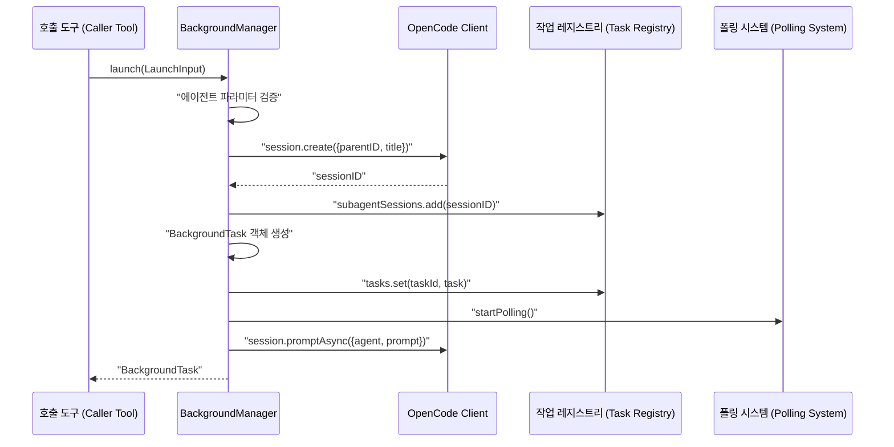
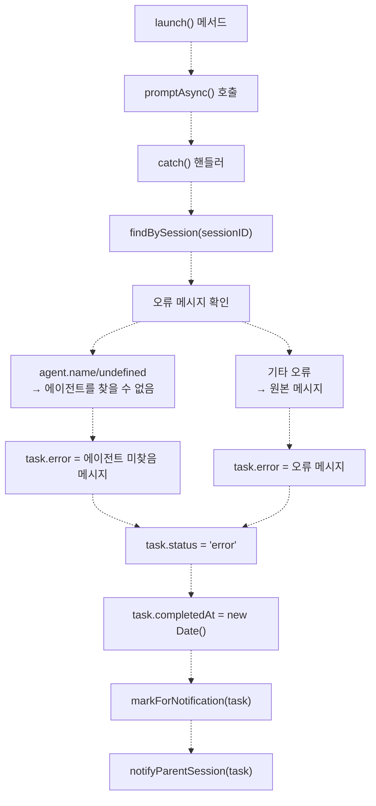
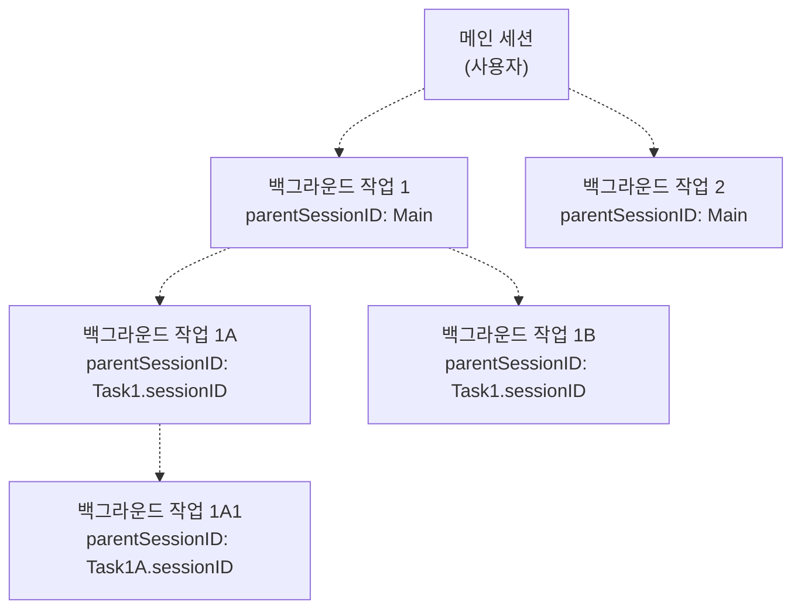
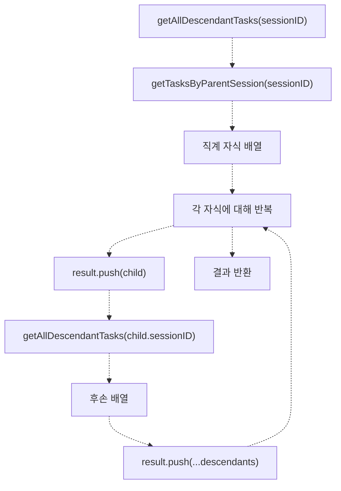
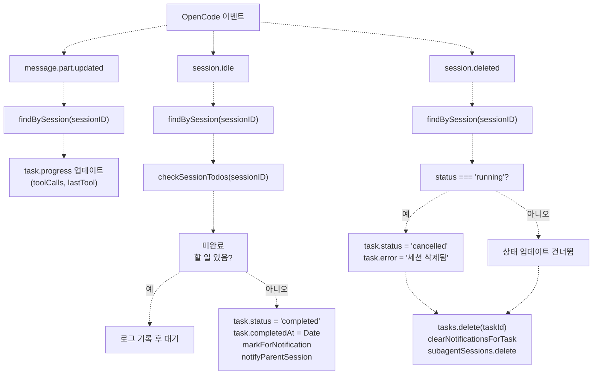
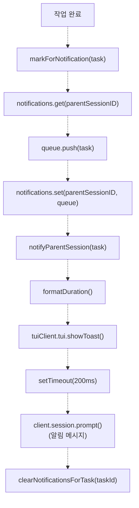
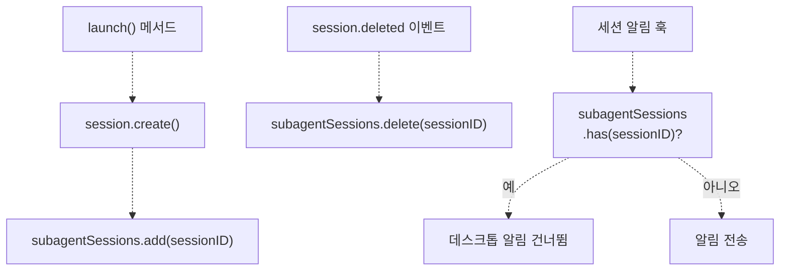

# 백그라운드 매니저 (Background Manager)

> **관련 소스 파일**
> * [.opencode/background-tasks.json](https://github.com/code-yeongyu/oh-my-opencode/blob/b92cd6ab/.opencode/background-tasks.json)
> * [src/features/background-agent/index.ts](https://github.com/code-yeongyu/oh-my-opencode/blob/b92cd6ab/src/features/background-agent/index.ts)
> * [src/features/background-agent/manager.test.ts](https://github.com/code-yeongyu/oh-my-opencode/blob/b92cd6ab/src/features/background-agent/manager.test.ts)
> * [src/features/background-agent/manager.ts](https://github.com/code-yeongyu/oh-my-opencode/blob/b92cd6ab/src/features/background-agent/manager.ts)
> * [src/features/background-agent/types.ts](https://github.com/code-yeongyu/oh-my-opencode/blob/b92cd6ab/src/features/background-agent/types.ts)
> * [src/tools/background-task/tools.ts](https://github.com/code-yeongyu/oh-my-opencode/blob/b92cd6ab/src/tools/background-task/tools.ts)
> * [src/tools/call-omo-agent/tools.ts](https://github.com/code-yeongyu/oh-my-opencode/blob/b92cd6ab/src/tools/call-omo-agent/tools.ts)

Background Manager는 oh-my-opencode에서 비동기 작업 실행을 담당하는 핵심 오케스트레이터(orchestrator)입니다. 이 시스템은 백그라운드 에이전트 세션의 생명주기(lifecycle)를 관리하고, 실행 중이거나 완료된 작업의 레지스트리(registry)를 유지하며, 계층적인 작업 관계를 추적하고, 작업 완료 시 알림을 조정합니다. 이를 통해 메인 세션이 계속 진행되는 동안 독립적으로 실행되는 특화된 에이전트에게 작업을 위임하여 병렬 에이전트 실행을 가능하게 합니다.

폴링(polling) 메커니즘 및 작업 완료 감지에 대한 정보는 [작업 실행 및 폴링 (Task Execution and Polling)](/code-yeongyu/oh-my-opencode/6.2-task-execution-and-polling)을 참조하십시오. 부모 세션 알림 및 데스크톱 경고에 대한 자세한 내용은 [알림 시스템 (Notification System)](/code-yeongyu/oh-my-opencode/6.3-notification-system)을 참조하십시오.

**소스:** [src/features/background-agent/manager.ts L55-L442](https://github.com/code-yeongyu/oh-my-opencode/blob/b92cd6ab/src/features/background-agent/manager.ts#L55-L442)

## 클래스 구조 및 책임

`BackgroundManager` 클래스는 백그라운드 실행 시스템의 중심 구성 요소로, 백그라운드 작업의 생성, 추적 및 생명주기 관리를 책임집니다.

### 핵심 데이터 구조

매니저는 두 가지 주요 데이터 구조를 유지합니다:

| 데이터 구조 | 타입 | 용도 |
| --- | --- | --- |
| `tasks` | `Map<string, BackgroundTask>` | 작업 ID로 인덱싱된 모든 백그라운드 작업의 레지스트리 |
| `notifications` | `Map<string, BackgroundTask[]>` | 알림을 대기 중인 완료된 작업 큐, 부모 세션 ID로 인덱싱됨 |
| `client` | `OpencodeClient` | 세션 및 메시지 작업을 위한 OpenCode API 클라이언트 |
| `directory` | `string` | 플러그인 컨텍스트의 작업 디렉토리 |
| `pollingInterval` | `Timer` | 실행 중인 작업 상태를 폴링하기 위한 인터벌 타이머 |

**소스:** [src/features/background-agent/manager.ts L55-L67](https://github.com/code-yeongyu/oh-my-opencode/blob/b92cd6ab/src/features/background-agent/manager.ts#L55-L67)

### BackgroundTask 인터페이스

```mermaid
flowchart TD

BackgroundTask["BackgroundTask"]
id["id: string<br>(bg_[uuid])"]
sessionID["sessionID: string<br>(OpenCode 세션)"]
parentSessionID["parentSessionID: string<br>(호출자 세션)"]
parentMessageID["parentMessageID: string<br>(트리거 메시지)"]
description["description: string<br>(짧은 설명)"]
prompt["prompt: string<br>(전체 작업 내용)"]
agent["agent: string<br>(에이전트 유형)"]
status["status: TaskStatus<br>(실행 중/완료/오류/취소됨)"]
startedAt["startedAt: Date"]
completedAt["completedAt?: Date"]
progress["progress?: ProgressInfo<br>(toolCalls, lastTool, lastMessage)"]
error["error?: string"]

BackgroundTask -.-> id
BackgroundTask -.-> sessionID
BackgroundTask -.-> parentSessionID
BackgroundTask -.-> parentMessageID
BackgroundTask -.-> description
BackgroundTask -.-> prompt
BackgroundTask -.-> agent
BackgroundTask -.-> status
BackgroundTask -.-> startedAt
BackgroundTask -.-> completedAt
BackgroundTask -.-> progress
BackgroundTask -.-> error
```



**다이어그램: BackgroundTask 데이터 구조**

**소스:** [src/features/background-agent/types.ts](https://github.com/code-yeongyu/oh-my-opencode/blob/b92cd6ab/src/features/background-agent/types.ts)

 [src/features/background-agent/manager.ts L88-L102](https://github.com/code-yeongyu/oh-my-opencode/blob/b92cd6ab/src/features/background-agent/manager.ts#L88-L102)

## 작업 생명주기 관리

### 작업 생성 및 실행

`launch` 메서드는 OpenCode 세션을 생성하고 이를 작업 레지스트리에 등록하여 새로운 백그라운드 작업을 시작합니다.



**다이어그램: 작업 실행 시퀀스**

**소스:** [src/features/background-agent/manager.ts L69-L137](https://github.com/code-yeongyu/oh-my-opencode/blob/b92cd6ab/src/features/background-agent/manager.ts#L69-L137)

### 작업 상태 전환

작업은 다음과 같은 상태를 거쳐 진행됩니다:

| 상태 | 설명 | 전환 가능 상태 |
| --- | --- | --- |
| `running` | 작업이 활발히 실행 중임 | `completed`, `error`, `cancelled` |
| `completed` | 작업이 성공적으로 종료됨 | (최종 상태) |
| `error` | 작업 중 오류가 발생함 | (최종 상태) |
| `cancelled` | 작업이 명시적으로 취소되었거나 세션이 삭제됨 | (최종 상태) |

작업은 다음 조건에서 `completed` 상태로 전환됩니다:

1. 세션이 유휴 상태가 됨 (`session.idle` 이벤트)
2. 완료되지 않은 할 일(todo)이 남아있지 않음 (`checkSessionTodos`가 false를 반환)
3. 폴링 결과, 할 일이 없는 유휴 상태가 감지됨

작업은 다음 조건에서 `error` 상태로 전환됩니다:

1. 실행 중 `promptAsync`에서 예외가 발생함
2. 에이전트 이름이 유효하지 않거나 정의되지 않음

작업은 다음 조건에서 `cancelled` 상태로 전환됩니다:

1. `background_cancel` 도구를 통해 명시적으로 취소됨
2. 세션이 삭제됨 (`session.deleted` 이벤트)

**소스:** [src/features/background-agent/manager.ts L217-L236](https://github.com/code-yeongyu/oh-my-opencode/blob/b92cd6ab/src/features/background-agent/manager.ts#L217-L236)

 [src/features/background-agent/manager.ts L238-L256](https://github.com/code-yeongyu/oh-my-opencode/blob/b92cd6ab/src/features/background-agent/manager.ts#L238-L256)

### 오류 처리

매니저는 두 가지 수준에서 오류 처리를 구현합니다:



**다이어그램: 오류 처리 흐름**

**소스:** [src/features/background-agent/manager.ts L119-L134](https://github.com/code-yeongyu/oh-my-opencode/blob/b92cd6ab/src/features/background-agent/manager.ts#L119-L134)

## 계층적 작업 추적

Background Manager는 백그라운드 작업이 자체적으로 하위 작업을 생성할 수 있는 계층적 작업 관계를 지원합니다.

### 작업 계층 구조



**다이어그램: 계층적 작업 구조**

### 조회 메서드

매니저는 작업 계층 구조를 쿼리하기 위한 세 가지 메서드를 제공합니다:

| 메서드 | 반환값 | 사용 사례 |
| --- | --- | --- |
| `getTask(id)` | ID에 해당하는 단일 작업 | 특정 작업 조회 |
| `getTasksByParentSession(sessionID)` | 직계 자식 작업만 반환 | 즉각적인 하위 작업 확인 |
| `getAllDescendantTasks(sessionID)` | 모든 후손 작업 (재귀적) | 관련된 모든 작업 취소 |

**소스:** [src/features/background-agent/manager.ts L139-L173](https://github.com/code-yeongyu/oh-my-opencode/blob/b92cd6ab/src/features/background-agent/manager.ts#L139-L173)

### 재귀적 후손 수집

`getAllDescendantTasks` 메서드는 깊이 우선 탐색(depth-first traversal)을 구현합니다:



**다이어그램: 재귀적 작업 수집**

이를 통해 전체 하위 트리를 수집함으로써 "이 세션에서 생성된 모든 작업 취소"와 같은 작업을 수행할 수 있습니다.

**소스:** [src/features/background-agent/manager.ts L153-L164](https://github.com/code-yeongyu/oh-my-opencode/blob/b92cd6ab/src/features/background-agent/manager.ts#L153-L164)

 [src/features/background-agent/manager.test.ts L51-L232](https://github.com/code-yeongyu/oh-my-opencode/blob/b92cd6ab/src/features/background-agent/manager.test.ts#L51-L232)

## 이벤트 기반 상태 관리

Background Manager는 OpenCode 생명주기 이벤트에 응답하여 작업 상태를 업데이트하고 알림을 트리거합니다.

### 이벤트 처리



**다이어그램: 이벤트 처리 로직**

**소스:** [src/features/background-agent/manager.ts L192-L256](https://github.com/code-yeongyu/oh-my-opencode/blob/b92cd6ab/src/features/background-agent/manager.ts#L192-L256)

### 세션 할 일(Todo) 통합

매니저는 작업이 조기에 완료되는 것을 방지하기 위해 할 일 연속 실행 시스템(todo continuation system)과 협력합니다:

```javascript
// manager.ts:175-190 발췌
private async checkSessionTodos(sessionID: string): Promise<boolean> {
  const response = await this.client.session.todo({path: {id: sessionID}})
  const todos = (response.data ?? response) as Todo[]
  if (!todos || todos.length === 0) return false
  
  const incomplete = todos.filter(
    (t) => t.status !== "completed" && t.status !== "cancelled"
  )
  return incomplete.length > 0
}
```

이를 통해 세션이 유휴 상태로 표시되더라도 미완료된 할 일이 남아있는 경우, 할 일 연속 실행 시스템이 이를 처리할 때까지 작업이 실행 상태로 유지되도록 보장합니다.

**소스:** [src/features/background-agent/manager.ts L175-L190](https://github.com/code-yeongyu/oh-my-opencode/blob/b92cd6ab/src/features/background-agent/manager.ts#L175-L190)

 [src/features/background-agent/manager.ts L224-L228](https://github.com/code-yeongyu/oh-my-opencode/blob/b92cd6ab/src/features/background-agent/manager.ts#L224-L228)

## 알림 큐 관리

매니저는 작업 완료와 부모 알림을 분리하기 위해 별도의 알림 큐를 유지합니다.

### 알림 흐름



**다이어그램: 알림 큐 흐름**

**소스:** [src/features/background-agent/manager.ts L258-L339](https://github.com/code-yeongyu/oh-my-opencode/blob/b92cd6ab/src/features/background-agent/manager.ts#L258-L339)

### 알림 큐 작업

| 메서드 | 용도 | 부수 효과 |
| --- | --- | --- |
| `markForNotification(task)` | 부모의 알림 큐에 작업 추가 | 필요 시 큐 생성 |
| `getPendingNotifications(sessionID)` | 세션의 대기 중인 알림 조회 | 읽기 전용 |
| `clearNotifications(sessionID)` | 세션의 모든 알림 삭제 | 큐 항목 제거 |
| `clearNotificationsForTask(taskId)` | 모든 큐에서 특정 작업 제거 | 모든 큐 스캔 |

**소스:** [src/features/background-agent/manager.ts L258-L281](https://github.com/code-yeongyu/oh-my-opencode/blob/b92cd6ab/src/features/background-agent/manager.ts#L258-L281)

## 서브에이전트 세션 추적

매니저는 백그라운드 세션을 사용자 세션과 구별하기 위해 전역 `subagentSessions` 셋(set)과 통합됩니다.



**다이어그램: 서브에이전트 세션 생명주기**

이는 백그라운드 에이전트 세션이 완료될 때 데스크톱 알림이 전송되는 것을 방지합니다. 백그라운드 세션은 이미 `notifyParentSession`을 통해 자체적인 알림 메커니즘을 가지고 있기 때문입니다.

**소스:** [src/features/background-agent/manager.ts L86](https://github.com/code-yeongyu/oh-my-opencode/blob/b92cd6ab/src/features/background-agent/manager.ts#L86-L86)

 [src/features/background-agent/manager.ts L254](https://github.com/code-yeongyu/oh-my-opencode/blob/b92cd6ab/src/features/background-agent/manager.ts#L254-L254)

 [src/features/claude-code-session-state.ts](https://github.com/code-yeongyu/oh-my-opencode/blob/b92cd6ab/src/features/claude-code-session-state.ts)

 [src/hooks/session-notification.ts L244](https://github.com/code-yeongyu/oh-my-opencode/blob/b92cd6ab/src/hooks/session-notification.ts#L244-L244)

## 통합 지점

### 도구 통합

Background Manager는 크게 두 가지 도구 카테고리에서 사용됩니다:

**직접 백그라운드 실행:**

* `background_task` 도구: 일반적인 백그라운드 작업 생성
* `call_omo_agent` 도구 (백그라운드 모드): 특화된 에이전트 위임

**작업 관리:**

* `background_output` 도구: 레지스트리에서 작업 상태 쿼리
* `background_cancel` 도구: 작업 취소 및 레지스트리 업데이트

**소스:** [src/tools/background-task/tools.ts L23-L63](https://github.com/code-yeongyu/oh-my-opencode/blob/b92cd6ab/src/tools/background-task/tools.ts#L23-L63)

 [src/tools/call-omo-agent/tools.ts L48-L78](https://github.com/code-yeongyu/oh-my-opencode/blob/b92cd6ab/src/tools/call-omo-agent/tools.ts#L48-L78)

### OpenCode 클라이언트 API 사용

매니저는 다음과 같은 OpenCode 클라이언트 API를 사용합니다:

| API 메서드 | 용도 | 사용 위치 |
| --- | --- | --- |
| `session.create` | 백그라운드 세션 생성 | `launch()` |
| `session.promptAsync` | 대기 없이 프롬프트 전송 | `launch()` |
| `session.status` | 모든 세션 상태 가져오기 | `pollRunningTasks()` |
| `session.messages` | 세션 메시지 조회 | `pollRunningTasks()` |
| `session.todo` | 미완료 할 일 확인 | `checkSessionTodos()` |
| `session.prompt` | 알림 프롬프트 전송 | `notifyParentSession()` |
| `session.abort` | 실행 중인 세션 취소 | (`background_cancel` 도구를 통해) |

**소스:** [src/features/background-agent/manager.ts L74-L79](https://github.com/code-yeongyu/oh-my-opencode/blob/b92cd6ab/src/features/background-agent/manager.ts#L74-L79)

 [src/features/background-agent/manager.ts L109-L134](https://github.com/code-yeongyu/oh-my-opencode/blob/b92cd6ab/src/features/background-agent/manager.ts#L109-L134)

 [src/features/background-agent/manager.ts L177-L189](https://github.com/code-yeongyu/oh-my-opencode/blob/b92cd6ab/src/features/background-agent/manager.ts#L177-L189)

 [src/features/background-agent/manager.ts L325-L332](https://github.com/code-yeongyu/oh-my-opencode/blob/b92cd6ab/src/features/background-agent/manager.ts#L325-L332)

 [src/features/background-agent/manager.ts L362-L441](https://github.com/code-yeongyu/oh-my-opencode/blob/b92cd6ab/src/features/background-agent/manager.ts#L362-L441)

### 생성자 및 초기화

```typescript
// manager.ts:62-67 발췌
constructor(ctx: PluginInput) {
  this.tasks = new Map()
  this.notifications = new Map()
  this.client = ctx.client
  this.directory = ctx.directory
}
```

매니저는 플러그인 생명주기당 한 번 인스턴스화되며, 클라이언트 API와 작업 디렉토리를 제공하는 OpenCode 플러그인 컨텍스트를 전달받습니다.

**소스:** [src/features/background-agent/manager.ts L62-L67](https://github.com/code-yeongyu/oh-my-opencode/blob/b92cd6ab/src/features/background-agent/manager.ts#L62-L67)