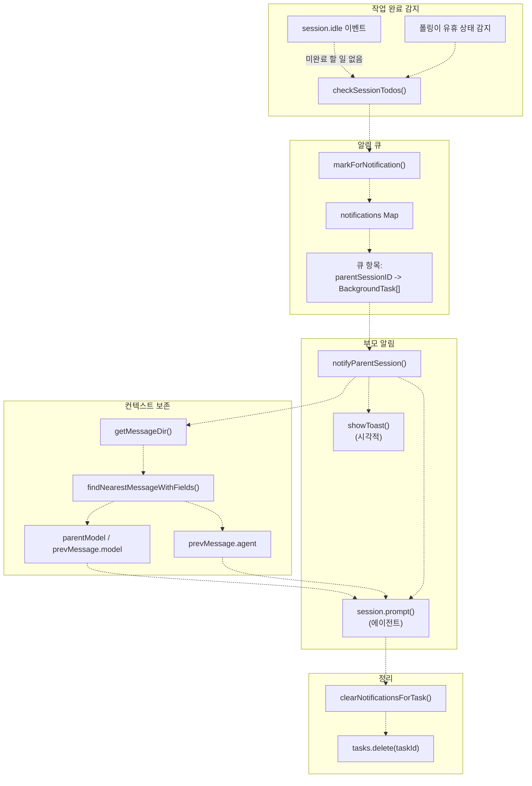
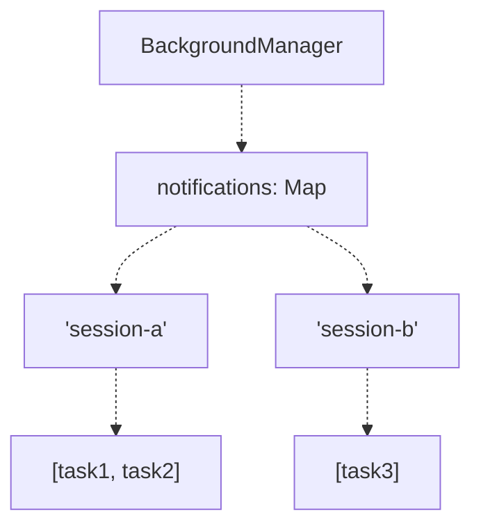
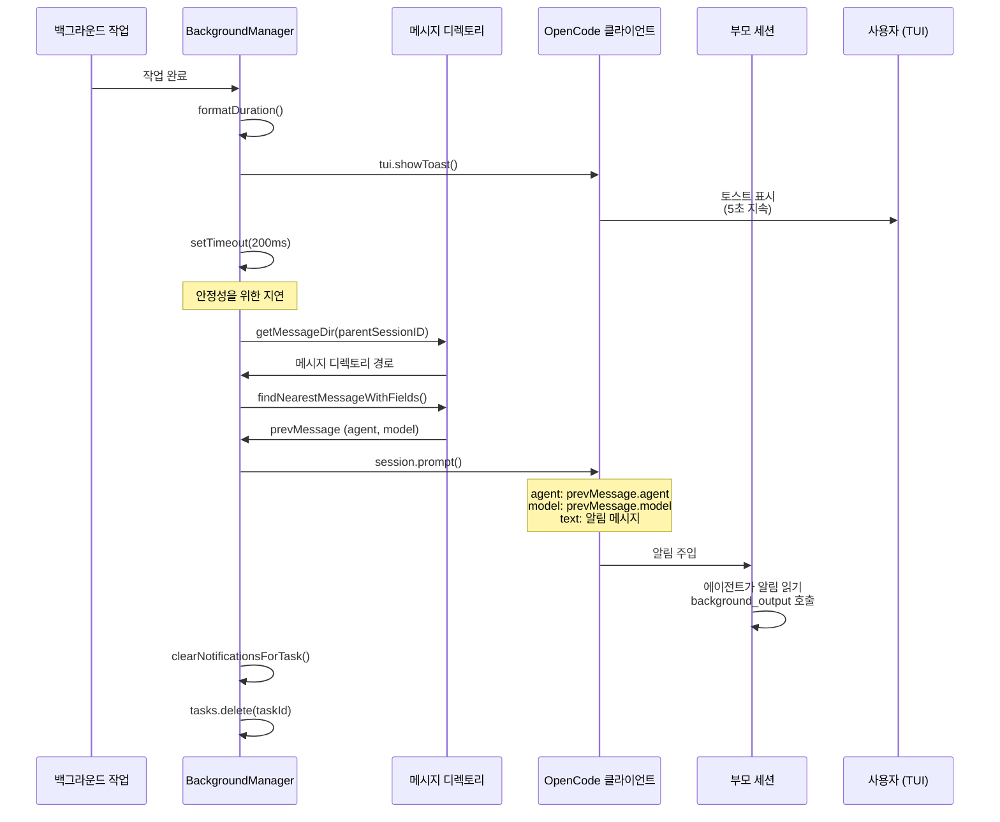
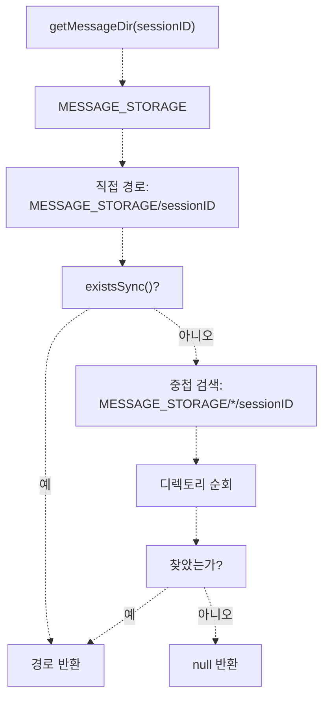
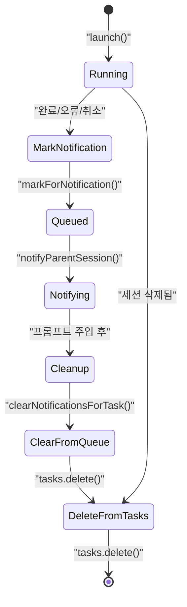

# 알림 시스템 (Notification System)

> **관련 소스 파일**
> * [.opencode/background-tasks.json](https://github.com/code-yeongyu/oh-my-opencode/blob/b92cd6ab/.opencode/background-tasks.json)
> * [src/features/background-agent/index.ts](https://github.com/code-yeongyu/oh-my-opencode/blob/b92cd6ab/src/features/background-agent/index.ts)
> * [src/features/background-agent/manager.test.ts](https://github.com/code-yeongyu/oh-my-opencode/blob/b92cd6ab/src/features/background-agent/manager.test.ts)
> * [src/features/background-agent/manager.ts](https://github.com/code-yeongyu/oh-my-opencode/blob/b92cd6ab/src/features/background-agent/manager.ts)
> * [src/features/background-agent/types.ts](https://github.com/code-yeongyu/oh-my-opencode/blob/b92cd6ab/src/features/background-agent/types.ts)
> * [src/tools/background-task/tools.ts](https://github.com/code-yeongyu/oh-my-opencode/blob/b92cd6ab/src/tools/background-task/tools.ts)
> * [src/tools/call-omo-agent/tools.ts](https://github.com/code-yeongyu/oh-my-opencode/blob/b92cd6ab/src/tools/call-omo-agent/tools.ts)

## 목적 및 범위 (Purpose and Scope)

알림 시스템은 백그라운드 작업과 부모 세션 간의 통신을 관리하여, 위임된 작업이 완료되었을 때 부모 에이전트가 자동으로 알림을 받을 수 있도록 보장합니다. 이 페이지에서는 알림 큐(notification queue), 부모 세션 프롬프트 주입(prompt injection), 컨텍스트 보존(context preservation) 및 토스트 알림(toast notification) 메커니즘에 대해 설명합니다.

백그라운드 작업의 시작 및 관리에 대한 정보는 [Background Manager](/code-yeongyu/oh-my-opencode/6.1-background-manager)를 참조하십시오. 작업 실행 및 완료 감지에 대한 자세한 내용은 [Task Execution and Polling](/code-yeongyu/oh-my-opencode/6.2-task-execution-and-polling)을 참조하십시오.

## 개요 (Overview)

백그라운드 작업이 완료되면, 오케스트레이션 에이전트(주로 Sisyphus)가 결과를 검색하고 후속 조치를 취할 수 있도록 시스템이 부모 세션에 알려야 합니다. 알림 시스템은 사용자 인지를 위한 시각적 토스트 알림과 에이전트 인지를 위한 자동 프롬프트 주입이라는 이중 알림 채널을 갖춘 큐 기반 방식을 구현합니다.

### 알림 흐름도 (Notification Flow Diagram)



**출처:** [src/features/background-agent/manager.ts L176-L357](https://github.com/code-yeongyu/oh-my-opencode/blob/b92cd6ab/src/features/background-agent/manager.ts#L176-L357)

## 알림 큐 (Notification Queue)

`BackgroundManager`는 `Map<string, BackgroundTask[]>` 형태의 알림 큐를 유지합니다. 여기서 키는 부모 세션 ID이고, 값은 알림을 기다리는 완료된 작업들의 배열입니다.

### 큐 관리 메서드

| 메서드 | 목적 | 매개변수 | 동작 |
| --- | --- | --- | --- |
| `markForNotification()` | 완료된 작업을 큐에 추가 | `task: BackgroundTask` | 부모의 알림 큐에 작업을 추가합니다. |
| `getPendingNotifications()` | 대기 중인 알림 조회 | `sessionID: string` | 해당 세션에 대해 대기 중인 모든 작업을 반환합니다. |
| `clearNotifications()` | 모든 알림 삭제 | `sessionID: string` | 해당 세션의 전체 큐를 제거합니다. |
| `clearNotificationsForTask()` | 특정 작업 제거 | `taskId: string` | 모든 큐에서 해당 작업을 제거합니다 (private). |

**출처:** [src/features/background-agent/manager.ts L259-L282](https://github.com/code-yeongyu/oh-my-opencode/blob/b92cd6ab/src/features/background-agent/manager.ts#L259-L282)

### 큐 구조



**출처:** [src/features/background-agent/manager.ts L56-L64](https://github.com/code-yeongyu/oh-my-opencode/blob/b92cd6ab/src/features/background-agent/manager.ts#L56-L64)

## 부모 세션 알림 (Parent Session Notification)

백그라운드 작업이 완료되면, `notifyParentSession()`은 시각적 피드백과 자동화된 에이전트 통신을 결합한 다단계 알림 프로세스를 실행합니다.

### 알림 메시지 형식

시스템은 부모 세션에 다음과 같은 구조화된 알림 메시지를 주입합니다.

```
[BACKGROUND TASK COMPLETED] Task "{description}" finished in {duration}. Use background_output with task_id="{id}" to get results.
```

**출처:** [src/features/background-agent/manager.ts L324](https://github.com/code-yeongyu/oh-my-opencode/blob/b92cd6ab/src/features/background-agent/manager.ts#L324-L324)

### 알림 프로세스



**출처:** [src/features/background-agent/manager.ts L306-L357](https://github.com/code-yeongyu/oh-my-opencode/blob/b92cd6ab/src/features/background-agent/manager.ts#L306-L357)

### 소요 시간 형식 (Duration Formatting)

시스템은 작업 소요 시간을 사람이 읽기 쉬운 형식으로 변환합니다.

| 소요 시간 | 형식 예시 |
| --- | --- |
| 1분 미만 | `45s` |
| 1분 - 59분 | `5m 23s` |
| 1시간 이상 | `2h 15m 30s` |

**출처:** [src/features/background-agent/manager.ts L359-L371](https://github.com/code-yeongyu/oh-my-opencode/blob/b92cd6ab/src/features/background-agent/manager.ts#L359-L371)

## 컨텍스트 보존 (Context Preservation)

부모 세션이 올바른 에이전트 및 모델 구성으로 계속 진행될 수 있도록, 알림 시스템은 두 가지 메커니즘을 통해 컨텍스트를 보존합니다.

### 컨텍스트 소스

1. **기본: `parentModel` 필드** - 부모 메시지로부터 작업 시작 시 캡처됩니다.
2. **폴백(Fallback): 메시지 디렉토리 조회** - `parentModel`을 사용할 수 없는 경우 가장 최근 메시지를 읽습니다.

### 메시지 디렉토리 확인 (Message Directory Resolution)



**출처:** [src/features/background-agent/manager.ts L41-L53](https://github.com/code-yeongyu/oh-my-opencode/blob/b92cd6ab/src/features/background-agent/manager.ts#L41-L53)

 [src/tools/background-task/tools.ts L11-L23](https://github.com/code-yeongyu/oh-my-opencode/blob/b92cd6ab/src/tools/background-task/tools.ts#L11-L23)

### 컨텍스트 주입 로직

알림 프롬프트에는 다음이 포함됩니다.

```yaml
{
  agent: prevMessage?.agent,
  model: modelField,  // { providerID, modelID }
  parts: [{ type: "text", text: message }]
}
```

이를 통해 부모 세션의 AI 모델이 알림을 처리할 때 일관성을 유지하며, 오케스트레이터를 혼란스럽게 할 수 있는 컨텍스트 전환을 방지합니다.

**출처:** [src/features/background-agent/manager.ts L334-L347](https://github.com/code-yeongyu/oh-my-opencode/blob/b92cd6ab/src/features/background-agent/manager.ts#L334-L347)

## 토스트 알림 (Toast Notifications)

시스템은 OpenCode TUI의 토스트 알림 시스템을 통해 시각적 피드백을 제공합니다.

### 토스트 구성

| 속성 | 값 | 목적 |
| --- | --- | --- |
| `title` | `"Background Task Completed"` | 알림 유형 식별 |
| `message` | `Task "{description}" finished in {duration}.` | 완료 요약 제공 |
| `variant` | `"success"` | 시각적 스타일링 (녹색/긍정적) |
| `duration` | `5000` (ms) | 5초 후 자동 사라짐 |

**출처:** [src/features/background-agent/manager.ts L313-L321](https://github.com/code-yeongyu/oh-my-opencode/blob/b92cd6ab/src/features/background-agent/manager.ts#L313-L321)

### 토스트 구현

```javascript
const tuiClient = this.client as any
if (tuiClient.tui?.showToast) {
  tuiClient.tui.showToast({
    body: {
      title: "Background Task Completed",
      message: `Task "${task.description}" finished in ${duration}.`,
      variant: "success",
      duration: 5000,
    },
  }).catch(() => {})
}
```

토스트 호출은 fire-and-forget 방식(오류 무시)으로 처리되어, 알림 실패가 작업 정리 프로세스를 방해하지 않도록 합니다.

**출처:** [src/features/background-agent/manager.ts L312-L322](https://github.com/code-yeongyu/oh-my-opencode/blob/b92cd6ab/src/features/background-agent/manager.ts#L312-L322)

## 알림 타이밍 (Notification Timing)

### 지연 주입 (Delayed Injection)

시스템은 알림 프롬프트를 주입하기 전에 200ms의 지연 시간을 사용합니다.

```javascript
setTimeout(async () => {
  // ... 알림 로직
}, 200)
```

이 지연은 다음을 보장합니다.

* 완료 감지 후 세션 상태가 안정화됨
* 이전 도구 결과가 완전히 기록됨
* 부모 세션이 새 메시지를 받을 준비가 됨

**출처:** [src/features/background-agent/manager.ts L329](https://github.com/code-yeongyu/oh-my-opencode/blob/b92cd6ab/src/features/background-agent/manager.ts#L329-L329)

### 알림 트리거 (Notification Triggers)

알림은 세 가지 소스에서 트리거됩니다.

| 트리거 | 위치 | 조건 |
| --- | --- | --- |
| `session.idle` 이벤트 | `handleEvent()` | 이벤트 기반 감지, 할 일(todos) 확인 |
| 폴링 루프 | `pollRunningTasks()` | 폴링 기반 감지, 할 일 확인 |
| 세션 삭제 | `handleEvent()` | 작업이 취소됨으로 표시됨, 알림 전송 안 함 |

**출처:** [src/features/background-agent/manager.ts L218-L256](https://github.com/code-yeongyu/oh-my-opencode/blob/b92cd6ab/src/features/background-agent/manager.ts#L218-L256)

 [src/features/background-agent/manager.ts L380-L459](https://github.com/code-yeongyu/oh-my-opencode/blob/b92cd6ab/src/features/background-agent/manager.ts#L380-L459)

## 큐 정리 (Queue Cleanup)

### 작업 생명주기 (Task Lifecycle)



**출처:** [src/features/background-agent/manager.ts L239-L256](https://github.com/code-yeongyu/oh-my-opencode/blob/b92cd6ab/src/features/background-agent/manager.ts#L239-L256)

 [src/features/background-agent/manager.ts L348-L356](https://github.com/code-yeongyu/oh-my-opencode/blob/b92cd6ab/src/features/background-agent/manager.ts#L348-L356)

### 정리 메서드

`clearNotificationsForTask()` 메서드는 모든 알림 큐에서 특정 작업을 제거합니다.

```javascript
private clearNotificationsForTask(taskId: string): void {
  for (const [sessionID, tasks] of this.notifications.entries()) {
    const filtered = tasks.filter((t) => t.id !== taskId)
    if (filtered.length === 0) {
      this.notifications.delete(sessionID)
    } else {
      this.notifications.set(sessionID, filtered)
    }
  }
}
```

이를 통해 다음을 보장합니다.

* 모든 부모 큐에서 작업이 제거됨
* 빈 큐는 삭제됨 (메모리 효율성)
* 중복 알림 방지

**출처:** [src/features/background-agent/manager.ts L273-L282](https://github.com/code-yeongyu/oh-my-opencode/blob/b92cd6ab/src/features/background-agent/manager.ts#L273-L282)

## 백그라운드 도구와의 통합

### background_output 도구

알림 메시지는 부모 에이전트에게 `background_output`을 사용하도록 명시적으로 지시합니다.

```
Use background_output with task_id="{id}" to get results.
```

이 도구는 두 가지 모드로 작동할 수 있습니다.

| 모드 | 매개변수 | 동작 |
| --- | --- | --- |
| 비차단 (Non-blocking) | `block=false` (기본값) | 즉시 상태를 반환함 |
| 차단 (Blocking) | `block=true` | 완료될 때까지 폴링함 (드물게 필요함) |

알림이 자동으로 전송되므로, 에이전트는 일반적으로 알림을 받은 직후 결과를 즉시 가져오기 위해 비차단 모드를 사용합니다.

**출처:** [src/tools/background-task/tools.ts L235-L298](https://github.com/code-yeongyu/oh-my-opencode/blob/b92cd6ab/src/tools/background-task/tools.ts#L235-L298)

### 알림 메시지 예시

작업이 완료되면 부모 세션은 다음을 수신합니다.

```
[BACKGROUND TASK COMPLETED] Task "Explore opencode in codebase" finished in 39s. Use background_output with task_id="bg_wzsdt60b" to get results.
```

그러면 에이전트는 다음을 실행합니다.

```
background_output({ task_id: "bg_wzsdt60b", block: false })
```

**출처:** [src/features/background-agent/manager.ts L324](https://github.com/code-yeongyu/oh-my-opencode/blob/b92cd6ab/src/features/background-agent/manager.ts#L324-L324)

 [.opencode/background-tasks.json L1-L12](https://github.com/code-yeongyu/oh-my-opencode/blob/b92cd6ab/.opencode/background-tasks.json#L1-L12)

## 오류 처리 (Error Handling)

### 프롬프트 주입 실패

알림 중 `session.prompt()`가 실패하는 경우:

```python
try {
  await this.client.session.prompt({ ... })
  this.clearNotificationsForTask(taskId)
  log("[background-agent] Successfully sent prompt to parent session:", { ... })
} catch (error) {
  log("[background-agent] prompt failed:", String(error))
} finally {
  this.tasks.delete(taskId)
  log("[background-agent] Removed completed task from memory:", taskId)
}
```

동작:

* 오류는 로그에 기록되지만 throw되지는 않음
* 작업은 여전히 메모리에서 제거됨 (`finally` 블록에서)
* 알림은 큐에 남아 있음 (실패 시 지워지지 않음)
* 사용자는 여전히 토스트 알림을 볼 수 있음

**출처:** [src/features/background-agent/manager.ts L339-L356](https://github.com/code-yeongyu/oh-my-opencode/blob/b92cd6ab/src/features/background-agent/manager.ts#L339-L356)

### 컨텍스트 확인 실패

메시지 디렉토리나 이전 메시지를 찾을 수 없는 경우:

```javascript
const messageDir = getMessageDir(task.parentSessionID)
const prevMessage = messageDir ? findNearestMessageWithFields(messageDir) : null

const modelContext = task.parentModel ?? prevMessage?.model
const modelField = modelContext?.providerID && modelContext?.modelID
  ? { providerID: modelContext.providerID, modelID: modelContext.modelID }
  : undefined
```

동작:

* 시작 시 캡처된 `parentModel`을 기본 소스로 사용함
* 메시지 디렉토리 조회를 폴백으로 사용함
* 둘 다 실패하면 명시적인 모델 필드 없이 알림을 보냄
* OpenCode는 세션의 기본 모델을 사용함

**출처:** [src/features/background-agent/manager.ts L331-L337](https://github.com/code-yeongyu/oh-my-opencode/blob/b92cd6ab/src/features/background-agent/manager.ts#L331-L337)

## 구현 세부 사항 (Implementation Details)

### BackgroundManager 알림 필드

```javascript
export class BackgroundManager {
  private tasks: Map<string, BackgroundTask>
  private notifications: Map<string, BackgroundTask[]>  // 알림 큐
  private client: OpencodeClient
  private directory: string
  // ...
}
```

**출처:** [src/features/background-agent/manager.ts L55-L67](https://github.com/code-yeongyu/oh-my-opencode/blob/b92cd6ab/src/features/background-agent/manager.ts#L55-L67)

### BackgroundTask 알림 컨텍스트

```typescript
export interface BackgroundTask {
  id: string
  sessionID: string
  parentSessionID: string          // 알림 대상
  parentMessageID: string          // 원본 요청 컨텍스트
  description: string              // 알림에 표시됨
  agent: string
  status: BackgroundTaskStatus
  startedAt: Date
  completedAt?: Date
  parentModel?: { providerID: string; modelID: string }  // 컨텍스트 보존
  // ...
}
```

**출처:** [src/features/background-agent/types.ts L15-L30](https://github.com/code-yeongyu/oh-my-opencode/blob/b92cd6ab/src/features/background-agent/types.ts#L15-L30)

### 세션 상태 추적

알림 시스템은 중복 알림을 방지하기 위해 세션 상태 추적과 연동됩니다.

* `subagentSessions` Set은 어떤 세션이 백그라운드 작업인지 추적합니다.
* `session.deleted` 이벤트는 추적에서 제거하고 알림을 방지합니다.
* 완료된 작업은 성공적인 알림 전송 후 제거됩니다.

**출처:** [src/features/background-agent/manager.ts L86](https://github.com/code-yeongyu/oh-my-opencode/blob/b92cd6ab/src/features/background-agent/manager.ts#L86-L86)

 [src/features/background-agent/manager.ts L255](https://github.com/code-yeongyu/oh-my-opencode/blob/b92cd6ab/src/features/background-agent/manager.ts#L255-L255)