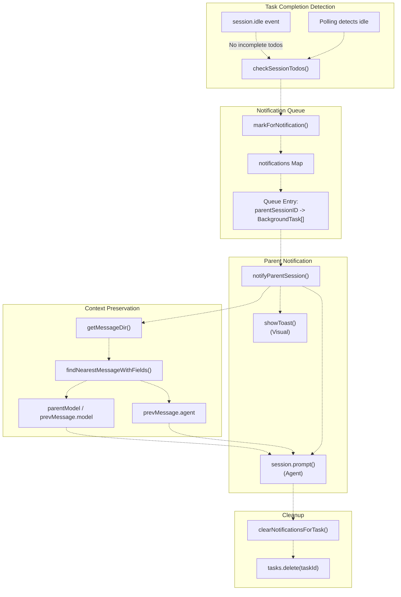
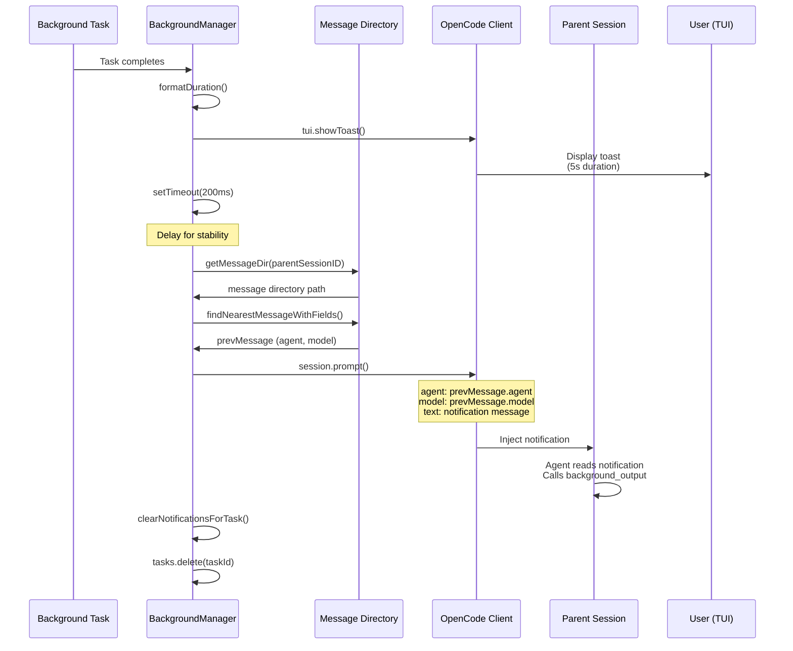
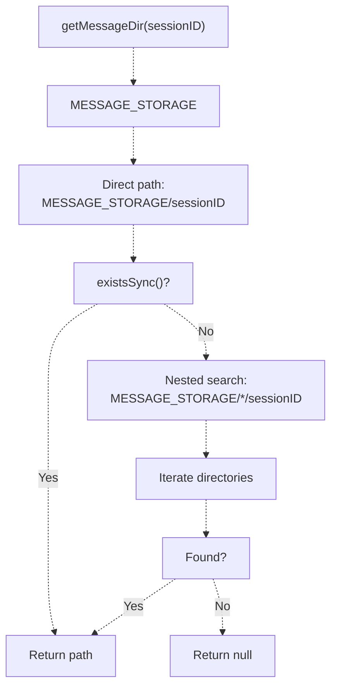
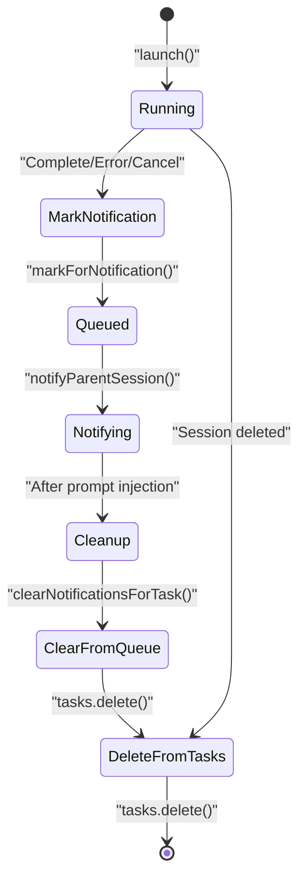

# Notification System

> **Relevant source files**
> * [.opencode/background-tasks.json](https://github.com/code-yeongyu/oh-my-opencode/blob/b92cd6ab/.opencode/background-tasks.json)
> * [src/features/background-agent/index.ts](https://github.com/code-yeongyu/oh-my-opencode/blob/b92cd6ab/src/features/background-agent/index.ts)
> * [src/features/background-agent/manager.test.ts](https://github.com/code-yeongyu/oh-my-opencode/blob/b92cd6ab/src/features/background-agent/manager.test.ts)
> * [src/features/background-agent/manager.ts](https://github.com/code-yeongyu/oh-my-opencode/blob/b92cd6ab/src/features/background-agent/manager.ts)
> * [src/features/background-agent/types.ts](https://github.com/code-yeongyu/oh-my-opencode/blob/b92cd6ab/src/features/background-agent/types.ts)
> * [src/tools/background-task/tools.ts](https://github.com/code-yeongyu/oh-my-opencode/blob/b92cd6ab/src/tools/background-task/tools.ts)
> * [src/tools/call-omo-agent/tools.ts](https://github.com/code-yeongyu/oh-my-opencode/blob/b92cd6ab/src/tools/call-omo-agent/tools.ts)

## Purpose and Scope

The Notification System manages communication between background tasks and their parent sessions, ensuring that parent agents are automatically informed when delegated work completes. This page documents the notification queue, parent session prompt injection, context preservation, and toast notification mechanisms.

For information about launching and managing background tasks, see [Background Manager](/code-yeongyu/oh-my-opencode/6.1-background-manager). For details on task execution and completion detection, see [Task Execution and Polling](/code-yeongyu/oh-my-opencode/6.2-task-execution-and-polling).

## Overview

When a background task completes, the system must notify the parent session so that the orchestrating agent (typically Sisyphus) can retrieve and act on the results. The notification system implements a queue-based approach with dual notification channels: visual toast notifications for user awareness and automated prompt injection for agent awareness.

### Notification Flow Diagram



**Sources:** [src/features/background-agent/manager.ts L176-L357](https://github.com/code-yeongyu/oh-my-opencode/blob/b92cd6ab/src/features/background-agent/manager.ts#L176-L357)

## Notification Queue

The `BackgroundManager` maintains a notification queue as a `Map<string, BackgroundTask[]>`, where the key is the parent session ID and the value is an array of completed tasks awaiting notification.

### Queue Management Methods

| Method | Purpose | Parameters | Behavior |
| --- | --- | --- | --- |
| `markForNotification()` | Enqueues a completed task | `task: BackgroundTask` | Adds task to parent's notification queue |
| `getPendingNotifications()` | Retrieves pending notifications | `sessionID: string` | Returns all tasks queued for the given session |
| `clearNotifications()` | Clears all notifications | `sessionID: string` | Removes entire queue for the session |
| `clearNotificationsForTask()` | Removes specific task | `taskId: string` | Removes task from all queues (private) |

**Sources:** [src/features/background-agent/manager.ts L259-L282](https://github.com/code-yeongyu/oh-my-opencode/blob/b92cd6ab/src/features/background-agent/manager.ts#L259-L282)

### Queue Structure


**Sources:** [src/features/background-agent/manager.ts L56-L64](https://github.com/code-yeongyu/oh-my-opencode/blob/b92cd6ab/src/features/background-agent/manager.ts#L56-L64)

## Parent Session Notification

When a background task completes, `notifyParentSession()` executes a multi-step notification process that combines visual feedback with automated agent communication.

### Notification Message Format

The system injects a structured notification message into the parent session:

```
[BACKGROUND TASK COMPLETED] Task "{description}" finished in {duration}. Use background_output with task_id="{id}" to get results.
```

**Sources:** [src/features/background-agent/manager.ts L324](https://github.com/code-yeongyu/oh-my-opencode/blob/b92cd6ab/src/features/background-agent/manager.ts#L324-L324)

### Notification Process



**Sources:** [src/features/background-agent/manager.ts L306-L357](https://github.com/code-yeongyu/oh-my-opencode/blob/b92cd6ab/src/features/background-agent/manager.ts#L306-L357)

### Duration Formatting

The system formats task duration in a human-readable format:

| Duration | Format Example |
| --- | --- |
| < 1 minute | `45s` |
| 1-59 minutes | `5m 23s` |
| ≥ 1 hour | `2h 15m 30s` |

**Sources:** [src/features/background-agent/manager.ts L359-L371](https://github.com/code-yeongyu/oh-my-opencode/blob/b92cd6ab/src/features/background-agent/manager.ts#L359-L371)

## Context Preservation

To ensure the parent session continues with the correct agent and model configuration, the notification system preserves context through two mechanisms:

### Context Sources

1. **Primary: `parentModel` field** - Captured during task launch from the parent message
2. **Fallback: Message directory lookup** - Reads the most recent message if `parentModel` unavailable

### Message Directory Resolution



**Sources:** [src/features/background-agent/manager.ts L41-L53](https://github.com/code-yeongyu/oh-my-opencode/blob/b92cd6ab/src/features/background-agent/manager.ts#L41-L53)

 [src/tools/background-task/tools.ts L11-L23](https://github.com/code-yeongyu/oh-my-opencode/blob/b92cd6ab/src/tools/background-task/tools.ts#L11-L23)

### Context Injection Logic

The notification prompt includes:

```yaml
{
  agent: prevMessage?.agent,
  model: modelField,  // { providerID, modelID }
  parts: [{ type: "text", text: message }]
}
```

This ensures the parent session's AI model remains consistent when processing the notification, preventing context switches that could confuse the orchestrator.

**Sources:** [src/features/background-agent/manager.ts L334-L347](https://github.com/code-yeongyu/oh-my-opencode/blob/b92cd6ab/src/features/background-agent/manager.ts#L334-L347)

## Toast Notifications

The system provides visual feedback through the OpenCode TUI's toast notification system.

### Toast Configuration

| Property | Value | Purpose |
| --- | --- | --- |
| `title` | `"Background Task Completed"` | Identifies notification type |
| `message` | `Task "{description}" finished in {duration}.` | Summarizes completion |
| `variant` | `"success"` | Visual styling (green/positive) |
| `duration` | `5000` (ms) | Auto-dismiss after 5 seconds |

**Sources:** [src/features/background-agent/manager.ts L313-L321](https://github.com/code-yeongyu/oh-my-opencode/blob/b92cd6ab/src/features/background-agent/manager.ts#L313-L321)

### Toast Implementation

```javascript
const tuiClient = this.client as any
if (tuiClient.tui?.showToast) {
  tuiClient.tui.showToast({
    body: {
      title: "Background Task Completed",
      message: `Task "${task.description}" finished in ${duration}.`,
      variant: "success",
      duration: 5000,
    },
  }).catch(() => {})
}
```

The toast call is fire-and-forget (errors suppressed) to prevent notification failures from blocking task cleanup.

**Sources:** [src/features/background-agent/manager.ts L312-L322](https://github.com/code-yeongyu/oh-my-opencode/blob/b92cd6ab/src/features/background-agent/manager.ts#L312-L322)

## Notification Timing

### Delayed Injection

The system uses a 200ms delay before injecting the notification prompt:

```javascript
setTimeout(async () => {
  // ... notification logic
}, 200)
```

This delay ensures:

* Session state stabilizes after completion detection
* Previous tool results are fully written
* Parent session is ready to receive new messages

**Sources:** [src/features/background-agent/manager.ts L329](https://github.com/code-yeongyu/oh-my-opencode/blob/b92cd6ab/src/features/background-agent/manager.ts#L329-L329)

### Notification Triggers

Notifications are triggered from three sources:

| Trigger | Location | Condition |
| --- | --- | --- |
| `session.idle` event | `handleEvent()` | Event-based detection, checks todos |
| Polling loop | `pollRunningTasks()` | Polling-based detection, checks todos |
| Session deletion | `handleEvent()` | Task marked cancelled, no notification sent |

**Sources:** [src/features/background-agent/manager.ts L218-L256](https://github.com/code-yeongyu/oh-my-opencode/blob/b92cd6ab/src/features/background-agent/manager.ts#L218-L256)

 [src/features/background-agent/manager.ts L380-L459](https://github.com/code-yeongyu/oh-my-opencode/blob/b92cd6ab/src/features/background-agent/manager.ts#L380-L459)

## Queue Cleanup

### Task Lifecycle



**Sources:** [src/features/background-agent/manager.ts L239-L256](https://github.com/code-yeongyu/oh-my-opencode/blob/b92cd6ab/src/features/background-agent/manager.ts#L239-L256)

 [src/features/background-agent/manager.ts L348-L356](https://github.com/code-yeongyu/oh-my-opencode/blob/b92cd6ab/src/features/background-agent/manager.ts#L348-L356)

### Cleanup Methods

The `clearNotificationsForTask()` method removes a task from all notification queues:

```javascript
private clearNotificationsForTask(taskId: string): void {
  for (const [sessionID, tasks] of this.notifications.entries()) {
    const filtered = tasks.filter((t) => t.id !== taskId)
    if (filtered.length === 0) {
      this.notifications.delete(sessionID)
    } else {
      this.notifications.set(sessionID, filtered)
    }
  }
}
```

This ensures:

* Task is removed from all parent queues
* Empty queues are deleted (memory efficiency)
* No duplicate notifications

**Sources:** [src/features/background-agent/manager.ts L273-L282](https://github.com/code-yeongyu/oh-my-opencode/blob/b92cd6ab/src/features/background-agent/manager.ts#L273-L282)

## Integration with Background Tools

### background_output Tool

The notification message explicitly instructs the parent agent to use `background_output`:

```
Use background_output with task_id="{id}" to get results.
```

The tool can operate in two modes:

| Mode | Parameter | Behavior |
| --- | --- | --- |
| Non-blocking | `block=false` (default) | Returns immediate status |
| Blocking | `block=true` | Polls until completion (rarely needed) |

Since notifications are automatic, agents typically use non-blocking mode to retrieve results immediately after receiving the notification.

**Sources:** [src/tools/background-task/tools.ts L235-L298](https://github.com/code-yeongyu/oh-my-opencode/blob/b92cd6ab/src/tools/background-task/tools.ts#L235-L298)

### Notification Message Example

When a task completes, the parent session receives:

```
[BACKGROUND TASK COMPLETED] Task "Explore opencode in codebase" finished in 39s. Use background_output with task_id="bg_wzsdt60b" to get results.
```

The agent then executes:

```
background_output({ task_id: "bg_wzsdt60b", block: false })
```

**Sources:** [src/features/background-agent/manager.ts L324](https://github.com/code-yeongyu/oh-my-opencode/blob/b92cd6ab/src/features/background-agent/manager.ts#L324-L324)

 [.opencode/background-tasks.json L1-L12](https://github.com/code-yeongyu/oh-my-opencode/blob/b92cd6ab/.opencode/background-tasks.json#L1-L12)

## Error Handling

### Prompt Injection Failures

If `session.prompt()` fails during notification:

```python
try {
  await this.client.session.prompt({ ... })
  this.clearNotificationsForTask(taskId)
  log("[background-agent] Successfully sent prompt to parent session:", { ... })
} catch (error) {
  log("[background-agent] prompt failed:", String(error))
} finally {
  this.tasks.delete(taskId)
  log("[background-agent] Removed completed task from memory:", taskId)
}
```

Behavior:

* Error is logged but not thrown
* Task is still removed from memory (in `finally` block)
* Notification remains in queue (not cleared on failure)
* User still sees toast notification

**Sources:** [src/features/background-agent/manager.ts L339-L356](https://github.com/code-yeongyu/oh-my-opencode/blob/b92cd6ab/src/features/background-agent/manager.ts#L339-L356)

### Context Resolution Failures

If message directory or previous message cannot be found:

```javascript
const messageDir = getMessageDir(task.parentSessionID)
const prevMessage = messageDir ? findNearestMessageWithFields(messageDir) : null

const modelContext = task.parentModel ?? prevMessage?.model
const modelField = modelContext?.providerID && modelContext?.modelID
  ? { providerID: modelContext.providerID, modelID: modelContext.modelID }
  : undefined
```

Behavior:

* Uses `parentModel` (captured at launch) as primary source
* Falls back to message directory lookup
* If both fail, sends notification without explicit model field
* OpenCode uses session's default model

**Sources:** [src/features/background-agent/manager.ts L331-L337](https://github.com/code-yeongyu/oh-my-opencode/blob/b92cd6ab/src/features/background-agent/manager.ts#L331-L337)

## Implementation Details

### BackgroundManager Notification Fields

```javascript
export class BackgroundManager {
  private tasks: Map<string, BackgroundTask>
  private notifications: Map<string, BackgroundTask[]>  // Notification queue
  private client: OpencodeClient
  private directory: string
  // ...
}
```

**Sources:** [src/features/background-agent/manager.ts L55-L67](https://github.com/code-yeongyu/oh-my-opencode/blob/b92cd6ab/src/features/background-agent/manager.ts#L55-L67)

### BackgroundTask Notification Context

```typescript
export interface BackgroundTask {
  id: string
  sessionID: string
  parentSessionID: string          // Target for notification
  parentMessageID: string          // Original request context
  description: string              // Shown in notification
  agent: string
  status: BackgroundTaskStatus
  startedAt: Date
  completedAt?: Date
  parentModel?: { providerID: string; modelID: string }  // Context preservation
  // ...
}
```

**Sources:** [src/features/background-agent/types.ts L15-L30](https://github.com/code-yeongyu/oh-my-opencode/blob/b92cd6ab/src/features/background-agent/types.ts#L15-L30)

### Session State Tracking

The notification system coordinates with session state tracking to prevent duplicate notifications:

* `subagentSessions` Set tracks which sessions are background tasks
* `session.deleted` event removes from tracking and prevents notification
* Completed tasks are removed after successful notification

**Sources:** [src/features/background-agent/manager.ts L86](https://github.com/code-yeongyu/oh-my-opencode/blob/b92cd6ab/src/features/background-agent/manager.ts#L86-L86)

 [src/features/background-agent/manager.ts L255](https://github.com/code-yeongyu/oh-my-opencode/blob/b92cd6ab/src/features/background-agent/manager.ts#L255-L255)