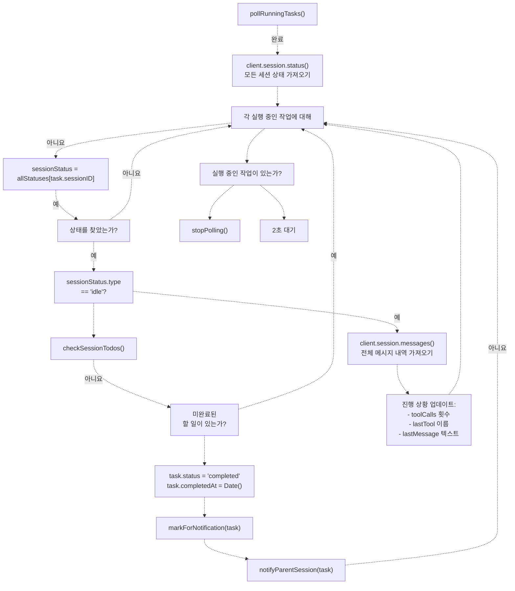

# 작업 실행 및 폴링 (Task Execution and Polling)

> **관련 소스 파일**
> * [.opencode/background-tasks.json](https://github.com/code-yeongyu/oh-my-opencode/blob/b92cd6ab/.opencode/background-tasks.json)
> * [src/features/background-agent/index.ts](https://github.com/code-yeongyu/oh-my-opencode/blob/b92cd6ab/src/features/background-agent/index.ts)
> * [src/features/background-agent/manager.test.ts](https://github.com/code-yeongyu/oh-my-opencode/blob/b92cd6ab/src/features/background-agent/manager.test.ts)
> * [src/features/background-agent/manager.ts](https://github.com/code-yeongyu/oh-my-opencode/blob/b92cd6ab/src/features/background-agent/manager.ts)
> * [src/features/background-agent/types.ts](https://github.com/code-yeongyu/oh-my-opencode/blob/b92cd6ab/src/features/background-agent/types.ts)
> * [src/tools/background-task/tools.ts](https://github.com/code-yeongyu/oh-my-opencode/blob/b92cd6ab/src/tools/background-task/tools.ts)
> * [src/tools/call-omo-agent/tools.ts](https://github.com/code-yeongyu/oh-my-opencode/blob/b92cd6ab/src/tools/call-omo-agent/tools.ts)

이 페이지는 oh-my-opencode 시스템에서 백그라운드 작업이 어떻게 실행되고 모니터링되는지 설명합니다. 작업의 생명주기(lifecycle), 이벤트 기반 및 폴링(polling) 기반 방식을 결합한 이중 모니터링 전략, 그리고 완료 감지 메커니즘을 다룹니다.

작업 생성 및 생명주기 관리에 대한 정보는 [Background Manager](/code-yeongyu/oh-my-opencode/6.1-background-manager)를 참조하십시오. 부모 세션으로의 알림 전달에 대해서는 [Notification System](/code-yeongyu/oh-my-opencode/6.3-notification-system)을, 작업과 상호작용하는 사용자용 도구에 대해서는 [Background Task Tools](/code-yeongyu/oh-my-opencode/5.3-background-task-tools)를 참조하십시오.

## 작업 생명주기 개요 (Task Lifecycle Overview)

백그라운드 작업은 실행되는 동안 정의된 상태 집합을 거치며 진행됩니다. 생명주기는 작업이 시작될 때 시작되어 터미널 상태(terminal state, 최종 상태)에 도달하면 종료됩니다.

### 작업 상태 (Task States)

시스템은 네 가지 가능한 작업 상태를 인식합니다:

| 상태 | 설명 | 종료 상태 여부 | 알림 트리거 |
| --- | --- | --- | --- |
| `running` | 작업이 활발히 실행 중임 | 아니요 | 아니요 |
| `completed` | 작업이 성공적으로 완료됨 | 예 | 예 |
| `error` | 작업 중 오류가 발생함 | 예 | 예 |
| `cancelled` | 사용자 또는 시스템에 의해 작업이 취소됨 | 예 | 아니요 |

**상태 전이 다이어그램 (State Transition Diagram)**


출처: [src/features/background-agent/types.ts L1-L6](https://github.com/code-yeongyu/oh-my-opencode/blob/b92cd6ab/src/features/background-agent/types.ts#L1-L6)

 [src/features/background-agent/manager.ts L88-L103](https://github.com/code-yeongyu/oh-my-opencode/blob/b92cd6ab/src/features/background-agent/manager.ts#L88-L103)

### 초기 작업 상태

`BackgroundManager.launch()`를 통해 작업이 시작되면 `running` 상태로 생성됩니다. 작업 구조에는 실행 컨텍스트와 진행 상황 추적 정보가 포함됩니다:

```yaml
{
  id: "bg_${crypto.randomUUID().slice(0, 8)}",
  sessionID: string,          // 자식 세션 ID
  parentSessionID: string,    // 부모 세션 ID
  parentMessageID: string,    // 시작 메시지
  description: string,        // 짧은 작업 설명
  prompt: string,            // 전체 에이전트 프롬프트
  agent: string,             // 에이전트 유형 (explore/librarian 등)
  status: "running",
  startedAt: Date,
  progress: {
    toolCalls: 0,
    lastUpdate: Date
  }
}
```

생성 후 시스템은 `client.session.promptAsync()`를 호출하여 실행 후 결과를 기다리지 않는 방식(fire-and-forget)으로 실행을 시작하고, 즉시 작업 모니터링을 시작합니다.

출처: [src/features/background-agent/manager.ts L69-L138](https://github.com/code-yeongyu/oh-my-opencode/blob/b92cd6ab/src/features/background-agent/manager.ts#L69-L138)

## 이중 모니터링 전략 (Dual Monitoring Strategy)

시스템은 작업 실행을 추적하기 위해 두 가지 보완적인 모니터링 메커니즘을 사용합니다. 즉각적인 업데이트를 위한 이벤트 기반 모니터링과 안정적인 상태 확인을 위한 폴링 기반 모니터링입니다.

### 왜 이중 모니터링인가?


출처: [src/features/background-agent/manager.ts L193-L257](https://github.com/code-yeongyu/oh-my-opencode/blob/b92cd6ab/src/features/background-agent/manager.ts#L193-L257)

 [src/features/background-agent/manager.ts L284-L459](https://github.com/code-yeongyu/oh-my-opencode/blob/b92cd6ab/src/features/background-agent/manager.ts#L284-L459)

### 이벤트 기반 모니터링 (Event-Based Monitoring)

`BackgroundManager.handleEvent()` 메서드는 OpenCode SDK의 이벤트 스트림에서 발생하는 이벤트를 처리합니다. 세 가지 이벤트 유형이 모니터링됩니다:

**1. message.part.updated 이벤트**

도구 실행 진행 상황을 실시간으로 추적합니다:


이를 통해 API 호출 없이도 작업 활동에 대한 실시간 피드백을 제공할 수 있습니다.

출처: [src/features/background-agent/manager.ts L196-L216](https://github.com/code-yeongyu/oh-my-opencode/blob/b92cd6ab/src/features/background-agent/manager.ts#L196-L216)

**2. session.idle 이벤트**

주요 완료 감지 메커니즘입니다:


할 일(todo) 확인은 매우 중요합니다. 세션이 유휴(idle) 상태가 되더라도 미완료된 할 일이 남아있을 수 있으며, 이는 작업이 할 일 연속 실행 강제(todo-continuation enforcement)를 기다리고 있음을 나타냅니다 ([Todo Continuation Enforcer](/code-yeongyu/oh-my-opencode/7.3-todo-continuation-enforcer) 참조).

출처: [src/features/background-agent/manager.ts L218-L237](https://github.com/code-yeongyu/oh-my-opencode/blob/b92cd6ab/src/features/background-agent/manager.ts#L218-L237)

**3. session.deleted 이벤트**

세션 삭제를 정상적으로 처리합니다:

* 실행 중인 작업을 "Session deleted" 오류와 함께 `cancelled`로 표시합니다.
* 내부 추적 목록에서 작업을 제거합니다.
* 대기 중인 모든 알림을 삭제합니다.
* `subagentSessions` 집합에서 세션을 제거합니다.

출처: [src/features/background-agent/manager.ts L239-L257](https://github.com/code-yeongyu/oh-my-opencode/blob/b92cd6ab/src/features/background-agent/manager.ts#L239-L257)

### 폴링 기반 모니터링 (Polling-Based Monitoring)

`pollRunningTasks()` 메서드는 작업이 활성화되어 있을 때 2초마다 실행되어 완료 감지를 위한 안정적인 폴백(fallback)을 제공합니다.

**폴링 생명주기**


인터벌(interval)은 프로세스가 불필요하게 유지되는 것을 방지하기 위해 `unref()`를 사용합니다.

출처: [src/features/background-agent/manager.ts L284-L298](https://github.com/code-yeongyu/oh-my-opencode/blob/b92cd6ab/src/features/background-agent/manager.ts#L284-L298)

**폴링 절차**



폴링 메커니즘은 이벤트를 놓치더라도 완료를 감지할 수 있도록 보장하며, 전체 메시지 내역을 가져와 지속적인 진행 상황 업데이트를 제공합니다.

출처: [src/features/background-agent/manager.ts L380-L459](https://github.com/code-yeongyu/oh-my-opencode/blob/b92cd6ab/src/features/background-agent/manager.ts#L380-L459)

## 진행 상황 추적 (Progress Tracking)

시스템은 작업 실행 전반에 걸쳐 상세한 진행 정보를 유지하여 사용자가 장시간 실행되는 작업을 모니터링할 수 있도록 합니다.

### 진행 상황 구조 (Progress Structure)

```sql
interface TaskProgress {
  toolCalls: number       // 총 도구 실행 횟수
  lastTool?: string      // 가장 최근 도구 이름
  lastUpdate: Date       // 마지막 진행 상황 업데이트 시간
  lastMessage?: string   // 마지막 어시스턴트 메시지 텍스트
  lastMessageAt?: Date   // 마지막 메시지 타임스탬프
}
```

### 진행 상황 업데이트 소스

| 소스 | 업데이트 항목 | 빈도 | 메서드 |
| --- | --- | --- | --- |
| `message.part.updated` 이벤트 | `toolCalls`, `lastTool`, `lastUpdate` | 실시간 | 이벤트 핸들러 |
| `pollRunningTasks()` | `lastMessage`를 포함한 모든 필드 | 2초마다 | 전체 메시지 페치(fetch) |
| 초기 생성 | `toolCalls: 0`, `lastUpdate` | 1회 | 작업 시작 시 |

**진행 상황 업데이트 흐름**


이벤트 기반 업데이트는 도구 호출에 대한 즉각적인 피드백을 제공하고, 폴링은 실제 메시지 내용으로 진행 상황을 풍부하게 만듭니다.

출처: [src/features/background-agent/manager.ts L196-L216](https://github.com/code-yeongyu/oh-my-opencode/blob/b92cd6ab/src/features/background-agent/manager.ts#L196-L216)

 [src/features/background-agent/manager.ts L410-L450](https://github.com/code-yeongyu/oh-my-opencode/blob/b92cd6ab/src/features/background-agent/manager.ts#L410-L450)

## 완료 감지 (Completion Detection)

완료 감지는 여러 신호를 결합하여 작업 실행이 끝났는지 판단합니다. 시스템은 진정한 완료와 일시적인 유휴 상태를 구분해야 합니다.

### 완료 기준 (Completion Criteria)

다음 조건이 모두 충족될 때 작업이 완료된 것으로 간주됩니다:


### 할 일(Todo) 확인

`checkSessionTodos()` 메서드는 세션의 할 일 목록을 조회하여 남은 작업이 있는지 확인합니다:

```javascript
// 의사 코드(Pseudo-code) 표현
async checkSessionTodos(sessionID: string): Promise<boolean> {
  const response = await client.session.todo({ path: { id: sessionID } })
  const todos = response.data ?? response
  
  if (!todos || todos.length === 0) return false
  
  const incomplete = todos.filter(
    t => t.status !== "completed" && t.status !== "cancelled"
  )
  
  return incomplete.length > 0
}
```

이 확인 과정은 세션이 유휴 상태가 되었지만 할 일 연속 실행 기능이 "작업 계속하기" 프롬프트를 주입하기를 기다리는 동안 작업이 조기에 종료되는 것을 방지합니다.

출처: [src/features/background-agent/manager.ts L176-L191](https://github.com/code-yeongyu/oh-my-opencode/blob/b92cd6ab/src/features/background-agent/manager.ts#L176-L191)

### 완료 감지 시점

시스템에는 완료를 감지할 수 있는 두 가지 시점이 있습니다:

**1. 이벤트 핸들러 (즉시)**

`session.idle` 이벤트가 도착하면 이벤트 핸들러가 완료 여부를 확인합니다:


출처: [src/features/background-agent/manager.ts L218-L237](https://github.com/code-yeongyu/oh-my-opencode/blob/b92cd6ab/src/features/background-agent/manager.ts#L218-L237)

**2. 폴링 루프 (안정적)**

폴링 루프는 2초마다 동일한 확인을 수행합니다:


출처: [src/features/background-agent/manager.ts L380-L407](https://github.com/code-yeongyu/oh-my-opencode/blob/b92cd6ab/src/features/background-agent/manager.ts#L380-L407)

## 오류 처리 (Error Handling)

작업 실행 중 발생하는 오류는 캡처되어 작업 구조에 저장되므로 부모 세션에서 실패 원인을 진단할 수 있습니다.

### 오류 발생원

**1. promptAsync 실패**

초기 프롬프트 제출 중 발생하는 오류는 즉시 캡처됩니다:


이를 통해 에이전트가 등록되지 않았거나 잘못 설정된 경우 즉각적인 피드백을 제공합니다.

출처: [src/features/background-agent/manager.ts L120-L135](https://github.com/code-yeongyu/oh-my-opencode/blob/b92cd6ab/src/features/background-agent/manager.ts#L120-L135)

**2. 세션 삭제**

세션이 삭제되면 작업은 설명적인 오류와 함께 취소된 것으로 표시됩니다:

```
if (task.status === "running") {
  task.status = "cancelled"
  task.completedAt = new Date()
  task.error = "Session deleted"
}
```

출처: [src/features/background-agent/manager.ts L247-L251](https://github.com/code-yeongyu/oh-my-opencode/blob/b92cd6ab/src/features/background-agent/manager.ts#L247-L251)

### 오류 상태 처리

`error` 또는 `cancelled` 상태의 작업은 터미널 상태이며 다른 상태로 전이되지 않습니다:

| 현재 상태 | 전이 가능 상태 | 알림 여부 |
| --- | --- | --- |
| `error` | 없음 | 예 (notifyParentSession을 통해) |
| `cancelled` | 없음 | 아니요 (알림 삭제됨) |

`background_output` 도구는 오류/취소된 작업에 대해 완료를 기다리지 않고 즉시 상태 정보를 반환합니다.

출처: [src/tools/background-task/tools.ts L258-L261](https://github.com/code-yeongyu/oh-my-opencode/blob/b92cd6ab/src/tools/background-task/tools.ts#L258-L261)

## 폴링 제어 (Polling Control)

폴링 메커니즘은 활성 작업이 없을 때 리소스 사용을 최소화하도록 설계되었습니다.

### 자동 시작/중지


**구현 세부 사항**

| 메서드 | 목적 | 트리거 |
| --- | --- | --- |
| `startPolling()` | 인터벌 타이머가 없으면 생성 | 첫 번째 작업 시작 시 |
| `stopPolling()` | 인터벌 타이머 제거 | `pollRunningTasks()` 종료 시 남은 작업이 없을 때 |
| `hasRunningTasks()` | 상태가 `running`인 작업이 있는지 확인 | `pollRunningTasks()`에서 호출 |

`pollingInterval`은 `setInterval(..., 2000).unref()`로 생성되어, 인터벌이 활성화되어 있더라도 Node.js 프로세스가 종료될 수 있도록 합니다.

출처: [src/features/background-agent/manager.ts L284-L298](https://github.com/code-yeongyu/oh-my-opencode/blob/b92cd6ab/src/features/background-agent/manager.ts#L284-L298)

 [src/features/background-agent/manager.ts L373-L378](https://github.com/code-yeongyu/oh-my-opencode/blob/b92cd6ab/src/features/background-agent/manager.ts#L373-L378)

 [src/features/background-agent/manager.ts L456-L459](https://github.com/code-yeongyu/oh-my-opencode/blob/b92cd6ab/src/features/background-agent/manager.ts#L456-L459)

### 폴링 성능

각 폴링 사이클은 다음을 수행합니다:

1. 모든 세션 상태를 가져오기 위한 `client.session.status()` 호출 1회
2. 유휴 상태가 아닌 각 실행 중인 작업에 대해: 진행 상황을 가져오기 위한 `client.session.messages()` 호출 1회

즉, API 호출 오버헤드는 활성 작업 수에 비례합니다. 유휴 작업(완료 확인 대기 중)은 초기 상태 확인 외에 추가적인 API 호출을 발생시키지 않습니다.

**폴링 결정 트리 (Polling Decision Tree)**


출처: [src/features/background-agent/manager.ts L380-L459](https://github.com/code-yeongyu/oh-my-opencode/blob/b92cd6ab/src/features/background-agent/manager.ts#L380-L459)

## 다른 시스템과의 통합

작업 실행 및 폴링은 여러 다른 시스템 구성 요소와 상호작용합니다:

### 서브에이전트 세션 추적 (Subagent Session Tracking)

백그라운드 작업 세션은 특정 훅(hook)이 백그라운드 작업을 방해하지 않도록 `subagentSessions` Set에 등록됩니다:

```sql
// 시작 시
subagentSessions.add(sessionID)

// 세션 삭제 시
subagentSessions.delete(sessionID)
```

이를 통해 할 일 연속 실행과 같은 훅이 백그라운드 세션을 건너뛸 수 있습니다.

출처: [src/features/background-agent/manager.ts L86](https://github.com/code-yeongyu/oh-my-opencode/blob/b92cd6ab/src/features/background-agent/manager.ts#L86-L86)

 [src/features/background-agent/manager.ts L255](https://github.com/code-yeongyu/oh-my-opencode/blob/b92cd6ab/src/features/background-agent/manager.ts#L255-L255)

### 메시지 저장소 통합 (Message Storage Integration)

매니저는 알림 시 부모 컨텍스트를 유지하기 위해 메시지 저장소를 읽습니다:

```javascript
function getMessageDir(sessionID: string): string | null {
  if (!existsSync(MESSAGE_STORAGE)) return null
  
  // 직접 경로 확인
  const directPath = join(MESSAGE_STORAGE, sessionID)
  if (existsSync(directPath)) return directPath
  
  // 중첩 경로 확인
  for (const dir of readdirSync(MESSAGE_STORAGE)) {
    const sessionPath = join(MESSAGE_STORAGE, dir, sessionID)
    if (existsSync(sessionPath)) return sessionPath
  }
  
  return null
}
```

이를 통해 알림 전달을 위한 부모 세션의 모델 및 에이전트 설정을 찾을 수 있습니다.

출처: [src/features/background-agent/manager.ts L41-L53](https://github.com/code-yeongyu/oh-my-opencode/blob/b92cd6ab/src/features/background-agent/manager.ts#L41-L53)

 [src/features/background-agent/manager.ts L331-L338](https://github.com/code-yeongyu/oh-my-opencode/blob/b92cd6ab/src/features/background-agent/manager.ts#L331-L338)

### 알림 시스템과의 협업 (Coordination with Notification System)

작업이 완료되면 매니저는 알림 전달을 조율합니다:


200ms의 지연 시간은 메시지 주입 전 세션이 안정화될 수 있도록 합니다. 알림 전달에 대한 자세한 내용은 [Notification System](/code-yeongyu/oh-my-opencode/6.3-notification-system)을 참조하십시오.

출처: [src/features/background-agent/manager.ts L259-L263](https://github.com/code-yeongyu/oh-my-opencode/blob/b92cd6ab/src/features/background-agent/manager.ts#L259-L263)

 [src/features/background-agent/manager.ts L306-L357](https://github.com/code-yeongyu/oh-my-opencode/blob/b92cd6ab/src/features/background-agent/manager.ts#L306-L357)