# Claude Code 호환성 (Claude Code Compatibility)

> **관련 소스 파일**
> * [README.ja.md](https://github.com/code-yeongyu/oh-my-opencode/blob/b92cd6ab/README.ja.md)
> * [README.ko.md](https://github.com/code-yeongyu/oh-my-opencode/blob/b92cd6ab/README.ko.md)
> * [README.md](https://github.com/code-yeongyu/oh-my-opencode/blob/b92cd6ab/README.md)
> * [README.zh-cn.md](https://github.com/code-yeongyu/oh-my-opencode/blob/b92cd6ab/README.zh-cn.md)
> * [src/shared/config-path.ts](https://github.com/code-yeongyu/oh-my-opencode/blob/b92cd6ab/src/shared/config-path.ts)

## 목적 및 범위 (Purpose and Scope)

Claude Code 호환성 계층은 `~/.claude/` 디렉토리 구조에서 기존 Claude Code 설정, 명령(commands), 스킬(skills), 에이전트(agents), MCP(Micro-Capability Provider) 서버 및 훅(hooks)을 로드하여 Claude Code에서 oh-my-opencode로의 원활한 마이그레이션을 가능하게 합니다. 이를 통해 사용자는 플랫폼을 전환할 때 수정 없이 기존의 사용자 정의 설정을 그대로 유지할 수 있습니다.

oh-my-opencode 전용 기능 설정에 대한 정보는 [설정 시스템 (Configuration System)](/code-yeongyu/oh-my-opencode/3.2-configuration-system)을 참조하십시오. 내장 에이전트 시스템에 대한 자세한 내용은 [에이전트 시스템 (Agent System)](../agents/)을 참조하십시오.

## 아키텍처 개요 (Architecture Overview)

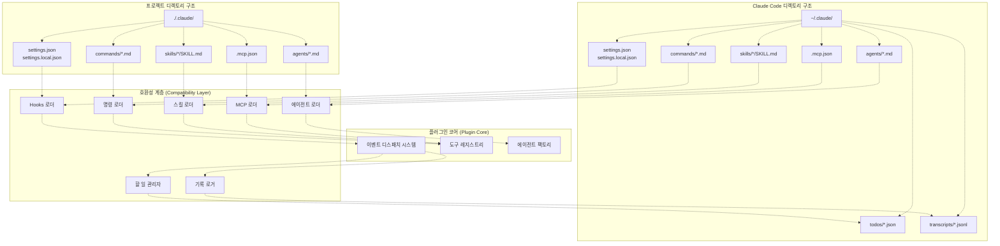

**디렉토리 로딩 우선순위**

호환성 계층은 다음 우선순위에 따라 여러 위치에서 에셋을 로드합니다 (나중에 로드된 소스가 이전 소스를 덮어씁니다).

| 에셋 유형 | 사용자 수준 (User-Level) | 프로젝트 수준 (Project-Level) | 로컬 (Git 무시) |
| --- | --- | --- | --- |
| 훅 (Hooks) | `~/.claude/settings.json` | `./.claude/settings.json` | `./.claude/settings.local.json` |
| 명령 (Commands) | `~/.claude/commands/*.md` | `./.claude/commands/*.md` | - |
| 스킬 (Skills) | `~/.claude/skills/*/SKILL.md` | `./.claude/skills/*/SKILL.md` | - |
| 에이전트 (Agents) | `~/.claude/agents/*.md` | `./.claude/agents/*.md` | - |
| MCP | `~/.claude/.mcp.json` | `./.mcp.json` | `./.claude/.mcp.json` |

출처: [README.md L578-L662](https://github.com/code-yeongyu/oh-my-opencode/blob/b92cd6ab/README.md#L578-L662)

## 설정 파일 위치 (Configuration File Locations)

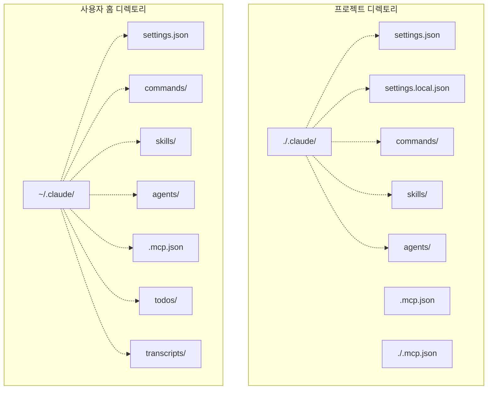

호환성 계층은 사용자 수준(`~/.claude/`)과 프로젝트 수준(프로젝트 루트의 `./.claude/` 또는 `./.mcp.json`) 디렉토리를 모두 스캔합니다. 프로젝트 수준 설정은 사용자 수준 기본값을 덮어쓰므로, 개인적인 선호도를 유지하면서 팀 전체의 표준을 적용할 수 있습니다.

출처: [README.md L586-L632](https://github.com/code-yeongyu/oh-my-opencode/blob/b92cd6ab/README.md#L586-L632)

## 에셋 로더 (Asset Loaders)

### 명령 로더 (Command Loader)

명령 로더는 4개의 디렉토리에서 마크다운 기반의 슬래시 명령(slash commands)을 찾아 도구 레지스트리에 병합합니다.

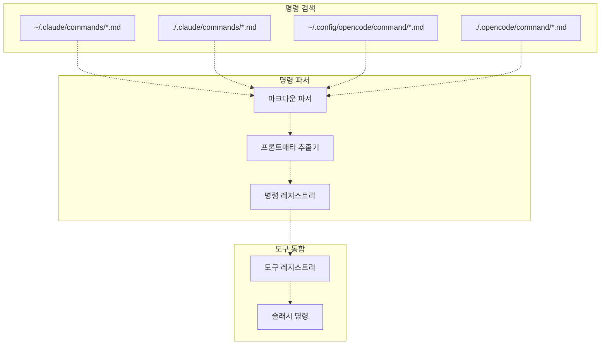

명령 파일은 메타데이터를 위한 선택적 프론트매터(frontmatter)가 포함된 마크다운 문서입니다. 각 명령은 에이전트가 호출할 수 있는 슬래시 명령(예: `/command-name`)으로 사용할 수 있게 됩니다.

**명령 파일 형식:**

```go
---
name: example-command
description: Example command description
---

Command instructions go here...
```

출처: [README.md L614-L618](https://github.com/code-yeongyu/oh-my-opencode/blob/b92cd6ab/README.md#L614-L618)

### 스킬 로더 (Skill Loader)

스킬(Skills)은 스킬의 동작을 정의하는 `SKILL.md` 파일이 포함된 디렉토리 기반의 기능입니다.

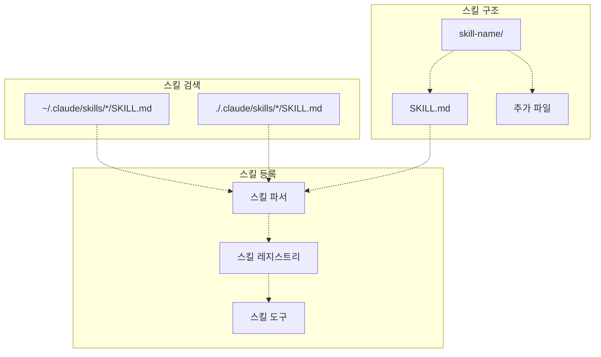

각 스킬 디렉토리에는 지침이 담긴 `SKILL.md` 파일이 포함되어 있으며, 스킬에서 참조하는 추가 파일이 포함될 수 있습니다. 스킬은 스킬 이름과 인수를 전달하는 `skill` 도구를 통해 호출됩니다.

**디렉토리 구조 예시:**

```
~/.claude/skills/
├── code-review/
│   └── SKILL.md
├── test-generator/
│   └── SKILL.md
└── documentation/
    └── SKILL.md
```

출처: [README.md L621-L623](https://github.com/code-yeongyu/oh-my-opencode/blob/b92cd6ab/README.md#L621-L623)

### 에이전트 로더 (Agent Loader)

사용자 정의 에이전트는 마크다운 파일에서 로드되어 에이전트 팩토리에 통합됩니다.

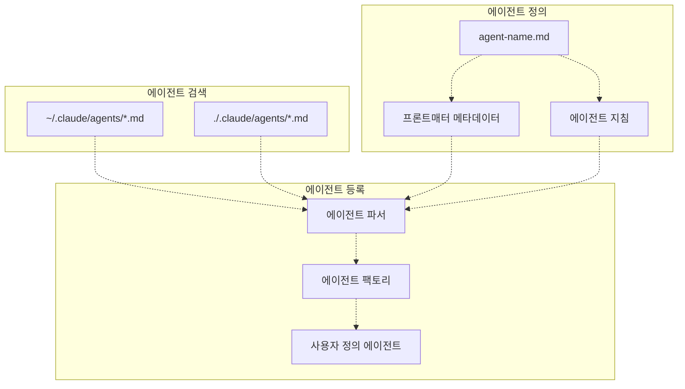

사용자 정의 에이전트는 내장 에이전트 시스템(oracle, librarian, explore 등)을 프로젝트별 또는 사용자별 에이전트로 확장합니다. 에이전트 파일은 에이전트의 모델, 도구, 권한 및 지침을 정의합니다.

**에이전트 파일 형식:**

```yaml
---
name: custom-agent
model: anthropic/claude-sonnet-4-5
temperature: 0.7
tools: [read, write, bash]
---

Custom agent instructions...
```

출처: [README.md L625-L627](https://github.com/code-yeongyu/oh-my-opencode/blob/b92cd6ab/README.md#L625-L627)

### MCP 로더 (MCP Loader)

MCP(Micro-Capability Provider) 로더는 외부 MCP 서버를 검색하고 등록합니다.

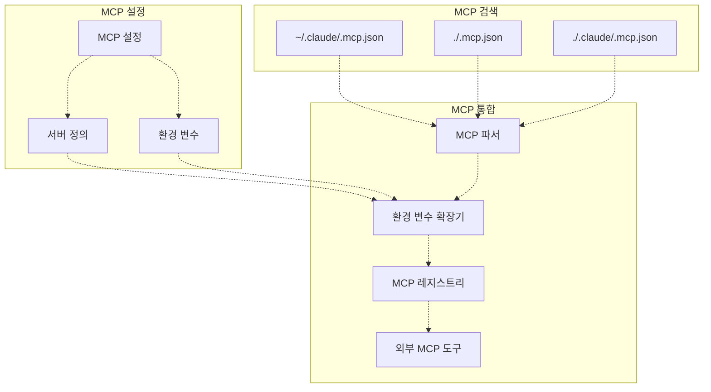

MCP 설정 파일은 추가 기능을 제공하는 외부 서비스를 정의합니다. 로더는 `${VAR}` 구문을 사용한 환경 변수 확장을 지원합니다.

**MCP 설정 형식:**

```json
{
  "mcpServers": {
    "custom-service": {
      "command": "node",
      "args": ["${HOME}/mcp-servers/custom/index.js"],
      "env": {
        "API_KEY": "${CUSTOM_SERVICE_API_KEY}"
      }
    }
  }
}
```

출처: [README.md L629-L632](https://github.com/code-yeongyu/oh-my-opencode/blob/b92cd6ab/README.md#L629-L632)

## 훅 시스템 (Hooks System)

### 훅 유형 및 이벤트 (Hook Types and Events)

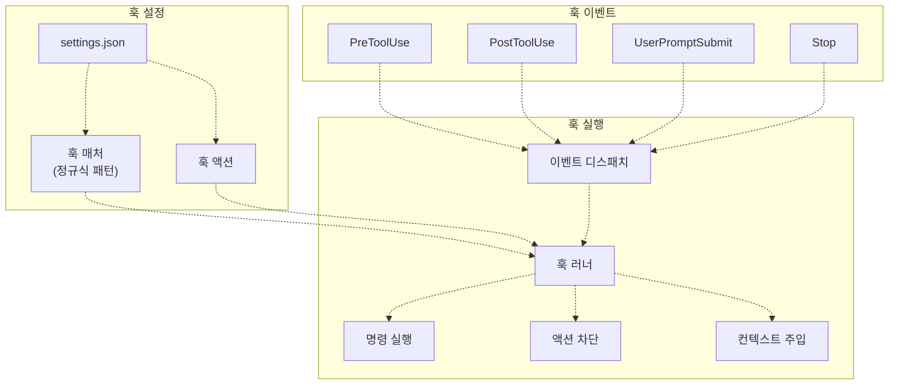

훅 시스템은 네 가지 주요 이벤트를 가로챕니다.

| 이벤트 | 시점 | 기능 |
| --- | --- | --- |
| `PreToolUse` | 도구 실행 전 | 실행 차단, 도구 입력 수정 |
| `PostToolUse` | 도구 실행 후 | 경고 추가, 컨텍스트 주입 |
| `UserPromptSubmit` | 사용자가 프롬프트를 제출할 때 | 제출 차단, 메시지 주입 |
| `Stop` | 세션이 유휴 상태가 될 때 | 후속 프롬프트 주입 |

출처: [README.md L593-L609](https://github.com/code-yeongyu/oh-my-opencode/blob/b92cd6ab/README.md#L593-L609)

### 훅 실행 흐름 (Hook Execution Flow)

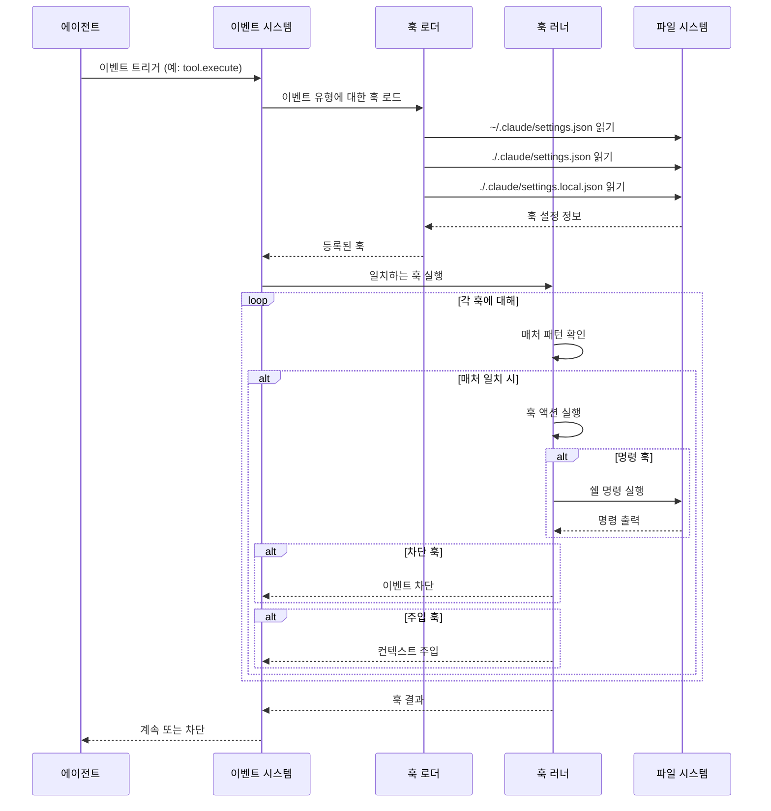

훅은 설정 파일에 정의된 순서대로 실행됩니다. 로컬 설정(`./.claude/settings.local.json`)은 프로젝트 설정을 덮어쓰고, 프로젝트 설정은 사용자 설정을 덮어씁니다.

**훅 설정 예시:**

```json
{
  "hooks": {
    "PostToolUse": [
      {
        "matcher": "Write|Edit",
        "hooks": [
          {
            "type": "command",
            "command": "eslint --fix $FILE"
          }
        ]
      }
    ],
    "PreToolUse": [
      {
        "matcher": "bash",
        "hooks": [
          {
            "type": "block",
            "message": "Bash execution requires approval"
          }
        ]
      }
    ]
  }
}
```

출처: [README.md L599-L610](https://github.com/code-yeongyu/oh-my-opencode/blob/b92cd6ab/README.md#L599-L610)

### 훅 변수 (Hook Variables)

훅은 동적 명령 실행을 위해 변수 치환을 지원합니다.

| 변수 | 설명 | 사용 가능 위치 |
| --- | --- | --- |
| `$FILE` | 도구의 영향을 받는 파일 경로 | PostToolUse (Write, Edit) |
| `$TOOL` | 실행 중인 도구 이름 | PreToolUse, PostToolUse |
| `$ARGS` | 도구 인수 (JSON) | PreToolUse, PostToolUse |
| `$CWD` | 현재 작업 디렉토리 | 모든 훅 |
| `$SESSION_ID` | 현재 세션 식별자 | 모든 훅 |

출처: [README.md L599-L610](https://github.com/code-yeongyu/oh-my-opencode/blob/b92cd6ab/README.md#L599-L610)

## 데이터 스토리지 (Data Storage)

### 할 일 관리 (Todo Management)

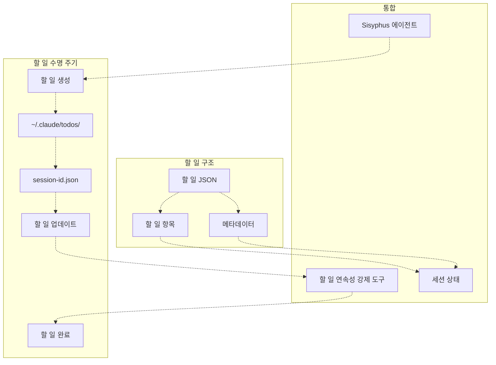

세션 할 일(todos)은 `~/.claude/todos/`에 세션당 하나의 JSON 파일로 저장됩니다. 이 형식은 Claude Code와 호환되므로 플랫폼 간 원활한 전환이 가능합니다.

**할 일 파일 형식:**

```json
{
  "sessionId": "abc123",
  "createdAt": "2025-01-01T00:00:00Z",
  "updatedAt": "2025-01-01T00:30:00Z",
  "items": [
    {
      "id": "1",
      "description": "Implement feature X",
      "status": "in_progress",
      "createdAt": "2025-01-01T00:00:00Z"
    }
  ]
}
```

출처: [README.md L636-L637](https://github.com/code-yeongyu/oh-my-opencode/blob/b92cd6ab/README.md#L636-L637)

### 기록 로깅 (Transcript Logging)

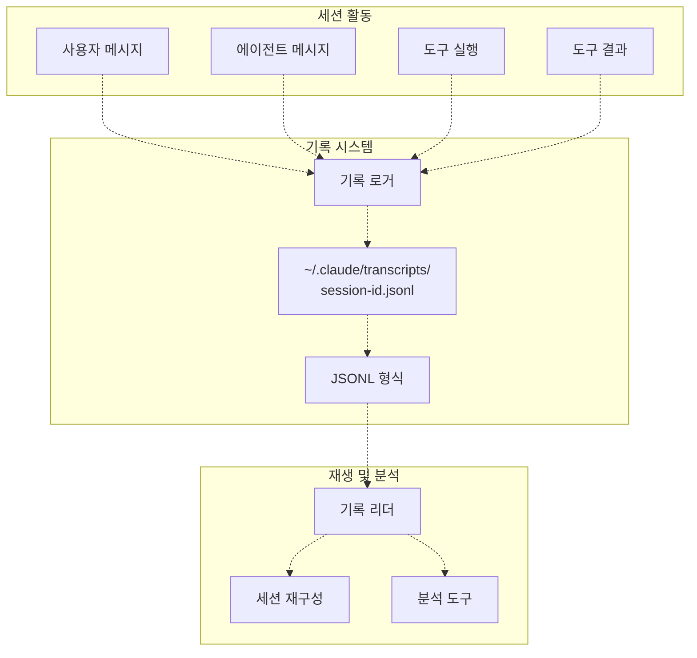

세션 활동은 `~/.claude/transcripts/`에 JSONL(JSON Lines) 형식으로 기록되며, 각 줄은 단일 이벤트를 나타냅니다. 이를 통해 세션 재생, 디버깅 및 분석이 가능합니다.

**기록 항목 형식:**

```sql
{"type":"user_message","timestamp":"2025-01-01T00:00:00Z","content":"Implement feature X"}
{"type":"agent_message","timestamp":"2025-01-01T00:00:10Z","content":"I'll create the implementation..."}
{"type":"tool_execution","timestamp":"2025-01-01T00:00:15Z","tool":"write","args":{"path":"src/feature.ts"}}
{"type":"tool_result","timestamp":"2025-01-01T00:00:16Z","tool":"write","result":"File written"}
```

출처: [README.md L639](https://github.com/code-yeongyu/oh-my-opencode/blob/b92cd6ab/README.md#L639-L639)

## 설정 토글 (Configuration Toggles)

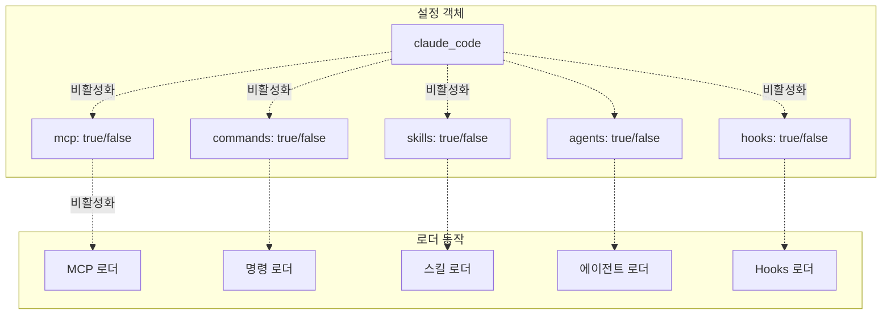

`claude_code` 설정 객체는 활성화할 호환성 기능을 세밀하게 제어할 수 있게 해줍니다.

| 토글 | `false`일 때 | 영향받지 않음 |
| --- | --- | --- |
| `mcp` | `~/.claude/.mcp.json`, `./.mcp.json`, `./.claude/.mcp.json` 로드 중단 | 내장 MCP (context7, websearch_exa, grep_app) |
| `commands` | `~/.claude/commands/*.md`, `./.claude/commands/*.md` 로드 중단 | `~/.config/opencode/command/`, `./.opencode/command/` |
| `skills` | `~/.claude/skills/*/SKILL.md`, `./.claude/skills/*/SKILL.md` 로드 중단 | - |
| `agents` | `~/.claude/agents/*.md`, `./.claude/agents/*.md` 로드 중단 | 내장 에이전트 (oracle, librarian, explore 등) |
| `hooks` | `~/.claude/settings.json`, `./.claude/settings.json`, `./.claude/settings.local.json` 로드 중단 | - |

**설정 예시:**

```json
{
  "claude_code": {
    "mcp": false,
    "commands": false,
    "skills": false,
    "agents": false,
    "hooks": false
  }
}
```

모든 토글의 기본값은 `true`(활성화)입니다. `claude_code` 객체를 생략하면 전체 호환성이 활성화됩니다. 이를 통해 사용자는 oh-my-opencode 전용 기능을 유지하면서 Claude Code 기능을 선택적으로 비활성화할 수 있습니다.

출처: [README.md L641-L664](https://github.com/code-yeongyu/oh-my-opencode/blob/b92cd6ab/README.md#L641-L664)

## 파일 경로 확인 (File Path Resolution)

호환성 계층은 플랫폼별 경로를 사용하여 설정 파일을 찾습니다.

| 플랫폼 | 사용자 설정 디렉토리 | 예시 |
| --- | --- | --- |
| Linux/macOS | `~/.claude/` | `/home/user/.claude/` |
| Windows | `~/.claude/` 또는 `%USERPROFILE%\.claude\` | `C:\Users\user\.claude\` |

프로젝트 수준 설정은 항상 워크스페이스 루트를 기준으로 확인합니다.

* 프로젝트별 재정의를 위한 `./.claude/`
* 프로젝트 루트 MCP 설정을 위한 `./.mcp.json`

출처: [README.md L586-L632](https://github.com/code-yeongyu/oh-my-opencode/blob/b92cd6ab/README.md#L586-L632)
[src/shared/config-path.ts L1-L48](https://github.com/code-yeongyu/oh-my-opencode/blob/b92cd6ab/src/shared/config-path.ts#L1-L48)

## 마이그레이션 전략 (Migration Strategy)

Claude Code에서 마이그레이션하는 사용자를 위한 전략은 다음과 같습니다.

1. **조치 불필요**: 기존 `~/.claude/` 설정이 자동으로 검색되고 로드됩니다.
2. **점진적 마이그레이션**: 호환성 토글을 사용하여 oh-my-opencode 전용 기능으로 점진적으로 전환합니다.
3. **병행 운영**: Claude Code와 oh-my-opencode 모두 동일한 `~/.claude/` 디렉토리 구조를 공유할 수 있습니다.
4. **프로젝트 격리**: 팀의 공유 설정에 영향을 주지 않고 프로젝트별 재정의를 위해 `./.claude/settings.local.json`을 사용합니다.

호환성 계층은 oh-my-opencode의 향상된 기능으로 나아가는 경로를 제공하는 동시에 가동 중단 없는 마이그레이션을 보장합니다.

출처: [README.md L578-L665](https://github.com/code-yeongyu/oh-my-opencode/blob/b92cd6ab/README.md#L578-L665)