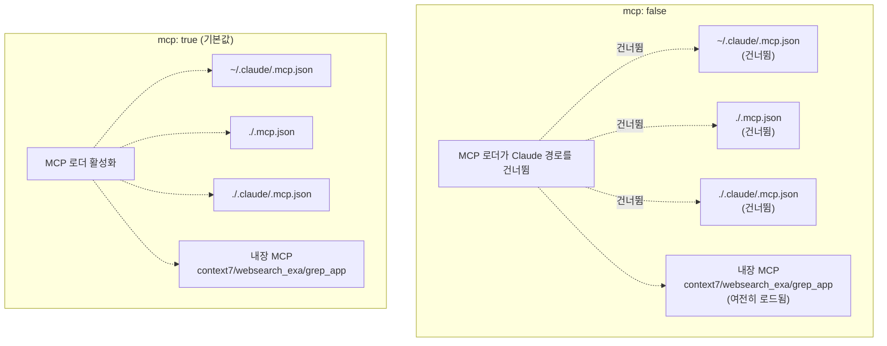
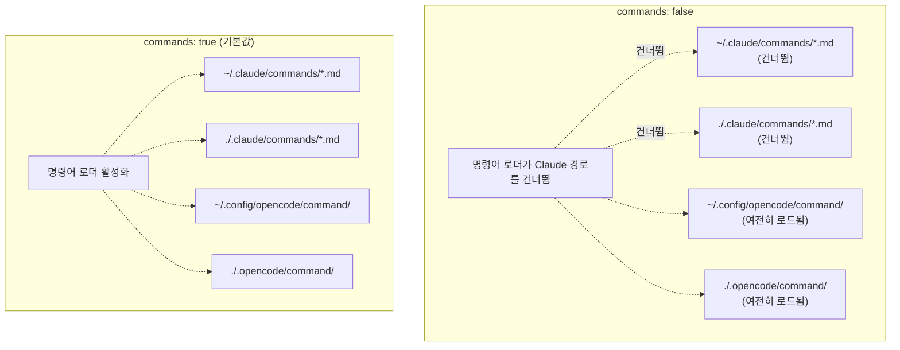
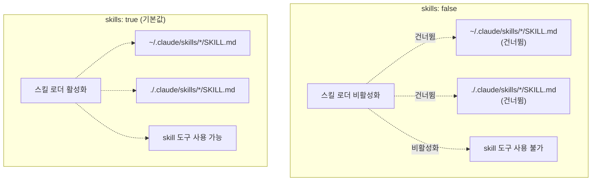
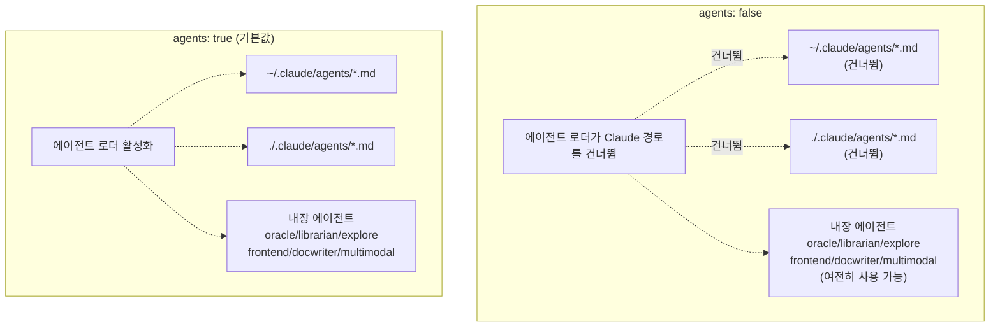
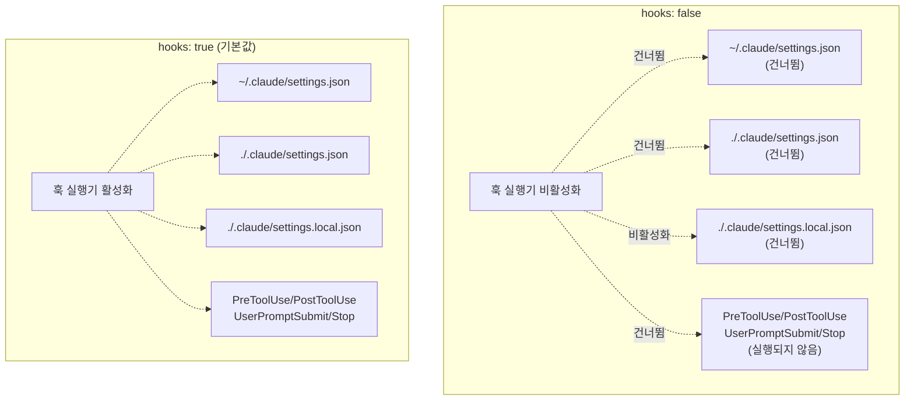
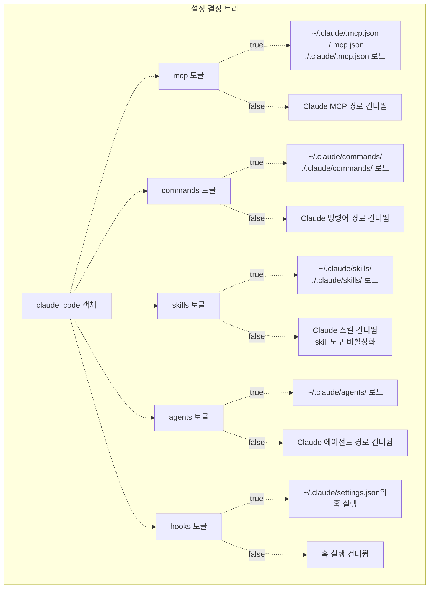

# 호환성 토글 (Compatibility Toggles)

> **관련 소스 파일**
> * [README.ja.md](https://github.com/code-yeongyu/oh-my-opencode/blob/b92cd6ab/README.ja.md)
> * [README.ko.md](https://github.com/code-yeongyu/oh-my-opencode/blob/b92cd6ab/README.ko.md)
> * [README.md](https://github.com/code-yeongyu/oh-my-opencode/blob/b92cd6ab/README.md)
> * [README.zh-cn.md](https://github.com/code-yeongyu/oh-my-opencode/blob/b92cd6ab/README.zh-cn.md)
> * [src/shared/config-path.ts](https://github.com/code-yeongyu/oh-my-opencode/blob/b92cd6ab/src/shared/config-path.ts)

이 페이지는 Claude Code 호환성 기능을 선택적으로 비활성화할 수 있는 `claude_code` 설정 객체에 대해 설명합니다. 이 토글을 사용하면 oh-my-opencode의 내장 기능을 유지하면서 어떤 Claude Code 에셋(assets)을 로드할지 세밀하게 제어할 수 있습니다.

Claude Code 설정이 로드되는 방식에 대한 정보는 [설정 마이그레이션 (Configuration Migration)](/code-yeongyu/oh-my-opencode/9.1-configuration-migration)을 참조하십시오. 훅(hook) 실행에 대한 자세한 내용은 [훅 통합 (Hooks Integration)](/code-yeongyu/oh-my-opencode/9.2-hooks-integration)을 참조하십시오.

## 목적 (Purpose)

호환성 토글 시스템을 통해 사용자는 다음을 수행할 수 있습니다:

* 다른 기능에 영향을 주지 않고 특정 Claude Code 기능을 비활성화
* 기존 Claude Code 워크플로우와의 호환성을 유지하면서 선택적으로 제외
* Claude Code와 oh-my-opencode 에셋이 모두 존재할 때 발생하는 충돌 방지
* 외부 Claude Code 에셋을 비활성화하면서 oh-my-opencode의 내장 기능 보존

## 설정 구조 (Configuration Structure)

`claude_code` 객체는 oh-my-opencode 설정 파일에서 5개의 불리언(boolean) 토글로 정의됩니다:

```json
{
  "claude_code": {
    "mcp": true,
    "commands": true,
    "skills": true,
    "agents": true,
    "hooks": true
  }
}
```

**기본 동작:** 모든 토글의 기본값은 `true`(활성화)입니다. `claude_code` 객체를 완전히 생략하면 Claude Code의 모든 호환성 기능이 활성화됩니다.

출처: [README.md L640-L665](https://github.com/code-yeongyu/oh-my-opencode/blob/b92cd6ab/README.md#L640-L665)

## 토글 참조 (Toggle Reference)

### MCP 토글



**목적:** Claude Code 디렉토리로부터 외부 MCP(Model Context Protocol) 서버 설정의 로딩을 제어합니다.

**`false`일 때:**

* `~/.claude/.mcp.json` 건너뜀
* `./.mcp.json` 건너뜀
* `./.claude/.mcp.json` 건너뜀

**영향받지 않음:**

* 내장 MCP: `context7`, `websearch_exa`, `grep_app` (`disabled_mcps`를 통해 비활성화하지 않는 한 항상 로드됨)

**사용 사례:** oh-my-opencode에서 제공하는 엄선된 MCP만 사용하고 싶거나, 기능이 충돌하거나 중복될 수 있는 사용자 정의 Claude Code MCP 설정을 로드하지 않으려는 경우에 비활성화합니다.

출처: [README.md L642-L665](https://github.com/code-yeongyu/oh-my-opencode/blob/b92cd6ab/README.md#L642-L665)

### 명령어(Commands) 토글



**목적:** Claude Code 디렉토리로부터 슬래시 명령어(slash command) 정의의 로딩을 제어합니다.

**`false`일 때:**

* `~/.claude/commands/*.md` 건너뜀
* `./.claude/commands/*.md` 건너뜀

**영향받지 않음:**

* `~/.config/opencode/command/` (OpenCode 전역 명령어)
* `./.opencode/command/` (OpenCode 프로젝트 명령어)

**사용 사례:** Claude Code와 OpenCode 간에 명령어 이름이 충돌하거나, OpenCode 디렉토리에서만 명령어 정의를 관리하고 싶을 때 비활성화합니다.

출처: [README.md L642-L665](https://github.com/code-yeongyu/oh-my-opencode/blob/b92cd6ab/README.md#L642-L665)

### 스킬(Skills) 토글



**목적:** `SKILL.md` 파일이 포함된 디렉토리 기반 스킬의 로딩을 제어합니다.

**`false`일 때:**

* `~/.claude/skills/*/SKILL.md` 건너뜀
* `./.claude/skills/*/SKILL.md` 건너뜀
* `skill` 도구 자체가 비활성화됨

**영향받지 않음:**

* 없음 (OpenCode에는 이에 상응하는 스킬 시스템이 없음)

**사용 사례:** Claude Code 스킬을 사용하지 않거나 에이전트가 스킬 기반 워크플로우를 호출하는 것을 방지하고 싶을 때 비활성화합니다.

출처: [README.md L642-L665](https://github.com/code-yeongyu/oh-my-opencode/blob/b92cd6ab/README.md#L642-L665)

### 에이전트(Agents) 토글



**목적:** Claude Code 디렉토리로부터 커스텀 에이전트 정의의 로딩을 제어합니다.

**`false`일 때:**

* `~/.claude/agents/*.md` 건너뜀
* `./.claude/agents/*.md` 건너뜀

**영향받지 않음:**

* 내장 에이전트: `oracle`, `librarian`, `explore`, `frontend-ui-ux-engineer`, `document-writer`, `multimodal-looker` (`agents` 섹션 또는 `disabled_agents`를 통해 설정됨)

**사용 사례:** oh-my-opencode의 에이전트 오케스트레이션과 충돌하는 커스텀 Claude Code 에이전트가 있거나, 내장 에이전트만 사용하고 싶을 때 비활성화합니다.

출처: [README.md L642-L665](https://github.com/code-yeongyu/oh-my-opencode/blob/b92cd6ab/README.md#L642-L665)

### 훅(Hooks) 토글



**목적:** 설정 파일로부터 Claude Code 훅(hooks)의 실행을 제어합니다.

**`false`일 때:**

* `~/.claude/settings.json` 건너뜀
* `./.claude/settings.json` 건너뜀
* `./.claude/settings.local.json` 건너뜀
* `PreToolUse`, `PostToolUse`, `UserPromptSubmit`, `Stop` 훅의 실행이 비활성화됨

**영향받지 않음:**

* 없음 (settings.json 형식의 OpenCode 훅 시스템은 별도로 존재하지 않음)

**사용 사례:** Claude Code 훅이 충돌, 성능 문제 또는 원치 않는 부작용을 일으킬 때 비활성화합니다. 이는 Claude Code의 `settings.json` 훅만 비활성화하며, oh-my-opencode의 내부 훅(`disabled_hooks`를 통해 제어)은 비활성화하지 않습니다.

출처: [README.md L642-L665](https://github.com/code-yeongyu/oh-my-opencode/blob/b92cd6ab/README.md#L642-L665)

## 설정 예시 (Configuration Examples)

### 예시 1: 모든 Claude Code 기능 비활성화

```json
{
  "claude_code": {
    "mcp": false,
    "commands": false,
    "skills": false,
    "agents": false,
    "hooks": false
  }
}
```

**효과:** Claude Code로부터 완전히 격리됩니다. oh-my-opencode의 내장 기능만 활성화됩니다.

### 예시 2: Claude Code 명령어만 사용하고 나머지는 비활성화

```json
{
  "claude_code": {
    "mcp": false,
    "commands": true,
    "skills": false,
    "agents": false,
    "hooks": false
  }
}
```

**효과:** `~/.claude/commands/` 및 `./.claude/commands/`의 슬래시 명령어는 계속 사용할 수 있지만, Claude Code의 MCP, 스킬, 에이전트 또는 훅은 로드되지 않습니다.

### 예시 3: 훅은 활성화하되 외부 정의는 비활성화

```json
{
  "claude_code": {
    "mcp": false,
    "commands": false,
    "skills": false,
    "agents": false,
    "hooks": true
  }
}
```

**효과:** Claude Code 훅은 정상적으로 실행되지만, 외부 MCP, 명령어, 스킬 또는 에이전트는 로드되지 않습니다. 내장 기능만 사용하면서 워크플로우 자동화를 유지하려는 경우에 유용합니다.

### 예시 4: 전체 호환성 (기본값)

```
{}
```

또는

```json
{
  "claude_code": {
    "mcp": true,
    "commands": true,
    "skills": true,
    "agents": true,
    "hooks": true
  }
}
```

**효과:** 모든 Claude Code 호환성 기능이 활성화됩니다. Claude Code에서 마이그레이션하는 사용자에게 최대의 호환성을 제공합니다.

출처: [README.md L642-L665](https://github.com/code-yeongyu/oh-my-opencode/blob/b92cd6ab/README.md#L642-L665)

## 토글 영향 요약 (Toggle Impact Summary)



| 토글 | 비활성화되는 경로 | 유지되는 기능 |
| --- | --- | --- |
| `mcp: false` | `~/.claude/.mcp.json`<br>`./.mcp.json`<br>`./.claude/.mcp.json` | 내장 MCP (`context7`, `websearch_exa`, `grep_app`) |
| `commands: false` | `~/.claude/commands/*.md`<br>`./.claude/commands/*.md` | `~/.config/opencode/command/`<br>`./.opencode/command/` |
| `skills: false` | `~/.claude/skills/*/SKILL.md`<br>`./.claude/skills/*/SKILL.md`<br>`skill` 도구 | 없음 |
| `agents: false` | `~/.claude/agents/*.md`<br>`./.claude/agents/*.md` | 내장 에이전트 (`oracle`, `librarian`, `explore`, `frontend-ui-ux-engineer`, `document-writer`, `multimodal-looker`) |
| `hooks: false` | `~/.claude/settings.json`<br>`./.claude/settings.json`<br>`./.claude/settings.local.json`<br>훅 실행 (`PreToolUse`, `PostToolUse`, `UserPromptSubmit`, `Stop`) | 없음 |

출처: [README.md L642-L665](https://github.com/code-yeongyu/oh-my-opencode/blob/b92cd6ab/README.md#L642-L665)

## 설정 파일 위치 (Configuration File Locations)

호환성 토글은 다음 두 위치 중 하나에서 설정할 수 있습니다:

1. **사용자 레벨:** `~/.config/opencode/oh-my-opencode.json` (Windows의 경우 `%APPDATA%\opencode\oh-my-opencode.json`)
2. **프로젝트 레벨:** `.opencode/oh-my-opencode.json`

프로젝트 레벨 설정이 사용자 레벨 설정보다 우선합니다. 두 파일이 모두 존재하는 경우, `claude_code` 객체에 대해 프로젝트 설정이 사용자 설정을 덮어씁니다.

출처: [src/shared/config-path.ts L1-L48](https://github.com/code-yeongyu/oh-my-opencode/blob/b92cd6ab/src/shared/config-path.ts#L1-L48)

 [README.md L698-L706](https://github.com/code-yeongyu/oh-my-opencode/blob/b92cd6ab/README.md#L698-L706)

## 다른 설정 옵션과의 상호작용 (Interaction with Other Configuration Options)

`claude_code` 토글은 다른 oh-my-opencode 설정 옵션과 독립적입니다:

### 내장 기능 토글

```json
{
  "disabled_agents": ["oracle", "librarian"],
  "disabled_mcps": ["context7"],
  "disabled_hooks": ["comment-checker"],
  "claude_code": {
    "agents": false,
    "mcp": false
  }
}
```

* `disabled_agents`: oh-my-opencode의 내장 에이전트를 제어합니다 (`claude_code.agents`의 영향을 받지 않음).
* `disabled_mcps`: oh-my-opencode의 내장 MCP를 제어합니다 (`claude_code.mcp`의 영향을 받지 않음).
* `disabled_hooks`: oh-my-opencode의 내부 훅을 제어합니다 (`claude_code.hooks`의 영향을 받지 않음).

### Sisyphus 에이전트 설정

```json
{
  "sisyphus_agent": {
    "disabled": false
  },
  "claude_code": {
    "agents": false
  }
}
```

`sisyphus_agent.disabled` 설정은 oh-my-opencode의 Sisyphus 오케스트레이터를 제어하는 반면, `claude_code.agents: false`는 `~/.claude/agents/`로부터 커스텀 Claude Code 에이전트 정의가 로드되는 것만 방지합니다.

출처: [README.md L779-L869](https://github.com/code-yeongyu/oh-my-opencode/blob/b92cd6ab/README.md#L779-L869)

## 권장 사항 (Best Practices)

### 마이그레이션 전략

Claude Code에서 oh-my-opencode로 마이그레이션할 때:

1. **전체 호환성으로 시작:** 처음에는 `claude_code` 객체를 생략합니다.
2. **점진적 테스트:** 충돌을 식별하기 위해 한 번에 하나의 기능씩 비활성화해 봅니다.
3. **의존성 문서화:** 워크플로우에 중요한 Claude Code 에셋이 무엇인지 기록해 둡니다.

### 성능 최적화

시작 시간과 메모리 사용량을 줄이려면 사용하지 않는 기능을 비활성화하십시오:

```json
{
  "claude_code": {
    "mcp": false,
    "commands": true,
    "skills": false,
    "agents": false,
    "hooks": true
  }
}
```

### 충돌 해결

Claude Code와 oh-my-opencode 기능 간에 충돌이 발생하는 경우:

1. `claude_code` 토글을 통해 해당 Claude Code 기능을 비활성화합니다.
2. 중요한 기능을 oh-my-opencode 설정으로 마이그레이션합니다.
3. `claude_code` 토글을 다시 활성화하여 문제가 해결되었는지 테스트합니다.

출처: [README.md L640-L665](https://github.com/code-yeongyu/oh-my-opencode/blob/b92cd6ab/README.md#L640-L665)