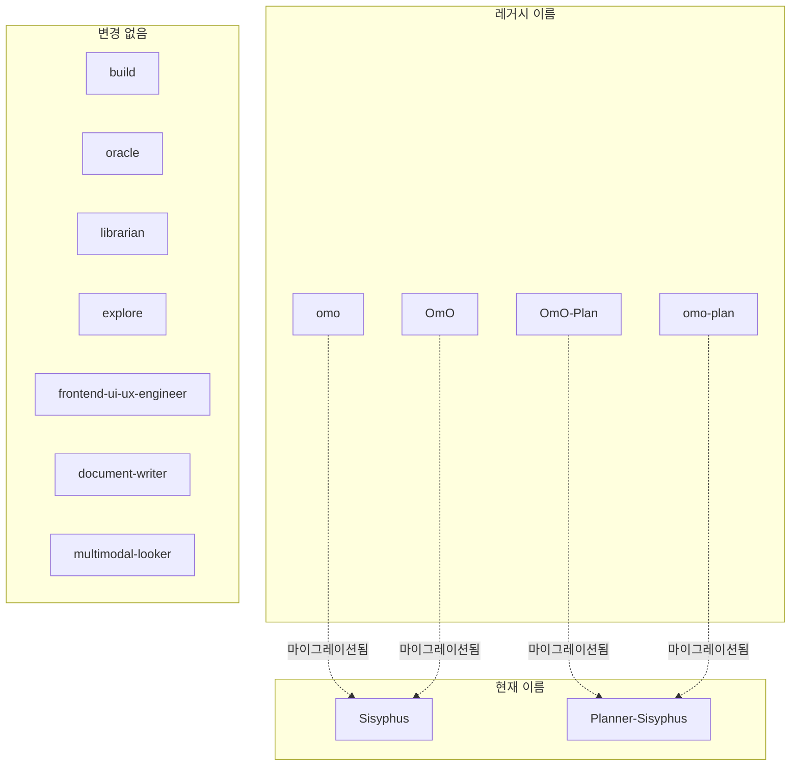
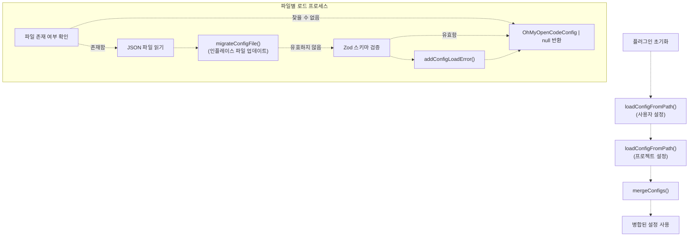
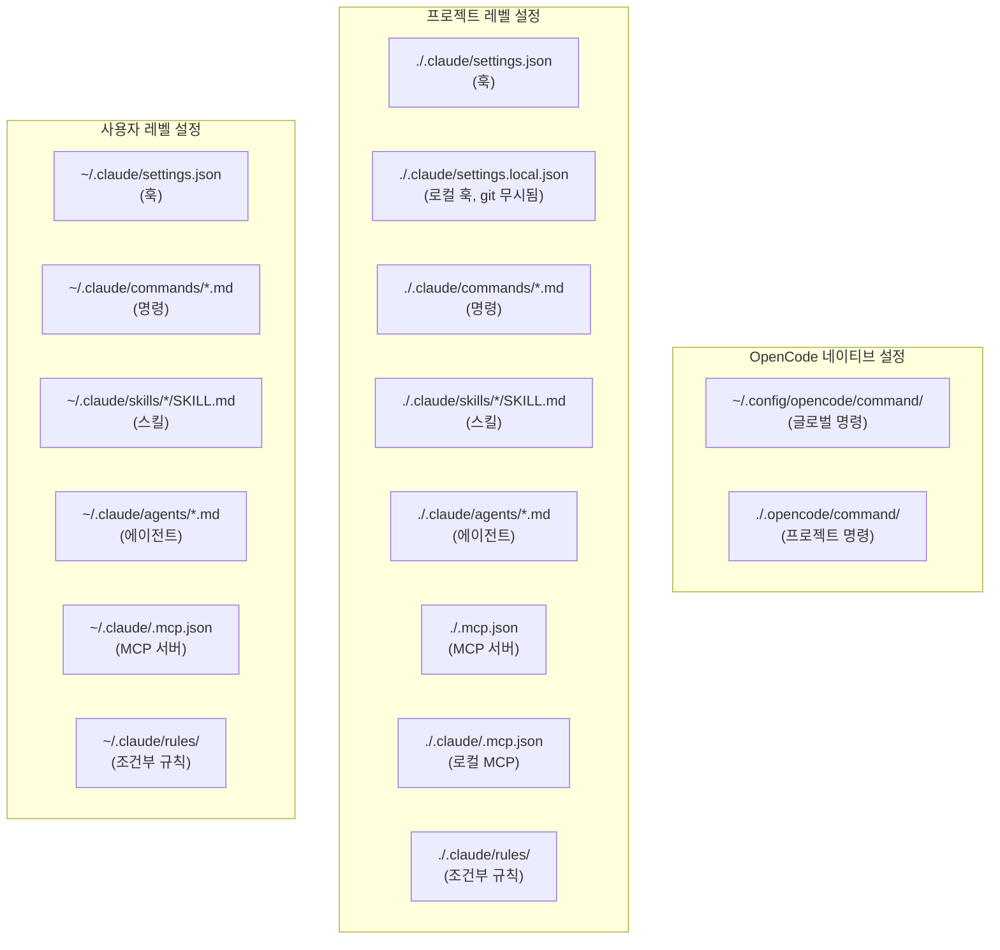
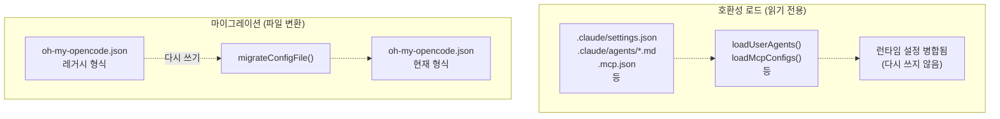

# 설정 마이그레이션 (Configuration Migration)

> **관련 소스 파일**
> * [README.ja.md](https://github.com/code-yeongyu/oh-my-opencode/blob/b92cd6ab/README.ja.md)
> * [README.ko.md](https://github.com/code-yeongyu/oh-my-opencode/blob/b92cd6ab/README.ko.md)
> * [README.md](https://github.com/code-yeongyu/oh-my-opencode/blob/b92cd6ab/README.md)
> * [README.zh-cn.md](https://github.com/code-yeongyu/oh-my-opencode/blob/b92cd6ab/README.zh-cn.md)
> * [src/shared/config-path.ts](https://github.com/code-yeongyu/oh-my-opencode/blob/b92cd6ab/src/shared/config-path.ts)

이 문서는 oh-my-opencode가 레거시(legacy) 형식에서 현재 형식으로 설정 마이그레이션을 처리하는 방법과, 호환성을 위해 Claude Code 설정 파일을 로드하고 변환하는 방법을 설명합니다.

설정 로드 이외의 Claude Code 호환 기능에 대한 정보는 [기능 패리티(Feature Parity)](/code-yeongyu/oh-my-opencode/9.2-hooks-integration)를 참조하십시오. 일반적인 설정 파일 구조 및 스키마에 대해서는 [설정 파일(Configuration Files)](../getting-started/Configuration-Files.md) 및 [설정 시스템(Configuration System)](/code-yeongyu/oh-my-opencode/3.2-configuration-system)을 참조하십시오.

---

## 목적 및 범위 (Purpose and Scope)

설정 마이그레이션은 oh-my-opencode가 발전함에 따라 하위 호환성(backward compatibility)을 보장합니다. 시스템은 레거시 설정 형식을 자동으로 감지하여 현재 표준으로 변환하며, 필요한 경우 설정 파일을 인플레이스(in-place, 제자리에서 직접 수정) 방식으로 다시 작성합니다.

이 페이지에서 다루는 내용은 다음과 같습니다:

* **에이전트 이름 마이그레이션**: 레거시 에이전트 식별자(`omo`, `OmO`)를 현재 명칭(`Sisyphus`, `Planner-Sisyphus`)으로 변환
* **설정 키 마이그레이션**: 더 이상 사용되지 않는(deprecated) 키의 이름 변경 (`omo_agent` → `sisyphus_agent`)
* **파일 다시 쓰기**: 설정 파일의 자동 인플레이스 업데이트
* **Claude Code 설정 로드**: 외부 Claude Code 설정을 탐색하고 로드하는 방법

다음 내용은 다루지 **않습니다**:

* 설정 스키마 자체 (참조: [설정 스키마 레퍼런스](/code-yeongyu/oh-my-opencode/12.1-build-system))
* 런타임 설정 병합 로직 (참조: [설정 시스템](/code-yeongyu/oh-my-opencode/3.2-configuration-system))

---

## 에이전트 이름 마이그레이션 (Agent Name Migration)

### 레거시에서 현재로의 매핑 (Legacy to Current Mapping)

플러그인은 프로젝트 브랜딩이 "OmO"에서 "Sisyphus"로 변경되는 과정에서 바뀐 에이전트 이름에 대해 하위 호환성을 유지합니다.



**에이전트 이름 매핑 테이블**

| 레거시 이름 | 현재 이름 | 비고 |
| --- | --- | --- |
| `omo` | `Sisyphus` | 원본 메인 오케스트레이터(orchestrator) 이름 |
| `OmO` | `Sisyphus` | 대소문자 변형 |
| `OmO-Plan` | `Planner-Sisyphus` | 플래닝 모드 변형 |
| `omo-plan` | `Planner-Sisyphus` | 소문자 변형 |
| `sisyphus` | `Sisyphus` | 대소문자 정규화 |
| `planner-sisyphus` | `Planner-Sisyphus` | 대소문자 정규화 |

마이그레이션 시 매칭은 **대소문자를 구분하지 않으나**, 출력은 표준 형식(canonical form)으로 수행됩니다.

**소스:** [src/index.ts L56-L73](https://github.com/code-yeongyu/oh-my-opencode/blob/b92cd6ab/src/index.ts#L56-L73)

### 마이그레이션 함수 (Migration Function)

`migrateAgentNames()` 함수가 변환을 수행합니다:

```javascript
function migrateAgentNames(agents: Record<string, unknown>): 
  { migrated: Record<string, unknown>; changed: boolean }
```

**동작 방식:**

1. 모든 에이전트 설정 키를 반복합니다.
2. 각 키를 `AGENT_NAME_MAP`에서 찾습니다 (대소문자 구분 없음).
3. 매핑이 존재하면 키의 이름을 변경합니다.
4. 마이그레이션된 객체와 `changed` 플래그를 모두 반환합니다.

**소스:** [src/index.ts L75-L88](https://github.com/code-yeongyu/oh-my-opencode/blob/b92cd6ab/src/index.ts#L75-L88)

---

## 설정 키 마이그레이션 (Configuration Key Migration)

에이전트 이름 외에도, 플러그인은 더 이상 사용되지 않는 최상위 설정 키를 마이그레이션합니다.

### 현재 마이그레이션 대상

| 레거시 키 | 현재 키 | 도입된 버전 |
| --- | --- | --- |
| `omo_agent` | `sisyphus_agent` | 1.0.0 |

### 마이그레이션 로직 (Migration Logic)

`migrateConfigFile()` 함수는 에이전트 이름과 설정 키 마이그레이션을 모두 처리합니다:

```javascript
function migrateConfigFile(configPath: string, rawConfig: Record<string, unknown>): boolean
```

**프로세스:**

1. **에이전트 이름 마이그레이션**: `agents` 객체가 존재하면 `migrateAgentNames()`를 실행합니다.
2. **키 마이그레이션**: `omo_agent`가 존재하면 `sisyphus_agent`로 복사하고 이전 키를 삭제합니다.
3. **파일 다시 쓰기**: 변경 사항이 발생하면 포맷팅된 JSON으로 디스크에 다시 씁니다.
4. **반환 값**: 파일이 수정되었으면 `true`, 그렇지 않으면 `false`를 반환합니다.

**소스:** [src/index.ts L90-L117](https://github.com/code-yeongyu/oh-my-opencode/blob/b92cd6ab/src/index.ts#L90-L117)

---

## 마이그레이션을 포함한 설정 로드 (Configuration Loading with Migration)



**설정 파일 로드 순서**

플러그인은 두 위치에서 설정을 로드하며, 프로젝트 레벨 설정이 사용자 레벨 설정을 덮어씁니다:

1. **사용자 설정 (User Config)** (기본): `~/.config/opencode/oh-my-opencode.json` * Windows 폴백: `%APPDATA%\opencode\oh-my-opencode.json`
2. **프로젝트 설정 (Project Config)** (오버라이드): `.opencode/oh-my-opencode.json` (프로젝트 루트 기준 상대 경로)

**소스:** [src/index.ts L177-L209](https://github.com/code-yeongyu/oh-my-opencode/blob/b92cd6ab/src/index.ts#L177-L209)

 [src/shared/config-path.ts L13-L33](https://github.com/code-yeongyu/oh-my-opencode/blob/b92cd6ab/src/shared/config-path.ts#L13-L33)

### 마이그레이션 트리거 (Migration Triggers)

마이그레이션은 다음 이벤트 동안 모든 설정 로드 시 **자동으로** 실행됩니다:

* 플러그인 초기화
* 설정 파일 읽기
* 스키마 검증 전

**마이그레이션은 멱등성(idempotent)을 가집니다**: 이미 마이그레이션된 파일에 대해 마이그레이션을 여러 번 실행해도 변경 사항이 발생하지 않습니다.

### 파일 시스템 영향

마이그레이션이 변경 사항을 감지하면:

1. **백업**: 자동 백업은 생성되지 않습니다 (마이그레이션은 설계상 비파괴적입니다).
2. **다시 쓰기**: 포맷팅된 JSON(`JSON.stringify(rawConfig, null, 2)`)으로 파일을 덮어씁니다.
3. **로깅**: 설정 경로와 함께 마이그레이션 이벤트가 기록됩니다.
4. **에러 처리**: 쓰기 실패는 기록되지만 플러그인 로딩을 차단하지는 않습니다.

```
fs.writeFileSync(configPath, JSON.stringify(rawConfig, null, 2) + "\n", "utf-8")
log(`Migrated config file: ${configPath} (OmO → Sisyphus)`)
```

**소스:** [src/index.ts L107-L114](https://github.com/code-yeongyu/oh-my-opencode/blob/b92cd6ab/src/index.ts#L107-L114)

---

## Claude Code 설정 로드 (Claude Code Configuration Loading)

플러그인은 호환성을 제공하기 위해 Claude Code 디렉토리에서 추가 설정을 로드합니다. 이는 **마이그레이션과는 별개**이며, 이 파일들은 읽기만 할 뿐 수정되지 않습니다.

### 설정 소스 (Configuration Sources)



### 설정 토글 (Configuration Toggles)

각 Claude Code 설정 유형은 `claude_code` 설정 객체를 통해 개별적으로 비활성화할 수 있습니다:

```json
{
  "claude_code": {
    "mcp": false,
    "commands": false,
    "skills": false,
    "agents": false,
    "hooks": false
  }
}
```

**기본값**: 모든 기능 활성화 (`true`)

**소스:** [src/config/schema.ts L97-L103](https://github.com/code-yeongyu/oh-my-opencode/blob/b92cd6ab/src/config/schema.ts#L97-L103)

 [src/index.ts L268-L270](https://github.com/code-yeongyu/oh-my-opencode/blob/b92cd6ab/src/index.ts#L268-L270)

 [src/index.ts L379-L380](https://github.com/code-yeongyu/oh-my-opencode/blob/b92cd6ab/src/index.ts#L379-L380)

 [src/index.ts L452-L467](https://github.com/code-yeongyu/oh-my-opencode/blob/b92cd6ab/src/index.ts#L452-L467)

### 설정 로드 함수 (Configuration Loading Functions)

| 로더 함수 | 설정 유형 | 확인하는 경로 | 토글 |
| --- | --- | --- | --- |
| `loadUserCommands()` | 슬래시 명령 | `~/.claude/commands/*.md` | `claude_code.commands` |
| `loadProjectCommands()` | 슬래시 명령 | `./.claude/commands/*.md` | `claude_code.commands` |
| `loadOpencodeGlobalCommands()` | 슬래시 명령 | `~/.config/opencode/command/` | 항상 로드됨 |
| `loadOpencodeProjectCommands()` | 슬래시 명령 | `./.opencode/command/` | 항상 로드됨 |
| `loadUserSkillsAsCommands()` | 스킬 | `~/.claude/skills/*/SKILL.md` | `claude_code.skills` |
| `loadProjectSkillsAsCommands()` | 스킬 | `./.claude/skills/*/SKILL.md` | `claude_code.skills` |
| `loadUserAgents()` | 커스텀 에이전트 | `~/.claude/agents/*.md` | `claude_code.agents` |
| `loadProjectAgents()` | 커스텀 에이전트 | `./.claude/agents/*.md` | `claude_code.agents` |
| `loadMcpConfigs()` | MCP 서버 | `~/.claude/.mcp.json`, `./.mcp.json`, `./.claude/.mcp.json` | `claude_code.mcp` |
| `createClaudeCodeHooksHook()` | 훅 | `~/.claude/settings.json`, `./.claude/settings.json`, `./.claude/settings.local.json` | `claude_code.hooks` |

**소스:** [src/index.ts L461-L477](https://github.com/code-yeongyu/oh-my-opencode/blob/b92cd6ab/src/index.ts#L461-L477)

 [src/features/claude-code-command-loader.ts](https://github.com/code-yeongyu/oh-my-opencode/blob/b92cd6ab/src/features/claude-code-command-loader.ts)

 [src/features/claude-code-skill-loader.ts](https://github.com/code-yeongyu/oh-my-opencode/blob/b92cd6ab/src/features/claude-code-skill-loader.ts)

 [src/features/claude-code-agent-loader.ts](https://github.com/code-yeongyu/oh-my-opencode/blob/b92cd6ab/src/features/claude-code-agent-loader.ts)

 [src/features/claude-code-mcp-loader.ts](https://github.com/code-yeongyu/oh-my-opencode/blob/b92cd6ab/src/features/claude-code-mcp-loader.ts)

 [src/hooks/claude-code-hooks.ts](https://github.com/code-yeongyu/oh-my-opencode/blob/b92cd6ab/src/hooks/claude-code-hooks.ts)

---

## 마이그레이션 vs 호환성 로드 (Migration vs. Compatibility Loading)



**주요 차이점:**

| 측면 | 마이그레이션 | 호환성 로드 |
| --- | --- | --- |
| **대상 파일** | `oh-my-opencode.json` | `.claude/*` 디렉토리 |
| **파일 수정** | 예 (파일 다시 쓰기) | 아니요 (읽기 전용) |
| **트리거** | 모든 플러그인 로드 시 | 모든 플러그인 로드 시 |
| **목적** | 지원 중단된 형식 업데이트 | Claude Code 생태계 지원 |
| **제어 방식** | 자동 (항상 실행) | `claude_code.*` 토글 |

**소스:** [src/index.ts L90-L117](https://github.com/code-yeongyu/oh-my-opencode/blob/b92cd6ab/src/index.ts#L90-L117)

 [src/index.ts L461-L477](https://github.com/code-yeongyu/oh-my-opencode/blob/b92cd6ab/src/index.ts#L461-L477)

---

## 에러 처리 (Error Handling)

### 검증 에러 (Validation Errors)

마이그레이션 후 스키마 검증에 실패하면 에러가 기록되고 저장됩니다:

```javascript
const result = OhMyOpenCodeConfigSchema.safeParse(rawConfig)
if (!result.success) {
  const errorMsg = result.error.issues.map(i => `${i.path.join(".")}: ${i.message}`).join(", ")
  log(`Config validation error in ${configPath}:`, result.error.issues)
  addConfigLoadError({ path: configPath, error: `Validation error: ${errorMsg}` })
  return null
}
```

**동작 방식:**

* 검증 에러가 발생해도 플러그인 로딩이 차단되지 **않습니다**.
* 유효하지 않은 설정은 `null`을 반환하며 기본값이 사용됩니다.
* 에러는 디버깅을 위해 `getConfigLoadErrors()`를 통해 접근할 수 있습니다.

**소스:** [src/index.ts L127-L134](https://github.com/code-yeongyu/oh-my-opencode/blob/b92cd6ab/src/index.ts#L127-L134)

### 마이그레이션 쓰기 실패 (Migration Write Failures)

마이그레이션 중 파일 쓰기에 실패하는 경우:

```javascript
try {
  fs.writeFileSync(configPath, JSON.stringify(rawConfig, null, 2) + "\n", "utf-8")
  log(`Migrated config file: ${configPath} (OmO → Sisyphus)`)
} catch (err) {
  log(`Failed to write migrated config to ${configPath}:`, err)
}
```

**동작 방식:**

* 쓰기 실패는 기록되지만 예외를 던지지는 않습니다.
* 플러그인은 메모리상에서 마이그레이션된 설정을 사용하여 로딩을 계속합니다.
* 파일은 레거시 형식으로 유지됩니다 (다음 로드 시 마이그레이션이 재시도됩니다).

**소스:** [src/index.ts L107-L114](https://github.com/code-yeongyu/oh-my-opencode/blob/b92cd6ab/src/index.ts#L107-L114)

---

## 마이그레이션 후 설정 병합 (Configuration Merging After Migration)

사용자 설정과 프로젝트 설정이 모두 로드되고 마이그레이션된 후, 두 설정이 병합됩니다:

```javascript
function mergeConfigs(base: OhMyOpenCodeConfig, override: OhMyOpenCodeConfig): OhMyOpenCodeConfig
```

**병합 전략:**

1. **단순 오버라이드**: `override`의 최상위 프리미티브(primitive) 및 불리언(boolean) 값이 `base`를 대체합니다.
2. **딥 머지 (Deep merge)**: `agents` 객체는 `deepMerge()`를 사용하여 중첩된 속성을 결합합니다.
3. **배열 중복 제거**: `disabled_agents`, `disabled_mcps`, `disabled_hooks`는 병합된 후 `Set`을 사용하여 중복이 제거됩니다.
4. **중첩 객체**: `claude_code`는 `deepMerge()`를 사용합니다.

**우선순위**: 프로젝트 설정 > 사용자 설정

**소스:** [src/index.ts L147-L175](https://github.com/code-yeongyu/oh-my-opencode/blob/b92cd6ab/src/index.ts#L147-L175)

---

## 플랫폼별 설정 경로 (Platform-Specific Configuration Paths)

### Windows 설정 탐색

Windows에서는 크로스 플랫폼 호환성을 위해 여러 경로를 확인합니다:

1. **권장**: `~/.config/opencode/oh-my-opencode.json` (크로스 플랫폼 관례)
2. **폴백(Fallback)**: `%APPDATA%\opencode\oh-my-opencode.json` (Windows 네이티브)

**탐색 로직:**

```javascript
if (process.platform === "win32") {
  const crossPlatformDir = path.join(os.homedir(), ".config")
  const crossPlatformConfigPath = path.join(crossPlatformDir, "opencode", "oh-my-opencode.json")
  
  const appdataDir = process.env.APPDATA || path.join(os.homedir(), "AppData", "Roaming")
  const appdataConfigPath = path.join(appdataDir, "opencode", "oh-my-opencode.json")
  
  if (fs.existsSync(crossPlatformConfigPath)) {
    return crossPlatformDir
  }
  
  if (fs.existsSync(appdataConfigPath)) {
    return appdataDir
  }
  
  return crossPlatformDir  // 신규 설치 시 크로스 플랫폼 경로를 기본값으로 사용
}
```

**Windows에서의 마이그레이션 동작:**

* 크로스 플랫폼 경로를 먼저 확인합니다.
* 발견되면 APPDATA 경로로 폴백합니다.
* 감지된 경로에 마이그레이션 결과를 씁니다.
* 신규 설치 시 일관성을 위해 `~/.config`를 기본값으로 사용합니다.

**소스:** [src/shared/config-path.ts L13-L33](https://github.com/code-yeongyu/oh-my-opencode/blob/b92cd6ab/src/shared/config-path.ts#L13-L33)

### Linux/macOS 설정 탐색

Unix 계열 시스템에서는 XDG 기본 디렉토리 사양(XDG Base Directory specification)을 따릅니다:

* **설정 디렉토리**: `$XDG_CONFIG_HOME` 또는 `~/.config` (환경 변수가 설정되지 않은 경우)
* **전체 경로**: `$XDG_CONFIG_HOME/opencode/oh-my-opencode.json`

**소스:** [src/shared/config-path.ts L32](https://github.com/code-yeongyu/oh-my-opencode/blob/b92cd6ab/src/shared/config-path.ts#L32-L32)

---

## 마이그레이션 예시 (Migration Example)

### 마이그레이션 전

```json
{
  "$schema": "https://raw.githubusercontent.com/code-yeongyu/oh-my-opencode/master/assets/oh-my-opencode.schema.json",
  "agents": {
    "omo": {
      "model": "anthropic/claude-opus-4-5",
      "temperature": 0.3
    },
    "OmO-Plan": {
      "model": "anthropic/claude-sonnet-4"
    }
  },
  "omo_agent": {
    "disabled": false
  }
}
```

### 마이그레이션 후 (자동)

```json
{
  "$schema": "https://raw.githubusercontent.com/code-yeongyu/oh-my-opencode/master/assets/oh-my-opencode.schema.json",
  "agents": {
    "Sisyphus": {
      "model": "anthropic/claude-opus-4-5",
      "temperature": 0.3
    },
    "Planner-Sisyphus": {
      "model": "anthropic/claude-sonnet-4"
    }
  },
  "sisyphus_agent": {
    "disabled": false
  }
}
```

**적용된 변경 사항:**

* `agents.omo` → `agents.Sisyphus`
* `agents.OmO-Plan` → `agents.Planner-Sisyphus`
* `omo_agent` → `sisyphus_agent`

---

## 요약 (Summary)

oh-my-opencode의 설정 마이그레이션은 다음을 보장합니다:

* **하위 호환성**: 레거시 설정이 계속 작동합니다.
* **자동 업데이트**: 로드 시 파일이 투명하게 마이그레이션됩니다.
* **비파괴적**: 변경이 필요한 경우에만 파일을 다시 씁니다.
* **관심사 분리 (Separation of concerns)**: 마이그레이션(파일 수정)은 호환성 로드(읽기 전용)와 구별됩니다.
* **에러 회복성 (Error resilience)**: 마이그레이션 실패가 플러그인 기능을 중단시키지 않습니다.

**소스:** [src/index.ts L56-L209](https://github.com/code-yeongyu/oh-my-opencode/blob/b92cd6ab/src/index.ts#L56-L209)

 [src/shared/config-path.ts L1-L48](https://github.com/code-yeongyu/oh-my-opencode/blob/b92cd6ab/src/shared/config-path.ts#L1-L48)

 [src/config/schema.ts L97-L103](https://github.com/code-yeongyu/oh-my-opencode/blob/b92cd6ab/src/config/schema.ts#L97-L103)