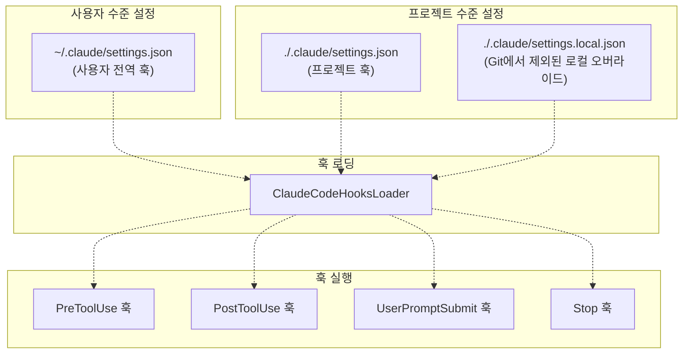
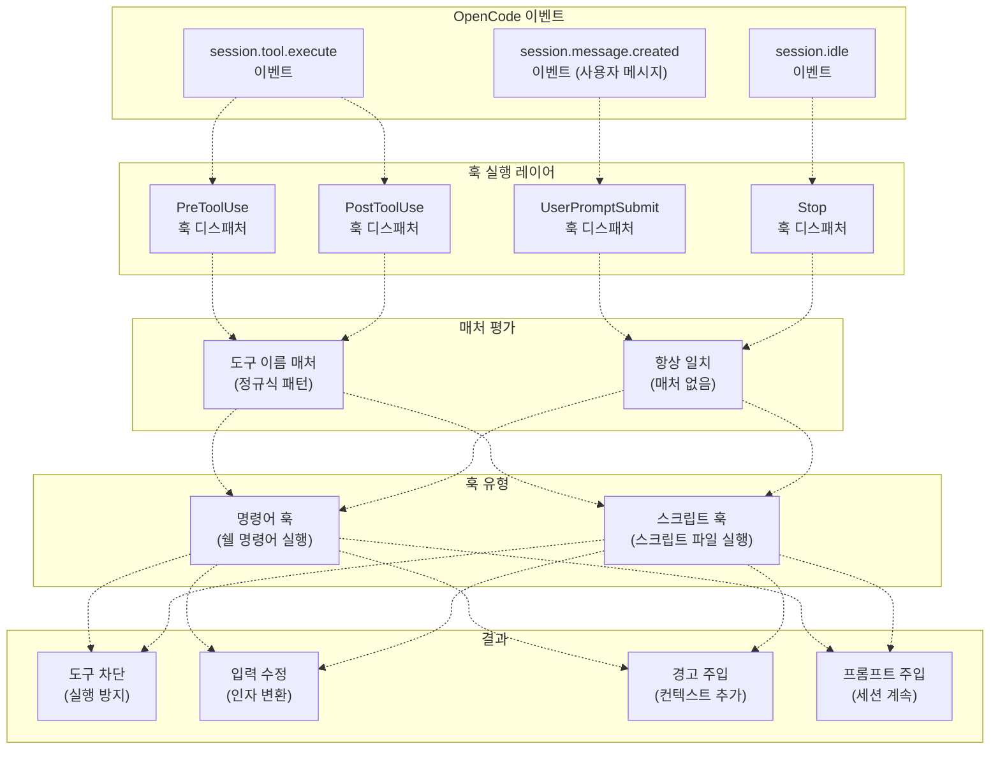
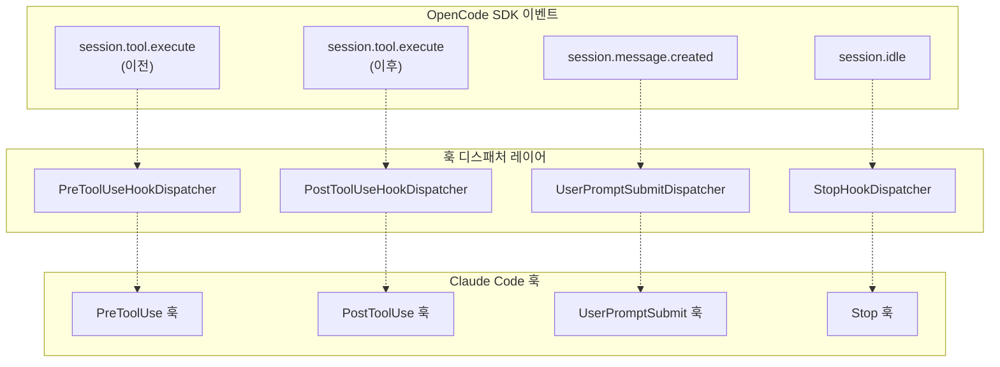
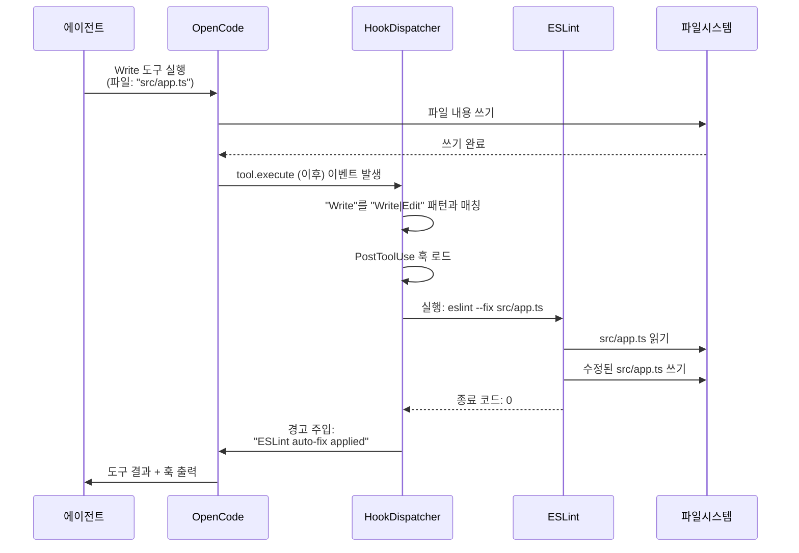

# Hooks 통합

> **관련 소스 파일**
> * [README.ja.md](https://github.com/code-yeongyu/oh-my-opencode/blob/b92cd6ab/README.ja.md)
> * [README.ko.md](https://github.com/code-yeongyu/oh-my-opencode/blob/b92cd6ab/README.ko.md)
> * [README.md](https://github.com/code-yeongyu/oh-my-opencode/blob/b92cd6ab/README.md)
> * [README.zh-cn.md](https://github.com/code-yeongyu/oh-my-opencode/blob/b92cd6ab/README.zh-cn.md)
> * [src/shared/config-path.ts](https://github.com/code-yeongyu/oh-my-opencode/blob/b92cd6ab/src/shared/config-path.ts)

이 문서는 Claude Code에서 마이그레이션하는 사용자에게 호환성을 제공하기 위해 oh-my-opencode가 Claude Code의 훅(Hook) 시스템을 실행하는 방법을 설명합니다. oh-my-opencode의 네이티브 훅 시스템에 대한 정보는 [Hook Reference](/code-yeongyu/oh-my-opencode/13.4-hook-reference)를 참조하십시오. 다른 Claude Code 호환성 기능에 대해서는 [Configuration Migration](/code-yeongyu/oh-my-opencode/9.1-configuration-migration) 및 [Compatibility Toggles](/code-yeongyu/oh-my-opencode/9.3-compatibility-toggles)를 참조하십시오.

**목적**: 훅 통합 레이어는 oh-my-opencode가 Claude Code의 `settings.json` 형식으로 정의된 커스텀 스크립트를 실행할 수 있게 합니다. 이를 통해 사용자는 기존 Claude Code 설정을 수정하지 않고도 에이전트 워크플로우의 특정 시점에서 자동화된 작업을 실행할 수 있습니다.

**범위**: 이 문서는 네 가지 Claude Code 훅 유형(`PreToolUse`, `PostToolUse`, `UserPromptSubmit`, `Stop`), 구성 파일 위치, 실행 흐름, 매처(Matcher) 구문 및 OpenCode 이벤트 시스템과의 통합을 다룹니다.

---

## 훅 유형 및 이벤트 시점

Claude Code는 oh-my-opencode가 지원하는 네 가지 훅 이벤트 유형을 정의합니다. 각 훅 유형은 에이전트 워크플로우의 특정 시점에서 실행되며, 에이전트 동작을 가로채거나 수정할 수 있는 고유한 기능을 가집니다.

| 훅 유형 | 실행 시점 | 기능 | 일반적인 사용 사례 |
| --- | --- | --- | --- |
| `PreToolUse` | 도구 실행 전 | 도구 호출 차단, 도구 입력 수정 | 인자 유효성 검사, 환경 변수 주입, 위험한 작업 방지 |
| `PostToolUse` | 도구 실행 후 | 도구 결과에 경고/컨텍스트 추가 | 포맷터(eslint, prettier) 실행, 도구 사용 로그 기록, 추가 정보 주입 |
| `UserPromptSubmit` | 사용자가 프롬프트를 제출할 때 | 제출 차단, 메시지 주입 | 프롬프트 내용 유효성 검사, 컨텍스트 추가, 정책 강제 적용 |
| `Stop` | 세션이 유휴(Idle) 상태가 될 때 | 후속 프롬프트 주입 | 워크플로우 자동 계속, 작업 예약, 정리 작업 트리거 |

**출처**: [README.md L593-L597](https://github.com/code-yeongyu/oh-my-opencode/blob/b92cd6ab/README.md#L593-L597)

 [README.ko.md L553-L558](https://github.com/code-yeongyu/oh-my-opencode/blob/b92cd6ab/README.ko.md#L553-L558)

---

## 구성 파일 계층 구조

훅 설정은 정의된 우선순위에 따라 여러 위치에서 로드됩니다. 파일은 우선순위 순서대로 읽히며, 나중에 읽힌 파일이 이전 파일의 설정을 덮어쓰거나 병합합니다.

### 구성 파일 위치



**우선순위** (높은 순에서 낮은 순):

1. `./.claude/settings.local.json` - 로컬 오버라이드 (git-ignored)
2. `./.claude/settings.json` - 프로젝트별 훅
3. `~/.claude/settings.json` - 사용자 전역 기본값

**파일 형식**: 모든 구성 파일은 다음 구조의 JSON 형식을 사용합니다.

```
{
  "hooks": {
    "PreToolUse": [...],
    "PostToolUse": [...],
    "UserPromptSubmit": [...],
    "Stop": [...]
  }
}
```

**출처**: [README.md L586-L591](https://github.com/code-yeongyu/oh-my-opencode/blob/b92cd6ab/README.md#L586-L591)

 [README.ja.md L555-L559](https://github.com/code-yeongyu/oh-my-opencode/blob/b92cd6ab/README.ja.md#L555-L559)

---

## 훅 실행 흐름

다음 다이어그램은 훅이 OpenCode의 이벤트 시스템 및 에이전트 워크플로우와 어떻게 통합되는지 보여줍니다.

### 훅-이벤트 매핑



**실행 순서**:

1. **이벤트 트리거**: OpenCode 이벤트 발생 (`session.tool.execute`, `session.message.created`, `session.idle`)
2. **훅 디스패치**: 적절한 훅 디스패처가 이벤트를 가로챔
3. **매처 평가**: 도구 훅의 경우, 도구 이름이 설정된 패턴과 일치하는지 확인
4. **훅 실행**: 일치하는 명령어 또는 스크립트 훅 실행
5. **결과 처리**: 훅 결과 적용 (차단, 수정, 콘텐츠 주입)

**출처**: [README.md L593-L610](https://github.com/code-yeongyu/oh-my-opencode/blob/b92cd6ab/README.md#L593-L610)

---

## 훅 매처 및 필터링

도구 관련 훅(`PreToolUse`, `PostToolUse`)은 특정 도구에 대해서만 선택적으로 실행되도록 패턴 매칭을 지원합니다.

### 매처 구문

`matcher` 필드는 도구 이름에 대해 테스트되는 정규 표현식 패턴을 허용합니다.

```
{
  "matcher": "Write|Edit",
  "hooks": [...]
}
```

**매처 동작**:

* **패턴 매칭**: 대소문자를 구분하는 JavaScript 정규식을 사용합니다.
* **파이프 연산자**: `|`는 논리적 OR 역할을 합니다 (여러 대안 중 하나라도 일치하면 실행).
* **매처 없음**: `matcher`가 생략되면 모든 도구 호출에 대해 훅이 실행됩니다.
* **다중 매처**: 서로 다른 패턴에 대해 별도의 훅 객체를 정의합니다.

### 일반적인 매처 패턴

| 패턴 | 일치 대상 | 사용 사례 |
| --- | --- | --- |
| `"Write\|Edit"` | `Write`, `Edit` 도구 | 파일 수정 후 포맷터 실행 |
| `".*"` | 모든 도구 | 전역 로깅 또는 유효성 검사 |
| `"^bash$"` | `bash`와 정확히 일치 | Bash 전용 환경 설정 |
| `"lsp_.*"` | 모든 LSP 도구 | LSP 호출 모니터링 |
| `"Read\|List"` | `Read`, `List` 도구 | 파일 액세스 감사 |

**출처**: [README.md L599-L610](https://github.com/code-yeongyu/oh-my-opencode/blob/b92cd6ab/README.md#L599-L610)

---

## 훅 구성 예시

### 예시 1: 파일 쓰기 시 자동 포맷팅

파일 쓰기 또는 편집 작업 후에 ESLint 자동 수정을 실행합니다.

```json
{
  "hooks": {
    "PostToolUse": [
      {
        "matcher": "Write|Edit",
        "hooks": [
          {
            "type": "command",
            "command": "eslint --fix $FILE"
          }
        ]
      }
    ]
  }
}
```

**사용 가능한 변수**:

* `$FILE`: 수정된 파일의 경로
* `$CWD`: 현재 작업 디렉토리
* `$TOOL`: 실행된 도구의 이름

**출처**: [README.md L599-L610](https://github.com/code-yeongyu/oh-my-opencode/blob/b92cd6ab/README.md#L599-L610)

### 예시 2: Git 자동 커밋

파일 쓰기 후 변경 사항을 자동으로 커밋합니다.

```json
{
  "hooks": {
    "PostToolUse": [
      {
        "matcher": "Write",
        "hooks": [
          {
            "type": "command",
            "command": "git add $FILE && git commit -m 'Auto-commit: $FILE'"
          }
        ]
      }
    ]
  }
}
```

### 예시 3: 위험한 Bash 명령어 방지

특정 명령어에 대해 bash 실행을 차단합니다.

```json
{
  "hooks": {
    "PreToolUse": [
      {
        "matcher": "bash",
        "hooks": [
          {
            "type": "script",
            "script": "./scripts/validate-bash-command.sh",
            "block_on_failure": true
          }
        ]
      }
    ]
  }
}
```

### 예시 4: 워크플로우 자동 계속

세션이 유휴 상태가 될 때 계속 프롬프트를 주입합니다.

```python
{
  "hooks": {
    "Stop": [
      {
        "hooks": [
          {
            "type": "command",
            "command": "echo 'Continue with next task from todo list'"
          }
        ]
      }
    ]
  }
}
```

**출처**: [README.md L599-L610](https://github.com/code-yeongyu/oh-my-opencode/blob/b92cd6ab/README.md#L599-L610)

---

## 훅 실행 메커니즘

훅은 명령어 실행과 스크립트 실행의 두 가지 실행 메커니즘을 지원합니다.

### 명령어 훅 (Command Hooks)

변수 치환을 사용하여 쉘 명령어를 직접 실행합니다.

```json
{
  "type": "command",
  "command": "prettier --write $FILE"
}
```

**특징**:

* **인라인 실행**: 명령어가 쉘 컨텍스트에서 실행됩니다.
* **변수 확장**: 실행 전에 `$VAR` 구문이 치환됩니다.
* **종료 코드**: 0이 아닌 종료 코드는 작업을 차단할 수 있습니다 (`PreToolUse`).
* **출력 캡처**: stdout/stderr가 주입을 위해 캡처됩니다 (`PostToolUse`).

### 스크립트 훅 (Script Hooks)

외부 스크립트 파일을 실행합니다.

```json
{
  "type": "script",
  "script": "./hooks/validate.sh",
  "args": ["$FILE", "$TOOL"]
}
```

**특징**:

* **파일 기반**: 스크립트가 지정된 경로(구성 파일 기준 상대 경로)에 존재해야 합니다.
* **인자**: 변수를 스크립트 인자로 전달하는 것을 지원합니다.
* **재사용성**: 여러 훅 정의에서 스크립트를 공유할 수 있습니다.
* **오류 처리**: 스크립트 종료 코드가 성공/실패 여부를 결정합니다.

**출처**: [README.md L599-L610](https://github.com/code-yeongyu/oh-my-opencode/blob/b92cd6ab/README.md#L599-L610)

---

## OpenCode 이벤트 시스템과의 통합

훅 통합 레이어는 Claude Code의 훅 시스템과 OpenCode의 네이티브 이벤트 아키텍처를 연결합니다.

### 이벤트-훅 변환



**이벤트 등록**: 훅 시스템은 플러그인 초기화 중에 OpenCode 이벤트에 대한 리스너를 등록합니다. 이벤트가 발생하면 디스패처가 매처 패턴을 평가하고 구성된 훅을 실행합니다.

**실행 컨텍스트**: 훅은 다음에 대한 액세스 권한을 가지고 실행됩니다.

* **도구 컨텍스트**: 도구 이름, 인자, 실행 상태
* **세션 컨텍스트**: 현재 디렉토리, 세션 ID, 사용자 프롬프트
* **환경 변수**: OpenCode 프로세스에서 상속됨

**출처**: [README.md L586-L610](https://github.com/code-yeongyu/oh-my-opencode/blob/b92cd6ab/README.md#L586-L610)

---

## Claude Code 훅 비활성화

다른 Claude Code 호환성 기능을 유지하면서 훅 통합만 비활성화할 수 있습니다.

### 설정

`oh-my-opencode.json`에서 훅을 비활성화합니다.

```json
{
  "claude_code": {
    "hooks": false
  }
}
```

### 호환성 매트릭스

| 기능 | `hooks: false`일 때 비활성화됨 | 영향받지 않음 |
| --- | --- | --- |
| 훅 실행 | `~/.claude/settings.json` 훅 | oh-my-opencode 네이티브 훅 |
| 훅 실행 | `./.claude/settings.json` 훅 | OpenCode 이벤트 리스너 |
| 훅 실행 | `./.claude/settings.local.json` 훅 | 다른 플러그인의 훅 |
| 구성 로딩 | Claude Code 훅 설정 | oh-my-opencode 훅 설정 |

### 대안: 특정 훅 유형 비활성화

다른 훅은 활성 상태로 유지하면서 Claude Code 훅 기능만 비활성화하려면 `disabled_hooks`에 추가하십시오.

```json
{
  "disabled_hooks": ["claude-code-hooks"]
}
```

**효과**: 이는 Claude Code 호환 훅 실행을 비활성화하지만 다음은 유지합니다.

* oh-my-opencode의 네이티브 훅 (todo-continuation-enforcer, session-recovery 등)
* 기타 Claude Code 호환성 기능 (명령어, 스킬, 에이전트, MCP)

**출처**: [README.md L641-L665](https://github.com/code-yeongyu/oh-my-opencode/blob/b92cd6ab/README.md#L641-L665)

 [README.ko.md L602-L625](https://github.com/code-yeongyu/oh-my-opencode/blob/b92cd6ab/README.ko.md#L602-L625)

---

## 데이터 흐름 예시

다음 다이어그램은 파일 쓰기 작업에 대한 전체 훅 실행 흐름을 보여줍니다.

### PostToolUse 훅 예시: ESLint 자동 수정



**흐름 분석**:

1. **도구 실행**: 에이전트가 Write 도구를 호출하고, OpenCode가 파일을 씁니다.
2. **이벤트 발생**: OpenCode가 `tool.execute` 이벤트(이후 단계)를 발생시킵니다.
3. **매처 평가**: 훅 디스패처가 "Write"가 패턴과 일치하는지 확인합니다.
4. **훅 실행**: `$FILE`이 치환된 상태로 ESLint 명령어가 실행됩니다.
5. **결과 주입**: ESLint 출력이 도구 결과에 추가됩니다.
6. **에이전트 응답**: 에이전트는 결합된 도구 결과와 훅 출력을 수신합니다.

**출처**: [README.md L599-L610](https://github.com/code-yeongyu/oh-my-opencode/blob/b92cd6ab/README.md#L599-L610)

---

## 보안 고려 사항

훅 실행은 사용자가 이해해야 할 보안상의 함의를 가집니다.

### 명령어 주입 위험

**변수 치환**: `$FILE`과 같은 변수는 새니타이징(Sanitization) 없이 명령어에 직접 치환됩니다. 악의적인 파일 경로는 명령어를 주입할 수 있습니다.

**완화 방법**:

* 명령어 훅 대신 적절한 인자 따옴표 처리가 된 스크립트 훅을 사용하십시오.
* PostToolUse 명령어를 실행하기 전에 PreToolUse 훅에서 파일 경로의 유효성을 검사하십시오.
* 훅 명령어에 사용자 제어 입력을 사용하는 것을 피하십시오.

### 파일 시스템 액세스

**훅 권한**: 훅은 OpenCode 프로세스와 동일한 권한으로 실행되어 전체 파일 시스템 액세스 권한을 가집니다.

**권장 사항**:

* 훅 스크립트를 버전 관리되는 디렉토리에 저장하십시오.
* 머신별 훅에는 `.claude/settings.local.json`을 사용하십시오 (git-ignored).
* 프로젝트를 공유하기 전에 훅 설정을 감사하십시오.

### 실행 격리

**샌드박싱 없음**: 훅은 격리나 리소스 제한 없이 쉘에서 직접 실행됩니다.

**권장 사항**:

* 배포 전에 격리된 환경에서 훅을 테스트하십시오.
* 훅 스크립트에 타임아웃 제한을 설정하십시오.
* 예기치 않은 동작이 있는지 훅 실행 로그를 모니터링하십시오.

**출처**: [README.md L586-L610](https://github.com/code-yeongyu/oh-my-opencode/blob/b92cd6ab/README.md#L586-L610)

---

## 문제 해결

### 훅이 실행되지 않음

**증상**: 구성된 훅이 예상대로 실행되지 않습니다.

**진단 단계**:

1. 훅 구성 파일이 예상 경로에 존재하는지 확인합니다.
2. JSON 구문 유효성을 확인합니다 (`jsonlint` 등 사용).
3. 매처 패턴이 실제 도구 이름과 일치하는지 확인합니다.
4. 설정에서 `claude_code.hooks`가 `false`로 설정되어 있는지 확인합니다.
5. 훅이 `disabled_hooks` 배열에 포함되어 있지 않은지 확인합니다.

### 훅 실행 오류

**증상**: 훅이 실행되지만 실패하거나 예기치 않은 결과를 생성합니다.

**디버깅**:

1. 쉘 명령어/스크립트에 실행 권한이 있는지 확인합니다.
2. 스크립트 경로가 구성 파일 디렉토리에 대한 상대 경로인지 확인합니다.
3. 변수 치환을 포함하여 명령어를 수동으로 테스트합니다.
4. OpenCode 출력에서 훅 실행 로그를 검토합니다.
5. 종료 코드가 예상된 동작과 일치하는지 확인합니다.

### 변수 치환 문제

**증상**: `$FILE`과 같은 변수가 교체되지 않습니다.

**원인**:

* 변수가 특정 훅 컨텍스트에서만 사용 가능함 (예: `$FILE`은 도구 훅에서만 가능).
* 특수 문자에 대한 쉘 이스케이프 문제.
* 변수 대소문자 구분.

**해결 방법**:

* 명령어 내의 변수 주위에 큰따옴표를 사용하십시오.
* 파일 경로의 특수 문자를 이스케이프하십시오.
* 해당 훅 유형에서 변수를 사용할 수 있는지 확인하십시오.

**출처**: 일반적인 훅 구성 패턴 기반

---

## 요약

Claude Code 훅 통합은 oh-my-opencode 사용자가 에이전트 워크플로우의 전략적 시점에서 커스텀 스크립트를 실행할 수 있게 하는 호환성 레이어를 제공합니다. 이 시스템은 네 가지 훅 유형(`PreToolUse`, `PostToolUse`, `UserPromptSubmit`, `Stop`)을 지원하고, 계층적 파일 구조에서 설정을 로드하며, OpenCode의 이벤트 시스템과 원활하게 통합됩니다.

**주요 기능**:

* 도구 실행 전/후에 쉘 명령어 또는 스크립트 실행
* 작업 차단 또는 도구 동작 수정
* 도구 결과에 컨텍스트 및 경고 주입
* 세션이 유휴 상태일 때 워크플로우 자동 계속
* 선택적 훅 실행을 위한 패턴 기반 필터링

**통합 지점**:

* Claude Code settings.json 형식 호환성
* OpenCode 이벤트 시스템 브릿징
* oh-my-opencode의 네이티브 훅 아키텍처
* 세션 수명 주기 및 도구 실행 흐름

훅 기능 관리에 대해서는 [Compatibility Toggles](/code-yeongyu/oh-my-opencode/9.3-compatibility-toggles)를 참조하십시오. 다른 Claude Code 기능 설정에 대해서는 [Configuration Migration](/code-yeongyu/oh-my-opencode/9.1-configuration-migration)을 참조하십시오.