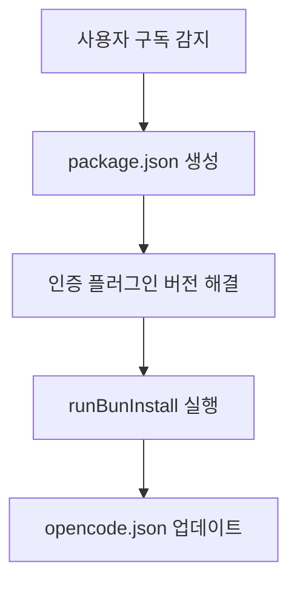

# 의존성 관리 (Dependency Management)

> **관련 소스 파일**
> * [bun.lock](https://github.com/code-yeongyu/oh-my-opencode/blob/b92cd6ab/bun.lock)
> * [package.json](https://github.com/code-yeongyu/oh-my-opencode/blob/b92cd6ab/package.json)
> * [src/cli/config-manager.ts](https://github.com/code-yeongyu/oh-my-opencode/blob/b92cd6ab/src/cli/config-manager.ts)
> * [src/shared/jsonc-parser.test.ts](https://github.com/code-yeongyu/oh-my-opencode/blob/b92cd6ab/src/shared/jsonc-parser.test.ts)
> * [src/shared/jsonc-parser.ts](https://github.com/code-yeongyu/oh-my-opencode/blob/b92cd6ab/src/shared/jsonc-parser.ts)

이 문서는 oh-my-opencode의 의존성 구조, 패키지 관리 전략 및 동적 플러그인 설치 워크플로우를 다룹니다. 특히 패키지 매니저로서의 Bun 사용, 의존성 분류, 그리고 외부 인증 플러그인의 자동 설치 프로세스에 중점을 둡니다.

이러한 의존성을 사용하는 빌드 프로세스에 대한 정보는 [Build System](/code-yeongyu/oh-my-opencode/12.1-build-system)을 참조하십시오. 의존성을 검증하는 CI/CD 자동화에 대해서는 [CI/CD Pipeline](/code-yeongyu/oh-my-opencode/12.2-cicd-pipeline)을 참조하십시오.

## 패키지 매니저: Bun

oh-my-opencode는 npm이나 yarn 대신 [Bun](https://bun.sh)을 패키지 매니저 및 런타임(runtime)으로 사용합니다. 이 선택은 다음과 같은 몇 가지 장점을 제공합니다:

* **빠른 설치**: Bun의 네이티브 구현은 더 빠른 의존성 해결 및 설치를 제공합니다.
* **내장된 TypeScript 지원**: TypeScript를 직접 실행하기 위해 `ts-node`나 `tsx`가 필요하지 않습니다.
* **호환 가능한 락파일(lockfile)**: [bun.lock L1-L132](https://github.com/code-yeongyu/oh-my-opencode/blob/b92cd6ab/bun.lock#L1-L132)은 정확한 버전과 무결성 해시를 추적하는 JSON 형식을 사용합니다.

이 프로젝트는 빌드 스크립트 [package.json L26-L31](https://github.com/code-yeongyu/oh-my-opencode/blob/b92cd6ab/package.json#L26-L31) 및 설치 워크플로우 [src/cli/config-manager.ts L294-L306](https://github.com/code-yeongyu/oh-my-opencode/blob/b92cd6ab/src/cli/config-manager.ts#L294-L306)에서 명시적으로 Bun 명령어를 사용합니다.

**출처:** [package.json L1-L78](https://github.com/code-yeongyu/oh-my-opencode/blob/b92cd6ab/package.json#L1-L78), [bun.lock L1-L132](https://github.com/code-yeongyu/oh-my-opencode/blob/b92cd6ab/bun.lock#L1-L132)

## 의존성 분류

### 의존성 구조 개요

```json
// package.json의 의존성 구조 예시
{
  "dependencies": { ... },
  "devDependencies": { ... },
  "trustedDependencies": [ ... ]
}
```

**출처:** [package.json L52-L77](https://github.com/code-yeongyu/oh-my-opencode/blob/b92cd6ab/package.json#L52-L77)

### 프로덕션 의존성 (Production Dependencies)

이러한 의존성들은 oh-my-opencode가 OpenCode 플러그인 또는 CLI 도구로 실행될 때 런타임에 필요합니다:

| 패키지 | 버전 | 용도 |
| --- | --- | --- |
| `@opencode-ai/plugin` | ^1.0.162 | 플러그인 API 타입 및 유틸리티 |
| `@opencode-ai/sdk` | ^1.0.162 | 세션 관리를 위한 핵심 OpenCode SDK |
| `@ast-grep/cli` | ^0.40.0 | AST 기반 코드 검색을 위한 CLI (25개 언어 지원) |
| `@ast-grep/napi` | ^0.40.0 | AST 조작을 위한 네이티브 바인딩 |
| `@clack/prompts` | ^0.11.0 | 설치를 위한 대화형 CLI 프롬프트 |
| `@code-yeongyu/comment-checker` | ^0.6.1 | 코드 주석 감지를 위한 네이티브 바이너리 |
| `@openauthjs/openauth` | ^0.4.3 | 인증 플러그인을 위한 OAuth 흐름 구현 |
| `commander` | ^14.0.2 | CLI 명령어 파싱 및 라우팅 |
| `hono` | ^4.10.4 | OAuth 콜백을 위한 경량 HTTP 서버 |
| `jsonc-parser` | ^3.3.1 | 주석 및 트레일링 콤마를 지원하는 JSONC 파싱 |
| `picocolors` | ^1.1.1 | 터미널 컬러 출력 |
| `picomatch` | ^4.0.2 | 조건부 규칙을 위한 글로브(Glob) 패턴 매칭 |
| `xdg-basedir` | ^5.1.0 | 크로스 플랫폼 설정 디렉토리 확인 |
| `zod` | ^4.1.8 | 설정을 위한 런타임 타입 검증 |

**출처:** [package.json L52-L66](https://github.com/code-yeongyu/oh-my-opencode/blob/b92cd6ab/package.json#L52-L66)

### 개발 의존성 (Development Dependencies)

이러한 의존성들은 개발 및 빌드 프로세스 중에만 사용됩니다:

| 패키지 | 버전 | 용도 |
| --- | --- | --- |
| `bun-types` | latest | Bun 런타임 API를 위한 타입 정의 |
| `typescript` | ^5.7.3 | 타입 체크 및 선언 파일 생성을 위한 TypeScript 컴파일러 |
| `@types/picomatch` | ^3.0.2 | picomatch를 위한 타입 정의 |

빌드 프로세스 [package.json L26](https://github.com/code-yeongyu/oh-my-opencode/blob/b92cd6ab/package.json#L26-L26)는 타입 체크(`tsc --noEmit`) 및 선언 파일 생성(`tsc --emitDeclarationOnly`)을 위해 TypeScript를 사용하며, 실제 JavaScript 번들링은 Bun이 처리합니다.

**출처:** [package.json L68-L72](https://github.com/code-yeongyu/oh-my-opencode/blob/b92cd6ab/package.json#L68-L72)

### 신뢰할 수 있는 의존성 (Trusted Dependencies)

oh-my-opencode는 특정 의존성을 신뢰할 수 있는 것으로 명시적으로 표시하여 [package.json L73-L77](https://github.com/code-yeongyu/oh-my-opencode/blob/b92cd6ab/package.json#L73-L77) 설치 후 스크립트(post-install scripts)를 실행할 수 있도록 허용합니다. 이는 설치 중 임의의 코드 실행을 방지하는 Bun의 보안 기능입니다:

```json
"trustedDependencies": [
  "@ast-grep/cli",
  "@ast-grep/napi",
  "@code-yeongyu/comment-checker"
]
```

이 패키지들은 다음과 같은 이유로 신뢰 설정이 필요합니다:

* **플랫폼별 네이티브 바이너리 다운로드**: 설치 중에 플랫폼별 바이너리를 다운로드합니다 (AST-grep 및 comment-checker는 darwin-arm64, linux-x64-gnu, win32-x64-msvc 등을 위한 별도 패키지가 있습니다).
* **설치 후 스크립트 실행**: 네이티브 애드온 설정을 위해 스크립트를 실행합니다.

락파일 [bun.lock L36-L70](https://github.com/code-yeongyu/oh-my-opencode/blob/b92cd6ab/bun.lock#L36-L70)은 각 플랫폼 변체에 대한 선택적 의존성을 보여주며, 올바른 네이티브 바이너리가 설치되도록 보장합니다.

**출처:** [package.json L73-L77](https://github.com/code-yeongyu/oh-my-opencode/blob/b92cd6ab/package.json#L73-L77), [bun.lock L36-L70](https://github.com/code-yeongyu/oh-my-opencode/blob/b92cd6ab/bun.lock#L36-L70)

## 주요 의존성 심층 분석

### OpenCode SDK 통합

`@opencode-ai/sdk` 및 `@opencode-ai/plugin` 패키지는 플러그인 시스템의 기반을 형성합니다:

```json
"@opencode-ai/plugin": "^1.0.162",
"@opencode-ai/sdk": "^1.0.162"
```

버전 제약 조건 `^1.0.162`는 패치 및 마이너 업데이트를 허용하지만 메이저 버전은 고정합니다. [package.json L58-L59](https://github.com/code-yeongyu/oh-my-opencode/blob/b92cd6ab/package.json#L58-L59)에서 볼 수 있듯이 두 패키지는 동일한 버전으로 동기화되어 유지됩니다.

**출처:** [package.json L58-L59](https://github.com/code-yeongyu/oh-my-opencode/blob/b92cd6ab/package.json#L58-L59), [bun.lock L80-L82](https://github.com/code-yeongyu/oh-my-opencode/blob/b92cd6ab/bun.lock#L80-L82)

### AST-Grep 네이티브 바인딩

AST-grep은 코드 조작을 위한 CLI 및 프로그래밍 방식의 접근을 모두 제공합니다:

```json
"@ast-grep/cli": "^0.40.0",
"@ast-grep/napi": "^0.40.0"
```

빌드 명령어 [package.json L26](https://github.com/code-yeongyu/oh-my-opencode/blob/b92cd6ab/package.json#L26-L26)의 `--external @ast-grep/napi` 플래그는 네이티브 바인딩이 번들링되지 않도록 하여, 네이티브 모듈 해결 문제를 방지합니다.

**출처:** [package.json L26](https://github.com/code-yeongyu/oh-my-opencode/blob/b92cd6ab/package.json#L26-L26), [package.json L53-L54](https://github.com/code-yeongyu/oh-my-opencode/blob/b92cd6ab/package.json#L53-L54), [bun.lock L36-L70](https://github.com/code-yeongyu/oh-my-opencode/blob/b92cd6ab/bun.lock#L36-L70)

### 인증 및 OAuth 스택

Gemini (Antigravity) 및 ChatGPT (Codex) 인증 플러그인을 위한 OAuth 구현은 최소한의 HTTP 서버를 사용합니다:

```json
"@openauthjs/openauth": "^0.4.3",
"hono": "^4.10.4"
```

`google-auth.ts` 모듈은 외부 인증 플러그인이 OAuth 서버 구현을 재사용할 수 있도록 별도로 내보내집니다 [package.json L19-L22](https://github.com/code-yeongyu/oh-my-opencode/blob/b92cd6ab/package.json#L19-L22).

**출처:** [package.json L57](https://github.com/code-yeongyu/oh-my-opencode/blob/b92cd6ab/package.json#L57-L57), [package.json L61](https://github.com/code-yeongyu/oh-my-opencode/blob/b92cd6ab/package.json#L61-L61), [package.json L19-L22](https://github.com/code-yeongyu/oh-my-opencode/blob/b92cd6ab/package.json#L19-L22), [bun.lock L78](https://github.com/code-yeongyu/oh-my-opencode/blob/b92cd6ab/bun.lock#L78-L78)

### 설정 파싱

주석이 포함된 사용자 친화적인 설정 파일을 위해 JSONC 지원은 필수적입니다:

```json
"jsonc-parser": "^3.3.1"
```

구현부 [src/shared/jsonc-parser.ts L9-L24](https://github.com/code-yeongyu/oh-my-opencode/blob/b92cd6ab/src/shared/jsonc-parser.ts#L9-L24)는 라이브러리의 API를 래핑하여 설정 파일에 대한 엄격한 에러 핸들링을 제공합니다.

**출처:** [package.json L62](https://github.com/code-yeongyu/oh-my-opencode/blob/b92cd6ab/package.json#L62-L62), [src/shared/jsonc-parser.ts L1-L67](https://github.com/code-yeongyu/oh-my-opencode/blob/b92cd6ab/src/shared/jsonc-parser.ts#L1-L67)

## 버전 관리 전략

### 버전 제약 패턴

oh-my-opencode는 시맨틱 버저닝(Semantic Versioning) 제약 조건을 사용합니다:

| 제약 조건 | 예시 | 허용 범위 | 용도 |
| --- | --- | --- | --- |
| `^` (캐럿) | `^1.0.162` | 마이너 및 패치 | 대부분의 의존성 |
| `latest` | `latest` | 모든 업데이트 | 개발 도구 (bun-types) |

캐럿(`^`) 제약 조건은 모든 프로덕션 의존성에 사용되어, 자동 패치 및 마이너 업데이트를 허용하면서도 메이저 버전 업그레이드로 인한 파괴적 변경(breaking changes)을 방지합니다.

**출처:** [package.json L52-L66](https://github.com/code-yeongyu/oh-my-opencode/blob/b92cd6ab/package.json#L52-L66)

### 동적 버전 해결

CLI 설치 프로세스는 인증 플러그인의 최신 버전을 동적으로 가져옵니다:

```typescript
async function getLatestVersion(packageName: string): Promise<string>
```

이 함수 [src/cli/config-manager.ts L17-L26](https://github.com/code-yeongyu/oh-my-opencode/blob/b92cd6ab/src/cli/config-manager.ts#L17-L26)는 NPM 레지스트리를 쿼리하여 최신 배포 버전을 가져옴으로써, 사용자가 설정 중에 항상 최신 인증 플러그인 버전을 설치하도록 보장합니다.

**출처:** [src/cli/config-manager.ts L17-L26](https://github.com/code-yeongyu/oh-my-opencode/blob/b92cd6ab/src/cli/config-manager.ts#L17-L26)

### 락파일 및 무결성

`bun.lock` 파일 [bun.lock L1-L132](https://github.com/code-yeongyu/oh-my-opencode/blob/b92cd6ab/bun.lock#L1-L132)은 다음을 유지합니다:

* **정확한 버전**: 모든 의존성 및 전이적 의존성(transitive dependency) 고정
* **무결성 해시**: 패키지 검증을 위한 SHA-512 체크섬
* **플랫폼 제약**: OS 및 CPU 아키텍처 요구 사항
* **선택적 의존성**: 플랫폼별 네이티브 바이너리

락파일 엔트리 구조 예시:

```json
"@ast-grep/napi-darwin-arm64@0.40.0": {
  "resolution": "https://registry.npmjs.org/@ast-grep/napi-darwin-arm64/-/napi-darwin-arm64-0.40.0.tgz",
  "integrity": "sha512-..."
}
```

**출처:** [bun.lock L36](https://github.com/code-yeongyu/oh-my-opencode/blob/b92cd6ab/bun.lock#L36-L36)

## 동적 플러그인 설치

### 인증 플러그인 설치 흐름

`oh-my-opencode install` 명령어는 감지된 구독 정보를 기반으로 인증 플러그인을 동적으로 설치합니다:

```typescript
async function addAuthPlugins(config: any, subscriptions: string[])
```

**출처:** [src/cli/config-manager.ts L243-L271](https://github.com/code-yeongyu/oh-my-opencode/blob/b92cd6ab/src/cli/config-manager.ts#L243-L271), [src/cli/config-manager.ts L294-L306](https://github.com/code-yeongyu/oh-my-opencode/blob/b92cd6ab/src/cli/config-manager.ts#L294-L306)

### 인증 플러그인 버전 관리

`addAuthPlugins` 함수 [src/cli/config-manager.ts L243-L271](https://github.com/code-yeongyu/oh-my-opencode/blob/b92cd6ab/src/cli/config-manager.ts#L243-L271)는 두 가지 다른 전략을 구현합니다:

#### Antigravity (Gemini) - 최신 버전

```typescript
const version = await getLatestVersion('@opencode-ai/antigravity');
pkgJson.dependencies['@opencode-ai/antigravity'] = `^${version}`;
```

이는 NPM에서 최신 버전을 가져와 명시적으로 고정합니다.

#### Codex (ChatGPT) - GitHub 핫픽스

```typescript
pkgJson.dependencies['@opencode-ai/codex'] = CHATGPT_HOTFIX_URL;
```

ChatGPT 플러그인은 [src/cli/config-manager.ts L15](https://github.com/code-yeongyu/oh-my-opencode/blob/b92cd6ab/src/cli/config-manager.ts#L15-L15)에 정의된 특수 GitHub 참조를 사용합니다:

```typescript
const CHATGPT_HOTFIX_URL = "github:code-yeongyu/opencode-auth-chatgpt#main";
```

이 핫픽스는 `setupChatGPTHotfix()` [src/cli/config-manager.ts L273-L292](https://github.com/code-yeongyu/oh-my-opencode/blob/b92cd6ab/src/cli/config-manager.ts#L273-L292)를 통해 적용되며, OpenCode 설정 디렉토리 [src/cli/config-manager.ts L10](https://github.com/code-yeongyu/oh-my-opencode/blob/b92cd6ab/src/cli/config-manager.ts#L10-L10)에 직접적인 GitHub 의존성을 가진 `package.json`을 생성합니다.

**출처:** [src/cli/config-manager.ts L243-L292](https://github.com/code-yeongyu/oh-my-opencode/blob/b92cd6ab/src/cli/config-manager.ts#L243-L292)

### 프로바이더 설정 주입

플러그인 설치 후, 시스템은 `opencode.json`에 프로바이더 설정을 주입합니다:

```typescript
config.providers.push({
  id: "antigravity",
  module: "@opencode-ai/antigravity",
  // ... 모델 사양
});
```

Antigravity 설정 [src/cli/config-manager.ts L308-L349](https://github.com/code-yeongyu/oh-my-opencode/blob/b92cd6ab/src/cli/config-manager.ts#L308-L349)은 다음을 포함한 완전한 모델 사양을 정의합니다:

* Thinking 지원 플래그
* 첨부 파일 기능
* 컨텍스트 및 출력 토큰 제한
* 입력/출력 모달리티 (텍스트, 이미지, PDF)

Codex 설정 [src/cli/config-manager.ts L351-L362](https://github.com/code-yeongyu/oh-my-opencode/blob/b92cd6ab/src/cli/config-manager.ts#L351-L362)는 추론 모델(o3, o4-mini)을 위한 thinking 플래그와 함께 OpenAI 모델을 지정합니다.

**출처:** [src/cli/config-manager.ts L308-L391](https://github.com/code-yeongyu/oh-my-opencode/blob/b92cd6ab/src/cli/config-manager.ts#L308-L391)

## 설치 워크플로우

### 전체 의존성 설치 프로세스



`runBunInstall()` 함수 [src/cli/config-manager.ts L294-L306](https://github.com/code-yeongyu/oh-my-opencode/blob/b92cd6ab/src/cli/config-manager.ts#L294-L306)은 OpenCode 설정 디렉토리에서 Bun 하위 프로세스를 생성합니다:

```typescript
const proc = Bun.spawn(["bun", "install"], {
  cwd: OPENCODE_CONFIG_DIR,
  // ...
});
```

이는 메인 oh-my-opencode 설치와는 별개로 OpenCode 설정 디렉토리에 로컬로 인증 플러그인을 설치합니다.

**출처:** [src/cli/config-manager.ts L294-L306](https://github.com/code-yeongyu/oh-my-opencode/blob/b92cd6ab/src/cli/config-manager.ts#L294-L306), [src/cli/config-manager.ts L7-L11](https://github.com/code-yeongyu/oh-my-opencode/blob/b92cd6ab/src/cli/config-manager.ts#L7-L11)

## 의존성 업데이트 전략

### CI에서의 자동 업데이트

CI 워크플로우(섹션 12.2 참조)는 모든 커밋에 대해 테스트와 타입 체크를 실행하여 현재 의존성 버전과의 호환성을 보장합니다. 스키마 생성 단계 [package.json L27](https://github.com/code-yeongyu/oh-my-opencode/blob/b92cd6ab/package.json#L27-L27) 또한 CI 중에 실행되어 설정 타입 정의가 일관되게 유지되는지 검증합니다.

### 수동 버전 업데이트

의존성을 업데이트하려면:

1. 필요한 경우 **package.json 제약 조건을 업데이트**합니다.
2. **`bun update`를 실행**하여 새 버전을 해결합니다.
3. `bun.lock`에서 **락파일 변경 사항을 확인**합니다.
4. `bun test` [package.json L31](https://github.com/code-yeongyu/oh-my-opencode/blob/b92cd6ab/package.json#L31-L31)로 **테스트 수트를 실행**합니다.
5. `bun run typecheck` [package.json L30](https://github.com/code-yeongyu/oh-my-opencode/blob/b92cd6ab/package.json#L30-L30)으로 **타입 체크를 실행**합니다.

이 프로젝트는 개발 중에 SDK가 빠르게 진화하므로 호환성을 보장하기 위해 OpenCode SDK 버전을 정밀하게 고정(`^1.0.162`)합니다.

**출처:** [package.json L25-L31](https://github.com/code-yeongyu/oh-my-opencode/blob/b92cd6ab/package.json#L25-L31), [package.json L58-L59](https://github.com/code-yeongyu/oh-my-opencode/blob/b92cd6ab/package.json#L58-L59)