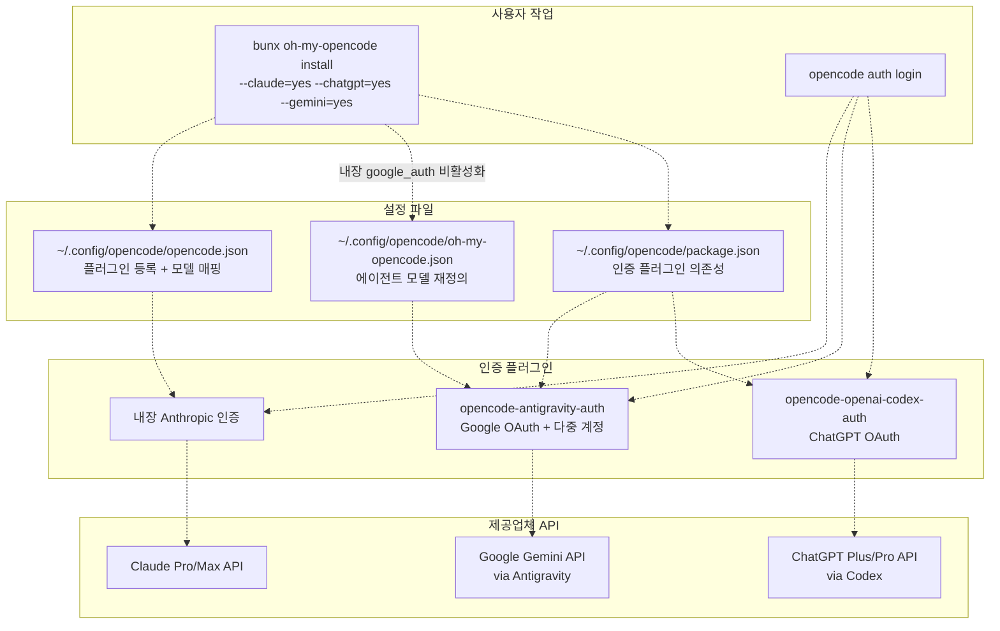
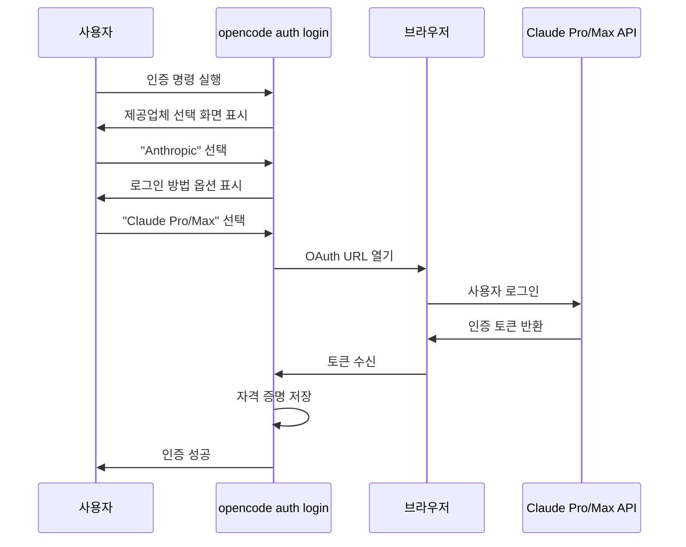
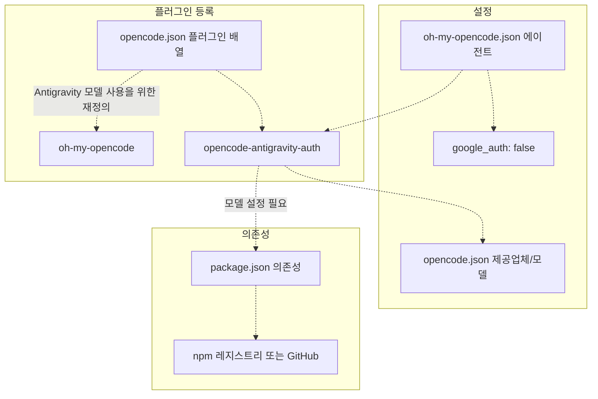
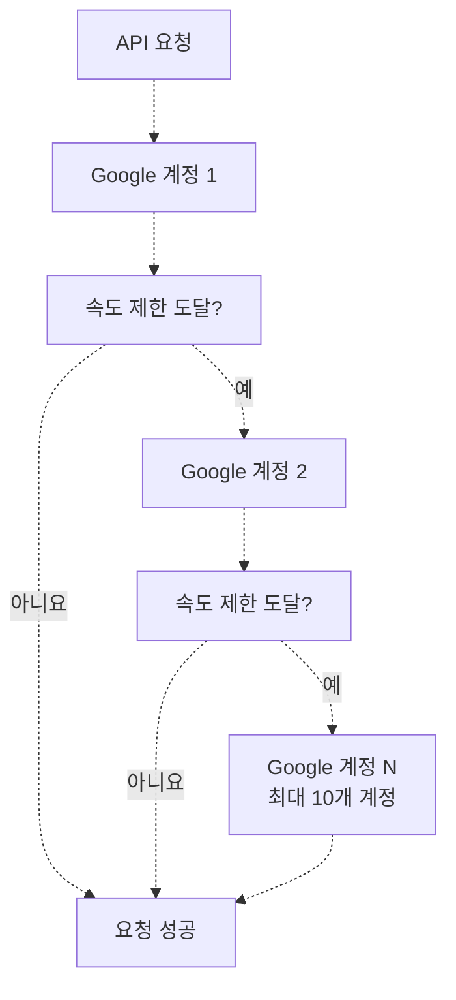
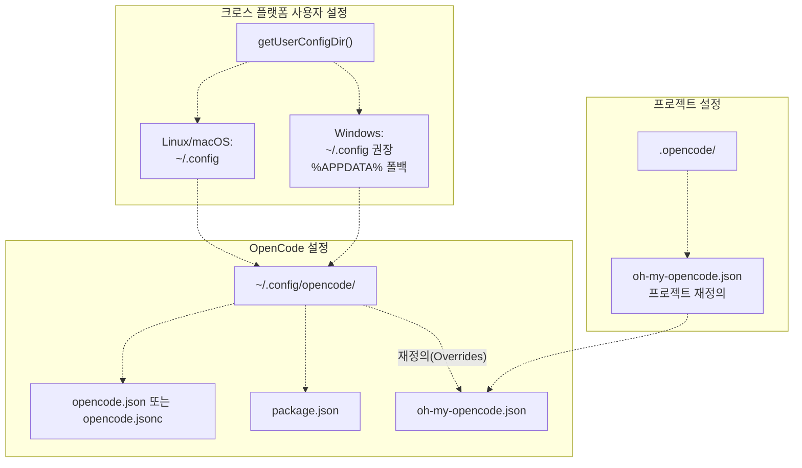

# 인증 설정 (Authentication Setup)

> **관련 소스 파일**
> * [README.ja.md](https://github.com/code-yeongyu/oh-my-opencode/blob/b92cd6ab/README.ja.md)
> * [README.ko.md](https://github.com/code-yeongyu/oh-my-opencode/blob/b92cd6ab/README.ko.md)
> * [README.md](https://github.com/code-yeongyu/oh-my-opencode/blob/b92cd6ab/README.md)
> * [README.zh-cn.md](https://github.com/code-yeongyu/oh-my-opencode/blob/b92cd6ab/README.zh-cn.md)
> * [bun.lock](https://github.com/code-yeongyu/oh-my-opencode/blob/b92cd6ab/bun.lock)
> * [package.json](https://github.com/code-yeongyu/oh-my-opencode/blob/b92cd6ab/package.json)
> * [src/cli/config-manager.ts](https://github.com/code-yeongyu/oh-my-opencode/blob/b92cd6ab/src/cli/config-manager.ts)
> * [src/shared/config-path.ts](https://github.com/code-yeongyu/oh-my-opencode/blob/b92cd6ab/src/shared/config-path.ts)
> * [src/shared/jsonc-parser.test.ts](https://github.com/code-yeongyu/oh-my-opencode/blob/b92cd6ab/src/shared/jsonc-parser.test.ts)
> * [src/shared/jsonc-parser.ts](https://github.com/code-yeongyu/oh-my-opencode/blob/b92cd6ab/src/shared/jsonc-parser.ts)

이 페이지는 oh-my-opencode에서 사용하는 AI 제공업체(Provider)의 인증 설정에 대해 다룹니다. 인증을 통해 oh-my-opencode 에이전트는 사용자의 기존 구독 정보를 사용하여 Anthropic (Claude), Google (Gemini), OpenAI (ChatGPT)의 모델을 사용할 수 있습니다.

전체 설치 프로세스는 [Installation](../getting-started/Installation.md)을 참조하십시오. 설정 파일 구조 및 옵션에 대해서는 [Configuration Files](../getting-started/Configuration-Files.md)를 참조하십시오.

## 목적 및 범위

인증 설정은 oh-my-opencode와 AI 모델 제공업체 간의 연결을 구축합니다. 여기에는 다음 과정이 포함됩니다:

* 제공업체별 인증 플러그인 설치 (Gemini 및 ChatGPT용)
* `opencode auth login` 명령을 통한 OAuth 흐름 실행
* `opencode.json`에서 모델 매핑 구성
* `oh-my-opencode.json`에서 에이전트 모델 재정의(Override) 설정

## 인증 아키텍처 (Authentication Architecture)



**인증 흐름 개요**

이 다이어그램은 인증 설정 중에 사용자 작업, 설정 파일, 인증 플러그인 및 제공업체 API가 어떻게 상호 작용하는지 보여줍니다.

출처: [README.md L283-L383](https://github.com/code-yeongyu/oh-my-opencode/blob/b92cd6ab/README.md#L283-L383)

 [src/cli/config-manager.ts L1-L248](https://github.com/code-yeongyu/oh-my-opencode/blob/b92cd6ab/src/cli/config-manager.ts#L1-L248)

## 제공업체 설정 요약

| 제공업체 | 인증 방법 | 플러그인 필요 여부 | 다중 계정 지원 | 설정 파일 |
| --- | --- | --- | --- | --- |
| **Anthropic (Claude)** | 내장 OAuth | 아니요 | 아니요 | `opencode.json` |
| **Google (Gemini)** | Antigravity OAuth | `opencode-antigravity-auth@1.1.2` | 예 (최대 10개) | `opencode.json`, `package.json`, `oh-my-opencode.json` |
| **OpenAI (ChatGPT)** | Codex OAuth | `opencode-openai-codex-auth@4.1.1` | 아니요 | `opencode.json`, `package.json` |

출처: [README.md L84-L88](https://github.com/code-yeongyu/oh-my-opencode/blob/b92cd6ab/README.md#L84-L88)

 [README.md L286-L383](https://github.com/code-yeongyu/oh-my-opencode/blob/b92cd6ab/README.md#L286-L383)

## Anthropic (Claude) 인증

### 인증 프로세스

Claude 인증은 OpenCode의 내장 Anthropic 제공업체를 사용합니다. 별도의 외부 플러그인이 필요하지 않습니다.



**Claude 인증 흐름**

출처: [README.md L286-L295](https://github.com/code-yeongyu/oh-my-opencode/blob/b92cd6ab/README.md#L286-L295)

### CLI 명령

```sql
opencode auth login
# 대화형 터미널: Provider → "Anthropic" 선택
# 대화형 터미널: Login method → "Claude Pro/Max" 선택
# 브라우저에서 OAuth 흐름 완료
# 완료 확인 대기
```

### 설정 영향

인증에 성공하면 `opencode.json`에서 Claude 모델을 사용할 수 있게 됩니다:

```json
{
  "providers": {
    "anthropic": {
      "models": {
        "claude-opus-4-5": {},
        "claude-sonnet-4-5": {},
        "claude-haiku-4-5": {}
      }
    }
  }
}
```

### 구독 티어별 모델 선택

설치 프로그램은 Claude 구독 정보에 따라 에이전트 모델을 구성합니다:

| 구독 상태 | Sisyphus 모델 | Explore 모델 | Oracle 폴백(Fallback) |
| --- | --- | --- | --- |
| **Claude Pro (non-max20)** | `anthropic/claude-opus-4-5` | `opencode/big-pickle` | `anthropic/claude-opus-4-5` |
| **Claude Max (max20)** | `anthropic/claude-opus-4-5` | `anthropic/claude-haiku-4-5` | `anthropic/claude-opus-4-5` |
| **구독 없음** | `opencode/big-pickle` | `opencode/big-pickle` | `opencode/big-pickle` |

출처: [src/cli/config-manager.ts L138-L186](https://github.com/code-yeongyu/oh-my-opencode/blob/b92cd6ab/src/cli/config-manager.ts#L138-L186)

 [README.md L224-L231](https://github.com/code-yeongyu/oh-my-opencode/blob/b92cd6ab/README.md#L224-L231)

## Google Gemini 인증 (Antigravity)

### 플러그인 설치

Gemini 인증에는 OAuth 인증 및 다중 계정 부하 분산(Load balancing)을 제공하는 외부 `opencode-antigravity-auth` 플러그인이 필요합니다.



**Gemini 플러그인 설정 구조**

출처: [README.md L298-L330](https://github.com/code-yeongyu/oh-my-opencode/blob/b92cd6ab/README.md#L298-L330)

### 1단계: opencode.json에 플러그인 추가

`~/.config/opencode/opencode.json` 파일을 수정합니다:

```json
{
  "plugin": [
    "oh-my-opencode",
    "opencode-antigravity-auth@1.1.2"
  ]
}
```

출처: [README.md L300-L308](https://github.com/code-yeongyu/oh-my-opencode/blob/b92cd6ab/README.md#L300-L308)

### 2단계: 제공업체 및 모델 구성

`opencode.json`에 전체 제공업체 설정을 추가합니다. 전체 제공업체/모델 구조는 [opencode-antigravity-auth README](https://github.com/code-yeongyu/oh-my-opencode/blob/b92cd6ab/opencode-antigravity-auth README)를 참조하십시오.

사용 가능한 모델 이름:

* `google/gemini-3-pro-high`
* `google/gemini-3-pro-medium`
* `google/gemini-3-pro-low`
* `google/gemini-3-flash`
* `google/gemini-3-flash-lite`
* `google/claude-sonnet-4-5`
* `google/claude-sonnet-4-5-thinking`
* `google/claude-opus-4-5-thinking`
* `google/gpt-oss-120b-medium`

출처: [README.md L310-L330](https://github.com/code-yeongyu/oh-my-opencode/blob/b92cd6ab/README.md#L310-L330)

### 3단계: 에이전트 모델 재정의

`~/.config/opencode/oh-my-opencode.json` 또는 `.opencode/oh-my-opencode.json` 파일을 수정합니다:

```json
{
  "google_auth": false,
  "agents": {
    "frontend-ui-ux-engineer": { "model": "google/gemini-3-pro-high" },
    "document-writer": { "model": "google/gemini-3-flash" },
    "multimodal-looker": { "model": "google/gemini-3-flash" }
  }
}
```

**중요 설정:** `google_auth: false`로 설정하면 oh-my-opencode의 내장 Google 인증이 비활성화되어 Antigravity 플러그인과의 충돌을 방지합니다.

출처: [README.md L315-L328](https://github.com/code-yeongyu/oh-my-opencode/blob/b92cd6ab/README.md#L315-L328)

 [src/cli/config-manager.ts L143-L178](https://github.com/code-yeongyu/oh-my-opencode/blob/b92cd6ab/src/cli/config-manager.ts#L143-L178)

### 4단계: 인증 실행

```sql
opencode auth login
# 대화형 터미널: Provider → "Google" 선택
# 대화형 터미널: Login method → "OAuth with Google (Antigravity)" 선택
# 브라우저가 자동으로 감지되어 로그인 페이지가 열림
# Google OAuth 흐름 완료
# 선택 사항: 부하 분산을 위해 추가 계정 추가
```

### 다중 계정 부하 분산 (Multi-Account Load Balancing)

Antigravity 플러그인은 최대 10개의 Google 계정을 지원합니다. 한 계정이 속도 제한(Rate limit)에 도달하면 자동으로 다음 사용 가능한 계정으로 전환됩니다.



**다중 계정 부하 분산 흐름**

출처: [README.md L342-L344](https://github.com/code-yeongyu/oh-my-opencode/blob/b92cd6ab/README.md#L342-L344)

### 설치 프로그램에 의한 모델 할당

`--gemini=yes`가 지정되면 설치 프로그램이 자동으로 Gemini 모델을 구성합니다:

```javascript
// src/cli/config-manager.ts:153-178
if (installConfig.hasGemini) {
  agents["librarian"] = { model: "google/gemini-3-flash" }
  agents["explore"] = { model: "google/gemini-3-flash" }
  agents["frontend-ui-ux-engineer"] = { model: "google/gemini-3-pro-high" }
  agents["document-writer"] = { model: "google/gemini-3-flash" }
  agents["multimodal-looker"] = { model: "google/gemini-3-flash" }
}
```

출처: [src/cli/config-manager.ts L153-L178](https://github.com/code-yeongyu/oh-my-opencode/blob/b92cd6ab/src/cli/config-manager.ts#L153-L178)

## OpenAI (ChatGPT) 인증 (Codex)

### 핫픽스를 포함한 플러그인 설치

ChatGPT 인증에는 외부 `opencode-openai-codex-auth` 플러그인이 필요합니다. **현재 공식 npm 패키지에는 400 에러를 유발하는 버그가 있습니다.** 수정 버전이 출시될 때까지 hotfix 브랜치를 사용하십시오.

### 1단계: opencode.json에 플러그인 추가

`~/.config/opencode/opencode.json` 파일을 수정합니다:

```json
{
  "plugin": [
    "oh-my-opencode",
    "opencode-openai-codex-auth@4.1.1"
  ]
}
```

출처: [README.md L347-L356](https://github.com/code-yeongyu/oh-my-opencode/blob/b92cd6ab/README.md#L347-L356)

### 2단계: 핫픽스 적용 (필수)

`~/.config/opencode/package.json`을 수정하여 hotfix 브랜치를 사용하도록 설정합니다:

```css
{
  "dependencies": {
    "opencode-openai-codex-auth": "code-yeongyu/opencode-openai-codex-auth#fix/orphaned-function-call-output-with-tools"
  }
}
```

그 다음 의존성을 설치합니다:

```bash
cd ~/.config/opencode && bun i
```

**중요:** `opencode.json`에서는 버전 접미사 없이 `"opencode-openai-codex-auth"`를 사용하십시오.

출처: [README.md L358-L368](https://github.com/code-yeongyu/oh-my-opencode/blob/b92cd6ab/README.md#L358-L368)

 [src/cli/config-manager.ts L15](https://github.com/code-yeongyu/oh-my-opencode/blob/b92cd6ab/src/cli/config-manager.ts#L15-L15)

### 3단계: 제공업체 및 모델 구성

`opencode.json`에 전체 제공업체 설정을 추가합니다. 전체 구조는 플러그인 저장소의 [`config/full-opencode.json`](https://github.com/code-yeongyu/oh-my-opencode/blob/b92cd6ab/`config/full-opencode.json`)을 참조하십시오.

출처: [README.md L370-L372](https://github.com/code-yeongyu/oh-my-opencode/blob/b92cd6ab/README.md#L370-L372)

### 4단계: 인증 실행

```sql
opencode auth login
# 대화형 터미널: Provider → "OpenAI" 선택
# 대화형 터미널: Login method → "ChatGPT Plus/Pro (Codex Subscription)" 선택
# 브라우저에서 OAuth 흐름 완료
# 완료 확인 대기
```

출처: [README.md L376-L383](https://github.com/code-yeongyu/oh-my-opencode/blob/b92cd6ab/README.md#L376-L383)

### 설치 프로그램에 의한 모델 할당

`--chatgpt=yes`가 지정되면 설치 프로그램은 기본 Oracle 에이전트 모델을 `openai/gpt-5.2`로 유지합니다:

```yaml
// src/cli/config-manager.ts:163-167
if (!installConfig.hasChatGPT) {
  agents["oracle"] = {
    model: installConfig.hasClaude ? "anthropic/claude-opus-4-5" : "opencode/big-pickle",
  }
}
```

ChatGPT를 사용할 수 있는 경우, Oracle은 기본적으로 GPT-5.2를 사용합니다 (재정의되지 않음).

출처: [src/cli/config-manager.ts L163-L167](https://github.com/code-yeongyu/oh-my-opencode/blob/b92cd6ab/src/cli/config-manager.ts#L163-L167)

## 설정 파일 위치



**설정 파일 계층 구조**

출처: [src/shared/config-path.ts L1-L48](https://github.com/code-yeongyu/oh-my-opencode/blob/b92cd6ab/src/shared/config-path.ts#L1-L48)

 [src/cli/config-manager.ts L7-L11](https://github.com/code-yeongyu/oh-my-opencode/blob/b92cd6ab/src/cli/config-manager.ts#L7-L11)

### 사용자 레벨 설정

| 파일 | 용도 | 형식 |
| --- | --- | --- |
| `opencode.json` 또는 `opencode.jsonc` | 플러그인 등록, 제공업체 설정 | JSON/JSONC |
| `package.json` | 인증 플러그인 의존성 관리 | JSON |
| `oh-my-opencode.json` | 에이전트 모델 재정의, 기능 토글 | JSON/JSONC |

**파일 경로:**

* **Linux/macOS:** `~/.config/opencode/`
* **Windows:** `~/.config/opencode/` (권장) 또는 `%APPDATA%\opencode\` (폴백)

### 프로젝트 레벨 설정

| 파일 | 용도 | 형식 |
| --- | --- | --- |
| `.opencode/oh-my-opencode.json` | 프로젝트별 에이전트 재정의 | JSON/JSONC |

두 설정이 모두 존재하는 경우 프로젝트 설정이 사용자 설정보다 우선합니다.

출처: [src/shared/config-path.ts L13-L47](https://github.com/code-yeongyu/oh-my-opencode/blob/b92cd6ab/src/shared/config-path.ts#L13-L47)

### 설정 감지 로직

시스템은 다음 우선순위에 따라 설정 파일을 감지합니다:

```javascript
// src/shared/config-path.ts:13-33
export function getUserConfigDir(): string {
  if (process.platform === "win32") {
    const crossPlatformDir = path.join(os.homedir(), ".config")
    const crossPlatformConfigPath = path.join(crossPlatformDir, "opencode", "oh-my-opencode.json")
    
    const appdataDir = process.env.APPDATA || path.join(os.homedir(), "AppData", "Roaming")
    const appdataConfigPath = path.join(appdataDir, "opencode", "oh-my-opencode.json")
    
    // 크로스 플랫폼 경로를 선호하며, 하위 호환성을 위해 APPDATA로 폴백합니다.
    if (fs.existsSync(crossPlatformConfigPath)) return crossPlatformDir
    if (fs.existsSync(appdataConfigPath)) return appdataDir
    return crossPlatformDir
  }
  
  return process.env.XDG_CONFIG_HOME || path.join(os.homedir(), ".config")
}
```

`opencode.json`의 경우, 시스템은 `.json`보다 `.jsonc`를 선호합니다:

```javascript
// src/cli/config-manager.ts:35-43
export function detectConfigFormat(): { format: ConfigFormat; path: string } {
  if (existsSync(OPENCODE_JSONC)) {
    return { format: "jsonc", path: OPENCODE_JSONC }
  }
  if (existsSync(OPENCODE_JSON)) {
    return { format: "json", path: OPENCODE_JSON }
  }
  return { format: "none", path: OPENCODE_JSON }
}
```

출처: [src/shared/config-path.ts L13-L33](https://github.com/code-yeongyu/oh-my-opencode/blob/b92cd6ab/src/shared/config-path.ts#L13-L33)

 [src/cli/config-manager.ts L28-L43](https://github.com/code-yeongyu/oh-my-opencode/blob/b92cd6ab/src/cli/config-manager.ts#L28-L43)

## CLI 설치 프로그램을 통한 자동 설정

`bunx oh-my-opencode install` 명령은 구독 플래그를 기반으로 인증 설정을 자동화합니다.

### CLI 플래그

```bash
bunx oh-my-opencode install --no-tui --claude=<yes|no|max20> --chatgpt=<yes|no> --gemini=<yes|no>
```

| 플래그 | 값 | 효과 |
| --- | --- | --- |
| `--claude` | `yes`, `no`, `max20` | Claude 모델 구성; `max20`은 explore 에이전트에 Haiku 활성화 |
| `--chatgpt` | `yes`, `no` | yes인 경우 Oracle을 GPT-5.2로 유지 |
| `--gemini` | `yes`, `no` | Gemini 모델 추가 및 `google_auth: false` 설정 |

### 설정 생성

설치 프로그램은 구독 플래그를 기반으로 `oh-my-opencode.json`을 생성합니다:

```javascript
// src/cli/config-manager.ts:138-185
export function generateOmoConfig(installConfig: InstallConfig): Record<string, unknown> {
  const config: Record<string, unknown> = {
    $schema: "https://raw.githubusercontent.com/code-yeongyu/oh-my-opencode/master/assets/oh-my-opencode.schema.json",
  }

  if (installConfig.hasGemini) {
    config.google_auth = false
  }

  const agents: Record<string, Record<string, unknown>> = {}

  // Sisyphus 모델 선택
  if (!installConfig.hasClaude) {
    agents["Sisyphus"] = { model: "opencode/big-pickle" }
  }

  // Librarian 및 Explore 모델
  if (installConfig.hasGemini) {
    agents["librarian"] = { model: "google/gemini-3-flash" }
    agents["explore"] = { model: "google/gemini-3-flash" }
  } else if (installConfig.hasClaude && installConfig.isMax20) {
    agents["explore"] = { model: "anthropic/claude-haiku-4-5" }
  } else {
    agents["librarian"] = { model: "opencode/big-pickle" }
    agents["explore"] = { model: "opencode/big-pickle" }
  }

  // Oracle 모델 (ChatGPT 사용 가능 시 기본값 gpt-5.2)
  if (!installConfig.hasChatGPT) {
    agents["oracle"] = {
      model: installConfig.hasClaude ? "anthropic/claude-opus-4-5" : "opencode/big-pickle",
    }
  }

  // 프론트엔드 및 유틸리티 에이전트
  if (installConfig.hasGemini) {
    agents["frontend-ui-ux-engineer"] = { model: "google/gemini-3-pro-high" }
    agents["document-writer"] = { model: "google/gemini-3-flash" }
    agents["multimodal-looker"] = { model: "google/gemini-3-flash" }
  } else {
    const fallbackModel = installConfig.hasClaude ? "anthropic/claude-opus-4-5" : "opencode/big-pickle"
    agents["frontend-ui-ux-engineer"] = { model: fallbackModel }
    agents["document-writer"] = { model: fallbackModel }
    agents["multimodal-looker"] = { model: fallbackModel }
  }

  if (Object.keys(agents).length > 0) {
    config.agents = agents
  }

  return config
}
```

출처: [src/cli/config-manager.ts L138-L185](https://github.com/code-yeongyu/oh-my-opencode/blob/b92cd6ab/src/cli/config-manager.ts#L138-L185)

## 인증 확인

인증 설정을 완료한 후 설정을 확인하십시오:

### OpenCode 버전 확인

```bash
opencode --version  # 1.0.150 이상이어야 함
```

### 플러그인 등록 확인

```bash
cat ~/.config/opencode/opencode.json
# 플러그인 배열에 "oh-my-opencode"가 포함되어 있어야 함
```

### 에이전트 모델 확인

```bash
cat ~/.config/opencode/oh-my-opencode.json
# 에이전트 모델 할당이 사용자의 구독 정보와 일치하는지 확인
```

출처: [README.md L276-L279](https://github.com/code-yeongyu/oh-my-opencode/blob/b92cd6ab/README.md#L276-L279)

## 일반적인 인증 문제

### 문제: "No tool call found for function call output with call_id" (ChatGPT)

**원인:** `opencode-openai-codex-auth@4.1.1` 공식 npm 패키지의 버그

**해결 방법:** [OpenAI (ChatGPT) 인증](https://github.com/code-yeongyu/oh-my-opencode/blob/b92cd6ab/OpenAI (ChatGPT) Authentication) 섹션에 설명된 대로 hotfix 브랜치를 사용하십시오.

출처: [README.md L358-L368](https://github.com/code-yeongyu/oh-my-opencode/blob/b92cd6ab/README.md#L358-L368)

### 문제: Google 인증 충돌

**원인:** 내장 `google_auth`와 Antigravity 플러그인이 동시에 활성화됨

**해결 방법:** `oh-my-opencode.json`에서 `google_auth: false`로 설정하십시오.

```json
{
  "google_auth": false
}
```

출처: [README.md L317-L328](https://github.com/code-yeongyu/oh-my-opencode/blob/b92cd6ab/README.md#L317-L328)

### 문제: Antigravity 사용 시 잘못된 모델 이름

**원인:** Antigravity 플러그인은 내장 이름과 다른 모델 명명 규칙을 사용함 (예: `google/gemini-3-pro-high`)

**해결 방법:** [3단계](https://github.com/code-yeongyu/oh-my-opencode/blob/b92cd6ab/Step 3#LNaN-LNaN)에 문서화된 대로 에이전트 재정의 시 Antigravity 모델 이름을 사용하십시오.

출처: [README.md L315-L330](https://github.com/code-yeongyu/oh-my-opencode/blob/b92cd6ab/README.md#L315-L330)

### 문제: 인증 흐름이 시작되지 않음

**원인:** tmux 또는 대화형 터미널을 사용할 수 없음

**해결 방법:** `opencode auth login`이 대화형 터미널에서 실행되는지 확인하십시오 (설치를 수행하는 LLM 에이전트의 경우 tmux 사용 권장).

출처: [README.md L244-L258](https://github.com/code-yeongyu/oh-my-opencode/blob/b92cd6ab/README.md#L244-L258)