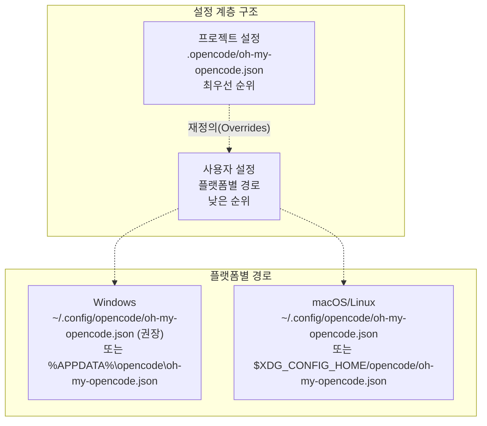

# 설정 파일 (Configuration Files)

> **관련 소스 파일**
> * [README.ja.md](https://github.com/code-yeongyu/oh-my-opencode/blob/b92cd6ab/README.ja.md)
> * [README.ko.md](https://github.com/code-yeongyu/oh-my-opencode/blob/b92cd6ab/README.ko.md)
> * [README.md](https://github.com/code-yeongyu/oh-my-opencode/blob/b92cd6ab/README.md)
> * [README.zh-cn.md](https://github.com/code-yeongyu/oh-my-opencode/blob/b92cd6ab/README.zh-cn.md)
> * [assets/oh-my-opencode.schema.json](https://github.com/code-yeongyu/oh-my-opencode/blob/b92cd6ab/assets/oh-my-opencode.schema.json)
> * [bun.lock](https://github.com/code-yeongyu/oh-my-opencode/blob/b92cd6ab/bun.lock)
> * [package.json](https://github.com/code-yeongyu/oh-my-opencode/blob/b92cd6ab/package.json)
> * [src/cli/config-manager.ts](https://github.com/code-yeongyu/oh-my-opencode/blob/b92cd6ab/src/cli/config-manager.ts)
> * [src/config/schema.ts](https://github.com/code-yeongyu/oh-my-opencode/blob/b92cd6ab/src/config/schema.ts)
> * [src/hooks/index.ts](https://github.com/code-yeongyu/oh-my-opencode/blob/b92cd6ab/src/hooks/index.ts)
> * [src/index.ts](https://github.com/code-yeongyu/oh-my-opencode/blob/b92cd6ab/src/index.ts)
> * [src/shared/config-path.ts](https://github.com/code-yeongyu/oh-my-opencode/blob/b92cd6ab/src/shared/config-path.ts)
> * [src/shared/jsonc-parser.test.ts](https://github.com/code-yeongyu/oh-my-opencode/blob/b92cd6ab/src/shared/jsonc-parser.test.ts)
> * [src/shared/jsonc-parser.ts](https://github.com/code-yeongyu/oh-my-opencode/blob/b92cd6ab/src/shared/jsonc-parser.ts)

설정 파일은 에이전트(agent) 설정, 훅(hook) 토글, MCP 서버, 그리고 Claude Code 호환성을 포함한 oh-my-opencode의 동작을 제어합니다. 이 페이지에서는 설정 파일의 위치, 기본 구조 및 사용 방법에 대해 설명합니다.

상세한 설정 로드 및 병합(merging) 로직은 [설정 시스템 (Configuration System)](/code-yeongyu/oh-my-opencode/3.2-configuration-system)을 참조하십시오. 특정 에이전트 설정 옵션은 [에이전트 설정 (#4.4)](#4.4) 섹션을 확인하시기 바랍니다.

## 파일 위치 (File Locations)

oh-my-opencode는 사용자 수준(user-level)과 프로젝트 수준(project-level)의 2단계 설정 시스템을 사용합니다. 프로젝트 설정은 사용자 설정을 재정의(override)합니다.



**설정 파일 계층 구조**

| 계층 | 경로 | 플랫폼 | 우선순위 |
| --- | --- | --- | --- |
| 프로젝트 | `.opencode/oh-my-opencode.json` | 전체 | 1 (최고) |
| 사용자 | `~/.config/opencode/oh-my-opencode.json` | Windows (권장), macOS, Linux | 2 |
| 사용자 | `%APPDATA%\opencode\oh-my-opencode.json` | Windows (폴백) | 2 |

사용자 설정 경로는 Unix 시스템의 XDG Base Directory Specification을 따릅니다. Windows에서는 크로스 플랫폼 일관성을 위해 `~/.config/opencode/`를 권장하며, 하위 호환성을 위해 `%APPDATA%\opencode\`를 폴백(fallback)으로 지원합니다.

출처: [src/shared/config-path.ts L1-L48](https://github.com/code-yeongyu/oh-my-opencode/blob/b92cd6ab/src/shared/config-path.ts#L1-L48)

 [README.md L707-L715](https://github.com/code-yeongyu/oh-my-opencode/blob/b92cd6ab/README.md#L707-L715)

## 기본 구조 (Basic Structure)

설정 파일은 JSON 형식이며, IDE 자동 완성을 위한 선택적 스키마 참조를 포함할 수 있습니다:

```json
{
  "$schema": "https://raw.githubusercontent.com/code-yeongyu/oh-my-opencode/master/assets/oh-my-opencode.schema.json",
  "agents": {
    "explore": {
      "model": "anthropic/claude-haiku-4-5"
    }
  },
  "disabled_hooks": ["comment-checker"],
  "disabled_mcps": ["websearch_exa"]
}
```

프로젝트 설정은 사용자 설정을 재정의합니다. `agents`와 같은 중첩된 객체의 경우, 프로젝트 설정은 사용자 설정을 완전히 대체하는 대신 병합됩니다. 이를 통해 다른 `explore` 설정에 영향을 주지 않고 `agents.explore.model`만 변경하는 등의 부분적 재정의가 가능합니다.

상세한 병합 동작은 [설정 시스템 (Configuration System)](/code-yeongyu/oh-my-opencode/3.2-configuration-system)을 참조하십시오.

출처: [README.md L718-L722](https://github.com/code-yeongyu/oh-my-opencode/blob/b92cd6ab/README.md#L718-L722)

 [assets/oh-my-opencode.schema.json L1-L10](https://github.com/code-yeongyu/oh-my-opencode/blob/b92cd6ab/assets/oh-my-opencode.schema.json#L1-L10)

## 설정 참조 (Configuration Reference)

### 최상위 필드 (Top-Level Fields)

| 필드 | 타입 | 스키마 | 설명 |
| --- | --- | --- | --- |
| `$schema` | string | 선택 사항 | JSON Schema 유효성 검사를 위한 URL |
| `disabled_mcps` | string[] | `McpNameSchema[]` | 비활성화할 MCP 서버 목록 |
| `disabled_agents` | string[] | `BuiltinAgentNameSchema[]` | 비활성화할 내장 에이전트 목록 |
| `disabled_hooks` | string[] | `HookNameSchema[]` | 비활성화할 훅 목록 |
| `agents` | object | `AgentOverridesSchema` | 에이전트 설정 재정의 |
| `claude_code` | object | `ClaudeCodeConfigSchema` | Claude Code 호환성 토글 |
| `google_auth` | boolean | 선택 사항 | Google Antigravity OAuth 활성화 |
| `omo_agent` | object | `OmoAgentConfigSchema` | OmO 에이전트 활성화 설정 |

출처: [src/config/schema.ts L108-L117](https://github.com/code-yeongyu/oh-my-opencode/blob/b92cd6ab/src/config/schema.ts#L108-L117)

 [assets/oh-my-opencode.schema.json L1-L1211](https://github.com/code-yeongyu/oh-my-opencode/blob/b92cd6ab/assets/oh-my-opencode.schema.json#L1-L1211)

### 에이전트 설정 (Agent Configuration)

각 에이전트는 다음 옵션으로 설정할 수 있습니다:

| 필드 | 타입 | 설명 | 예시 |
| --- | --- | --- | --- |
| `model` | string | 모델 식별자 | `"anthropic/claude-opus-4-5"` |
| `temperature` | number (0.0-2.0) | 샘플링 온도 | `0.7` |
| `top_p` | number (0.0-1.0) | 핵 샘플링(Nucleus sampling) | `0.95` |
| `prompt` | string | 시스템 프롬프트 재정의 | 사용자 정의 지침 |
| `tools` | object | 도구 접근 제어 | `{"bash": false}` |
| `disable` | boolean | 에이전트 비활성화 | `true` |
| `description` | string | 에이전트 설명 | 사용자 정의 설명 |
| `mode` | string | 호출 모드 | `"subagent"`, `"primary"`, `"all"` |
| `color` | string | UI 색상 (hex) | `"#FF6B35"` |
| `permission` | object | 권한 설정 | 아래 참조 |

권한(Permission) 옵션:

| 권한 | 값 | 설명 |
| --- | --- | --- |
| `edit` | `ask`, `allow`, `deny` | 파일 수정 권한 |
| `bash` | `ask`, `allow`, `deny` 또는 객체 | Bash 실행 권한 (명령어별 설정 가능) |
| `webfetch` | `ask`, `allow`, `deny` | 웹 요청 권한 |
| `doom_loop` | `ask`, `allow`, `deny` | 무한 루프 재정의 |
| `external_directory` | `ask`, `allow`, `deny` | 프로젝트 루트 외부 접근 권한 |

**예시:**

```json
{
  "agents": {
    "explore": {
      "model": "anthropic/claude-haiku-4-5",
      "temperature": 0.5,
      "permission": {
        "edit": "deny",
        "bash": "ask"
      }
    }
  }
}
```

사용 가능한 에이전트: `Sisyphus`, `Planner-Sisyphus`, `build`, `plan`, `oracle`, `librarian`, `explore`, `frontend-ui-ux-engineer`, `document-writer`, `multimodal-looker`

에이전트 이름은 대소문자를 구분하지 않습니다 (예: `"omo"`, `"OmO"`, `"OMO"` 모두 작동).

출처: [README.md L751-L796](https://github.com/code-yeongyu/oh-my-opencode/blob/b92cd6ab/README.md#L751-L796)

 [assets/oh-my-opencode.schema.json L66-L400](https://github.com/code-yeongyu/oh-my-opencode/blob/b92cd6ab/assets/oh-my-opencode.schema.json#L66-L400)

### Claude Code 호환성 (Claude Code Compatibility)

`claude_code` 객체는 Claude Code 호환성 기능을 제어합니다. 모든 기능은 기본적으로 활성화되어 있습니다.

| 필드 | 기본값 | 로드 비활성화 대상 |
| --- | --- | --- |
| `mcp` | `true` | `~/.claude/.mcp.json`, `./.mcp.json`, `./.claude/.mcp.json` |
| `commands` | `true` | `~/.claude/commands/*.md`, `./.claude/commands/*.md` |
| `skills` | `true` | `~/.claude/skills/*/SKILL.md` |
| `agents` | `true` | `~/.claude/agents/*.md` |
| `hooks` | `true` | `~/.claude/settings.json`, `./.claude/settings.local.json` |

내장 기능(내장 에이전트, 내장 MCP, OpenCode 명령어)은 이 토글의 영향을 받지 않습니다.

**예시:**

```json
{
  "claude_code": {
    "mcp": false,
    "commands": false
  }
}
```

전체 호환성 세부 사항은 [Claude Code 호환성 (Claude Code Compatibility)](/code-yeongyu/oh-my-opencode/9-claude-code-compatibility)을 참조하십시오.

출처: [README.md L656-L677](https://github.com/code-yeongyu/oh-my-opencode/blob/b92cd6ab/README.md#L656-L677)

### Sisyphus 에이전트 (Sisyphus Agent)

`sisyphus_agent` 객체는 Sisyphus 오케스트레이터가 기본 에이전트를 대체할지 여부를 제어합니다.

| 필드 | 타입 | 기본값 | 효과 |
| --- | --- | --- | --- |
| `disabled` | boolean | `false` | `true`일 경우, `build`/`plan`을 기본 에이전트로 복구 |

비활성화 시, 원래의 OpenCode `build` 및 `plan` 에이전트가 기본(primary) 에이전트로 유지됩니다. 활성화 시(기본값), Sisyphus 및 Planner-Sisyphus가 기본 에이전트가 되며 `build` 및 `plan`은 서브에이전트(subagent)로 강등됩니다.

**예시:**

```json
{
  "sisyphus_agent": {
    "disabled": true
  }
}
```

출처: [README.md L809-L845](https://github.com/code-yeongyu/oh-my-opencode/blob/b92cd6ab/README.md#L809-L845)

### 기타 설정 옵션 (Other Configuration Options)

**기능 비활성화:**

```json
{
  "disabled_agents": ["oracle", "frontend-ui-ux-engineer"],
  "disabled_mcps": ["websearch_exa", "context7"],
  "disabled_hooks": ["comment-checker", "agent-usage-reminder"]
}
```

사용 가능한 MCP: `websearch_exa`, `context7`, `grep_app`

사용 가능한 훅: `todo-continuation-enforcer`, `context-window-monitor`, `session-recovery`, `session-notification`, `comment-checker`, `grep-output-truncator`, `tool-output-truncator`, `directory-agents-injector`, `directory-readme-injector`, `empty-task-response-detector`, `think-mode`, `anthropic-auto-compact`, `rules-injector`, `background-notification`, `auto-update-checker`, `startup-toast`, `keyword-detector`, `agent-usage-reminder`, `non-interactive-env`, `interactive-bash-session`, `empty-message-sanitizer`

**Google 인증:**

```json
{
  "google_auth": true
}
```

`opencode-antigravity-auth`와 같은 외부 플러그인을 사용할 경우, 내장 인증을 비활성화하십시오:

```json
{
  "google_auth": false,
  "agents": {
    "frontend-ui-ux-engineer": { "model": "google/gemini-3-pro-high" }
  }
}
```

**실험적 기능:**

```json
{
  "experimental": {
    "aggressive_truncation": true,
    "auto_resume": true
  }
}
```

출처: [README.md L798-L808](https://github.com/code-yeongyu/oh-my-opencode/blob/b92cd6ab/README.md#L798-L808)

 [README.md L847-L855](https://github.com/code-yeongyu/oh-my-opencode/blob/b92cd6ab/README.md#L847-L855)

## JSON Schema 지원 (JSON Schema Support)

이 플러그인은 IDE 자동 완성 지원을 위해 `assets/oh-my-opencode.schema.json`에서 JSON Schema 파일을 제공합니다. 사용자는 다음과 같이 참조할 수 있습니다:

```json
{
  "$schema": "https://raw.githubusercontent.com/code-yeongyu/oh-my-opencode/master/assets/oh-my-opencode.schema.json"
}
```

이 JSON Schema는 [src/config/schema.ts L108-L117](https://github.com/code-yeongyu/oh-my-opencode/blob/b92cd6ab/src/config/schema.ts#L108-L117)에 정의된 Zod 스키마 구조를 반영하며, JSON Schema를 지원하는 IDE에서 유효성 검사, 자동 완성 및 문서를 제공합니다.

출처: [assets/oh-my-opencode.schema.json L1-L1211](https://github.com/code-yeongyu/oh-my-opencode/blob/b92cd6ab/assets/oh-my-opencode.schema.json#L1-L1211)

 [README.md L485-L491](https://github.com/code-yeongyu/oh-my-opencode/blob/b92cd6ab/README.md#L485-L491)