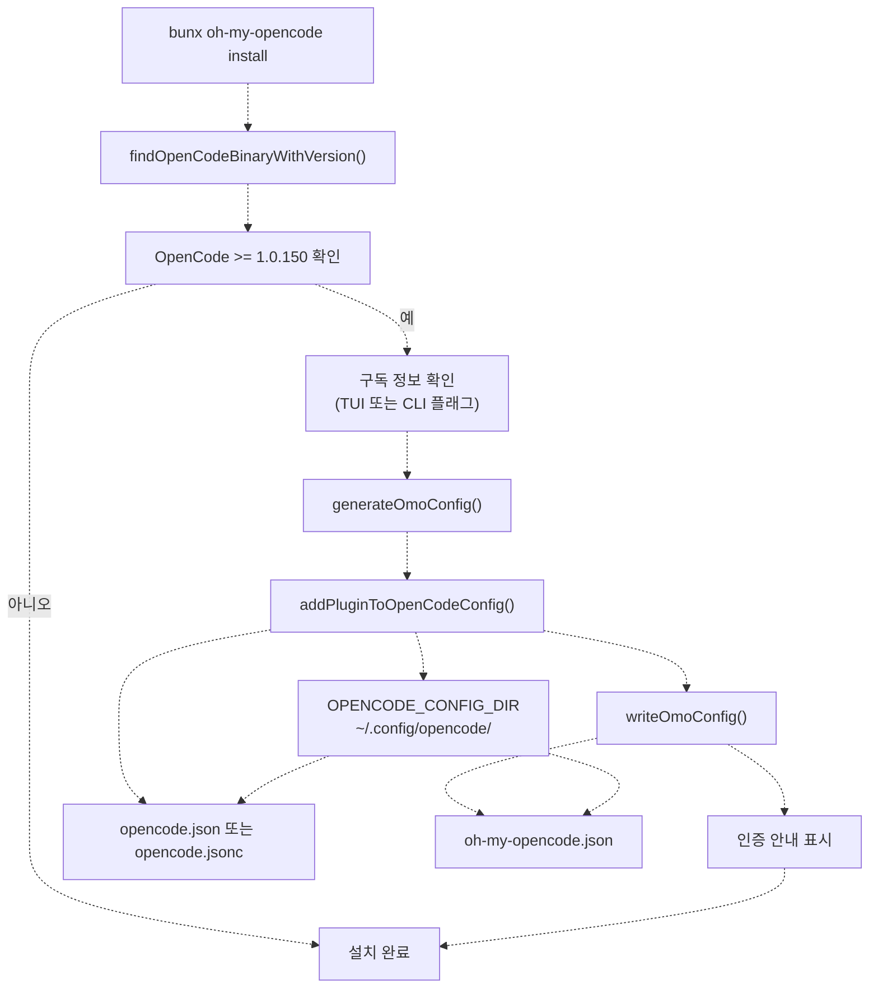
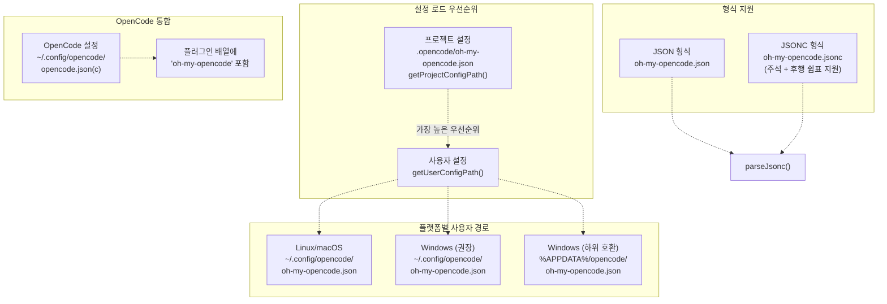
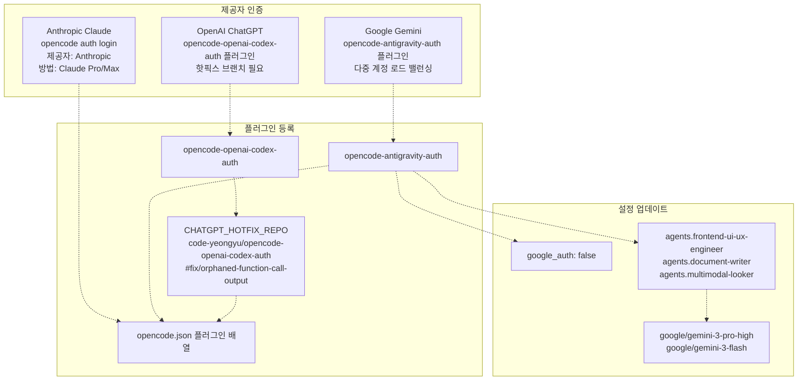

# 시작하기 (Getting Started)

> **관련 소스 파일**
> * [README.ja.md](https://github.com/code-yeongyu/oh-my-opencode/blob/b92cd6ab/README.ja.md)
> * [README.ko.md](https://github.com/code-yeongyu/oh-my-opencode/blob/b92cd6ab/README.ko.md)
> * [README.md](https://github.com/code-yeongyu/oh-my-opencode/blob/b92cd6ab/README.md)
> * [README.zh-cn.md](https://github.com/code-yeongyu/oh-my-opencode/blob/b92cd6ab/README.zh-cn.md)
> * [bun.lock](https://github.com/code-yeongyu/oh-my-opencode/blob/b92cd6ab/bun.lock)
> * [package.json](https://github.com/code-yeongyu/oh-my-opencode/blob/b92cd6ab/package.json)
> * [src/cli/config-manager.ts](https://github.com/code-yeongyu/oh-my-opencode/blob/b92cd6ab/src/cli/config-manager.ts)
> * [src/shared/config-path.ts](https://github.com/code-yeongyu/oh-my-opencode/blob/b92cd6ab/src/shared/config-path.ts)
> * [src/shared/jsonc-parser.test.ts](https://github.com/code-yeongyu/oh-my-opencode/blob/b92cd6ab/src/shared/jsonc-parser.test.ts)
> * [src/shared/jsonc-parser.ts](https://github.com/code-yeongyu/oh-my-opencode/blob/b92cd6ab/src/shared/jsonc-parser.ts)

이 페이지는 oh-my-opencode의 설치 및 설정에 대한 개요를 제공합니다. 필수 요구 사항, 설치 프로세스, 설정 파일 구조, 그리고 OpenCode와 함께 플러그인을 사용하기 위해 필요한 인증 설정에 대해 설명합니다.

상세한 단계별 설치 지침은 [설치(Installation)](../getting-started/Installation.md)를 참조하십시오. 인증 제공자 설정에 대해서는 [인증 설정(Authentication Setup)](../getting-started/Authentication-Setup.md)을, 설정 파일의 상세 내용과 스키마에 대해서는 [설정 파일(Configuration Files)](../getting-started/Configuration-Files.md)을 참조하십시오.

## 사전 요구 사항 (Prerequisites)

oh-my-opencode를 사용하려면 시스템에 OpenCode 버전 1.0.150 이상이 설치되어 있어야 합니다. 플러그인은 시스템 PATH에서 `opencode` 또는 `opencode-desktop` 바이너리를 검색하여 OpenCode를 감지합니다.

**지원되는 OpenCode 바이너리:**

* `opencode` (표준 CLI)
* `opencode-desktop` (데스크톱 애플리케이션)

**플랫폼 지원:**

* Linux (x64, arm64)
* macOS (x64, arm64)
* Windows (x64, arm64, ia32)

설치 프로세스는 플러그인 등록을 진행하기 전에 [`findOpenCodeBinaryWithVersion()`](https://github.com/code-yeongyu/oh-my-opencode/blob/b92cd6ab/`findOpenCodeBinaryWithVersion()`)을 사용하여 OpenCode 사용 가능 여부를 확인합니다.

출처: [src/cli/config-manager.ts L13](https://github.com/code-yeongyu/oh-my-opencode/blob/b92cd6ab/src/cli/config-manager.ts#L13-L13), [src/cli/config-manager.ts L214-L236](https://github.com/code-yeongyu/oh-my-opencode/blob/b92cd6ab/src/cli/config-manager.ts#L214-L236), [README.md L76-L83](https://github.com/code-yeongyu/oh-my-opencode/blob/b92cd6ab/README.md#L76-L83)

## 설치 방법 (Installation Methods)

oh-my-opencode는 두 가지 설치 인터페이스를 제공합니다:

### 대화형 설치 프로그램 (권장)

```
bunx oh-my-opencode install
```

대화형 설치 프로그램은 `@clack/prompts`를 사용하여 사용자의 구독 감지 및 설정을 안내합니다. 어떤 AI 제공자 구독(Claude Pro/Max, ChatGPT Plus/Pro, Gemini)을 사용할 수 있는지 묻고 그에 따라 에이전트 모델을 설정합니다.

### 비대화형 CLI

```
bunx oh-my-opencode install --no-tui --claude=<yes|no|max20> --chatgpt=<yes|no> --gemini=<yes|no>
```

비대화형 모드는 명시적인 구독 플래그를 수락하며 사용자 프롬프트 없이 설정을 생성합니다. 이 모드는 자동화 및 LLM 에이전트 지원 설치를 위해 설계되었습니다.

**구독 플래그 값:**

| 플래그 | 값 | 의미 |
| --- | --- | --- |
| `--claude` | `yes`, `no`, `max20` | Claude Pro 구독 상태 (max20 = 20배 모드) |
| `--chatgpt` | `yes`, `no` | ChatGPT Plus/Pro 구독 상태 |
| `--gemini` | `yes`, `no` | Google Gemini 연동 의사 여부 |

출처: [README.md L200-L204](https://github.com/code-yeongyu/oh-my-opencode/blob/b92cd6ab/README.md#L200-L204), [README.md L256-L267](https://github.com/code-yeongyu/oh-my-opencode/blob/b92cd6ab/README.md#L256-L267), [src/cli/config-manager.ts L17-L26](https://github.com/code-yeongyu/oh-my-opencode/blob/b92cd6ab/src/cli/config-manager.ts#L17-L26)

## 설치 흐름 (Installation Flow)



**설치 프로세스:**

1. **바이너리 감지**: [`findOpenCodeBinaryWithVersion()`](https://github.com/code-yeongyu/oh-my-opencode/blob/b92cd6ab/`findOpenCodeBinaryWithVersion()`)이 OpenCode 바이너리를 검색하고 버전 정보를 추출합니다.
2. **버전 검증**: [`getOpenCodeVersion()`](https://github.com/code-yeongyu/oh-my-opencode/blob/b92cd6ab/`getOpenCodeVersion()`)이 최소 버전 요구 사항(1.0.150)을 확인합니다.
3. **구독 감지**: AI 제공자 구독 정보를 사용자에게 묻거나(대화형) CLI 플래그를 수락합니다(비대화형).
4. **설정 생성**: [`generateOmoConfig()`](https://github.com/code-yeongyu/oh-my-opencode/blob/b92cd6ab/`generateOmoConfig()`)가 사용 가능한 구독을 기반으로 에이전트 모델 매핑을 생성합니다.
5. **플러그인 등록**: [`addPluginToOpenCodeConfig()`](https://github.com/code-yeongyu/oh-my-opencode/blob/b92cd6ab/`addPluginToOpenCodeConfig()`)가 OpenCode 플러그인 배열에 `"oh-my-opencode"`를 추가합니다.
6. **설정 파일 쓰기**: [`writeOmoConfig()`](https://github.com/code-yeongyu/oh-my-opencode/blob/b92cd6ab/`writeOmoConfig()`)가 에이전트 오버라이드 설정을 포함한 oh-my-opencode 설정을 작성합니다.
7. **인증 안내**: 제공자별 인증 단계를 표시합니다.

출처: [src/cli/config-manager.ts L60-L109](https://github.com/code-yeongyu/oh-my-opencode/blob/b92cd6ab/src/cli/config-manager.ts#L60-L109), [src/cli/config-manager.ts L138-L185](https://github.com/code-yeongyu/oh-my-opencode/blob/b92cd6ab/src/cli/config-manager.ts#L138-L185), [src/cli/config-manager.ts L187-L207](https://github.com/code-yeongyu/oh-my-opencode/blob/b92cd6ab/src/cli/config-manager.ts#L187-L207), [src/cli/config-manager.ts L214-L241](https://github.com/code-yeongyu/oh-my-opencode/blob/b92cd6ab/src/cli/config-manager.ts#L214-L241)

## 설정 파일 계층 구조 (Configuration File Hierarchy)

oh-my-opencode는 플랫폼별 경로를 가진 2단계 설정 시스템을 사용합니다:



**설정 경로 확인:**

[`getUserConfigDir()`](https://github.com/code-yeongyu/oh-my-opencode/blob/b92cd6ab/`getUserConfigDir()`) 함수는 플랫폼별 로직을 구현합니다:

* **Linux/macOS**: `XDG_CONFIG_HOME` 또는 `~/.config`를 사용합니다.
* **Windows**: 크로스 플랫폼 일관성을 위해 `~/.config/opencode/oh-my-opencode.json`을 먼저 확인하고, 하위 호환성을 위해 `%APPDATA%/opencode/oh-my-opencode.json`으로 대체 확인합니다.

[`getProjectConfigPath()`](https://github.com/code-yeongyu/oh-my-opencode/blob/b92cd6ab/`getProjectConfigPath()`) 함수는 프로젝트 루트를 기준으로 `.opencode/oh-my-opencode.json`을 반환합니다. 프로젝트 설정은 사용자 설정보다 우선합니다.

**JSONC 지원:**

[`detectConfigFile()`](https://github.com/code-yeongyu/oh-my-opencode/blob/b92cd6ab/`detectConfigFile()`) 함수는 `.json` 파일보다 `.jsonc` 파일을 우선시합니다. 두 형식 모두 다음을 지원하는 [`parseJsonc()`](https://github.com/code-yeongyu/oh-my-opencode/blob/b92cd6ab/`parseJsonc()`)로 파싱됩니다:

* 한 줄 주석 (`// 주석`)
* 여러 줄 주석 (`/* 주석 */`)
* 객체 및 배열의 후행 쉼표 (Trailing commas)

출처: [src/shared/config-path.ts L13-L47](https://github.com/code-yeongyu/oh-my-opencode/blob/b92cd6ab/src/shared/config-path.ts#L13-L47), [src/shared/jsonc-parser.ts L9-L24](https://github.com/code-yeongyu/oh-my-opencode/blob/b92cd6ab/src/shared/jsonc-parser.ts#L9-L24), [src/shared/jsonc-parser.ts L52-L66](https://github.com/code-yeongyu/oh-my-opencode/blob/b92cd6ab/src/shared/jsonc-parser.ts#L52-L66), [src/cli/config-manager.ts L7-L11](https://github.com/code-yeongyu/oh-my-opencode/blob/b92cd6ab/src/cli/config-manager.ts#L7-L11)

## 인증 개요 (Authentication Overview)

oh-my-opencode는 세 가지 AI 제공자 인증 방법을 지원합니다:



**제공자별 설정:**

1. **Anthropic Claude**: OAuth 흐름을 통한 내장 OpenCode 인증
    * 명령: `opencode auth login`
    * 제공자 선택: Anthropic
    * 방법 선택: Claude Pro/Max
    * 브라우저 기반 OAuth 완료
2. **Google Gemini**: 다중 계정을 지원하는 외부 플러그인
    * 설치: `opencode-antigravity-auth@1.1.2`
    * 내장 인증 비활성화: oh-my-opencode.json에서 `google_auth: false` 설정
    * 에이전트 모델을 `google/gemini-3-*` 모델명으로 오버라이드
    * 로드 밸런싱을 위해 최대 10개의 Google 계정 지원
3. **OpenAI ChatGPT**: 핫픽스가 필요한 외부 플러그인
    * 설치: [`CHATGPT_HOTFIX_REPO`](https://github.com/code-yeongyu/oh-my-opencode/blob/b92cd6ab/`CHATGPT_HOTFIX_REPO`)를 통해 `opencode-openai-codex-auth` 설치
    * 핫픽스 브랜치: `code-yeongyu/opencode-openai-codex-auth#fix/orphaned-function-call-output-with-tools`
    * 도구 호출 출력 시 400 에러를 방지하기 위해 필요
    * `~/.config/opencode/package.json` 의존성을 직접 수정

[`detectAuthPlugins()`](https://github.com/code-yeongyu/oh-my-opencode/blob/b92cd6ab/`detectAuthPlugins()`) 함수는 설치된 인증 플러그인을 스캔하고, [`showAuthInstructions()`](https://github.com/code-yeongyu/oh-my-opencode/blob/b92cd6ab/`showAuthInstructions()`)는 제공자별 설정 단계를 표시합니다.

출처: [src/cli/config-manager.ts L15](https://github.com/code-yeongyu/oh-my-opencode/blob/b92cd6ab/src/cli/config-manager.ts#L15-L15), [src/cli/config-manager.ts L243-L288](https://github.com/code-yeongyu/oh-my-opencode/blob/b92cd6ab/src/cli/config-manager.ts#L243-L288), [README.md L286-L343](https://github.com/code-yeongyu/oh-my-opencode/blob/b92cd6ab/README.md#L286-L343)

## 에이전트 모델 설정 (Agent Model Configuration)

[`generateOmoConfig()`](https://github.com/code-yeongyu/oh-my-opencode/blob/b92cd6ab/`generateOmoConfig()`) 함수는 구독 가용성에 따라 에이전트 모델 매핑을 생성합니다:

**모델 선택 로직:**

| 에이전트 | Gemini 보유 시 | Claude Max20 보유 시 | Claude 보유 시 | ChatGPT 보유 시 | 대체 모델 (Fallback) |
| --- | --- | --- | --- | --- | --- |
| `Sisyphus` | - | - | (기본값) | - | `opencode/big-pickle` |
| `oracle` | - | - | `anthropic/claude-opus-4-5` | (기본값) | `opencode/big-pickle` |
| `librarian` | `google/gemini-3-flash` | - | - | - | `opencode/big-pickle` |
| `explore` | `google/gemini-3-flash` | `anthropic/claude-haiku-4-5` | - | - | `opencode/big-pickle` |
| `frontend-ui-ux-engineer` | `google/gemini-3-pro-high` | - | `anthropic/claude-opus-4-5` | - | `opencode/big-pickle` |
| `document-writer` | `google/gemini-3-flash` | - | `anthropic/claude-opus-4-5` | - | `opencode/big-pickle` |
| `multimodal-looker` | `google/gemini-3-flash` | - | `anthropic/claude-opus-4-5` | - | `opencode/big-pickle` |

`opencode/big-pickle` 모델은 유료 구독을 사용할 수 없을 때 무료 대체 모델로 작동합니다.

설정 병합 시에는 [`deepMerge()`](https://github.com/code-yeongyu/oh-my-opencode/blob/b92cd6ab/`deepMerge()`)를 사용하여 기존 설정을 보존하면서 에이전트 모델을 업데이트합니다. 이 함수는 관련 없는 키를 덮어쓰지 않고 중첩된 객체를 재귀적으로 병합합니다.

출처: [src/cli/config-manager.ts L111-L185](https://github.com/code-yeongyu/oh-my-opencode/blob/b92cd6ab/src/cli/config-manager.ts#L111-L185)

## 검증 단계 (Verification Steps)

설치 후 다음 사항을 확인하십시오:

1. **OpenCode 버전 확인:** ``` opencode --version ``` 예상 결과: 1.0.150 이상
2. **플러그인 등록:** ``` cat ~/.config/opencode/opencode.json ``` 예상 결과: `plugin` 배열에 `"oh-my-opencode"` 포함
3. **설정 파일:** ``` cat ~/.config/opencode/oh-my-opencode.json ``` 예상 결과: `$schema` 및 `agents` 키를 포함한 JSON 객체
4. **인증 상태:** ``` opencode auth list ``` 예상 결과: 설정된 제공자 목록 표시

설치 프로그램은 설정 파일을 수정하기 전에 [`isOpenCodeInstalled()`](https://github.com/code-yeongyu/oh-my-opencode/blob/b92cd6ab/`isOpenCodeInstalled()`) 및 [`getOpenCodeVersion()`](https://github.com/code-yeongyu/oh-my-opencode/blob/b92cd6ab/`getOpenCodeVersion()`)을 사용하여 이러한 필수 요구 사항을 검증합니다.

출처: [src/cli/config-manager.ts L233-L241](https://github.com/code-yeongyu/oh-my-opencode/blob/b92cd6ab/src/cli/config-manager.ts#L233-L241), [README.md L276-L279](https://github.com/code-yeongyu/oh-my-opencode/blob/b92cd6ab/README.md#L276-L279)

## 다음 단계 (Next Steps)

설치가 완료되면:

1. **인증**: 구독 중인 AI 제공자의 자격 증명을 설정합니다. 상세한 제공자별 지침은 [인증 설정](../getting-started/Authentication-Setup.md)을 참조하십시오.
2. **설정**: 에이전트 동작, 훅(hooks), 도구 접근 권한을 사용자 정의합니다. 스키마 문서와 예시는 [설정 파일](../getting-started/Configuration-Files.md)을 참조하십시오.
3. **사용**: 플러그인이 활성화된 상태로 OpenCode를 시작합니다. Sisyphus 오케스트레이터가 기본 에이전트로 사용 가능하며, 특화된 에이전트들(`oracle`, `librarian`, `explore`, `frontend-ui-ux-engineer`, `document-writer`, `multimodal-looker`)은 `@agent-name` 멘션을 통해 호출할 수 있습니다.

훅 사용자 정의, MCP 통합, Claude Code 호환성을 포함한 고급 설정 옵션은 [참조(Reference)](../reference/) 섹션을 확인하십시오.

출처: [README.md L76-L427](https://github.com/code-yeongyu/oh-my-opencode/blob/b92cd6ab/README.md#L76-L427)