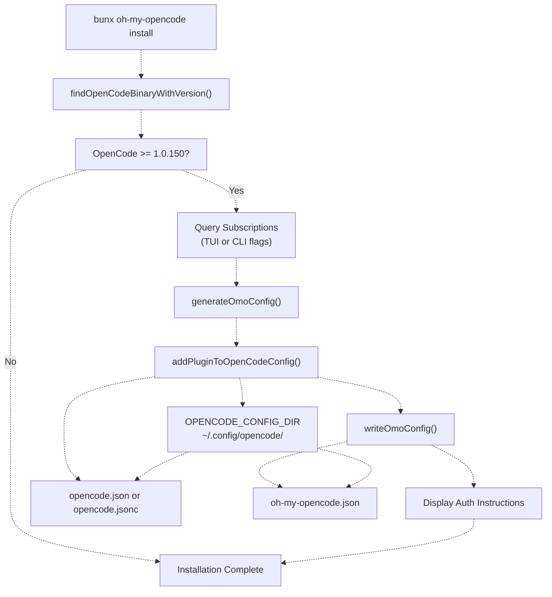
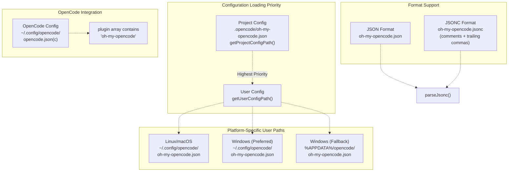
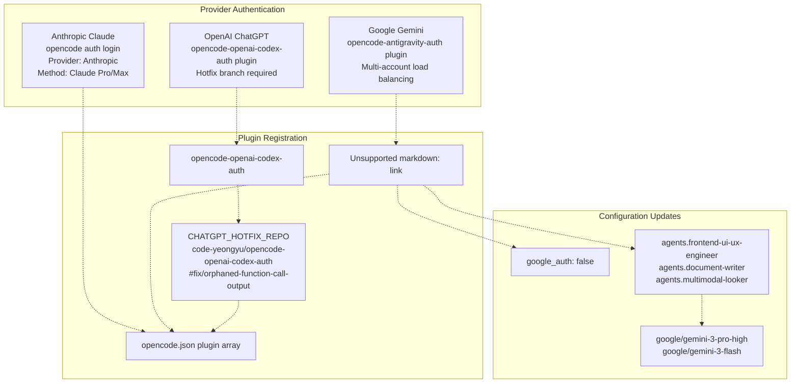

# Getting Started

> **Relevant source files**
> * [README.ja.md](https://github.com/code-yeongyu/oh-my-opencode/blob/b92cd6ab/README.ja.md)
> * [README.ko.md](https://github.com/code-yeongyu/oh-my-opencode/blob/b92cd6ab/README.ko.md)
> * [README.md](https://github.com/code-yeongyu/oh-my-opencode/blob/b92cd6ab/README.md)
> * [README.zh-cn.md](https://github.com/code-yeongyu/oh-my-opencode/blob/b92cd6ab/README.zh-cn.md)
> * [bun.lock](https://github.com/code-yeongyu/oh-my-opencode/blob/b92cd6ab/bun.lock)
> * [package.json](https://github.com/code-yeongyu/oh-my-opencode/blob/b92cd6ab/package.json)
> * [src/cli/config-manager.ts](https://github.com/code-yeongyu/oh-my-opencode/blob/b92cd6ab/src/cli/config-manager.ts)
> * [src/shared/config-path.ts](https://github.com/code-yeongyu/oh-my-opencode/blob/b92cd6ab/src/shared/config-path.ts)
> * [src/shared/jsonc-parser.test.ts](https://github.com/code-yeongyu/oh-my-opencode/blob/b92cd6ab/src/shared/jsonc-parser.test.ts)
> * [src/shared/jsonc-parser.ts](https://github.com/code-yeongyu/oh-my-opencode/blob/b92cd6ab/src/shared/jsonc-parser.ts)

This page provides an overview of installing and configuring oh-my-opencode. It covers the prerequisites, installation process, configuration file structure, and authentication setup required to use the plugin with OpenCode.

For detailed step-by-step installation instructions, see [Installation](../getting-started/Installation.md). For authentication provider configuration, see [Authentication Setup](../getting-started/Authentication-Setup.md). For configuration file details and schema, see [Configuration Files](../getting-started/Configuration-Files.md).

## Prerequisites

oh-my-opencode requires OpenCode version 1.0.150 or higher to be installed on your system. The plugin detects OpenCode by searching for `opencode` or `opencode-desktop` binaries in your system PATH.

**Supported OpenCode Binaries:**

* `opencode` (standard CLI)
* `opencode-desktop` (desktop application)

**Platform Support:**

* Linux (x64, arm64)
* macOS (x64, arm64)
* Windows (x64, arm64, ia32)

The installation process verifies OpenCode availability using [`findOpenCodeBinaryWithVersion()`](https://github.com/code-yeongyu/oh-my-opencode/blob/b92cd6ab/`findOpenCodeBinaryWithVersion()`)

 before proceeding with plugin registration.

Sources: [src/cli/config-manager.ts L13](https://github.com/code-yeongyu/oh-my-opencode/blob/b92cd6ab/src/cli/config-manager.ts#L13-L13)

 [src/cli/config-manager.ts L214-L236](https://github.com/code-yeongyu/oh-my-opencode/blob/b92cd6ab/src/cli/config-manager.ts#L214-L236)

 [README.md L76-L83](https://github.com/code-yeongyu/oh-my-opencode/blob/b92cd6ab/README.md#L76-L83)

## Installation Methods

oh-my-opencode provides two installation interfaces:

### Interactive Installer (Recommended)

```
bunx oh-my-opencode install
```

The interactive installer uses `@clack/prompts` to guide users through subscription detection and configuration. It queries which AI provider subscriptions (Claude Pro/Max, ChatGPT Plus/Pro, Gemini) are available and configures agent models accordingly.

### Non-Interactive CLI

```
bunx oh-my-opencode install --no-tui --claude=<yes|no|max20> --chatgpt=<yes|no> --gemini=<yes|no>
```

The non-interactive mode accepts explicit subscription flags and generates configuration without user prompts. This mode is designed for automation and LLM agent-assisted setup.

**Subscription Flag Values:**

| Flag | Values | Meaning |
| --- | --- | --- |
| `--claude` | `yes`, `no`, `max20` | Claude Pro subscription status (max20 = 20x mode) |
| `--chatgpt` | `yes`, `no` | ChatGPT Plus/Pro subscription status |
| `--gemini` | `yes`, `no` | Google Gemini integration intent |

Sources: [README.md L200-L204](https://github.com/code-yeongyu/oh-my-opencode/blob/b92cd6ab/README.md#L200-L204)

 [README.md L256-L267](https://github.com/code-yeongyu/oh-my-opencode/blob/b92cd6ab/README.md#L256-L267)

 [src/cli/config-manager.ts L17-L26](https://github.com/code-yeongyu/oh-my-opencode/blob/b92cd6ab/src/cli/config-manager.ts#L17-L26)

## Installation Flow



**Installation Process:**

1. **Binary Detection**: [`findOpenCodeBinaryWithVersion()`](https://github.com/code-yeongyu/oh-my-opencode/blob/b92cd6ab/`findOpenCodeBinaryWithVersion()`)  searches for OpenCode binaries and extracts version information
2. **Version Validation**: [`getOpenCodeVersion()`](https://github.com/code-yeongyu/oh-my-opencode/blob/b92cd6ab/`getOpenCodeVersion()`)  verifies minimum version requirement (1.0.150)
3. **Subscription Detection**: Queries user for AI provider subscriptions (interactive) or accepts CLI flags (non-interactive)
4. **Configuration Generation**: [`generateOmoConfig()`](https://github.com/code-yeongyu/oh-my-opencode/blob/b92cd6ab/`generateOmoConfig()`)  creates agent model mappings based on available subscriptions
5. **Plugin Registration**: [`addPluginToOpenCodeConfig()`](https://github.com/code-yeongyu/oh-my-opencode/blob/b92cd6ab/`addPluginToOpenCodeConfig()`)  adds `"oh-my-opencode"` to the OpenCode plugin array
6. **Config File Writing**: [`writeOmoConfig()`](https://github.com/code-yeongyu/oh-my-opencode/blob/b92cd6ab/`writeOmoConfig()`)  writes oh-my-opencode configuration with agent overrides
7. **Authentication Instructions**: Displays provider-specific authentication steps

Sources: [src/cli/config-manager.ts L60-L109](https://github.com/code-yeongyu/oh-my-opencode/blob/b92cd6ab/src/cli/config-manager.ts#L60-L109)

 [src/cli/config-manager.ts L138-L185](https://github.com/code-yeongyu/oh-my-opencode/blob/b92cd6ab/src/cli/config-manager.ts#L138-L185)

 [src/cli/config-manager.ts L187-L207](https://github.com/code-yeongyu/oh-my-opencode/blob/b92cd6ab/src/cli/config-manager.ts#L187-L207)

 [src/cli/config-manager.ts L214-L241](https://github.com/code-yeongyu/oh-my-opencode/blob/b92cd6ab/src/cli/config-manager.ts#L214-L241)

## Configuration File Hierarchy

oh-my-opencode uses a two-tier configuration system with platform-specific paths:



**Configuration Path Resolution:**

The [`getUserConfigDir()`](https://github.com/code-yeongyu/oh-my-opencode/blob/b92cd6ab/`getUserConfigDir()`)

 function implements platform-specific logic:

* **Linux/macOS**: Uses `XDG_CONFIG_HOME` or `~/.config`
* **Windows**: Checks `~/.config/opencode/oh-my-opencode.json` first for cross-platform consistency, then falls back to `%APPDATA%/opencode/oh-my-opencode.json` for backward compatibility

The [`getProjectConfigPath()`](https://github.com/code-yeongyu/oh-my-opencode/blob/b92cd6ab/`getProjectConfigPath()`)

 function returns `.opencode/oh-my-opencode.json` relative to the project root. Project configurations override user configurations when both exist.

**JSONC Support:**

The [`detectConfigFile()`](https://github.com/code-yeongyu/oh-my-opencode/blob/b92cd6ab/`detectConfigFile()`)

 function prioritizes `.jsonc` over `.json` files. Both formats are parsed with [`parseJsonc()`](https://github.com/code-yeongyu/oh-my-opencode/blob/b92cd6ab/`parseJsonc()`)

 which supports:

* Line comments (`// comment`)
* Block comments (`/* comment */`)
* Trailing commas in objects and arrays

Sources: [src/shared/config-path.ts L13-L47](https://github.com/code-yeongyu/oh-my-opencode/blob/b92cd6ab/src/shared/config-path.ts#L13-L47)

 [src/shared/jsonc-parser.ts L9-L24](https://github.com/code-yeongyu/oh-my-opencode/blob/b92cd6ab/src/shared/jsonc-parser.ts#L9-L24)

 [src/shared/jsonc-parser.ts L52-L66](https://github.com/code-yeongyu/oh-my-opencode/blob/b92cd6ab/src/shared/jsonc-parser.ts#L52-L66)

 [src/cli/config-manager.ts L7-L11](https://github.com/code-yeongyu/oh-my-opencode/blob/b92cd6ab/src/cli/config-manager.ts#L7-L11)

## Authentication Overview

oh-my-opencode supports three AI provider authentication methods:



**Provider-Specific Setup:**

1. **Anthropic Claude**: Built-in OpenCode authentication via OAuth flow * Command: `opencode auth login` * Select Provider: Anthropic * Select Method: Claude Pro/Max * Browser-based OAuth completion
2. **Google Gemini**: External plugin with multi-account support * Install: `opencode-antigravity-auth@1.1.2` * Disable built-in auth: `google_auth: false` in oh-my-opencode.json * Override agent models to use `google/gemini-3-*` model names * Supports up to 10 Google accounts for load balancing
3. **OpenAI ChatGPT**: External plugin with hotfix requirement * Install: `opencode-openai-codex-auth` via [`CHATGPT_HOTFIX_REPO`](https://github.com/code-yeongyu/oh-my-opencode/blob/b92cd6ab/`CHATGPT_HOTFIX_REPO`) * Hotfix branch: `code-yeongyu/opencode-openai-codex-auth#fix/orphaned-function-call-output-with-tools` * Required to avoid 400 errors with tool call outputs * Edit `~/.config/opencode/package.json` dependencies directly

The [`detectAuthPlugins()`](https://github.com/code-yeongyu/oh-my-opencode/blob/b92cd6ab/`detectAuthPlugins()`)

 function scans installed authentication plugins and [`showAuthInstructions()`](https://github.com/code-yeongyu/oh-my-opencode/blob/b92cd6ab/`showAuthInstructions()`)

 displays provider-specific setup steps.

Sources: [src/cli/config-manager.ts L15](https://github.com/code-yeongyu/oh-my-opencode/blob/b92cd6ab/src/cli/config-manager.ts#L15-L15)

 [src/cli/config-manager.ts L243-L288](https://github.com/code-yeongyu/oh-my-opencode/blob/b92cd6ab/src/cli/config-manager.ts#L243-L288)

 [README.md L286-L343](https://github.com/code-yeongyu/oh-my-opencode/blob/b92cd6ab/README.md#L286-L343)

## Agent Model Configuration

The [`generateOmoConfig()`](https://github.com/code-yeongyu/oh-my-opencode/blob/b92cd6ab/`generateOmoConfig()`)

 function creates agent model mappings based on subscription availability:

**Model Selection Logic:**

| Agent | Has Gemini | Has Claude Max20 | Has Claude | Has ChatGPT | Fallback |
| --- | --- | --- | --- | --- | --- |
| `Sisyphus` | - | - | (default) | - | `opencode/big-pickle` |
| `oracle` | - | - | `anthropic/claude-opus-4-5` | (default) | `opencode/big-pickle` |
| `librarian` | `google/gemini-3-flash` | - | - | - | `opencode/big-pickle` |
| `explore` | `google/gemini-3-flash` | `anthropic/claude-haiku-4-5` | - | - | `opencode/big-pickle` |
| `frontend-ui-ux-engineer` | `google/gemini-3-pro-high` | - | `anthropic/claude-opus-4-5` | - | `opencode/big-pickle` |
| `document-writer` | `google/gemini-3-flash` | - | `anthropic/claude-opus-4-5` | - | `opencode/big-pickle` |
| `multimodal-looker` | `google/gemini-3-flash` | - | `anthropic/claude-opus-4-5` | - | `opencode/big-pickle` |

The `opencode/big-pickle` model serves as the free fallback when no paid subscriptions are available.

Configuration merging uses [`deepMerge()`](https://github.com/code-yeongyu/oh-my-opencode/blob/b92cd6ab/`deepMerge()`)

 to preserve existing settings while updating agent models. The function recursively merges nested objects without overwriting unrelated keys.

Sources: [src/cli/config-manager.ts L111-L185](https://github.com/code-yeongyu/oh-my-opencode/blob/b92cd6ab/src/cli/config-manager.ts#L111-L185)

## Verification Steps

After installation, verify the setup:

1. **OpenCode Version Check:** ``` opencode --version ``` Expected: 1.0.150 or higher
2. **Plugin Registration:** ``` cat ~/.config/opencode/opencode.json ``` Expected: `"oh-my-opencode"` in the `plugin` array
3. **Configuration File:** ``` cat ~/.config/opencode/oh-my-opencode.json ``` Expected: JSON object with `$schema` and `agents` keys
4. **Authentication Status:** ``` opencode auth list ``` Expected: Configured providers listed

The installer validates these prerequisites using [`isOpenCodeInstalled()`](https://github.com/code-yeongyu/oh-my-opencode/blob/b92cd6ab/`isOpenCodeInstalled()`)

 and [`getOpenCodeVersion()`](https://github.com/code-yeongyu/oh-my-opencode/blob/b92cd6ab/`getOpenCodeVersion()`)

 before modifying any configuration files.

Sources: [src/cli/config-manager.ts L233-L241](https://github.com/code-yeongyu/oh-my-opencode/blob/b92cd6ab/src/cli/config-manager.ts#L233-L241)

 [README.md L276-L279](https://github.com/code-yeongyu/oh-my-opencode/blob/b92cd6ab/README.md#L276-L279)

## Next Steps

Once installation is complete:

1. **Authentication**: Configure AI provider credentials for your subscriptions. See [Authentication Setup](../getting-started/Authentication-Setup.md) for detailed provider-specific instructions.
2. **Configuration**: Customize agent behavior, hooks, and tool access. See [Configuration Files](../getting-started/Configuration-Files.md) for schema documentation and examples.
3. **Usage**: Start OpenCode with the plugin enabled. The Sisyphus orchestrator will be available as the default agent, with specialized agents (`oracle`, `librarian`, `explore`, `frontend-ui-ux-engineer`, `document-writer`, `multimodal-looker`) accessible via `@agent-name` mentions.

For advanced configuration options including hook customization, MCP integration, and Claude Code compatibility, see the [Configuration](../reference/) section.

Sources: [README.md L76-L427](https://github.com/code-yeongyu/oh-my-opencode/blob/b92cd6ab/README.md#L76-L427)