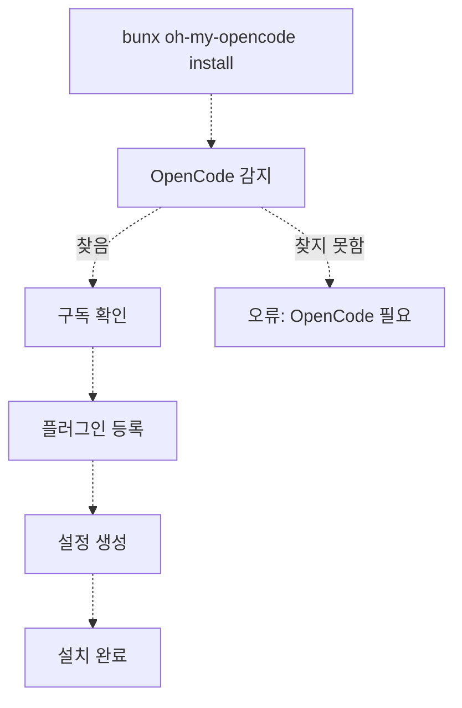
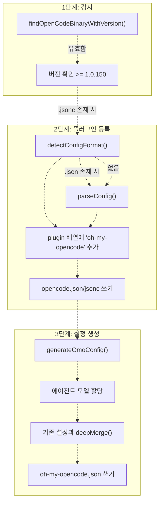
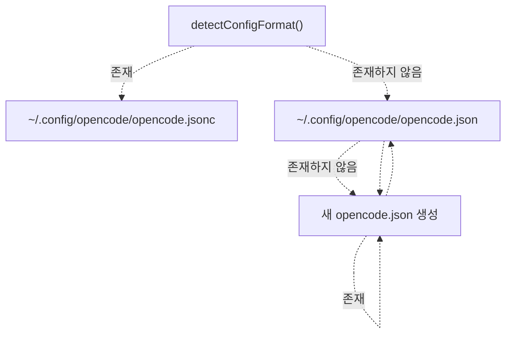
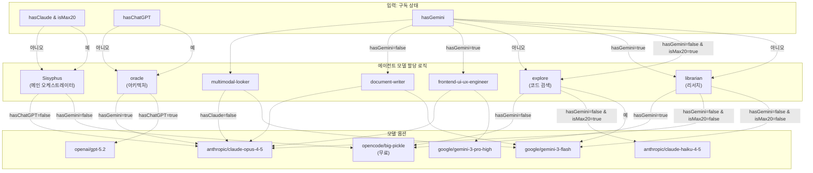
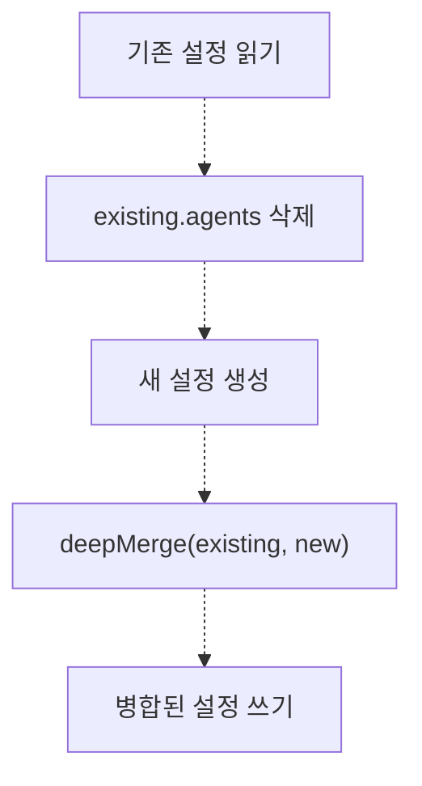
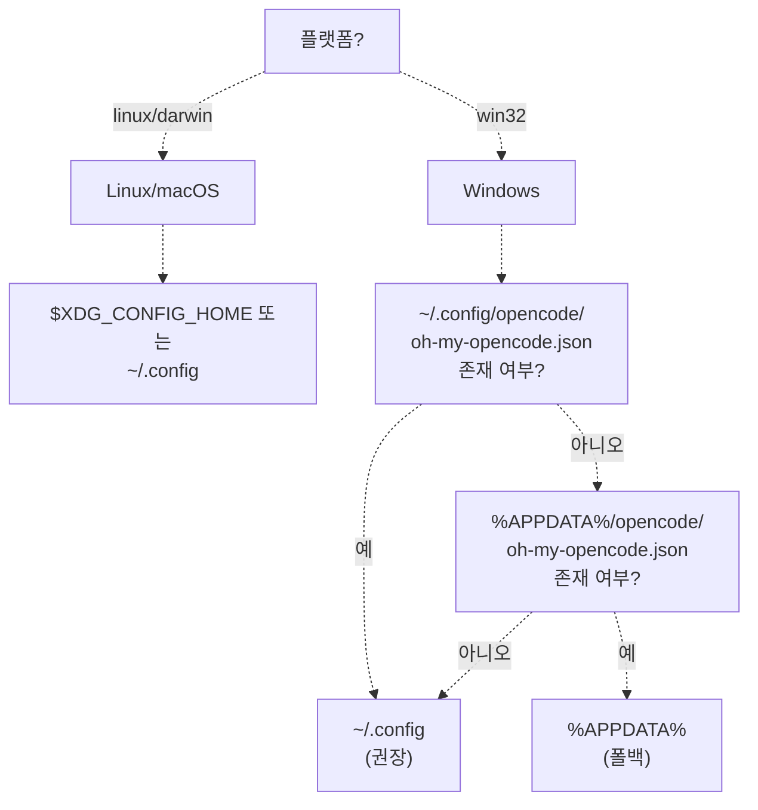

# 설치 (Installation)

> **관련 소스 파일**
> * [README.ja.md](https://github.com/code-yeongyu/oh-my-opencode/blob/b92cd6ab/README.ja.md)
> * [README.ko.md](https://github.com/code-yeongyu/oh-my-opencode/blob/b92cd6ab/README.ko.md)
> * [README.md](https://github.com/code-yeongyu/oh-my-opencode/blob/b92cd6ab/README.md)
> * [README.zh-cn.md](https://github.com/code-yeongyu/oh-my-opencode/blob/b92cd6ab/README.zh-cn.md)
> * [bun.lock](https://github.com/code-yeongyu/oh-my-opencode/blob/b92cd6ab/bun.lock)
> * [package.json](https://github.com/code-yeongyu/oh-my-opencode/blob/b92cd6ab/package.json)
> * [src/cli/config-manager.ts](https://github.com/code-yeongyu/oh-my-opencode/blob/b92cd6ab/src/cli/config-manager.ts)
> * [src/shared/config-path.ts](https://github.com/code-yeongyu/oh-my-opencode/blob/b92cd6ab/src/shared/config-path.ts)
> * [src/shared/jsonc-parser.test.ts](https://github.com/code-yeongyu/oh-my-opencode/blob/b92cd6ab/src/shared/jsonc-parser.test.ts)
> * [src/shared/jsonc-parser.ts](https://github.com/code-yeongyu/oh-my-opencode/blob/b92cd6ab/src/shared/jsonc-parser.ts)

이 페이지는 사전 요구 사항 확인, 구독 감지, 플러그인 등록 및 설정 파일 생성을 포함한 oh-my-opencode의 설치 프로세스를 자세히 설명합니다. 설치는 사용 가능한 AI 제공자 구독 정보에 따라 설정을 조정하는 CLI 도구를 통해 자동화됩니다.

설치 후 인증 설정에 대해서는 [인증 설정](../getting-started/Authentication-Setup.md)을 참조하십시오. 설정 파일의 계층 구조 및 구조에 대한 자세한 내용은 [설정 파일](../getting-started/Configuration-Files.md)을 참조하십시오.

## 개요 (Overview)

설치 프로세스는 다섯 가지 주요 단계로 구성됩니다:



**출처:** [src/cli/config-manager.ts L1-L247](https://github.com/code-yeongyu/oh-my-opencode/blob/b92cd6ab/src/cli/config-manager.ts#L1-L247)

 [README.md L195-L427](https://github.com/code-yeongyu/oh-my-opencode/blob/b92cd6ab/README.md#L195-L427)

## 사전 요구 사항 (Prerequisites)

### OpenCode 설치

설치 프로그램은 먼저 OpenCode가 설치되어 있고 시스템 PATH에서 액세스 가능한지 확인합니다. 다음 두 가지 바이너리를 검색합니다:

| 바이너리 | 설명 |
| --- | --- |
| `opencode` | 표준 CLI 바이너리 |
| `opencode-desktop` | 데스크톱 애플리케이션 바이너리 |

최소 요구 버전은 **1.0.150** 이상입니다. 버전 감지는 `opencode --version` 또는 `opencode-desktop --version`을 실행하여 수행됩니다.

**출처:** [src/cli/config-manager.ts L13-L236](https://github.com/code-yeongyu/oh-my-opencode/blob/b92cd6ab/src/cli/config-manager.ts#L13-L236)

## 설치 명령 (Installation Command)

설치 프로그램은 두 가지 모드로 실행할 수 있습니다:

### 대화형 모드 (기본값)

```
bunx oh-my-opencode install
```

구독 정보를 대화형으로 묻는 TUI(Text User Interface)를 실행합니다.

### 비대화형 모드

```
bunx oh-my-opencode install --no-tui --claude=<yes|no|max20> --chatgpt=<yes|no> --gemini=<yes|no>
```

**CLI 플래그:**

| 플래그 | 값 | 설명 |
| --- | --- | --- |
| `--no-tui` | (boolean) | 대화형 프롬프트 비활성화 |
| `--claude` | `yes`, `no`, `max20` | Claude Pro/Max 구독 상태 |
| `--chatgpt` | `yes`, `no` | ChatGPT Plus/Pro 구독 상태 |
| `--gemini` | `yes`, `no` | Antigravity를 통한 Gemini 연동 여부 |

**예시:**

```markdown
# Claude max20을 포함한 모든 구독을 보유한 경우
bunx oh-my-opencode install --no-tui --claude=max20 --chatgpt=yes --gemini=yes

# Claude만 보유한 경우 (max20 아님)
bunx oh-my-opencode install --no-tui --claude=yes --chatgpt=no --gemini=no

# 구독이 없는 경우 (무료 모델 사용)
bunx oh-my-opencode install --no-tui --claude=no --chatgpt=no --gemini=no
```

**출처:** [README.md L222-L268](https://github.com/code-yeongyu/oh-my-opencode/blob/b92cd6ab/README.md#L222-L268)

 [src/cli/config-manager.ts L1-L50](https://github.com/code-yeongyu/oh-my-opencode/blob/b92cd6ab/src/cli/config-manager.ts#L1-L50)

## 설치 프로세스 흐름 (Installation Process Flow)



**출처:** [src/cli/config-manager.ts L214-L247](https://github.com/code-yeongyu/oh-my-opencode/blob/b92cd6ab/src/cli/config-manager.ts#L214-L247)

 [src/cli/config-manager.ts L60-L109](https://github.com/code-yeongyu/oh-my-opencode/blob/b92cd6ab/src/cli/config-manager.ts#L60-L109)

 [src/cli/config-manager.ts L138-L207](https://github.com/code-yeongyu/oh-my-opencode/blob/b92cd6ab/src/cli/config-manager.ts#L138-L207)

## 플러그인 등록 (Plugin Registration)

### 설정 파일 감지

설치 프로그램은 우선순위 시스템을 사용하여 기존 OpenCode 설정을 감지합니다:



**우선순위 순서:**

1. `opencode.jsonc` (주석이 포함된 JSONC)
2. `opencode.json` (표준 JSON)
3. 둘 다 존재하지 않으면 새 `opencode.json` 생성

**출처:** [src/cli/config-manager.ts L35-L43](https://github.com/code-yeongyu/oh-my-opencode/blob/b92cd6ab/src/cli/config-manager.ts#L35-L43)

 [src/shared/jsonc-parser.ts L52-L66](https://github.com/code-yeongyu/oh-my-opencode/blob/b92cd6ab/src/shared/jsonc-parser.ts#L52-L66)

### 플러그인 배열 수정

설치 프로그램은 OpenCode 설정의 `plugin` 배열을 수정합니다:

**JSONC 형식 (주석 보존):**

설치 프로그램은 정규식 매칭을 사용하여 `plugin` 배열을 찾고, 포맷과 주석을 유지하면서 `oh-my-opencode`를 삽입합니다:

```
// 패턴: /"plugin"\s*:\s*\[([\s\S]*?)\]/
// 삽입: 들여쓰기를 유지하며 "${pluginName}" 추가
```

**JSON 형식:**

표준 JSON으로 파싱하고, 배열에 추가한 후 `JSON.stringify(..., null, 2)`를 사용하여 다시 씁니다.

**멱등성 (Idempotency):**

설치 프로그램은 `oh-my-opencode`(또는 `oh-my-opencode`로 시작하는 문자열)가 이미 플러그인 배열에 존재하는지 확인하고, 발견되면 등록을 건너뜁니다.

**출처:** [src/cli/config-manager.ts L60-L109](https://github.com/code-yeongyu/oh-my-opencode/blob/b92cd6ab/src/cli/config-manager.ts#L60-L109)

 [src/shared/jsonc-parser.ts L9-L24](https://github.com/code-yeongyu/oh-my-opencode/blob/b92cd6ab/src/shared/jsonc-parser.ts#L9-L24)

## 에이전트 모델 할당 (Agent Model Assignment)

설정 생성기는 감지된 구독 정보를 기반으로 에이전트에 AI 모델을 할당합니다:



**할당 규칙:**

| 구독 상태 | Sisyphus | Oracle | Librarian | Explore | Frontend | DocWriter | Multimodal |
| --- | --- | --- | --- | --- | --- | --- | --- |
| 구독 없음 | `big-pickle` | `big-pickle` | `big-pickle` | `big-pickle` | `big-pickle` | `big-pickle` | `big-pickle` |
| Claude 전용 | `opus-4-5` | `opus-4-5` | `opus-4-5` | `big-pickle` | `opus-4-5` | `opus-4-5` | `opus-4-5` |
| Claude Max20 전용 | `opus-4-5` | `opus-4-5` | `opus-4-5` | `haiku-4-5` | `opus-4-5` | `opus-4-5` | `opus-4-5` |
| ChatGPT 전용 | `big-pickle` | `gpt-5.2` | `big-pickle` | `big-pickle` | `big-pickle` | `big-pickle` | `big-pickle` |
| Gemini 전용 | `big-pickle` | `big-pickle` | `gemini-3-flash` | `gemini-3-flash` | `gemini-3-pro-high` | `gemini-3-flash` | `gemini-3-flash` |
| 모든 구독 보유 | `opus-4-5` | `gpt-5.2` | `gemini-3-flash` | `gemini-3-flash` | `gemini-3-pro-high` | `gemini-3-flash` | `gemini-3-flash` |

**참고:** `hasGemini=true`인 경우, 내장 Google 인증 대신 외부 Antigravity OAuth 플러그인이 사용되므로 설정에서 `google_auth` 필드가 자동으로 `false`로 설정됩니다.

**출처:** [src/cli/config-manager.ts L138-L185](https://github.com/code-yeongyu/oh-my-opencode/blob/b92cd6ab/src/cli/config-manager.ts#L138-L185)

## 설정 파일 생성 (Configuration File Generation)

### 생성된 설정 구조

설치 프로그램은 다음과 같은 구조로 `~/.config/opencode/oh-my-opencode.json`을 생성합니다:

```json
{
  "$schema": "https://raw.githubusercontent.com/code-yeongyu/oh-my-opencode/master/assets/oh-my-opencode.schema.json",
  "google_auth": false,
  "agents": {
    "Sisyphus": { "model": "anthropic/claude-opus-4-5" },
    "oracle": { "model": "openai/gpt-5.2" },
    "librarian": { "model": "google/gemini-3-flash" },
    "explore": { "model": "google/gemini-3-flash" },
    "frontend-ui-ux-engineer": { "model": "google/gemini-3-pro-high" },
    "document-writer": { "model": "google/gemini-3-flash" },
    "multimodal-looker": { "model": "google/gemini-3-flash" }
  }
}
```

`$schema` 필드는 IDE의 자동 완성 및 유효성 검사를 활성화합니다.

**출처:** [src/cli/config-manager.ts L138-L185](https://github.com/code-yeongyu/oh-my-opencode/blob/b92cd6ab/src/cli/config-manager.ts#L138-L185)

### 설정 병합 (Configuration Merging)

`oh-my-opencode.json`이 이미 존재하는 경우, 설치 프로그램은 딥 머지(deep merge)를 수행합니다:



**병합 동작:**

1. 깨끗한 에이전트 모델 할당을 보장하기 위해 병합 전 **기존 `agents` 필드가 삭제**됩니다.
2. 다른 필드(예: `disabled_hooks`, `experimental`)는 보존됩니다.
3. 생성된 설정의 새 필드가 추가됩니다.
4. 객체가 아닌 필드는 새 값으로 덮어씌워집니다.

**출처:** [src/cli/config-manager.ts L187-L207](https://github.com/code-yeongyu/oh-my-opencode/blob/b92cd6ab/src/cli/config-manager.ts#L187-L207)

 [src/cli/config-manager.ts L111-L136](https://github.com/code-yeongyu/oh-my-opencode/blob/b92cd6ab/src/cli/config-manager.ts#L111-L136)

## 파일 위치 (File Locations)

### 사용자 수준 설정

설치 프로그램은 플랫폼별 로직을 사용하여 사용자 설정 디렉터리를 결정합니다:



**설정 파일 경로:**

| 플랫폼 | 기본 경로 | 폴백(Fallback) 경로 |
| --- | --- | --- |
| **Linux/macOS** | `~/.config/opencode/oh-my-opencode.json` | (없음) |
| **Windows** | `~/.config/opencode/oh-my-opencode.json` | `%APPDATA%\opencode\oh-my-opencode.json` |

Windows에서 설치 프로그램은 **크로스 플랫폼 경로**(`~/.config`)를 우선시하지만, 기존 설치와의 하위 호환성을 위해 `%APPDATA%`로 폴백합니다.

**출처:** [src/shared/config-path.ts L1-L48](https://github.com/code-yeongyu/oh-my-opencode/blob/b92cd6ab/src/shared/config-path.ts#L1-L48)

 [README.md L699-L706](https://github.com/code-yeongyu/oh-my-opencode/blob/b92cd6ab/README.md#L699-L706)

### OpenCode 설정 경로

| 파일 | 용도 | 우선순위 |
| --- | --- | --- |
| `~/.config/opencode/opencode.jsonc` | 주석이 포함된 OpenCode 설정 | 1 (가장 높음) |
| `~/.config/opencode/opencode.json` | 표준 JSON 형식의 OpenCode 설정 | 2 |
| `~/.config/opencode/oh-my-opencode.json` | 플러그인 사용자 설정 | - |
| `.opencode/oh-my-opencode.json` | 플러그인 프로젝트 설정 | - |

**출처:** [src/cli/config-manager.ts L7-L11](https://github.com/code-yeongyu/oh-my-opencode/blob/b92cd6ab/src/cli/config-manager.ts#L7-L11)

 [src/shared/config-path.ts L38-L47](https://github.com/code-yeongyu/oh-my-opencode/blob/b92cd6ab/src/shared/config-path.ts#L38-L47)

## 확인 (Verification)

설치가 완료된 후 설정을 확인하십시오:

```markdown
# OpenCode 버전 확인
opencode --version  # 1.0.150 이상이어야 함

# 플러그인 등록 확인
cat ~/.config/opencode/opencode.json  # plugin 배열에 "oh-my-opencode"가 포함되어야 함

# 생성된 설정 확인
cat ~/.config/opencode/oh-my-opencode.json  # 에이전트 모델 할당이 포함되어야 함
```

**다음 단계:**

1. 활성화된 제공자에 대한 인증을 구성합니다 ([인증 설정](../getting-started/Authentication-Setup.md) 참조)
2. 필요한 경우 에이전트 설정을 사용자 정의합니다 ([설정 파일](../getting-started/Configuration-Files.md) 참조)
3. 에이전트 시스템 문서를 검토합니다 ([에이전트 시스템](../agents/) 참조)

**출처:** [README.md L275-L279](https://github.com/code-yeongyu/oh-my-opencode/blob/b92cd6ab/README.md#L275-L279)

 [README.md L393-L399](https://github.com/code-yeongyu/oh-my-opencode/blob/b92cd6ab/README.md#L393-L399)