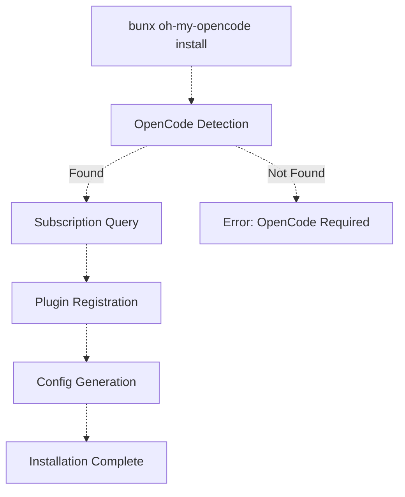
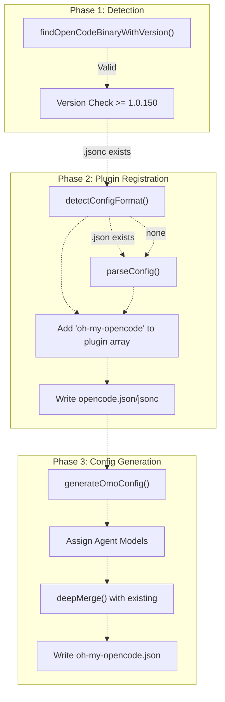
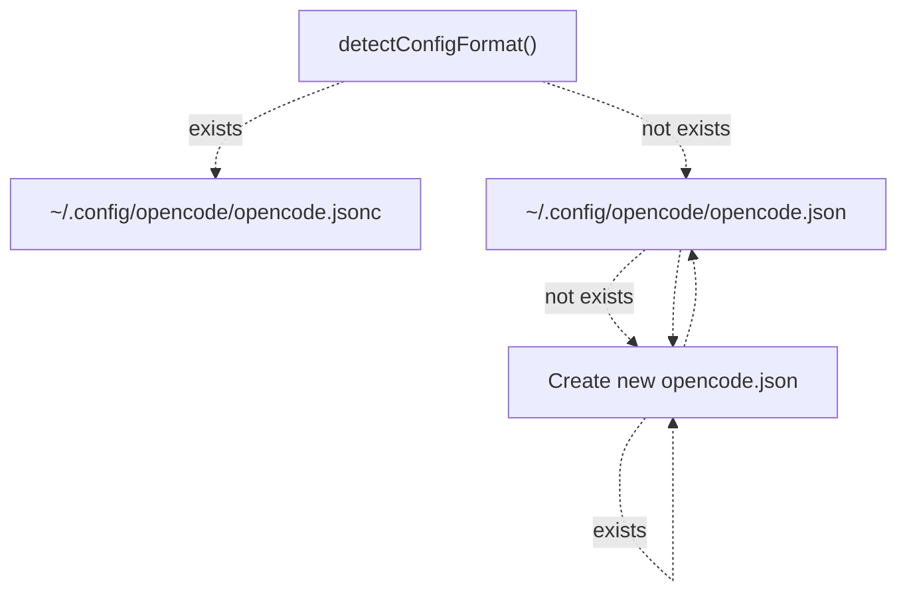
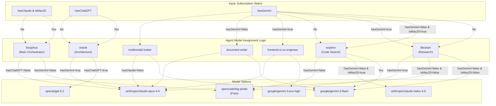
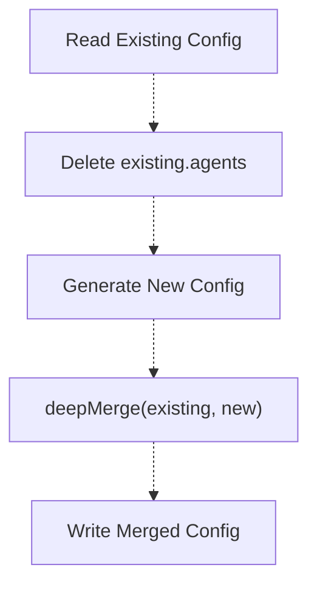
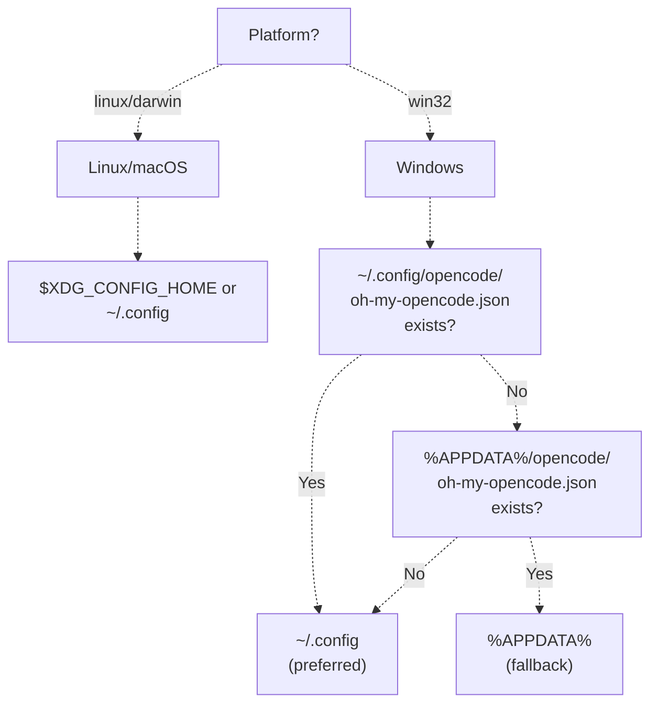

# Installation

> **Relevant source files**
> * [README.ja.md](https://github.com/code-yeongyu/oh-my-opencode/blob/b92cd6ab/README.ja.md)
> * [README.ko.md](https://github.com/code-yeongyu/oh-my-opencode/blob/b92cd6ab/README.ko.md)
> * [README.md](https://github.com/code-yeongyu/oh-my-opencode/blob/b92cd6ab/README.md)
> * [README.zh-cn.md](https://github.com/code-yeongyu/oh-my-opencode/blob/b92cd6ab/README.zh-cn.md)
> * [bun.lock](https://github.com/code-yeongyu/oh-my-opencode/blob/b92cd6ab/bun.lock)
> * [package.json](https://github.com/code-yeongyu/oh-my-opencode/blob/b92cd6ab/package.json)
> * [src/cli/config-manager.ts](https://github.com/code-yeongyu/oh-my-opencode/blob/b92cd6ab/src/cli/config-manager.ts)
> * [src/shared/config-path.ts](https://github.com/code-yeongyu/oh-my-opencode/blob/b92cd6ab/src/shared/config-path.ts)
> * [src/shared/jsonc-parser.test.ts](https://github.com/code-yeongyu/oh-my-opencode/blob/b92cd6ab/src/shared/jsonc-parser.test.ts)
> * [src/shared/jsonc-parser.ts](https://github.com/code-yeongyu/oh-my-opencode/blob/b92cd6ab/src/shared/jsonc-parser.ts)

This page details the installation process for oh-my-opencode, including prerequisite checks, subscription detection, plugin registration, and configuration file generation. The installation is automated through a CLI tool that adapts configuration based on available AI provider subscriptions.

For authentication setup after installation, see [Authentication Setup](../getting-started/Authentication-Setup.md). For details on configuration file hierarchy and structure, see [Configuration Files](../getting-started/Configuration-Files.md).

## Overview

The installation process consists of five main phases:



**Sources:** [src/cli/config-manager.ts L1-L247](https://github.com/code-yeongyu/oh-my-opencode/blob/b92cd6ab/src/cli/config-manager.ts#L1-L247)

 [README.md L195-L427](https://github.com/code-yeongyu/oh-my-opencode/blob/b92cd6ab/README.md#L195-L427)

## Prerequisites

### OpenCode Installation

The installer first verifies that OpenCode is installed and accessible in the system PATH. It searches for two possible binaries:

| Binary | Description |
| --- | --- |
| `opencode` | Standard CLI binary |
| `opencode-desktop` | Desktop application binary |

The minimum required version is **1.0.150** or higher. Version detection is performed by executing `opencode --version` or `opencode-desktop --version`.

**Sources:** [src/cli/config-manager.ts L13-L236](https://github.com/code-yeongyu/oh-my-opencode/blob/b92cd6ab/src/cli/config-manager.ts#L13-L236)

## Installation Command

The installer can be run in two modes:

### Interactive Mode (Default)

```
bunx oh-my-opencode install
```

Launches a TUI (Text User Interface) that prompts for subscription information interactively.

### Non-Interactive Mode

```
bunx oh-my-opencode install --no-tui --claude=<yes|no|max20> --chatgpt=<yes|no> --gemini=<yes|no>
```

**CLI Flags:**

| Flag | Values | Description |
| --- | --- | --- |
| `--no-tui` | (boolean) | Disable interactive prompts |
| `--claude` | `yes`, `no`, `max20` | Claude Pro/Max subscription status |
| `--chatgpt` | `yes`, `no` | ChatGPT Plus/Pro subscription status |
| `--gemini` | `yes`, `no` | Gemini integration via Antigravity |

**Examples:**

```markdown
# User has all subscriptions with Claude max20
bunx oh-my-opencode install --no-tui --claude=max20 --chatgpt=yes --gemini=yes

# User has only Claude (not max20)
bunx oh-my-opencode install --no-tui --claude=yes --chatgpt=no --gemini=no

# User has no subscriptions (uses free models)
bunx oh-my-opencode install --no-tui --claude=no --chatgpt=no --gemini=no
```

**Sources:** [README.md L222-L268](https://github.com/code-yeongyu/oh-my-opencode/blob/b92cd6ab/README.md#L222-L268)

 [src/cli/config-manager.ts L1-L50](https://github.com/code-yeongyu/oh-my-opencode/blob/b92cd6ab/src/cli/config-manager.ts#L1-L50)

## Installation Process Flow



**Sources:** [src/cli/config-manager.ts L214-L247](https://github.com/code-yeongyu/oh-my-opencode/blob/b92cd6ab/src/cli/config-manager.ts#L214-L247)

 [src/cli/config-manager.ts L60-L109](https://github.com/code-yeongyu/oh-my-opencode/blob/b92cd6ab/src/cli/config-manager.ts#L60-L109)

 [src/cli/config-manager.ts L138-L207](https://github.com/code-yeongyu/oh-my-opencode/blob/b92cd6ab/src/cli/config-manager.ts#L138-L207)

## Plugin Registration

### Configuration File Detection

The installer detects existing OpenCode configuration using a priority system:



**Priority Order:**

1. `opencode.jsonc` (JSONC with comments)
2. `opencode.json` (standard JSON)
3. Create new `opencode.json` if neither exists

**Sources:** [src/cli/config-manager.ts L35-L43](https://github.com/code-yeongyu/oh-my-opencode/blob/b92cd6ab/src/cli/config-manager.ts#L35-L43)

 [src/shared/jsonc-parser.ts L52-L66](https://github.com/code-yeongyu/oh-my-opencode/blob/b92cd6ab/src/shared/jsonc-parser.ts#L52-L66)

### Plugin Array Modification

The installer modifies the `plugin` array in the OpenCode configuration:

**JSONC Format (Preserves Comments):**

The installer uses regex matching to locate the `plugin` array and inserts `oh-my-opencode` while preserving formatting and comments:

```
// Pattern: /"plugin"\s*:\s*\[([\s\S]*?)\]/
// Inserts: "${pluginName}" maintaining indentation
```

**JSON Format:**

Parses as standard JSON, adds to array, and writes with `JSON.stringify(..., null, 2)`.

**Idempotency:**

The installer checks if `oh-my-opencode` (or any string starting with `oh-my-opencode`) already exists in the plugin array and skips registration if found.

**Sources:** [src/cli/config-manager.ts L60-L109](https://github.com/code-yeongyu/oh-my-opencode/blob/b92cd6ab/src/cli/config-manager.ts#L60-L109)

 [src/shared/jsonc-parser.ts L9-L24](https://github.com/code-yeongyu/oh-my-opencode/blob/b92cd6ab/src/shared/jsonc-parser.ts#L9-L24)

## Agent Model Assignment

The configuration generator assigns AI models to agents based on detected subscriptions:



**Assignment Rules:**

| Subscription Status | Sisyphus | Oracle | Librarian | Explore | Frontend | DocWriter | Multimodal |
| --- | --- | --- | --- | --- | --- | --- | --- |
| No subscriptions | `big-pickle` | `big-pickle` | `big-pickle` | `big-pickle` | `big-pickle` | `big-pickle` | `big-pickle` |
| Claude only | `opus-4-5` | `opus-4-5` | `opus-4-5` | `big-pickle` | `opus-4-5` | `opus-4-5` | `opus-4-5` |
| Claude Max20 only | `opus-4-5` | `opus-4-5` | `opus-4-5` | `haiku-4-5` | `opus-4-5` | `opus-4-5` | `opus-4-5` |
| ChatGPT only | `big-pickle` | `gpt-5.2` | `big-pickle` | `big-pickle` | `big-pickle` | `big-pickle` | `big-pickle` |
| Gemini only | `big-pickle` | `big-pickle` | `gemini-3-flash` | `gemini-3-flash` | `gemini-3-pro-high` | `gemini-3-flash` | `gemini-3-flash` |
| All subscriptions | `opus-4-5` | `gpt-5.2` | `gemini-3-flash` | `gemini-3-flash` | `gemini-3-pro-high` | `gemini-3-flash` | `gemini-3-flash` |

**Note:** When `hasGemini=true`, the `google_auth` field is automatically set to `false` in the configuration, as external Antigravity OAuth plugin will be used instead of built-in Google auth.

**Sources:** [src/cli/config-manager.ts L138-L185](https://github.com/code-yeongyu/oh-my-opencode/blob/b92cd6ab/src/cli/config-manager.ts#L138-L185)

## Configuration File Generation

### Generated Configuration Structure

The installer creates `~/.config/opencode/oh-my-opencode.json` with the following structure:

```json
{
  "$schema": "https://raw.githubusercontent.com/code-yeongyu/oh-my-opencode/master/assets/oh-my-opencode.schema.json",
  "google_auth": false,
  "agents": {
    "Sisyphus": { "model": "anthropic/claude-opus-4-5" },
    "oracle": { "model": "openai/gpt-5.2" },
    "librarian": { "model": "google/gemini-3-flash" },
    "explore": { "model": "google/gemini-3-flash" },
    "frontend-ui-ux-engineer": { "model": "google/gemini-3-pro-high" },
    "document-writer": { "model": "google/gemini-3-flash" },
    "multimodal-looker": { "model": "google/gemini-3-flash" }
  }
}
```

The `$schema` field enables IDE autocomplete and validation.

**Sources:** [src/cli/config-manager.ts L138-L185](https://github.com/code-yeongyu/oh-my-opencode/blob/b92cd6ab/src/cli/config-manager.ts#L138-L185)

### Configuration Merging

If `oh-my-opencode.json` already exists, the installer performs a deep merge:



**Merge Behavior:**

1. **Existing `agents` field is deleted** before merging to ensure clean agent model assignments
2. Other fields (e.g., `disabled_hooks`, `experimental`) are preserved
3. New fields from generated config are added
4. Non-object fields are overwritten by new values

**Sources:** [src/cli/config-manager.ts L187-L207](https://github.com/code-yeongyu/oh-my-opencode/blob/b92cd6ab/src/cli/config-manager.ts#L187-L207)

 [src/cli/config-manager.ts L111-L136](https://github.com/code-yeongyu/oh-my-opencode/blob/b92cd6ab/src/cli/config-manager.ts#L111-L136)

## File Locations

### User-Level Configuration

The installer determines the user config directory using platform-specific logic:



**Config File Paths:**

| Platform | Primary Path | Fallback Path |
| --- | --- | --- |
| **Linux/macOS** | `~/.config/opencode/oh-my-opencode.json` | (none) |
| **Windows** | `~/.config/opencode/oh-my-opencode.json` | `%APPDATA%\opencode\oh-my-opencode.json` |

On Windows, the installer **prioritizes cross-platform path** (`~/.config`) but falls back to `%APPDATA%` for backward compatibility with existing installations.

**Sources:** [src/shared/config-path.ts L1-L48](https://github.com/code-yeongyu/oh-my-opencode/blob/b92cd6ab/src/shared/config-path.ts#L1-L48)

 [README.md L699-L706](https://github.com/code-yeongyu/oh-my-opencode/blob/b92cd6ab/README.md#L699-L706)

### OpenCode Configuration Paths

| File | Purpose | Priority |
| --- | --- | --- |
| `~/.config/opencode/opencode.jsonc` | OpenCode config with comments | 1 (highest) |
| `~/.config/opencode/opencode.json` | OpenCode config standard JSON | 2 |
| `~/.config/opencode/oh-my-opencode.json` | Plugin user config | - |
| `.opencode/oh-my-opencode.json` | Plugin project config | - |

**Sources:** [src/cli/config-manager.ts L7-L11](https://github.com/code-yeongyu/oh-my-opencode/blob/b92cd6ab/src/cli/config-manager.ts#L7-L11)

 [src/shared/config-path.ts L38-L47](https://github.com/code-yeongyu/oh-my-opencode/blob/b92cd6ab/src/shared/config-path.ts#L38-L47)

## Verification

After installation completes, verify the setup:

```markdown
# Check OpenCode version
opencode --version  # Should be 1.0.150+

# Verify plugin registration
cat ~/.config/opencode/opencode.json  # Should contain "oh-my-opencode" in plugin array

# Check generated config
cat ~/.config/opencode/oh-my-opencode.json  # Should contain agent model assignments
```

**Next Steps:**

1. Configure authentication for enabled providers (see [Authentication Setup](../getting-started/Authentication-Setup.md))
2. Customize agent settings if needed (see [Configuration Files](../getting-started/Configuration-Files.md))
3. Review agent system documentation (see [Agent System](../agents/))

**Sources:** [README.md L275-L279](https://github.com/code-yeongyu/oh-my-opencode/blob/b92cd6ab/README.md#L275-L279)

 [README.md L393-L399](https://github.com/code-yeongyu/oh-my-opencode/blob/b92cd6ab/README.md#L393-L399)