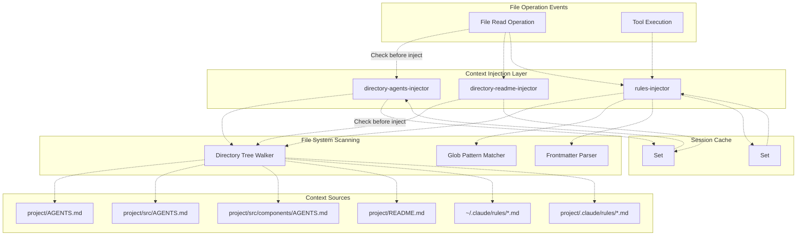
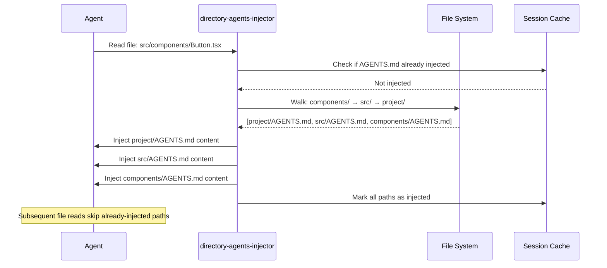
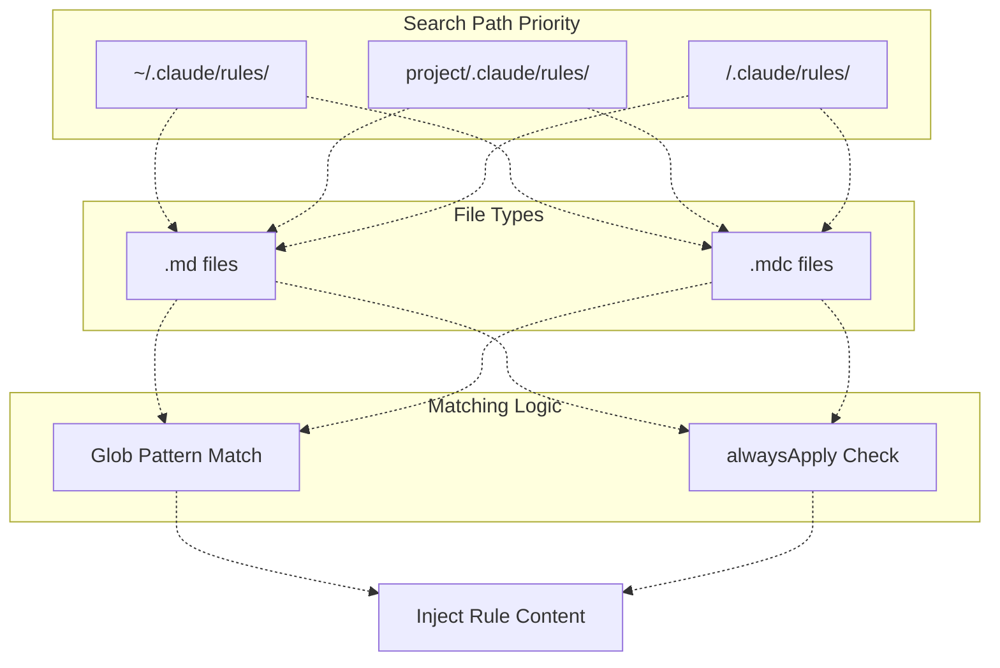

# 컨텍스트 주입 훅 (Context Injection Hooks)

> **관련 소스 파일**
> * [README.ja.md](https://github.com/code-yeongyu/oh-my-opencode/blob/b92cd6ab/README.ja.md)
> * [README.ko.md](https://github.com/code-yeongyu/oh-my-opencode/blob/b92cd6ab/README.ko.md)
> * [README.md](https://github.com/code-yeongyu/oh-my-opencode/blob/b92cd6ab/README.md)
> * [README.zh-cn.md](https://github.com/code-yeongyu/oh-my-opencode/blob/b92cd6ab/README.zh-cn.md)
> * [assets/oh-my-opencode.schema.json](https://github.com/code-yeongyu/oh-my-opencode/blob/b92cd6ab/assets/oh-my-opencode.schema.json)
> * [src/config/schema.ts](https://github.com/code-yeongyu/oh-my-opencode/blob/b92cd6ab/src/config/schema.ts)
> * [src/hooks/index.ts](https://github.com/code-yeongyu/oh-my-opencode/blob/b92cd6ab/src/hooks/index.ts)
> * [src/index.ts](https://github.com/code-yeongyu/oh-my-opencode/blob/b92cd6ab/src/index.ts)
> * [src/shared/config-path.ts](https://github.com/code-yeongyu/oh-my-opencode/blob/b92cd6ab/src/shared/config-path.ts)

이 문서는 프로젝트별 정보로 에이전트 컨텍스트를 자동으로 보강하는 컨텍스트 주입 훅(Context Injection Hooks)에 대해 설명합니다. 이 훅들은 에이전트가 파일과 상호작용할 때 관련 문서와 규칙을 주입하여, 수동으로 컨텍스트를 관리할 필요를 없애줍니다.

컨텍스트 창 관리 및 토큰 제한에 대한 정보는 [7.4 컨텍스트 관리 훅](/code-yeongyu/oh-my-opencode/7.4-context-management-hooks)을 참조하십시오. 일반적인 훅 설정에 대해서는 [7.7 기타 훅](/code-yeongyu/oh-my-opencode/7.7-other-hooks)을 참조하십시오.

---

## 목적 및 범위 (Purpose and Scope)

컨텍스트 주입 훅은 다음과 같은 기능을 통해 자동적이고 지능적인 컨텍스트 보강을 제공합니다:

* 디렉토리 트리를 탐색하여 계층적인 `AGENTS.md` 파일 수집
* `README.md` 파일에서 프로젝트 문서 주입
* 파일 패턴에 기반한 조건부 코딩 규칙 로드
* 세션 내 중복 작업을 방지하기 위해 주입된 컨텍스트 캐싱

이 훅들은 파일 읽기 작업 및 도구 실행 중에 투명하게 작동하며, 대화 기록을 어지럽히지 않으면서 에이전트가 항상 관련 컨텍스트 정보를 가질 수 있도록 보장합니다.

**출처:** [README.md L538-L568](https://github.com/code-yeongyu/oh-my-opencode/blob/b92cd6ab/README.md#L538-L568)

 [src/index.ts L254-L281](https://github.com/code-yeongyu/oh-my-opencode/blob/b92cd6ab/src/index.ts#L254-L281)

---

## 시스템 아키텍처 (System Architecture)



**다이어그램: 컨텍스트 주입 시스템 아키텍처**

시스템은 세 단계로 작동합니다:

1. **이벤트 감지 (Event Detection)**: 파일 읽기 작업 및 도구 실행이 주입 훅을 트리거합니다.
2. **컨텍스트 발견 (Context Discovery)**: 디렉토리 트리 탐색을 통해 관련 파일을 찾고, glob 매칭으로 규칙을 필터링합니다.
3. **세션 캐싱 (Session Caching)**: 주입된 컨텍스트를 추적하여 세션당 한 번만 주입되도록 보장합니다.

**출처:** [src/index.ts L254-L281](https://github.com/code-yeongyu/oh-my-opencode/blob/b92cd6ab/src/index.ts#L254-L281)

 [src/index.ts L558-L567](https://github.com/code-yeongyu/oh-my-opencode/blob/b92cd6ab/src/index.ts#L558-L567)

 [README.md L538-L568](https://github.com/code-yeongyu/oh-my-opencode/blob/b92cd6ab/README.md#L538-L568)

---

## 디렉토리 AGENTS.md 주입기 (Directory AGENTS.md Injector)

### 개요

`directory-agents-injector` 훅은 대상 파일에서 프로젝트 루트까지 디렉토리 트리를 탐색하며 경로상에 있는 모든 `AGENTS.md` 파일을 수집하여 계층적인 프로젝트 컨텍스트를 자동으로 주입합니다.

### 디렉토리 트리 탐색 전략

파일에 액세스할 때 주입기는 다음과 같이 동작합니다:

1. 파일의 부모 디렉토리에서 시작합니다.
2. 프로젝트 루트를 향해 상위로 탐색합니다.
3. 각 디렉토리에 있는 모든 `AGENTS.md` 파일을 수집합니다.
4. 프로젝트 루트(워크스페이스 디렉토리)에서 중단합니다.
5. 루트에서 리프(Root-to-leaf) 순서로 파일을 주입합니다 (프로젝트 전체 → 특정 디렉토리).

**계층 구조 예시:**

```markdown
project/
├── AGENTS.md              # 가장 먼저 주입됨 (프로젝트 전체)
├── src/
│   ├── AGENTS.md          # 두 번째로 주입됨 (src 전용)
│   └── components/
│       ├── AGENTS.md      # 세 번째로 주입됨 (컴포넌트 전용)
│       └── Button.tsx     # 대상 파일
```

에이전트가 `Button.tsx`를 읽을 때, 표시된 순서대로 세 개의 `AGENTS.md` 파일이 모두 주입됩니다.

**출처:** [README.md L538-L549](https://github.com/code-yeongyu/oh-my-opencode/blob/b92cd6ab/README.md#L538-L549)

### 주입 순서 및 콘텐츠 구조



**다이어그램: AGENTS.md 주입 시퀀스**

**출처:** [README.md L538-L549](https://github.com/code-yeongyu/oh-my-opencode/blob/b92cd6ab/README.md#L538-L549)

### 세션 레벨 캐싱

각 디렉토리의 `AGENTS.md`는 **세션당 한 번**만 주입됩니다. 이 훅은 주입된 파일 경로의 `Set<string>`을 유지하여 동일한 디렉토리의 여러 파일에 액세스할 때 발생하는 중복 주입을 방지합니다.

**캐싱 동작:**

| 첫 번째 파일 읽기 | 두 번째 파일 읽기 (동일 디렉토리) | 주입 결과 |
| --- | --- | --- |
| `src/utils/helper.ts` | `src/utils/formatter.ts` | `src/AGENTS.md`가 한 번만 주입됨 |
| `src/components/Button.tsx` | `src/hooks/useData.ts` | `src/AGENTS.md`가 이미 캐시되어 건너뜀 |

**출처:** [README.md L538-L549](https://github.com/code-yeongyu/oh-my-opencode/blob/b92cd6ab/README.md#L538-L549)

### 훅 설정

이 훅은 기본적으로 활성화되어 있으며 설정을 통해 비활성화할 수 있습니다:

```json
{
  "disabled_hooks": ["directory-agents-injector"]
}
```

**설정 참조:** [src/config/schema.ts L53](https://github.com/code-yeongyu/oh-my-opencode/blob/b92cd6ab/src/config/schema.ts#L53-L53)

 [src/index.ts L254-L256](https://github.com/code-yeongyu/oh-my-opencode/blob/b92cd6ab/src/index.ts#L254-L256)

**출처:** [src/index.ts L254-L256](https://github.com/code-yeongyu/oh-my-opencode/blob/b92cd6ab/src/index.ts#L254-L256)

 [src/config/schema.ts L45-L68](https://github.com/code-yeongyu/oh-my-opencode/blob/b92cd6ab/src/config/schema.ts#L45-L68)

---

## 디렉토리 README.md 주입기 (Directory README.md Injector)

### 개요

`directory-readme-injector` 훅은 AGENTS.md 주입기와 동일하게 작동하지만 `README.md` 파일을 대상으로 합니다. 이는 에이전트에게 프로젝트 및 모듈 레벨의 문서 컨텍스트를 제공합니다.

### 동작 및 계층 구조

주입은 동일한 디렉토리 트리 탐색 패턴을 따릅니다:

```markdown
project/
├── README.md              # 프로젝트 문서
├── src/
│   ├── README.md          # 소스 코드 문서
│   └── api/
│       ├── README.md      # API 모듈 문서
│       └── handler.ts     # 대상 파일
```

`handler.ts`에 액세스할 때, 세 개의 `README.md` 파일이 모두 루트에서 리프 순서로 주입됩니다.

**출처:** [README.md L538-L549](https://github.com/code-yeongyu/oh-my-opencode/blob/b92cd6ab/README.md#L538-L549)

### 일반적인 사용 사례

| README.md 위치 | 콘텐츠 목적 |
| --- | --- |
| 프로젝트 루트 | 프로젝트 개요, 설치 지침, 아키텍처 요약 |
| 모듈 디렉토리 | 모듈별 문서, API 규약, 예시 |
| 기능(Feature) 디렉토리 | 기능 설명, 구현 노트, 의존성 |

**출처:** [README.md L538-L549](https://github.com/code-yeongyu/oh-my-opencode/blob/b92cd6ab/README.md#L538-L549)

### 훅 설정

```json
{
  "disabled_hooks": ["directory-readme-injector"]
}
```

**설정 참조:** [src/config/schema.ts L54](https://github.com/code-yeongyu/oh-my-opencode/blob/b92cd6ab/src/config/schema.ts#L54-L54)

 [src/index.ts L257-L259](https://github.com/code-yeongyu/oh-my-opencode/blob/b92cd6ab/src/index.ts#L257-L259)

**출처:** [src/index.ts L257-L259](https://github.com/code-yeongyu/oh-my-opencode/blob/b92cd6ab/src/index.ts#L257-L259)

 [src/config/schema.ts L45-L68](https://github.com/code-yeongyu/oh-my-opencode/blob/b92cd6ab/src/config/schema.ts#L45-L68)

---

## 조건부 규칙 주입기 (Conditional Rules Injector)

### 개요

`rules-injector` 훅은 현재 파일 작업과 glob 패턴이 일치할 때 마크다운 파일에서 컨텍스트 인식 코딩 규칙을 로드합니다. 이를 통해 언어별, 디렉토리별 또는 파일 유형별 가이드라인을 자동으로 주입할 수 있습니다.

### 규칙 파일 형식

규칙은 YAML 프론트매터(frontmatter)가 포함된 마크다운 파일에 정의됩니다:

```typescript
---
globs: ["*.ts", "src/**/*.js"]
description: "TypeScript/JavaScript coding rules"
---
- 인터페이스 이름에는 PascalCase를 사용하십시오.
- 함수 이름에는 camelCase를 사용하십시오.
- let보다 const를 선호하십시오.
```

**프론트매터 필드:**

| 필드 | 타입 | 목적 |
| --- | --- | --- |
| `globs` | `string[]` | 파일 경로와 매칭할 Glob 패턴 |
| `description` | `string` | 사람이 읽을 수 있는 규칙 설명 |
| `alwaysApply` | `boolean` | `true`인 경우 파일 경로에 관계없이 주입 |

**출처:** [README.md L550-L564](https://github.com/code-yeongyu/oh-my-opencode/blob/b92cd6ab/README.md#L550-L564)

### 검색 경로 및 우선순위

주입기는 여러 위치에서 규칙을 검색합니다:



**다이어그램: 규칙 발견 및 매칭 흐름**

**디렉토리 탐색 전략:**

1. 파일의 디렉토리에서 시작합니다.
2. 프로젝트 루트까지 상위로 탐색합니다 (각 디렉토리의 `.claude/rules/` 확인).
3. `~/.claude/rules/`의 사용자 레벨 규칙을 포함합니다.
4. 각 규칙 파일을 현재 파일 경로와 매칭합니다.
5. 매칭된 규칙을 주입합니다 (세션당 한 번).

**출처:** [README.md L550-L564](https://github.com/code-yeongyu/oh-my-opencode/blob/b92cd6ab/README.md#L550-L564)

### Glob 패턴 예시

| Glob 패턴 | 매칭 대상 | 사용 사례 |
| --- | --- | --- |
| `*.ts` | 모든 TypeScript 파일 | TypeScript 전용 규칙 |
| `src/**/*.test.ts` | src/ 내의 테스트 파일 | 테스트 컨벤션 |
| `**/*.tsx` | React 컴포넌트 | React/JSX 가이드라인 |
| `api/**/*` | API 디렉토리 파일 | API 설계 규칙 |

**출처:** [README.md L550-L564](https://github.com/code-yeongyu/oh-my-opencode/blob/b92cd6ab/README.md#L550-L564)

### alwaysApply 플래그

`alwaysApply: true` 설정이 된 규칙은 경로에 관계없이 모든 파일 작업에 대해 주입됩니다:

```yaml
---
alwaysApply: true
description: "Universal coding standards"
---
- 명확한 커밋 메시지를 작성하십시오.
- 함수를 50라인 이하로 유지하십시오.
- 공개 API를 문서화하십시오.
```

이는 보편적으로 적용되는 프로젝트 전반의 컨벤션에 유용합니다.

**출처:** [README.md L550-L564](https://github.com/code-yeongyu/oh-my-opencode/blob/b92cd6ab/README.md#L550-L564)

### 세션 캐싱

다른 컨텍스트 주입기와 마찬가지로, 규칙 주입기는 주입된 규칙 파일의 `Set<string>`을 유지하여 세션 내 중복 주입을 방지합니다.

**출처:** [README.md L550-L564](https://github.com/code-yeongyu/oh-my-opencode/blob/b92cd6ab/README.md#L550-L564)

### 훅 설정

```json
{
  "disabled_hooks": ["rules-injector"]
}
```

**설정 참조:** [src/config/schema.ts L58](https://github.com/code-yeongyu/oh-my-opencode/blob/b92cd6ab/src/config/schema.ts#L58-L58)

 [src/index.ts L278-L280](https://github.com/code-yeongyu/oh-my-opencode/blob/b92cd6ab/src/index.ts#L278-L280)

**출처:** [src/index.ts L278-L280](https://github.com/code-yeongyu/oh-my-opencode/blob/b92cd6ab/src/index.ts#L278-L280)

 [src/config/schema.ts L45-L68](https://github.com/code-yeongyu/oh-my-opencode/blob/b92cd6ab/src/config/schema.ts#L45-L68)

---

## 구현 세부 사항 (Implementation Details)

### 훅 등록

세 가지 컨텍스트 주입 훅은 모두 플러그인 초기화 단계에서 등록됩니다:

```javascript
// src/index.ts:254-280
const directoryAgentsInjector = isHookEnabled("directory-agents-injector")
  ? createDirectoryAgentsInjectorHook(ctx)
  : null;
const directoryReadmeInjector = isHookEnabled("directory-readme-injector")
  ? createDirectoryReadmeInjectorHook(ctx)
  : null;
const rulesInjector = isHookEnabled("rules-injector")
  ? createRulesInjectorHook(ctx)
  : null;
```

**출처:** [src/index.ts L254-L280](https://github.com/code-yeongyu/oh-my-opencode/blob/b92cd6ab/src/index.ts#L254-L280)

### 이벤트 핸들러 통합

훅은 플러그인의 이벤트 핸들러를 통해 세션 이벤트에 응답합니다:

```javascript
// src/index.ts:558-567
event: async (input) => {
  // ... 기타 훅
  await directoryAgentsInjector?.event(input);
  await directoryReadmeInjector?.event(input);
  await rulesInjector?.event(input);
  // ... 추가 훅
}
```

이를 통해 에이전트의 명시적인 요청 없이도 파일 작업 중에 컨텍스트 주입이 자동으로 발생합니다.

**출처:** [src/index.ts L558-~567](https://github.com/code-yeongyu/oh-my-opencode/blob/b92cd6ab/src/index.ts#L558-L567)

### 설정 스키마

훅 이름은 설정 스키마에 정의되어 있습니다:

```javascript
// src/config/schema.ts:45-68
export const HookNameSchema = z.enum([
  // ...
  "directory-agents-injector",
  "directory-readme-injector",
  // ...
  "rules-injector",
  // ...
])
```

**출처:** [src/config/schema.ts L45-L68](https://github.com/code-yeongyu/oh-my-opencode/blob/b92cd6ab/src/config/schema.ts#L45-L68)

### 훅 팩토리 함수

각 훅은 플러그인 컨텍스트를 인자로 받는 팩토리 함수에 의해 생성됩니다:

| 함수 | 반환값 | 목적 |
| --- | --- | --- |
| `createDirectoryAgentsInjectorHook(ctx)` | 훅 인스턴스 | AGENTS.md 주입 로직 |
| `createDirectoryReadmeInjectorHook(ctx)` | 훅 인스턴스 | README.md 주입 로직 |
| `createRulesInjectorHook(ctx)` | 훅 인스턴스 | 조건부 규칙 주입 로직 |

**출처:** [src/hooks/index.ts L7-L8](https://github.com/code-yeongyu/oh-my-opencode/blob/b92cd6ab/src/hooks/index.ts#L7-L8)

 [src/hooks/index.ts L15](https://github.com/code-yeongyu/oh-my-opencode/blob/b92cd6ab/src/hooks/index.ts#L15-L15)

---

## 다른 훅과의 상호작용 (Interaction with Other Hooks)

### 컨텍스트 관리 훅

컨텍스트 주입 훅은 [7.4 컨텍스트 관리 훅](/code-yeongyu/oh-my-opencode/7.4-context-management-hooks)과 협력하여 작동합니다:

* **도구 출력 절단기 (Tool Output Truncator)**: 컨텍스트 창이 가득 차면 주입된 콘텐츠를 잘라낼 수 있습니다.
* **선제적 압축 (Preemptive Compaction)**: [Compaction Context Injector](https://github.com/code-yeongyu/oh-my-opencode/blob/b92cd6ab/Compaction Context Injector)를 통해 요약 과정 중에도 주입된 컨텍스트를 보존합니다.

**출처:** [src/index.ts L272-L277](https://github.com/code-yeongyu/oh-my-opencode/blob/b92cd6ab/src/index.ts#L272-L277)

### 신뢰성 훅

컨텍스트 주입 시스템은 다음을 보완합니다:

* **세션 복구 (Session Recovery)** ([7.1](/code-yeongyu/oh-my-opencode/7.1-session-recovery)): 복구 후 주입된 컨텍스트가 재설정됩니다.
* **할 일 연속성 강제 도구 (Todo Continuation Enforcer)** ([7.3](/code-yeongyu/oh-my-opencode/7.3-todo-continuation-enforcer)): 다단계 작업 전반에 걸쳐 컨텍스트를 유지합니다.

**출처:** [src/index.ts L238-L321](https://github.com/code-yeongyu/oh-my-opencode/blob/b92cd6ab/src/index.ts#L238-L321)

---

## 권장 사항 (Best Practices)

### AGENTS.md 구성

**권장 구조:**

```javascript
project/
├── AGENTS.md                  # 프로젝트 비전, 상위 수준 아키텍처
├── src/
│   ├── AGENTS.md              # 코드 구성, 모듈 경계
│   ├── features/
│   │   └── auth/
│   │       ├── AGENTS.md      # 인증 전용 패턴, 보안 규칙
│   │       └── login.ts
│   └── utils/
│       ├── AGENTS.md          # 유틸리티 컨벤션, 순수 함수 규칙
│       └── format.ts
```

**콘텐츠 가이드라인:**

* **프로젝트 루트**: 비전, 컨벤션, 설정 요구 사항
* **모듈 레벨**: 모듈의 책임, 의존성, 인터페이스
* **기능 레벨**: 기능별 패턴, 주의 사항, 예시

### 규칙 파일 구성

**권장 명명 규칙:**

```markdown
~/.claude/rules/
├── typescript.md              # 언어별 규칙
├── testing.md                 # 테스트 컨벤션
├── api-design.md              # API 가이드라인
└── security.md                # 보안 요구 사항 (alwaysApply: true)
```

**Glob 패턴 팁:**

* 재귀적 매칭을 위해 `**/*`를 사용하십시오.
* 과도한 매칭을 피하기 위해 파일 확장자를 구체적으로 지정하십시오.
* 배포 전에 실제 파일 경로로 패턴을 테스트하십시오.

### 성능 고려 사항

* **디렉토리 깊이**: 계층이 너무 깊어지면 탐색 시간이 증가할 수 있습니다.
* **파일 수**: 규칙 파일을 최소화하십시오 (가능한 경우 통합).
* **세션 캐싱**: 캐시된 디렉토리에서의 후속 파일 작업은 오버헤드가 거의 없습니다.

**출처:** [README.md L538-L568](https://github.com/code-yeongyu/oh-my-opencode/blob/b92cd6ab/README.md#L538-L568)

---

## 설정 참조 (Configuration Reference)

### 특정 주입기 비활성화

다른 훅은 활성 상태로 유지하면서 개별 훅만 비활성화할 수 있습니다:

```json
{
  "disabled_hooks": [
    "directory-readme-injector"
  ]
}
```

이 설정은 README.md 주입은 비활성화하지만 AGENTS.md와 규칙 주입은 활성 상태로 유지합니다.

### 모든 컨텍스트 주입 비활성화

최소한의 컨텍스트 주입을 위해 세 가지 훅을 모두 비활성화합니다:

```json
{
  "disabled_hooks": [
    "directory-agents-injector",
    "directory-readme-injector",
    "rules-injector"
  ]
}
```

**출처:** [src/config/schema.ts L45-L68](https://github.com/code-yeongyu/oh-my-opencode/blob/b92cd6ab/src/config/schema.ts#L45-L68)

 [src/index.ts L221-L222](https://github.com/code-yeongyu/oh-my-opencode/blob/b92cd6ab/src/index.ts#L221-L222)

---

## 요약

컨텍스트 주입 훅은 수동 개입 없이 자동화된 계층적 컨텍스트 보강을 제공합니다:

* **AGENTS.md 주입기**: 프로젝트 전체 → 디렉토리별 가이드 제공
* **README.md 주입기**: 모든 레벨에서의 문서화 지원
* **규칙 주입기**: 조건부, 파일 유형별 코딩 규칙 적용

세 가지 훅 모두 세션 레벨 캐싱을 통해 투명하게 작동하여 오버헤드를 최소화하는 동시에 에이전트가 항상 관련 컨텍스트 정보를 보유하도록 보장합니다.

**출처:** [README.md L538-L568](https://github.com/code-yeongyu/oh-my-opencode/blob/b92cd6ab/README.md#L538-L568)

 [src/index.ts L254-L280](https://github.com/code-yeongyu/oh-my-opencode/blob/b92cd6ab/src/index.ts#L254-L280)

 [src/index.ts L558-L567](https://github.com/code-yeongyu/oh-my-opencode/blob/b92cd6ab/src/index.ts#L558-L567)