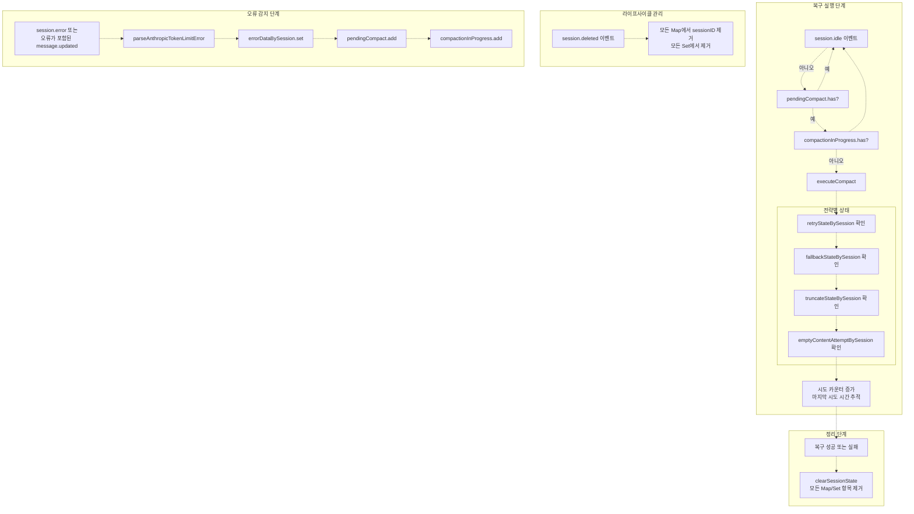

# 컨텍스트 관리 훅 (Context Management Hooks)

> **관련 소스 파일**
> * [README.ja.md](https://github.com/code-yeongyu/oh-my-opencode/blob/b92cd6ab/README.ja.md)
> * [README.ko.md](https://github.com/code-yeongyu/oh-my-opencode/blob/b92cd6ab/README.ko.md)
> * [README.md](https://github.com/code-yeongyu/oh-my-opencode/blob/b92cd6ab/README.md)
> * [README.zh-cn.md](https://github.com/code-yeongyu/oh-my-opencode/blob/b92cd6ab/README.zh-cn.md)
> * [assets/oh-my-opencode.schema.json](https://github.com/code-yeongyu/oh-my-opencode/blob/b92cd6ab/assets/oh-my-opencode.schema.json)
> * [src/config/schema.ts](https://github.com/code-yeongyu/oh-my-opencode/blob/b92cd6ab/src/config/schema.ts)
> * [src/hooks/index.ts](https://github.com/code-yeongyu/oh-my-opencode/blob/b92cd6ab/src/hooks/index.ts)
> * [src/index.ts](https://github.com/code-yeongyu/oh-my-opencode/blob/b92cd6ab/src/index.ts)
> * [src/shared/config-path.ts](https://github.com/code-yeongyu/oh-my-opencode/blob/b92cd6ab/src/shared/config-path.ts)

## 목적 및 범위 (Purpose and Scope)

컨텍스트 관리 훅(Context Management Hooks)은 LLM 대화 컨텍스트 내의 토큰 소비를 모니터링하고 관리하여 컨텍스트 윈도우(Context Window) 오버플로우를 방지하고, 토큰 제한 오류로부터 유연한 복구를 가능하게 합니다. 이 시스템은 다음과 같이 조정된 세 가지 메커니즘을 구현합니다:

1. **컨텍스트 윈도우 모니터 (Context Window Monitor)**: 토큰 사용량을 추적하고 에이전트에게 선제적인 경고를 제공합니다.
2. **선제적 압축 (Preemptive Compaction)**: 컨텍스트 용량의 80%에 도달하면 트리거되어 요약(Summarization)을 유도합니다.
3. **Anthropic 자동 압축 (Anthropic Auto-Compact)**: 트런케이션(Truncation, 자르기), 되돌리기(Reversion), 요약을 통해 토큰 제한 오류로부터 자동으로 복구합니다.

이 훅들은 [Context Window Anxiety Management](https://agentic-patterns.com/patterns/context-window-anxiety-management/) 패턴을 구현하여, 실제 제한에 도달했을 때 원활한 복구를 가능하게 함과 동시에 조기 컨텍스트 패닉을 방지합니다.

문서 주입을 통한 컨텍스트 강화에 대한 정보는 [Context Injection Hooks](/code-yeongyu/oh-my-opencode/7.4-context-management-hooks)를 참조하십시오. 도구 출력 트런케이션에 대해서는 [Tool Enhancement Hooks](/code-yeongyu/oh-my-opencode/7.3-todo-continuation-enforcer)를 참조하십시오.

**출처:** [README.md L688-L693](https://github.com/code-yeongyu/oh-my-opencode/blob/b92cd6ab/README.md#L688-L693)

 [src/hooks/anthropic-auto-compact/index.ts L1-L154](https://github.com/code-yeongyu/oh-my-opencode/blob/b92cd6ab/src/hooks/anthropic-auto-compact/index.ts#L1-L154)

## 훅 등록 및 초기화 (Hook Registry and Initialization)

세 가지 컨텍스트 관리 훅은 `disabled_hooks` 설정 배열에 따라 조건부로 초기화됩니다:

| 훅 이름 | 생성 함수 | 설정 키 | 기본 상태 | 라이프사이클 이벤트 |
| --- | --- | --- | --- | --- |
| Context Window Monitor | `createContextWindowMonitorHook` | `context-window-monitor` | 활성화됨 | `message.updated` |
| Preemptive Compaction | *(Monitor와 통합됨)* | *(동일)* | 활성화됨 | `message.updated` |
| Anthropic Auto-Compact | `createAnthropicAutoCompactHook` | `anthropic-auto-compact` | 활성화됨 | `session.error`, `message.updated`, `session.idle` |

Anthropic Auto-Compact 훅은 공격적인 트런케이션 동작을 위한 `experimental` 설정 객체를 허용합니다:

```javascript
const anthropicAutoCompact = isHookEnabled("anthropic-auto-compact")
  ? createAnthropicAutoCompactHook(ctx, { 
      experimental: config.experimental 
    })
  : null;
```

**출처:** [src/hooks/anthropic-auto-compact/index.ts L24-L149](https://github.com/code-yeongyu/oh-my-opencode/blob/b92cd6ab/src/hooks/anthropic-auto-compact/index.ts#L24-L149)

 [src/hooks/anthropic-auto-compact/types.ts L1-L54](https://github.com/code-yeongyu/oh-my-opencode/blob/b92cd6ab/src/hooks/anthropic-auto-compact/types.ts#L1-L54)

## 컨텍스트 관리 파이프라인 (Context Management Pipeline)

### 이벤트 기반 모니터링 및 복구 흐름


**주요 특징:**

* **선제적 (Proactive)**: 컨텍스트 윈도우 모니터가 문제가 발생하기 전에 방지합니다.
* **반응적 (Reactive)**: Auto-Compact가 실제 발생한 오류로부터 자동으로 복구합니다.
* **계단식 (Cascading)**: 여러 폴백(Fallback) 전략을 통해 복구 성공을 보장합니다.

**출처:** [src/hooks/anthropic-auto-compact/index.ts L28-L143](https://github.com/code-yeongyu/oh-my-opencode/blob/b92cd6ab/src/hooks/anthropic-auto-compact/index.ts#L28-L143)

 [src/hooks/anthropic-auto-compact/executor.ts L249-L397](https://github.com/code-yeongyu/oh-my-opencode/blob/b92cd6ab/src/hooks/anthropic-auto-compact/executor.ts#L249-L397)

## 컨텍스트 윈도우 모니터 (Context Window Monitor)

### 개요

컨텍스트 윈도우 모니터는 실시간으로 토큰 소비를 추적하고, 용량 제한에 도달할 때 에이전트에게 선제적인 경고를 제공합니다. 이는 에이전트가 공간 제약을 인식하여 조기에 요약하거나 작업을 중단하는 "컨텍스트 윈도우 불안감(context window anxiety)"을 방지합니다.

### 토큰 추적 메커니즘

모니터는 `message.updated` 이벤트를 관찰하고 메시지 콘텐츠를 기반으로 대략적인 토큰 사용량을 계산합니다. 사용량이 특정 임계값을 넘으면 대화에 경고나 프롬프트를 주입합니다.


### 경고 임계값 (Warning Thresholds)

| 임계값 | 액션 | 목적 |
| --- | --- | --- |
| **70%** | 안심 토스트 표시 | 조기 불안감 방지 |
| **80%** | 경고 표시 + 프롬프트 주입 | 선제적 요약 유도 |
| **100%** | 오류 → Auto-Compact 트리거 | 자동 복구 |

### 세션 상태 관리

모니터는 경고 스팸을 방지하기 위해 세션별 상태를 유지합니다:

```yaml
interface ContextMonitorState {
  warningIssued: Map<string, number>  // sessionID -> 경고가 발생한 최고 임계값
  lastTokenCount: Map<string, number> // sessionID -> 마지막으로 계산된 토큰 수
}
```

경고는 세션당 임계값별로 한 번만 발행됩니다.

**출처:** [README.md L688-L690](https://github.com/code-yeongyu/oh-my-opencode/blob/b92cd6ab/README.md#L688-L690)

 [README.ko.md L625-L626](https://github.com/code-yeongyu/oh-my-opencode/blob/b92cd6ab/README.ko.md#L625-L626)

## 선제적 압축 (Preemptive Compaction)

### 개요

선제적 압축은 컨텍스트 윈도우 모니터와 통합되어 있으며 토큰 임계값 80%에서 활성화됩니다. 반응적 복구와 달리, 이 메커니즘은 오류가 발생하기 전에 에이전트가 컨텍스트를 요약하거나 압축하도록 선제적으로 권장합니다.

### 트리거 로직


### 주입 전략

80% 임계값을 넘으면 모니터는 시스템 메시지를 주입합니다:

```
High context usage detected (>80%). Consider summarizing recent tool outputs 
or delegating subtasks to background agents to free up context space.
```
(높은 컨텍스트 사용량이 감지되었습니다(>80%). 컨텍스트 공간을 확보하기 위해 최근 도구 출력을 요약하거나 하위 작업을 백그라운드 에이전트에게 위임하는 것을 고려해 보십시오.)

이 프롬프트는:

* 대화에서 시스템 레벨 메시지로 나타납니다.
* 구체적인 액션(요약, 위임)을 제안합니다.
* 압축을 강제하지 않고 에이전트의 재량에 맡깁니다.
* 세션당 80% 임계값에서 단 한 번만 트리거됩니다.

### 동작 특성

| 측면 | 동작 |
| --- | --- |
| **트리거 임계값** | 최대 컨텍스트 토큰의 80% |
| **액션 유형** | 시스템 메시지 주입 |
| **빈도** | 임계값당 세션별 1회 |
| **에이전트 영향** | 제안 사항이며 강제성 없음 |
| **조정** | 완전한 커버리지를 위해 Auto-Compact와 함께 작동 |

**출처:** [README.md L688-L690](https://github.com/code-yeongyu/oh-my-opencode/blob/b92cd6ab/README.md#L688-L690)

 [README.ko.md L625-L626](https://github.com/code-yeongyu/oh-my-opencode/blob/b92cd6ab/README.ko.md#L625-L626)

## Anthropic 자동 압축 (Anthropic Auto-Compact)

### 개요

Anthropic Auto-Compact는 Anthropic(Claude) 모델의 토큰 제한 오류를 자동으로 처리하는 반응적 복구 시스템입니다. 세션이 컨텍스트 제한에 도달하면, 이 훅은 사용자 개입 없이 다중 전략 복구 파이프라인을 실행합니다.

### 오류 감지 및 파싱


### 지원되는 오류 유형

| 오류 유형 | 트리거 패턴 | 복구 전략 |
| --- | --- | --- |
| `token_limit_exceeded` | "X tokens > Y maximum" | 트런케이션 → 되돌리기 → 요약 |
| `non-empty content` | "messages[N]: non-empty content" | 빈 메시지 수정 → 재시도 |
| `bedrock_input_too_long` | Bedrock 전용 오류 | 공격적 트런케이션 |
| `context_length_exceeded` | 일반적인 OpenAI 스타일 오류 | 표준 파이프라인 |

**출처:** [src/hooks/anthropic-auto-compact/parser.ts L1-L183](https://github.com/code-yeongyu/oh-my-opencode/blob/b92cd6ab/src/hooks/anthropic-auto-compact/parser.ts#L1-L183)

 [src/hooks/anthropic-auto-compact/types.ts L1-L10](https://github.com/code-yeongyu/oh-my-opencode/blob/b92cd6ab/src/hooks/anthropic-auto-compact/types.ts#L1-L10)

### 복구 파이프라인 아키텍처


**파이프라인 특성:**

* **계단식 폴백 (Cascading Fallbacks)**: 각 전략은 점진적으로 더 큰 영향을 미칩니다.
* **상태 추적**: 무한 루프를 방지하기 위해 시도 횟수를 카운트합니다.
* **자동 재시도**: 성공적인 복구 후 프롬프트를 자동으로 다시 실행합니다.

**출처:** [src/hooks/anthropic-auto-compact/executor.ts L249-L397](https://github.com/code-yeongyu/oh-my-opencode/blob/b92cdProp/executor.ts#L249-L397)

 [src/hooks/anthropic-auto-compact/index.ts L107-L143](https://github.com/code-yeongyu/oh-my-opencode/blob/b92cd6ab/src/hooks/anthropic-auto-compact/index.ts#L107-L143)

### 전략 1: 공격적 트런케이션 (실험적)

공격적 트런케이션은 목표 토큰 감소량을 달성하기 위해 여러 도구 출력을 동시에 제거합니다. 이는 대규모 출력이 많이 존재할 때 가장 효율적인 전략입니다.

#### 설정

```json
{
  "experimental": {
    "aggressive_truncation": true
  }
}
```

#### 알고리즘

```
// 목표: 최대 토큰의 50% (TRUNCATE_CONFIG.targetTokenRatio를 통해 설정 가능)
targetTokens = maxTokens * 0.5
tokensToReduce = currentTokens - targetTokens
bytesToReduce = tokensToReduce * 4  // 토큰당 4자로 가정

// 출력 크기순으로 정렬된 모든 도구 결과 찾기 (큰 것부터)
results = findToolResultsBySize(sessionID)

// 목표에 도달할 때까지 반복적으로 트런케이션
for (result of results) {
  if (totalBytesRemoved >= bytesToReduce) break
  truncateToolResult(result.partPath)
  totalBytesRemoved += result.outputSize
}
```

#### 트런케이션 설정 상수

| 상수 | 값 | 설명 |
| --- | --- | --- |
| `maxTruncateAttempts` | 20 | 복구당 트런케이션할 최대 출력 수 |
| `targetTokenRatio` | 0.5 | 트런케이션 후 목표 토큰 비율 (50%) |
| `charsPerToken` | 4 | 토큰당 추정 문자 수 |
| `minOutputSizeToTruncate` | 500 | 작은 출력은 무시 |

**출처:** [src/hooks/anthropic-auto-compact/executor.ts L264-L340](https://github.com/code-yeongyu/oh-my-opencode/blob/b92cd6ab/src/hooks/anthropic-auto-compact/executor.ts#L264-L340)

 [src/hooks/anthropic-auto-compact/types.ts L48-L53](https://github.com/code-yeongyu/oh-my-opencode/blob/b92cd6ab/src/hooks/anthropic-auto-compact/types.ts#L48-L53)

 [src/hooks/anthropic-auto-compact/storage.ts L195-L257](https://github.com/code-yeongyu/oh-my-opencode/blob/b92cd6ab/src/hooks/anthropic-auto-compact/storage.ts#L195-L257)

### 전략 2: 단일 출력 트런케이션

공격적 트런케이션이 비활성화되어 있거나 불충분한 경우, 시스템은 가장 큰 단일 도구 출력을 트런케이션합니다.

#### 저장 구조

도구 출력은 OpenCode 저장소 디렉토리에 저장됩니다:

```
~/.local/share/opencode/storage/
├── message/
│   └── {sessionID}/
│       └── {messageID}.json
└── part/
    └── {messageID}/
        └── {partID}.json  ← 도구 결과가 여기에 저장됨
```

각 파트(part) 파일은 다음을 포함합니다:

```yaml
interface StoredToolPart {
  id: string
  sessionID: string
  messageID: string
  type: "tool"
  callID: string
  tool: string
  state: {
    status: "completed"
    input: Record<string, unknown>
    output: string  ← 원본 출력
    time: { start: number, end?: number, compacted?: number }
  }
  truncated?: boolean       ← 트런케이션 후 true로 설정
  originalSize?: number     ← 참조를 위해 저장된 원본 크기
}
```

#### 트런케이션 프로세스


#### 트런케이션 메시지

```
[TOOL RESULT TRUNCATED - Context limit exceeded. Original output was too large 
and has been truncated to recover the session. Please re-run this tool if you 
need the full output.]
```

**출처:** [src/hooks/anthropic-auto-compact/storage.ts L85-L154](https://github.com/code-yeongyu/oh-my-opencode/blob/b92cd6ab/src/hooks/anthropic-auto-compact/storage.ts#L85-L154)

 [src/hooks/anthropic-auto-compact/executor.ts L342-L367](https://github.com/code-yeongyu/oh-my-opencode/blob/b92cd6ab/src/hooks/anthropic-auto-compact/executor.ts#L342-L367)

### 전략 3: 빈 메시지 복구

"non-empty content" 오류는 대화 히스토리의 메시지에 콘텐츠가 없을 때 발생하며, 이는 API 요구 사항 위반입니다. 이 전략은 플레이스홀더 텍스트를 주입하여 빈 메시지를 수정합니다.

#### 감지

```javascript
// 오류 메시지 예시:
// "messages[12]: non-empty content"

const messageIndex = extractMessageIndex(errorMessage)  // 결과: 12
const emptyMessageId = findEmptyMessageByIndex(sessionID, messageIndex)
```

#### 수정 방법

| 방법 | 함수 | 동작 |
| --- | --- | --- |
| **교체 (Replace)** | `replaceEmptyTextParts` | 기존의 빈 텍스트 파트를 교체 |
| **주입 (Inject)** | `injectTextPart` | 파트가 없는 경우 새로운 텍스트 파트 추가 |

두 방법 모두 플레이스홀더 `"[user interrupted]"`를 주입합니다.

#### 복구 흐름


**출처:** [src/hooks/anthropic-auto-compact/executor.ts L173-L247](https://github.com/code-yeongyu/oh-my-opencode/blob/b92cd6ab/src/hooks/anthropic-auto-compact/executor.ts#L173-L247)

 [src/hooks/anthropic-auto-compact/parser.ts L45-L51](https://github.com/code-yeongyu/oh-my-opencode/blob/b92cd6ab/src/hooks/anthropic-auto-compact/parser.ts#L45-L51)

### 전략 4: 메시지 되돌리기 (Message Reversion)

트런케이션 전략이 실패하면, 시스템은 컨텍스트 크기를 줄이기 위해 마지막 어시스턴트 메시지를 되돌립니다(삭제합니다).

#### 되돌리기 로직

```javascript
// 마지막 사용자 + 어시스턴트 메시지 쌍 가져오기
const { userMessageID, assistantMessageID } = await getLastMessagePair(sessionID, client, directory)

// 어시스턴트 응답 되돌리기
await client.session.revert({
  path: { id: sessionID },
  body: { messageID: userMessageID },  // 이 메시지 시점으로 되돌림
  query: { directory }
})
```

#### 되돌리기 제한

| 설정 | 값 | 목적 |
| --- | --- | --- |
| `maxRevertAttempts` | 3 | 과도한 메시지 삭제 방지 |
| `minMessagesRequired` | 2 | 대화에 최소한의 콘텐츠 유지 보장 |

#### 상태 추적

```yaml
interface FallbackState {
  revertAttempt: number
  lastRevertedMessageID?: string  // 되돌린 메시지 추적
}
```

전체 대화가 삭제되는 것을 방지하기 위해 세션당 3회 시도 후 되돌리기를 중단합니다.

**출처:** [src/hooks/anthropic-auto-compact/executor.ts L75-L120](https://github.com/code-yeongyu/oh-my-opencode/blob/b92cd6ab/src/hooks/anthropic-auto-compact/executor.ts#L75-L120)

 [src/hooks/anthropic-auto-compact/types.ts L16-L19](https://github.com/code-yeongyu/oh-my-opencode/blob/b92cd6ab/src/hooks/anthropic-auto-compact/types.ts#L16-L19)

 [src/hooks/anthropic-auto-compact/types.ts L43-L46](https://github.com/code-yeongyu/oh-my-opencode/blob/b92cd6ab/src/hooks/anthropic-auto-compact/types.ts#L43-L46)

### 전략 5: 요약 (Summarization)

요약은 최종 폴백 전략입니다. OpenCode의 내장 요약 API를 사용하여 전체 대화 히스토리를 짧은 형태로 압축합니다.

#### 요약 요청

```yaml
await client.session.summarize({
  path: { id: sessionID },
  body: { 
    providerID: "anthropic",  // 마지막 어시스턴트 메시지에서 가져옴
    modelID: "claude-opus-4-5"
  },
  query: { directory }
})
```

#### 동작

* **모델 선택**: 대화와 동일한 모델을 사용합니다 (컨텍스트 품질 유지).
* **자동 재시도**: 요약 후 훅이 자동으로 다시 프롬프트를 실행합니다.
* **상태 보존**: 요약된 상태에서 세션이 원활하게 계속됩니다.
* **최후의 수단**: 다른 모든 전략이 소진된 후에만 실행됩니다.

**출처:** [src/hooks/anthropic-auto-compact/executor.ts L369-L395](https://github.com/code-yeongyu/oh-my-opencode/blob/b92cd6ab/src/hooks/anthropic-auto-compact/executor.ts#L369-L395)

### 재시도 및 백오프 메커니즘 (Retry and Backoff)

성공적인 복구 후, 시스템은 오류를 일으켰던 원래 프롬프트를 자동으로 재시도합니다.

#### 재시도 상태

```yaml
interface RetryState {
  attempt: number           // 현재 재시도 횟수
  lastAttemptTime: number   // 마지막 재시도 타임스탬프
}
```

#### 재시도 설정

| 상수 | 값 | 목적 |
| --- | --- | --- |
| `maxAttempts` | 2 | 실패 전 최대 재시도 횟수 |
| `initialDelayMs` | 2000 | 첫 재시도 전 초기 지연 시간 |
| `backoffFactor` | 2 | 지수 백오프 배수 |
| `maxDelayMs` | 30000 | 최대 지연 시간 상한 |

#### 백오프 계산

```javascript
const delay = Math.min(
  initialDelayMs * Math.pow(backoffFactor, attempt),
  maxDelayMs
)

// 시도 0: 2000ms
// 시도 1: 4000ms
// 시도 2: 8000ms (maxDelayMs에서 캡핑됨)
```

#### 자동 재시도 실행


**출처:** [src/hooks/anthropic-auto-compact/executor.ts L249-L397](https://github.com/code-yeongyu/oh-my-opencode/blob/b92cd6ab/src/hooks/anthropic-auto-compact/executor.ts#L249-L397)

 [src/hooks/anthropic-auto-compact/types.ts L11-L14](https://github.com/code-yeongyu/oh-my-opencode/blob/b92cd6ab/src/hooks/anthropic-auto-compact/types.ts#L11-L14)

 [src/hooks/anthropic-auto-compact/types.ts L36-L41](https://github.com/code-yeongyu/oh-my-opencode/blob/b92cd6ab/src/hooks/anthropic-auto-compact/types.ts#L36-L41)

## 세션 상태 관리 (Session State Management)

### 자동 압축 상태 구조

Anthropic Auto-Compact 훅은 복구 전략을 조정하고 무한 루프를 방지하기 위해 세션별로 포괄적인 상태를 유지합니다:

```yaml
interface AutoCompactState {
  pendingCompact: Set<string>                              // 복구 대기 중인 세션
  errorDataBySession: Map<string, ParsedTokenLimitError>   // 파싱된 오류 상세 정보
  retryStateBySession: Map<string, RetryState>             // 재시도 횟수 추적
  fallbackStateBySession: Map<string, FallbackState>       // 되돌리기 추적
  truncateStateBySession: Map<string, TruncateState>       // 트런케이션 추적
  emptyContentAttemptBySession: Map<string, number>        // 빈 메시지 수정 추적
  compactionInProgress: Set<string>                        // 동시 복구 방지
}
```

### 상태 조정 다이어그램



### 복구 시도별 상태 라이프사이클

| 상태 Map | 목적 | 삭제 시점 | 최대값 |
| --- | --- | --- | --- |
| `pendingCompact` | 복구가 필요한 세션 플래그 | 복구 성공 후 | 해당 없음 (Set) |
| `errorDataBySession` | 파싱된 오류 상세 정보 저장 | 복구 성공 후 | 해당 없음 |
| `retryStateBySession` | 재시도 횟수 추적 | 최대 재시도 후 | `maxAttempts: 2` |
| `fallbackStateBySession` | 되돌리기 횟수 추적 | 최대 되돌리기 후 | `maxRevertAttempts: 3` |
| `truncateStateBySession` | 트런케이션 횟수 추적 | 최대 트런케이션 후 | `maxTruncateAttempts: 20` |
| `emptyContentAttemptBySession` | 빈 메시지 수정 추적 | 수정 성공 후 | 무제한 |
| `compactionInProgress` | 동시 실행 방지 | 실행 완료 후 | 해당 없음 (Set) |

### 정리 및 메모리 관리

훅은 메모리 누수를 방지하기 위해 `session.deleted` 이벤트를 수신합니다:

```javascript
if (event.type === "session.deleted") {
  const sessionID = props?.info?.id
  if (sessionID) {
    autoCompactState.pendingCompact.delete(sessionID)
    autoCompactState.errorDataBySession.delete(sessionID)
    autoCompactState.retryStateBySession.delete(sessionID)
    autoCompactState.fallbackStateBySession.delete(sessionID)
    autoCompactState.truncateStateBySession.delete(sessionID)
    autoCompactState.emptyContentAttemptBySession.delete(sessionID)
    autoCompactState.compactionInProgress.delete(sessionID)
  }
}
```

**출처:** [src/hooks/anthropic-auto-compact/types.ts L26-L34](https://github.com/code-yeongyu/oh-my-opencode/blob/b92cd6ab/src/hooks/anthropic-auto-compact/types.ts#L26-L34)

 [src/hooks/anthropic-auto-compact/index.ts L31-L42](https://github.com/code-yeongyu/oh-my-opencode/blob/b92cd6ab/src/hooks/anthropic-auto-compact/index.ts#L31-L42)

 [src/hooks/anthropic-auto-compact/executor.ts L156-L164](https://github.com/code-yeongyu/oh-my-opencode/blob/b92cd6ab/src/hooks/anthropic-auto-compact/executor.ts#L156-L164)

## 훅 설정 (Hook Configuration)

### 훅 비활성화

개별 컨텍스트 관리 훅은 설정을 통해 비활성화할 수 있습니다:

```json
{
  "disabled_hooks": [
    "context-window-monitor",
    "anthropic-auto-compact"
  ]
}
```

설정 파일은 다음 위치에서 로드됩니다:

1. `.opencode/oh-my-opencode.json` (프로젝트 레벨, 최우선 순위)
2. `~/.config/opencode/oh-my-opencode.json` (사용자 레벨)
3. `~/.config/opencode/oh-my-opencode.json` (Windows: `%APPDATA%\opencode\oh-my-opencode.json`)

### 실험적 설정 (Experimental Configuration)

Anthropic Auto-Compact 훅은 `experimental` 설정 객체를 통해 실험적 기능을 지원합니다:

```json
{
  "experimental": {
    "aggressive_truncation": true,
    "auto_resume": true
  }
}
```

| 옵션 | 기본값 | 설명 |
| --- | --- | --- |
| `aggressive_truncation` | `false` | 목표 토큰 50% 도달을 위한 다중 출력 트런케이션 활성화 |
| `auto_resume` | `false` | 생각(thinking) 오류로부터 성공적으로 복구한 후 자동 재시도 |

### 플랫폼별 설정 경로

플러그인은 플랫폼에 따라 사용자 설정 디렉토리를 결정합니다:

```javascript
// getUserConfigDir() 구현
if (process.platform === "win32") {
  // 크로스 플랫폼 ~/.config 우선순위
  const crossPlatform = "~/.config/opencode/oh-my-opencode.json"
  if (exists(crossPlatform)) return crossPlatform
  
  // Windows 네이티브 %APPDATA%로 폴백
  return "%APPDATA%/opencode/oh-my-opencode.json"
}

// Linux/macOS: XDG_CONFIG_HOME 또는 ~/.config
return "$XDG_CONFIG_HOME/opencode/oh-my-opencode.json"
```

**출처:** [src/shared/config-path.ts L1-L48](https://github.com/code-yeongyu/oh-my-opencode/blob/b92cd6ab/src/shared/config-path.ts#L1-L48)

 [src/hooks/anthropic-auto-compact/index.ts L8-L10](https://github.com/code-yeongyu/oh-my-opencode/blob/b92cd6ab/src/hooks/anthropic-auto-compact/index.ts#L8-L10)

 [README.md L836-L853](https://github.com/code-yeongyu/oh-my-opencode/blob/b92cd6ab/README.md#L836-L853)

## 도구 출력 트런케이션과의 통합

컨텍스트 관리 훅은 포괄적인 컨텍스트 윈도우 관리를 제공하기 위해 도구 출력 트런케이터(tool output truncator)와 협력합니다:

### 조정 전략

| 컴포넌트 | 역할 | 타이밍 |
| --- | --- | --- |
| **컨텍스트 윈도우 모니터** | 사용량 70% 이상 시 선제적 경고 | 대화 중 (`message.updated`) |
| **선제적 압축** | 사용량 80% 시 제안 | 대화 중 (`message.updated`) |
| **도구 출력 트런케이터** | 도구별 동적 트런케이션 | 도구 실행 후 (`tool.execute.after`) |
| **Anthropic 자동 압축** | 긴급 복구 | API 오류 발생 후 (`session.error`, `session.idle`) |

### 계층적 방어 아키텍처


이 다층적 접근 방식은 다음을 보장합니다:

1. **방지 (Prevention)**: 제한에 도달하기 전에 에이전트에게 경고합니다.
2. **완화 (Mitigation)**: 도구 출력을 선제적으로 트런케이션합니다.
3. **복구 (Recovery)**: 사용자 개입 없이 오류를 자동으로 처리합니다.

도구별 트런케이션 상세 정보는 [Tool Enhancement Hooks](/code-yeongyu/oh-my-opencode/7.3-todo-continuation-enforcer)를 참조하십시오.

**출처:** [README.md L688-L701](https://github.com/code-yeongyu/oh-my-opencode/blob/b92cd6ab/README.md#L688-L701)

 [src/hooks/anthropic-auto-compact/executor.ts L264-L397](https://github.com/code-yeongyu/oh-my-opencode/blob/b92cd6ab/src/hooks/anthropic-auto-compact/executor.ts#L264-L397)

## 저장소 시스템 아키텍처 (Storage System Architecture)

### OpenCode 저장소 디렉토리 구조

Anthropic Auto-Compact는 OpenCode의 영구 저장소 계층에서 작동합니다:

```
~/.local/share/opencode/storage/  (또는 macOS에서 xdg-basedir를 통한 ~/.local/share)
├── message/
│   ├── {sessionID}/
│   │   └── {messageID}.json          ← 메시지 메타데이터
│   └── {workspaceID}/
│       └── {sessionID}/
│           └── {messageID}.json
└── part/
    └── {messageID}/
        ├── {partID}.json              ← 도구 결과 콘텐츠
        ├── {partID}.json
        └── {partID}.json
```

### 파트(Part) 파일 스키마

각 도구 결과는 `part/` 디렉토리에 JSON 파일로 저장됩니다:

```yaml
interface StoredToolPart {
  id: string                    // 파트 UUID
  sessionID: string             // 부모 세션
  messageID: string             // 부모 메시지
  type: "tool"                  // 파트 유형
  callID: string                // 도구 호출 ID
  tool: string                  // 도구 이름 (예: "grep", "read")
  state: {
    status: "pending" | "running" | "completed" | "error"
    input: Record<string, unknown>     // 도구 인자
    output?: string                    // 도구 결과 (대용량 가능)
    error?: string                     // 실패 시 오류 메시지
    time?: {
      start: number                    // 타임스탬프: 도구 시작
      end?: number                     // 타임스탬프: 도구 종료
      compacted?: number               // 타임스탬프: 트런케이션 시점
    }
  }
  truncated?: boolean           // 트런케이션 후 true로 설정
  originalSize?: number         // 메트릭을 위해 저장됨
}
```

### 저장소 조작 작업

| 작업 | 함수 | 목적 | 파일 시스템 영향 |
| --- | --- | --- | --- |
| **가장 큰 결과 찾기** | `findLargestToolResult` | 가장 큰 출력 식별 | 읽기 전용 스캔 |
| **크기순 찾기** | `findToolResultsBySize` | 정렬된 리스트 가져오기 | 읽기 전용 스캔 |
| **트런케이션** | `truncateToolResult` | 출력을 메시지로 교체 | 쓰기 (파트 파일 수정) |
| **트런케이션 수 카운트** | `countTruncatedResults` | 복구 통계 추적 | 읽기 전용 스캔 |
| **총 크기 가져오기** | `getTotalToolOutputSize` | 총 출력 바이트 계산 | 읽기 전용 스캔 |

### 크로스 플랫폼 경로 확인

저장소 모듈은 플랫폼별 XDG 디렉토리 확인을 처리합니다:

```javascript
// 기본값: xdg-basedir 사용
let OPENCODE_STORAGE = join(xdgData ?? "", "opencode", "storage")

// macOS 수정: xdg-basedir → ~/Library/Application Support
// 하지만 OpenCode CLI는 ~/.local/share를 사용함
if (process.platform === "darwin" && !existsSync(OPENCODE_STORAGE)) {
  const localShare = join(homedir(), ".local", "share", "opencode", "storage")
  if (existsSync(localShare)) {
    OPENCODE_STORAGE = localShare
  }
}
```

이를 통해 macOS에서 OpenCode의 실제 저장소 위치와의 호환성을 보장합니다.

**출처:** [src/hooks/anthropic-auto-compact/storage.ts L1-L258](https://github.com/code-yeongyu/oh-my-opencode/blob/b92cd6ab/src/hooks/anthropic-auto-compact/storage.ts#L1-L258)

 [src/shared/config-path.ts L1-L48](https://github.com/code-yeongyu/oh-my-opencode/blob/b92cd6ab/src/shared/config-path.ts#L1-L48)

## 기술적 구현 세부 사항 (Technical Implementation Details)

### 훅 생성 패턴

Anthropic Auto-Compact 훅은 표준 팩토리 패턴을 따릅니다:

```javascript
export function createAnthropicAutoCompactHook(
  ctx: PluginInput, 
  options?: AnthropicAutoCompactOptions
) {
  const autoCompactState = createAutoCompactState()
  const experimental = options?.experimental
  
  const eventHandler = async ({ event }) => {
    // session.error, message.updated, session.idle 처리
  }
  
  return {
    event: eventHandler
  }
}
```

**주요 특징:**

* **상태 캡슐화**: `autoCompactState`는 클로저(closure)에 의해 캡처됩니다.
* **옵션 지원**: 생성 시점에 `experimental` 설정이 전달됩니다.
* **이벤트 기반**: 여러 이벤트 유형에 대해 단일 `event` 핸들러를 반환합니다.

### 이벤트 핸들러 시그니처

훅은 여러 이벤트 유형에 대해 통합된 이벤트 핸들러를 구현합니다:

```typescript
interface EventHandler {
  event: (context: { 
    event: { 
      type: "session.error" | "message.updated" | "session.idle" | "session.deleted",
      properties?: unknown 
    } 
  }) => Promise<void>
}
```

**이벤트 유형별 디스패치:**

* `session.error`: 오류를 파싱하고 보류(pending) 플래그를 설정합니다.
* `message.updated`: 어시스턴트 메시지에서 인라인 오류를 추출합니다.
* `session.idle`: 보류 플래그가 설정된 경우 복구를 실행합니다.
* `session.deleted`: 세션 상태를 정리합니다.

### 비동기 복구 실행

복구 전략은 OpenCode의 클라이언트 API와 함께 async/await를 사용합니다:

```javascript
// 도구 트런케이션: 동기식 파일 I/O
const result = truncateToolResult(partPath)  // fs.readFileSync + fs.writeFileSync

// 메시지 되돌리기: 비동기 API 호출
await client.session.revert({
  path: { id: sessionID },
  body: { messageID },
  query: { directory }
})

// 요약: 비동기 API 호출
await client.session.summarize({
  path: { id: sessionID },
  body: { providerID, modelID },
  query: { directory }
})

// 프롬프트 재시도: 비동기 API 호출
await client.session.prompt_async({
  path: { sessionID },
  body: { parts: [{ type: "text", text: lastPrompt }] },
  query: { directory }
})
```

**오류 처리**: 모든 API 호출은 중요하지 않은 작업(예: 토스트 알림)에 대해 `.catch(() => {})`를 사용하여 훅의 실패가 세션을 중단시키지 않도록 합니다.

**출처:** [src/hooks/anthropic-auto-compact/index.ts L24-L149](https://github.com/code-yeongyu/oh-my-opencode/blob/b92cd6ab/src/hooks/anthropic-auto-compact/index.ts#L24-L149)

 [src/hooks/anthropic-auto-compact/executor.ts L249-L397](https://github.com/code-yeongyu/oh-my-opencode/blob/b92cd6ab/src/hooks/anthropic-auto-compact/executor.ts#L249-L397)

## 다른 훅 카테고리와의 비교

| 훅 카테고리 | 실행 단계 | 출력 변조 | 세션 상태 | 목적 |
| --- | --- | --- | --- | --- |
| **컨텍스트 강화** | `tool.execute.after` | 예 (추가) | 디렉토리/규칙별 | 배경 지식 추가 |
| **도구 관리** | `tool.execute.after` | 예 (트런케이션) | 도구 호출별 | 출력 크기 제어 |
| **품질 보증** | `event` 리스너 | 간접적 | 세션별 | 완전성 강제 |
| **세션 복구** | `event` 리스너 | 간접적 | 오류별 | 오류 수정 |

컨텍스트 강화 훅은 컨텍스트 축적에 대한 계층적 접근 방식과 세션 범위의 중복 제거 전략 면에서 독특합니다.

**출처:** [src/index.ts L185-L248](https://github.com/code-yeongyu/oh-my-opencode/blob/b92cd6ab/src/index.ts#L185-L248)

 [src/index.ts L383-L398](https://github.com/code-yeongyu/oh-my-opencode/blob/b92cd6ab/src/index.ts#L383-L398)

 [src/index.ts L521-L541](https://github.com/code-yeongyu/oh-my-opencode/blob/b92cd6ab/src/index.ts#L521-L541)