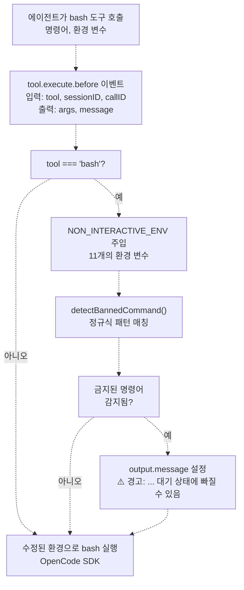
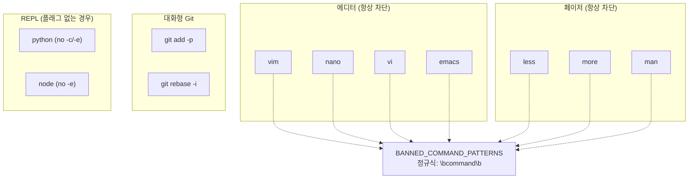
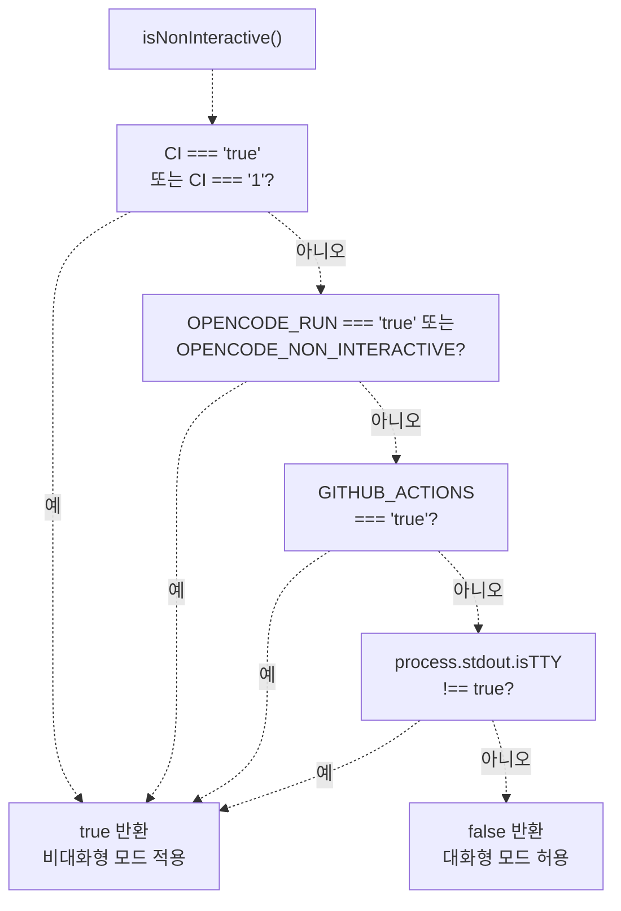
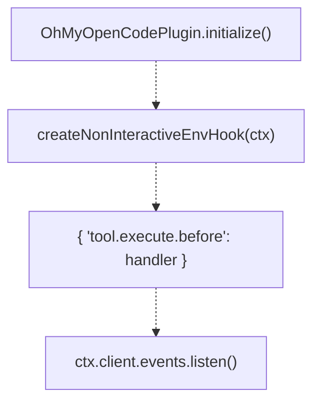

# 비대화형 환경 (Non-Interactive Environment)

> **관련 소스 파일**
> * [src/hooks/non-interactive-env/constants.ts](https://github.com/code-yeongyu/oh-my-opencode/blob/b92cd6ab/src/hooks/non-interactive-env/constants.ts)
> * [src/hooks/non-interactive-env/detector.ts](https://github.com/code-yeongyu/oh-my-opencode/blob/b92cd6ab/src/hooks/non-interactive-env/detector.ts)
> * [src/hooks/non-interactive-env/index.ts](https://github.com/code-yeongyu/oh-my-opencode/blob/b92cd6ab/src/hooks/non-interactive-env/index.ts)
> * [src/hooks/non-interactive-env/types.ts](https://github.com/code-yeongyu/oh-my-opencode/blob/b92cd6ab/src/hooks/non-interactive-env/types.ts)
> * [src/hooks/todo-continuation-enforcer.test.ts](https://github.com/code-yeongyu/oh-my-opencode/blob/b92cd6ab/src/hooks/todo-continuation-enforcer.test.ts)
> * [src/hooks/todo-continuation-enforcer.ts](https://github.com/code-yeongyu/oh-my-opencode/blob/b92cd6ab/src/hooks/todo-continuation-enforcer.ts)

이 문서는 사용자 입력으로 인해 bash 명령어가 대기 상태(hang)에 빠지는 것을 방지하기 위해 환경 변수를 자동으로 주입하고 금지된 대화형 명령어를 감지하는 비대화형 환경 훅(non-interactive environment hook)에 대해 설명합니다. 이러한 안정성 조치는 사람이 대화형 프롬프트에 응답할 수 없는 CI/CD 환경 및 자동화된 에이전트 실행에 있어 매우 중요합니다.

더 광범위한 안정성 아키텍처에 대해서는 [안정성 시스템(Reliability System)](../reliability/)을 참조하십시오. 기타 bash 관련 훅에 대해서는 [기타 훅(Other Hooks)](/code-yeongyu/oh-my-opencode/7.7-other-hooks)을 참조하십시오.

## 목적 및 범위 (Purpose and Scope)

비대화형 환경 훅(`createNonInteractiveEnvHook`)은 모든 `bash` 도구 실행을 가로채고 환경을 수정하여 명령어가 사용자 입력을 기다리지 않도록 합니다. 이는 oh-my-opencode가 다음과 같은 환경에서 실행될 때 필수적입니다:

* GitHub Actions 워크플로우 (Sisyphus Agent)
* `OPENCODE_RUN=true` 설정이 된 CLI `run` 명령어
* `CI=true` 설정이 된 모든 CI/CD 환경
* Non-TTY 환경 (파이프 출력, 헤드리스 실행)

이 훅이 없으면 `-m` 옵션이 없는 `git commit`, `-y` 옵션이 없는 `apt-get install`, 또는 대화형 에디터(`vim`, `nano`)와 같은 명령어들이 무기한 대기 상태에 빠져 전체 세션이 중단될 수 있습니다.

**출처:** [src/hooks/non-interactive-env/index.ts L1-L53](https://github.com/code-yeongyu/oh-my-opencode/blob/b92cd6ab/src/hooks/non-interactive-env/index.ts#L1-L53)

 [src/hooks/non-interactive-env/detector.ts L1-L19](https://github.com/code-yeongyu/oh-my-opencode/blob/b92cd6ab/src/hooks/non-interactive-env/detector.ts#L1-L19)

## 아키텍처 개요 (Architecture Overview)

이 훅은 `tool.execute.before` 단계에서 작동하며, bash 명령어가 OpenCode SDK에 도달하기 전에 가로챕니다. 실행 환경을 수정하고, 문제가 될 수 있는 명령어에 대해 선택적으로 경고 메시지를 추가합니다.

**훅 실행 흐름**



**출처:** [src/hooks/non-interactive-env/index.ts L22-L53](https://github.com/code-yeongyu/oh-my-opencode/blob/b92cd6ab/src/hooks/non-interactive-env/index.ts#L22-L53)

## 환경 변수 주입 (Environment Variable Injection)

이 훅은 모든 bash 실행에 11개의 환경 변수를 주입하여, 일반적인 도구와 패키지 관리자가 비대화형으로 작동하도록 보장합니다.

### NON_INTERACTIVE_ENV 변수

| 변수 | 값 | 목적 |
| --- | --- | --- |
| `CI` | `"true"` | 범용 CI 표시기 (npm, pip, git이 이를 감지함) |
| `DEBIAN_FRONTEND` | `"noninteractive"` | apt-get/dpkg 대화형 프롬프트 방지 |
| `GIT_TERMINAL_PROMPT` | `"0"` | git 자격 증명 프롬프트 비활성화 |
| `GCM_INTERACTIVE` | `"never"` | Git Credential Manager 비대화형 모드 |
| `HOMEBREW_NO_AUTO_UPDATE` | `"1"` | Homebrew 자동 업데이트 프롬프트 건너뛰기 |
| `GIT_EDITOR` | `"true"` | git rebase/commit 에디터 차단 (true = 아무 작업도 하지 않음) |
| `EDITOR` | `"true"` | 시스템 에디터 호출 차단 |
| `VISUAL` | `"true"` | 비주얼 에디터 폴백 차단 |
| `GIT_SEQUENCE_EDITOR` | `"true"` | git rebase -i 에디터 차단 |
| `GIT_PAGER` | `"cat"` | less/more를 cat으로 대체 (페이지 매김 없음) |
| `PAGER` | `"cat"` | 시스템 페이저(pager) 대체 |
| `npm_config_yes` | `"true"` | npm 자동 확인 프롬프트 |
| `PIP_NO_INPUT` | `"1"` | Python pip 비대화형 모드 |
| `YARN_ENABLE_IMMUTABLE_INSTALLS` | `"false"` | lockfile 없이 yarn 진행 허용 |

**구현:**

```javascript
// 실행 전 환경 변수 병합
output.args.env = {
  ...(output.args.env as Record<string, string> | undefined),
  ...NON_INTERACTIVE_ENV,
}
```

이는 에이전트가 명시적으로 설정한 환경 변수를 보존하면서 비대화형 기본값을 추가합니다.

**출처:** [src/hooks/non-interactive-env/constants.ts L3-L23](https://github.com/code-yeongyu/oh-my-opencode/blob/b92cd6ab/src/hooks/non-interactive-env/constants.ts#L3-L23)

 [src/hooks/non-interactive-env/index.ts L37-L40](https://github.com/code-yeongyu/oh-my-opencode/blob/b92cd6ab/src/hooks/non-interactive-env/index.ts#L37-L40)

## 금지된 명령어 감지 (Banned Command Detection)

이 훅은 항상 대기 상태에 빠지는 대화형 명령어를 감지하고 도구 실행에 경고 메시지를 추가합니다. 에이전트는 경고를 보게 되지만 명령어는 여전히 실행됩니다 (에이전트가 실패로부터 학습할 수 있도록 함).

### 금지된 명령어

**금지된 명령어 카테고리**



**감지 로직:**

```javascript
// 명령어 목록에서 정규식 패턴 생성
const BANNED_COMMAND_PATTERNS = SHELL_COMMAND_PATTERNS.banned
  .filter((cmd) => !cmd.includes("("))
  .map((cmd) => new RegExp(`\\b${cmd}\\b`))

function detectBannedCommand(command: string): string | undefined {
  for (let i = 0; i < BANNED_COMMAND_PATTERNS.length; i++) {
    if (BANNED_COMMAND_PATTERNS[i].test(command)) {
      return SHELL_COMMAND_PATTERNS.banned[i]
    }
  }
  return undefined
}
```

감지되면 훅은 다음을 추가합니다: `⚠️ Warning: 'vim' is an interactive command that may hang in non-interactive environments.`

**출처:** [src/hooks/non-interactive-env/constants.ts L54-L59](https://github.com/code-yeongyu/oh-my-opencode/blob/b92cd6ab/src/hooks/non-interactive-env/constants.ts#L54-L59)

 [src/hooks/non-interactive-env/index.ts L9-L20](https://github.com/code-yeongyu/oh-my-opencode/blob/b92cd6ab/src/hooks/non-interactive-env/index.ts#L9-L20)

 [src/hooks/non-interactive-env/index.ts L42-L45](https://github.com/code-yeongyu/oh-my-opencode/blob/b92cd6ab/src/hooks/non-interactive-env/index.ts#L42-L45)

## 쉘 명령어 패턴 (Shell Command Patterns)

상수(constants) 파일은 일반적인 도구에 대한 좋은 패턴과 나쁜 패턴을 기록하여 에이전트와 개발자를 위한 참조 역할을 합니다.

### 패키지 관리자 패턴

| 도구 | 나쁜 패턴 (Bad Pattern) | 좋은 패턴 (Good Pattern) |
| --- | --- | --- |
| npm | `npm init` | `npm init -y` |
| npm | `npm install` (프롬프트 포함) | `npm install --yes` |
| apt | `apt-get install pkg` | `apt-get install -y pkg` |
| apt | - | `DEBIAN_FRONTEND=noninteractive apt-get install pkg` |
| pip | `pip install pkg` (프롬프트 포함) | `pip install --no-input pkg` |
| pip | - | `PIP_NO_INPUT=1 pip install pkg` |

### Git 작업 패턴

| 나쁜 패턴 (Bad Pattern) | 좋은 패턴 (Good Pattern) |
| --- | --- |
| `git commit` | `git commit -m 'msg'` |
| `git merge branch` | `git merge --no-edit branch` |
| `git add -p` | `git add .` |
| `git rebase -i` | `git rebase --no-edit` |

### 시스템 명령어 패턴

| 나쁜 패턴 (Bad Pattern) | 좋은 패턴 (Good Pattern) |
| --- | --- |
| `rm file` (프롬프트 발생) | `rm -f file` |
| `cp a b` (프롬프트 발생) | `cp -f a b` |
| `ssh host` | `ssh -o BatchMode=yes host` |
| `unzip file.zip` (프롬프트 발생) | `unzip -o file.zip` |

### 입력이 필요한 스크립트에 대한 해결 방법

스크립트가 반드시 대화형 입력을 요구하는 경우, 에이전트는 다음과 같은 기술을 사용할 수 있습니다:

**스크립트에 yes 파이프 연결:**

```
yes | ./script.sh
```

**여러 입력을 위한 Heredoc 사용:**

```
./script.sh <<EOF
option1
option2
EOF
```

**설정 파일 선호:**
`expect`나 유사한 도구를 사용하는 대신, 에이전트는 설정 파일 옵션이나 환경 변수 대안을 찾아야 합니다.

**출처:** [src/hooks/non-interactive-env/constants.ts L29-L69](https://github.com/code-yeongyu/oh-my-opencode/blob/b92cd6ab/src/hooks/non-interactive-env/constants.ts#L29-L69)

## 비대화형 감지 (Non-Interactive Detection)

시스템은 여러 환경 지표를 확인하는 `isNonInteractive()`를 사용하여 비대화형 모드 적용 여부를 결정합니다.

**비대화형 감지 결정 트리**



**주요 감지 방법:**

1. **CI 환경**: 표준 `CI` 변수 (Jenkins, Travis, CircleCI 등)
2. **OpenCode 실행 모드**: CLI `run` 명령어는 `OPENCODE_RUN=true`를 설정함
3. **GitHub Actions**: 명시적인 `GITHUB_ACTIONS=true` 확인
4. **TTY 감지**: stdout이 터미널이 아닌 경우 비대화형으로 간주

이러한 다층적 감지는 로컬 대화형 개발 중에는 비활성 상태를 유지하면서 모든 CI/CD 컨텍스트에서 훅이 활성화되도록 보장합니다.

**출처:** [src/hooks/non-interactive-env/detector.ts L1-L19](https://github.com/code-yeongyu/oh-my-opencode/blob/b92cd6ab/src/hooks/non-interactive-env/detector.ts#L1-L19)

## 훅 시스템과의 통합 (Integration with Hook System)

비대화형 환경 훅은 안정성 계층의 일부로 플러그인의 훅 레지스트리에 통합됩니다.

**훅 등록**



이 훅은 단일 핸들러를 반환합니다:

```javascript
export function createNonInteractiveEnvHook(_ctx: PluginInput) {
  return {
    "tool.execute.before": async (
      input: { tool: string; sessionID: string; callID: string },
      output: { args: Record<string, unknown>; message?: string }
    ): Promise<void> => {
      // 구현 내용
    }
  }
}
```

**주요 특징:**

* **조기 가로채기**: `tool.execute.before`는 OpenCode SDK가 도구를 실행하기 전에 실행됩니다.
* **변이(Mutation) 허용**: 훅이 `output.args.env`를 직접 수정합니다.
* **경고 주입**: 훅이 `output.message`를 설정하여 에이전트에게 경고를 표시할 수 있습니다.
* **도구 특정적**: `bash` 도구에 대해서만 활성화됩니다.

**출처:** [src/hooks/non-interactive-env/index.ts L22-L53](https://github.com/code-yeongyu/oh-my-opencode/blob/b92cd6ab/src/hooks/non-interactive-env/index.ts#L22-L53)

## 설정 (Configuration)

이 훅은 `oh-my-opencode.json` 설정 파일을 통한 선택적 구성을 지원합니다:

```json
interface NonInteractiveEnvConfig {
  disabled?: boolean
}
```

`disabled: true`인 경우 훅이 등록되지 않습니다. 이는 주로 대화형 명령어가 의도적으로 필요한 디버깅 시나리오를 위한 것입니다.

**기본 동작:** 설정에서 명시적으로 비활성화하지 않는 한 항상 활성화됩니다.

**출처:** [src/hooks/non-interactive-env/types.ts L1-L3](https://github.com/code-yeongyu/oh-my-opencode/blob/b92cd6ab/src/hooks/non-interactive-env/types.ts#L1-L3)

## 백그라운드 작업과의 상호작용 (Interaction with Background Tasks)

비대화형 환경 훅은 `background_task` 도구를 통해 생성된 백그라운드 작업과 원활하게 작동합니다. 각 백그라운드 작업은 자체 bash 실행을 가진 별도의 세션이며, 훅은 이들 모두에 적용됩니다:

* **메인 세션 bash**: 비대화형 환경 적용
* **백그라운드 작업 bash**: 비대화형 환경 적용
* **Sisyphus 에이전트 (GitHub Actions)**: 비대화형 환경 적용

이를 통해 모든 실행 컨텍스트에서 일관된 동작을 보장하고, 어떤 세션도 사용자 입력으로 인해 대기 상태에 빠지지 않도록 합니다.

**출처:** [src/hooks/non-interactive-env/index.ts L1-L53](https://github.com/code-yeongyu/oh-my-opencode/blob/b92cd6ab/src/hooks/non-interactive-env/index.ts#L1-L53)

## 사용 예시 (Usage Examples)

### 예제 1: Git 작업

**훅이 없는 경우 (대기 상태 발생):**

```markdown
git commit
# 에디터가 커밋 메시지를 입력받기 위해 대기함
```

**훅이 있는 경우 (성공):**

* 에이전트 실행: `git commit`
* 훅 주입: `GIT_EDITOR=true`
* 결과: Git이 `true`를 에디터로 사용(아무 작업 안 함), 에이전트는 메시지 누락에 대한 오류를 확인
* 에이전트 학습 결과: `git commit -m "fix: update config"` 사용

### 예제 2: 패키지 설치

**훅이 없는 경우 (대기 상태 발생):**

```markdown
apt-get install nginx
# "Do you want to continue? [Y/n]" 프롬프트 발생
```

**훅이 있는 경우 (성공):**

* 에이전트 실행: `apt-get install nginx`
* 훅 주입: `DEBIAN_FRONTEND=noninteractive`
* 결과: apt-get이 자동 확인하고 설치를 진행함

### 예제 3: 금지된 명령어 감지

**에이전트 시도:**

```
vim config.yaml
```

**훅 응답:**

* 경고 메시지: `⚠️ Warning: 'vim' is an interactive command that may hang in non-interactive environments.`
* 명령어는 여전히 실행됨 (대기 상태에 빠지거나 실패함)
* 에이전트는 실패를 확인하고 다음을 사용하도록 학습함: `echo "key: value" >> config.yaml`

**출처:** [src/hooks/non-interactive-env/constants.ts L29-L69](https://github.com/code-yeongyu/oh-my-opencode/blob/b92cd6ab/src/hooks/non-interactive-env/constants.ts#L29-L69)

 [src/hooks/non-interactive-env/index.ts L42-L45](https://github.com/code-yeongyu/oh-my-opencode/blob/b92cd6ab/src/hooks/non-interactive-env/index.ts#L42-L45)

## 다른 안정성 훅과의 관계 (Relationship to Other Reliability Hooks)

비대화형 환경 훅은 여러 예방 계층(prevention-layer) 훅 중 하나입니다:

* **비대화형 환경 (Non-Interactive Env)**: bash 대기 상태 방지 (이 페이지)
* **메시지 검증기 (Message Validator)** ([7.2](/code-yeongyu/oh-my-opencode/7.2-message-validation)): API 준수 오류 방지
* **주석 체크 (Comment Checker)** ([7.7](/code-yeongyu/oh-my-opencode/7.7-other-hooks)): 코드 내 TODO 주석에 대해 경고
* **세션 복구 (Session Recovery)** ([7.1](/code-yeongyu/oh-my-opencode/7.1-session-recovery)): 오류 발생 후 복구

이러한 훅들은 함께 심층 방어(defense-in-depth)를 구현합니다. 예방은 오류를 줄이고, 복구는 예방을 통과한 오류를 처리합니다.

**출처:** [src/hooks/non-interactive-env/index.ts L1-L53](https://github.com/code-yeongyu/oh-my-opencode/blob/b92cd6ab/src/hooks/non-interactive-env/index.ts#L1-L53)