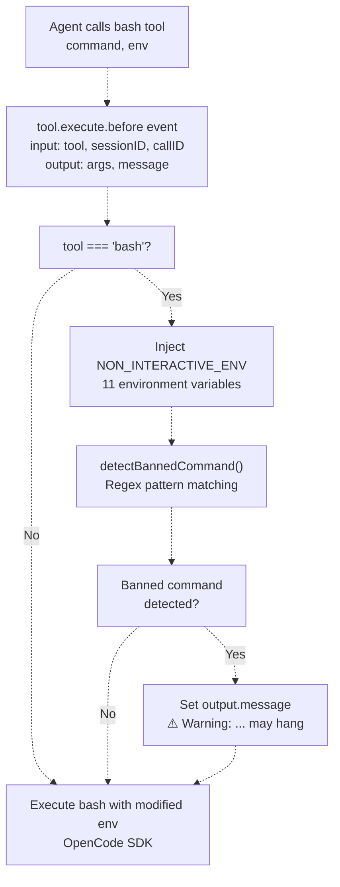
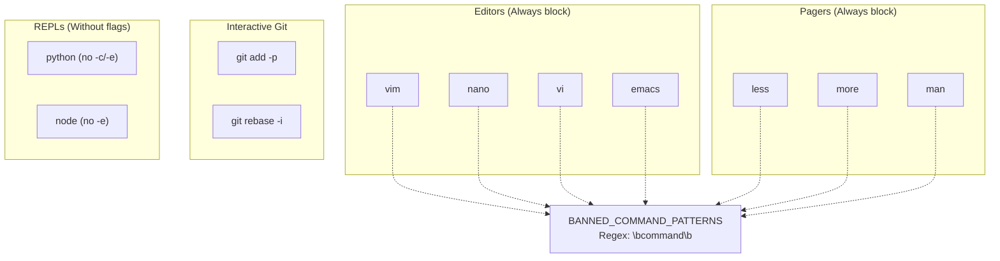
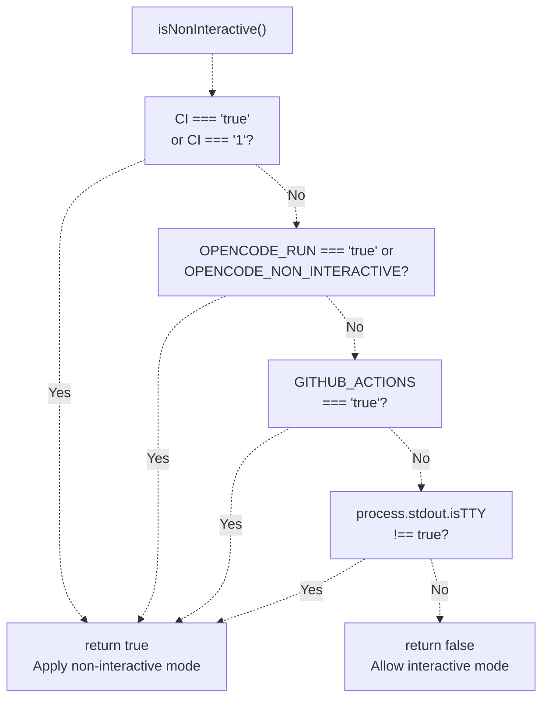

# Non-Interactive Environment

> **Relevant source files**
> * [src/hooks/non-interactive-env/constants.ts](https://github.com/code-yeongyu/oh-my-opencode/blob/b92cd6ab/src/hooks/non-interactive-env/constants.ts)
> * [src/hooks/non-interactive-env/detector.ts](https://github.com/code-yeongyu/oh-my-opencode/blob/b92cd6ab/src/hooks/non-interactive-env/detector.ts)
> * [src/hooks/non-interactive-env/index.ts](https://github.com/code-yeongyu/oh-my-opencode/blob/b92cd6ab/src/hooks/non-interactive-env/index.ts)
> * [src/hooks/non-interactive-env/types.ts](https://github.com/code-yeongyu/oh-my-opencode/blob/b92cd6ab/src/hooks/non-interactive-env/types.ts)
> * [src/hooks/todo-continuation-enforcer.test.ts](https://github.com/code-yeongyu/oh-my-opencode/blob/b92cd6ab/src/hooks/todo-continuation-enforcer.test.ts)
> * [src/hooks/todo-continuation-enforcer.ts](https://github.com/code-yeongyu/oh-my-opencode/blob/b92cd6ab/src/hooks/todo-continuation-enforcer.ts)

This document explains the non-interactive environment hook, which prevents bash commands from hanging on user input by automatically injecting environment variables and detecting banned interactive commands. This reliability measure is critical for CI/CD environments and automated agent execution where no human can respond to interactive prompts.

For the broader reliability architecture, see [Reliability System](../reliability/). For other bash-related hooks, see [Other Hooks](/code-yeongyu/oh-my-opencode/7.7-other-hooks).

## Purpose and Scope

The non-interactive environment hook (`createNonInteractiveEnvHook`) intercepts every `bash` tool execution and modifies the environment to prevent commands from waiting for user input. This is essential when oh-my-opencode runs in:

* GitHub Actions workflows (Sisyphus Agent)
* CLI `run` command with `OPENCODE_RUN=true`
* Any CI/CD environment with `CI=true`
* Non-TTY environments (piped output, headless execution)

Without this hook, commands like `git commit` (without `-m`), `apt-get install` (without `-y`), or interactive editors (`vim`, `nano`) would hang indefinitely, causing the entire session to stall.

**Sources:** [src/hooks/non-interactive-env/index.ts L1-L53](https://github.com/code-yeongyu/oh-my-opencode/blob/b92cd6ab/src/hooks/non-interactive-env/index.ts#L1-L53)

 [src/hooks/non-interactive-env/detector.ts L1-L19](https://github.com/code-yeongyu/oh-my-opencode/blob/b92cd6ab/src/hooks/non-interactive-env/detector.ts#L1-L19)

## Architecture Overview

The hook operates in the `tool.execute.before` phase, intercepting bash commands before they reach the OpenCode SDK. It modifies the execution environment and optionally adds warning messages for problematic commands.

**Hook Execution Flow**



**Sources:** [src/hooks/non-interactive-env/index.ts L22-L53](https://github.com/code-yeongyu/oh-my-opencode/blob/b92cd6ab/src/hooks/non-interactive-env/index.ts#L22-L53)

## Environment Variable Injection

The hook injects 11 environment variables into every bash execution, ensuring common tools and package managers operate non-interactively.

### NON_INTERACTIVE_ENV Variables

| Variable | Value | Purpose |
| --- | --- | --- |
| `CI` | `"true"` | Universal CI indicator (npm, pip, git detect this) |
| `DEBIAN_FRONTEND` | `"noninteractive"` | Prevent apt-get/dpkg interactive prompts |
| `GIT_TERMINAL_PROMPT` | `"0"` | Disable git credential prompts |
| `GCM_INTERACTIVE` | `"never"` | Git Credential Manager non-interactive mode |
| `HOMEBREW_NO_AUTO_UPDATE` | `"1"` | Skip Homebrew auto-update prompts |
| `GIT_EDITOR` | `"true"` | Block git rebase/commit editors (true = no-op) |
| `EDITOR` | `"true"` | Block system editor invocations |
| `VISUAL` | `"true"` | Block visual editor fallback |
| `GIT_SEQUENCE_EDITOR` | `"true"` | Block git rebase -i editor |
| `GIT_PAGER` | `"cat"` | Replace less/more with cat (no pagination) |
| `PAGER` | `"cat"` | Replace system pager |
| `npm_config_yes` | `"true"` | npm auto-confirm prompts |
| `PIP_NO_INPUT` | `"1"` | Python pip non-interactive mode |
| `YARN_ENABLE_IMMUTABLE_INSTALLS` | `"false"` | Allow yarn to proceed without lockfile |

**Implementation:**

```
// Merge environment variables before execution
output.args.env = {
  ...(output.args.env as Record<string, string> | undefined),
  ...NON_INTERACTIVE_ENV,
}
```

This preserves any environment variables the agent explicitly sets while adding the non-interactive defaults.

**Sources:** [src/hooks/non-interactive-env/constants.ts L3-L23](https://github.com/code-yeongyu/oh-my-opencode/blob/b92cd6ab/src/hooks/non-interactive-env/constants.ts#L3-L23)

 [src/hooks/non-interactive-env/index.ts L37-L40](https://github.com/code-yeongyu/oh-my-opencode/blob/b92cd6ab/src/hooks/non-interactive-env/index.ts#L37-L40)

## Banned Command Detection

The hook detects interactive commands that will always hang and adds a warning message to the tool execution. The agent sees the warning but the command still executes (allowing the agent to learn from the failure).

### Banned Commands

**Banned Command Categories**



**Detection Logic:**

```javascript
// Build regex patterns from command list
const BANNED_COMMAND_PATTERNS = SHELL_COMMAND_PATTERNS.banned
  .filter((cmd) => !cmd.includes("("))
  .map((cmd) => new RegExp(`\\b${cmd}\\b`))

function detectBannedCommand(command: string): string | undefined {
  for (let i = 0; i < BANNED_COMMAND_PATTERNS.length; i++) {
    if (BANNED_COMMAND_PATTERNS[i].test(command)) {
      return SHELL_COMMAND_PATTERNS.banned[i]
    }
  }
  return undefined
}
```

When detected, the hook adds: `⚠️ Warning: 'vim' is an interactive command that may hang in non-interactive environments.`

**Sources:** [src/hooks/non-interactive-env/constants.ts L54-L59](https://github.com/code-yeongyu/oh-my-opencode/blob/b92cd6ab/src/hooks/non-interactive-env/constants.ts#L54-L59)

 [src/hooks/non-interactive-env/index.ts L9-L20](https://github.com/code-yeongyu/oh-my-opencode/blob/b92cd6ab/src/hooks/non-interactive-env/index.ts#L9-L20)

 [src/hooks/non-interactive-env/index.ts L42-L45](https://github.com/code-yeongyu/oh-my-opencode/blob/b92cd6ab/src/hooks/non-interactive-env/index.ts#L42-L45)

## Shell Command Patterns

The constants file documents good and bad patterns for common tools, serving as reference for agents and developers.

### Package Manager Patterns

| Tool | Bad Pattern | Good Pattern |
| --- | --- | --- |
| npm | `npm init` | `npm init -y` |
| npm | `npm install` (with prompts) | `npm install --yes` |
| apt | `apt-get install pkg` | `apt-get install -y pkg` |
| apt | - | `DEBIAN_FRONTEND=noninteractive apt-get install pkg` |
| pip | `pip install pkg` (with prompts) | `pip install --no-input pkg` |
| pip | - | `PIP_NO_INPUT=1 pip install pkg` |

### Git Operation Patterns

| Bad Pattern | Good Pattern |
| --- | --- |
| `git commit` | `git commit -m 'msg'` |
| `git merge branch` | `git merge --no-edit branch` |
| `git add -p` | `git add .` |
| `git rebase -i` | `git rebase --no-edit` |

### System Command Patterns

| Bad Pattern | Good Pattern |
| --- | --- |
| `rm file` (prompts) | `rm -f file` |
| `cp a b` (prompts) | `cp -f a b` |
| `ssh host` | `ssh -o BatchMode=yes host` |
| `unzip file.zip` (prompts) | `unzip -o file.zip` |

### Workarounds for Scripts Requiring Input

When a script absolutely requires interactive input, agents can use these techniques:

**Pipe yes into script:**

```
yes | ./script.sh
```

**Heredoc for multiple inputs:**

```
./script.sh <<EOF
option1
option2
EOF
```

**Prefer configuration files:**
Instead of using `expect` or similar tools, agents should look for config file options or environment variable alternatives.

**Sources:** [src/hooks/non-interactive-env/constants.ts L29-L69](https://github.com/code-yeongyu/oh-my-opencode/blob/b92cd6ab/src/hooks/non-interactive-env/constants.ts#L29-L69)

## Non-Interactive Detection

The system determines whether to apply non-interactive mode using `isNonInteractive()`, which checks multiple environment indicators.

**Detection Decision Tree**



**Key Detection Methods:**

1. **CI Environment**: Standard `CI` variable (Jenkins, Travis, CircleCI, etc.)
2. **OpenCode Run Mode**: CLI `run` command sets `OPENCODE_RUN=true`
3. **GitHub Actions**: Explicit `GITHUB_ACTIONS=true` check
4. **TTY Detection**: If stdout is not a terminal, assume non-interactive

This multi-layered detection ensures the hook activates in all CI/CD contexts while remaining disabled during local interactive development.

**Sources:** [src/hooks/non-interactive-env/detector.ts L1-L19](https://github.com/code-yeongyu/oh-my-opencode/blob/b92cd6ab/src/hooks/non-interactive-env/detector.ts#L1-L19)

## Integration with Hook System

The non-interactive environment hook integrates into the plugin's hook registry as part of the reliability layer.

**Hook Registration**


The hook returns a single handler:

```javascript
export function createNonInteractiveEnvHook(_ctx: PluginInput) {
  return {
    "tool.execute.before": async (
      input: { tool: string; sessionID: string; callID: string },
      output: { args: Record<string, unknown>; message?: string }
    ): Promise<void> => {
      // Implementation
    }
  }
}
```

**Key characteristics:**

* **Early interception**: `tool.execute.before` runs before OpenCode SDK executes the tool
* **Mutation allowed**: The hook modifies `output.args.env` directly
* **Warning injection**: The hook can set `output.message` to display warnings to the agent
* **Tool-specific**: Only activates for `bash` tool

**Sources:** [src/hooks/non-interactive-env/index.ts L22-L53](https://github.com/code-yeongyu/oh-my-opencode/blob/b92cd6ab/src/hooks/non-interactive-env/index.ts#L22-L53)

## Configuration

The hook supports optional configuration via the `oh-my-opencode.json` config file:

```
interface NonInteractiveEnvConfig {
  disabled?: boolean
}
```

When `disabled: true`, the hook is not registered. This is primarily for debugging scenarios where interactive commands are intentionally needed.

**Default behavior:** Always enabled unless explicitly disabled in configuration.

**Sources:** [src/hooks/non-interactive-env/types.ts L1-L3](https://github.com/code-yeongyu/oh-my-opencode/blob/b92cd6ab/src/hooks/non-interactive-env/types.ts#L1-L3)

## Interaction with Background Tasks

The non-interactive environment hook works seamlessly with background tasks spawned via `background_task` tool. Each background task is a separate session with its own bash executions, and the hook applies to all of them:

* **Main session bash**: Gets non-interactive env
* **Background task bash**: Gets non-interactive env
* **Sisyphus Agent (GitHub Actions)**: Gets non-interactive env

This ensures consistent behavior across all execution contexts, preventing any session from hanging on user input.

**Sources:** [src/hooks/non-interactive-env/index.ts L1-L53](https://github.com/code-yeongyu/oh-my-opencode/blob/b92cd6ab/src/hooks/non-interactive-env/index.ts#L1-L53)

## Usage Examples

### Example 1: Git Operations

**Without hook (would hang):**

```markdown
git commit
# Waits for editor to provide commit message
```

**With hook (succeeds):**

* Agent runs: `git commit`
* Hook injects: `GIT_EDITOR=true`
* Result: Git uses `true` as editor (no-op), agent sees error about missing message
* Agent learns to use: `git commit -m "fix: update config"`

### Example 2: Package Installation

**Without hook (would hang):**

```markdown
apt-get install nginx
# Prompts "Do you want to continue? [Y/n]"
```

**With hook (succeeds):**

* Agent runs: `apt-get install nginx`
* Hook injects: `DEBIAN_FRONTEND=noninteractive`
* Result: apt-get auto-confirms, installation proceeds

### Example 3: Banned Command Detection

**Agent attempts:**

```
vim config.yaml
```

**Hook response:**

* Warning message: `⚠️ Warning: 'vim' is an interactive command that may hang in non-interactive environments.`
* Command still executes (will hang or fail)
* Agent sees the failure and learns to use: `echo "key: value" >> config.yaml`

**Sources:** [src/hooks/non-interactive-env/constants.ts L29-L69](https://github.com/code-yeongyu/oh-my-opencode/blob/b92cd6ab/src/hooks/non-interactive-env/constants.ts#L29-L69)

 [src/hooks/non-interactive-env/index.ts L42-L45](https://github.com/code-yeongyu/oh-my-opencode/blob/b92cd6ab/src/hooks/non-interactive-env/index.ts#L42-L45)

## Relationship to Other Reliability Hooks

The non-interactive environment hook is one of several prevention-layer hooks:

* **Non-Interactive Env**: Prevents bash hangs (this page)
* **Message Validator** ([7.2](/code-yeongyu/oh-my-opencode/7.2-message-validation)): Prevents API compliance errors
* **Comment Checker** ([7.7](/code-yeongyu/oh-my-opencode/7.7-other-hooks)): Warns about TODO comments in code
* **Session Recovery** ([7.1](/code-yeongyu/oh-my-opencode/7.1-session-recovery)): Recovers from errors after they occur

Together, these hooks implement defense-in-depth: prevention reduces errors, and recovery handles what slips through.

**Sources:** [src/hooks/non-interactive-env/index.ts L1-L53](https://github.com/code-yeongyu/oh-my-opencode/blob/b92cd6ab/src/hooks/non-interactive-env/index.ts#L1-L53)