# Overview

> **Relevant source files**
> * [README.ja.md](https://github.com/code-yeongyu/oh-my-opencode/blob/b92cd6ab/README.ja.md)
> * [README.ko.md](https://github.com/code-yeongyu/oh-my-opencode/blob/b92cd6ab/README.ko.md)
> * [README.md](https://github.com/code-yeongyu/oh-my-opencode/blob/b92cd6ab/README.md)
> * [README.zh-cn.md](https://github.com/code-yeongyu/oh-my-opencode/blob/b92cd6ab/README.zh-cn.md)
> * [assets/oh-my-opencode.schema.json](https://github.com/code-yeongyu/oh-my-opencode/blob/b92cd6ab/assets/oh-my-opencode.schema.json)
> * [src/config/schema.ts](https://github.com/code-yeongyu/oh-my-opencode/blob/b92cd6ab/src/config/schema.ts)
> * [src/hooks/index.ts](https://github.com/code-yeongyu/oh-my-opencode/blob/b92cd6ab/src/hooks/index.ts)
> * [src/index.ts](https://github.com/code-yeongyu/oh-my-opencode/blob/b92cd6ab/src/index.ts)
> * [src/shared/config-path.ts](https://github.com/code-yeongyu/oh-my-opencode/blob/b92cd6ab/src/shared/config-path.ts)

oh-my-opencode is an advanced agent harness for [OpenCode](https://github.com/code-yeongyu/oh-my-opencode/blob/b92cd6ab/OpenCode)

 designed to transform LLM agents from single-purpose assistants into disciplined, production-grade development teams. The plugin extends OpenCode with multi-agent orchestration, parallel execution capabilities, robust reliability features, and comprehensive tool enhancements.

**Key Navigation:**

* Getting started: [2](../getting-started/) Installation & Configuration
* Core architecture: [3](../architecture/) Plugin Lifecycle & Event System
* Agent system: [4](../agents/) Multi-agent Orchestration
* Tool ecosystem: [5](../tools/) Enhanced Development Tools
* Background execution: [6](../background-execution/) Parallel Agent System
* Reliability features: [7](../reliability/) Defense-in-Depth Reliability

## What is oh-my-opencode?

oh-my-opencode addresses the fundamental challenge of agent-based development: **making AI agents work like real development teams**. The plugin provides:

### Multi-Agent Orchestration

Six specialized agents with distinct AI models optimized for their specific tasks:

* **Sisyphus** (Claude Opus 4.5): Primary orchestrator with aggressive delegation
* **Oracle** (GPT-5.2): Architecture design and debugging advisor
* **Librarian** (Claude Sonnet 4.5 / Gemini 3 Flash): Documentation and research specialist
* **Explore** (Grok Code / Gemini 3 Flash / Claude Haiku 4.5): Fast codebase exploration
* **Frontend UI/UX Engineer** (Gemini 3 Pro): Visual implementation specialist
* **Document Writer** (Gemini 3 Flash): Technical writing expert
* **Multimodal Looker** (Gemini 3 Flash): Media analysis specialist

**Sources:** [README.md L463-L473](https://github.com/code-yeongyu/oh-my-opencode/blob/b92cd6ab/README.md#L463-L473)

### Parallel Background Execution

True parallelism through the `BackgroundManager` system enabling workflows like:

* Gemini building frontend while Claude handles backend
* GPT debugging while Claude tries alternative approaches
* Multiple parallel searches with continued implementation

**Sources:** [README.md L484-L496](https://github.com/code-yeongyu/oh-my-opencode/blob/b92cd6ab/README.md#L484-L496)

 [src/features/background-agent.ts L1-L300](https://github.com/code-yeongyu/oh-my-opencode/blob/b92cd6ab/src/features/background-agent.ts#L1-L300)

### Production-Grade Reliability

Defense-in-depth reliability with prevention, detection, and recovery layers:

* **Session Recovery**: Automatic recovery from API errors
* **Todo Continuation**: Forces completion of all tasks
* **Context Management**: Preemptive compaction, dynamic pruning, auto-truncation
* **Message Validation**: Prevents API errors before they occur

**Sources:** [README.md L674-L693](https://github.com/code-yeongyu/oh-my-opencode/blob/b92cd6ab/README.md#L674-L693)

 [src/hooks/session-recovery.ts L1-L200](https://github.com/code-yeongyu/oh-my-opencode/blob/b92cd6ab/src/hooks/session-recovery.ts#L1-L200)

### Enhanced Development Tools

IDE-grade capabilities for agents:

* **LSP Tools**: 12 operations including rename, code actions, diagnostics
* **AST-Grep**: Pattern matching and safe replacement across 25 languages
* **Interactive Bash**: tmux integration for persistent shells
* **Session Management**: Historical analysis and search

**Sources:** [README.md L500-L536](https://github.com/code-yeongyu/oh-my-opencode/blob/b92cd6ab/README.md#L500-L536)

 [src/tools/index.ts L1-L100](https://github.com/code-yeongyu/oh-my-opencode/blob/b92cd6ab/src/tools/index.ts#L1-L100)

### Claude Code Compatibility

Seamless migration from Claude Code with full support for:

* Commands, Skills, Agents, MCP servers
* Hooks (PreToolUse, PostToolUse, UserPromptSubmit, Stop)
* Configuration files from `~/.claude/`

**Sources:** [README.md L579-L665](https://github.com/code-yeongyu/oh-my-opencode/blob/b92cd6ab/README.md#L579-L665)

## Why oh-my-opencode?

The plugin emerged from $24,000 worth of token expenditure testing production workflows. Key differentiators:

**Aggressive Delegation**: Sisyphus delegates everything possible to specialized agents, maintaining clean context and enabling parallel work streams.

**Disciplined Execution**: The Todo Continuation Enforcer prevents the chronic LLM habit of stopping mid-task. Sessions complete or they don't stop.

**Context Intelligence**: Multiple strategies for context management (preemptive compaction, dynamic pruning, tool output truncation) prevent context anxiety.

**Production Reliability**: Session recovery, message validation, and error handling systems ensure sessions survive API failures and model quirks.

**Multi-Provider Support**: Works with ChatGPT, Claude, and Gemini subscriptions via authentication plugins (`opencode-antigravity-auth`, `opencode-openai-codex-auth`).

**Sources:** [README.md L1-L50](https://github.com/code-yeongyu/oh-my-opencode/blob/b92cd6ab/README.md#L1-L50)

 [README.md L153-L194](https://github.com/code-yeongyu/oh-my-opencode/blob/b92cd6ab/README.md#L153-L194)

## System Architecture

oh-my-opencode implements a six-layer architecture integrating deeply with OpenCode's plugin system:

### Layer 1: User Interface

**Entry Points:**

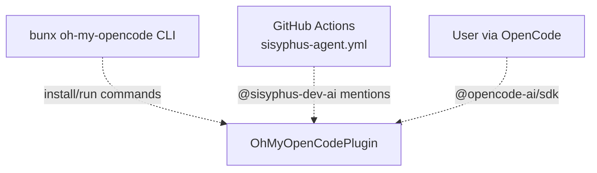

Three interaction modes:

* **CLI**: Installation (`bunx oh-my-opencode install`) and execution (`bunx oh-my-opencode run`)
* **GitHub Actions**: Automated agent work via `@sisyphus-dev-ai` mentions in issues/PRs
* **Direct User**: Standard OpenCode interaction with enhanced capabilities

**Sources:** [README.md L196-L428](https://github.com/code-yeongyu/oh-my-opencode/blob/b92cd6ab/README.md#L196-L428)

 [.github/workflows/sisyphus-agent.yml L1-L100](https://github.com/code-yeongyu/oh-my-opencode/blob/b92cd6ab/.github/workflows/sisyphus-agent.yml#L1-L100)

### Layer 2: Plugin Core

**Core Components:**

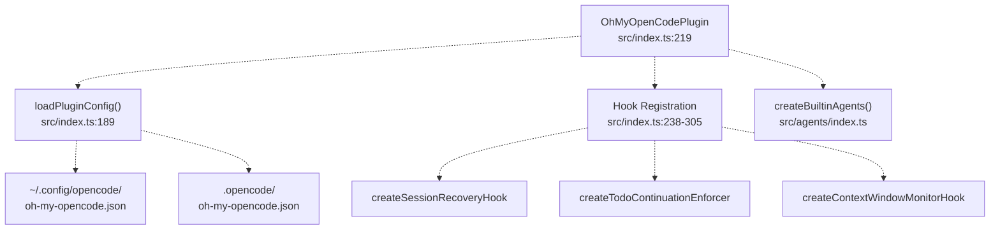

The `OhMyOpenCodePlugin` function serves as the main entry point, orchestrating:

* Configuration loading with two-tier hierarchy (user + project)
* Hook initialization (20+ event interceptors)
* Agent factory instantiation
* Tool registration
* MCP integration

**Sources:** [src/index.ts L219-L556](https://github.com/code-yeongyu/oh-my-opencode/blob/b92cd6ab/src/index.ts#L219-L556)

 [src/index.ts L189-L217](https://github.com/code-yeongyu/oh-my-opencode/blob/b92cd6ab/src/index.ts#L189-L217)

### Layer 3: Agent Orchestration

**Sisyphus Orchestration Model:**

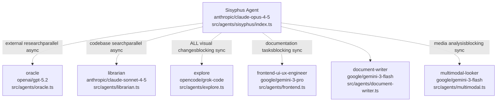

Agent factory (`createBuiltinAgents`) constructs specialized agents with:

* Model overrides from configuration
* Tool access restrictions (read-only vs read-write)
* Permission boundaries
* Environment context injection

**Sources:** [src/agents/index.ts L1-L200](https://github.com/code-yeongyu/oh-my-opencode/blob/b92cd6ab/src/agents/index.ts#L1-L200)

 [src/agents/sisyphus/index.ts L1-L100](https://github.com/code-yeongyu/oh-my-opencode/blob/b92cd6ab/src/agents/sisyphus/index.ts#L1-L100)

### Layer 4: Tool & Service Layer

**Enhanced Tool Ecosystem:**

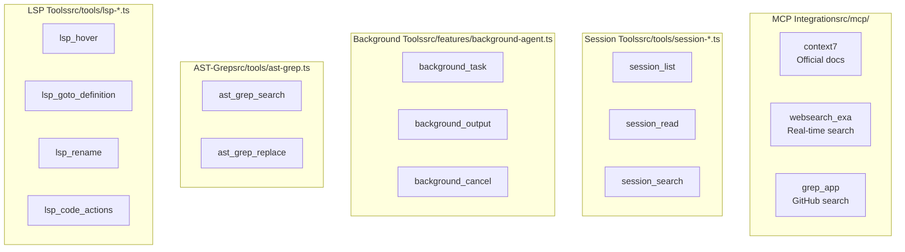

Key tool categories:

* **LSP Tools (12 operations)**: Type info, navigation, refactoring, diagnostics
* **AST-Grep (2 operations)**: Pattern search/replace across 25 languages
* **Background Tools (3 operations)**: Async agent spawning and monitoring
* **Session Tools (4 operations)**: Historical analysis and search
* **MCPs (3 providers)**: External knowledge sources

**Sources:** [src/tools/index.ts L1-L100](https://github.com/code-yeongyu/oh-my-opencode/blob/b92cd6ab/src/tools/index.ts#L1-L100)

 [src/mcp/index.ts L1-L100](https://github.com/code-yeongyu/oh-my-opencode/blob/b92cd6ab/src/mcp/index.ts#L1-L100)

### Layer 5: Reliability Layer

**Defense-in-Depth Architecture:**

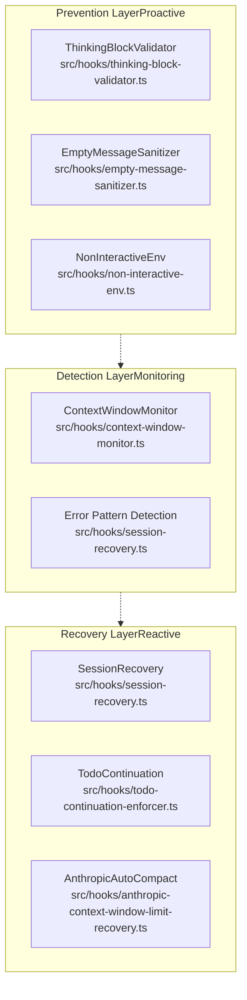

Three-layer approach:

* **Prevention**: Validates messages before API calls (thinking blocks, empty content, interactive prompts)
* **Detection**: Monitors context usage, error patterns, task completion
* **Recovery**: Automatic fixes for session errors, context limit recovery, forced task continuation

**Sources:** [src/hooks/session-recovery.ts L1-L200](https://github.com/code-yeongyu/oh-my-opencode/blob/b92cd6ab/src/hooks/session-recovery.ts#L1-L200)

 [src/hooks/todo-continuation-enforcer.ts L1-L150](https://github.com/code-yeongyu/oh-my-opencode/blob/b92cd6ab/src/hooks/todo-continuation-enforcer.ts#L1-L150)

 [src/hooks/context-window-monitor.ts L1-L100](https://github.com/code-yeongyu/oh-my-opencode/blob/b92cd6ab/src/hooks/context-window-monitor.ts#L1-L100)

### Layer 6: External Integration

**Provider & Compatibility:**

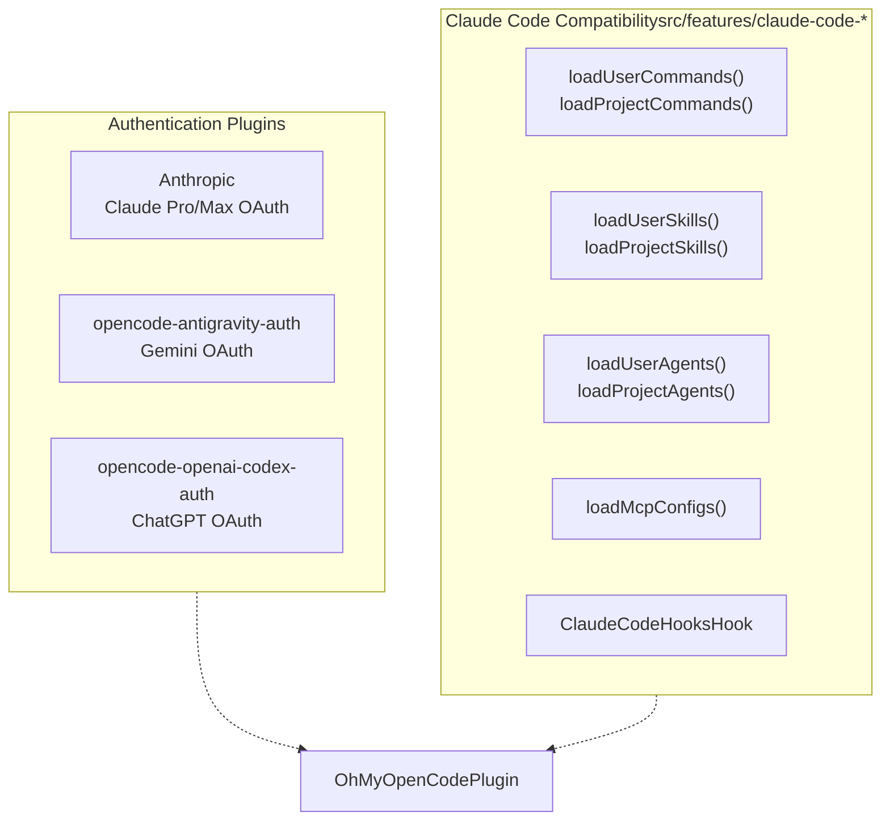

External integrations:

* **OpenCode SDK**: Foundation API via `@opencode-ai/sdk`
* **Authentication**: Three plugins for major AI providers
* **Claude Code**: Full compatibility with `~/.claude/` configurations

**Sources:** [src/index.ts L328-L331](https://github.com/code-yeongyu/oh-my-opencode/blob/b92cd6ab/src/index.ts#L328-L331)

 [src/features/claude-code-command-loader.ts L1-L100](https://github.com/code-yeongyu/oh-my-opencode/blob/b92cd6ab/src/features/claude-code-command-loader.ts#L1-L100)

 [src/features/claude-code-mcp-loader.ts L1-L100](https://github.com/code-yeongyu/oh-my-opencode/blob/b92cd6ab/src/features/claude-code-mcp-loader.ts#L1-L100)

## Plugin Initialization Sequence

The `OhMyOpenCodePlugin` function implements OpenCode's plugin interface, executing a structured initialization sequence:

**Initialization Flow:**

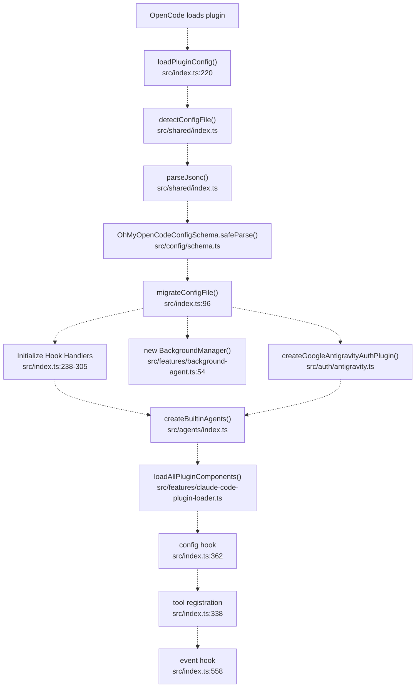

**Key Steps:**

1. **Configuration Loading** (`loadPluginConfig`): * Detects `.jsonc` or `.json` files at user and project paths * Parses JSONC (supports comments and trailing commas) * Validates against Zod schema (`OhMyOpenCodeConfigSchema`) * Migrates legacy `omo` agent names to `Sisyphus` * Merges user + project configs (project overrides user)
2. **Hook Initialization** (lines 238-305): * Creates 20+ hook handlers based on `disabled_hooks` config * Each hook returns `null` if disabled, handler functions if enabled * Examples: `createSessionRecoveryHook`, `createTodoContinuationEnforcer`
3. **Manager Initialization**: * `BackgroundManager` for async agent execution * Google Auth plugin if `google_auth !== false` * Tool factories (`createCallOmoAgent`, `createLookAt`, `createSkillTool`)
4. **Agent Registration** (`config` hook, line 362): * Builds specialized agents via `createBuiltinAgents` * Loads Claude Code compatible agents/skills/commands * Sets Sisyphus as `default_agent` if enabled * Configures tool access per agent
5. **Runtime Registration**: * Tools: LSP, AST-grep, background, session, specialized * Events: Routes OpenCode events to hook handlers * Chat transformations: Message validation and sanitization

**Sources:** [src/index.ts L219-L556](https://github.com/code-yeongyu/oh-my-opencode/blob/b92cd6ab/src/index.ts#L219-L556)

 [src/index.ts L189-L217](https://github.com/code-yeongyu/oh-my-opencode/blob/b92cd6ab/src/index.ts#L189-L217)

 [src/index.ts L96-L123](https://github.com/code-yeongyu/oh-my-opencode/blob/b92cd6ab/src/index.ts#L96-L123)

 [src/config/schema.ts L1-L205](https://github.com/code-yeongyu/oh-my-opencode/blob/b92cd6ab/src/config/schema.ts#L1-L205)

## Configuration System

The configuration system implements a two-tier hierarchy with JSONC support, runtime validation, and automatic migration:

### Configuration Hierarchy

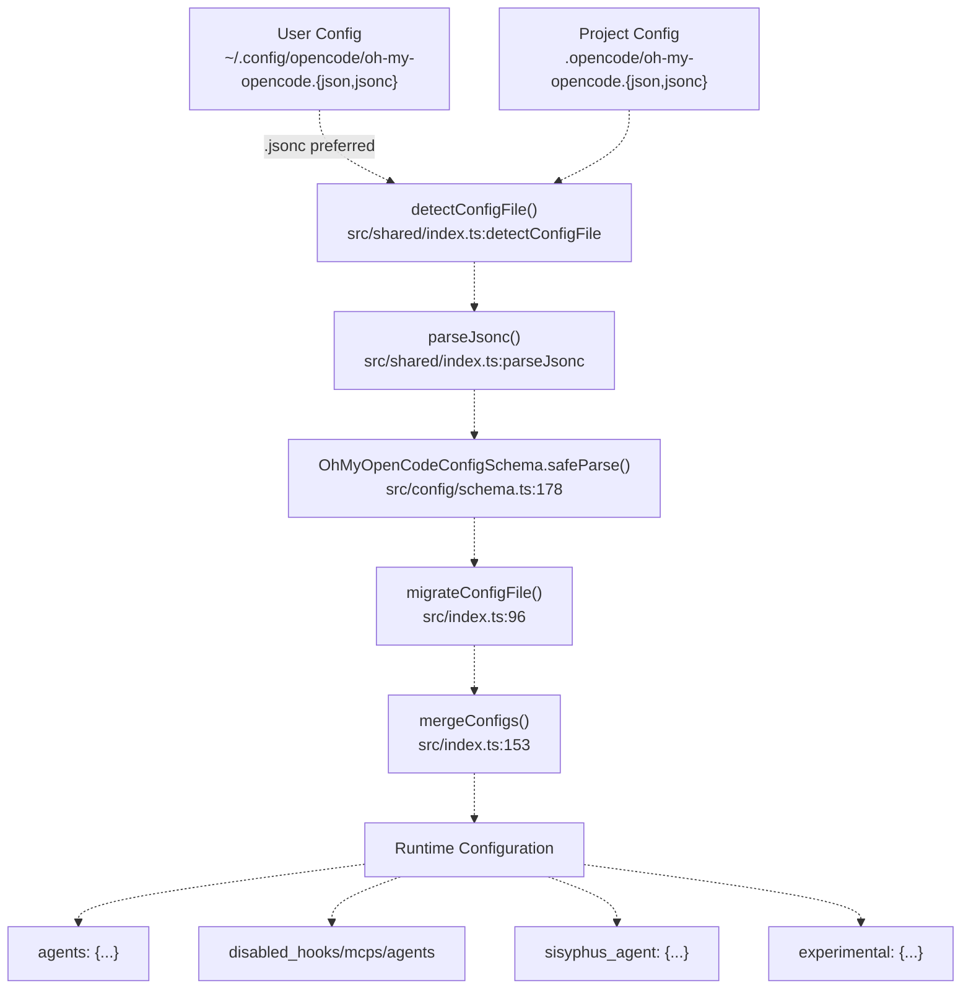

### Configuration Priority

| Priority | Path | OS-Specific Behavior |
| --- | --- | --- |
| 1 (Highest) | `.opencode/oh-my-opencode.{jsonc,json}` | Project-level, `.jsonc` preferred |
| 2 (User) | `~/.config/opencode/oh-my-opencode.{jsonc,json}` | Linux/macOS standard |
| 2 (User) | `%APPDATA%\opencode\oh-my-opencode.{jsonc,json}` | Windows fallback |

**Cross-Platform Path Resolution:**
The `getUserConfigDir()` function (src/shared/config-path.ts:13) implements smart path detection:

* Windows: Checks `~/.config` first (cross-platform), falls back to `%APPDATA%`
* Linux/macOS: Uses `$XDG_CONFIG_HOME` or `~/.config`

### JSONC Support Features

The `parseJsonc()` function supports:

* Line comments: `// comment`
* Block comments: `/* comment */`
* Trailing commas: `{ "key": "value", }`
* File detection prefers `.jsonc` over `.json`

### Configuration Schema

The `OhMyOpenCodeConfigSchema` (Zod schema) validates:

```
// src/config/schema.ts:178-191
{
  disabled_mcps?: Array<"websearch_exa" | "context7" | "grep_app">
  disabled_agents?: Array<"Sisyphus" | "oracle" | "librarian" | ...>
  disabled_hooks?: Array<"todo-continuation-enforcer" | ...>
  disabled_commands?: Array<"init-deep">
  agents?: Record<AgentName, AgentOverrideConfig>
  sisyphus_agent?: { disabled, default_builder_enabled, planner_enabled, replace_plan }
  claude_code?: { mcp, commands, skills, agents, hooks, plugins }
  google_auth?: boolean
  experimental?: { aggressive_truncation, preemptive_compaction, ... }
  auto_update?: boolean
}
```

### Migration System

The `migrateConfigFile()` function (src/index.ts:96) automatically:

* Converts `omo` → `Sisyphus` agent names
* Renames `omo_agent` → `sisyphus_agent` config keys
* Writes migrated config back to disk
* Logs migration actions

### Merge Strategy

The `mergeConfigs()` function (src/index.ts:153) implements deep merge:

* Objects: Recursively merged (project overrides user)
* Arrays: Union of both configs (disabled_* arrays are deduplicated)
* Primitives: Project value takes precedence

**Sources:** [src/index.ts L189-L217](https://github.com/code-yeongyu/oh-my-opencode/blob/b92cd6ab/src/index.ts#L189-L217)

 [src/index.ts L153-L187](https://github.com/code-yeongyu/oh-my-opencode/blob/b92cd6ab/src/index.ts#L153-L187)

 [src/index.ts L96-L123](https://github.com/code-yeongyu/oh-my-opencode/blob/b92cd6ab/src/index.ts#L96-L123)

 [src/config/schema.ts L178-L205](https://github.com/code-yeongyu/oh-my-opencode/blob/b92cd6ab/src/config/schema.ts#L178-L205)

 [src/shared/config-path.ts L13-L33](https://github.com/code-yeongyu/oh-my-opencode/blob/b92cd6ab/src/shared/config-path.ts#L13-L33)

 [src/shared/index.ts](https://github.com/code-yeongyu/oh-my-opencode/blob/b92cd6ab/src/shared/index.ts#LNaN-LNaN)

 [src/shared/index.ts](https://github.com/code-yeongyu/oh-my-opencode/blob/b92cd6ab/src/shared/index.ts#LNaN-LNaN)

## Agent Orchestration Model

The agent system implements a **primary-orchestrator-with-specialists** pattern, where Sisyphus delegates to domain experts based on task classification:

### Orchestration Hierarchy

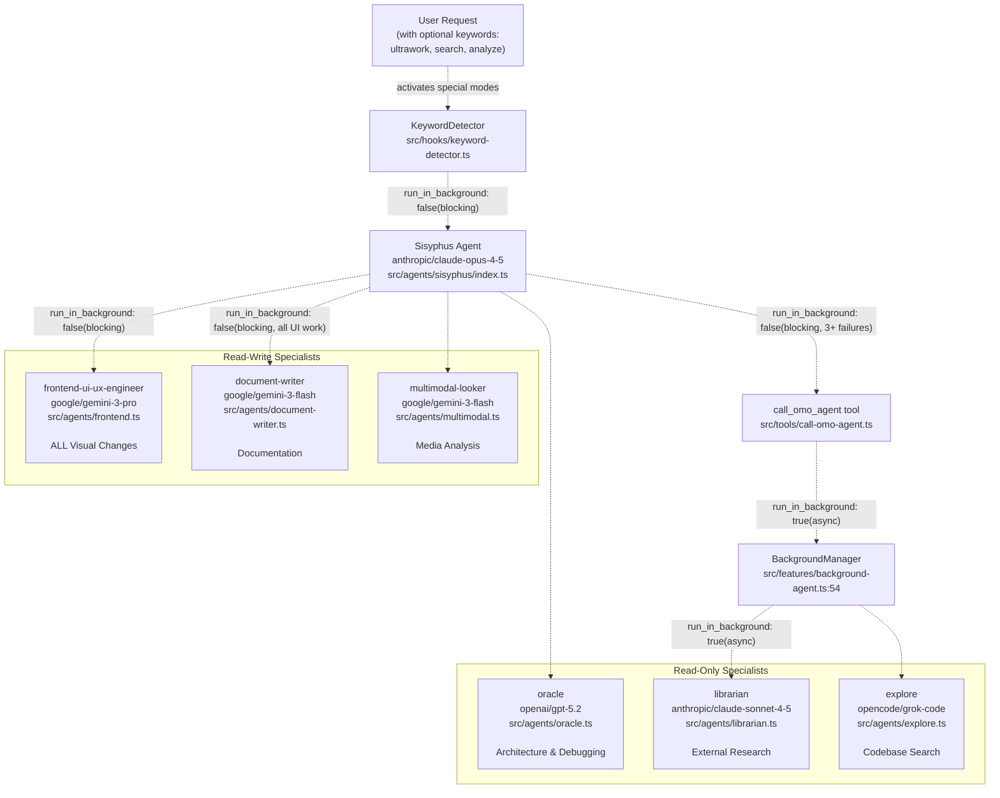

### Agent Factory Implementation

The `createBuiltinAgents()` function (src/agents/index.ts) constructs agents with:

**Agent Configuration Table:**

| Agent | Model | Mode | Tool Access | Delegation Pattern |
| --- | --- | --- | --- | --- |
| `Sisyphus` | `anthropic/claude-opus-4-5` | Primary | All + `background_task` | Aggressive delegation |
| `oracle` | `openai/gpt-5.2` | Subagent | LSP + AST (read-only) | Blocking, expensive reasoning |
| `librarian` | `anthropic/claude-sonnet-4-5` or `google/gemini-3-flash` | Subagent | MCPs + read tools | Parallel async |
| `explore` | `opencode/grok-code` or `google/gemini-3-flash` or `anthropic/claude-haiku-4-5` | Subagent | grep, LSP, AST (read-only) | Parallel async |
| `frontend-ui-ux-engineer` | `google/gemini-3-pro` | Subagent | All except `background_task` | Blocking sync |
| `document-writer` | `google/gemini-3-flash` | Subagent | read + write | Blocking sync |
| `multimodal-looker` | `google/gemini-3-flash` | Subagent | `look_at` only | Blocking sync |

### Delegation Rules

**Clear boundaries prevent overlap:**

* **Oracle**: Called only after 3+ implementation failures for strategic advice
* **Librarian**: External research (docs, GitHub, OSS examples), never touches code
* **Explore**: Internal codebase search with multiple angles, read-only
* **Frontend**: Handles ALL visual changes (Sisyphus NEVER touches styling)
* **DocWriter**: All documentation tasks (README, API docs, guides)
* **Multimodal**: Media file interpretation (PDFs, images, diagrams)

### Background vs Blocking Execution

**Parallel Pattern** (`run_in_background: true`):

* `librarian` and `explore` always run async
* Enables "Gemini builds frontend while Claude handles backend"
* Parent session receives notification on completion

**Blocking Pattern** (`run_in_background: false`):

* `oracle`, `frontend`, `document-writer`, `multimodal` run synchronously
* Prevents recursive spawning (frontend cannot spawn more background tasks)
* Ensures critical decisions get immediate attention

### Model Selection Strategy

Models are chosen based on capabilities:

* **Opus 4.5 High**: Extended thinking (32k budget) for complex orchestration
* **GPT-5.2 Medium**: Stellar logical reasoning for architecture
* **Sonnet 4.5**: Deep codebase understanding and GitHub research
* **Grok Code**: Free, fast contextual grep for exploration
* **Gemini 3 Pro**: Creative UI generation with high quality
* **Gemini 3 Flash**: Efficient for documentation and media analysis

**Configuration Overrides:**
When `opencode-antigravity-auth` is installed, models automatically switch:

* `librarian`: `anthropic/claude-sonnet-4-5` → `google/gemini-3-flash`
* `explore`: `opencode/grok-code` → `google/gemini-3-flash`
* When Claude max20 available: `explore` → `anthropic/claude-haiku-4-5`

**Sources:** [src/agents/index.ts L1-L200](https://github.com/code-yeongyu/oh-my-opencode/blob/b92cd6ab/src/agents/index.ts#L1-L200)

 [src/agents/sisyphus/index.ts L1-L100](https://github.com/code-yeongyu/oh-my-opencode/blob/b92cd6ab/src/agents/sisyphus/index.ts#L1-L100)

 [src/agents/oracle.ts L1-L100](https://github.com/code-yeongyu/oh-my-opencode/blob/b92cd6ab/src/agents/oracle.ts#L1-L100)

 [src/agents/librarian.ts L1-L100](https://github.com/code-yeongyu/oh-my-opencode/blob/b92cd6ab/src/agents/librarian.ts#L1-L100)

 [src/agents/explore.ts L1-L100](https://github.com/code-yeongyu/oh-my-opencode/blob/b92cd6ab/src/agents/explore.ts#L1-L100)

 [src/agents/frontend.ts L1-L100](https://github.com/code-yeongyu/oh-my-opencode/blob/b92cd6ab/src/agents/frontend.ts#L1-L100)

 [src/tools/call-omo-agent.ts L1-L150](https://github.com/code-yeongyu/oh-my-opencode/blob/b92cd6ab/src/tools/call-omo-agent.ts#L1-L150)

 [src/features/background-agent.ts L54-L300](https://github.com/code-yeongyu/oh-my-opencode/blob/b92cd6ab/src/features/background-agent.ts#L54-L300)

## Hook System Architecture

The hook system intercepts OpenCode lifecycle events to inject custom behavior:

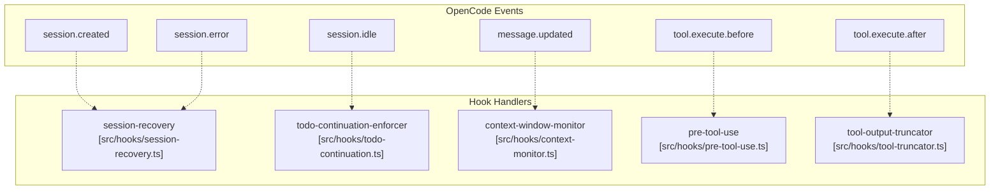

**Sources**: [src/hooks/index.ts L1-L100](https://github.com/code-yeongyu/oh-my-opencode/blob/b92cd6ab/src/hooks/index.ts#L1-L100)

 [src/hooks/session-recovery.ts L1-L200](https://github.com/code-yeongyu/oh-my-opencode/blob/b92cd6ab/src/hooks/session-recovery.ts#L1-L200)

 [src/hooks/todo-continuation.ts L1-L150](https://github.com/code-yeongyu/oh-my-opencode/blob/b92cd6ab/src/hooks/todo-continuation.ts#L1-L150)

 [src/hooks/context-monitor.ts L1-L100](https://github.com/code-yeongyu/oh-my-opencode/blob/b92cd6ab/src/hooks/context-monitor.ts#L1-L100)

The hook registry (`src/hooks/index.ts`) maintains a collection of all hook implementations. Each hook can be individually disabled via the `disabled_hooks` configuration array.

## Tool Enhancement System

The plugin replaces and extends OpenCode's base tools:

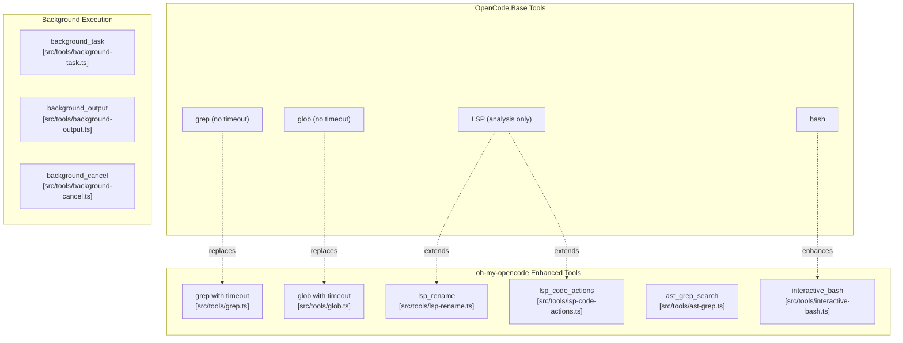

**Sources**: [src/tools/grep.ts L1-L150](https://github.com/code-yeongyu/oh-my-opencode/blob/b92cd6ab/src/tools/grep.ts#L1-L150)

 [src/tools/glob.ts L1-L100](https://github.com/code-yeongyu/oh-my-opencode/blob/b92cd6ab/src/tools/glob.ts#L1-L100)

 [src/tools/lsp-rename.ts L1-L100](https://github.com/code-yeongyu/oh-my-opencode/blob/b92cd6ab/src/tools/lsp-rename.ts#L1-L100)

 [src/tools/lsp-code-actions.ts L1-L100](https://github.com/code-yeongyu/oh-my-opencode/blob/b92cd6ab/src/tools/lsp-code-actions.ts#L1-L100)

 [src/tools/ast-grep.ts L1-L200](https://github.com/code-yeongyu/oh-my-opencode/blob/b92cd6ab/src/tools/ast-grep.ts#L1-L200)

 [src/tools/interactive-bash.ts L1-L300](https://github.com/code-yeongyu/oh-my-opencode/blob/b92cd6ab/src/tools/interactive-bash.ts#L1-L300)

 [src/tools/background-task.ts L1-L200](https://github.com/code-yeongyu/oh-my-opencode/blob/b92cd6ab/src/tools/background-task.ts#L1-L200)

## Background Execution Architecture

The background task system enables parallel agent execution:

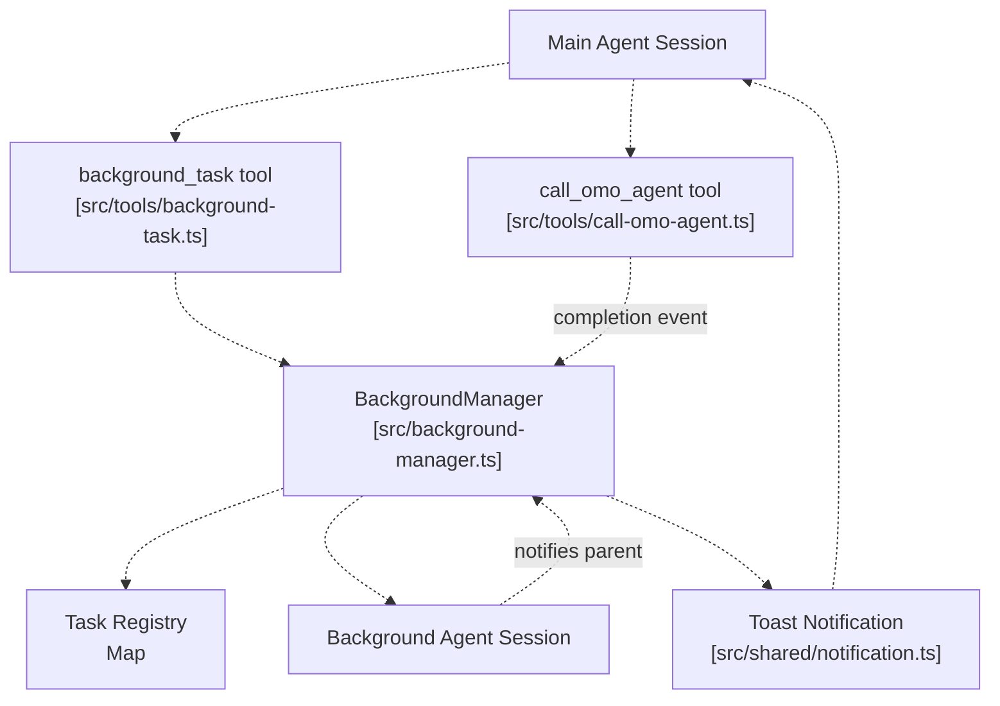

**Sources**: [src/background-manager.ts L1-L300](https://github.com/code-yeongyu/oh-my-opencode/blob/b92cd6ab/src/background-manager.ts#L1-L300)

 [src/tools/background-task.ts L1-L200](https://github.com/code-yeongyu/oh-my-opencode/blob/b92cd6ab/src/tools/background-task.ts#L1-L200)

 [src/tools/call-omo-agent.ts L1-L150](https://github.com/code-yeongyu/oh-my-opencode/blob/b92cd6ab/src/tools/call-omo-agent.ts#L1-L150)

 [src/shared/notification.ts L1-L100](https://github.com/code-yeongyu/oh-my-opencode/blob/b92cd6ab/src/shared/notification.ts#L1-L100)

The `BackgroundManager` class maintains a hierarchical task registry tracking parent-child relationships between sessions. When a background task completes, it notifies the parent session via desktop notification and message injection.

## External Knowledge Integration (MCPs)

The plugin provides three Model Context Protocol (MCP) servers for external knowledge access:

### Built-in MCP Servers

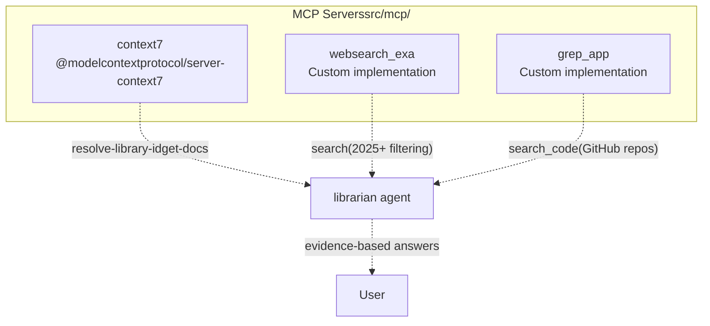

### MCP Configuration

| MCP | Tools | Use Case | Can Disable |
| --- | --- | --- | --- |
| `context7` | `resolve-library-id`, `get-docs` | Official documentation (NPM, PyPI, Cargo, etc.) | `disabled_mcps: ["context7"]` |
| `websearch_exa` | `search` | Real-time web search with 2025+ date filtering | `disabled_mcps: ["websearch_exa"]` |
| `grep_app` | `search_code` | GitHub code search across millions of repos | `disabled_mcps: ["grep_app"]` |

**MCP Creation:**
The `createBuiltinMcps()` function (src/mcp/index.ts) constructs MCP configurations:

* Filters based on `disabled_mcps` config array
* Returns server configurations for OpenCode's MCP system
* Each MCP runs as a separate subprocess with stdio communication

**Agent Access:**

* **Librarian**: Has access to all three MCPs by default
* **Explore**: Can use `grep_app` for external code search
* Other agents: No MCP access (maintain focus boundaries)

### Claude Code MCP Compatibility

The plugin also loads MCPs from Claude Code paths:

* `~/.claude/.mcp.json` (user-level)
* `./.mcp.json` (project-level)
* `./.claude/.mcp.json` (local, git-ignored)

Loaded via `loadMcpConfigs()` in src/features/claude-code-mcp-loader.ts with:

* Environment variable expansion (`${VAR}` syntax)
* Merge with built-in MCPs
* Can disable via `claude_code.mcp: false`

**Sources:** [src/mcp/index.ts L1-L100](https://github.com/code-yeongyu/oh-my-opencode/blob/b92cd6ab/src/mcp/index.ts#L1-L100)

 [src/mcp/builtin.ts L1-L100](https://github.com/code-yeongyu/oh-my-opencode/blob/b92cd6ab/src/mcp/builtin.ts#L1-L100)

 [src/features/claude-code-mcp-loader.ts L1-L150](https://github.com/code-yeongyu/oh-my-opencode/blob/b92cd6ab/src/features/claude-code-mcp-loader.ts#L1-L150)

## Claude Code Compatibility Layer

The plugin maintains full backward compatibility with Claude Code configurations:

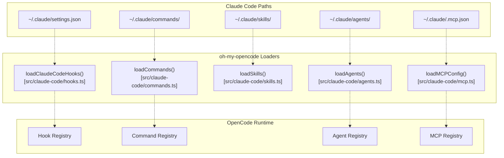

**Sources**: [src/claude-code/hooks.ts L1-L150](https://github.com/code-yeongyu/oh-my-opencode/blob/b92cd6ab/src/claude-code/hooks.ts#L1-L150)

 [src/claude-code/commands.ts L1-L100](https://github.com/code-yeongyu/oh-my-opencode/blob/b92cd6ab/src/claude-code/commands.ts#L1-L100)

 [src/claude-code/skills.ts L1-L100](https://github.com/code-yeongyu/oh-my-opencode/blob/b92cd6ab/src/claude-code/skills.ts#L1-L100)

 [src/claude-code/agents.ts L1-L100](https://github.com/code-yeongyu/oh-my-opencode/blob/b92cd6ab/src/claude-code/agents.ts#L1-L100)

 [src/claude-code/mcp.ts L1-L100](https://github.com/code-yeongyu/oh-my-opencode/blob/b92cd6ab/src/claude-code/mcp.ts#L1-L100)

Each compatibility loader can be individually disabled via the `claude_code` configuration object (`claude_code.hooks`, `claude_code.commands`, etc.).

## State Management

The plugin maintains both in-memory and persistent state:

| State Type | Storage Location | Purpose | Managed By |
| --- | --- | --- | --- |
| Session State | In-memory Maps | Per-session tracking of injected rules, background tasks | Hook handlers |
| Background Tasks | `BackgroundManager` instance | Hierarchical task registry | [src/background-manager.ts L1-L300](https://github.com/code-yeongyu/oh-my-opencode/blob/b92cd6ab/src/background-manager.ts#L1-L300) |
| Interactive Bash | JSON files | tmux session tracking | [src/tools/interactive-bash.ts L1-L300](https://github.com/code-yeongyu/oh-my-opencode/blob/b92cd6ab/src/tools/interactive-bash.ts#L1-L300) |
| Auto-Compact | In-memory flags | Retry tracking for context compaction | [src/hooks/anthropic-auto-compact.ts L1-L200](https://github.com/code-yeongyu/oh-my-opencode/blob/b92cd6ab/src/hooks/anthropic-auto-compact.ts#L1-L200) |

Session-level state is not persisted across plugin reloads. Background task state survives as long as the OpenCode process remains active.

**Sources**: [src/background-manager.ts L1-L300](https://github.com/code-yeongyu/oh-my-opencode/blob/b92cd6ab/src/background-manager.ts#L1-L300)

 [src/tools/interactive-bash.ts L1-L300](https://github.com/code-yeongyu/oh-my-opencode/blob/b92cd6ab/src/tools/interactive-bash.ts#L1-L300)

 [src/hooks/anthropic-auto-compact.ts L1-L200](https://github.com/code-yeongyu/oh-my-opencode/blob/b92cd6ab/src/hooks/anthropic-auto-compact.ts#L1-L200)