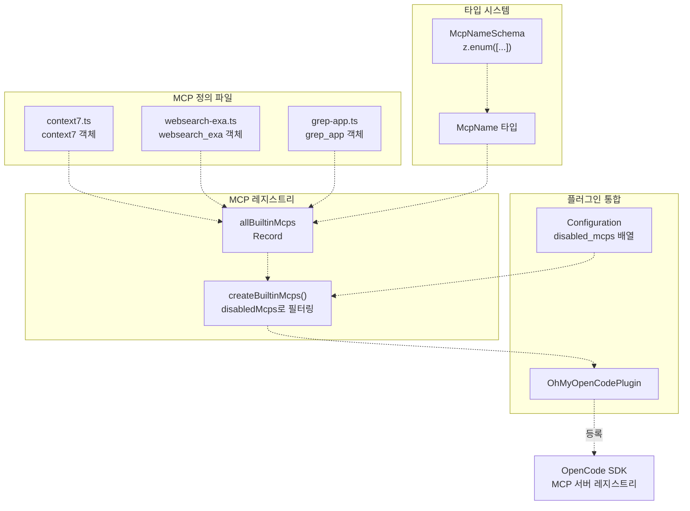
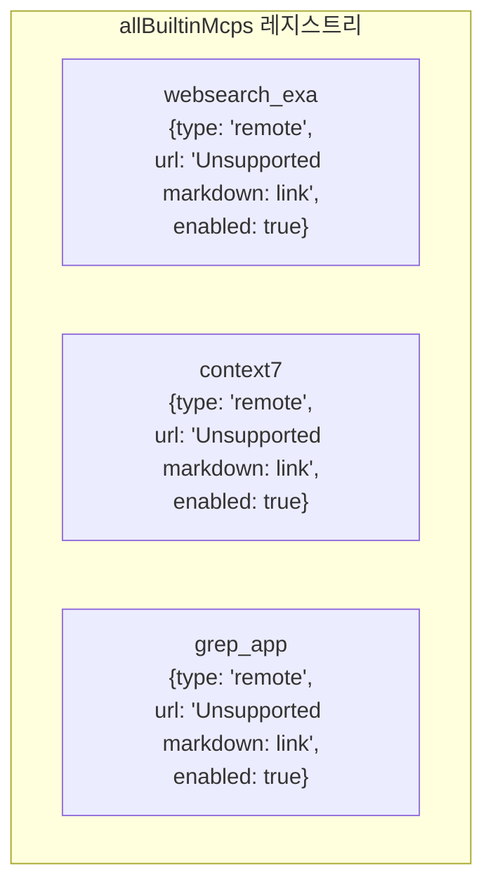
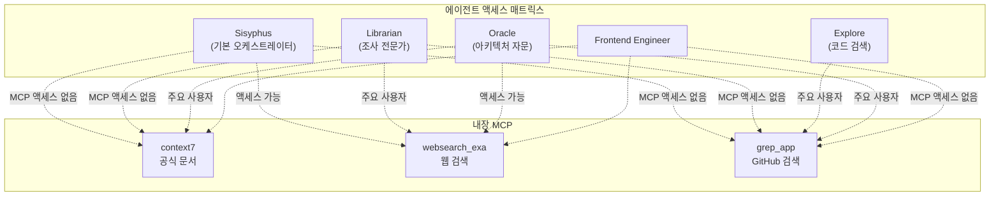

# 내장 MCP (Built-in MCPs)

> **관련 소스 파일**
> * [LICENSE.md](https://github.com/code-yeongyu/oh-my-opencode/blob/b92cd6ab/LICENSE.md)
> * [README.ja.md](https://github.com/code-yeongyu/oh-my-opencode/blob/b92cd6ab/README.ja.md)
> * [README.ko.md](https://github.com/code-yeongyu/oh-my-opencode/blob/b92cd6ab/README.ko.md)
> * [README.md](https://github.com/code-yeongyu/oh-my-opencode/blob/b92cd6ab/README.md)
> * [README.zh-cn.md](https://github.com/code-yeongyu/oh-my-opencode/blob/b92cd6ab/README.zh-cn.md)
> * [src/mcp/context7.ts](https://github.com/code-yeongyu/oh-my-opencode/blob/b92cd6ab/src/mcp/context7.ts)
> * [src/mcp/grep-app.ts](https://github.com/code-yeongyu/oh-my-opencode/blob/b92cd6ab/src/mcp/grep-app.ts)
> * [src/mcp/index.ts](https://github.com/code-yeongyu/oh-my-opencode/blob/b92cd6ab/src/mcp/index.ts)
> * [src/mcp/types.ts](https://github.com/code-yeongyu/oh-my-opencode/blob/b92cd6ab/src/mcp/types.ts)
> * [src/mcp/websearch-exa.ts](https://github.com/code-yeongyu/oh-my-opencode/blob/b92cd6ab/src/mcp/websearch-exa.ts)
> * [src/shared/config-path.ts](https://github.com/code-yeongyu/oh-my-opencode/blob/b92cd6ab/src/shared/config-path.ts)

이 페이지는 공식 문서 조회, 실시간 웹 검색, GitHub 코드 검색 등 외부 지식 소스를 통해 oh-my-opencode를 확장하는 세 가지 내장 MCP(Micro-Capability Provider, 마이크로 기능 제공자)에 대해 설명합니다. 이러한 MCP를 통해 에이전트는 로컬 코드베이스 이외의 정보에 액세스할 수 있습니다.

MCP 통합 아키텍처 및 외부 MCP 서버를 로드하는 방법에 대한 정보는 [MCP 시스템 개요 (MCP System Overview)](/code-yeongyu/oh-my-opencode/8.1-mcp-system-overview)를 참조하십시오. MCP 관련 설정에 대해서는 [설정 (Configuration) > MCPs](#114)를 참조하십시오.

## 개요 (Overview)

oh-my-opencode에는 에이전트에게 외부 지식 기능을 제공하는 세 가지 내장 원격 MCP가 포함되어 있습니다. 각 MCP는 HTTP를 통해 원격 서비스에 연결되며 에이전트가 호출할 수 있는 도구를 노출합니다.

| MCP 이름 | 서비스 URL | 주요 사용 사례 | 사용 에이전트 |
| --- | --- | --- | --- |
| `context7` | [https://mcp.context7.com/mcp](https://mcp.context7.com/mcp) | 공식 패키지 문서 (NPM, PyPI, Cargo 등) | Librarian |
| `websearch_exa` | [https://mcp.exa.ai/mcp](https://mcp.exa.ai/mcp) | 2025년 이후 필터링이 적용된 실시간 웹 검색 | Librarian, Sisyphus |
| `grep_app` | [https://mcp.grep.app](https://mcp.grep.app) | 공개 리포지토리 전체에 대한 GitHub 코드 검색 | Librarian, Explore |

`.mcp.json` 파일에서 로드되는 Claude Code의 커스텀 MCP 서버와 달리, 이러한 내장 MCP는 oh-my-opencode에 의해 직접 등록되며 기본적으로 활성화되어 있습니다. 설정(Configuration)을 통해 선택적으로 비활성화할 수 있습니다.

**출처:** [README.md L565-L568](https://github.com/code-yeongyu/oh-my-opencode/blob/b92cd6ab/README.md#L565-L568)

 [src/mcp/index.ts L8-L12](https://github.com/code-yeongyu/oh-my-opencode/blob/b92cd6ab/src/mcp/index.ts#L8-L12)

## MCP 등록 아키텍처 (MCP Registration Architecture)



**다이어그램: 정의부터 OpenCode SDK까지의 내장 MCP 등록 흐름**

[src/mcp/index.ts L14-L24](https://github.com/code-yeongyu/oh-my-opencode/blob/b92cd6ab/src/mcp/index.ts#L14-L24)에 있는 `createBuiltinMcps` 함수는 설정의 `disabledMcps` 배열을 기반으로 전체 MCP 레지스트리를 필터링합니다. 활성화된 각 MCP는 해당 서비스 URL과 함께 원격 서버로 OpenCode에 등록됩니다.

**출처:** [src/mcp/index.ts L1-L24](https://github.com/code-yeongyu/oh-my-opencode/blob/b92cd6ab/src/mcp/index.ts#L1-L24)

 [src/mcp/types.ts L1-L5](https://github.com/code-yeongyu/oh-my-opencode/blob/b92cd6ab/src/mcp/types.ts#L1-L5)

## MCP 설정 구조 (MCP Configuration Structure)

각 내장 MCP는 동일한 구조를 따릅니다.

```yaml
{
  type: "remote" as const,
  url: string,
  enabled: boolean
}
```

이 설정 객체는 다음을 정의합니다.

* **type**: 항상 `"remote"`이며, MCP가 외부 서비스와 HTTP를 통해 통신함을 나타냅니다.
* **url**: MCP 서비스의 HTTP 엔드포인트입니다.
* **enabled**: 기본 활성화 상태입니다 (세 가지 모두 기본값은 `true`입니다).

[src/mcp/index.ts L8-L12](https://github.com/code-yeongyu/oh-my-opencode/blob/b92cd6ab/src/mcp/index.ts#L8-L12)의 `allBuiltinMcps` 상수는 중앙 레지스트리를 제공합니다.



**다이어그램: 설정 객체를 포함한 내장 MCP 레지스트리 구조**

**출처:** [src/mcp/index.ts L8-L12](https://github.com/code-yeongyu/oh-my-opencode/blob/b92cd6ab/src/mcp/index.ts#L8-L12)

 [src/mcp/context7.ts L1-L5](https://github.com/code-yeongyu/oh-my-opencode/blob/b92cd6ab/src/mcp/context7.ts#L1-L5)

 [src/mcp/websearch-exa.ts L1-L5](https://github.com/code-yeongyu/oh-my-opencode/blob/b92cd6ab/src/mcp/websearch-exa.ts#L1-L5)

 [src/mcp/grep-app.ts L1-L5](https://github.com/code-yeongyu/oh-my-opencode/blob/b92cd6ab/src/mcp/grep-app.ts#L1-L5)

## context7: 공식 문서 MCP

`context7` MCP는 여러 생태계에 걸친 패키지 레지스트리의 공식 문서에 대한 액세스를 제공합니다.

* **NPM**: JavaScript/TypeScript 패키지
* **PyPI**: Python 패키지
* **Cargo**: Rust 크레이트(crates)
* **Maven**: Java 패키지
* **NuGet**: .NET 패키지
* **기타**: 추가 패키지 레지스트리

### 구현 (Implementation)

[src/mcp/context7.ts L1-L5](https://github.com/code-yeongyu/oh-my-opencode/blob/b92cd6ab/src/mcp/context7.ts#L1-L5)에서 `context7` 객체를 정의합니다.

```javascript
export const context7 = {
  type: "remote" as const,
  url: "https://mcp.context7.com/mcp",
  enabled: true,
}
```

### 사용 사례 (Use Cases)

Librarian 에이전트는 다음과 같은 용도로 `context7`을 사용합니다.

* 라이브러리 기능을 구현할 때 API 문서 조회
* 종속성(dependencies)에 대한 올바른 사용 패턴 확인
* 버전 업그레이드를 위한 마이그레이션 가이드 찾기
* 사용 가능한 메서드 및 설정 옵션 탐색

### 도구 액세스 (Tool Access)

등록되면 `context7`은 이름과 선택적으로 버전을 통해 패키지 문서를 쿼리할 수 있는 도구를 노출합니다. 정확한 도구 스키마는 연결 시 원격 MCP 서버에 의해 제공됩니다.

**출처:** [src/mcp/context7.ts L1-L5](https://github.com/code-yeongyu/oh-my-opencode/blob/b92cd6ab/src/mcp/context7.ts#L1-L5)

 [README.md L565](https://github.com/code-yeongyu/oh-my-opencode/blob/b92cd6ab/README.md#L565-L565)

## websearch_exa: 웹 검색 MCP

`websearch_exa` MCP는 Exa AI 검색 엔진을 사용하여 실시간 웹 검색을 가능하게 하며, 오래된 정보를 피하기 위해 최신 콘텐츠(2025년 이후)에 대한 명시적인 필터링을 제공합니다.

### 구현 (Implementation)

[src/mcp/websearch-exa.ts L1-L5](https://github.com/code-yeongyu/oh-my-opencode/blob/b92cd6ab/src/mcp/websearch-exa.ts#L1-L5)에서 `websearch_exa` 객체를 정의합니다.

```javascript
export const websearch_exa = {
  type: "remote" as const,
  url: "https://mcp.exa.ai/mcp?tools=web_search_exa",
  enabled: true,
}
```

URL에 Exa MCP 서버에서 노출할 도구 하위 집합을 지정하는 쿼리 매개변수 `?tools=web_search_exa`가 포함되어 있음에 유의하십시오.

### 사용 사례 (Use Cases)

Librarian과 Sisyphus 모두 다음과 같은 용도로 `websearch_exa`를 사용합니다.

* 신기술에 대한 최신 블로그 게시물 찾기
* 명시적인 최신성 요구 사항이 있는 모범 사례 조사
* 새로 출시된 프레임워크의 주요 변경 사항(breaking changes) 확인
* 특정 문제에 대한 커뮤니티 토론 탐색

2025년 이후 필터링을 통해 에이전트가 현재 라이브러리 동작과 모순될 수 있는 오래된 정보에 의존하지 않도록 보장합니다.

**출처:** [src/mcp/websearch-exa.ts L1-L5](https://github.com/code-yeongyu/oh-my-opencode/blob/b92cd6ab/src/mcp/websearch-exa.ts#L1-L5)

 [README.md L566](https://github.com/code-yeongyu/oh-my-opencode/blob/b92cd6ab/README.md#L566-L566)

## grep_app: GitHub 코드 검색 MCP

`grep_app` MCP는 수백만 개의 공개 GitHub 리포지토리에 대해 초고속 코드 검색을 제공하여 에이전트가 실제 구현 사례를 찾을 수 있도록 합니다.

### 구현 (Implementation)

[src/mcp/grep-app.ts L1-L5](https://github.com/code-yeongyu/oh-my-opencode/blob/b92cd6ab/src/mcp/grep-app.ts#L1-L5)에서 `grep_app` 객체를 정의합니다.

```javascript
export const grep_app = {
  type: "remote" as const,
  url: "https://mcp.grep.app",
  enabled: true,
}
```

### 사용 사례 (Use Cases)

Librarian과 Explore 에이전트 모두 다음과 같은 용도로 `grep_app`을 사용합니다.

* 특정 라이브러리 API의 구현 사례 찾기
* 다른 프로젝트에서 유사한 기능을 어떻게 구성하는지 탐색
* 복잡한 시나리오에 대한 테스트 케이스 위치 확인
* 예외 상황(edge case) 처리 패턴 조사

grep.app 서비스는 공개 GitHub 리포지토리를 인덱싱하고 정규식 지원과 함께 빠른 전체 텍스트 검색을 제공합니다.

### 성능 특성 (Performance Characteristics)

로컬 코드 검색 도구(LSP, ast-grep)와 달리 `grep_app`은 외부 리포지토리를 검색합니다. 이는 다음을 의미합니다.

* 더 높은 지연 시간 (원격 서비스에 대한 네트워크 요청)
* 더 넓은 범위 (단일 코드베이스가 아닌 수백만 개의 리포지토리)
* 다른 사용 사례 (로컬 코드 탐색이 아닌 외부 사례 찾기)

**출처:** [src/mcp/grep-app.ts L1-L5](https://github.com/code-yeongyu/oh-my-opencode/blob/b92cd6ab/src/mcp/grep-app.ts#L1-L5)

 [README.md L567](https://github.com/code-yeongyu/oh-my-opencode/blob/b92cd6ab/README.md#L567-L567)

## 에이전트 액세스 패턴 (Agent Access Patterns)



**다이어그램: 내장 MCP에 대한 에이전트 액세스 패턴**

### 액세스 제어 전략 (Access Control Strategy)

에이전트 시스템은 에이전트의 책임에 따라 MCP 액세스를 차별화합니다.

* **Sisyphus (전체 액세스)**: 기본 오케스트레이터로서 Sisyphus는 모든 MCP에 제한 없이 액세스할 수 있습니다. 그러나 시스템 설계상 백그라운드 작업을 통해 전문 에이전트에게 조사 작업을 위임하는 것을 권장합니다.
* **Librarian (주요 사용자)**: Librarian의 전체 목적은 외부 조사이므로 세 가지 MCP 모두의 주요 소비자입니다. 프롬프트는 문서 조회, 구현 사례 및 웹 조사를 위해 이러한 도구를 사용하도록 명시적으로 안내합니다.
* **Explore (grep_app 전용)**: Explore는 GitHub 리포지토리에서 코드 패턴을 찾기 위해 `grep_app`을 사용합니다. 문서나 일반 웹 검색 기능은 필요하지 않습니다.
* **Oracle (액세스 없음)**: Oracle은 아키텍처 결정에 집중하는 고비용 추론 모델(GPT-5.2)입니다. 조사를 수행하기보다는 제공된 정보를 바탕으로 작동하므로, 낭비적인 API 호출을 방지하기 위해 MCP 액세스가 거부됩니다.
* **Frontend/DocWriter/Multimodal (액세스 없음)**: 이러한 전문 에이전트는 특정 구현 작업에 집중하며 외부 조사 기능이 필요하지 않습니다.

**출처:** [README.md L565-L568](https://github.com/code-yeongyu/oh-my-opencode/blob/b92cd6ab/README.md#L565-L568)

 상위 수준 아키텍처 다이어그램

## 설정 및 선택적 비활성화 (Configuration and Selective Disabling)

내장 MCP는 `disabled_mcps` 설정 배열을 통해 비활성화할 수 있습니다.

```json
{
  "disabled_mcps": ["websearch_exa", "grep_app"]
}
```

사용자 수준(`~/.config/opencode/oh-my-opencode.json`) 또는 프로젝트 수준(`.opencode/oh-my-opencode.json`)에서의 이 설정은 지정된 MCP가 등록되는 것을 방지합니다.

### 타입 안전성 (Type Safety)

[src/mcp/types.ts L3](https://github.com/code-yeongyu/oh-my-opencode/blob/b92cd6ab/src/mcp/types.ts#L3-L3)의 `McpNameSchema`는 Zod의 enum 타입을 사용하여 타입 안전한 MCP 이름을 보장합니다.

```javascript
export const McpNameSchema = z.enum(["websearch_exa", "context7", "grep_app"])
export type McpName = z.infer<typeof McpNameSchema>
```

`disabled_mcps` 배열의 잘못된 MCP 이름은 설정 유효성 검사 중에 포착됩니다.

### 필터링 로직 (Filtering Logic)

[src/mcp/index.ts L14-L24](https://github.com/code-yeongyu/oh-my-opencode/blob/b92cd6ab/src/mcp/index.ts#L14-L24)의 `createBuiltinMcps` 함수는 필터링을 구현합니다.

1. `allBuiltinMcps`의 모든 항목을 반복합니다.
2. 각 MCP에 대해 해당 이름이 `disabledMcps` 배열에 있는지 확인합니다.
3. 비활성화되지 않은 경우 반환될 레지스트리에 포함합니다.
4. OpenCode 등록을 위해 필터링된 레지스트리를 반환합니다.

이 접근 방식은 다음을 보장합니다.

* 기본 동작은 모든 MCP를 포함합니다 (`disabledMcps` 배열이 비어 있음).
* 명시적인 거부 메커니즘을 제공합니다 (비활성화할 MCP 목록 작성).
* 부분적인 상태가 없습니다 (MCP는 완전히 활성화되거나 완전히 비활성화됨).

**출처:** [src/mcp/index.ts L14-L24](https://github.com/code-yeongyu/oh-my-opencode/blob/b92cd6ab/src/mcp/index.ts#L14-L24)

 [src/mcp/types.ts L1-L5](https://github.com/code-yeongyu/oh-my-opencode/blob/b92cd6ab/src/mcp/types.ts#L1-L5)

 [README.md L114](https://github.com/code-yeongyu/oh-my-opencode/blob/b92cd6ab/README.md#L114-L114)

## Claude Code MCP 로더와의 관계 (Relationship to Claude Code MCP Loader)

내장 MCP는 Claude Code의 커스텀 MCP 시스템과 구별됩니다.

| 기능 | 내장 MCP | Claude Code MCP |
| --- | --- | --- |
| 정의 위치 | `src/mcp/*.ts` | `.mcp.json` 파일 |
| 등록 | 자동 (플러그인을 통해) | 파일 시스템에서 로드 |
| 설정 | `disabled_mcps` 배열 | `claude_code.mcp` 토글 |
| 기본 상태 | 활성화 | 활성화 (`claude_code.mcp`가 true인 경우) |
| 서비스 유형 | 항상 원격 (remote) | 원격 또는 stdio |

두 시스템은 공존합니다. 일반적인 oh-my-opencode 설치에는 다음이 포함됩니다.

* **3개의 내장 MCP** (context7, websearch_exa, grep_app)
* **0개 이상의 커스텀 MCP** (`~/.claude/.mcp.json`, `./.mcp.json`, 또는 `./.claude/.mcp.json`에서 로드)

커스텀 MCP 로더([설정 마이그레이션 (Configuration Migration)](/code-yeongyu/oh-my-opencode/9.1-configuration-migration) 참조)는 `claude_code.mcp` 토글을 따릅니다. 내장 MCP는 별도의 `disabled_mcps` 배열을 사용합니다.

**출처:** [README.md L656-L663](https://github.com/code-yeongyu/oh-my-opencode/blob/b92cd6ab/README.md#L656-L663)

 [src/mcp/index.ts L1-L24](https://github.com/code-yeongyu/oh-my-opencode/blob/b92cd6ab/src/mcp/index.ts#L1-L24)

## 원격 MCP 통신 (Remote MCP Communication)

세 가지 내장 MCP 모두 `"remote"` 유형을 사용하며, 이는 외부 서비스와의 HTTP 기반 통신을 나타냅니다. OpenCode SDK는 다음을 처리합니다.

1. **연결 수립**: MCP 서버와의 초기 HTTP 핸드셰이크
2. **도구 검색**: 서버에서 사용 가능한 도구 및 해당 스키마 가져오기
3. **도구 호출**: 인수와 함께 도구 호출 요청을 보내고 결과 수신
4. **오류 처리**: 타임아웃, 네트워크 장애 및 서비스 오류 관리

플러그인 자체는 URL과 활성화 상태만 제공합니다. 실제 MCP 프로토콜 구현은 OpenCode SDK에 있습니다.

### 서비스 종속성 (Service Dependencies)

내장 MCP는 외부 서비스에 의존합니다.

* **context7.com**: 문서 쿼리를 위해 연결 가능해야 함
* **exa.ai**: 웹 검색을 위해 연결 가능해야 함
* **grep.app**: GitHub 코드 검색을 위해 연결 가능해야 함

서비스를 사용할 수 없는 경우 해당 MCP에 대한 도구 호출이 실패합니다. 에이전트는 사용자에게 오류를 보고하고 잠재적으로 재시도하거나 대안적인 접근 방식을 사용하여 이러한 실패를 적절히 처리합니다.

**출처:** [src/mcp/context7.ts L1-L5](https://github.com/code-yeongyu/oh-my-opencode/blob/b92cd6ab/src/mcp/context7.ts#L1-L5)

 [src/mcp/websearch-exa.ts L1-L5](https://github.com/code-yeongyu/oh-my-opencode/blob/b92cd6ab/src/mcp/websearch-exa.ts#L1-L5)

 [src/mcp/grep-app.ts L1-L5](https://github.com/code-yeongyu/oh-my-opencode/blob/b92cd6ab/src/mcp/grep-app.ts#L1-L5)