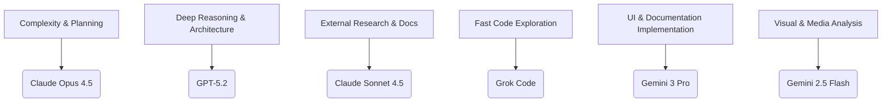
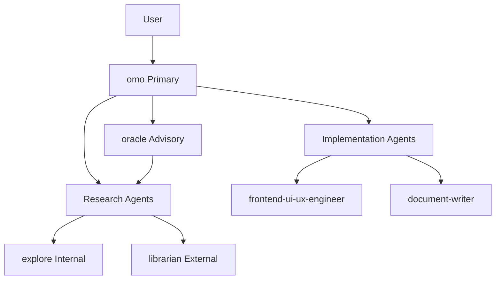

# 에이전트 레퍼런스 테이블 (Agent Reference Table)

> **관련 소스 파일**
> * [.github/assets/sisyphus.png](https://github.com/code-yeongyu/oh-my-opencode/blob/b92cd6ab/.github/assets/sisyphus.png)
> * [README.ja.md](https://github.com/code-yeongyu/oh-my-opencode/blob/b92cd6ab/README.ja.md)
> * [README.ko.md](https://github.com/code-yeongyu/oh-my-opencode/blob/b92cd6ab/README.ko.md)
> * [README.md](https://github.com/code-yeongyu/oh-my-opencode/blob/b92cd6ab/README.md)
> * [README.zh-cn.md](https://github.com/code-yeongyu/oh-my-opencode/blob/b92cd6ab/README.zh-cn.md)
> * [src/agents/document-writer.ts](https://github.com/code-yeongyu/oh-my-opencode/blob/b92cd6ab/src/agents/document-writer.ts)
> * [src/agents/explore.ts](https://github.com/code-yeongyu/oh-my-opencode/blob/b92cd6ab/src/agents/explore.ts)
> * [src/agents/frontend-ui-ux-engineer.ts](https://github.com/code-yeongyu/oh-my-opencode/blob/b92cd6ab/src/agents/frontend-ui-ux-engineer.ts)
> * [src/agents/index.ts](https://github.com/code-yeongyu/oh-my-opencode/blob/b92cd6ab/src/agents/index.ts)
> * [src/agents/librarian.ts](https://github.com/code-yeongyu/oh-my-opencode/blob/b92cd6ab/src/agents/librarian.ts)
> * [src/agents/multimodal-looker.ts](https://github.com/code-yeongyu/oh-my-opencode/blob/b92cd6ab/src/agents/multimodal-looker.ts)
> * [src/agents/oracle.ts](https://github.com/code-yeongyu/oh-my-opencode/blob/b92cd6ab/src/agents/oracle.ts)
> * [src/agents/sisyphus.ts](https://github.com/code-yeongyu/oh-my-opencode/blob/b92cd6ab/src/agents/sisyphus.ts)
> * [src/agents/types.ts](https://github.com/code-yeongyu/oh-my-opencode/blob/b92cd6ab/src/agents/types.ts)
> * [src/agents/utils.test.ts](https://github.com/code-yeongyu/oh-my-opencode/blob/b92cd6ab/src/agents/utils.test.ts)
> * [src/agents/utils.ts](https://github.com/code-yeongyu/oh-my-opencode/blob/b92cd6ab/src/agents/utils.ts)
> * [src/shared/config-path.ts](https://github.com/code-yeongyu/oh-my-opencode/blob/b92cd6ab/src/shared/config-path.ts)

이 페이지는 oh-my-opencode 플러그인에 내장된 모든 에이전트에 대한 빠른 참조를 제공합니다. 각 에이전트는 특정 작업에 특화되어 있으며 해당 도메인에 최적화된 모델을 사용합니다. 개별 에이전트에 대한 자세한 정보는 [4.1](/code-yeongyu/oh-my-opencode/4.1-sisyphus-orchestrator)부터 [4.5](#4.5) 섹션을 참조하십시오. 에이전트 설정 및 커스터마이징에 대해서는 [에이전트 설정(Agent Configuration)](#4.6)을 참조하십시오.

## 에이전트 개요 (Agent Overview)

플러그인은 오케스트레이션(orchestration), 리서치(research), 구현(implementation)의 세 가지 계층으로 구성된 7개의 전문 에이전트를 제공합니다. OmO를 제외한 모든 에이전트는 `call_omo_agent` 도구([에이전트 호출 도구](/code-yeongyu/oh-my-opencode/5.3-background-task-tools) 참조) 또는 `background_task` 도구([백그라운드 도구](/code-yeongyu/oh-my-opencode/6.2-task-execution-and-polling) 참조)를 통해 호출되는 서브에이전트(subagent)로 작동합니다.

### 주요 에이전트 (Primary Agents)

| 에이전트 | 모드 | 모델 | Temperature | Thinking Budget | Max Tokens | 주요 역할 |
| --- | --- | --- | --- | --- | --- | --- |
| **omo** | `primary` | `anthropic/claude-opus-4-5` | 기본값 | 32000 | 64000 | 작업 오케스트레이션, 위임, 계획 |

### 리서치 및 탐색 에이전트 (Research & Discovery Agents)

| 에이전트 | 모드 | 모델 | Temperature | 특별 설정 | 주요 역할 |
| --- | --- | --- | --- | --- | --- |
| **oracle** | `subagent` | `openai/gpt-5.2` | 0.1 | `reasoningEffort: medium``textVerbosity: high` | 아키텍처 리뷰, 기술적 의사결정 |
| **explore** | `subagent` | `opencode/grok-code` | 0.1 | - | 빠른 내부 코드베이스 탐색 (읽기 전용) |
| **librarian** | `subagent` | `anthropic/claude-sonnet-4-5` | 0.1 | - | 외부 리서치, 문서화, GitHub (읽기 전용) |

### 구현 에이전트 (Implementation Agents)

| 에이전트 | 모드 | 모델 | Temperature | 주요 역할 |
| --- | --- | --- | --- | --- |
| **frontend-ui-ux-engineer** | `subagent` | `google/gemini-3-pro-preview` | 기본값 | UI/UX 구현, 시각적 작업 |
| **document-writer** | `subagent` | `google/gemini-3-pro-preview` | 기본값 | 기술 문서 생성 |
| **multimodal-looker** | `subagent` | `google/gemini-2.5-flash` | 0.1 | 미디어 파일 분석 (PDF, 이미지) |

출처: [src/agents/omo.ts L765-L777](https://github.com/code-yeongyu/oh-my-opencode/blob/b92cd6ab/src/agents/omo.ts#L765-L777)

 [src/agents/oracle.ts L3-L11](https://github.com/code-yeongyu/oh-my-opencode/blob/b92cd6ab/src/agents/oracle.ts#L3-L11)

 [src/agents/explore.ts L3-L9](https://github.com/code-yeongyu/oh-my-opencode/blob/b92cd6ab/src/agents/explore.ts#L3-L9)

 [src/agents/librarian.ts L3-L9](https://github.com/code-yeongyu/oh-my-opencode/blob/b92cd6ab/src/agents/librarian.ts#L3-L9)

 [src/agents/frontend-ui-ux-engineer.ts L3-L7](https://github.com/code-yeongyu/oh-my-opencode/blob/b92cd6ab/src/agents/frontend-ui-ux-engineer.ts#L3-L7)

 [src/agents/document-writer.ts L3-L8](https://github.com/code-yeongyu/oh-my-opencode/blob/b92cd6ab/src/agents/document-writer.ts#L3-L8)

 [src/agents/multimodal-looker.ts L3-L9](https://github.com/code-yeongyu/oh-my-opencode/blob/b92cd6ab/src/agents/multimodal-looker.ts#L3-L9)

## 에이전트 역량 매트릭스 (Agent Capabilities Matrix)

### 도구 권한 (Tool Permissions)

각 에이전트는 역할에 따라 엄격하게 제한된 도구 접근 권한을 가집니다:

| 에이전트 | read | write | edit | bash | task | call_omo_agent | background_task | 특별 도구 |
| --- | --- | --- | --- | --- | --- | --- | --- | --- |
| **omo** | ✓ | ✓ | ✓ | ✓ | ✓ | ✓ | ✓ | 모든 LSP, AST, 파일 시스템 도구 |
| **oracle** | ✓ | ✗ | ✗ | ✗ | ✗ | ✓ | ✗ | 분석 전용, explore/librarian 호출 가능 |
| **explore** | ✓ | ✗ | ✗ | ✓ | ✗ | ✗ | ✗ | 읽기 전용 bash (git 명령어) |
| **librarian** | ✓ | ✗ | ✗ | ✓ | ✗ | ✗ | ✗ | 읽기 전용 bash, context7, websearch_exa |
| **frontend-ui-ux-engineer** | ✓ | ✓ | ✓ | ✓ | ✓ | ✓ | ✗ | UI 파일에 대한 전체 쓰기 권한 |
| **document-writer** | ✓ | ✓ | ✓ | ✓ | ✓ | ✓ | ✗ | 문서에 대한 전체 쓰기 권한 |
| **multimodal-looker** | ✓ | ✗ | ✗ | ✗ | ✗ | ✗ | ✗ | 미디어 파일 읽기 전용 |

**주요 제약 사항:**

* **읽기 전용 에이전트** (explore, librarian): 실수로 인한 변경을 방지하기 위해 파일을 수정하거나 백그라운드 작업을 생성할 수 없습니다.
* **Oracle**: 리서치를 위해 `call_omo_agent`를 통해 explore/librarian을 호출할 수 있지만, 파일을 편집할 수는 없습니다.
* **Multimodal looker**: 격리된 컨텍스트 창(context window)을 사용하며, 단일 목적의 분석만 수행합니다.

출처: [src/agents/omo.ts L765-L777](https://github.com/code-yeongyu/oh-my-opencode/blob/b92cd6ab/src/agents/omo.ts#L765-L777)

 [src/agents/oracle.ts L11](https://github.com/code-yeongyu/oh-my-opencode/blob/b92cd6ab/src/agents/oracle.ts#L11-L11)

 [src/agents/explore.ts L9](https://github.com/code-yeongyu/oh-my-opencode/blob/b92cd6ab/src/agents/explore.ts#L9-L9)

 [src/agents/librarian.ts L9](https://github.com/code-yeongyu/oh-my-opencode/blob/b92cd6ab/src/agents/librarian.ts#L9-L9)

 [src/agents/frontend-ui-ux-engineer.ts L8](https://github.com/code-yeongyu/oh-my-opencode/blob/b92cd6ab/src/agents/frontend-ui-ux-engineer.ts#L8-L8)

 [src/agents/document-writer.ts L8](https://github.com/code-yeongyu/oh-my-opencode/blob/b92cd6ab/src/agents/document-writer.ts#L8-L8)

 [src/agents/multimodal-looker.ts L9](https://github.com/code-yeongyu/oh-my-opencode/blob/b92cd6ab/src/agents/multimodal-looker.ts#L9-L9)

## 모델 선정 근거 (Model Selection Rationale)

### 모델별 목적 매핑 (Model-to-Purpose Mapping)



**설계 철학:**

* **오케스트레이션을 위한 Opus**: 복잡한 계획 및 위임을 위한 최고 성능 모델
* **추론을 위한 GPT-5.2**: 아키텍처 결정을 위한 고급 추론 능력
* **리서치를 위한 Sonnet**: Opus 수준의 비용 부담 없이 고품질 외부 리서치 수행
* **탐색을 위한 Grok**: 내부 검색을 위한 빠르고 코드에 특화된 모델
* **구현을 위한 Gemini Pro**: UI 및 문서 작성을 위한 비용 효율적인 코드 생성
* **미디어를 위한 Gemini Flash**: 초고속, 저비용 멀티모달 분석

출처: [src/agents/omo.ts L769](https://github.com/code-yeongyu/oh-my-opencode/blob/b92cd6ab/src/agents/omo.ts#L769-L769)

 [src/agents/oracle.ts L7](https://github.com/code-yeongyu/oh-my-opencode/blob/b92cd6ab/src/agents/oracle.ts#L7-L7)

 [src/agents/explore.ts L7](https://github.com/code-yeongyu/oh-my-opencode/blob/b92cd6ab/src/agents/explore.ts#L7-L7)

 [src/agents/librarian.ts L7](https://github.com/code-yeongyu/oh-my-opencode/blob/b92cd6ab/src/agents/librarian.ts#L7-L7)

 [src/agents/frontend-ui-ux-engineer.ts L7](https://github.com/code-yeongyu/oh-my-opencode/blob/b92cd6ab/src/agents/frontend-ui-ux-engineer.ts#L7-L7)

 [src/agents/document-writer.ts L7](https://github.com/code-yeongyu/oh-my-opencode/blob/b92cd6ab/src/agents/document-writer.ts#L7-L7)

 [src/agents/multimodal-looker.ts L7](https://github.com/code-yeongyu/oh-my-opencode/blob/b92cd6ab/src/agents/multimodal-looker.ts#L7-L7)

## 에이전트 호출 패턴 (Agent Invocation Patterns)

### 위임 계층 구조 (Delegation Hierarchy)



**호출 방법:**

| 패턴 | 에이전트 | 메서드 | 유스케이스 |
| --- | --- | --- | --- |
| **병렬 백그라운드** | explore, librarian | `background_task(agent="explore", prompt=...)` | 2~3개 이상의 에이전트를 실행하고 작업을 계속한 뒤, 나중에 `background_output`으로 결과 수집 |
| **동기식** | frontend-ui-ux-engineer, document-writer | `task(subagent_type="frontend-ui-ux-engineer", prompt=...)` | 완료될 때까지 대기(Block), 전체 결과 반환 |
| **자문형** | oracle | `task(subagent_type="oracle", prompt=...)` 또는 `call_omo_agent(...)` | 의사결정을 위한 자문, 대기 방식 |
| **격리된 컨텍스트** | multimodal-looker | `look_at(file_path=..., goal=...)` | 별도의 컨텍스트 창 사용, 추출된 데이터만 반환 |

출처: [src/agents/omo.ts L145-L169](https://github.com/code-yeongyu/oh-my-opencode/blob/b92cd6ab/src/agents/omo.ts#L145-L169)

 [src/agents/omo.ts L322-L345](https://github.com/code-yeongyu/oh-my-opencode/blob/b92cd6ab/src/agents/omo.ts#L322-L345)

 [src/tools/background-task/constants.ts L1-L17](https://github.com/code-yeongyu/oh-my-opencode/blob/b92cd6ab/src/tools/background-task/constants.ts#L1-L17)

 [src/tools/call-omo-agent/constants.ts L3-L25](https://github.com/code-yeongyu/oh-my-opencode/blob/b92cd6ab/src/tools/call-omo-agent/constants.ts#L3-L25)

 [src/tools/look-at/constants.ts L3-L10](https://github.com/code-yeongyu/oh-my-opencode/blob/b92cd6ab/src/tools/look-at/constants.ts#L3-L10)

## 에이전트별 사용 시점

### 의사결정 테이블 (Decision Table)

| 질문 | 에이전트 | 이유 | 호출 방식 |
| --- | --- | --- | --- |
| 시스템 아키텍처를 설계해야 합니까? | **oracle** | 심층 추론, 아키텍처 전문 지식 | `call_omo_agent` 또는 `task` |
| 코드를 리뷰해야 합니까? | **oracle** | 전문적인 코드 분석, 보안 리뷰 | `call_omo_agent` 또는 `task` |
| 복잡한 문제를 디버깅해야 합니까? | **oracle** | 고급 디버깅 전략 | `call_omo_agent` 또는 `task` |
| 현재 코드베이스에서 코드를 찾아야 합니까? | **explore** (2-3개 병렬) | 빠른 내부 검색, 병렬 처리 적합 | `background_task(agent="explore")` |
| 모듈 구조를 이해해야 합니까? | **explore** (2-3개 병렬) | 문맥적 코드 이해 | `background_task(agent="explore")` |
| 공식 라이브러리 문서가 필요합니까? | **librarian** | Context7 + 웹 검색 | `background_task(agent="librarian")` |
| GitHub 코드 예제가 필요합니까? | **librarian** | GitHub CLI, grep.app | `background_task(agent="librarian")` |
| OSS 참조 구현이 필요합니까? | **librarian** | 원격 저장소 클로닝 및 분석 | `background_task(agent="librarian")` |
| 모든 UI/프런트엔드 작업 | **frontend-ui-ux-engineer** | .tsx/.jsx/.vue/.css 파일에 대해 필수적으로 위임 | `task(subagent_type="frontend-ui-ux-engineer")` |
| 문서를 작성해야 합니까? | **document-writer** | 기술 문서 작성, README, API 문서 | `task(subagent_type="document-writer")` |
| PDF나 이미지를 분석해야 합니까? | **multimodal-looker** | Gemini 멀티모달, 별도 컨텍스트 | `look_at(file_path=..., goal=...)` |

### 병렬 실행 가이드라인 (Parallel Execution Guidelines)

**리서치 에이전트 (explore, librarian):**

* 항상 백그라운드 작업으로 실행하십시오: `background_task(agent="explore", prompt=...)`
* 서로 다른 초점을 가진 2~3개를 병렬로 실행하십시오.
* 기다리지 말고 즉시 작업을 계속하십시오.
* 나중에 `background_output(task_id=...)`를 사용하여 결과를 수집하십시오.

**구현 에이전트 (frontend, document-writer):**

* 동기식 `task(subagent_type=...)` 호출을 사용하십시오.
* 완료될 때까지 대기(Block)합니다.
* 백그라운드에서 실행할 수 없습니다.

**자문 에이전트 (oracle):**

* 단순한 질의가 아닌 복잡한 의사결정에 사용하십시오.
* 일반적으로 동기식 자문을 수행합니다.
* 추가 리서치를 위해 explore/librarian을 호출할 수 있습니다.

출처: [src/agents/omo.ts L219-L278](https://github.com/code-yeongyu/oh-my-opencode/blob/b92cd6ab/src/agents/omo.ts#L219-L278)

 [src/agents/omo.ts L281-L318](https://github.com/code-yeongyu/oh-my-opencode/blob/b92cd6ab/src/agents/omo.ts#L281-L318)

 [src/agents/omo.ts L504-L513](https://github.com/code-yeongyu/oh-my-opencode/blob/b92cd6ab/src/agents/omo.ts#L504-L513)

 [src/tools/background-task/constants.ts L1-L17](https://github.com/code-yeongyu/oh-my-opencode/blob/b92cd6ab/src/tools/background-task/constants.ts#L1-L17)

## 에이전트 프롬프트 구조 (Agent Prompt Structures)

### 7개 섹션 프롬프트 템플릿 (`task` 호출 시 필수)

`task(subagent_type=...)`를 통해 에이전트를 호출할 때 다음 구조를 사용하십시오:

```yaml
TASK: [수행할 작업 - 매우 구체적으로 작성]
EXPECTED OUTCOME: [구체적인 결과물]
REQUIRED SKILLS: [호출할 기술/역량]
REQUIRED TOOLS: [사용할 도구]
MUST DO: [철저한 요구사항 - 암묵적인 내용을 남기지 말 것]
MUST NOT DO: [금지된 작업 - 예상되는 잘못된 행동 방지]
CONTEXT: [파일 경로, 제약 조건, 관련 정보]
```

**예시 - 프런트엔드 위임:**

```python
task(subagent_type="frontend-ui-ux-engineer", prompt="""
TASK: Implement responsive navigation bar with hamburger menu
EXPECTED OUTCOME: Working navigation component with mobile breakpoint at 768px
REQUIRED SKILLS: frontend-ui-ux-engineer
REQUIRED TOOLS: read, edit, grep (for existing patterns)
MUST DO: Follow existing design system, match current styling patterns
MUST NOT DO: Add new dependencies, break existing styles
CONTEXT: src/components/Header.tsx, use Tailwind classes from tailwind.config.js
""")
```

### 백그라운드 작업 프롬프트 (explore, librarian용)

`background_task(agent=...)` 호출 시 상세하고 집중된 프롬프트를 제공하십시오:

**예시 - Explore 에이전트:**

```typescript
background_task(agent="explore", prompt="Find all occurrences of the 'AuthContext' and analyze how the 'user' object is updated across the application. Focus on identifying potential race conditions during login.")
```

**예시 - Librarian 에이전트:**

```typescript
background_task(agent="librarian", prompt="Research the latest documentation for 'TanStack Query v5' regarding 'infinite queries'. Find a GitHub example that implements this with 'React Table'.")
```

**핵심 규칙:**

* 사용자의 언어와 상관없이 항상 **영어**로 프롬프트를 작성하십시오 (LLM 성능이 더 좋습니다).
* 단순한 키워드가 아니라 무엇을 찾아야 하는지 구체적으로 명시하십시오.
* explore의 경우: 철저함 수준("quick", "medium", "very thorough")을 지정하십시오.
* librarian의 경우: 유형(문서, GitHub, OSS 구현)을 지정하십시오.

출처: [src/agents/omo.ts L346-L360](https://github.com/code-yeongyu/oh-my-opencode/blob/b92cd6ab/src/agents/omo.ts#L346-L360)

 [src/tools/background-task/constants.ts L10-L16](https://github.com/code-yeongyu/oh-my-opencode/blob/b92cd6ab/src/tools/background-task/constants.ts#L10-L16)

 [src/agents/explore.ts L40-L68](https://github.com/code-yeongyu/oh-my-opencode/blob/b92cd6ab/src/agents/explore.ts#L40-L68)

 [src/agents/librarian.ts L26-L129](https://github.com/code-yeongyu/oh-my-opencode/blob/b92cd6ab/src/agents/librarian.ts#L26-L129)

## 에이전트 설정 오버라이드 (Agent Configuration Override)

모든 에이전트는 설정을 통해 커스터마이징할 수 있습니다. 자세한 내용은 [에이전트 설정(Agent Configuration)](#4.6)을 참조하십시오.

### 설정 스키마 위치 (Configuration Schema Location)

에이전트 오버라이드(override)는 `.opencode/oh-my-opencode.json` 또는 `~/.config/opencode/oh-my-opencode.json`에 정의됩니다:

```json
{
  "agents": {
    "oracle": {
      "model": "openai/gpt-5.2",
      "temperature": 0.1
    }
  }
}
```

**일반적인 오버라이드 항목:**

* `model`: 기반 모델 변경
* `temperature`: 창의성 조절 (0.0-1.0)
* `maxTokens`: 출력 용량 증가
* `disabled_agents`: 비활성화할 에이전트 이름 배열

출처: 에이전트 설정은 설정 시스템에서 처리되지만, 에이전트 정의는 다음 파일에 있습니다. [src/agents/omo.ts L765-L777](https://github.com/code-yeongyu/oh-my-opencode/blob/b92cd6ab/src/agents/omo.ts#L765-L777)

 [src/agents/oracle.ts L3-L77](https://github.com/code-yeongyu/oh-my-opencode/blob/b92cd6ab/src/agents/oracle.ts#L3-L77)

 [src/agents/explore.ts L3-L257](https://github.com/code-yeongyu/oh-my-opencode/blob/b92cd6ab/src/agents/explore.ts#L3-L257)

 [src/agents/librarian.ts L3-L240](https://github.com/code-yeongyu/oh-my-opencode/blob/b92cd6ab/src/agents/librarian.ts#L3-L240)

 [src/agents/frontend-ui-ux-engineer.ts L3-L92](https://github.com/code-yeongyu/oh-my-opencode/blob/b92cd6ab/src/agents/frontend-ui-ux-engineer.ts#L3-L92)

 [src/agents/document-writer.ts L3-L203](https://github.com/code-yeongyu/oh-my-opencode/blob/b92cd6ab/src/agents/document-writer.ts#L3-L203)

 [src/agents/multimodal-looker.ts L3-L42](https://github.com/code-yeongyu/oh-my-opencode/blob/b92cd6ab/src/agents/multimodal-looker.ts#L3-L42)

## 액세스 제어 요약 (Access Control Summary)

### 읽기 전용 에이전트 (탐색 및 리서치)

**explore**와 **librarian**은 실수로 인한 파일 수정을 방지하기 위해 엄격하게 읽기 전용으로 제한됩니다:

* 파일을 쓰거나 편집하거나 삭제할 수 없음
* 백그라운드 작업을 생성할 수 없음 (재귀 방지)
* `call_omo_agent`를 사용할 수 없음 (위임 루프 방지)
* 읽기 전용 명령어(git log, git blame)를 위해 bash 사용 가능
* 목적: 부작용 없는 안전한 병렬 탐색

출처: [src/agents/explore.ts L9-L22](https://github.com/code-yeongyu/oh-my-opencode/blob/b92cd6ab/src/agents/explore.ts#L9-L22)

 [src/agents/librarian.ts L9](https://github.com/code-yeongyu/oh-my-opencode/blob/b92cd6ab/src/agents/librarian.ts#L9-L9)

### 자문 에이전트 (Oracle)

**oracle**은 분석에 최적화된 제한된 권한을 가집니다:

* 리뷰를 위해 파일 읽기 가능
* 리서치를 위해 `call_omo_agent`를 통해 explore/librarian 호출 가능
* 쓰기, 편집 또는 bash 실행 불가
* 백그라운드 작업 생성 불가
* 목적: 순수 자문, 구현 작업 없음

출처: [src/agents/oracle.ts L11](https://github.com/code-yeongyu/oh-my-opencode/blob/b92cd6ab/src/agents/oracle.ts#L11-L11)

### 구현 에이전트

**frontend-ui-ux-engineer**와 **document-writer**는 쓰기 권한을 가집니다:

* 전체 파일 읽기/쓰기/편집 권한
* 빌드/테스트 명령어를 위해 bash 사용 가능
* task 도구를 통해 다른 에이전트 호출 가능
* 백그라운드 작업 생성 불가
* 목적: 직접적인 구현 작업

출처: [src/agents/frontend-ui-ux-engineer.ts L8](https://github.com/code-yeongyu/oh-my-opencode/blob/b92cd6ab/src/agents/frontend-ui-ux-engineer.ts#L8-L8)

 [src/agents/document-writer.ts L8](https://github.com/code-yeongyu/oh-my-opencode/blob/b92cd6ab/src/agents/document-writer.ts#L8-L8)

### 격리된 컨텍스트 에이전트

**multimodal-looker**는 별도의 컨텍스트에서 작동합니다:

* Read 도구만 접근 가능
* 쓰기, 편집, bash 또는 위임 불가
* 토큰 절약을 위한 별도의 컨텍스트 창
* 추출된 데이터만 반환
* 목적: 메인 컨텍스트를 오염시키지 않는 미디어 분석

출처: [src/agents/multimodal-looker.ts L9](https://github.com/code-yeongyu/oh-my-opencode/blob/b92cd6ab/src/agents/multimodal-looker.ts#L9-L9)

 [src/tools/look-at/constants.ts L3-L10](https://github.com/code-yeongyu/oh-my-opencode/blob/b92cd6ab/src/tools/look-at/constants.ts#L3-L10)