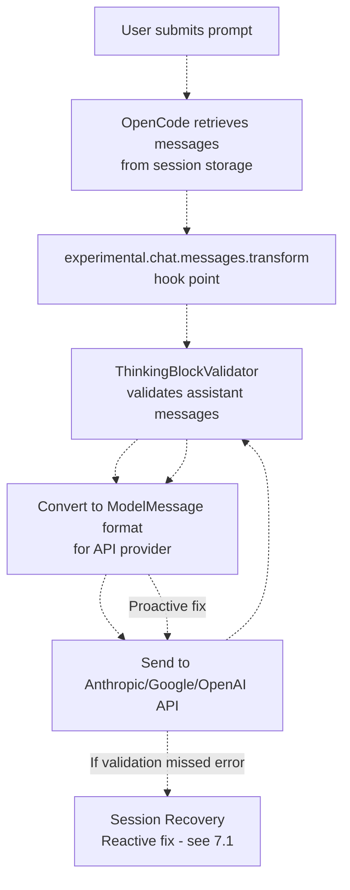
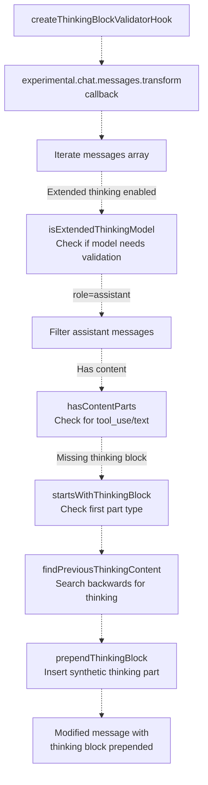
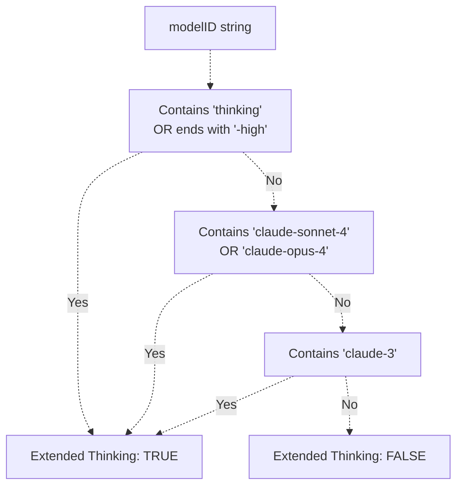
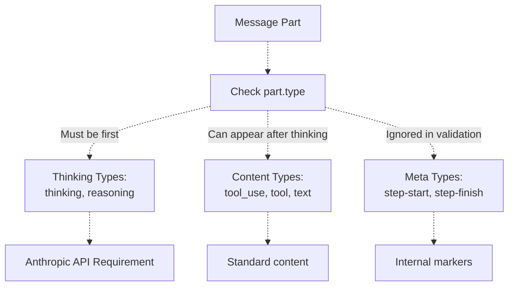
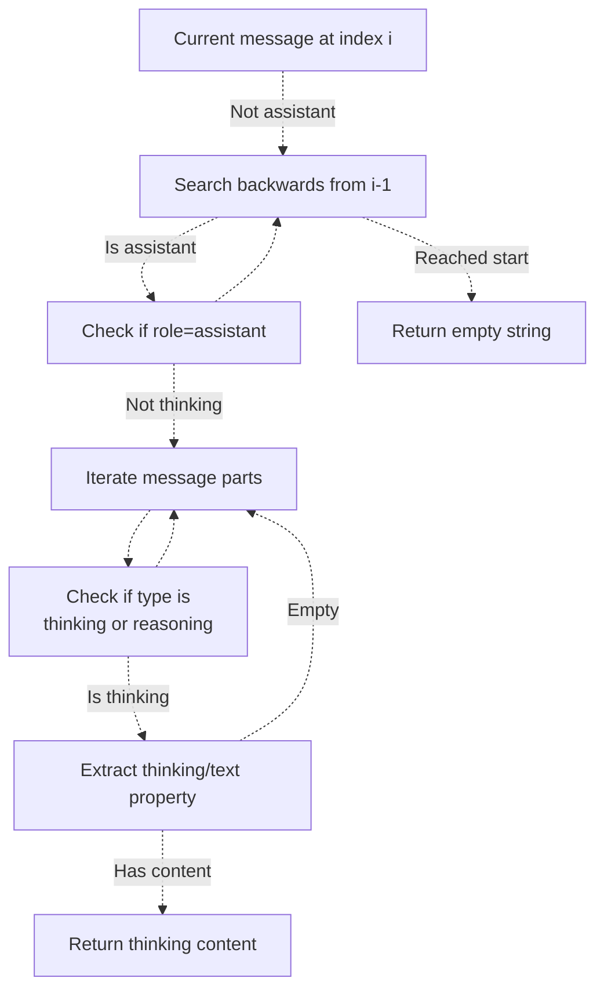
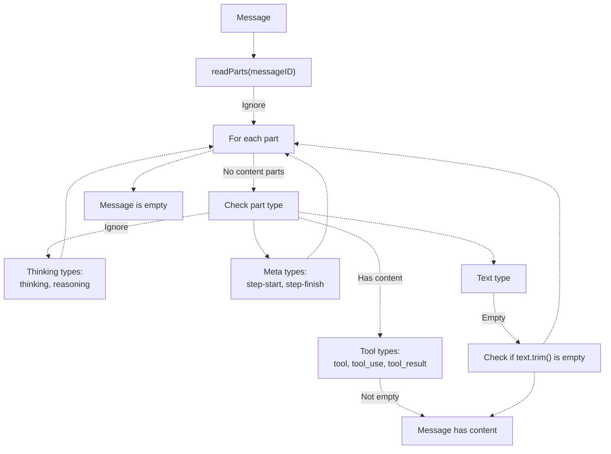
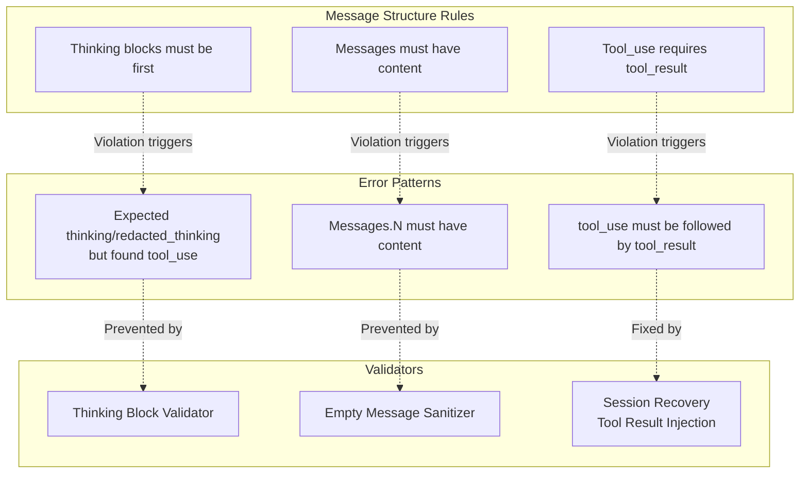
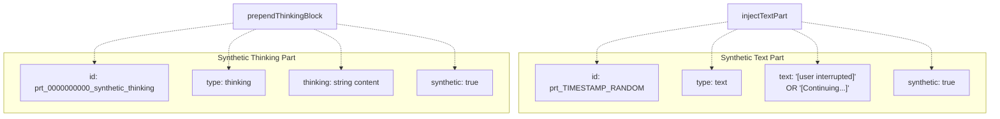
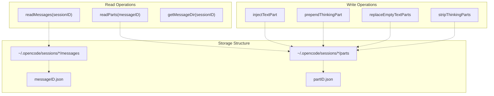
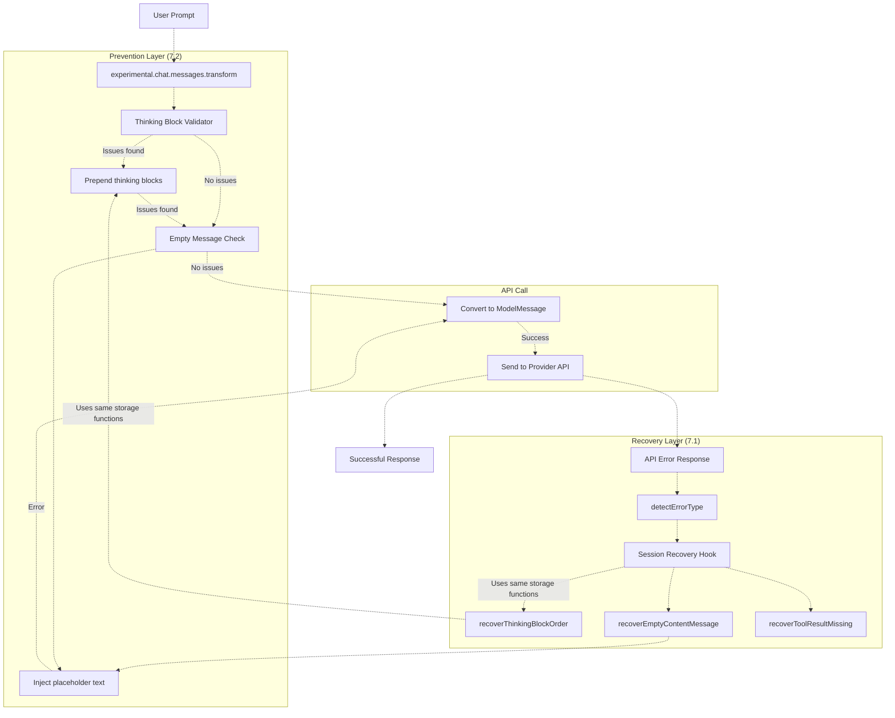

# Message Validation

> **Relevant source files**
> * [src/hooks/session-recovery/index.ts](https://github.com/code-yeongyu/oh-my-opencode/blob/b92cd6ab/src/hooks/session-recovery/index.ts)
> * [src/hooks/session-recovery/storage.ts](https://github.com/code-yeongyu/oh-my-opencode/blob/b92cd6ab/src/hooks/session-recovery/storage.ts)
> * [src/hooks/session-recovery/types.ts](https://github.com/code-yeongyu/oh-my-opencode/blob/b92cd6ab/src/hooks/session-recovery/types.ts)
> * [src/hooks/thinking-block-validator/index.ts](https://github.com/code-yeongyu/oh-my-opencode/blob/b92cd6ab/src/hooks/thinking-block-validator/index.ts)

## Purpose and Scope

Message Validation provides **proactive** error prevention by validating and correcting message structures before they are sent to AI provider APIs. This system runs during the message transformation phase to ensure API compliance, preventing errors that would otherwise require reactive recovery.

This page covers the prevention layer of the reliability system. For reactive error recovery after API errors occur, see [Session Recovery](/code-yeongyu/oh-my-opencode/7.1-session-recovery). For context management and token limits, see [Context Management Hooks](/code-yeongyu/oh-my-opencode/7.4-context-management-hooks).

**Sources:** [src/hooks/thinking-block-validator/index.ts L1-L15](https://github.com/code-yeongyu/oh-my-opencode/blob/b92cd6ab/src/hooks/thinking-block-validator/index.ts#L1-L15)

---

## Validation Architecture

The message validation system operates at the `experimental.chat.messages.transform` hook point, which intercepts messages after they are retrieved from storage but before they are converted to `ModelMessage` format and sent to the API.

### Hook Execution Flow



**Diagram: Message Validation Execution Flow**

The key distinction: validation runs **before** the API call, preventing errors that would otherwise trigger session recovery.

**Sources:** [src/hooks/thinking-block-validator/index.ts L7-L15](https://github.com/code-yeongyu/oh-my-opencode/blob/b92cd6ab/src/hooks/thinking-block-validator/index.ts#L7-L15)

---

## Thinking Block Validator

The `createThinkingBlockValidatorHook` function implements the primary validation logic. It ensures that assistant messages with content parts (tool_use, text) start with a thinking block when extended thinking is enabled.

### Validator Implementation



**Diagram: Thinking Block Validation Logic**

### Key Functions

| Function | Purpose | Location |
| --- | --- | --- |
| `createThinkingBlockValidatorHook` | Creates hook instance | [src/hooks/thinking-block-validator/index.ts L133-L171](https://github.com/code-yeongyu/oh-my-opencode/blob/b92cd6ab/src/hooks/thinking-block-validator/index.ts#L133-L171) |
| `isExtendedThinkingModel` | Detects thinking-capable models | [src/hooks/thinking-block-validator/index.ts L35-L51](https://github.com/code-yeongyu/oh-my-opencode/blob/b92cd6ab/src/hooks/thinking-block-validator/index.ts#L35-L51) |
| `hasContentParts` | Checks for tool_use/text parts | [src/hooks/thinking-block-validator/index.ts L56-L64](https://github.com/code-yeongyu/oh-my-opencode/blob/b92cd6ab/src/hooks/thinking-block-validator/index.ts#L56-L64) |
| `startsWithThinkingBlock` | Validates first part type | [src/hooks/thinking-block-validator/index.ts L69-L75](https://github.com/code-yeongyu/oh-my-opencode/blob/b92cd6ab/src/hooks/thinking-block-validator/index.ts#L69-L75) |
| `findPreviousThinkingContent` | Retrieves prior thinking | [src/hooks/thinking-block-validator/index.ts L80-L103](https://github.com/code-yeongyu/oh-my-opencode/blob/b92cd6ab/src/hooks/thinking-block-validator/index.ts#L80-L103) |
| `prependThinkingBlock` | Injects synthetic thinking part | [src/hooks/thinking-block-validator/index.ts L108-L128](https://github.com/code-yeongyu/oh-my-opencode/blob/b92cd6ab/src/hooks/thinking-block-validator/index.ts#L108-L128) |

**Sources:** [src/hooks/thinking-block-validator/index.ts L133-L171](https://github.com/code-yeongyu/oh-my-opencode/blob/b92cd6ab/src/hooks/thinking-block-validator/index.ts#L133-L171)

---

## Extended Thinking Detection

The validator only applies to models with extended thinking capabilities. The `isExtendedThinkingModel` function determines this using model ID patterns.

### Model Detection Rules



**Diagram: Extended Thinking Model Detection**

### Detected Model Patterns

| Pattern | Example Models | Detection Logic |
| --- | --- | --- |
| Explicit thinking | `claude-opus-4.5-thinking`, `*-high` | Contains `"thinking"` or ends with `"-high"` |
| Claude 4 Sonnet | `claude-sonnet-4`, `claude-sonnet-4.5` | Contains `"claude-sonnet-4"` |
| Claude 4 Opus | `claude-opus-4`, `claude-opus-4.5` | Contains `"claude-opus-4"` |
| Claude 3 family | `claude-3-opus`, `claude-3-sonnet` | Contains `"claude-3"` |

This aligns with `THINKING_CAPABLE_MODELS` patterns from the think-mode system.

**Sources:** [src/hooks/thinking-block-validator/index.ts L35-L51](https://github.com/code-yeongyu/oh-my-opencode/blob/b92cd6ab/src/hooks/thinking-block-validator/index.ts#L35-L51)

---

## Message Structure Validation

The validator examines message structure to determine if correction is needed. It checks for content parts and validates the ordering of thinking blocks.

### Part Type Classification



**Diagram: Message Part Type Classification**

### Validation Logic

The `hasContentParts` function identifies messages that need thinking blocks:

```
// Check if message has content requiring thinking block
hasContentParts(parts: Part[]): boolean
  - Returns true if parts contain: tool, tool_use, or text
  - Excludes: thinking, reasoning, meta types
```

The `startsWithThinkingBlock` function validates ordering:

```
// Check if message starts correctly
startsWithThinkingBlock(parts: Part[]): boolean
  - Returns true if parts[0].type is "thinking" or "reasoning"
  - Returns false if parts[0] is any other type
```

**Sources:** [src/hooks/thinking-block-validator/index.ts L56-L75](https://github.com/code-yeongyu/oh-my-opencode/blob/b92cd6ab/src/hooks/thinking-block-validator/index.ts#L56-L75)

---

## Previous Thinking Context

When prepending a thinking block, the validator attempts to preserve context from previous assistant messages. This follows Anthropic's recommendation to include thinking blocks from previous turns.

### Context Search Algorithm



**Diagram: Previous Thinking Context Retrieval**

### Fallback Behavior

| Scenario | Thinking Content | Behavior |
| --- | --- | --- |
| Previous thinking found | Actual thinking text from prior turn | Use verbatim |
| No previous thinking found | `"[Continuing from previous reasoning]"` | Use placeholder |
| First message in session | `"[Continuing from previous reasoning]"` | Use placeholder |

The prepended thinking part is marked with `synthetic: true` and given a deterministic ID (`prt_0000000000_synthetic_thinking`) to ensure consistent behavior.

**Sources:** [src/hooks/thinking-block-validator/index.ts L80-L128](https://github.com/code-yeongyu/oh-my-opencode/blob/b92cd6ab/src/hooks/thinking-block-validator/index.ts#L80-L128)

---

## Empty Message Sanitization

The validation system also handles empty messages, though this logic is primarily implemented in the session recovery storage utilities and applied reactively. Empty messages violate API requirements and must be corrected.

### Empty Message Detection



**Diagram: Empty Message Detection Logic**

### Empty Message Functions

| Function | Purpose | Location |
| --- | --- | --- |
| `hasContent` | Check if single part has content | [src/hooks/session-recovery/storage.ts L71-L89](https://github.com/code-yeongyu/oh-my-opencode/blob/b92cd6ab/src/hooks/session-recovery/storage.ts#L71-L89) |
| `messageHasContent` | Check if message has any content | [src/hooks/session-recovery/storage.ts L91-L94](https://github.com/code-yeongyu/oh-my-opencode/blob/b92cd6ab/src/hooks/session-recovery/storage.ts#L91-L94) |
| `findEmptyMessages` | Find all empty messages in session | [src/hooks/session-recovery/storage.ts L121-L132](https://github.com/code-yeongyu/oh-my-opencode/blob/b92cd6ab/src/hooks/session-recovery/storage.ts#L121-L132) |
| `findMessagesWithEmptyTextParts` | Find messages with empty text parts | [src/hooks/session-recovery/storage.ts L350-L368](https://github.com/code-yeongyu/oh-my-opencode/blob/b92cd6ab/src/hooks/session-recovery/storage.ts#L350-L368) |
| `findMessagesWithThinkingOnly` | Find messages with only thinking | [src/hooks/session-recovery/storage.ts L184-L204](https://github.com/code-yeongyu/oh-my-opencode/blob/b92cd6ab/src/hooks/session-recovery/storage.ts#L184-L204) |

**Sources:** [src/hooks/session-recovery/storage.ts L71-L94](https://github.com/code-yeongyu/oh-my-opencode/blob/b92cd6ab/src/hooks/session-recovery/storage.ts#L71-L94)

 [src/hooks/session-recovery/storage.ts L121-L132](https://github.com/code-yeongyu/oh-my-opencode/blob/b92cd6ab/src/hooks/session-recovery/storage.ts#L121-L132)

 [src/hooks/session-recovery/storage.ts L350-L368](https://github.com/code-yeongyu/oh-my-opencode/blob/b92cd6ab/src/hooks/session-recovery/storage.ts#L350-L368)

---

## API Compliance Requirements

The validation system enforces specific API requirements from different providers. These requirements are discovered through error messages and documented in code.

### Anthropic API Requirements



**Diagram: API Compliance Enforcement**

### Detected Error Patterns

The validation system recognizes these error patterns from API responses:

| Error Type | Pattern Matching | Prevention/Recovery |
| --- | --- | --- |
| `thinking_block_order` | `"thinking"` AND (`"first block"` OR `"must start with"` OR `"preceeding"`) | Thinking Block Validator (proactive) + Session Recovery (reactive) |
| `thinking_disabled_violation` | `"thinking is disabled"` AND `"cannot contain"` | Thinking stripping in Session Recovery |
| `tool_result_missing` | `"tool_use"` AND `"tool_result"` | Session Recovery (reactive only) |
| Empty content | `"messages.N"` with empty parts | Empty Message Sanitizer |

**Sources:** [src/hooks/session-recovery/index.ts L125-L147](https://github.com/code-yeongyu/oh-my-opencode/blob/b92cd6ab/src/hooks/session-recovery/index.ts#L125-L147)

---

## Synthetic Part Generation

When validation requires message modification, the system injects "synthetic" parts that are marked for tracking purposes.

### Synthetic Part Structure



**Diagram: Synthetic Part Structure**

### Synthetic Part Characteristics

| Property | Thinking Part | Text Part |
| --- | --- | --- |
| ID format | `prt_0000000000_synthetic_thinking` | `prt_${timestamp}${random}` |
| Type | `"thinking"` | `"text"` |
| Content | Previous thinking or placeholder | `"[user interrupted]"` or `"[Continuing...]"` |
| Synthetic flag | `true` | `true` |
| Purpose | Satisfy API ordering requirement | Satisfy API content requirement |

The `synthetic` flag allows downstream systems to distinguish between user-generated and validation-generated content.

**Sources:** [src/hooks/thinking-block-validator/index.ts L108-L128](https://github.com/code-yeongyu/oh-my-opencode/blob/b92cd6ab/src/hooks/thinking-block-validator/index.ts#L108-L128)

 [src/hooks/session-recovery/storage.ts L96-L119](https://github.com/code-yeongyu/oh-my-opencode/blob/b92cd6ab/src/hooks/session-recovery/storage.ts#L96-L119)

---

## Storage Integration

The validation system integrates with the message storage layer to read and modify persisted message parts. This enables both proactive validation during transformation and reactive fixes during recovery.

### Storage Operations



**Diagram: Storage Layer Integration**

### Part Storage Functions

| Function | Operation | Path | Purpose |
| --- | --- | --- | --- |
| `readMessages` | Read | `MESSAGE_STORAGE/sessionID/*.json` | Load message metadata |
| `readParts` | Read | `PART_STORAGE/messageID/*.json` | Load message parts |
| `injectTextPart` | Write | `PART_STORAGE/messageID/prt_*.json` | Add text part |
| `prependThinkingPart` | Write | `PART_STORAGE/messageID/prt_0000000000_thinking.json` | Add thinking part |
| `replaceEmptyTextParts` | Update | `PART_STORAGE/messageID/*.json` | Fix empty text |
| `stripThinkingParts` | Delete | `PART_STORAGE/messageID/*.json` | Remove thinking |

The storage paths use constants:

* `MESSAGE_STORAGE = ~/.opencode/sessions/*/messages`
* `PART_STORAGE = ~/.opencode/sessions/*/parts`

**Sources:** [src/hooks/session-recovery/storage.ts L1-L70](https://github.com/code-yeongyu/oh-my-opencode/blob/b92cd6ab/src/hooks/session-recovery/storage.ts#L1-L70)

 [src/hooks/session-recovery/storage.ts L96-L319](https://github.com/code-yeongyu/oh-my-opencode/blob/b92cd6ab/src/hooks/session-recovery/storage.ts#L96-L319)

 [src/hooks/session-recovery/constants.ts](https://github.com/code-yeongyu/oh-my-opencode/blob/b92cd6ab/src/hooks/session-recovery/constants.ts)

---

## Integration with Recovery System

Message Validation operates as the **prevention layer** while Session Recovery provides the **reactive layer**. Both systems use shared storage utilities and error pattern detection.

### Prevention vs Recovery Flow



**Diagram: Prevention and Recovery Layer Interaction**

### Shared Components

| Component | Used By Prevention | Used By Recovery | Location |
| --- | --- | --- | --- |
| `readMessages` | ❌ | ✅ | [src/hooks/session-recovery/storage.ts L30-L51](https://github.com/code-yeongyu/oh-my-opencode/blob/b92cd6ab/src/hooks/session-recovery/storage.ts#L30-L51) |
| `readParts` | ❌ | ✅ | [src/hooks/session-recovery/storage.ts L53-L69](https://github.com/code-yeongyu/oh-my-opencode/blob/b92cd6ab/src/hooks/session-recovery/storage.ts#L53-L69) |
| `prependThinkingPart` | ❌ | ✅ | [src/hooks/session-recovery/storage.ts L270-L296](https://github.com/code-yeongyu/oh-my-opencode/blob/b92cd6ab/src/hooks/session-recovery/storage.ts#L270-L296) |
| `injectTextPart` | ❌ | ✅ | [src/hooks/session-recovery/storage.ts L96-L119](https://github.com/code-yeongyu/oh-my-opencode/blob/b92cd6ab/src/hooks/session-recovery/storage.ts#L96-L119) |
| `findPreviousThinkingContent` | ✅ (in-memory) | ✅ (storage) | [src/hooks/thinking-block-validator/index.ts L80-L103](https://github.com/code-yeongyu/oh-my-opencode/blob/b92cd6ab/src/hooks/thinking-block-validator/index.ts#L80-L103) <br>  [src/hooks/session-recovery/storage.ts L239-L268](https://github.com/code-yeongyu/oh-my-opencode/blob/b92cd6ab/src/hooks/session-recovery/storage.ts#L239-L268) |

The prevention layer operates on in-memory message arrays during transformation, while the recovery layer operates on persisted storage after API errors.

**Sources:** [src/hooks/thinking-block-validator/index.ts L1-L15](https://github.com/code-yeongyu/oh-my-opencode/blob/b92cd6ab/src/hooks/thinking-block-validator/index.ts#L1-L15)

 [src/hooks/session-recovery/index.ts L1-L430](https://github.com/code-yeongyu/oh-my-opencode/blob/b92cd6ab/src/hooks/session-recovery/index.ts#L1-L430)

---

## Configuration and Hooks

The thinking block validator is registered during plugin initialization and integrates with the hook system.

### Hook Registration

The validator is created and registered in the main plugin initialization:

```javascript
// In plugin initialization
const thinkingValidator = createThinkingBlockValidatorHook()

// Registered on experimental hook point
hooks["experimental.chat.messages.transform"] = async (input, output) => {
  await thinkingValidator<FileRef file-url="https://github.com/code-yeongyu/oh-my-opencode/blob/b92cd6ab/\"experimental.chat.messages.transform\"" undefined  file-path="\"experimental.chat.messages.transform\"">Hii</FileRef>
}
```

### Hook Point Details

| Property | Value |
| --- | --- |
| Hook name | `experimental.chat.messages.transform` |
| Hook type | Transform (modifies output) |
| Execution timing | Before API conversion |
| Input | Empty object (no input data) |
| Output | `{ messages: MessageWithParts[] }` (modified in-place) |
| Async | Yes |

The `experimental.` prefix indicates this hook point is not yet part of the stable OpenCode API.

**Sources:** [src/hooks/thinking-block-validator/index.ts L24-L29](https://github.com/code-yeongyu/oh-my-opencode/blob/b92cd6ab/src/hooks/thinking-block-validator/index.ts#L24-L29)

---

## Error Prevention Effectiveness

The thinking block validator prevents a specific class of API errors that previously required reactive recovery. This improves user experience by eliminating visible error states.

### Before Validation (Reactive Only)

```
User Prompt → API Call → API Error → User Sees Error → 
Session Abort → Storage Fix → Resume → Success
```

**User Impact:** ~3-5 second delay, error toast notification, visible recovery process

### After Validation (Proactive + Reactive)

```
User Prompt → Transform + Validate → Fix Applied → API Call → Success
```

**User Impact:** No delay, no visible errors, seamless experience

### Remaining Recovery Cases

The session recovery system (7.1) still handles:

* **Tool result missing**: User pressed ESC during tool execution
* **Empty content**: Edge cases not caught by validation
* **Thinking disabled**: Model configuration mismatch
* **Context limit**: Hard limits from provider

These cases require reactive recovery because they depend on runtime state or external failures.

**Sources:** [src/hooks/thinking-block-validator/index.ts L1-L15](https://github.com/code-yeongyu/oh-my-opencode/blob/b92cd6ab/src/hooks/thinking-block-validator/index.ts#L1-L15)

 [src/hooks/session-recovery/index.ts L125-L147](https://github.com/code-yeongyu/oh-my-opencode/blob/b92cd6ab/src/hooks/session-recovery/index.ts#L125-L147)