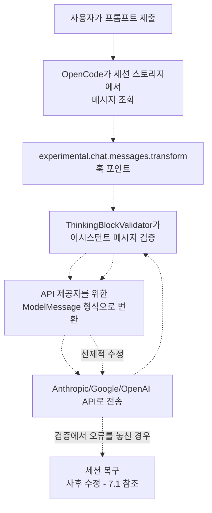
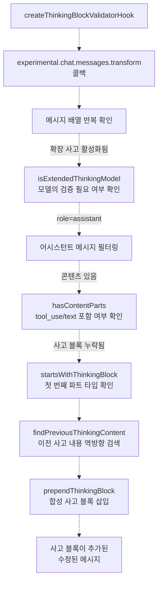
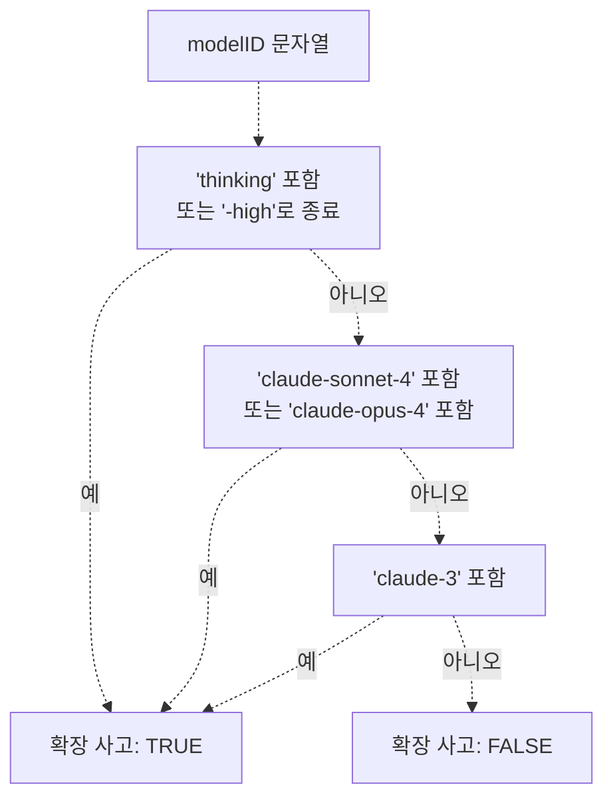
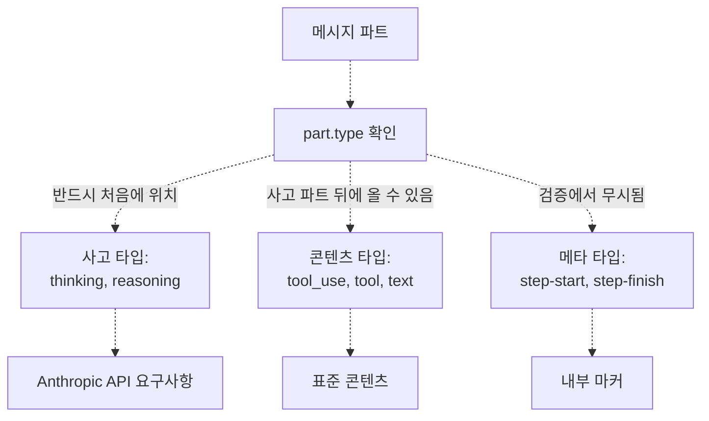
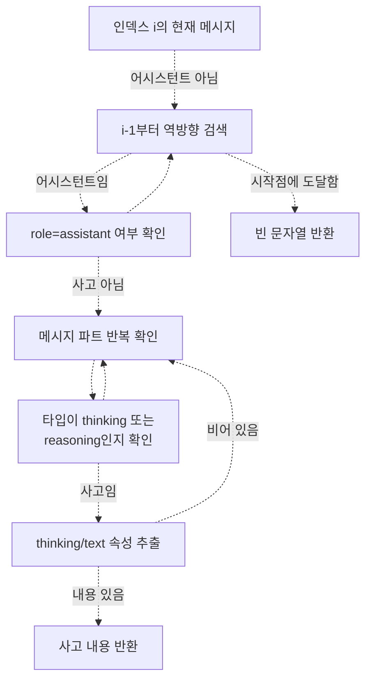
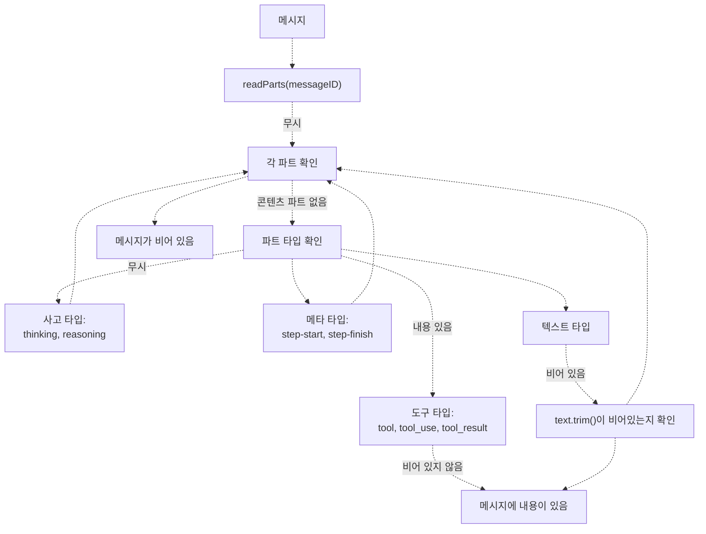
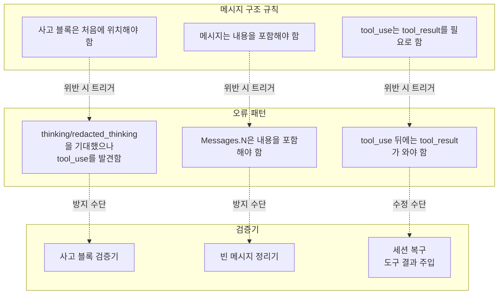
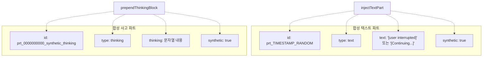
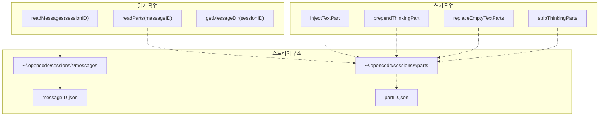
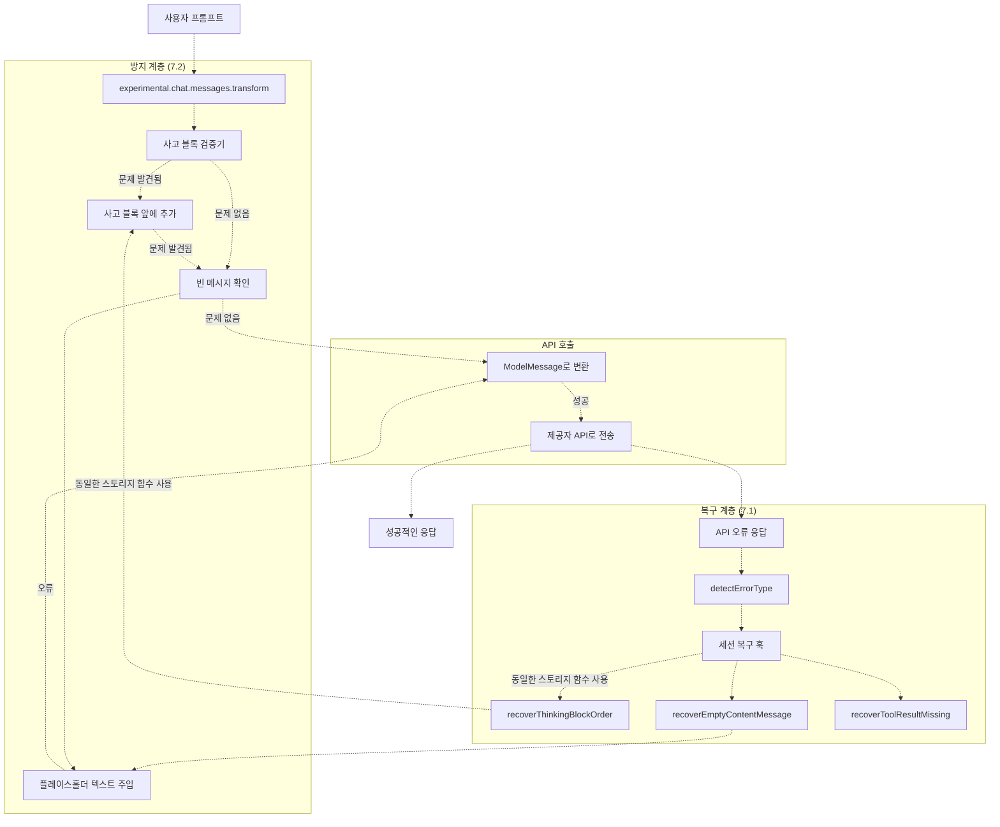

# 메시지 검증 (Message Validation)

> **관련 소스 파일**
> * [src/hooks/session-recovery/index.ts](https://github.com/code-yeongyu/oh-my-opencode/blob/b92cd6ab/src/hooks/session-recovery/index.ts)
> * [src/hooks/session-recovery/storage.ts](https://github.com/code-yeongyu/oh-my-opencode/blob/b92cd6ab/src/hooks/session-recovery/storage.ts)
> * [src/hooks/session-recovery/types.ts](https://github.com/code-yeongyu/oh-my-opencode/blob/b92cd6ab/src/hooks/session-recovery/types.ts)
> * [src/hooks/thinking-block-validator/index.ts](https://github.com/code-yeongyu/oh-my-opencode/blob/b92cd6ab/src/hooks/thinking-block-validator/index.ts)

## 목적 및 범위

메시지 검증(Message Validation)은 메시지 구조를 AI 제공자(Provider) API로 전송하기 전에 검증하고 수정함으로써 **선제적인(proactive)** 오류 방지 기능을 제공합니다. 이 시스템은 메시지 변환 단계에서 실행되어 API 준수 여부를 보장하며, 사후 복구가 필요한 오류가 발생하는 것을 미리 방지합니다.

이 페이지는 안정성 시스템의 방지 계층(Prevention layer)을 다룹니다. API 오류 발생 후의 사후 오류 복구에 대해서는 [세션 복구 (Session Recovery)](/code-yeongyu/oh-my-opencode/7.1-session-recovery)를 참조하십시오. 컨텍스트 관리 및 토큰 제한에 대해서는 [컨텍스트 관리 훅 (Context Management Hooks)](/code-yeongyu/oh-my-opencode/7.4-context-management-hooks)을 참조하십시오.

**출처:** [src/hooks/thinking-block-validator/index.ts L1-L15](https://github.com/code-yeongyu/oh-my-opencode/blob/b92cd6ab/src/hooks/thinking-block-validator/index.ts#L1-L15)

---

## 검증 아키텍처 (Validation Architecture)

메시지 검증 시스템은 `experimental.chat.messages.transform` 훅 포인트에서 작동합니다. 이 포인트는 스토리지에서 메시지를 가져온 후, `ModelMessage` 형식으로 변환하여 API로 보내기 직전에 메시지를 가로챕니다.

### 훅 실행 흐름 (Hook Execution Flow)



**다이어그램: 메시지 검증 실행 흐름**

핵심적인 차이점은 검증이 API 호출 **전**에 실행되어, 세션 복구를 트리거할 수 있는 오류를 미리 방지한다는 점입니다.

**출처:** [src/hooks/thinking-block-validator/index.ts L7-L15](https://github.com/code-yeongyu/oh-my-opencode/blob/b92cd6ab/src/hooks/thinking-block-validator/index.ts#L7-L15)

---

## 사고 블록 검증기 (Thinking Block Validator)

`createThinkingBlockValidatorHook` 함수는 주요 검증 로직을 구현합니다. 이 함수는 확장 사고(Extended thinking)가 활성화되었을 때, 콘텐츠 파트(`tool_use`, `text`)를 포함한 어시스턴트 메시지가 사고 블록(Thinking block)으로 시작하는지 확인합니다.

### 검증기 구현 (Validator Implementation)



**다이어그램: 사고 블록 검증 로직**

### 주요 함수

| 함수 | 목적 | 위치 |
| --- | --- | --- |
| `createThinkingBlockValidatorHook` | 훅 인스턴스 생성 | [src/hooks/thinking-block-validator/index.ts L133-L171](https://github.com/code-yeongyu/oh-my-opencode/blob/b92cd6ab/src/hooks/thinking-block-validator/index.ts#L133-L171) |
| `isExtendedThinkingModel` | 사고 기능이 있는 모델 감지 | [src/hooks/thinking-block-validator/index.ts L35-L51](https://github.com/code-yeongyu/oh-my-opencode/blob/b92cd6ab/src/hooks/thinking-block-validator/index.ts#L35-L51) |
| `hasContentParts` | `tool_use`/`text` 파트 존재 여부 확인 | [src/hooks/thinking-block-validator/index.ts L56-L64](https://github.com/code-yeongyu/oh-my-opencode/blob/b92cd6ab/src/hooks/thinking-block-validator/index.ts#L56-L64) |
| `startsWithThinkingBlock` | 첫 번째 파트의 타입 검증 | [src/hooks/thinking-block-validator/index.ts L69-L75](https://github.com/code-yeongyu/oh-my-opencode/blob/b92cd6ab/src/hooks/thinking-block-validator/index.ts#L69-L75) |
| `findPreviousThinkingContent` | 이전 사고 내용 조회 | [src/hooks/thinking-block-validator/index.ts L80-L103](https://github.com/code-yeongyu/oh-my-opencode/blob/b92cd6ab/src/hooks/thinking-block-validator/index.ts#L80-L103) |
| `prependThinkingBlock` | 합성 사고 파트(Synthetic thinking part) 주입 | [src/hooks/thinking-block-validator/index.ts L108-L128](https://github.com/code-yeongyu/oh-my-opencode/blob/b92cd6ab/src/hooks/thinking-block-validator/index.ts#L108-L128) |

**출처:** [src/hooks/thinking-block-validator/index.ts L133-L171](https://github.com/code-yeongyu/oh-my-opencode/blob/b92cd6ab/src/hooks/thinking-block-validator/index.ts#L133-L171)

---

## 확장 사고 감지 (Extended Thinking Detection)

검증기는 확장 사고 기능이 있는 모델에만 적용됩니다. `isExtendedThinkingModel` 함수는 모델 ID 패턴을 사용하여 이를 결정합니다.

### 모델 감지 규칙



**다이어그램: 확장 사고 모델 감지**

### 감지되는 모델 패턴

| 패턴 | 예시 모델 | 감지 로직 |
| --- | --- | --- |
| 명시적 사고 (Explicit thinking) | `claude-opus-4.5-thinking`, `*-high` | `"thinking"` 포함 또는 `"-high"`로 종료 |
| Claude 4 Sonnet | `claude-sonnet-4`, `claude-sonnet-4.5` | `"claude-sonnet-4"` 포함 |
| Claude 4 Opus | `claude-opus-4`, `claude-opus-4.5` | `"claude-opus-4"` 포함 |
| Claude 3 제품군 | `claude-3-opus`, `claude-3-sonnet` | `"claude-3"` 포함 |

이는 `think-mode` 시스템의 `THINKING_CAPABLE_MODELS` 패턴과 일치합니다.

**출처:** [src/hooks/thinking-block-validator/index.ts L35-L51](https://github.com/code-yeongyu/oh-my-opencode/blob/b92cd6ab/src/hooks/thinking-block-validator/index.ts#L35-L51)

---

## 메시지 구조 검증

검증기는 메시지 구조를 검사하여 수정이 필요한지 판단합니다. 콘텐츠 파트의 존재를 확인하고 사고 블록의 순서를 검증합니다.

### 파트 타입 분류 (Part Type Classification)



**다이어그램: 메시지 파트 타입 분류**

### 검증 로직

`hasContentParts` 함수는 사고 블록이 필요한 메시지를 식별합니다.

```
// 사고 블록이 필요한 콘텐츠가 메시지에 있는지 확인
hasContentParts(parts: Part[]): boolean
  - 파트에 tool, tool_use, 또는 text가 포함되어 있으면 true 반환
  - thinking, reasoning, 메타 타입은 제외
```

`startsWithThinkingBlock` 함수는 순서를 검증합니다.

```
// 메시지가 올바르게 시작하는지 확인
startsWithThinkingBlock(parts: Part[]): boolean
  - parts[0].type이 "thinking" 또는 "reasoning"이면 true 반환
  - parts[0]이 다른 타입이면 false 반환
```

**출처:** [src/hooks/thinking-block-validator/index.ts L56-L75](https://github.com/code-yeongyu/oh-my-opencode/blob/b92cd6ab/src/hooks/thinking-block-validator/index.ts#L56-L75)

---

## 이전 사고 컨텍스트 (Previous Thinking Context)

사고 블록을 앞에 추가할 때, 검증기는 이전 어시스턴트 메시지의 컨텍스트를 유지하려고 시도합니다. 이는 이전 턴의 사고 블록을 포함하라는 Anthropic의 권장 사항을 따릅니다.

### 컨텍스트 검색 알고리즘



**다이어그램: 이전 사고 컨텍스트 조회**

### 폴백 동작 (Fallback Behavior)

| 시나리오 | 사고 내용 | 동작 |
| --- | --- | --- |
| 이전 사고 발견됨 | 이전 턴의 실제 사고 텍스트 | 그대로 사용 |
| 이전 사고 발견되지 않음 | `"[Continuing from previous reasoning]"` | 플레이스홀더(Placeholder) 사용 |
| 세션의 첫 번째 메시지 | `"[Continuing from previous reasoning]"` | 플레이스홀더 사용 |

앞에 추가된 사고 파트는 `synthetic: true`로 표시되며, 일관된 동작을 보장하기 위해 결정론적 ID(`prt_0000000000_synthetic_thinking`)가 부여됩니다.

**출처:** [src/hooks/thinking-block-validator/index.ts L80-L128](https://github.com/code-yeongyu/oh-my-opencode/blob/b92cd6ab/src/hooks/thinking-block-validator/index.ts#L80-L128)

---

## 빈 메시지 정리 (Empty Message Sanitization)

검증 시스템은 빈 메시지도 처리하지만, 이 로직은 주로 세션 복구 스토리지 유틸리티에 구현되어 사후 대응적으로 적용됩니다. 빈 메시지는 API 요구사항을 위반하므로 반드시 수정되어야 합니다.

### 빈 메시지 감지



**다이어그램: 빈 메시지 감지 로직**

### 빈 메시지 관련 함수

| 함수 | 목적 | 위치 |
| --- | --- | --- |
| `hasContent` | 단일 파트에 내용이 있는지 확인 | [src/hooks/session-recovery/storage.ts L71-L89](https://github.com/code-yeongyu/oh-my-opencode/blob/b92cd6ab/src/hooks/session-recovery/storage.ts#L71-L89) |
| `messageHasContent` | 메시지에 내용이 하나라도 있는지 확인 | [src/hooks/session-recovery/storage.ts L91-L94](https://github.com/code-yeongyu/oh-my-opencode/blob/b92cd6ab/src/hooks/session-recovery/storage.ts#L91-L94) |
| `findEmptyMessages` | 세션 내의 모든 빈 메시지 찾기 | [src/hooks/session-recovery/storage.ts L121-L132](https://github.com/code-yeongyu/oh-my-opencode/blob/b92cd6ab/src/hooks/session-recovery/storage.ts#L121-L132) |
| `findMessagesWithEmptyTextParts` | 빈 텍스트 파트가 있는 메시지 찾기 | [src/hooks/session-recovery/storage.ts L350-L368](https://github.com/code-yeongyu/oh-my-opencode/blob/b92cd6ab/src/hooks/session-recovery/storage.ts#L350-L368) |
| `findMessagesWithThinkingOnly` | 사고 파트만 있는 메시지 찾기 | [src/hooks/session-recovery/storage.ts L184-L204](https://github.com/code-yeongyu/oh-my-opencode/blob/b92cd6ab/src/hooks/session-recovery/storage.ts#L184-L204) |

**출처:** [src/hooks/session-recovery/storage.ts L71-L94](https://github.com/code-yeongyu/oh-my-opencode/blob/b92cd6ab/src/hooks/session-recovery/storage.ts#L71-L94)

 [src/hooks/session-recovery/storage.ts L121-L132](https://github.com/code-yeongyu/oh-my-opencode/blob/b92cd6ab/src/hooks/session-recovery/storage.ts#L121-L132)

 [src/hooks/session-recovery/storage.ts L350-L368](https://github.com/code-yeongyu/oh-my-opencode/blob/b92cd6ab/src/hooks/session-recovery/storage.ts#L350-L368)

---

## API 준수 요구사항 (API Compliance Requirements)

검증 시스템은 각 제공자의 특정 API 요구사항을 강제합니다. 이러한 요구사항은 오류 메시지를 통해 발견되었으며 코드에 문서화되어 있습니다.

### Anthropic API 요구사항



**다이어그램: API 준수 강제**

### 감지된 오류 패턴

검증 시스템은 API 응답에서 다음과 같은 오류 패턴을 인식합니다.

| 오류 유형 | 패턴 매칭 | 방지/복구 |
| --- | --- | --- |
| `thinking_block_order` | `"thinking"` 및 (`"first block"` 또는 `"must start with"` 또는 `"preceeding"`) | 사고 블록 검증기 (선제적) + 세션 복구 (사후 대응) |
| `thinking_disabled_violation` | `"thinking is disabled"` 및 `"cannot contain"` | 세션 복구에서 사고 파트 제거 |
| `tool_result_missing` | `"tool_use"` 및 `"tool_result"` | 세션 복구 (사후 대응 전용) |
| 빈 콘텐츠 | 빈 파트가 있는 `"messages.N"` | 빈 메시지 정리기 |

**출처:** [src/hooks/session-recovery/index.ts L125-L147](https://github.com/code-yeongyu/oh-my-opencode/blob/b92cd6ab/src/hooks/session-recovery/index.ts#L125-L147)

---

## 합성 파트 생성 (Synthetic Part Generation)

검증을 위해 메시지 수정이 필요한 경우, 시스템은 추적을 위해 표시된 "합성(synthetic)" 파트를 주입합니다.

### 합성 파트 구조



**다이어그램: 합성 파트 구조**

### 합성 파트 특성

| 속성 | 사고 파트 | 텍스트 파트 |
| --- | --- | --- |
| ID 형식 | `prt_0000000000_synthetic_thinking` | `prt_${timestamp}${random}` |
| 타입 | `"thinking"` | `"text"` |
| 내용 | 이전 사고 또는 플레이스홀더 | `"[user interrupted]"` 또는 `"[Continuing...]"` |
| 합성 플래그 | `true` | `true` |
| 목적 | API 순서 요구사항 충족 | API 콘텐츠 요구사항 충족 |

`synthetic` 플래그를 통해 하위 시스템은 사용자가 생성한 콘텐츠와 검증 시스템이 생성한 콘텐츠를 구분할 수 있습니다.

**출처:** [src/hooks/thinking-block-validator/index.ts L108-L128](https://github.com/code-yeongyu/oh-my-opencode/blob/b92cd6ab/src/hooks/thinking-block-validator/index.ts#L108-L128)

 [src/hooks/session-recovery/storage.ts L96-L119](https://github.com/code-yeongyu/oh-my-opencode/blob/b92cd6ab/src/hooks/session-recovery/storage.ts#L96-L119)

---

## 스토리지 통합 (Storage Integration)

검증 시스템은 메시지 스토리지 계층과 통합되어 저장된 메시지 파트를 읽고 수정합니다. 이를 통해 변환 중의 선제적 검증과 복구 중의 사후 수정을 모두 수행할 수 있습니다.

### 스토리지 작업 (Storage Operations)



**다이어그램: 스토리지 계층 통합**

### 파트 스토리지 함수

| 함수 | 작업 | 경로 | 목적 |
| --- | --- | --- | --- |
| `readMessages` | 읽기 | `MESSAGE_STORAGE/sessionID/*.json` | 메시지 메타데이터 로드 |
| `readParts` | 읽기 | `PART_STORAGE/messageID/*.json` | 메시지 파트 로드 |
| `injectTextPart` | 쓰기 | `PART_STORAGE/messageID/prt_*.json` | 텍스트 파트 추가 |
| `prependThinkingPart` | 쓰기 | `PART_STORAGE/messageID/prt_0000000000_thinking.json` | 사고 파트 추가 |
| `replaceEmptyTextParts` | 업데이트 | `PART_STORAGE/messageID/*.json` | 빈 텍스트 수정 |
| `stripThinkingParts` | 삭제 | `PART_STORAGE/messageID/*.json` | 사고 파트 제거 |

스토리지 경로는 다음 상수를 사용합니다.

* `MESSAGE_STORAGE = ~/.opencode/sessions/*/messages`
* `PART_STORAGE = ~/.opencode/sessions/*/parts`

**출처:** [src/hooks/session-recovery/storage.ts L1-L70](https://github.com/code-yeongyu/oh-my-opencode/blob/b92cd6ab/src/hooks/session-recovery/storage.ts#L1-L70)

 [src/hooks/session-recovery/storage.ts L96-L319](https://github.com/code-yeongyu/oh-my-opencode/blob/b92cd6ab/src/hooks/session-recovery/storage.ts#L96-L319)

 [src/hooks/session-recovery/constants.ts](https://github.com/code-yeongyu/oh-my-opencode/blob/b92cd6ab/src/hooks/session-recovery/constants.ts)

---

## 복구 시스템과의 통합

메시지 검증은 **방지 계층(Prevention layer)**으로 작동하며, 세션 복구는 **사후 대응 계층(Reactive layer)**을 제공합니다. 두 시스템 모두 공유 스토리지 유틸리티와 오류 패턴 감지 로직을 사용합니다.

### 방지 vs 복구 흐름 (Prevention vs Recovery Flow)



**다이어그램: 방지 및 복구 계층 상호작용**

### 공유 컴포넌트

| 컴포넌트 | 방지 계층 사용 여부 | 복구 계층 사용 여부 | 위치 |
| --- | --- | --- | --- |
| `readMessages` | ❌ | ✅ | [src/hooks/session-recovery/storage.ts L30-L51](https://github.com/code-yeongyu/oh-my-opencode/blob/b92cd6ab/src/hooks/session-recovery/storage.ts#L30-L51) |
| `readParts` | ❌ | ✅ | [src/hooks/session-recovery/storage.ts L53-L69](https://github.com/code-yeongyu/oh-my-opencode/blob/b92cd6ab/src/hooks/session-recovery/storage.ts#L53-L69) |
| `prependThinkingPart` | ❌ | ✅ | [src/hooks/session-recovery/storage.ts L270-L296](https://github.com/code-yeongyu/oh-my-opencode/blob/b92cd6ab/src/hooks/session-recovery/storage.ts#L270-L296) |
| `injectTextPart` | ❌ | ✅ | [src/hooks/session-recovery/storage.ts L96-L119](https://github.com/code-yeongyu/oh-my-opencode/blob/b92cd6ab/src/hooks/session-recovery/storage.ts#L96-L119) |
| `findPreviousThinkingContent` | ✅ (메모리 내) | ✅ (스토리지) | [src/hooks/thinking-block-validator/index.ts L80-L103](https://github.com/code-yeongyu/oh-my-opencode/blob/b92cd6ab/src/hooks/thinking-block-validator/index.ts#L80-L103) <br>  [src/hooks/session-recovery/storage.ts L239-L268](https://github.com/code-yeongyu/oh-my-opencode/blob/b92cd6ab/src/hooks/session-recovery/storage.ts#L239-L268) |

방지 계층은 변환 중에 메모리 내 메시지 배열에서 작동하는 반면, 복구 계층은 API 오류 발생 후 영구 스토리지에서 작동합니다.

**출처:** [src/hooks/thinking-block-validator/index.ts L1-L15](https://github.com/code-yeongyu/oh-my-opencode/blob/b92cd6ab/src/hooks/thinking-block-validator/index.ts#L1-L15)

 [src/hooks/session-recovery/index.ts L1-L430](https://github.com/code-yeongyu/oh-my-opencode/blob/b92cd6ab/src/hooks/session-recovery/index.ts#L1-L430)

---

## 설정 및 훅 (Hooks)

사고 블록 검증기는 플러그인 초기화 중에 등록되며 훅 시스템과 통합됩니다.

### 훅 등록 (Hook Registration)

검증기는 메인 플러그인 초기화 시 생성 및 등록됩니다.

```javascript
// 플러그인 초기화 시
const thinkingValidator = createThinkingBlockValidatorHook()

// 실험적 훅 포인트에 등록
hooks["experimental.chat.messages.transform"] = async (input, output) => {
  await thinkingValidator<FileRef file-url="https://github.com/code-yeongyu/oh-my-opencode/blob/b92cd6ab/\"experimental.chat.messages.transform\"" undefined  file-path="\"experimental.chat.messages.transform\"">Hii</FileRef>
}
```

### 훅 포인트 상세 정보

| 속성 | 값 |
| --- | --- |
| 훅 이름 | `experimental.chat.messages.transform` |
| 훅 타입 | Transform (출력 수정) |
| 실행 시점 | API 변환 전 |
| 입력 | 빈 객체 (입력 데이터 없음) |
| 출력 | `{ messages: MessageWithParts[] }` (현재 위치에서 수정됨) |
| 비동기 여부 | 예 |

`experimental.` 접두사는 이 훅 포인트가 아직 안정적인 OpenCode API의 일부가 아님을 나타냅니다.

**출처:** [src/hooks/thinking-block-validator/index.ts L24-L29](https://github.com/code-yeongyu/oh-my-opencode/blob/b92cd6ab/src/hooks/thinking-block-validator/index.ts#L24-L29)

---

## 오류 방지 효과 (Error Prevention Effectiveness)

사고 블록 검증기는 이전에 사후 복구가 필요했던 특정 클래스의 API 오류를 방지합니다. 이는 눈에 보이는 오류 상태를 제거함으로써 사용자 경험을 개선합니다.

### 검증 도입 전 (사후 대응만 수행)

```
사용자 프롬프트 → API 호출 → API 오류 → 사용자에게 오류 표시 → 
세션 중단 → 스토리지 수정 → 재개 → 성공
```

**사용자 영향:** 약 3~5초 지연, 오류 알림 표시, 복구 과정이 눈에 보임

### 검증 도입 후 (선제적 방지 + 사후 대응)

```
사용자 프롬프트 → 변환 및 검증 → 수정 적용 → API 호출 → 성공
```

**사용자 영향:** 지연 없음, 눈에 보이는 오류 없음, 매끄러운 경험

### 여전히 복구가 필요한 경우

세션 복구 시스템(7.1)은 여전히 다음 사항들을 처리합니다.

* **도구 결과 누락 (Tool result missing)**: 도구 실행 중 사용자가 ESC를 누른 경우
* **빈 콘텐츠 (Empty content)**: 검증에서 포착되지 않은 예외 케이스
* **사고 비활성화 (Thinking disabled)**: 모델 설정 불일치
* **컨텍스트 제한 (Context limit)**: 제공자의 하드 제한(Hard limit)

이러한 케이스들은 런타임 상태나 외부 실패에 의존하기 때문에 사후 대응적인 복구가 필요합니다.

**출처:** [src/hooks/thinking-block-validator/index.ts L1-L15](https://github.com/code-yeongyu/oh-my-opencode/blob/b92cd6ab/src/hooks/thinking-block-validator/index.ts#L1-L15)

 [src/hooks/session-recovery/index.ts L125-L147](https://github.com/code-yeongyu/oh-my-opencode/blob/b92cd6ab/src/hooks/session-recovery/index.ts#L125-L147)