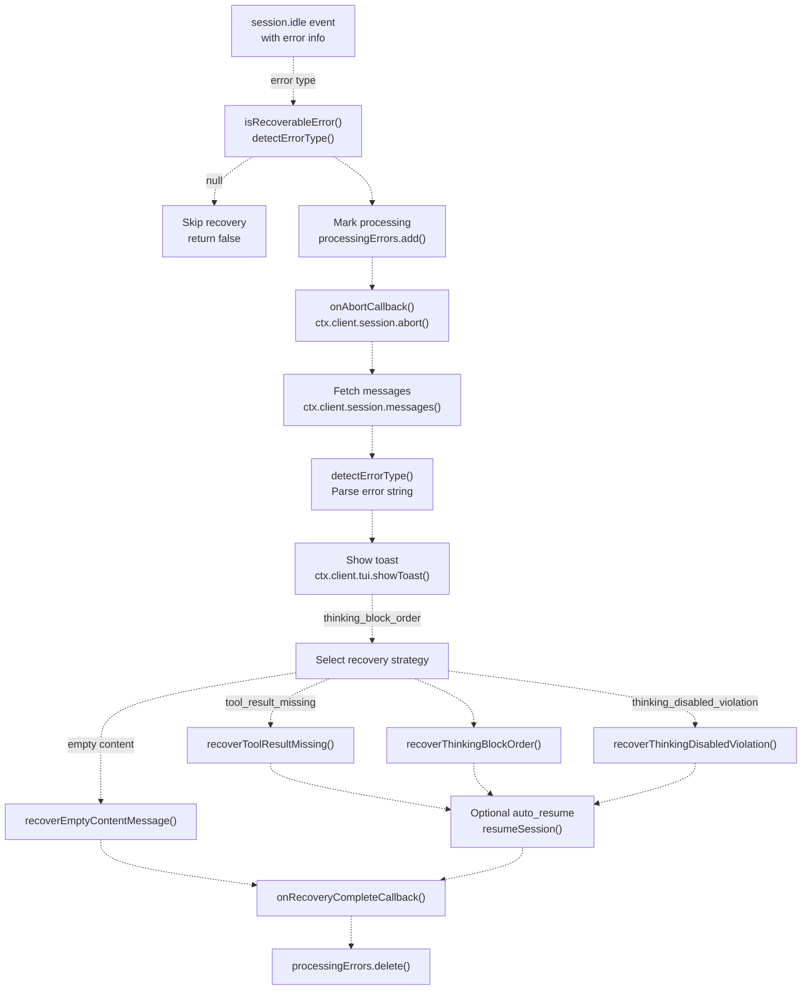
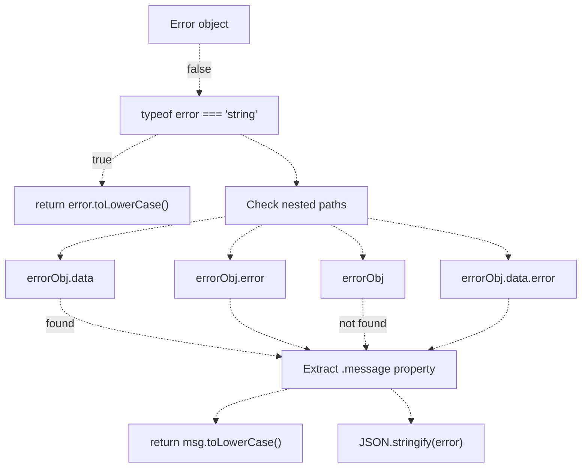
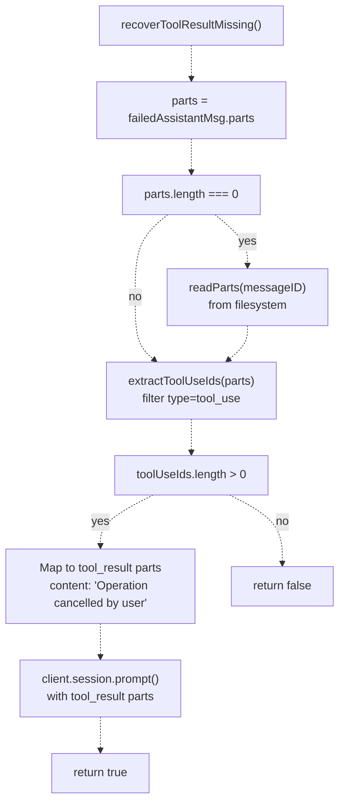
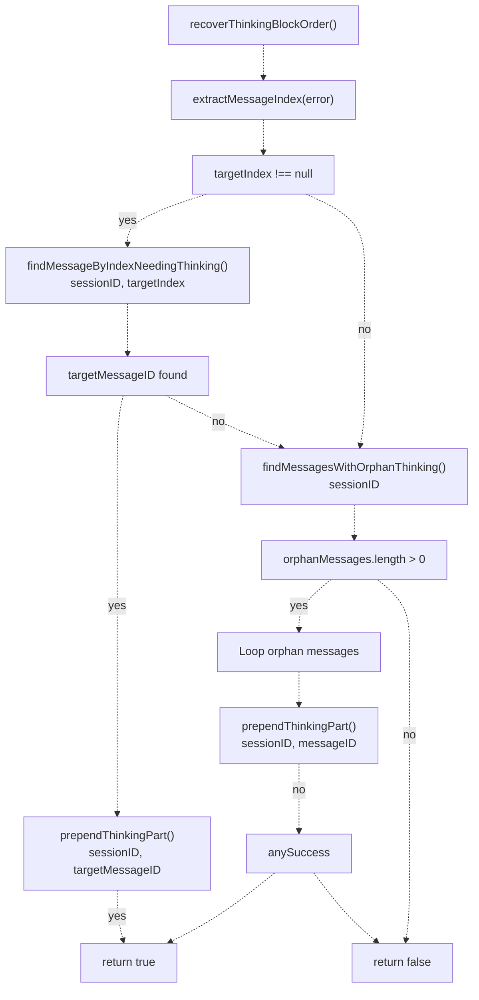
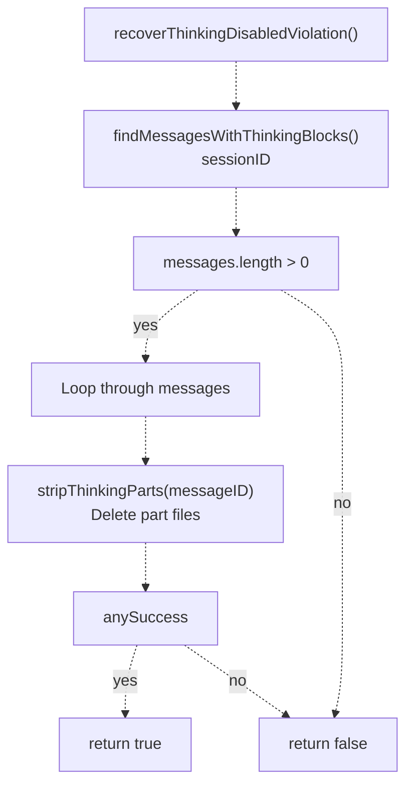
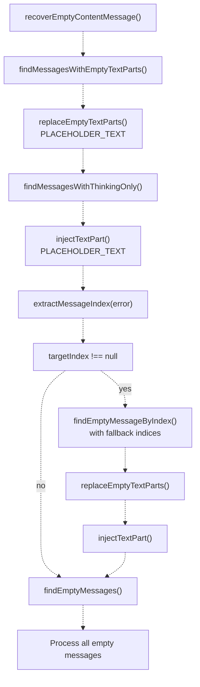
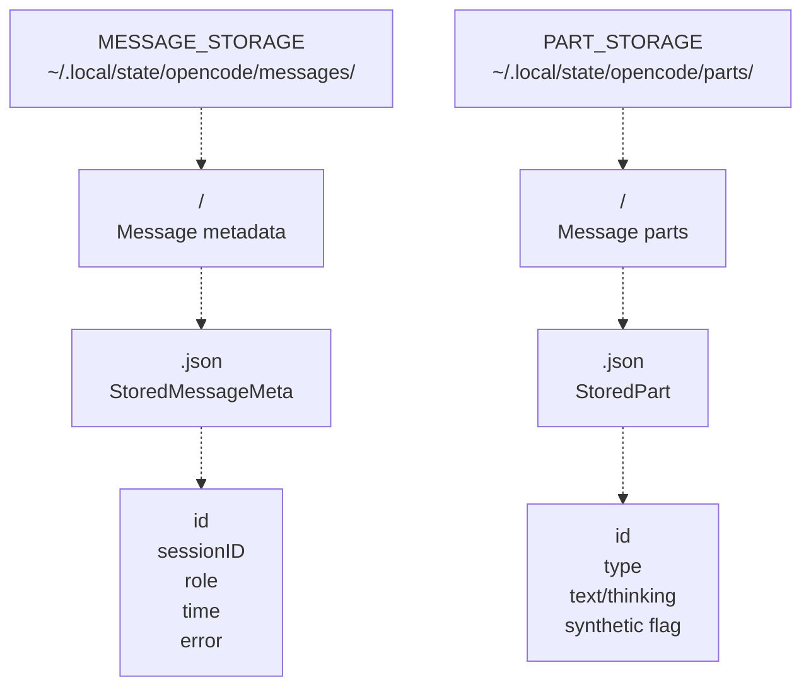
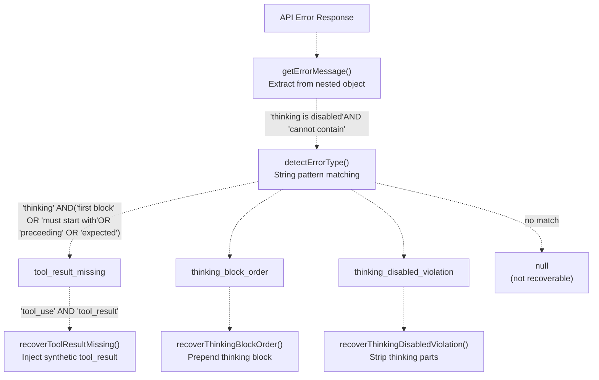

# Session Recovery

> **Relevant source files**
> * [src/hooks/session-recovery/index.ts](https://github.com/code-yeongyu/oh-my-opencode/blob/b92cd6ab/src/hooks/session-recovery/index.ts)
> * [src/hooks/session-recovery/storage.ts](https://github.com/code-yeongyu/oh-my-opencode/blob/b92cd6ab/src/hooks/session-recovery/storage.ts)
> * [src/hooks/session-recovery/types.ts](https://github.com/code-yeongyu/oh-my-opencode/blob/b92cd6ab/src/hooks/session-recovery/types.ts)
> * [src/hooks/thinking-block-validator/index.ts](https://github.com/code-yeongyu/oh-my-opencode/blob/b92cd6ab/src/hooks/thinking-block-validator/index.ts)

## Purpose and Scope

Session Recovery is a **reactive error handling system** that automatically detects, diagnoses, and repairs API errors during agent execution. When an API request fails due to malformed message structure, Session Recovery aborts the session, manipulates the underlying storage to fix the problem, and optionally resumes execution.

This system handles errors **after they occur** (reactive). For proactive error prevention before API calls, see [Message Validation](/code-yeongyu/oh-my-opencode/7.2-message-validation). For automatic task continuation after completion, see [Todo Continuation Enforcer](/code-yeongyu/oh-my-opencode/7.3-todo-continuation-enforcer).

**Sources:** [src/hooks/session-recovery/index.ts L1-L431](https://github.com/code-yeongyu/oh-my-opencode/blob/b92cd6ab/src/hooks/session-recovery/index.ts#L1-L431)

---

## System Architecture

Session Recovery operates as a hook triggered by the `session.idle` event with error information. It implements a three-phase workflow: detection, repair, and recovery.

### Recovery Hook Lifecycle



**Sources:** [src/hooks/session-recovery/index.ts L337-L422](https://github.com/code-yeongyu/oh-my-opencode/blob/b92cd6ab/src/hooks/session-recovery/index.ts#L337-L422)

---

## Error Detection System

Session Recovery uses string pattern matching to identify recoverable errors from API responses. The `detectErrorType()` function extracts error messages from nested error objects and matches against known patterns.

### Error Type Detection Logic

| Error Type | Detection Pattern | Example Error Message |
| --- | --- | --- |
| `tool_result_missing` | Contains `"tool_use"` AND `"tool_result"` | "tool_use block must have corresponding tool_result" |
| `thinking_block_order` | Contains `"thinking"` AND (`"first block"` OR `"must start with"` OR `"preceeding"` OR `"expected"`) | "Expected thinking/redacted_thinking but found tool_use at messages.3" |
| `thinking_disabled_violation` | Contains `"thinking is disabled"` AND `"cannot contain"` | "thinking is disabled for this model - message cannot contain thinking blocks" |
| `null` | No pattern match | Returns `null`, error is not recoverable |

**Sources:** [src/hooks/session-recovery/index.ts L125-L147](https://github.com/code-yeongyu/oh-my-opencode/blob/b92cd6ab/src/hooks/session-recovery/index.ts#L125-L147)

### Error Message Extraction

The `getErrorMessage()` function navigates multiple possible error object structures to extract the error message string:



**Sources:** [src/hooks/session-recovery/index.ts L91-L117](https://github.com/code-yeongyu/oh-my-opencode/blob/b92cd6ab/src/hooks/session-recovery/index.ts#L91-L117)

### Message Index Extraction

When errors reference specific message indices (e.g., "messages.3"), the `extractMessageIndex()` function parses the index using regex pattern matching:

```
// Pattern: /messages\.(\d+)/
// Example: "Expected thinking at messages.3" → 3
```

**Sources:** [src/hooks/session-recovery/index.ts L119-L123](https://github.com/code-yeongyu/oh-my-opencode/blob/b92cd6ab/src/hooks/session-recovery/index.ts#L119-L123)

---

## Recovery Strategies

Each recoverable error type has a dedicated recovery function that manipulates the filesystem-based message storage to fix the problem.

### Tool Result Missing Recovery

**Error Scenario:** User pressed ESC during tool execution, leaving orphaned `tool_use` blocks without corresponding `tool_result` blocks.

**Recovery Process:**

1. Extract `tool_use` IDs from failed assistant message parts
2. Read parts from filesystem if API parts are empty ([src/hooks/session-recovery/index.ts L158-L168](https://github.com/code-yeongyu/oh-my-opencode/blob/b92cd6ab/src/hooks/session-recovery/index.ts#L158-L168) )
3. Generate synthetic `tool_result` parts with cancellation message
4. Inject results via `ctx.client.session.prompt()` with `tool_result` parts



**Sources:** [src/hooks/session-recovery/index.ts L153-L192](https://github.com/code-yeongyu/oh-my-opencode/blob/b92cd6ab/src/hooks/session-recovery/index.ts#L153-L192)

### Thinking Block Order Recovery

**Error Scenario:** Assistant message has content parts (tool_use, text) but thinking block is not the first part. Anthropic API requires thinking blocks to precede all other content.

**Recovery Process:**

1. Extract message index from error (e.g., "messages.3")
2. If index available, call `findMessageByIndexNeedingThinking()` ([src/hooks/session-recovery/storage.ts L370-L390](https://github.com/code-yeongyu/oh-my-opencode/blob/b92cd6ab/src/hooks/session-recovery/storage.ts#L370-L390) )
3. If no index or not found, call `findMessagesWithOrphanThinking()` to find all problematic messages ([src/hooks/session-recovery/storage.ts L206-L232](https://github.com/code-yeongyu/oh-my-opencode/blob/b92cd6ab/src/hooks/session-recovery/storage.ts#L206-L232) )
4. For each identified message, call `prependThinkingPart()` to inject synthetic thinking block
5. If experimental `auto_resume` enabled, resume session with original agent/model config



**Thinking Block Injection:** The `prependThinkingPart()` function creates a synthetic thinking part with ID `prt_0000000000_thinking` (sorts first) and uses thinking content from previous assistant messages when available ([src/hooks/session-recovery/storage.ts L270-L296](https://github.com/code-yeongyu/oh-my-opencode/blob/b92cd6ab/src/hooks/session-recovery/storage.ts#L270-L296)

).

**Sources:** [src/hooks/session-recovery/index.ts L194-L223](https://github.com/code-yeongyu/oh-my-opencode/blob/b92cd6ab/src/hooks/session-recovery/index.ts#L194-L223)

 [src/hooks/session-recovery/storage.ts L270-L296](https://github.com/code-yeongyu/oh-my-opencode/blob/b92cd6ab/src/hooks/session-recovery/storage.ts#L270-L296)

### Thinking Disabled Violation Recovery

**Error Scenario:** Model does not support extended thinking (e.g., non-Claude-4 models), but message contains thinking blocks.

**Recovery Process:**

1. Call `findMessagesWithThinkingBlocks()` to identify all messages with thinking/reasoning parts
2. For each message, call `stripThinkingParts()` to delete thinking part files from filesystem
3. If experimental `auto_resume` enabled, resume session



**Sources:** [src/hooks/session-recovery/index.ts L225-L244](https://github.com/code-yeongyu/oh-my-opencode/blob/b92cd6ab/src/hooks/session-recovery/index.ts#L225-L244)

### Empty Content Message Recovery

**Error Scenario:** Message has no content or only empty text parts, causing API validation errors.

**Recovery Process:**

1. Try to find message by index via `findEmptyMessageByIndex()` with index fallback logic ([src/hooks/session-recovery/storage.ts L134-L160](https://github.com/code-yeongyu/oh-my-opencode/blob/b92cd6ab/src/hooks/session-recovery/storage.ts#L134-L160) )
2. Find all messages with empty text parts via `findMessagesWithEmptyTextParts()` ([src/hooks/session-recovery/storage.ts L350-L368](https://github.com/code-yeongyu/oh-my-opencode/blob/b92cd6ab/src/hooks/session-recovery/storage.ts#L350-L368) )
3. Find messages with only thinking parts via `findMessagesWithThinkingOnly()` ([src/hooks/session-recovery/storage.ts L184-L204](https://github.com/code-yeongyu/oh-my-opencode/blob/b92cd6ab/src/hooks/session-recovery/storage.ts#L184-L204) )
4. Replace empty text parts with `"[user interrupted]"` placeholder
5. Inject text parts into thinking-only messages



**Index Fallback Logic:** When API index doesn't match storage index (due to system messages), `findEmptyMessageByIndex()` tries indices in order: `[targetIndex, targetIndex-1, targetIndex+1, targetIndex-2, targetIndex+2, targetIndex-3, targetIndex-4, targetIndex-5]` ([src/hooks/session-recovery/storage.ts L138-L147](https://github.com/code-yeongyu/oh-my-opencode/blob/b92cd6ab/src/hooks/session-recovery/storage.ts#L138-L147)

).

**Sources:** [src/hooks/session-recovery/index.ts L248-L305](https://github.com/code-yeongyu/oh-my-opencode/blob/b92cd6ab/src/hooks/session-recovery/index.ts#L248-L305)

 [src/hooks/session-recovery/storage.ts L134-L160](https://github.com/code-yeongyu/oh-my-opencode/blob/b92cd6ab/src/hooks/session-recovery/storage.ts#L134-L160)

---

## Storage Manipulation Layer

Session Recovery manipulates the filesystem-based message storage that OpenCode maintains. Messages are stored as JSON files in a hierarchical directory structure.

### Storage Structure



**Storage Constants:**

* `MESSAGE_STORAGE`: `~/.local/state/opencode/messages/`
* `PART_STORAGE`: `~/.local/state/opencode/parts/`

**Sources:** [src/hooks/session-recovery/constants.ts](https://github.com/code-yeongyu/oh-my-opencode/blob/b92cd6ab/src/hooks/session-recovery/constants.ts)

 [src/hooks/session-recovery/storage.ts L12-L28](https://github.com/code-yeongyu/oh-my-opencode/blob/b92cd6ab/src/hooks/session-recovery/storage.ts#L12-L28)

### Core Storage Functions

| Function | Purpose | File Operation |
| --- | --- | --- |
| `readMessages(sessionID)` | Load all message metadata for session | Read all `.json` files in session directory, sort by timestamp |
| `readParts(messageID)` | Load all parts for message | Read all `.json` files in part directory |
| `getMessageDir(sessionID)` | Find session directory path | Search direct and nested paths |
| `generatePartId()` | Generate unique part ID | Timestamp + random: `prt_{hex}{random}` |

**Sources:** [src/hooks/session-recovery/storage.ts L6-L69](https://github.com/code-yeongyu/oh-my-opencode/blob/b92cd6ab/src/hooks/session-recovery/storage.ts#L6-L69)

### Part Manipulation Functions

| Function | Purpose | Implementation |
| --- | --- | --- |
| `prependThinkingPart()` | Add thinking block as first part | Create synthetic part with ID `prt_0000000000_thinking` (sorts first), use previous thinking content or placeholder |
| `stripThinkingParts()` | Remove all thinking/reasoning parts | Delete part files matching `THINKING_TYPES` |
| `injectTextPart()` | Add text part to message | Create synthetic text part with `generatePartId()` |
| `replaceEmptyTextParts()` | Replace empty text with placeholder | Find text parts with no trimmed content, replace with placeholder text |

**Sources:** [src/hooks/session-recovery/storage.ts L96-L348](https://github.com/code-yeongyu/oh-my-opencode/blob/b92cd6ab/src/hooks/session-recovery/storage.ts#L96-L348)

### Part Detection Functions

| Function | Purpose | Return Type |
| --- | --- | --- |
| `findMessagesWithOrphanThinking()` | Find messages where first part is not thinking | `string[]` (message IDs) |
| `findMessagesWithThinkingBlocks()` | Find messages containing any thinking parts | `string[]` |
| `findMessagesWithThinkingOnly()` | Find messages with only thinking, no content | `string[]` |
| `findMessagesWithEmptyTextParts()` | Find messages with empty text parts | `string[]` |
| `findEmptyMessages()` | Find messages with no content parts | `string[]` |
| `findEmptyMessageByIndex()` | Find empty message by API index with fallback | `string \| null` |
| `findMessageByIndexNeedingThinking()` | Find message at index missing thinking block | `string \| null` |

**Part Type Classification:**

* `THINKING_TYPES`: `{"thinking", "redacted_thinking", "reasoning"}`
* `META_TYPES`: `{"step-start", "step-finish"}`
* Content types: `"text"`, `"tool"`, `"tool_use"`, `"tool_result"`

**Sources:** [src/hooks/session-recovery/storage.ts L121-L390](https://github.com/code-yeongyu/oh-my-opencode/blob/b92cd6ab/src/hooks/session-recovery/storage.ts#L121-L390)

 [src/hooks/session-recovery/constants.ts](https://github.com/code-yeongyu/oh-my-opencode/blob/b92cd6ab/src/hooks/session-recovery/constants.ts)

---

## Coordination and Integration

### Callback System

Session Recovery provides two callbacks for coordination with other systems, particularly the [Background Manager](/code-yeongyu/oh-my-opencode/6.1-background-manager):

```typescript
interface SessionRecoveryHook {
  setOnAbortCallback: (callback: (sessionID: string) => void) => void
  setOnRecoveryCompleteCallback: (callback: (sessionID: string) => void) => void
}
```

**Callback Sequence:**

1. `onAbortCallback(sessionID)` - Called **before** `session.abort()` to mark session as recovering
2. Session abort occurs
3. Storage manipulation
4. `onRecoveryCompleteCallback(sessionID)` - Called in `finally` block, guaranteed to execute

**Background Manager Integration:** The Background Manager uses these callbacks to prevent inappropriate task completions during recovery and to resume monitoring after recovery completes ([src/background-manager.ts](https://github.com/code-yeongyu/oh-my-opencode/blob/b92cd6ab/src/background-manager.ts)

).

**Sources:** [src/hooks/session-recovery/index.ts L312-L331](https://github.com/code-yeongyu/oh-my-opencode/blob/b92cd6ab/src/hooks/session-recovery/index.ts#L312-L331)

 [src/hooks/session-recovery/index.ts L351-L420](https://github.com/code-yeongyu/oh-my-opencode/blob/b92cd6ab/src/hooks/session-recovery/index.ts#L351-L420)

### Resume Configuration

When `experimental.auto_resume` is enabled in configuration, Session Recovery automatically resumes the session after fixing thinking-related errors:

```yaml
interface ResumeConfig {
  sessionID: string
  agent?: string
  model?: {
    providerID: string
    modelID: string
  }
}
```

The resume configuration is extracted from the last user message to preserve the original agent and model selection ([src/hooks/session-recovery/index.ts L67-L73](https://github.com/code-yeongyu/oh-my-opencode/blob/b92cd6ab/src/hooks/session-recovery/index.ts#L67-L73)

).

**Resume Text:** `"[session recovered - continuing previous task]"`

**Supported Error Types:**

* `thinking_block_order` - Auto-resume after prepending thinking blocks
* `thinking_disabled_violation` - Auto-resume after stripping thinking blocks

Tool result errors do **not** auto-resume because they require user acknowledgment of the cancellation.

**Sources:** [src/hooks/session-recovery/index.ts L56-L89](https://github.com/code-yeongyu/oh-my-opencode/blob/b92cd6ab/src/hooks/session-recovery/index.ts#L56-L89)

 [src/hooks/session-recovery/index.ts L396-L407](https://github.com/code-yeongyu/oh-my-opencode/blob/b92cd6ab/src/hooks/session-recovery/index.ts#L396-L407)

### Toast Notifications

Session Recovery displays toast notifications to inform users of recovery actions:

| Error Type | Toast Title | Toast Message |
| --- | --- | --- |
| `tool_result_missing` | "Tool Crash Recovery" | "Injecting cancelled tool results..." |
| `thinking_block_order` | "Thinking Block Recovery" | "Fixing message structure..." |
| `thinking_disabled_violation` | "Thinking Strip Recovery" | "Stripping thinking blocks..." |

Toast configuration: `variant: "warning"`, `duration: 3000ms`

**Sources:** [src/hooks/session-recovery/index.ts L368-L388](https://github.com/code-yeongyu/oh-my-opencode/blob/b92cd6ab/src/hooks/session-recovery/index.ts#L368-L388)

---

## Duplicate Prevention

Session Recovery maintains a `processingErrors` set to prevent duplicate recovery attempts on the same message:

```javascript
const processingErrors = new Set<string>()

// Check before processing
if (processingErrors.has(assistantMsgID)) return false
processingErrors.add(assistantMsgID)

// Always cleanup in finally block
processingErrors.delete(assistantMsgID)
```

This prevents race conditions when multiple error events are dispatched for the same failed message.

**Sources:** [src/hooks/session-recovery/index.ts L320-L421](https://github.com/code-yeongyu/oh-my-opencode/blob/b92cd6ab/src/hooks/session-recovery/index.ts#L320-L421)

---

## Experimental Features

### Auto-Resume

When `experimental.auto_resume` is enabled in [oh-my-opencode.json](../getting-started/Configuration-Files.md), Session Recovery automatically resumes sessions after fixing thinking-related errors:

```json
{
  "experimental": {
    "auto_resume": true
  }
}
```

**Behavior:**

* Extracts agent and model from last user message
* Injects resume prompt: `"[session recovered - continuing previous task]"`
* Only applies to `thinking_block_order` and `thinking_disabled_violation` errors
* Tool result errors require manual continuation

**Sources:** [src/hooks/session-recovery/index.ts L319-L407](https://github.com/code-yeongyu/oh-my-opencode/blob/b92cd6ab/src/hooks/session-recovery/index.ts#L319-L407)

---

## Error Type Reference

### Complete Error Type Mapping



**Sources:** [src/hooks/session-recovery/index.ts L26-L30](https://github.com/code-yeongyu/oh-my-opencode/blob/b92cd6ab/src/hooks/session-recovery/index.ts#L26-L30)

 [src/hooks/session-recovery/index.ts L125-L147](https://github.com/code-yeongyu/oh-my-opencode/blob/b92cd6ab/src/hooks/session-recovery/index.ts#L125-L147)

---

## Comparison with Proactive Validation

Session Recovery (reactive) complements the [Thinking Block Validator](/code-yeongyu/oh-my-opencode/7.2-message-validation) (proactive):

| Aspect | Session Recovery (Reactive) | Thinking Block Validator (Proactive) |
| --- | --- | --- |
| **Trigger** | After API error occurs | Before API call sent |
| **Hook Point** | `session.idle` with error | `experimental.chat.messages.transform` |
| **Approach** | Fix storage, abort, resume | Transform messages in-memory |
| **User Experience** | Error visible, then recovery | Error prevented, invisible |
| **Storage Impact** | Modifies filesystem | No filesystem changes |
| **Scope** | 4 error types | Thinking block order only |
| **Cost** | Session abort overhead | No overhead |

**Design Philosophy:** Proactive validation prevents most thinking block errors, but Session Recovery handles cases that slip through (race conditions, storage corruption, API changes) and also handles non-thinking errors (tool results, empty content).

**Sources:** [src/hooks/thinking-block-validator/index.ts L1-L15](https://github.com/code-yeongyu/oh-my-opencode/blob/b92cd6ab/src/hooks/thinking-block-validator/index.ts#L1-L15)

 [src/hooks/session-recovery/index.ts L1-L431](https://github.com/code-yeongyu/oh-my-opencode/blob/b92cd6ab/src/hooks/session-recovery/index.ts#L1-L431)