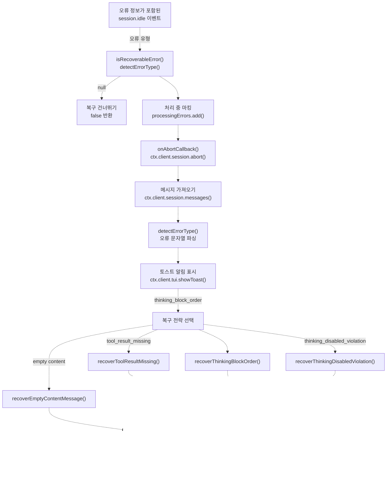

# 세션 복구 (Session Recovery)

> **관련 소스 파일**
> * [src/hooks/session-recovery/index.ts](https://github.com/code-yeongyu/oh-my-opencode/blob/b92cd6ab/src/hooks/session-recovery/index.ts)
> * [src/hooks/session-recovery/storage.ts](https://github.com/code-yeongyu/oh-my-opencode/blob/b92cd6ab/src/hooks/session-recovery/storage.ts)
> * [src/hooks/session-recovery/types.ts](https://github.com/code-yeongyu/oh-my-opencode/blob/b92cd6ab/src/hooks/session-recovery/types.ts)
> * [src/hooks/thinking-block-validator/index.ts](https://github.com/code-yeongyu/oh-my-opencode/blob/b92cd6ab/src/hooks/thinking-block-validator/index.ts)

## 목적 및 범위

세션 복구(Session Recovery)는 에이전트 실행 중 발생하는 API 오류를 자동으로 탐지, 진단 및 수정하는 **반응형 오류 처리 시스템(Reactive error handling system)**입니다. 잘못된 형식의 메시지 구조로 인해 API 요청이 실패하면, 세션 복구 시스템은 세션을 중단하고, 문제를 해결하기 위해 기본 스토리지를 조작하며, 선택적으로 실행을 재개합니다.

이 시스템은 오류가 **발생한 후**에 처리합니다(반응형). API 호출 전의 선제적 오류 방지에 대해서는 [메시지 검증(Message Validation)](/code-yeongyu/oh-my-opencode/7.2-message-validation)을 참조하십시오. 작업 완료 후 자동 작업 지속에 대해서는 [할 일 지속 강제 도구(Todo Continuation Enforcer)](/code-yeongyu/oh-my-opencode/7.3-todo-continuation-enforcer)를 참조하십시오.

**출처:** [src/hooks/session-recovery/index.ts L1-L431](https://github.com/code-yeongyu/oh-my-opencode/blob/b92cd6ab/src/hooks/session-recovery/index.ts#L1-L431)

---

## 시스템 아키텍처

세션 복구는 오류 정보를 포함한 `session.idle` 이벤트에 의해 트리거되는 훅(Hook)으로 작동합니다. 이 시스템은 탐지(Detection), 수리(Repair), 복구(Recovery)의 3단계 워크플로우를 구현합니다.

### 복구 훅 생명주기 (Recovery Hook Lifecycle)



**출처:** [src/hooks/session-recovery/index.ts L337-L422](https://github.com/code-yeongyu/oh-my-opencode/blob/b92cd6ab/src/hooks/session-recovery/index.ts#L337-L422)

---

## 오류 탐지 시스템

세션 복구는 문자열 패턴 매칭을 사용하여 API 응답에서 복구 가능한 오류를 식별합니다. `detectErrorType()` 함수는 중첩된 오류 객체에서 오류 메시지를 추출하고 알려진 패턴과 대조합니다.

### 오류 유형 탐지 로직

| 오류 유형 | 탐지 패턴 | 오류 메시지 예시 |
| --- | --- | --- |
| `tool_result_missing` | `"tool_use"` 및 `"tool_result"` 포함 | "tool_use block must have corresponding tool_result" |
| `thinking_block_order` | `"thinking"` 및 (`"first block"` 또는 `"must start with"` 또는 `"preceeding"` 또는 `"expected"`) 포함 | "Expected thinking/redacted_thinking but found tool_use at messages.3" |
| `thinking_disabled_violation` | `"thinking is disabled"` 및 `"cannot contain"` 포함 | "thinking is disabled for this model - message cannot contain thinking blocks" |
| `null` | 패턴 일치 없음 | `null` 반환, 복구 불가능한 오류 |

**출처:** [src/hooks/session-recovery/index.ts L125-L147](https://github.com/code-yeongyu/oh-my-opencode/blob/b92cd6ab/src/hooks/session-recovery/index.ts#L125-L147)

### 오류 메시지 추출

`getErrorMessage()` 함수는 여러 가능한 오류 객체 구조를 탐색하여 오류 메시지 문자열을 추출합니다.


**출처:** [src/hooks/session-recovery/index.ts L91-L117](https://github.com/code-yeongyu/oh-my-opencode/blob/b92cd6ab/src/hooks/session-recovery/index.ts#L91-L117)

### 메시지 인덱스 추출

오류가 특정 메시지 인덱스를 참조하는 경우(예: "messages.3"), `extractMessageIndex()` 함수는 정규식 패턴 매칭을 사용하여 인덱스를 파싱합니다.

```
// 패턴: /messages\.(\d+)/
// 예시: "Expected thinking at messages.3" → 3
```

**출처:** [src/hooks/session-recovery/index.ts L119-L123](https://github.com/code-yeongyu/oh-my-opencode/blob/b92cd6ab/src/hooks/session-recovery/index.ts#L119-L123)

---

## 복구 전략

복구 가능한 각 오류 유형에는 파일 시스템 기반의 메시지 스토리지를 조작하여 문제를 해결하는 전용 복구 함수가 있습니다.

### 도구 결과 누락 복구 (Tool Result Missing Recovery)

**오류 시나리오:** 도구 실행 중 사용자가 ESC를 눌러, 대응하는 `tool_result` 블록 없이 `tool_use` 블록만 남은 경우입니다.

**복구 프로세스:**

1. 실패한 어시스턴트 메시지 파트에서 `tool_use` ID를 추출합니다.
2. API 파트가 비어 있으면 파일 시스템에서 파트를 읽습니다 ([src/hooks/session-recovery/index.ts L158-L168](https://github.com/code-yeongyu/oh-my-opencode/blob/b92cd6ab/src/hooks/session-recovery/index.ts#L158-L168)).
3. 취소 메시지가 포함된 합성(Synthetic) `tool_result` 파트를 생성합니다.
4. `tool_result` 파트와 함께 `ctx.client.session.prompt()`를 통해 결과를 주입합니다.


**출처:** [src/hooks/session-recovery/index.ts L153-L192](https://github.com/code-yeongyu/oh-my-opencode/blob/b92cd6ab/src/hooks/session-recovery/index.ts#L153-L192)

### 생각 블록 순서 복구 (Thinking Block Order Recovery)

**오류 시나리오:** 어시스턴트 메시지에 콘텐츠 파트(tool_use, text)가 있지만 생각 블록(Thinking block)이 첫 번째 파트가 아닌 경우입니다. Anthropic API는 생각 블록이 다른 모든 콘텐츠보다 먼저 나와야 합니다.

**복구 프로세스:**

1. 오류에서 메시지 인덱스를 추출합니다 (예: "messages.3").
2. 인덱스를 사용할 수 있는 경우, `findMessageByIndexNeedingThinking()`을 호출합니다 ([src/hooks/session-recovery/storage.ts L370-L390](https://github.com/code-yeongyu/oh-my-opencode/blob/b92cd6ab/src/hooks/session-recovery/storage.ts#L370-L390)).
3. 인덱스가 없거나 찾지 못한 경우, `findMessagesWithOrphanThinking()`을 호출하여 문제가 있는 모든 메시지를 찾습니다 ([src/hooks/session-recovery/storage.ts L206-L232](https://github.com/code-yeongyu/oh-my-opencode/blob/b92cd6ab/src/hooks/session-recovery/storage.ts#L206-L232)).
4. 식별된 각 메시지에 대해 `prependThinkingPart()`를 호출하여 합성 생각 블록을 주입합니다.
5. 실험적 기능인 `auto_resume`이 활성화된 경우, 원래의 에이전트/모델 설정으로 세션을 재개합니다.


**생각 블록 주입:** `prependThinkingPart()` 함수는 ID가 `prt_0000000000_thinking`인 합성 생각 파트를 생성하며(가장 먼저 정렬됨), 가능한 경우 이전 어시스턴트 메시지의 생각 콘텐츠를 사용합니다 ([src/hooks/session-recovery/storage.ts L270-L296](https://github.com/code-yeongyu/oh-my-opencode/blob/b92cd6ab/src/hooks/session-recovery/storage.ts#L270-L296)).

**출처:** [src/hooks/session-recovery/index.ts L194-L223](https://github.com/code-yeongyu/oh-my-opencode/blob/b92cd6ab/src/hooks/session-recovery/index.ts#L194-L223)
[src/hooks/session-recovery/storage.ts L270-L296](https://github.com/code-yeongyu/oh-my-opencode/blob/b92cd6ab/src/hooks/session-recovery/storage.ts#L270-L296)

### 생각 비활성화 위반 복구 (Thinking Disabled Violation Recovery)

**오류 시나리오:** 모델이 확장된 생각(Extended thinking)을 지원하지 않지만(예: Claude-4가 아닌 모델), 메시지에 생각 블록이 포함된 경우입니다.

**복구 프로세스:**

1. `findMessagesWithThinkingBlocks()`를 호출하여 생각/추론 파트가 포함된 모든 메시지를 식별합니다.
2. 각 메시지에 대해 `stripThinkingParts()`를 호출하여 파일 시스템에서 생각 파트 파일을 삭제합니다.
3. 실험적 기능인 `auto_resume`이 활성화된 경우 세션을 재개합니다.


**출처:** [src/hooks/session-recovery/index.ts L225-L244](https://github.com/code-yeongyu/oh-my-opencode/blob/b92cd6ab/src/hooks/session-recovery/index.ts#L225-L244)

### 빈 콘텐츠 메시지 복구 (Empty Content Message Recovery)

**오류 시나리오:** 메시지에 콘텐츠가 없거나 빈 텍스트 파트만 있어 API 검증 오류가 발생하는 경우입니다.

**복구 프로세스:**

1. 인덱스 폴백(Fallback) 로직이 포함된 `findEmptyMessageByIndex()`를 통해 인덱스로 메시지를 찾습니다 ([src/hooks/session-recovery/storage.ts L134-L160](https://github.com/code-yeongyu/oh-my-opencode/blob/b92cd6ab/src/hooks/session-recovery/storage.ts#L134-L160)).
2. `findMessagesWithEmptyTextParts()`를 통해 빈 텍스트 파트가 있는 모든 메시지를 찾습니다 ([src/hooks/session-recovery/storage.ts L350-L368](https://github.com/code-yeongyu/oh-my-opencode/blob/b92cd6ab/src/hooks/session-recovery/storage.ts#L350-L368)).
3. `findMessagesWithThinkingOnly()`를 통해 생각 파트만 있는 메시지를 찾습니다 ([src/hooks/session-recovery/storage.ts L184-L204](https://github.com/code-yeongyu/oh-my-opencode/blob/b92cd6ab/src/hooks/session-recovery/storage.ts#L184-L204)).
4. 빈 텍스트 파트를 `"[user interrupted]"` 플레이스홀더(Placeholder)로 교체합니다.
5. 생각만 있는 메시지에 텍스트 파트를 주입합니다.


**인덱스 폴백 로직:** 시스템 메시지로 인해 API 인덱스가 스토리지 인덱스와 일치하지 않는 경우, `findEmptyMessageByIndex()`는 `[targetIndex, targetIndex-1, targetIndex+1, targetIndex-2, targetIndex+2, targetIndex-3, targetIndex-4, targetIndex-5]` 순서로 인덱스를 시도합니다 ([src/hooks/session-recovery/storage.ts L138-L147](https://github.com/code-yeongyu/oh-my-opencode/blob/b92cd6ab/src/hooks/session-recovery/storage.ts#L138-L147)).

**출처:** [src/hooks/session-recovery/index.ts L248-L305](https://github.com/code-yeongyu/oh-my-opencode/blob/b92cd6ab/src/hooks/session-recovery/index.ts#L248-L305)
[src/hooks/session-recovery/storage.ts L134-L160](https://github.com/code-yeongyu/oh-my-opencode/blob/b92cd6ab/src/hooks/session-recovery/storage.ts#L134-L160)

---

## 스토리지 조작 계층 (Storage Manipulation Layer)

세션 복구는 OpenCode가 유지 관리하는 파일 시스템 기반의 메시지 스토리지를 조작합니다. 메시지는 계층적 디렉토리 구조에 JSON 파일로 저장됩니다.

### 스토리지 구조


**스토리지 상수:**

* `MESSAGE_STORAGE`: `~/.local/state/opencode/messages/`
* `PART_STORAGE`: `~/.local/state/opencode/parts/`

**출처:** [src/hooks/session-recovery/constants.ts](https://github.com/code-yeongyu/oh-my-opencode/blob/b92cd6ab/src/hooks/session-recovery/constants.ts)
[src/hooks/session-recovery/storage.ts L12-L28](https://github.com/code-yeongyu/oh-my-opencode/blob/b92cd6ab/src/hooks/session-recovery/storage.ts#L12-L28)

### 핵심 스토리지 함수

| 함수 | 목적 | 파일 작업 |
| --- | --- | --- |
| `readMessages(sessionID)` | 세션의 모든 메시지 메타데이터 로드 | 세션 디렉토리의 모든 `.json` 파일 읽기, 타임스탬프순 정렬 |
| `readParts(messageID)` | 메시지의 모든 파트 로드 | 파트 디렉토리의 모든 `.json` 파일 읽기 |
| `getMessageDir(sessionID)` | 세션 디렉토리 경로 찾기 | 직접 및 중첩 경로 검색 |
| `generatePartId()` | 고유 파트 ID 생성 | 타임스탬프 + 랜덤: `prt_{hex}{random}` |

**출처:** [src/hooks/session-recovery/storage.ts L6-L69](https://github.com/code-yeongyu/oh-my-opencode/blob/b92cd6ab/src/hooks/session-recovery/storage.ts#L6-L69)

### 파트 조작 함수

| 함수 | 목적 | 구현 방식 |
| --- | --- | --- |
| `prependThinkingPart()` | 생각 블록을 첫 번째 파트로 추가 | ID가 `prt_0000000000_thinking`인 합성 파트 생성(가장 먼저 정렬), 이전 생각 콘텐츠 또는 플레이스홀더 사용 |
| `stripThinkingParts()` | 모든 생각/추론 파트 제거 | `THINKING_TYPES`와 일치하는 파트 파일 삭제 |
| `injectTextPart()` | 메시지에 텍스트 파트 추가 | `generatePartId()`를 사용하여 합성 텍스트 파트 생성 |
| `replaceEmptyTextParts()` | 빈 텍스트를 플레이스홀더로 교체 | 공백을 제외한 내용이 없는 텍스트 파트를 찾아 플레이스홀더 텍스트로 교체 |

**출처:** [src/hooks/session-recovery/storage.ts L96-L348](https://github.com/code-yeongyu/oh-my-opencode/blob/b92cd6ab/src/hooks/session-recovery/storage.ts#L96-L348)

### 파트 탐지 함수

| 함수 | 목적 | 반환 유형 |
| --- | --- | --- |
| `findMessagesWithOrphanThinking()` | 첫 번째 파트가 생각이 아닌 메시지 찾기 | `string[]` (메시지 ID 목록) |
| `findMessagesWithThinkingBlocks()` | 생각 파트가 포함된 메시지 찾기 | `string[]` |
| `findMessagesWithThinkingOnly()` | 콘텐츠 없이 생각만 있는 메시지 찾기 | `string[]` |
| `findMessagesWithEmptyTextParts()` | 빈 텍스트 파트가 있는 메시지 찾기 | `string[]` |
| `findEmptyMessages()` | 콘텐츠 파트가 없는 메시지 찾기 | `string[]` |
| `findEmptyMessageByIndex()` | 폴백을 사용하여 API 인덱스로 빈 메시지 찾기 | `string \| null` |
| `findMessageByIndexNeedingThinking()` | 생각 블록이 누락된 인덱스의 메시지 찾기 | `string \| null` |

**파트 유형 분류:**

* `THINKING_TYPES`: `{"thinking", "redacted_thinking", "reasoning"}`
* `META_TYPES`: `{"step-start", "step-finish"}`
* 콘텐츠 유형: `"text"`, `"tool"`, `"tool_use"`, `"tool_result"`

**출처:** [src/hooks/session-recovery/storage.ts L121-L390](https://github.com/code-yeongyu/oh-my-opencode/blob/b92cd6ab/src/hooks/session-recovery/storage.ts#L121-L390)
[src/hooks/session-recovery/constants.ts](https://github.com/code-yeongyu/oh-my-opencode/blob/b92cd6ab/src/hooks/session-recovery/constants.ts)

---

## 조정 및 통합

### 콜백 시스템

세션 복구는 다른 시스템, 특히 [백그라운드 매니저(Background Manager)](/code-yeongyu/oh-my-opencode/6.1-background-manager)와의 조정을 위해 두 가지 콜백을 제공합니다.

```typescript
interface SessionRecoveryHook {
  setOnAbortCallback: (callback: (sessionID: string) => void) => void
  setOnRecoveryCompleteCallback: (callback: (sessionID: string) => void) => void
}
```

**콜백 순서:**

1. `onAbortCallback(sessionID)` - 세션을 복구 중으로 표시하기 위해 `session.abort()` **전**에 호출됩니다.
2. 세션 중단(Abort) 발생
3. 스토리지 조작
4. `onRecoveryCompleteCallback(sessionID)` - `finally` 블록에서 호출되며 실행이 보장됩니다.

**백그라운드 매니저 통합:** 백그라운드 매니저는 이러한 콜백을 사용하여 복구 중에 부적절한 작업 완료를 방지하고 복구가 완료된 후 모니터링을 재개합니다 ([src/background-manager.ts](https://github.com/code-yeongyu/oh-my-opencode/blob/b92cd6ab/src/background-manager.ts)).

**출처:** [src/hooks/session-recovery/index.ts L312-L331](https://github.com/code-yeongyu/oh-my-opencode/blob/b92cd6ab/src/hooks/session-recovery/index.ts#L312-L331)
[src/hooks/session-recovery/index.ts L351-L420](https://github.com/code-yeongyu/oh-my-opencode/blob/b92cd6ab/src/hooks/session-recovery/index.ts#L351-L420)

### 재개 설정 (Resume Configuration)

설정에서 `experimental.auto_resume`이 활성화된 경우, 세션 복구는 생각 관련 오류를 수정한 후 자동으로 세션을 재개합니다.

```yaml
interface ResumeConfig {
  sessionID: string
  agent?: string
  model?: {
    providerID: string
    modelID: string
  }
}
```

재개 설정은 원래의 에이전트 및 모델 선택을 유지하기 위해 마지막 사용자 메시지에서 추출됩니다 ([src/hooks/session-recovery/index.ts L67-L73](https://github.com/code-yeongyu/oh-my-opencode/blob/b92cd6ab/src/hooks/session-recovery/index.ts#L67-L73)).

**재개 텍스트:** `"[session recovered - continuing previous task]"`

**지원되는 오류 유형:**

* `thinking_block_order` - 생각 블록을 앞에 추가한 후 자동 재개
* `thinking_disabled_violation` - 생각 블록을 제거한 후 자동 재개

도구 결과 오류는 취소에 대한 사용자 확인이 필요하므로 자동 재개되지 **않습니다**.

**출처:** [src/hooks/session-recovery/index.ts L56-L89](https://github.com/code-yeongyu/oh-my-opencode/blob/b92cd6ab/src/hooks/session-recovery/index.ts#L56-L89)
[src/hooks/session-recovery/index.ts L396-L407](https://github.com/code-yeongyu/oh-my-opencode/blob/b92cd6ab/src/hooks/session-recovery/index.ts#L396-L407)

### 토스트 알림

세션 복구는 사용자에게 복구 작업을 알리기 위해 토스트 알림을 표시합니다.

| 오류 유형 | 토스트 제목 | 토스트 메시지 |
| --- | --- | --- |
| `tool_result_missing` | "Tool Crash Recovery" | "Injecting cancelled tool results..." |
| `thinking_block_order` | "Thinking Block Recovery" | "Fixing message structure..." |
| `thinking_disabled_violation` | "Thinking Strip Recovery" | "Stripping thinking blocks..." |

토스트 설정: `variant: "warning"`, `duration: 3000ms`

**출처:** [src/hooks/session-recovery/index.ts L368-L388](https://github.com/code-yeongyu/oh-my-opencode/blob/b92cd6ab/src/hooks/session-recovery/index.ts#L368-L388)

---

## 중복 방지

세션 복구는 동일한 메시지에 대해 중복 복구 시도를 방지하기 위해 `processingErrors` 세트를 유지합니다.

```javascript
const processingErrors = new Set<string>()

// 처리 전 확인
if (processingErrors.has(assistantMsgID)) return false
processingErrors.add(assistantMsgID)

// finally 블록에서 항상 정리
processingErrors.delete(assistantMsgID)
```

이를 통해 동일한 실패 메시지에 대해 여러 오류 이벤트가 전달될 때 발생할 수 있는 경쟁 상태(Race condition)를 방지합니다.

**출처:** [src/hooks/session-recovery/index.ts L320-L421](https://github.com/code-yeongyu/oh-my-opencode/blob/b92cd6ab/src/hooks/session-recovery/index.ts#L320-L421)

---

## 실험적 기능

### 자동 재개 (Auto-Resume)

[oh-my-opencode.json](../getting-started/Configuration-Files.md)에서 `experimental.auto_resume`이 활성화된 경우, 세션 복구는 생각 관련 오류를 수정한 후 세션을 자동으로 재개합니다.

```json
{
  "experimental": {
    "auto_resume": true
  }
}
```

**동작:**

* 마지막 사용자 메시지에서 에이전트와 모델을 추출합니다.
* 재개 프롬프트를 주입합니다: `"[session recovered - continuing previous task]"`
* `thinking_block_order` 및 `thinking_disabled_violation` 오류에만 적용됩니다.
* 도구 결과 오류는 수동 지속이 필요합니다.

**출처:** [src/hooks/session-recovery/index.ts L319-L407](https://github.com/code-yeongyu/oh-my-opencode/blob/b92cd6ab/src/hooks/session-recovery/index.ts#L319-L407)

---

## 오류 유형 참조

### 전체 오류 유형 매핑


**출처:** [src/hooks/session-recovery/index.ts L26-L30](https://github.com/code-yeongyu/oh-my-opencode/blob/b92cd6ab/src/hooks/session-recovery/index.ts#L26-L30)
[src/hooks/session-recovery/index.ts L125-L147](https://github.com/code-yeongyu/oh-my-opencode/blob/b92cd6ab/src/hooks/session-recovery/index.ts#L125-L147)

---

## 선제적 검증과의 비교

세션 복구(반응형)는 [생각 블록 검증기(Thinking Block Validator)](/code-yeongyu/oh-my-opencode/7.2-message-validation)(선제적)를 보완합니다.

| 측면 | 세션 복구 (반응형) | 생각 블록 검증기 (선제적) |
| --- | --- | --- |
| **트리거** | API 오류 발생 후 | API 호출 전송 전 |
| **훅 지점** | 오류가 포함된 `session.idle` | `experimental.chat.messages.transform` |
| **접근 방식** | 스토리지 수정, 중단, 재개 | 메모리 내 메시지 변환 |
| **사용자 경험** | 오류 표시 후 복구 | 오류 방지, 사용자에게 보이지 않음 |
| **스토리지 영향** | 파일 시스템 수정 | 파일 시스템 변경 없음 |
| **범위** | 4가지 오류 유형 | 생각 블록 순서만 해당 |
| **비용** | 세션 중단 오버헤드 | 오버헤드 없음 |

**설계 철학:** 선제적 검증은 대부분의 생각 블록 오류를 방지하지만, 세션 복구는 이를 빠져나가는 경우(경쟁 상태, 스토리지 손상, API 변경)를 처리하고 생각 이외의 오류(도구 결과, 빈 콘텐츠)도 처리합니다.

**출처:** [src/hooks/thinking-block-validator/index.ts L1-L15](https://github.com/code-yeongyu/oh-my-opencode/blob/b92cd6ab/src/hooks/thinking-block-validator/index.ts#L1-L15)
[src/hooks/session-recovery/index.ts L1-L431](https://github.com/code-yeongyu/oh-my-opencode/blob/b92cd6ab/src/hooks/session-recovery/index.ts#L1-L431)