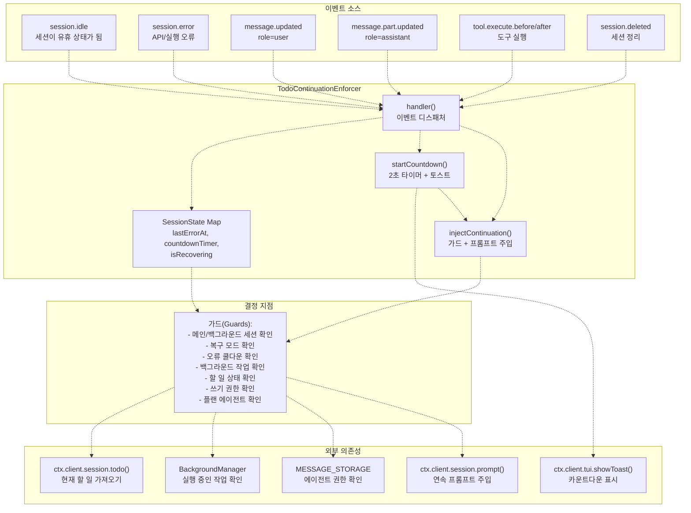
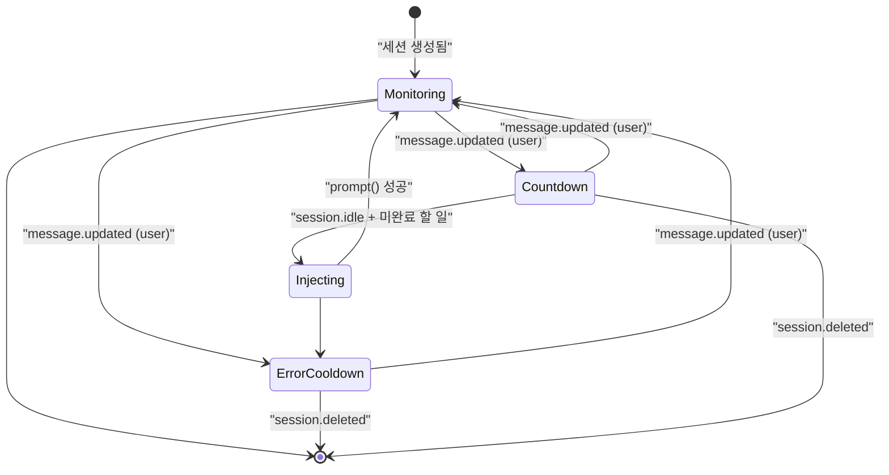
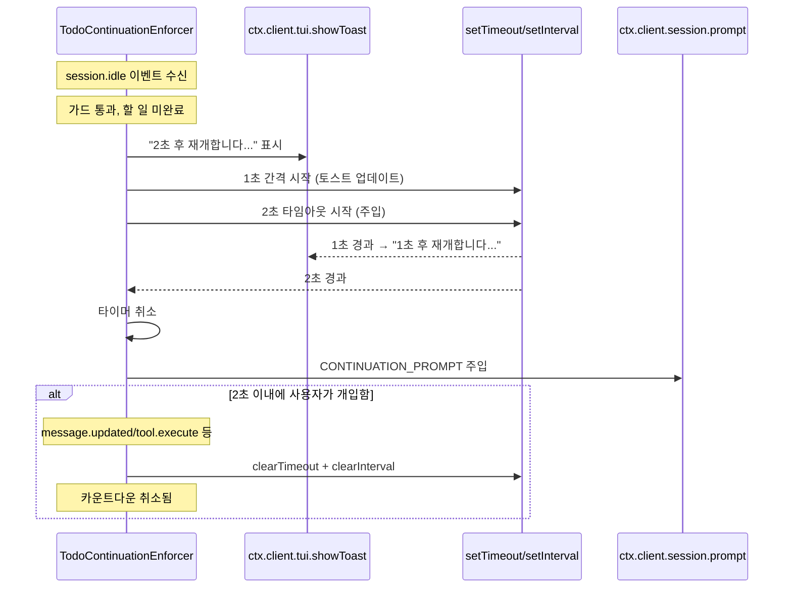
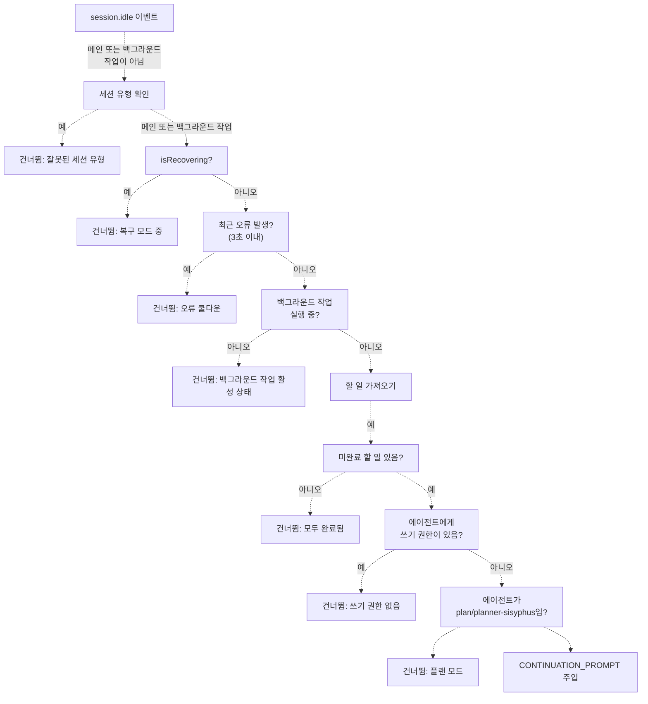
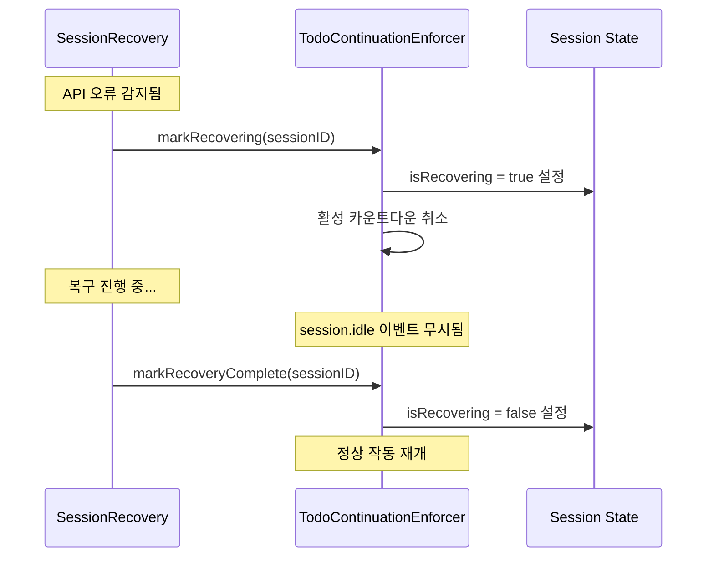
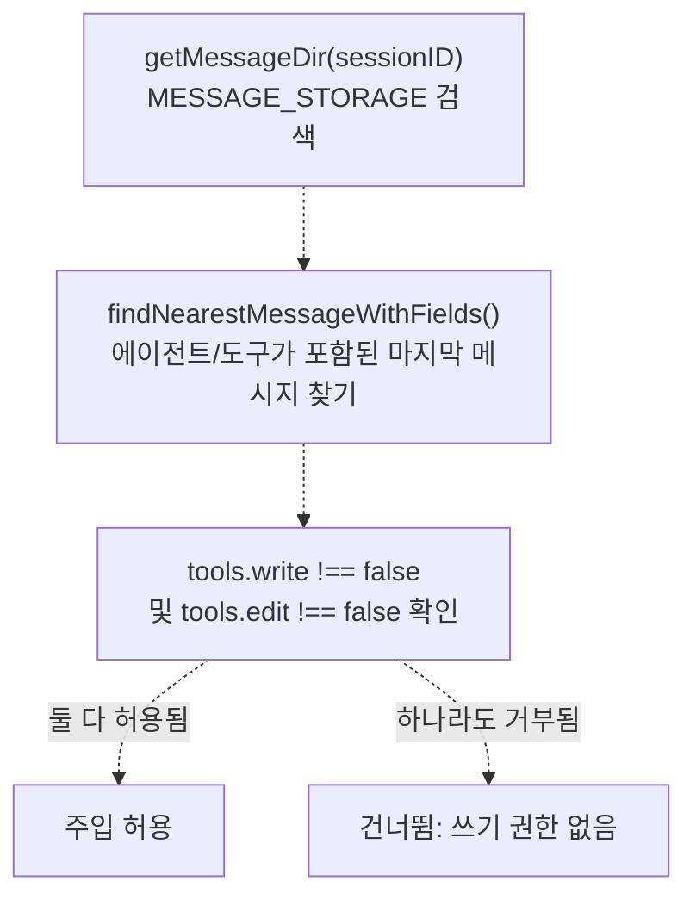
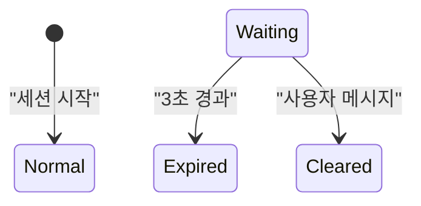

# Todo Continuation Enforcer

> **관련 소스 파일**
> * [src/hooks/non-interactive-env/constants.ts](https://github.com/code-yeongyu/oh-my-opencode/blob/b92cd6ab/src/hooks/non-interactive-env/constants.ts)
> * [src/hooks/non-interactive-env/detector.ts](https://github.com/code-yeongyu/oh-my-opencode/blob/b92cd6ab/src/hooks/non-interactive-env/detector.ts)
> * [src/hooks/non-interactive-env/index.ts](https://github.com/code-yeongyu/oh-my-opencode/blob/b92cd6ab/src/hooks/non-interactive-env/index.ts)
> * [src/hooks/non-interactive-env/types.ts](https://github.com/code-yeongyu/oh-my-opencode/blob/b92cd6ab/src/hooks/non-interactive-env/types.ts)
> * [src/hooks/todo-continuation-enforcer.test.ts](https://github.com/code-yeongyu/oh-my-opencode/blob/b92cd6ab/src/hooks/todo-continuation-enforcer.test.ts)
> * [src/hooks/todo-continuation-enforcer.ts](https://github.com/code-yeongyu/oh-my-opencode/blob/b92cd6ab/src/hooks/todo-continuation-enforcer.ts)

## 목적 및 범위 (Purpose and Scope)

Todo Continuation Enforcer는 세션 유휴(idle) 이벤트를 모니터링하고 완료되지 않은 할 일(todo)이 남아 있을 때 연속 프롬프트를 주입하는 자동 작업 완료 시스템입니다. 이 훅(hook)은 세션이 유휴 상태가 되면 2초 카운트다운 후 자동으로 "continue"를 프롬프트하여, 에이전트가 사용자의 수동 개입 없이 다단계 작업을 완료할 수 있도록 보장합니다.

이 페이지는 enforcer의 이벤트 기반 아키텍처, 카운트다운 시스템, 세션 상태 관리 및 조정 메커니즘을 설명합니다. Sisyphus의 할 일 관리 워크플로우 규칙에 대한 정보는 [Todo Management](/code-yeongyu/oh-my-opencode/4.1.2-todo-management)를 참조하십시오. 세션 복구 오류 처리에 대해서는 [Session Recovery](/code-yeongyu/oh-my-opencode/7.1-session-recovery)를 참조하십시오.

**출처:** [src/hooks/todo-continuation-enforcer.ts L1-L378](https://github.com/code-yeongyu/oh-my-opencode/blob/b92cd6ab/src/hooks/todo-continuation-enforcer.ts#L1-L378)

## 시스템 개요 (System Overview)

Todo Continuation Enforcer는 세션 수명 주기 이벤트를 수신하고 특정 조건(세션 유휴 상태, 할 일 미완료, 진행 중인 충돌 작업 없음)이 충족될 때만 개입하는 수동적 모니터로 작동합니다.



**출처:** [src/hooks/todo-continuation-enforcer.ts L89-L377](https://github.com/code-yeongyu/oh-my-opencode/blob/b92cd6ab/src/hooks/todo-continuation-enforcer.ts#L89-L377)

## 핵심 구성 요소 (Core Components)

### 팩토리 함수 (Factory Function)

`createTodoContinuationEnforcer` 팩토리는 선택적인 백그라운드 매니저 통합 기능이 포함된 enforcer 인스턴스를 생성합니다.

| 매개변수 | 타입 | 용도 |
| --- | --- | --- |
| `ctx` | `PluginInput` | API 액세스를 위한 OpenCode 플러그인 컨텍스트 |
| `options.backgroundManager` | `BackgroundManager?` | 실행 중인 백그라운드 작업을 확인하기 위한 선택적 통합 |

**반환값:** `handler`, `markRecovering`, `markRecoveryComplete` 메서드를 포함하는 객체.

**출처:** [src/hooks/todo-continuation-enforcer.ts L89-L92](https://github.com/code-yeongyu/oh-my-opencode/blob/b92cd6ab/src/hooks/todo-continuation-enforcer.ts#L89-L92)

### 세션 상태 구조 (Session State Structure)

모니터링되는 각 세션은 상태 추적을 유지합니다.

```sql
interface SessionState {
  lastErrorAt?: number          // 마지막 오류 타임스탬프 (쿨다운용)
  countdownTimer?: ReturnType<typeof setTimeout>  // 2초 주입 타이머
  countdownInterval?: ReturnType<typeof setInterval>  // 1초 토스트 업데이트 간격
  isRecovering?: boolean        // 복구 조정 플래그
}
```

상태 맵은 enforcer 인스턴스별로 메모리에 저장되며 세션이 삭제될 때 정리됩니다.

**출처:** [src/hooks/todo-continuation-enforcer.ts L31-L36](https://github.com/code-yeongyu/oh-my-opencode/blob/b92cd6ab/src/hooks/todo-continuation-enforcer.ts#L31-L36)

 [src/hooks/todo-continuation-enforcer.ts L94-L103](https://github.com/code-yeongyu/oh-my-opencode/blob/b92cd6ab/src/hooks/todo-continuation-enforcer.ts#L94-L103)

## 이벤트 흐름 아키텍처 (Event Flow Architecture)

enforcer의 이벤트 처리는 상태 머신(state machine) 패턴을 따릅니다.



### 이벤트 핸들러 디스패치 테이블 (Event Handler Dispatch Table)

| 이벤트 유형 | 동작 | 상태 변경 |
| --- | --- | --- |
| `session.idle` | 가드 확인 → 카운트다운 시작 | 없음 (카운트다운은 별도로 관리됨) |
| `session.error` | 오류 타임스탬프 기록, 카운트다운 취소 | `lastErrorAt = Date.now()` |
| `message.updated` (user) | 오류 상태 해제, 카운트다운 취소 | `lastErrorAt = undefined` |
| `message.updated` (assistant) | 카운트다운 취소 | 없음 |
| `message.part.updated` (assistant) | 카운트다운 취소 | 없음 |
| `tool.execute.before` | 카운트다운 취소 | 없음 |
| `tool.execute.after` | 카운트다운 취소 | 없음 |
| `session.deleted` | 타이머 및 상태 정리 | 맵에서 세션 제거 |

**출처:** [src/hooks/todo-continuation-enforcer.ts L246-L370](https://github.com/code-yeongyu/oh-my-opencode/blob/b92cd6ab/src/hooks/todo-continuation-enforcer.ts#L246-L370)

## 카운트다운 시스템 (Countdown System)

### 카운트다운 수명 주기 (Countdown Lifecycle)

`session.idle`이 모든 가드를 통과하면 2초 카운트다운이 시작됩니다.



**상수:**

* `COUNTDOWN_SECONDS = 2`: 주입 전 대기 시간 [src/hooks/todo-continuation-enforcer.ts L46](https://github.com/code-yeongyu/oh-my-opencode/blob/b92cd6ab/src/hooks/todo-continuation-enforcer.ts#L46-L46)
* `TOAST_DURATION_MS = 900`: 각 토스트가 표시되는 시간 [src/hooks/todo-continuation-enforcer.ts L47](https://github.com/code-yeongyu/oh-my-opencode/blob/b92cd6ab/src/hooks/todo-continuation-enforcer.ts#L47-L47)

**출처:** [src/hooks/todo-continuation-enforcer.ts L224-L244](https://github.com/code-yeongyu/oh-my-opencode/blob/b92cd6ab/src/hooks/todo-continuation-enforcer.ts#L224-L244)

 [src/hooks/todo-continuation-enforcer.ts L139-L148](https://github.com/code-yeongyu/oh-my-opencode/blob/b92cd6ab/src/hooks/todo-continuation-enforcer.ts#L139-L148)

### 취소 트리거 (Cancellation Triggers)

다음 이벤트 중 하나라도 발생하면 카운트다운이 즉시 취소됩니다.

1. **사용자 활동**: `role="user"`인 `message.updated` [src/hooks/todo-continuation-enforcer.ts L328-L335](https://github.com/code-yeongyu/oh-my-opencode/blob/b92cd6ab/src/hooks/todo-continuation-enforcer.ts#L328-L335)
2. **어시스턴트 활동**: `role="assistant"`인 `message.updated` 또는 `message.part.updated` [src/hooks/todo-continuation-enforcer.ts L337-L351](https://github.com/code-yeongyu/oh-my-opencode/blob/b92cd6ab/src/hooks/todo-continuation-enforcer.ts#L337-L351)
3. **도구 실행**: `tool.execute.before` 또는 `tool.execute.after` [src/hooks/todo-continuation-enforcer.ts L354-L360](https://github.com/code-yeongyu/oh-my-opencode/blob/b92cd6ab/src/hooks/todo-continuation-enforcer.ts#L354-L360)
4. **세션 삭제**: `session.deleted` [src/hooks/todo-continuation-enforcer.ts L362-L369](https://github.com/code-yeongyu/oh-my-opencode/blob/b92cd6ab/src/hooks/todo-continuation-enforcer.ts#L362-L369)

이를 통해 enforcer가 활발한 작업을 방해하지 않도록 보장합니다.

**출처:** [src/hooks/todo-continuation-enforcer.ts L105-L117](https://github.com/code-yeongyu/oh-my-opencode/blob/b92cd6ab/src/hooks/todo-continuation-enforcer.ts#L105-L117)

## 주입 로직 및 가드 (Injection Logic and Guards)

### 가드 조건 (Guard Conditions)

`injectContinuation` 함수는 프롬프트를 주입하기 전에 여러 가드를 적용합니다.



### 가드 구현 세부 사항 (Guard Implementation Details)

| 가드 | 위치 | 로직 |
| --- | --- | --- |
| **세션 유형** | [src/hooks/todo-continuation-enforcer.ts L267-L274](https://github.com/code-yeongyu/oh-my-opencode/blob/b92cd6ab/src/hooks/todo-continuation-enforcer.ts#L267-L274) | 메인 세션(`getMainSessionID()`를 통해) 또는 백그라운드 작업 세션(`subagentSessions`를 통해)만 허용 |
| **복구 모드** | [src/hooks/todo-continuation-enforcer.ts L153-L156](https://github.com/code-yeongyu/oh-my-opencode/blob/b92cd6ab/src/hooks/todo-continuation-enforcer.ts#L153-L156) | `state.isRecovering === true`인 경우 건너뜀 |
| **오류 쿨다운** | [src/hooks/todo-continuation-enforcer.ts L158-L161](https://github.com/code-yeongyu/oh-my-opencode/blob/b92cd6ab/src/hooks/todo-continuation-enforcer.ts#L158-L161) | `Date.now() - state.lastErrorAt < 3000`인 경우 건너뜀 |
| **백그라운드 작업** | [src/hooks/todo-continuation-enforcer.ts L163-L170](https://github.com/code-yeongyu/oh-my-opencode/blob/b92cd6ab/src/hooks/todo-continuation-enforcer.ts#L163-L170) | `backgroundManager.getTasksByParentSession(sessionID).some(t => t.status === "running")`인 경우 건너뜀 |
| **미완료 할 일** | [src/hooks/todo-continuation-enforcer.ts L172-L185](https://github.com/code-yeongyu/oh-my-opencode/blob/b92cd6ab/src/hooks/todo-continuation-enforcer.ts#L172-L185) | API를 통해 할 일을 가져와 미완료 상태(status != "completed" && status != "cancelled") 개수 확인 |
| **쓰기 권한** | [src/hooks/todo-continuation-enforcer.ts L187-L196](https://github.com/code-yeongyu/oh-my-opencode/blob/b92cd6ab/src/hooks/todo-continuation-enforcer.ts#L187-L196) | `MESSAGE_STORAGE`에서 에이전트의 `tools.write !== false` 및 `tools.edit !== false` 확인 |
| **플랜 에이전트** | [src/hooks/todo-continuation-enforcer.ts L198-L202](https://github.com/code-yeongyu/oh-my-opencode/blob/b92cd6ab/src/hooks/todo-continuation-enforcer.ts#L198-L202) | 에이전트 이름이 "plan" 또는 "planner-sisyphus"인 경우 건너뜀 |

**출처:** [src/hooks/todo-continuation-enforcer.ts L150-L222](https://github.com/code-yeongyu/oh-my-opencode/blob/b92cd6ab/src/hooks/todo-continuation-enforcer.ts#L150-L222)

 [src/hooks/todo-continuation-enforcer.ts L261-L318](https://github.com/code-yeongyu/oh-my-opencode/blob/b92cd6ab/src/hooks/todo-continuation-enforcer.ts#L261-L318)

### 연속 프롬프트 (Continuation Prompt)

모든 가드를 통과하면 다음 프롬프트가 주입됩니다.

```
[SYSTEM REMINDER - TODO CONTINUATION]

Incomplete tasks remain in your todo list. Continue working on the next pending task.

- Proceed without asking for permission
- Mark each task complete when finished
- Do not stop until all tasks are done

[Status: X/Y completed, Z remaining]
```

상태 줄은 실제 완료 횟수에 따라 동적으로 생성됩니다.

**출처:** [src/hooks/todo-continuation-enforcer.ts L38-L45](https://github.com/code-yeongyu/oh-my-opencode/blob/b92cd6ab/src/hooks/todo-continuation-enforcer.ts#L38-L45)

 [src/hooks/todo-continuation-enforcer.ts L204-L221](https://github.com/code-yeongyu/oh-my-opencode/blob/b92cd6ab/src/hooks/todo-continuation-enforcer.ts#L204-L221)

## 다른 시스템과의 협업 (Coordination with Other Systems)

### 세션 복구 통합 (Session Recovery Integration)

enforcer는 세션 복구 시스템을 위한 조정 메서드를 제공합니다.



**메서드:**

* `markRecovering(sessionID)`: 복구 플래그를 설정하고 카운트다운을 취소합니다. [src/hooks/todo-continuation-enforcer.ts L124-L129](https://github.com/code-yeongyu/oh-my-opencode/blob/b92cd6ab/src/hooks/todo-continuation-enforcer.ts#L124-L129)
* `markRecoveryComplete(sessionID)`: 복구 플래그를 해제합니다. [src/hooks/todo-continuation-enforcer.ts L131-L137](https://github.com/code-yeongyu/oh-my-opencode/blob/b92cd6ab/src/hooks/todo-continuation-enforcer.ts#L131-L137)

이를 통해 enforcer가 세션 복구 작업을 방해하는 것을 방지합니다.

**출처:** [src/hooks/todo-continuation-enforcer.ts L18-L22](https://github.com/code-yeongyu/oh-my-opencode/blob/b92cd6ab/src/hooks/todo-continuation-enforcer.ts#L18-L22)

 [src/hooks/todo-continuation-enforcer.ts L124-L137](https://github.com/code-yeongyu/oh-my-opencode/blob/b92cd6ab/src/hooks/todo-continuation-enforcer.ts#L124-L137)

### 백그라운드 매니저 통합 (Background Manager Integration)

enforcer는 충돌을 피하기 위해 백그라운드 매니저를 쿼리합니다.

```javascript
const hasRunningBgTasks = backgroundManager
  ? backgroundManager.getTasksByParentSession(sessionID).some(t => t.status === "running")
  : false
```

세션에 대해 실행 중인 백그라운드 작업이 있는 경우 연속 주입을 건너뜁니다. 이는 Explore 또는 Librarian과 같은 에이전트가 병렬로 작업하는 동안 조기에 연속 프롬프트가 발생하는 것을 방지합니다.

**출처:** [src/hooks/todo-continuation-enforcer.ts L163-L170](https://github.com/code-yeongyu/oh-my-opencode/blob/b92cd6ab/src/hooks/todo-continuation-enforcer.ts#L163-L170)

 [src/hooks/todo-continuation-enforcer.ts L288-L295](https://github.com/code-yeongyu/oh-my-opencode/blob/b92cd6ab/src/hooks/todo-continuation-enforcer.ts#L288-L295)

### 할 일 시스템 통합 (Todo System Integration)

enforcer는 OpenCode API를 통해 현재 할 일 목록을 가져옵니다.

```javascript
const response = await ctx.client.session.todo({ path: { id: sessionID } })
const todos = (response.data ?? response) as Todo[]
```

미완료 할 일은 "completed" 및 "cancelled" 상태를 필터링하여 계산됩니다.

```javascript
function getIncompleteCount(todos: Todo[]): number {
  return todos.filter(t => t.status !== "completed" && t.status !== "cancelled").length
}
```

**출처:** [src/hooks/todo-continuation-enforcer.ts L24-L29](https://github.com/code-yeongyu/oh-my-opencode/blob/b92cd6ab/src/hooks/todo-continuation-enforcer.ts#L24-L29)

 [src/hooks/todo-continuation-enforcer.ts L85-L87](https://github.com/code-yeongyu/oh-my-opencode/blob/b92cd6ab/src/hooks/todo-continuation-enforcer.ts#L85-L87)

 [src/hooks/todo-continuation-enforcer.ts L172-L179](https://github.com/code-yeongyu/oh-my-opencode/blob/b92cd6ab/src/hooks/todo-continuation-enforcer.ts#L172-L179)

## 권한 및 에이전트 확인 (Permission and Agent Checks)

### 쓰기 권한 감지 (Write Permission Detection)

enforcer는 `MESSAGE_STORAGE`에서 마지막 메시지를 읽어 현재 에이전트에게 쓰기 권한이 있는지 확인합니다.



이를 통해 Oracle 또는 Librarian과 같은 읽기 전용 에이전트에 대한 연속 주입을 방지합니다.

**출처:** [src/hooks/todo-continuation-enforcer.ts L50-L62](https://github.com/code-yeongyu/oh-my-opencode/blob/b92cd6ab/src/hooks/todo-continuation-enforcer.ts#L50-L62)

 [src/hooks/todo-continuation-enforcer.ts L187-L196](https://github.com/code-yeongyu/oh-my-opencode/blob/b92cd6ab/src/hooks/todo-continuation-enforcer.ts#L187-L196)

### 플랜 에이전트 감지 (Plan Agent Detection)

enforcer는 plan/planner 에이전트에 대한 주입을 건너뜁니다.

```javascript
const agentName = prevMessage?.agent?.toLowerCase() ?? ""
if (agentName === "plan" || agentName === "planner-sisyphus") {
  log(`[${HOOK_NAME}] Skipped: plan mode agent`, { sessionID, agent: prevMessage?.agent })
  return
}
```

플랜 에이전트는 실행이 아닌 상위 수준의 작업 계획을 위한 것이므로 자동 연속 주입은 부적절합니다.

**출처:** [src/hooks/todo-continuation-enforcer.ts L198-L202](https://github.com/code-yeongyu/oh-my-opencode/blob/b92cd6ab/src/hooks/todo-continuation-enforcer.ts#L198-L202)

## 오류 처리 (Error Handling)

### 오류 쿨다운 메커니즘 (Error Cooldown Mechanism)

`session.error`가 발생하면 3초의 쿨다운이 적용되어 즉각적인 연속 주입을 방지합니다.



**쿨다운 해제 조건:**

1. **시간 기반**: 3초 경과 [src/hooks/todo-continuation-enforcer.ts L158-L161](https://github.com/code-yeongyu/oh-my-opencode/blob/b92cd6ab/src/hooks/todo-continuation-enforcer.ts#L158-L161)
2. **사용자 개입**: 사용자가 메시지를 보냄 [src/hooks/todo-continuation-enforcer.ts L328-L335](https://github.com/code-yeongyu/oh-my-opencode/blob/b92cd6ab/src/hooks/todo-continuation-enforcer.ts#L328-L335)

쿨다운 상수는 `ERROR_COOLDOWN_MS = 3_000` (3초)입니다.

**출처:** [src/hooks/todo-continuation-enforcer.ts L48](https://github.com/code-yeongyu/oh-my-opencode/blob/b92cd6ab/src/hooks/todo-continuation-enforcer.ts#L48-L48)

 [src/hooks/todo-continuation-enforcer.ts L249-L259](https://github.com/code-yeongyu/oh-my-opencode/blob/b92cd6ab/src/hooks/todo-continuation-enforcer.ts#L249-L259)

### 중단(Abort) 오류 감지 (Abort Error Detection)

enforcer는 중단/취소 오류를 감지하여 다른 오류와 구분합니다.

```javascript
function isAbortError(error: unknown): boolean {
  // 다음 사항을 확인합니다:
  // - MessageAbortedError / AbortError / DOMException 이름
  // - 메시지에 "aborted", "cancelled", "interrupted" 포함 여부
  // - abort/cancel/interrupt를 포함하는 문자열 오류
}
```

이 함수는 현재 로그 기록용으로 사용되며 차등 처리를 위해 사용되지는 않습니다.

**출처:** [src/hooks/todo-continuation-enforcer.ts L64-L83](https://github.com/code-yeongyu/oh-my-opencode/blob/b92cd6ab/src/hooks/todo-continuation-enforcer.ts#L64-L83)

## 테스트 및 검증 (Testing and Validation)

### 테스트 커버리지 (Test Coverage)

[src/hooks/todo-continuation-enforcer.test.ts L1-L404](https://github.com/code-yeongyu/oh-my-opencode/blob/b92cd6ab/src/hooks/todo-continuation-enforcer.test.ts#L1-L404)의 테스트 스위트는 다음을 다룹니다.

| 테스트 시나리오 | 검증 내용(Assertion) |
| --- | --- |
| 미완료 할 일이 있는 유휴 상태 | 카운트다운 시작, 2초 후 주입 발생 |
| 모든 할 일 완료됨 | 주입 발생하지 않음 |
| 백그라운드 작업 실행 중 | 주입 발생하지 않음 |
| 메인 세션이 아님 | 주입 발생하지 않음 (백그라운드 작업 세션 제외) |
| 백그라운드 작업 세션 | 주입 발생 (서브 에이전트 세션 허용됨) |
| 최근 오류 발생 | 쿨다운 동안 주입 발생하지 않음 |
| 오류 후 사용자 메시지 | 오류 해제됨, 주입 재개 |
| 카운트다운 중 사용자 메시지 | 카운트다운 취소됨 |
| 어시스턴트 활동 | 카운트다운 취소됨 |
| 도구 실행 | 카운트다운 취소됨 |
| 복구 모드 | 주입 발생하지 않음 |
| 복구 완료 | 주입 재개 |
| 세션 삭제됨 | 타이머 정리됨, 주입 발생하지 않음 |
| 10초 스로틀 없음 | 여러 번의 연속 주입 허용됨 |

**출처:** [src/hooks/todo-continuation-enforcer.test.ts L1-L404](https://github.com/code-yeongyu/oh-my-opencode/blob/b92cd6ab/src/hooks/todo-continuation-enforcer.test.ts#L1-L404)

## 구성 (Configuration)

Todo Continuation Enforcer에는 사용자가 설정할 수 있는 구성 옵션이 없습니다. 동작은 다음에 의해 제어됩니다.

1. [src/hooks/todo-continuation-enforcer.ts L46-L48](https://github.com/code-yeongyu/oh-my-opencode/blob/b92cd6ab/src/hooks/todo-continuation-enforcer.ts#L46-L48)에 정의된 **하드코딩된 상수**
2. 생성 시 전달되는 **선택적 BackgroundManager** [src/hooks/todo-continuation-enforcer.ts L14-L16](https://github.com/code-yeongyu/oh-my-opencode/blob/b92cd6ab/src/hooks/todo-continuation-enforcer.ts#L14-L16)
3. 자동으로 관리되는 **세션 레벨 상태**

enforcer는 설치 시 항상 활성화되며 구성을 통해 비활성화할 수 없습니다.

**출처:** [src/hooks/todo-continuation-enforcer.ts L46-L48](https://github.com/code-yeongyu/oh-my-opencode/blob/b92cd6ab/src/hooks/todo-continuation-enforcer.ts#L46-L48)

 [src/hooks/todo-continuation-enforcer.ts L89-L92](https://github.com/code-yeongyu/oh-my-opencode/blob/b92cd6ab/src/hooks/todo-continuation-enforcer.ts#L89-L92)