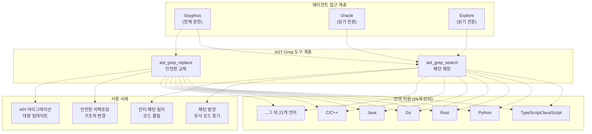
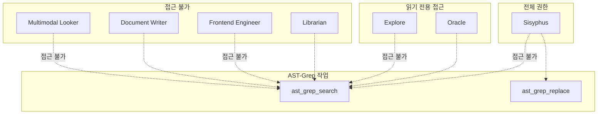
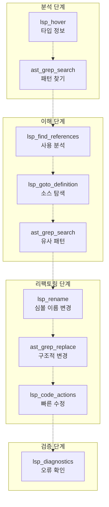
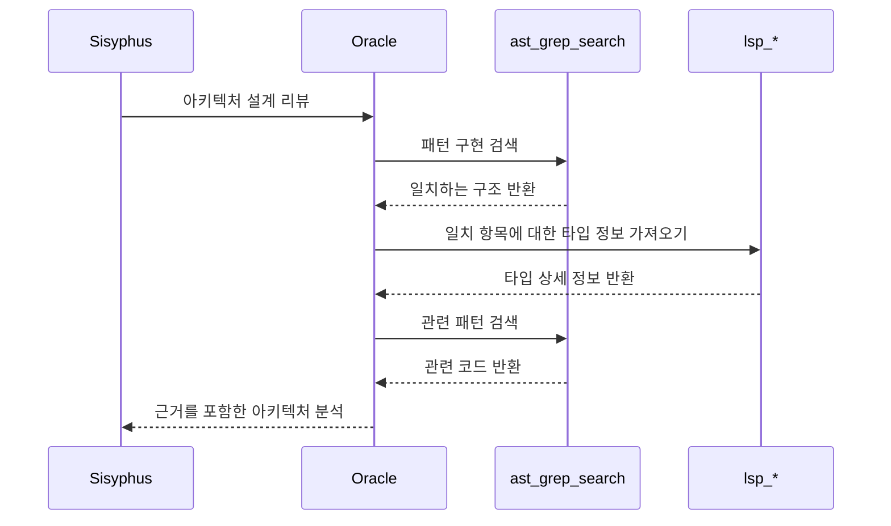
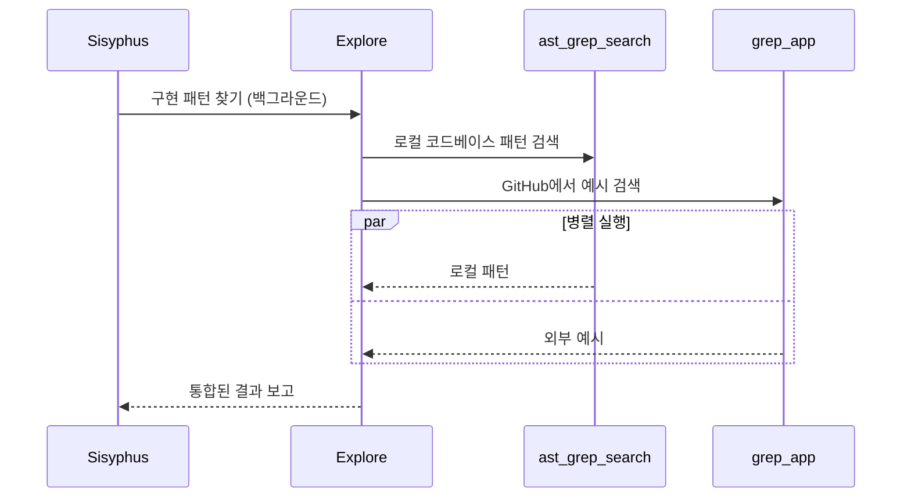
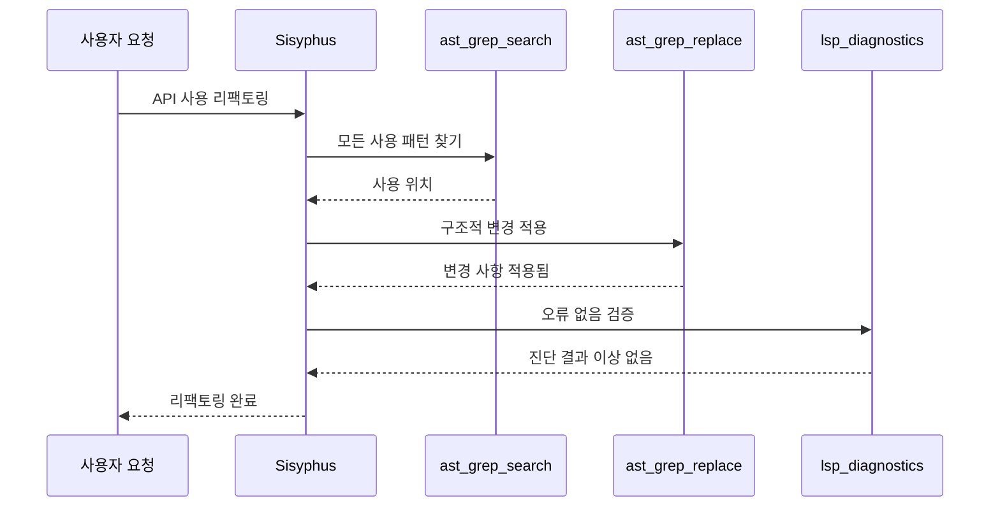

# AST-Grep 도구

> **관련 소스 파일**
> * [README.ja.md](https://github.com/code-yeongyu/oh-my-opencode/blob/b92cd6ab/README.ja.md)
> * [README.ko.md](https://github.com/code-yeongyu/oh-my-opencode/blob/b92cd6ab/README.ko.md)
> * [README.md](https://github.com/code-yeongyu/oh-my-opencode/blob/b92cd6ab/README.md)
> * [README.zh-cn.md](https://github.com/code-yeongyu/oh-my-opencode/blob/b92cd6ab/README.zh-cn.md)
> * [src/shared/config-path.ts](https://github.com/code-yeongyu/oh-my-opencode/blob/b92cd6ab/src/shared/config-path.ts)
> * [src/tools/background-task/constants.ts](https://github.com/code-yeongyu/oh-my-opencode/blob/b92cd6ab/src/tools/background-task/constants.ts)
> * [src/tools/background-task/index.ts](https://github.com/code-yeongyu/oh-my-opencode/blob/b92cd6ab/src/tools/background-task/index.ts)
> * [src/tools/background-task/types.ts](https://github.com/code-yeongyu/oh-my-opencode/blob/b92cd6ab/src/tools/background-task/types.ts)
> * [src/tools/call-omo-agent/constants.ts](https://github.com/code-yeongyu/oh-my-opencode/blob/b92cd6ab/src/tools/call-omo-agent/constants.ts)
> * [src/tools/interactive-bash/constants.ts](https://github.com/code-yeongyu/oh-my-opencode/blob/b92cd6ab/src/tools/interactive-bash/constants.ts)
> * [src/tools/look-at/constants.ts](https://github.com/code-yeongyu/oh-my-opencode/blob/b92cd6ab/src/tools/look-at/constants.ts)
> * [src/tools/look-at/tools.ts](https://github.com/code-yeongyu/oh-my-opencode/blob/b92cd6ab/src/tools/look-at/tools.ts)

## 목적 및 범위

이 문서는 25개의 프로그래밍 언어에 대해 Abstract Syntax Tree(AST, 추상 구문 트리) 기반의 코드 검색 및 교체 기능을 제공하는 oh-my-opencode의 AST-Grep 도구 통합에 대해 다룹니다. AST-Grep 도구는 에이전트가 단순한 텍스트 기반 검색을 넘어 구조적인 코드 패턴 매칭과 안전한 리팩토링(refactoring) 작업을 수행할 수 있도록 지원합니다.

Language Server Protocol(LSP) 작업(타입 정보, 탐색, 진단)에 대해서는 [LSP 도구](/code-yeongyu/oh-my-opencode/5.1-lsp-tools)를 참조하십시오. 에이전트별 도구 기능에 대해서는 [특화된 에이전트](/code-yeongyu/oh-my-opencode/4.2-specialized-agents)를 참조하십시오.

출처: [README.md L169](https://github.com/code-yeongyu/oh-my-opencode/blob/b92cd6ab/README.md#L169-L169)

 [README.md L524](https://github.com/code-yeongyu/oh-my-opencode/blob/b92cd6ab/README.md#L524-L524)

## 개요

AST-Grep 도구는 두 가지 주요 작업을 통해 구문 인식 코드 조작 기능을 제공합니다.

| 도구 | 목적 | 안전 수준 |
| --- | --- | --- |
| `ast_grep_search` | 코드베이스 전반의 구조적 패턴 매칭 | 읽기 전용 |
| `ast_grep_replace` | AST 인식 코드 교체 | 쓰기 (안전한 리팩토링) |

이 도구들은 코드를 단순한 텍스트로 취급하는 대신, 추상 구문 트리 분석을 활용하여 코드 구조를 이해합니다. 이를 통해 언어의 의미론(semantics), 변수 스코프(scope), 코드 구조를 존중하는 정밀한 패턴 매칭이 가능해집니다.

출처: [README.md L524](https://github.com/code-yeongyu/oh-my-opencode/blob/b92cd6ab/README.md#L524-L524)

## 도구 아키텍처



출처: [README.md L169](https://github.com/code-yeongyu/oh-my-opencode/blob/b92cd6ab/README.md#L169-L169)

 [README.md L524](https://github.com/code-yeongyu/oh-my-opencode/blob/b92cd6ab/README.md#L524-L524)

## 도구 정의

### ast_grep_search

AST 구조를 이용한 패턴 기반 코드 검색입니다. 언어의 구문과 의미론을 준수하면서 코드 패턴을 매칭합니다.

**주요 특징:**

* 텍스트가 아닌 추상 구문 트리에서 작동합니다.
* 유연한 매칭을 위해 패턴 변수를 지원합니다.
* 언어 인식 매칭(스코프, 구문 준수)을 수행합니다.
* 컨텍스트가 포함된 구조화된 결과를 반환합니다.

**일반적인 패턴 유형:**

* 함수/메서드 선언
* 변수 사용 패턴
* Import/export 문
* 제어 흐름 구조
* 타입 어노테이션(Type annotations)

출처: [README.md L524](https://github.com/code-yeongyu/oh-my-opencode/blob/b92cd6ab/README.md#L524-L524)

### ast_grep_replace

구문적 정확성을 유지하는 구조적 코드 교체입니다. 코드의 의미론을 보존하는 리팩토링 작업을 수행합니다.

**안전 기능:**

* 적용 전 교체 구문의 유효성을 검증합니다.
* 적절한 들여쓰기와 포맷팅을 유지합니다.
* 언어별 구문 규칙을 준수합니다.
* 주변 코드 구조를 보존합니다.

**전형적인 작업:**

* 스코프를 인식한 함수/변수 이름 변경
* API 호출 패턴 업데이트
* Import 문 수정
* 코드 구조 리팩토링

출처: [README.md L524](https://github.com/code-yeongyu/oh-my-opencode/blob/b92cd6ab/README.md#L524-L524)

## 에이전트 접근 패턴



**접근 근거:**

* **Sisyphus**: 구현 및 리팩토링 작업을 위한 전체 권한 보유
* **Oracle**: 아키텍처 분석 및 코드 리뷰를 위한 읽기 전용 권한 보유
* **Explore**: 패턴 발견 및 코드베이스 탐색을 위한 읽기 전용 권한 보유
* **Librarian**: 접근 권한 없음 (외부 문서에 집중)
* **Frontend/DocWriter/Multimodal**: 접근 권한 없음 (특화된 도메인)

출처: [README.md L466-L470](https://github.com/code-yeongyu/oh-my-opencode/blob/b92cd6ab/README.md#L466-L470)

 [README.md L468-L470](https://github.com/code-yeongyu/oh-my-opencode/blob/b92cd6ab/README.md#L468-L470)

## 언어 지원

AST-Grep 도구는 통합된 패턴 구문을 통해 25개의 프로그래밍 언어를 지원합니다.

**웹 및 모바일:**

* JavaScript, TypeScript, JSX, TSX
* HTML, CSS
* Kotlin, Swift, Dart

**시스템 및 백엔드:**

* Rust, Go, C, C++
* Java, C#, Scala

**스크립팅 및 데이터:**

* Python, Ruby, Lua
* PHP, Bash

**기타:**

* Elixir, Haskell, OCaml, Thrift

각 언어의 AST 구조는 자동으로 처리되므로, 에이전트는 서로 다른 코드베이스에서도 일관된 패턴 구문을 사용할 수 있습니다.

출처: [README.md L524](https://github.com/code-yeongyu/oh-my-opencode/blob/b92cd6ab/README.md#L524-L524)

## 개발 워크플로우와의 통합



AST-Grep 도구는 다음과 같은 기능을 제공하여 LSP 작업을 보완합니다.

* 심볼 기반 검색을 넘어서는 구조적 패턴 매칭
* 파일 간 리팩토링 기능
* 언어 중립적인 패턴 구문
* 대량 수정 지원

출처: [README.md L512-L525](https://github.com/code-yeongyu/oh-my-opencode/blob/b92cd6ab/README.md#L512-L525)

## 일반적인 사용 패턴

### 패턴 발견

에이전트는 다음과 같은 목적으로 `ast_grep_search`를 사용하여 코드 패턴을 찾습니다.

**아키텍처 이해:**

* 인터페이스의 모든 구현체 식별
* 특정 API의 사용 패턴 찾기
* 유사한 에러 처리 방식 위치 파악

**코드 품질 분석:**

* 안티 패턴 탐지 (예: 누락된 null 체크)
* 일관성 없는 코딩 스타일 찾기
* 더 이상 사용되지 않는(deprecated) API 사용 식별

**마이그레이션 지원:**

* 업데이트가 필요한 모든 인스턴스 위치 파악
* 호환성 문제 식별
* 버전별 코드 패턴 찾기

출처: [README.md L524](https://github.com/code-yeongyu/oh-my-opencode/blob/b92cd6ab/README.md#L524-L524)

### 안전한 리팩토링

에이전트는 다음과 같은 목적으로 `ast_grep_replace`를 사용합니다.

**API 마이그레이션:**

```yaml
Pattern: 이전 API 호출 구조
Replacement: 새로운 API 호출 구조
Scope: 코드베이스 전체
```

**일관성 강제:**

```yaml
Pattern: 일관성 없는 에러 처리
Replacement: 표준화된 에러 처리
Scope: 특정 파일 패턴
```

**구조적 업데이트:**

```yaml
Pattern: 레거시 코드 구조
Replacement: 현대적인 대체 구조
Scope: 대상 디렉토리
```

출처: [README.md L524](https://github.com/code-yeongyu/oh-my-opencode/blob/b92cd6ab/README.md#L524-L524)

## 워크플로우 예시

### Oracle 리뷰 워크플로우



Oracle은 코드를 수정하지 않고 아키텍처 결정을 위한 근거를 수집하기 위해 읽기 전용 모드로 AST-Grep을 사용합니다.

출처: [README.md L466-L470](https://github.com/code-yeongyu/oh-my-opencode/blob/b92cd6ab/README.md#L466-L470)

### Explore 발견 워크플로우



Explore는 포괄적인 패턴 발견을 위해 AST-Grep(로컬 패턴)과 grep_app(외부 예시)을 결합합니다.

출처: [README.md L469](https://github.com/code-yeongyu/oh-my-opencode/blob/b92cd6ab/README.md#L469-L469)

### Sisyphus 리팩토링 워크플로우



Sisyphus는 안전하고 검증된 리팩토링 작업을 수행하기 위해 AST-Grep에 대한 전체 권한을 사용합니다.

출처: [README.md L466-L470](https://github.com/code-yeongyu/oh-my-opencode/blob/b92cd6ab/README.md#L466-L470)

## 도구 협업 패턴

### AST-Grep + LSP 시너지

**패턴 매칭 → 심볼 탐색:**

1. `ast_grep_search`를 사용하여 구조적 패턴 찾기
2. `lsp_goto_definition`을 사용하여 구현체로 이동
3. `lsp_find_references`를 사용하여 사용 현황 이해

**리팩토링 → 검증:**

1. `ast_grep_replace`를 사용하여 구조적 변경 수행
2. `lsp_diagnostics`를 사용하여 정확성 검증
3. `lsp_code_actions`를 사용하여 정리 작업 수행

출처: [README.md L512-L525](https://github.com/code-yeongyu/oh-my-opencode/blob/b92cd6ab/README.md#L512-L525)

### 멀티 에이전트 패턴

**병렬 발견:**

* Explore가 AST-Grep을 사용하여 로컬 패턴 탐색 (비동기)
* Librarian이 외부 MCP를 사용하여 문서 탐색 (비동기)
* Sisyphus가 구현을 위해 발견된 사항들을 집계

**순차적 개선:**

* Oracle이 AST-Grep을 사용하여 기존 패턴 분석
* Sisyphus가 AST-Grep을 사용하여 개선 사항 구현
* LSP 진단을 통한 검증

출처: [README.md L466-L470](https://github.com/code-yeongyu/oh-my-opencode/blob/b92cd6ab/README.md#L466-L470)

## 설정 및 커스터마이징

AST-Grep 도구 접근 권한은 에이전트 설정을 통해 제어됩니다.

```json
{
  "agents": {
    "explore": {
      "tools": {
        "ast_grep_search": true,
        "ast_grep_replace": false
      }
    },
    "oracle": {
      "tools": {
        "ast_grep_search": true,
        "ast_grep_replace": false
      }
    }
  }
}
```

커스텀 에이전트는 개발 워크플로우에서의 역할에 따라 AST-Grep 접근 권한을 선택적으로 구성할 수 있습니다.

출처: [README.md L772-L808](https://github.com/code-yeongyu/oh-my-opencode/blob/b92cd6ab/README.md#L772-L808)

## 성능 특성

**검색 성능:**

* AST 파싱 오버헤드: 파일당 1회 발생
* 패턴 매칭: 복잡한 패턴의 경우 정규식(regex)보다 빠름
* 파일 간 검색: 병렬화됨
* 결과 캐싱: 활성화됨

**교체 성능:**

* 구문 검증: 적용 전 수행
* 증분 업데이트: 수정된 파일만 처리
* 롤백 지원: LSP 진단을 통해 지원
* 원자적 작업: 파일 단위로 수행

출처: [README.md L524](https://github.com/code-yeongyu/oh-my-opencode/blob/b92cd6ab/README.md#L524-L524)

## 권장 사항 (Best Practices)

**패턴 매칭 시:**

* 구체적인 패턴으로 시작하고, 필요한 경우 범위를 넓히십시오.
* 유연성을 위해 패턴 변수를 사용하십시오.
* 타입 인식 검색을 위해 LSP와 결합하십시오.
* 대량 작업 전에 결과를 검증하십시오.

**리팩토링 시:**

* 변경 사항을 미리 보기 위해 교체 전 항상 검색을 먼저 수행하십시오.
* 변경 후에는 LSP 진단으로 검증하십시오.
* 영향 범위(blast radius)를 제한하기 위해 대상 범위를 지정하십시오.
* 구조적 변경 후에는 크리티컬 패스(critical paths)를 테스트하십시오.

**에이전트 위임 시:**

* 패턴 발견에는 Explore를 사용하십시오 (병렬).
* 아키텍처 패턴 분석에는 Oracle을 사용하십시오.
* 교체(Replace) 작업은 Sisyphus를 위해 남겨두십시오.
* 모든 변경 사항은 LSP 도구로 검증하십시오.

출처: [README.md L466-L470](https://github.com/code-yeongyu/oh-my-opencode/blob/b92cd6ab/README.md#L466-L470)

 [README.md L524](https://github.com/code-yeongyu/oh-my-opencode/blob/b92cd6ab/README.md#L524-L524)