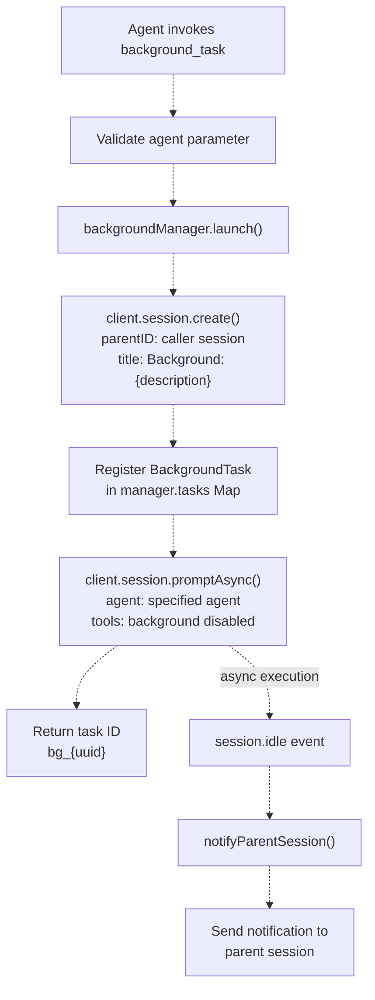
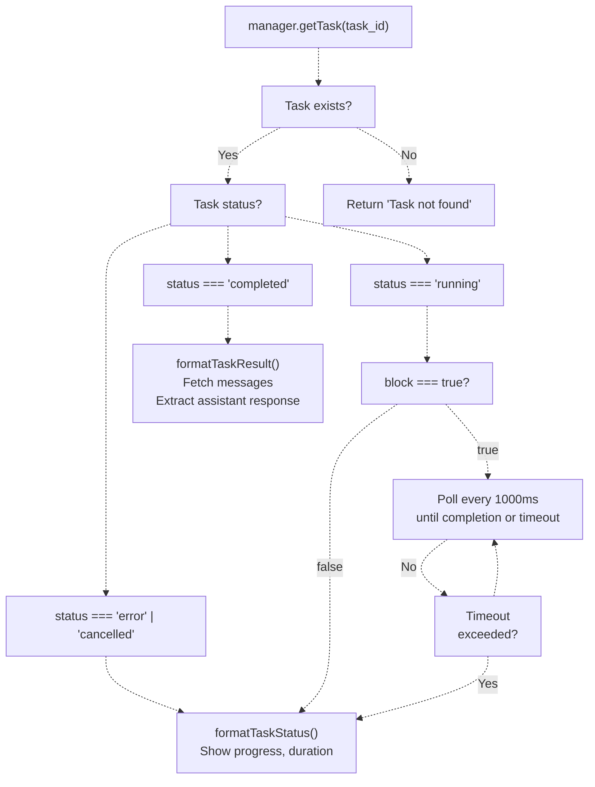
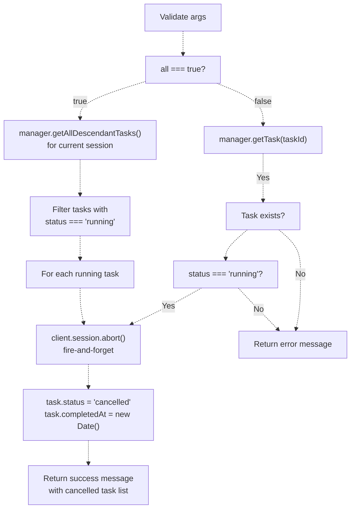
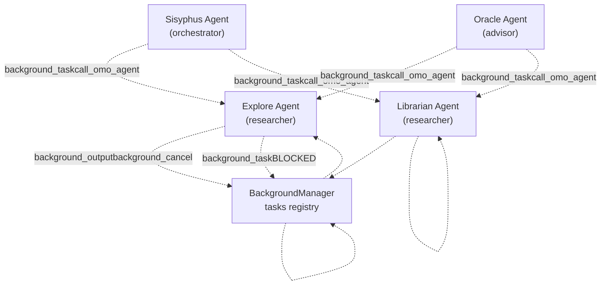
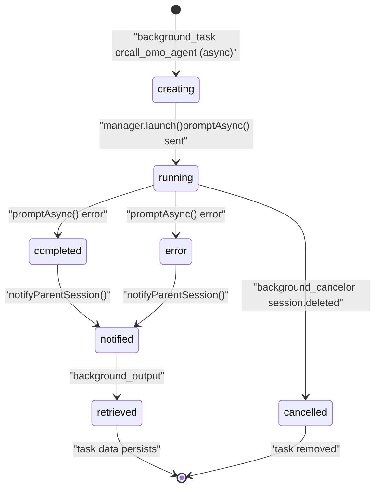

# 백그라운드 작업 도구 (Background Task Tools)

> **관련 소스 파일**
> * [.opencode/background-tasks.json](https://github.com/code-yeongyu/oh-my-opencode/blob/b92cd6ab/.opencode/background-tasks.json)
> * [src/features/background-agent/index.ts](https://github.com/code-yeongyu/oh-my-opencode/blob/b92cd6ab/src/features/background-agent/index.ts)
> * [src/features/background-agent/manager.test.ts](https://github.com/code-yeongyu/oh-my-opencode/blob/b92cd6ab/src/features/background-agent/manager.test.ts)
> * [src/features/background-agent/manager.ts](https://github.com/code-yeongyu/oh-my-opencode/blob/b92cd6ab/src/features/background-agent/manager.ts)
> * [src/features/background-agent/types.ts](https://github.com/code-yeongyu/oh-my-opencode/blob/b92cd6ab/src/features/background-agent/types.ts)
> * [src/tools/background-task/constants.ts](https://github.com/code-yeongyu/oh-my-opencode/blob/b92cd6ab/src/tools/background-task/constants.ts)
> * [src/tools/background-task/index.ts](https://github.com/code-yeongyu/oh-my-opencode/blob/b92cd6ab/src/tools/background-task/index.ts)
> * [src/tools/background-task/tools.ts](https://github.com/code-yeongyu/oh-my-opencode/blob/b92cd6ab/src/tools/background-task/tools.ts)
> * [src/tools/background-task/types.ts](https://github.com/code-yeongyu/oh-my-opencode/blob/b92cd6ab/src/tools/background-task/types.ts)
> * [src/tools/call-omo-agent/constants.ts](https://github.com/code-yeongyu/oh-my-opencode/blob/b92cd6ab/src/tools/call-omo-agent/constants.ts)
> * [src/tools/call-omo-agent/tools.ts](https://github.com/code-yeongyu/oh-my-opencode/blob/b92cd6ab/src/tools/call-omo-agent/tools.ts)
> * [src/tools/interactive-bash/constants.ts](https://github.com/code-yeongyu/oh-my-opencode/blob/b92cd6ab/src/tools/interactive-bash/constants.ts)
> * [src/tools/look-at/constants.ts](https://github.com/code-yeongyu/oh-my-opencode/blob/b92cd6ab/src/tools/look-at/constants.ts)
> * [src/tools/look-at/tools.ts](https://github.com/code-yeongyu/oh-my-opencode/blob/b92cd6ab/src/tools/look-at/tools.ts)

## 목적 및 범위 (Purpose and Scope)

백그라운드 작업 도구는 oh-my-opencode 시스템 내에서 비동기(Asynchronous) 에이전트 실행을 가능하게 합니다. 이 페이지에서는 백그라운드 작업을 생성, 모니터링 및 관리하는 도구인 `background_task`, `background_output`, `background_cancel` 및 `call_omo_agent` 의 비동기 모드에 대해 설명합니다. 백그라운드 작업 관리 인프라에 대한 자세한 내용은 [Background Execution System](../background-execution/)을 참조하십시오. 동기식(Synchronous) 에이전트 위임에 대해서는 [Analytical Agents](/code-yeongyu/oh-my-opencode/4.2-specialized-agents)를 참조하십시오.

이러한 도구들을 통해 에이전트는 부모 에이전트가 다른 작업을 계속 수행하는 동안, 격리된 세션에서 실행되는 병렬 작업을 생성할 수 있습니다. 시스템은 백그라운드 작업이 완료되면 부모 에이전트에게 자동으로 알림을 보냅니다.

---

## 도구 개요 (Tool Overview)

시스템은 백그라운드 작업 관리를 위해 네 가지 도구를 제공합니다.

| 도구 이름 | 목적 | 반환값 | 주요 사용 사례 |
| --- | --- | --- | --- |
| `background_task` | 모든 에이전트를 백그라운드 작업으로 실행 | Task ID | 임의의 에이전트 병렬 실행 |
| `background_output` | 백그라운드 작업의 출력 가져오기 | 작업 상태 또는 결과 | 진행 상황 확인 또는 완료된 결과 회수 |
| `background_cancel` | 실행 중인 백그라운드 작업 취소 | 성공/실패 메시지 | 최종 답변 전 불필요한 작업 중단 |
| `call_omo_agent` | explore/librarian 호출 (동기 또는 비동기) | Task ID (비동기) 또는 결과 (동기) | 특화된 에이전트 위임 |

Sources: [src/tools/background-task/tools.ts L1-L332](https://github.com/code-yeongyu/oh-my-opencode/blob/b92cd6ab/src/tools/background-task/tools.ts#L1-L332)

 [src/tools/call-omo-agent/tools.ts L1-L179](https://github.com/code-yeongyu/oh-my-opencode/blob/b92cd6ab/src/tools/call-omo-agent/tools.ts#L1-L179)

 [src/tools/background-task/constants.ts L1-L8](https://github.com/code-yeongyu/oh-my-opencode/blob/b92cd6ab/src/tools/background-task/constants.ts#L1-L8)

---

## background_task 도구

### 설명 (Description)

`background_task` 도구는 등록된 모든 에이전트를 백그라운드 작업으로 실행하며, 즉시 작업 ID(Task ID)를 반환합니다. 시스템은 격리된 세션을 생성하고 에이전트를 비동기적으로 실행하며, 완료 시 부모 세션에 알림을 보냅니다.

```javascript
export const BACKGROUND_TASK_DESCRIPTION = `Run agent task in background. Returns task_id immediately; notifies on completion.

Use \`background_output\` to get results. Prompts MUST be in English.`
```

Sources: [src/tools/background-task/constants.ts L1-L3](https://github.com/code-yeongyu/oh-my-opencode/blob/b92cd6ab/src/tools/background-task/constants.ts#L1-L3)

 [src/tools/background-task/tools.ts L23-L63](https://github.com/code-yeongyu/oh-my-opencode/blob/b92cd6ab/src/tools/background-task/tools.ts#L23-L63)

### 도구 인자 (Tool Arguments)

```yaml
{
  description: string  // 짧은 작업 설명 (상태 표시줄에 표시됨)
  prompt: string      // 에이전트를 위한 상세 프롬프트 전체 내용
  agent: string       // 사용할 에이전트 유형 (등록된 모든 에이전트 가능)
}
```

`agent` 파라미터는 explore/librarian으로 제한되는 `call_omo_agent`와 달리 시스템에 등록된 모든 에이전트를 수용합니다.

Sources: [src/tools/background-task/tools.ts L26-L30](https://github.com/code-yeongyu/oh-my-opencode/blob/b92cd6ab/src/tools/background-task/tools.ts#L26-L30)

### 실행 흐름 (Execution Flow)



**그림 1: background_task 실행 흐름**

Sources: [src/tools/background-task/tools.ts L31-L62](https://github.com/code-yeongyu/oh-my-opencode/blob/b92cd6ab/src/tools/background-task/tools.ts#L31-L62)

 [src/features/background-agent/manager.ts L69-L137](https://github.com/code-yeongyu/oh-my-opencode/blob/b92cd6ab/src/features/background-agent/manager.ts#L69-L137)

### 반환값 (Return Value)

```yaml
Background task launched successfully.

Task ID: bg_wzsdt60b
Session ID: ses_4f3e89f0dffeooeXNVx5QCifse
Description: Explore opencode in codebase
Agent: explore
Status: running

The system will notify you when the task completes.
Use `background_output` tool with task_id="bg_wzsdt60b" to check progress:
- block=false (default): Check status immediately - returns full status info
- block=true: Wait for completion (rarely needed since system notifies)
```

Sources: [src/tools/background-task/tools.ts L45-L56](https://github.com/code-yeongyu/oh-my-opencode/blob/b92cd6ab/src/tools/background-task/tools.ts#L45-L56)

### 도구 제한 사항 (Tool Restrictions)

백그라운드 작업은 재귀적인 백그라운드 도구 사용을 자동으로 비활성화합니다.

```yaml
tools: {
  task: false,
  background_task: false,
}
```

이는 백그라운드 작업의 무한 중첩을 방지하고 깔끔한 작업 계층 구조를 보장합니다.

Sources: [src/features/background-agent/manager.ts L113-L116](https://github.com/code-yeongyu/oh-my-opencode/blob/b92cd6ab/src/features/background-agent/manager.ts#L113-L116)

### 오류 처리 (Error Handling)

이 도구는 다음과 같은 여러 오류 케이스를 처리합니다.

* **에이전트 파라미터 누락**: 에이전트 지정을 요청하는 오류 메시지를 반환합니다.
* **유효하지 않은 에이전트 이름**: 에이전트 생성 오류를 포착하고 유용한 메시지를 제공합니다.
* **세션 생성 실패**: API의 상세 메시지와 함께 오류를 발생시킵니다.

```
if (!args.agent || args.agent.trim() === "") {
  return `❌ Agent parameter is required. Please specify which agent to use (e.g., "explore", "librarian", "build", etc.)`
}
```

Sources: [src/tools/background-task/tools.ts L32-L34](https://github.com/code-yeongyu/oh-my-opencode/blob/b92cd6ab/src/tools/background-task/tools.ts#L32-L34)

 [src/features/background-agent/manager.ts L119-L134](https://github.com/code-yeongyu/oh-my-opencode/blob/b92cd6ab/src/features/background-agent/manager.ts#L119-L134)

---

## background_output 도구

### 설명 (Description)

`background_output` 도구는 백그라운드 작업의 상태 또는 결과를 조회합니다. 비차단(Non-blocking) 상태 확인과 완료될 때까지 기다리는 차단(Blocking) 대기를 모두 지원합니다.

```javascript
export const BACKGROUND_OUTPUT_DESCRIPTION = `Get output from background task. System notifies on completion, so block=true rarely needed.`
```

Sources: [src/tools/background-task/constants.ts L5](https://github.com/code-yeongyu/oh-my-opencode/blob/b92cd6ab/src/tools/background-task/constants.ts#L5-L5)

 [src/tools/background-task/tools.ts L196-L260](https://github.com/code-yeongyu/oh-my-opencode/blob/b92cd6ab/src/tools/background-task/tools.ts#L196-L260)

### 도구 인자 (Tool Arguments)

```yaml
{
  task_id: string         // 출력을 가져올 작업 ID
  block?: boolean        // 완료될 때까지 대기 (기본값: false)
  timeout?: number       // 최대 대기 시간(ms) (기본값: 60000, 최대: 600000)
}
```

시스템이 작업 완료 시 자동으로 알림을 보내므로 `block` 파라미터는 선택 사항이며 기본값은 `false`입니다. 차단 대기는 거의 필요하지 않지만 특수한 경우를 위해 제공됩니다.

Sources: [src/tools/background-task/tools.ts L199-L203](https://github.com/code-yeongyu/oh-my-opencode/blob/b92cd6ab/src/tools/background-task/tools.ts#L199-L203)

### 실행 로직 (Execution Logic)



**그림 2: background_output 실행 로직**

Sources: [src/tools/background-task/tools.ts L204-L258](https://github.com/code-yeongyu/oh-my-opencode/blob/b92cd6ab/src/tools/background-task/tools.ts#L204-L258)

### 응답 형식 - 실행 중인 작업 (Response Format - Running Task)

작업이 여전히 실행 중일 때, `formatTaskStatus()`는 진행 정보를 담은 마크다운 테이블을 반환합니다.

```markdown
# Task Status

| Field | Value |
|-------|-------|
| Task ID | `bg_wzsdt60b` |
| Description | Explore opencode in codebase |
| Agent | explore |
| Status | **running** |
| Duration | 1m 23s |
| Session ID | `ses_4f3e89f0dffeooeXNVx5QCifse` |
| Last tool | grep |

> **Note**: No need to wait explicitly - the system will notify you when this task completes.

## Original Prompt
```

Search the codebase for all references to "opencode" and summarize what you find...

```markdown
## Last Message (2025-12-11T06:27:30.000Z)
```

I found 47 references to "opencode" across the codebase...

```

```

Sources: [src/tools/background-task/tools.ts L74-L125](https://github.com/code-yeongyu/oh-my-opencode/blob/b92cd6ab/src/tools/background-task/tools.ts#L74-L125)

### 응답 형식 - 완료된 작업 (Response Format - Completed Task)

작업이 완료되면, `formatTaskResult()`는 세션 메시지를 가져와 최종 어시스턴트 응답을 반환합니다.

```yaml
Task Result

Task ID: bg_wzsdt60b
Description: Explore opencode in codebase
Duration: 2m 15s
Session ID: ses_4f3e89f0dffeooeXNVx5QCifse

---

{final assistant response text}
```

Sources: [src/tools/background-task/tools.ts L127-L194](https://github.com/code-yeongyu/oh-my-opencode/blob/b92cd6ab/src/tools/background-task/tools.ts#L127-L194)

### 차단 동작 (Blocking Behavior)

`block=true`인 경우, 도구는 다음 상황이 발생할 때까지 1000ms마다 작업을 폴링(Polling)합니다.

* 작업 완료 (`formatTaskResult()` 반환)
* 작업 오류 또는 취소 (`formatTaskStatus()` 반환)
* 타임아웃 초과 (현재 상태와 함께 타임아웃 메시지 반환)

```javascript
while (Date.now() - startTime < timeoutMs) {
  await delay(1000)
  
  const currentTask = manager.getTask(args.task_id)
  if (!currentTask) {
    return `Task was deleted: ${args.task_id}`
  }
  
  if (currentTask.status === "completed") {
    return await formatTaskResult(currentTask, client)
  }
  // ...
}
```

Sources: [src/tools/background-task/tools.ts L230-L247](https://github.com/code-yeongyu/oh-my-opencode/blob/b92cd6ab/src/tools/background-task/tools.ts#L230-L247)

---

## background_cancel 도구

### 설명 (Description)

`background_cancel` 도구는 실행 중인 백그라운드 작업을 개별 작업 ID 또는 전체 작업을 한 번에 취소합니다. 이는 최종 답변을 제공하기 전에 남아 있는 백그라운드 작업이 없도록 보장하는 데 특히 유용합니다.

```javascript
export const BACKGROUND_CANCEL_DESCRIPTION = `Cancel running background task(s). Use all=true to cancel ALL before final answer.`
```

Sources: [src/tools/background-task/constants.ts L7](https://github.com/code-yeongyu/oh-my-opencode/blob/b92cd6ab/src/tools/background-task/constants.ts#L7-L7)

 [src/tools/background-task/tools.ts L262-L331](https://github.com/code-yeongyu/oh-my-opencode/blob/b92cd6ab/src/tools/background-task/tools.ts#L262-L331)

### 도구 인자 (Tool Arguments)

```
{
  taskId?: string      // 취소할 작업 ID (all=false인 경우 필수)
  all?: boolean       // 실행 중인 모든 백그라운드 작업 취소 (기본값: false)
}
```

`taskId` 또는 `all=true` 중 하나가 제공되어야 합니다. 도구는 이 요구 사항을 검증합니다.

Sources: [src/tools/background-task/tools.ts L265-L268](https://github.com/code-yeongyu/oh-my-opencode/blob/b92cd6ab/src/tools/background-task/tools.ts#L265-L268)

### 취소 로직 (Cancellation Logic)



**그림 3: background_cancel 취소 흐름**

Sources: [src/tools/background-task/tools.ts L269-L330](https://github.com/code-yeongyu/oh-my-opencode/blob/b92cd6ab/src/tools/background-task/tools.ts#L269-L330)

### 전체 취소 모드 (Cancel All Mode)

`all=true`인 경우, 도구는 다음을 수행합니다.

1. `manager.getAllDescendantTasks()`를 사용하여 현재 세션의 모든 하위 작업을 가져옵니다.
2. 실행 중인 작업만 필터링합니다.
3. `client.session.abort()`를 통해 각 작업의 세션을 중단합니다 (fire-and-forget 방식).
4. 레지스트리에서 작업 상태를 `"cancelled"`로 업데이트합니다.

```javascript
const tasks = manager.getAllDescendantTasks(toolContext.sessionID)
const runningTasks = tasks.filter(t => t.status === "running")

for (const task of runningTasks) {
  client.session.abort({
    path: { id: task.sessionID },
  }).catch(() => {})
  
  task.status = "cancelled"
  task.completedAt = new Date()
}
```

Sources: [src/tools/background-task/tools.ts L278-L294](https://github.com/code-yeongyu/oh-my-opencode/blob/b92cd6ab/src/tools/background-task/tools.ts#L278-L294)

### 단일 작업 취소 (Single Task Cancellation)

특정 작업을 취소할 때:

1. 작업이 존재하는지 확인합니다.
2. 작업이 현재 실행 중인지 확인합니다 (실행 중인 작업만 취소 가능).
3. 세션을 중단합니다 (메인 세션 중단을 방지하기 위해 fire-and-forget 방식 사용).
4. 작업 상태를 `"cancelled"`로 업데이트합니다.

**중요**: 중단 요청은 메인 세션이 중단되는 것을 방지하기 위해 `await` 없이 fire-and-forget 방식으로 수행됩니다.

```javascript
// Fire-and-forget: abort request without await
client.session.abort({
  path: { id: task.sessionID },
}).catch(() => {})

task.status = "cancelled"
task.completedAt = new Date()
```

Sources: [src/tools/background-task/tools.ts L311-L318](https://github.com/code-yeongyu/oh-my-opencode/blob/b92cd6ab/src/tools/background-task/tools.ts#L311-L318)

---

## call_omo_agent 도구 (비동기 모드)

### 개요 (Overview)

`call_omo_agent` 도구는 explore 및 librarian 에이전트를 위한 특화된 에이전트 위임 기능을 제공합니다. `run_in_background=true`와 함께 사용하면 추가적인 에이전트 제한이 있는 백그라운드 작업 도구로 작동합니다. 동기 실행에 대한 자세한 내용은 [Analytical Agents](/code-yeongyu/oh-my-opencode/4.2-specialized-agents)를 참조하십시오.

```javascript
export const CALL_OMO_AGENT_DESCRIPTION = `Spawn explore/librarian agent. run_in_background REQUIRED (true=async with task_id, false=sync).

Available: {agents}

Prompts MUST be in English. Use \`background_output\` for async results.`
```

Sources: [src/tools/call-omo-agent/constants.ts L3-L8](https://github.com/code-yeongyu/oh-my-opencode/blob/b92cd6ab/src/tools/call-omo-agent/constants.ts#L3-L8)

 [src/tools/call-omo-agent/tools.ts L7-L46](https://github.com/code-yeongyu/oh-my-opencode/blob/b92cd6ab/src/tools/call-omo-agent/tools.ts#L7-L46)

### 도구 인자 (Tool Arguments)

```yaml
{
  description: string           // 짧은(3-5단어) 작업 설명
  prompt: string               // 서브 에이전트를 위한 상세 프롬프트 전체 내용
  subagent_type: string        // "explore" 또는 "librarian"만 가능
  run_in_background: boolean   // 필수: true=비동기, false=동기
  session_id?: string          // 세션 계속하기 (동기 모드 전용)
}
```

재귀를 방지하기 위해 `subagent_type`은 explore와 librarian으로 제한됩니다.

```javascript
export const ALLOWED_AGENTS = ["explore", "librarian"] as const
```

Sources: [src/tools/call-omo-agent/tools.ts L18-L28](https://github.com/code-yeongyu/oh-my-opencode/blob/b92cd6ab/src/tools/call-omo-agent/tools.ts#L18-L28)

 [src/tools/call-omo-agent/constants.ts L1](https://github.com/code-yeongyu/oh-my-opencode/blob/b92cd6ab/src/tools/call-omo-agent/constants.ts#L1-L1)

### 비동기 실행 (Async Execution)

`run_in_background=true`인 경우, 이 도구는 `background_task`와 동일하게 `BackgroundManager.launch()`에 위임합니다.

```javascript
async function executeBackground(
  args: CallOmoAgentArgs,
  toolContext: { sessionID: string; messageID: string },
  manager: BackgroundManager
): Promise<string> {
  const task = await manager.launch({
    description: args.description,
    prompt: args.prompt,
    agent: args.subagent_type,
    parentSessionID: toolContext.sessionID,
    parentMessageID: toolContext.messageID,
  })
  
  return `Background agent task launched successfully.
Task ID: ${task.id}
...`
}
```

Sources: [src/tools/call-omo-agent/tools.ts L48-L77](https://github.com/code-yeongyu/oh-my-opencode/blob/b92cd6ab/src/tools/call-omo-agent/tools.ts#L48-L77)

### background_task와의 비교

| 기능 | background_task | call_omo_agent (비동기) |
| --- | --- | --- |
| **에이전트 제한** | 등록된 모든 에이전트 | explore, librarian 전용 |
| **동기 모드** | 지원 안 함 | `run_in_background=false`로 지원 |
| **세션 유지** | 지원 안 함 | 동기 모드에서만 지원 |
| **사용 사례** | 일반적인 백그라운드 작업 | 조사/탐색 위임 |
| **구현 방식** | BackgroundManager 직접 호출 | 비동기 모드에서 BackgroundManager에 위임 |

두 도구 모두 비동기 실행을 위해 동일한 `BackgroundManager.launch()` 메서드를 사용하며, `call_omo_agent`는 에이전트 제한 및 동기 모드 지원을 추가합니다.

Sources: [src/tools/call-omo-agent/tools.ts L36-L46](https://github.com/code-yeongyu/oh-my-opencode/blob/b92cd6ab/src/tools/call-omo-agent/tools.ts#L36-L46)

 [src/tools/background-task/tools.ts L31-L62](https://github.com/code-yeongyu/oh-my-opencode/blob/b92cd6ab/src/tools/background-task/tools.ts#L31-L62)

---

## 도구 액세스 제어 (Tool Access Control)

네 가지 백그라운드 작업 도구는 모두 에이전트 구성을 통해 제어됩니다.

| 도구 | Sisyphus | Oracle | Explore | Librarian | 기타 에이전트 |
| --- | --- | --- | --- | --- | --- |
| `background_task` | ✅ | ✅ | ❌ | ❌ | ✅ (기본값) |
| `background_output` | ✅ | ✅ | ✅ | ✅ | ✅ (기본값) |
| `background_cancel` | ✅ | ✅ | ✅ | ✅ | ✅ (기본값) |
| `call_omo_agent` | ✅ | ✅ | ❌ | ❌ | ✅ (기본값) |

**explore/librarian 제한 근거**:

* 이 에이전트들은 다른 에이전트를 호출하기보다는 호출되도록 설계된 읽기 전용 조사 에이전트입니다.
* `background_task`를 허용하면 재귀(explore → background explore → ...)가 발생할 수 있습니다.
* 이들은 여전히 `background_output`을 통해 백그라운드 결과를 회수할 수 있습니다.
* `background_cancel`을 통해 원치 않는 작업을 취소할 수 있습니다.

Sources: [Diagram 2 from architecture overview](https://github.com/code-yeongyu/oh-my-opencode/blob/b92cd6ab/Diagram 2 from architecture overview)

### 재귀 방지 (Recursion Prevention)



**그림 4: 도구 액세스를 통한 재귀 방지**

백그라운드 작업 생성 도구(`background_task`, `call_omo_agent`)는 재귀적 위임을 방지하기 위해 explore 및 librarian에 대해 비활성화됩니다. 이러한 에이전트들은 여전히 출력/취소 도구를 통해 기존 백그라운드 작업과 상호 작용할 수 있습니다.

Sources: [Diagram 2 from architecture overview](https://github.com/code-yeongyu/oh-my-opencode/blob/b92cd6ab/Diagram 2 from architecture overview)

---

## BackgroundManager와의 통합

모든 백그라운드 작업 도구는 작업 수명 주기 관리를 오케스트레이션하는 `BackgroundManager` 클래스와 상호 작용합니다.

### 작업 수명 주기 상태 머신 (Task Lifecycle State Machine)



**그림 5: 백그라운드 작업 상태 전이**

Sources: [src/features/background-agent/manager.ts L69-L137](https://github.com/code-yeongyu/oh-my-opencode/blob/b92cd6ab/src/features/background-agent/manager.ts#L69-L137)

 [src/features/background-agent/manager.ts L192-L256](https://github.com/code-yeongyu/oh-my-opencode/blob/b92cd6ab/src/features/background-agent/manager.ts#L192-L256)

### BackgroundManager 주요 메서드

| 메서드 | 목적 | 호출 주체 |
| --- | --- | --- |
| `launch(LaunchInput)` | 백그라운드 작업 생성 및 시작 | background_task, call_omo_agent |
| `getTask(id)` | ID로 작업 조회 | background_output |
| `getTasksByParentSession(sessionID)` | 직계 자식 작업 가져오기 | background_cancel (전체 모드) |
| `getAllDescendantTasks(sessionID)` | 모든 하위 작업을 재귀적으로 가져오기 | background_cancel (전체 모드) |
| `findBySession(sessionID)` | 세션 ID로 작업 찾기 | 내부 이벤트 핸들러 |
| `handleEvent(event)` | 작업을 위한 세션 이벤트 처리 | 플러그인 이벤트 시스템 |
| `notifyParentSession(task)` | 완료 알림 전송 | 완료 시 내부 호출 |

Sources: [src/features/background-agent/manager.ts L55-L442](https://github.com/code-yeongyu/oh-my-opencode/blob/b92cd6ab/src/features/background-agent/manager.ts#L55-L442)

### BackgroundTask 데이터 구조

```sql
interface BackgroundTask {
  id: string                    // "bg_{uuid}" 형식
  sessionID: string             // 생성된 자식 세션 ID
  parentSessionID: string       // 부모 세션 ID
  parentMessageID: string       // 작업을 실행한 메시지
  description: string           // 짧은 작업 설명
  prompt: string               // 에이전트에게 전송된 전체 프롬프트
  agent: string                // 에이전트 유형 (등록된 모든 에이전트)
  status: "running" | "completed" | "error" | "cancelled"
  startedAt: Date
  completedAt?: Date
  error?: string
  progress?: {
    toolCalls: number          // 총 도구 호출 횟수
    lastTool?: string          // 가장 최근 도구 이름
    lastUpdate: Date           // 마지막 진행 상황 업데이트 시간
    lastMessage?: string       // 가장 최근 어시스턴트 메시지
    lastMessageAt?: Date       // 마지막 메시지 타임스탬프
  }
}
```

이 구조는 `manager.launch()` 중에 채워지며 작업 수명 주기 동안 이벤트 핸들러를 통해 업데이트됩니다.

Sources: [src/features/background-agent/manager.ts L88-L102](https://github.com/code-yeongyu/oh-my-opencode/blob/b92cd6ab/src/features/background-agent/manager.ts#L88-L102)

### 진행 상황 추적 (Progress Tracking)

BackgroundManager는 두 가지 메커니즘을 통해 작업 진행 상황을 추적합니다.

1. **이벤트 기반 업데이트**: `message.part.updated` 이벤트가 `toolCalls`를 증가시키고 `lastTool`을 업데이트합니다.
2. **폴링 메커니즘**: 2초마다 세션 메시지를 가져와 실행 중인 모든 작업의 진행 상황을 업데이트합니다.

```javascript
private async pollRunningTasks(): Promise<void> {
  for (const task of this.tasks.values()) {
    if (task.status !== "running") continue
    
    const messagesResult = await this.client.session.messages({
      path: { id: task.sessionID },
    })
    
    // Count tool calls and extract last message
    if (!task.progress) {
      task.progress = { toolCalls: 0, lastUpdate: new Date() }
    }
    task.progress.toolCalls = toolCalls
    task.progress.lastTool = lastTool
    task.progress.lastMessage = lastMessage
    // ...
  }
}
```

Sources: [src/features/background-agent/manager.ts L362-L441](https://github.com/code-yeongyu/oh-my-opencode/blob/b92cd6ab/src/features/background-agent/manager.ts#L362-L441)

---

## 사용 패턴 (Usage Patterns)

### 패턴 1: 실행 및 폴링 (Launch and Poll)

백그라운드 작업 실행을 위한 기본 패턴입니다.

```yaml
// 1단계: 백그라운드 작업 실행
background_task({
  description: "Analyze codebase structure",
  prompt: "Analyze the overall architecture and module organization of this codebase",
  agent: "explore",
})

// 즉시 반환:
// Task ID: bg_a1b2c3d4
// Status: running

// 2단계: 진행 상황 확인 (선택 사항)
background_output({
  task_id: "bg_a1b2c3d4",
  block: false,
})

// 진행 정보와 함께 상태 반환:
// Status: **running**
// Last tool: grep
// Duration: 45s

// 3단계: 완료 시 시스템 자동 알림
// [BACKGROUND TASK COMPLETED] Task "Analyze codebase structure" finished in 2m 15s.

// 4단계: 최종 결과 회수
background_output({
  task_id: "bg_a1b2c3d4",
  block: false,
})

// 완료된 결과 반환:
// Task Result
// {full assistant response}
```

Sources: [src/tools/background-task/tools.ts L31-L62](https://github.com/code-yeongyu/oh-my-opencode/blob/b92cd6ab/src/tools/background-task/tools.ts#L31-L62)

 [src/tools/background-task/tools.ts L204-L258](https://github.com/code-yeongyu/oh-my-opencode/blob/b92cd6ab/src/tools/background-task/tools.ts#L204-L258)

### 패턴 2: 병렬 다중 에이전트 실행 (Parallel Multi-Agent Execution)

병렬 작업을 위해 여러 에이전트를 동시에 실행합니다.

```sql
// 3개의 백그라운드 작업을 병렬로 실행
background_task({
  description: "Explore frontend code",
  prompt: "Analyze React components and state management patterns",
  agent: "explore",
})
// 반환: bg_task1

background_task({
  description: "Research testing strategies",
  prompt: "Find documentation on React Testing Library best practices",
  agent: "librarian",
})
// 반환: bg_task2

background_task({
  description: "Generate API docs",
  prompt: "Create comprehensive API documentation for all REST endpoints",
  agent: "document-writer",
})
// 반환: bg_task3

// 세 작업이 모두 동시에 실행됨
// 에이전트는 다른 작업을 계속 수행
// 작업이 완료됨에 따라 알림이 도착함
```

이는 아키텍처 개요의 Diagram 5에 표시된 병렬 실행 패턴을 가능하게 합니다.

Sources: [Diagram 5 from architecture overview](https://github.com/code-yeongyu/oh-my-opencode/blob/b92cd6ab/Diagram 5 from architecture overview)

 [src/tools/background-task/tools.ts L23-L63](https://github.com/code-yeongyu/oh-my-opencode/blob/b92cd6ab/src/tools/background-task/tools.ts#L23-L63)

### 패턴 3: 최종 답변 전 취소 (Cancel Before Final Answer)

최종 응답을 제공하기 전에 실행 중인 백그라운드 작업을 정리합니다.

```yaml
// 에이전트가 여러 백그라운드 작업을 실행했지만
// 더 이상 필요하지 않다고 판단함

// 실행 중인 모든 백그라운드 작업 취소
background_cancel({
  all: true,
})

// 반환:
// ✅ Cancelled 3 background task(s):
// - bg_task1: Explore frontend code
// - bg_task2: Research testing strategies
// - bg_task3: Generate API docs

// 이제 남아 있는 작업 없이 안전하게 최종 답변 제공 가능
```

이는 도구 설명에서 권장되는 패턴입니다: "최종 답변 전 모든 작업을 취소하려면 all=true를 사용하십시오."

Sources: [src/tools/background-task/tools.ts L278-L298](https://github.com/code-yeongyu/oh-my-opencode/blob/b92cd6ab/src/tools/background-task/tools.ts#L278-L298)

 [src/tools/background-task/constants.ts L7](https://github.com/code-yeongyu/oh-my-opencode/blob/b92cd6ab/src/tools/background-task/constants.ts#L7-L7)

### 패턴 4: 차단 대기 (Blocking Wait - 드묾)

시스템 알림에도 불구하고 즉각적인 결과가 필요한 경우 가끔 사용됩니다.

```yaml
// 작업 실행 및 완료 대기
background_task({
  description: "Quick search",
  prompt: "Find the main configuration file",
  agent: "explore",
})
// 반환: Task ID: bg_xyz123

// 완료될 때까지 차단 대기 (30초 타임아웃)
background_output({
  task_id: "bg_xyz123",
  block: true,
  timeout: 30000,
})

// 최대 30초 동안 차단됨
// 다음 중 하나를 반환:
// - 작업이 끝나면 완료된 결과
// - 30초 후에도 실행 중이면 타임아웃 메시지
```

도구 설명에서는 "시스템이 알림을 보내므로 거의 필요하지 않음"이라고 명시되어 있습니다.

Sources: [src/tools/background-task/tools.ts L229-L254](https://github.com/code-yeongyu/oh-my-opencode/blob/b92cd6ab/src/tools/background-task/tools.ts#L229-L254)

 [src/tools/background-task/constants.ts L5](https://github.com/code-yeongyu/oh-my-opencode/blob/b92cd6ab/src/tools/background-task/constants.ts#L5-L5)

### 패턴 5: 특화된 에이전트 위임 (call_omo_agent)

추가 제약 조건이 있는 explore/librarian 위임을 위해 `call_omo_agent`를 사용합니다.

```yaml
// explore 에이전트에게 위임 (비동기 모드)
call_omo_agent({
  description: "Search for tests",
  prompt: "Find all test files and summarize the testing approach",
  subagent_type: "explore",
  run_in_background: true,
})

// 기능적으로 다음과 동일함:
background_task({
  description: "Search for tests",
  prompt: "Find all test files and summarize the testing approach",
  agent: "explore",
})

// 다음과 같은 경우 call_omo_agent 사용:
// - 에이전트 제한(explore/librarian 전용)이 필요한 경우
// - 동기 모드 사용(세션 유지)과의 일관성 유지
// - 구체적으로 call_omo_agent를 기대하는 코드와 작업하는 경우
```

Sources: [src/tools/call-omo-agent/tools.ts L48-L77](https://github.com/code-yeongyu/oh-my-opencode/blob/b92cd6ab/src/tools/call-omo-agent/tools.ts#L48-L77)

 [src/tools/background-task/tools.ts L31-L62](https://github.com/code-yeongyu/oh-my-opencode/blob/b92cd6ab/src/tools/background-task/tools.ts#L31-L62)

---

## 도구 정의 위치 (Tool Definition Location)

`call_omo_agent`의 전체 구현은 다음 위치에 있습니다.

* **도구 정의**: [src/tools/call-omo-agent/tools.ts L7-L178](https://github.com/code-yeongyu/oh-my-opencode/blob/b92cd6ab/src/tools/call-omo-agent/tools.ts#L7-L178)
* **타입 정의**: [src/tools/call-omo-agent/types.ts L1-L28](https://github.com/code-yeongyu/oh-my-opencode/blob/b92cd6ab/src/tools/call-omo-agent/types.ts#L1-L28)
* **상수**: [src/tools/call-omo-agent/constants.ts L1-L24](https://github.com/code-yeongyu/oh-my-opencode/blob/b92cd6ab/src/tools/call-omo-agent/constants.ts#L1-L24)
* **공개 익스포트**: [src/tools/call-omo-agent/index.ts L1-L4](https://github.com/code-yeongyu/oh-my-opencode/blob/b92cd6ab/src/tools/call-omo-agent/index.ts#L1-L4)

이 도구는 초기화 중에 플러그인 시스템에 등록되며 권한 구성에 따라 에이전트가 사용할 수 있게 됩니다.

Sources: [src/tools/call-omo-agent/tools.ts L1-L179](https://github.com/code-yeongyu/oh-my-opencode/blob/b92cd6ab/src/tools/call-omo-agent/tools.ts#L1-L179)

 [src/tools/call-omo-agent/index.ts L1-L4](https://github.com/code-yeongyu/oh-my-opencode/blob/b92cd6ab/src/tools/call-omo-agent/index.ts#L1-L4)