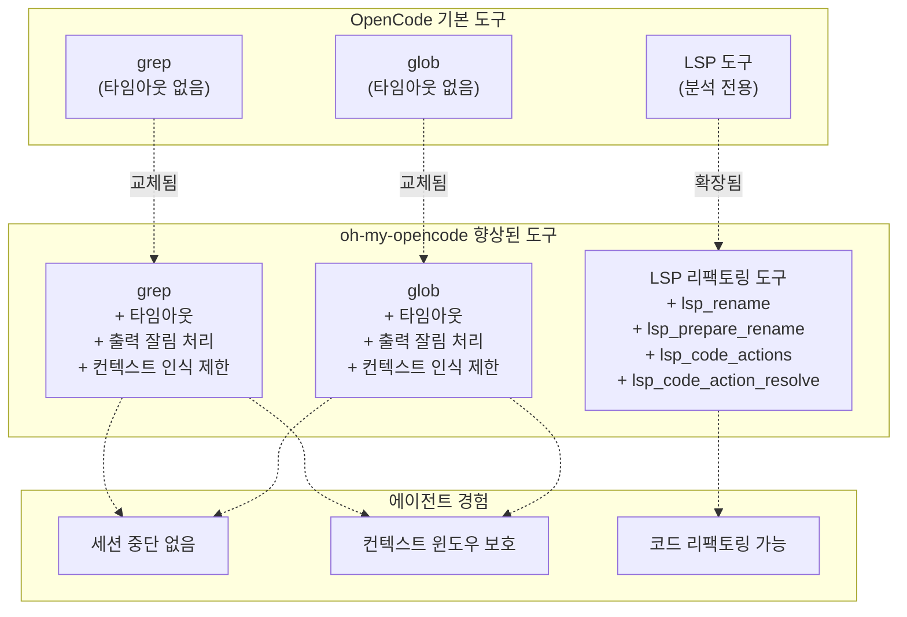
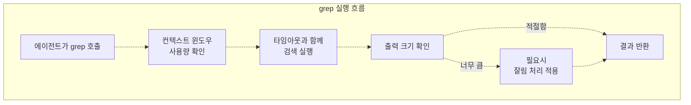
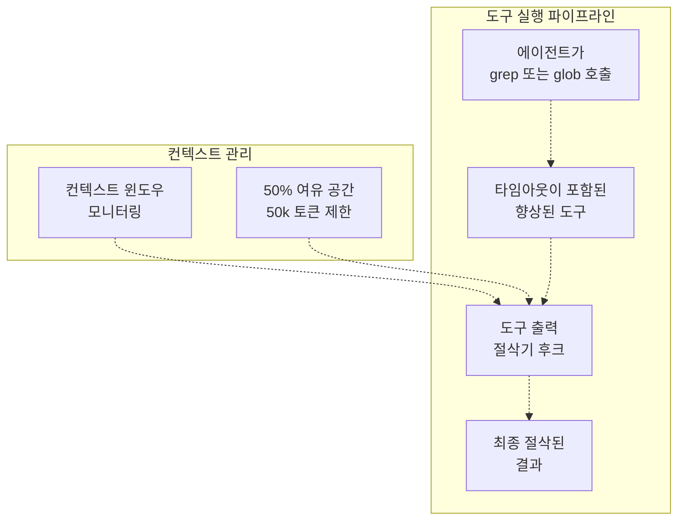
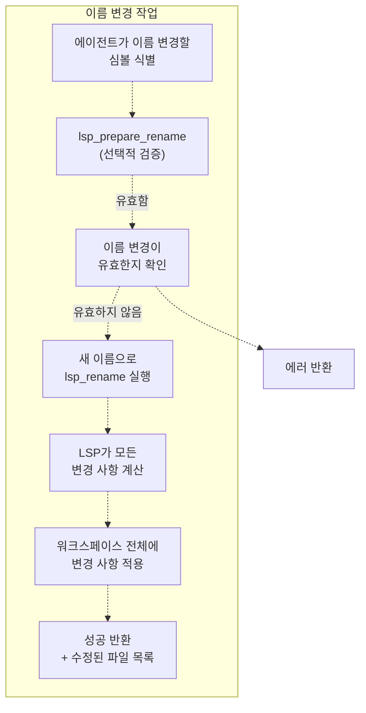
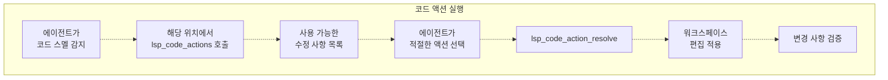
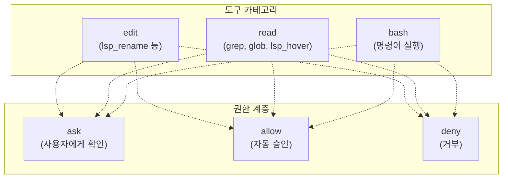
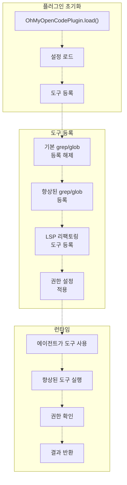

# 향상된 기본 도구 (Enhanced Base Tools)

> **관련 소스 파일**
> * [README.ja.md](https://github.com/code-yeongyu/oh-my-opencode/blob/b92cd6ab/README.ja.md)
> * [README.ko.md](https://github.com/code-yeongyu/oh-my-opencode/blob/b92cd6ab/README.ko.md)
> * [README.md](https://github.com/code-yeongyu/oh-my-opencode/blob/b92cd6ab/README.md)
> * [README.zh-cn.md](https://github.com/code-yeongyu/oh-my-opencode/blob/b92cd6ab/README.zh-cn.md)
> * [src/shared/config-path.ts](https://github.com/code-yeongyu/oh-my-opencode/blob/b92cd6ab/src/shared/config-path.ts)
> * [src/tools/background-task/constants.ts](https://github.com/code-yeongyu/oh-my-opencode/blob/b92cd6ab/src/tools/background-task/constants.ts)
> * [src/tools/background-task/index.ts](https://github.com/code-yeongyu/oh-my-opencode/blob/b92cd6ab/src/tools/background-task/index.ts)
> * [src/tools/background-task/types.ts](https://github.com/code-yeongyu/oh-my-opencode/blob/b92cd6ab/src/tools/background-task/types.ts)
> * [src/tools/call-omo-agent/constants.ts](https://github.com/code-yeongyu/oh-my-opencode/blob/b92cd6ab/src/tools/call-omo-agent/constants.ts)
> * [src/tools/interactive-bash/constants.ts](https://github.com/code-yeongyu/oh-my-opencode/blob/b92cd6ab/src/tools/interactive-bash/constants.ts)
> * [src/tools/look-at/constants.ts](https://github.com/code-yeongyu/oh-my-opencode/blob/b92cd6ab/src/tools/look-at/constants.ts)
> * [src/tools/look-at/tools.ts](https://github.com/code-yeongyu/oh-my-opencode/blob/b92cd6ab/src/tools/look-at/tools.ts)

이 페이지는 OpenCode의 기본 도구 시스템에 대한 oh-my-opencode의 개선 사항을 설명합니다. 향상된 기본 도구는 OpenCode에 내장된 `grep` 및 `glob` 도구의 치명적인 제한 사항(타임아웃 처리, 출력 잘림 현상)을 해결하고, 분석을 넘어 리팩토링(Refactoring) 작업을 포함하도록 LSP(Language Server Protocol) 기능을 확장합니다. AST(Abstract Syntax Tree, 추상 구문 트리) 인식 패턴을 사용한 구조적 코드 검색에 대해서는 [검색 및 분석 도구](/code-yeongyu/oh-my-opencode/5.2-ast-grep-tools)를 참조하십시오. `interactive_bash` 및 `look_at`과 같은 사용자 정의 도구에 대해서는 [사용자 정의 도구](/code-yeongyu/oh-my-opencode/5.4-session-management-tools)를 참조하십시오.

---

## 개요 (Overview)

OpenCode는 에이전트가 코드베이스와 상호 작용하는 데 사용하는 여러 기본 도구를 제공합니다. 그러나 이러한 도구에는 에이전트 성능을 저하시키거나 세션을 중단시킬 수 있는 제한 사항이 있습니다. oh-my-opencode는 문제가 있는 기본 도구를 향상된 버전으로 교체하고 리팩토링 작업으로 LSP 기능을 확장합니다.

### 도구 향상 전략



**출처:** README.md:586-587, 시스템 아키텍처 다이어그램 5

---

## 향상된 grep 도구

향상된 `grep` 도구는 타임아웃 보호 및 출력 잘림(Truncation) 처리를 추가하여 OpenCode 기본 구현의 치명적인 문제를 해결합니다.

### 기본 grep의 문제점

| 문제점 | 영향 | 에이전트 동작 |
| --- | --- | --- |
| 타임아웃 메커니즘 없음 | 대규모 검색 시 무한 대기 | 세션 응답 중단 |
| 무제한 출력 | 컨텍스트 윈도우 초과 | 에이전트가 중요한 컨텍스트를 상실함 |
| 조기 종료 없음 | 리소스 고갈 | 시스템 속도 저하 |

### 향상된 기능

**타임아웃 보호 (Timeout Protection)**

향상된 grep은 무한 대기를 방지하기 위해 구성 가능한 타임아웃을 구현합니다:

* 기본 타임아웃으로 무기한 차단 방지
* 타임아웃 초과 시 정상적인 종료(Graceful termination)
* 타임아웃 발생을 알리는 에러 메시지 제공

**출력 잘림 처리 (Output Truncation)**

컨텍스트 윈도우 사용량에 따른 동적 출력 제한:

* 남은 컨텍스트 윈도우 용량 모니터링
* 50%의 여유 공간(Headroom)을 유지하도록 출력 절삭
* 결과당 최대 50,000 토큰으로 제한
* 출력 시작 부분의 가장 관련성 높은 일치 항목 보존

**컨텍스트 인식 동작**



**출처:** README.md:699-701, 다이어그램 5

---

## 향상된 glob 도구

향상된 `glob` 도구는 grep의 개선 사항을 반영하여 파일 패턴 매칭 작업에 대한 타임아웃 보호 및 출력 관리를 제공합니다.

### 기본 glob의 문제점

| 문제점 | 영향 | 에이전트 동작 |
| --- | --- | --- |
| 대규모 디렉토리 타임아웃 없음 | 재귀적 glob 실행 중 세션 중단 | 에이전트 진행 불가 |
| 무제한 파일 목록 출력 | 컨텍스트 윈도우 초과 | 에이전트가 워크스페이스 파악 능력 상실 |
| 결과 제한 없음 | 성능 저하 | 응답 시간 지연 |

### 향상된 기능

**타임아웃 보호**

* 깊은 디렉토리 트리에서의 무한 재귀 방지
* glob 작업당 구성 가능한 타임아웃
* 타임아웃 초과 시 안전한 폴백(Fallback) 제공

**출력 관리**

* 반환되는 일치 파일 수 제한
* 파일 목록이 너무 클 경우 잘림 처리
* 컨텍스트 윈도우 예산 유지
* 가장 관련성 높은 일치 항목 우선순위 지정

### 도구 출력 절삭기(Tool Output Truncator)와의 통합

향상된 grep 및 glob은 모두 도구 출력 절삭기 후크와 연동되어 작동합니다 ([도구 향상 후크](/code-yeongyu/oh-my-opencode/7.3-todo-continuation-enforcer) 참조):



**출처:** README.md:699-702, README.md:586-587

---

## LSP 리팩토링 도구

OpenCode는 분석용 LSP 도구(hover, goto definition, find references)를 제공합니다. oh-my-opencode는 에이전트가 구조적으로 코드를 수정할 수 있도록 리팩토링 기능으로 이를 확장합니다.

### 사용 가능한 LSP 도구

#### 분석 도구 (OpenCode 기본)

| 도구 | 설명 | 사용 사례 |
| --- | --- | --- |
| `lsp_hover` | 커서 위치의 타입 정보, 문서, 시그니처 확인 | 코드 의미 이해 |
| `lsp_goto_definition` | 심볼 정의로 이동 | 코드 탐색 |
| `lsp_find_references` | 모든 심볼 사용처 찾기 | 영향도 분석 |
| `lsp_document_symbols` | 파일 심볼 개요 | 파일 구조 이해 |
| `lsp_workspace_symbols` | 이름으로 심볼 검색 | 선언 찾기 |
| `lsp_diagnostics` | 에러/경고 가져오기 | 빌드 전 검증 |
| `lsp_servers` | 사용 가능한 LSP 서버 목록 | 도구 가용성 확인 |

#### 리팩토링 도구 (oh-my-opencode)

| 도구 | 설명 | 사용 사례 |
| --- | --- | --- |
| `lsp_prepare_rename` | 실행 전 이름 변경 작업 유효성 검사 | 안전 점검 |
| `lsp_rename` | 전체 워크스페이스에서 심볼 이름 변경 | 리팩토링 |
| `lsp_code_actions` | 사용 가능한 빠른 수정(Quick fix) 및 리팩토링 가져오기 | 해결 방법 탐색 |
| `lsp_code_action_resolve` | 선택한 코드 액션 적용 | 리팩토링 실행 |

### lsp_rename 도구

LSP의 정확성을 바탕으로 워크스페이스 전체의 심볼 이름 변경을 가능하게 합니다.

**입력 스키마:**

* `path`: 심볼이 포함된 파일
* `position`: 심볼 위의 커서 위치 (line, character)
* `newName`: 심볼의 새 이름

**워크플로우:**



**주요 사용 사례:**

* 여러 파일에서 사용되는 함수 이름 변경
* 클래스 이름 변경 및 모든 참조 업데이트
* 명확성을 위한 변수 이름 리팩토링

### lsp_code_actions 도구

코드 위치에 대해 사용 가능한 빠른 수정 및 리팩토링 목록을 검색합니다.

**입력 스키마:**

* `path`: 파일 경로
* `range`: 텍스트 범위 (시작/종료 라인 및 문자)
* `diagnostics`: 액션을 필터링하기 위한 선택적 진단 정보

**출력:**

* 사용 가능한 코드 액션 목록 (빠른 수정, 리팩토링, 소스 액션)
* 각 액션 포함 사항: 종류(kind), 제목(title), 편집 세부 정보

**액션 종류 (Action Kinds):**

* `quickfix`: 에러 또는 경고 수정
* `refactor`: 구조적 리팩토링
* `refactor.extract`: 메서드/변수 추출
* `refactor.inline`: 변수/메서드 인라인화
* `refactor.rewrite`: 코드 구조 재작성
* `source`: 소스 레벨 액션 (import 정리 등)

### lsp_code_action_resolve 도구

`lsp_code_actions`에서 선택한 코드 액션을 실행합니다.

**입력 스키마:**

* `codeAction`: 실행할 코드 액션 객체

**워크플로우:**



### LSP 서버 설정

LSP 도구를 사용하려면 OpenCode에 LSP 서버가 설정되어 있어야 합니다. oh-my-opencode는 모든 OpenCode LSP 설정을 준수하며 추가적인 설정 옵션을 제공합니다.

**설정 위치:**

* `~/.config/opencode/oh-my-opencode.json` (사용자)
* `.opencode/oh-my-opencode.json` (프로젝트)

**설정 예시:**

```json
{
  "lsp": {
    "typescript-language-server": {
      "command": ["typescript-language-server", "--stdio"],
      "extensions": [".ts", ".tsx"],
      "priority": 10
    },
    "pylsp": {
      "command": ["pylsp"],
      "extensions": [".py"],
      "disabled": false
    }
  }
}
```

**설정 옵션:**

| 옵션 | 타입 | 설명 |
| --- | --- | --- |
| `command` | string[] | LSP 서버를 시작하기 위한 명령 및 인자 |
| `extensions` | string[] | 이 서버가 처리하는 파일 확장자 |
| `priority` | number | 여러 서버가 일치할 때의 서버 우선순위 |
| `env` | object | 서버 프로세스를 위한 환경 변수 |
| `initialization` | object | LSP 초기화 옵션 |
| `disabled` | boolean | 이 서버 비활성화 여부 |

**출처:** README.md:536-549, README.md:812-839

---

## 도구 권한 시스템

향상된 도구는 에이전트별로 구성할 수 있는 OpenCode의 권한 시스템을 준수합니다.

### 권한 레벨



### 도구 권한 설정

권한은 설정 파일에서 에이전트별로 설정됩니다:

```json
{
  "agents": {
    "explore": {
      "permission": {
        "edit": "deny",
        "bash": "ask",
        "webfetch": "allow"
      }
    }
  }
}
```

**권한 카테고리:**

| 카테고리 | 영향받는 도구 | 기본값 |
| --- | --- | --- |
| `edit` | `lsp_rename`, `lsp_code_action_resolve`, 파일 쓰기 작업 | `ask` |
| `bash` | 명령어 실행 도구 | `ask` |
| `webfetch` | 웹 요청 도구 | `ask` |
| `external_directory` | 프로젝트 루트 외부 접근 | `deny` |

**출처:** README.md:773-796, 다이어그램 5

---

## 도구 등록 흐름

향상된 도구는 플러그인 초기화 중에 등록되어 기본 OpenCode 도구를 교체하거나 확장합니다.



**출처:** 다이어그램 1, 다이어그램 5

---

## 요약

향상된 기본 도구는 OpenCode의 도구 시스템에 중요한 개선 사항을 제공합니다:

| 향상된 기능 | 해결된 문제 | 에이전트 이점 |
| --- | --- | --- |
| grep 타임아웃 | 무한 대기 현상 | 신뢰할 수 있는 검색 작업 |
| glob 타임아웃 | 무한 재귀 현상 | 안전한 파일 시스템 탐색 |
| 출력 잘림 처리 | 컨텍스트 오버플로우 | 컨텍스트 인식 유지 |
| LSP 리팩토링 | 분석 전용의 한계 | 구조적 코드 수정 가능 |
| 권한 시스템 | 제한 없는 도구 접근 | 안전한 에이전트 작업 |

이러한 개선 사항을 통해 에이전트는 코드 탐색 및 리팩토링을 위한 완전한 IDE 수준의 기능을 유지하면서도 더 안정적이고 안전하게 작업할 수 있습니다.

**출처:** README.md:522-589, 다이어그램 5, README.md:812-839