# 세션 관리 도구 (Session Management Tools)

> **관련 소스 파일**
> * [README.ja.md](https://github.com/code-yeongyu/oh-my-opencode/blob/b92cd6ab/README.ja.md)
> * [README.ko.md](https://github.com/code-yeongyu/oh-my-opencode/blob/b92cd6ab/README.ko.md)
> * [README.md](https://github.com/code-yeongyu/oh-my-opencode/blob/b92cd6ab/README.md)
> * [README.zh-cn.md](https://github.com/code-yeongyu/oh-my-opencode/blob/b92cd6ab/README.zh-cn.md)
> * [src/shared/config-path.ts](https://github.com/code-yeongyu/oh-my-opencode/blob/b92cd6ab/src/shared/config-path.ts)
> * [src/tools/background-task/constants.ts](https://github.com/code-yeongyu/oh-my-opencode/blob/b92cd6ab/src/tools/background-task/constants.ts)
> * [src/tools/background-task/index.ts](https://github.com/code-yeongyu/oh-my-opencode/blob/b92cd6ab/src/tools/background-task/index.ts)
> * [src/tools/background-task/types.ts](https://github.com/code-yeongyu/oh-my-opencode/blob/b92cd6ab/src/tools/background-task/types.ts)
> * [src/tools/call-omo-agent/constants.ts](https://github.com/code-yeongyu/oh-my-opencode/blob/b92cd6ab/src/tools/call-omo-agent/constants.ts)
> * [src/tools/interactive-bash/constants.ts](https://github.com/code-yeongyu/oh-my-opencode/blob/b92cd6ab/src/tools/interactive-bash/constants.ts)
> * [src/tools/look-at/constants.ts](https://github.com/code-yeongyu/oh-my-opencode/blob/b92cd6ab/src/tools/look-at/constants.ts)
> * [src/tools/look-at/tools.ts](https://github.com/code-yeongyu/oh-my-opencode/blob/b92cd6ab/src/tools/look-at/tools.ts)

## 목적 및 범위 (Purpose and Scope)

세션 관리 도구(Session Management Tools)는 OpenCode 세션 이력에 대한 프로그래밍 방식의 접근을 제공하여, 에이전트가 이전 대화를 참조하고, 과거 상호작용을 검색하며, 세션 간의 연속성을 유지할 수 있도록 합니다. 이러한 도구를 통해 에이전트는 과거의 컨텍스트(Context)로부터 학습하고, 이미 완료된 작업을 반복하는 것을 방지하며, 이전 세션 결과를 바탕으로 정보에 입각한 결정을 내릴 수 있습니다.

다른 도구 카테고리에 대한 정보는 다음을 참조하십시오:

* 백그라운드 실행 도구: [Background Task Tools](/code-yeongyu/oh-my-opencode/5.3-background-task-tools)
* LSP 기반 개발 도구: [LSP Tools](/code-yeongyu/oh-my-opencode/5.1-lsp-tools)
* 코드 검색 및 리팩토링 도구: [AST-Grep Tools](/code-yeongyu/oh-my-opencode/5.2-ast-grep-tools)
* 미디어 분석 도구: [Specialized Tools](/code-yeongyu/oh-my-opencode/5.5-specialized-tools)

**출처:** [README.md L528-L537](https://github.com/code-yeongyu/oh-my-opencode/blob/b92cd6ab/README.md#L528-L537)

 [Diagram 5](https://github.com/code-yeongyu/oh-my-opencode/blob/b92cd6ab/Diagram 5#LNaN-LNaN)

---

## 도구 개요 (Tool Overview)

세션 관리 시스템은 이력 분석을 위한 네 가지 상호 보완적인 도구를 제공합니다:

| 도구 | 목적 | 주요 유스케이스 | 반환 타입 |
| --- | --- | --- | --- |
| `session_list` | 필터링을 통한 세션 나열 | 날짜 범위를 기준으로 최근 또는 관련 세션 검색 | 세션 메타데이터 목록 |
| `session_read` | 전체 세션 내용 조회 | 전체 대화 이력 및 컨텍스트 접근 | 메시지 및 세션 데이터 |
| `session_search` | 세션 전체 텍스트 검색 | 특정 정보 또는 패턴 찾기 | 컨텍스트를 포함한 일치 메시지 |
| `session_info` | 세션 메타데이터 및 통계 획득 | 세션 특성(기간, 토큰 수, 사용된 에이전트) 파악 | 구조화된 메타데이터 객체 |

이 도구들은 함께 작동하도록 설계되었습니다. `session_list`를 사용하여 관련 세션을 찾고, `session_info`로 세션의 관련성을 검증하며, `session_read`로 상세 내용을 조회하고, `session_search`를 통해 타겟 정보를 추출합니다.

**출처:** [README.md L528-L537](https://github.com/code-yeongyu/oh-my-opencode/blob/b92cd6ab/README.md#L528-L537)

 [Diagram 5](https://github.com/code-yeongyu/oh-my-opencode/blob/b92cd6ab/Diagram 5#LNaN-LNaN)

---

## 시스템 아키텍처 (System Architecture)

### 세션 관리 도구 통합 (Session Management Tool Integration)


**아키텍처 참고 사항:**

* 세션 관리 도구는 세션 저장소에 대한 접근을 제공하는 OpenCode SDK의 세션 API([`@opencode-ai/sdk`](https://github.com/code-yeongyu/oh-my-opencode/blob/b92cd6ab/`@opencode-ai/sdk`))와 인터페이스합니다.
* 저장소는 `~/.claude/transcripts/`에 트랜스크립트(Transcript)를 저장하는 Claude Code 호환 패턴을 따릅니다 ([Claude Code Compatibility](/code-yeongyu/oh-my-opencode/9-claude-code-compatibility) 참조).
* 도구들은 주로 오케스트레이션 워크플로우를 위해 Sisyphus(제한 없는 접근 권한)에게 노출됩니다.
* Oracle은 수정 권한 없이 과거 컨텍스트를 이해하기 위해 읽기 전용 접근 권한을 가질 수 있습니다.
* 모든 도구는 플러그인 컨텍스트에서 제공하는 `ctx.client.session.*` API를 통해 작동합니다.

**출처:** [Diagram 1](https://github.com/code-yeongyu/oh-my-opencode/blob/b92cd6ab/Diagram 1#LNaN-LNaN)

 [Diagram 5](https://github.com/code-yeongyu/oh-my-opencode/blob/b92cd6ab/Diagram 5#LNaN-LNaN)

 [README.md L528-L537](https://github.com/code-yeongyu/oh-my-opencode/blob/b92cd6ab/README.md#L528-L537)

---

## 도구 정의 (Tool Definitions)

### session_list

날짜 범위 및 결과 제한에 따른 선택적 필터링을 사용하여 사용 가능한 모든 OpenCode 세션을 나열합니다.

**목적:** 전체 내용을 로드하지 않고 관련 세션을 검색할 수 있도록 합니다. 최근 세션이나 특정 기간 내의 세션을 찾거나 세션 이력의 개요를 파악하는 데 유용합니다.

**인자 (Arguments):**

| 인자 | 타입 | 필수 여부 | 설명 |
| --- | --- | --- | --- |
| `start_date` | string (ISO 8601) | 아니요 | 이 날짜 이후에 생성된 세션 필터링 |
| `end_date` | string (ISO 8601) | 아니요 | 이 날짜 이전에 생성된 세션 필터링 |
| `limit` | number | 아니요 | 반환할 최대 세션 수 (기본값: 50) |

**반환값:** 다음을 포함하는 세션 메타데이터 객체 배열:

* 세션 ID
* 제목
* 생성 타임스탬프
* 마지막 활동 타임스탬프
* 부모 세션 ID (해당하는 경우)

**사용 예시:**

```python
// 마지막 10개 세션 나열
session_list({ limit: 10 })

// 지난주 세션 찾기
session_list({ 
  start_date: "2025-01-10T00:00:00Z",
  limit: 20 
})
```

**구현 패턴:**
다른 도구 구현([src/tools/look-at/tools.ts L46-L137](https://github.com/code-yeongyu/oh-my-opencode/blob/b92cd6ab/src/tools/look-at/tools.ts#L46-L137))을 기반으로 할 때, 이 도구는 다음과 같이 작동할 가능성이 높습니다:

1. `tool.schema.string()` 및 `tool.schema.number()` 유효성 검사기를 통해 검증된 인자를 수락합니다.
2. 필터 파라미터와 함께 `ctx.client.session.list()`를 호출합니다.
3. 형식화된 세션 메타데이터 배열을 반환합니다.

**출처:** [README.md L531](https://github.com/code-yeongyu/oh-my-opencode/blob/b92cd6ab/README.md#L531-L531)

 [Diagram 5](https://github.com/code-yeongyu/oh-my-opencode/blob/b92cd6ab/Diagram 5#LNaN-LNaN)

---

### session_read

특정 세션의 전체 메시지 이력 및 메타데이터를 조회합니다.

**목적:** 이전 세션의 전체 대화 내용에 접근합니다. 에이전트가 모든 메시지, 도구 호출 및 응답을 포함하여 이전 작업에 대한 상세한 컨텍스트가 필요할 때 사용됩니다.

**인자 (Arguments):**

| 인자 | 타입 | 필수 여부 | 설명 |
| --- | --- | --- | --- |
| `session_id` | string | 예 | 읽을 세션의 고유 식별자 |
| `include_tool_calls` | boolean | 아니요 | 도구 실행 세부 정보 포함 여부 (기본값: true) |

**반환값:** 다음을 포함하는 세션 객체:

* 역할(Role), 내용, 타임스탬프가 포함된 전체 메시지 배열
* 인자 및 결과가 포함된 도구 호출 이력
* 세션 메타데이터 (제목, 사용된 에이전트, 토큰 수)
* 부모/자식 세션 관계

**사용 예시:**

```yaml
// 전체 세션 이력 읽기
session_read({ 
  session_id: "sess_abc123xyz"
})

// 도구 실행 세부 정보 없이 읽기
session_read({ 
  session_id: "sess_abc123xyz",
  include_tool_calls: false
})
```

**주요 동작:**

* 메시지는 시간순으로 반환됩니다.
* 도구 호출은 완전한 투명성을 위해 인자와 결과를 모두 포함합니다.
* 부모 세션과 자식 세션(예: 백그라운드 작업)을 모두 처리합니다.
* 대규모 세션은 요약과 함께 잘릴 수 있습니다 ([Context Management Hooks](/code-yeongyu/oh-my-opencode/7.4-context-management-hooks) 참조).

**출처:** [README.md L532](https://github.com/code-yeongyu/oh-my-opencode/blob/b92cd6ab/README.md#L532-L532)

 [Diagram 5](https://github.com/code-yeongyu/oh-my-opencode/blob/b92cd6ab/Diagram 5#LNaN-LNaN)

---

### session_search

특정 정보를 찾기 위해 모든 세션 메시지에 대해 전체 텍스트 검색을 수행합니다.

**목적:** 전체 세션을 읽지 않고 특정 논의, 결정 또는 정보를 찾습니다. 이전 문제가 어떻게 해결되었는지 확인하거나 특정 기술적 결정을 찾는 데 특히 유용합니다.

**인자 (Arguments):**

| 인자 | 타입 | 필수 여부 | 설명 |
| --- | --- | --- | --- |
| `query` | string | 예 | 검색 쿼리 문자열 |
| `limit` | number | 아니요 | 반환할 최대 결과 수 (기본값: 10) |
| `session_ids` | string[] | 아니요 | 검색을 특정 세션으로 제한 |
| `start_date` | string (ISO 8601) | 아니요 | 이 날짜 이후의 세션만 검색 |

**반환값:** 다음을 포함하는 검색 결과 객체 배열:

* 컨텍스트가 포함된 일치 메시지 텍스트
* 세션 ID 및 제목
* 메시지 타임스탬프
* 관련성 점수
* 주변 컨텍스트 (일치 항목 전후의 메시지)

**사용 예시:**

```yaml
// 에러 처리 논의 검색
session_search({ 
  query: "error handling strategy",
  limit: 5
})

// 특정 최근 세션 내에서 검색
session_search({
  query: "database migration",
  session_ids: ["sess_abc", "sess_xyz"],
  start_date: "2025-01-01T00:00:00Z"
})
```

**검색 기능:**

* 관련성 점수가 포함된 전체 텍스트 매칭
* 기본적으로 대소문자 구분 안 함
* 도구 결과를 포함한 모든 메시지 내용에서 매칭
* 컨텍스트 스니펫(Snippet) 반환 (일치 항목 주변의 설정 가능한 윈도우)

**출처:** [README.md L533](https://github.com/code-yeongyu/oh-my-opencode/blob/b92cd6ab/README.md#L533-L533)

 [Diagram 5](https://github.com/code-yeongyu/oh-my-opencode/blob/b92cd6ab/Diagram 5#LNaN-LNaN)

---

### session_info

전체 메시지 내용을 로드하지 않고 세션에 대한 메타데이터 및 통계를 조회합니다.

**목적:** 세션 특성을 신속하게 평가하여 관련성을 판단합니다. 전체 읽기를 수행하기 전에 세션 범위, 기간, 리소스 사용량 및 참여자를 이해하는 데 유용합니다.

**인자 (Arguments):**

| 인자 | 타입 | 필수 여부 | 설명 |
| --- | --- | --- | --- |
| `session_id` | string | 예 | 세션의 고유 식별자 |

**반환값:** 다음을 포함하는 메타데이터 객체:

| 필드 | 설명 |
| --- | --- |
| `id` | 세션 고유 식별자 |
| `title` | 세션 제목/설명 |
| `created_at` | 세션 생성 타임스탬프 |
| `updated_at` | 마지막 활동 타임스탬프 |
| `message_count` | 총 메시지 수 |
| `token_count` | 사용된 대략적인 총 토큰 수 |
| `agents_used` | 참여한 에이전트 목록 |
| `parent_id` | 부모 세션 ID (자식 세션인 경우) |
| `child_sessions` | 자식 세션 ID 배열 |
| `status` | 세션 상태 (active/completed/failed) |
| `duration_seconds` | 총 세션 기간 |

**사용 예시:**

```yaml
// 세션 통계 가져오기
session_info({ 
  session_id: "sess_abc123xyz"
})
```

**일반적인 워크플로우:**

1. `session_list`를 사용하여 잠재적인 세션 찾기
2. `session_info`를 사용하여 관련성 확인 (토큰 수, 사용된 에이전트, 기간)
3. 관련성이 확인된 세션에 대해서만 `session_read` 사용

**출처:** [README.md L534](https://github.com/code-yeongyu/oh-my-opencode/blob/b92cd6ab/README.md#L534-L534)

 [Diagram 5](https://github.com/code-yeongyu/oh-my-opencode/blob/b92cd6ab/Diagram 5#LNaN-LNaN)

---

## 에이전트 접근 패턴 (Agent Access Patterns)

### 에이전트별 도구 가용성


**접근 근거:**

**Sisyphus (전체 접근):**

* 주요 오케스트레이터는 완전한 이력 인식이 필요합니다.
* 중복 작업을 피하기 위해 세션 도구를 사용합니다.
* 과거의 솔루션과 패턴을 참조합니다.
* 다중 세션 워크플로우 전반에서 연속성을 유지합니다.
* 예: "이전 세션에서 이미 인증을 구현했는지 확인해줘"

**Oracle (읽기 전용 접근):**

* `session_read`를 통해 과거의 아키텍처 결정에 접근할 수 있습니다.
* `session_info`를 사용하여 세션 컨텍스트를 이해합니다.
* 컨텍스트 과부하를 방지하기 위해 목록/검색 기능은 제한됩니다.
* 예: "지난번에 데이터베이스 스키마를 어떻게 구성했는지 검토해줘"

**Librarian & Explore (검색 접근):**

* 코드 패턴 발견을 위해 `session_search`를 사용할 수 있습니다.
* 제한된 접근을 통해 부적절한 자기 참조를 방지합니다.
* 내부 이력보다는 외부 조사에 집중합니다.

**특화 에이전트 (접근 권한 없음):**

* Frontend Engineer: 현재 구현에만 집중합니다.
* Doc Writer: 이력 마이닝이 아닌 제공된 컨텍스트로 작업합니다.
* Multimodal Looker: 단일 목적의 파일 분석을 수행하며 세션 인식이 없습니다.
* 근거: 컨텍스트 비대화를 방지하고 에이전트의 전문성을 유지합니다.

**출처:** [Diagram 5](https://github.com/code-yeongyu/oh-my-opencode/blob/b92cd6ab/Diagram 5#LNaN-LNaN)

 [README.md L464-L473](https://github.com/code-yeongyu/oh-my-opencode/blob/b92cd6ab/README.md#L464-L473)

---

## 사용 패턴 및 워크플로우 (Usage Patterns and Workflows)

### 패턴 1: 중복 작업 방지


**설명:** 중요한 작업을 시작하기 전에 Sisyphus는 이전 세션에서 유사한 작업이 완료되었는지 확인합니다. 이는 낭비되는 노력을 방지하고 일관성을 유지합니다.

**구현 단계:**

1. 사용자 요청에서 작업 키워드 추출
2. `session_list`로 최근 세션 쿼리
3. `session_search`로 키워드 검색
4. `session_read`로 일치하는 세션 읽기
5. 발견된 내용과 제안된 조치를 사용자에게 제시

**출처:** [Diagram 3](https://github.com/code-yeongyu/oh-my-opencode/blob/b92cd6ab/Diagram 3#LNaN-LNaN)

 [README.md L528-L537](https://github.com/code-yeongyu/oh-my-opencode/blob/b92cd6ab/README.md#L528-L537)

---

### 패턴 2: 과거 솔루션으로부터 학습


**설명:** 설계 결정을 내릴 때 에이전트는 과거 세션에서 유사한 문제와 그 해결책을 검색한 다음, 현재 컨텍스트에 맞게 조정하기 위해 Oracle과 상담할 수 있습니다.

**워크플로우 이점:**

* 세션 간의 일관성 유지
* 검증된 패턴 활용
* 과거의 실수 반복 방지 (실패한 세션 제외)
* 시간이 지남에 따른 지식 축적 가능

**출처:** [Diagram 3](https://github.com/code-yeongyu/oh-my-opencode/blob/b92cd6ab/Diagram 3#LNaN-LNaN)

 [README.md L467-L469](https://github.com/code-yeongyu/oh-my-opencode/blob/b92cd6ab/README.md#L467-L469)

---

### 패턴 3: 세션 간 컨텍스트 연속성


**설명:** 사용자가 이전 작업을 참조하여 새 세션을 시작할 때, Sisyphus는 미완료된 할 일(TODO) 항목을 포함하여 이전 세션의 상태를 자동으로 찾아 계속할 수 있습니다.

**주요 기능:**

* `parent_id`를 통해 세션 관계 감지
* Claude Code 호환 저장소(`~/.claude/todos/`)에서 할 일 상태 읽기
* 세션 경계에도 불구하고 워크플로우 연속성 유지
* 세션 간 컨텍스트 손실 방지

**출처:** [Diagram 3](https://github.com/code-yeongyu/oh-my-opencode/blob/b92cd6ab/Diagram 3#LNaN-LNaN)

 [README.md L169-L171](https://github.com/code-yeongyu/oh-my-opencode/blob/b92cd6ab/README.md#L169-L171)

 [README.md L636-L638](https://github.com/code-yeongyu/oh-my-opencode/blob/b92cd6ab/README.md#L636-L638)

---

## 관련 시스템과의 통합 (Integration with Related Systems)

### 저장소 백엔드 호환성 (Storage Backend Compatibility)

세션 관리 도구는 여러 시스템에서 유지 관리하는 저장소로부터 데이터를 읽습니다:


**저장 위치:**

* **트랜스크립트 (Transcripts):** `~/.claude/transcripts/<session_id>.jsonl` - 재생 및 분석을 위한 JSONL 형식의 전체 활동 로그
* **할 일 (TODOs):** `~/.claude/todos/<session_id>.json` - Claude Code 호환 형식의 세션 할 일 목록
* **세션 DB:** OpenCode SDK에서 관리하며 `ctx.client.session.*` API를 통해 접근

**호환성:**

* oh-my-opencode로 마이그레이션하는 Claude Code 사용자는 기존 세션 이력에 접근할 수 있습니다.
* 트랜스크립트 형식은 디버깅을 위한 세션 재생을 가능하게 합니다.
* 할 일 형식은 워크플로우 연속성을 위해 [Todo Continuation Enforcer](/code-yeongyu/oh-my-opencode/7.3-todo-continuation-enforcer)와 공유됩니다.

**출처:** [README.md L636-L639](https://github.com/code-yeongyu/oh-my-opencode/blob/b92cd6ab/README.md#L636-L639)

 [Diagram 1](https://github.com/code-yeongyu/oh-my-opencode/blob/b92cd6ab/Diagram 1#LNaN-LNaN)

---

### 컨텍스트 관리 통합 (Context Management Integration)

세션 관리 도구는 토큰 과부하를 방지하기 위해 컨텍스트 관리 훅과 상호작용합니다:

```mermaid
flowchart TD

SessionRead["session_read<br>전체 이력 읽기"]
SessionSearch["session_search<br>특정 정보 찾기"]
Monitor["컨텍스트 창 모니터<br>토큰 사용량 추적"]
Truncator["도구 출력 트런케이터<br>동적 잘림"]
Compaction["선제적 압축<br>이전 컨텍스트 요약"]
Warning["70% 경고<br>에이전트에게 여유 공간 알림"]
Truncate["출력 자르기<br>50% 여유 공간 유지"]
Summarize["세션 요약<br>반환 전 수행"]

SessionRead -.->|"결과 수"| Monitor
SessionSearch -.->|"사용량 > 70%"| Monitor
Monitor -.-> Warning
Truncator -.-> Truncate
Compaction -.-> Summarize
Truncate -.->|"보호된 출력"| SessionRead
Summarize -.->|"요약된 컨텍스트"| SessionRead

subgraph subGraph2 ["보호 메커니즘"]
    Warning
    Truncate
    Summarize
end

subgraph subGraph1 ["컨텍스트 관리 훅"]
    Monitor
    Truncator
    Compaction
    Monitor -.->|"대량 출력"| Truncator
end

subgraph subGraph0 ["세션 도구 사용"]
    SessionRead
    SessionSearch
end
```



**보호 전략:**

1. **출력 자르기 (Output Truncation):** * 도구 출력 트런케이터(Tool Output Truncator, [Context Management Hooks](/code-yeongyu/oh-my-opencode/7.4-context-management-hooks) 참조)가 세션 도구 결과에 적용됩니다. * 남은 컨텍스트 창을 기반으로 동적으로 자릅니다. * 50%의 여유 공간을 유지하며, 50,000 토큰으로 제한합니다. * 구현: [README.md L686-L689](https://github.com/code-yeongyu/oh-my-opencode/blob/b92cd6ab/README.md#L686-L689)
2. **컨텍스트 창 모니터링:** * 70% 이상의 임계값에서 토큰 사용량을 추적합니다. * 에이전트에게 남은 용량에 대해 경고합니다. * 서두른 작업으로 이어지는 "컨텍스트 불안(Context Anxiety)"을 방지합니다. * 패턴: [Context Window Anxiety Management](https://agentic-patterns.com/patterns/context-window-anxiety-management/) * 구현: [README.md L677-L679](https://github.com/code-yeongyu/oh-my-opencode/blob/b92cd6ab/README.md#L677-L679)
3. **선제적 압축 (Preemptive Compaction):** * 대규모 세션 읽기 결과를 컨텍스트에 추가하기 전에 요약합니다. * 80% 임계값에서 선제적으로 트리거됩니다. * 중요한 정보(AGENTS.md, 현재 디렉토리)를 보존합니다. * 구현: [README.md L689-L691](https://github.com/code-yeongyu/oh-my-opencode/blob/b92cd6ab/README.md#L689-L691)

**에이전트 동작:**
세션 도구가 대량의 출력을 반환할 때, 에이전트는 자동으로 잘리거나 요약된 버전을 받게 됩니다. 에이전트는 잘림에 대해 알림을 받으며 필요한 경우 특정 섹션을 요청할 수 있습니다.

**출처:** [README.md L677-L691](https://github.com/code-yeongyu/oh-my-opencode/blob/b92cd6ab/README.md#L677-L691)

 [Diagram 4](https://github.com/code-yeongyu/oh-my-opencode/blob/b92cd6ab/Diagram 4#LNaN-LNaN)

---

## 설정 및 커스터마이징 (Configuration and Customization)

### 세션 도구 비활성화

세션 관리 도구는 에이전트 도구 설정을 통해 비활성화할 수 있습니다:

```json
{
  "agents": {
    "Sisyphus": {
      "tools": {
        "session_list": false,
        "session_read": false,
        "session_search": false,
        "session_info": false
      }
    }
  }
}
```

**비활성화가 필요한 경우:**

* 세션 이력에 접근해서는 안 되는 개인정보 보호에 민감한 환경
* 관련 이력이 없는 신규(Greenfield) 프로젝트
* 특화 에이전트의 컨텍스트 비대화 방지
* 성능 최적화 (프롬프트의 도구 수 감소)

**출처:** [README.md L773-L789](https://github.com/code-yeongyu/oh-my-opencode/blob/b92cd6ab/README.md#L773-L789)

---

### 에이전트별 접근 제어

권한 시스템을 통한 세밀한 제어 ([Agent Configuration](/code-yeongyu/oh-my-opencode/4.3-agent-configuration) 참조):

```
{
  "agents": {
    "custom-agent": {
      "tools": {
        // 메타데이터 쿼리만 허용
        "session_list": true,
        "session_info": true,
        
        // 내용 접근 차단
        "session_read": false,
        "session_search": false
      }
    }
  }
}
```

**접근 패턴:**

* **검색 전용 (Discovery Only):** 내용 접근 없이 탐색을 위해 `session_list` + `session_info` 활성화
* **검색 전용 (Search Only):** 전체 이력 접근 없이 타겟 조회를 위해 `session_search` 활성화
* **읽기 전용 아카이브:** 모든 세션 도구를 활성화하되 수정 도구(`edit`, `write`, `bash`)는 비활성화

**출처:** [README.md L796-L817](https://github.com/code-yeongyu/oh-my-opencode/blob/b92cd6ab/README.md#L796-L817)

---

## 에러 처리 및 예외 상황 (Error Handling and Edge Cases)

### 공통 에러 시나리오

| 에러 | 원인 | 도구 동작 | 에이전트 대응 |
| --- | --- | --- | --- |
| 세션을 찾을 수 없음 | 잘못된 `session_id` | 에러 메시지 반환 | 사용자에게 세션 ID 확인 요청 또는 `session_list` 사용 |
| 검색 결과 없음 | 쿼리와 일치하는 항목 없음 | 메시지와 함께 빈 배열 반환 | 검색어 확장 또는 날짜 필터 조정 |
| 세션이 여전히 활성 상태임 | 현재 세션 읽기 시도 | 불완전한 데이터를 반환할 수 있음 | 도구가 활성 세션에 대해 경고하고, 에이전트가 진행 여부 결정 |
| 출력 잘림 | 대규모 세션이 컨텍스트 제한 초과 | 표기(Notation)와 함께 잘린 결과 반환 | 에이전트가 특정 메시지 범위를 요청할 수 있음 |
| 권한 거부됨 | 제한된 세션에 접근 시도 | 권한 에러 반환 | 에이전트가 사용자에게 권한 승인 요청 |

### 세션 상태 처리

세션은 도구 동작에 영향을 미치는 생명주기 상태를 가집니다:


**상태별 동작:**

* **활성 세션 (Active Sessions):** `session_read`가 불완전한 메시지 이력(진행 중인 현재 대화)을 반환할 수 있습니다.
* **유휴 세션 (Idle Sessions):** 모든 도구가 완전한 데이터를 반환하며, 세션을 재개할 수 있습니다.
* **완료된 세션 (Completed Sessions):** 불변의 이력으로, 분석에 최적화되어 있습니다.
* **실패한 세션 (Failed Sessions):** 에러 컨텍스트 및 스택 트레이스를 포함합니다 (디버깅에 유용).

**출처:** [Diagram 4](https://github.com/code-yeongyu/oh-my-opencode/blob/b92cd6ab/Diagram 4#LNaN-LNaN)

 [README.md L681-L682](https://github.com/code-yeongyu/oh-my-opencode/blob/b92cd6ab/README.md#L681-L682)

---

## 성능 고려 사항 (Performance Considerations)

### 최적화 전략

**1. 증분 세션 읽기 (Incremental Session Reading):**
전체 세션을 읽는 대신 타겟 쿼리를 사용합니다:

```javascript
// 비효율적: 모든 내용 읽기
const fullSession = session_read({ session_id: "sess_abc" })

// 효율적: 먼저 검색하고 선택적으로 읽기
const matches = session_search({ 
  query: "authentication implementation",
  session_ids: ["sess_abc"]
})
// 그 다음 관련 메시지 범위만 읽기
```

**2. 메타데이터 우선 워크플로우:**
`session_read`를 수행하기 전에 `session_info`를 사용합니다:

```javascript
// 먼저 세션 크기 확인
const info = session_info({ session_id: "sess_abc" })
if (info.message_count > 100 || info.token_count > 50000) {
  // session_read 대신 session_search 사용
  // 또는 사용자 확인 요청
}
```

**3. 날짜 필터링:**
처리 시간을 줄이기 위해 검색 범위를 제한합니다:

```yaml
// 비효율적: 모든 이력 검색
session_search({ query: "bug fix" })

// 효율적: 최근 세션으로 제한
session_search({ 
  query: "bug fix",
  start_date: "2025-01-01T00:00:00Z",
  limit: 10
})
```

**4. 결과 제한:**
항상 적절한 제한을 지정합니다:

```yaml
// 기본 동작은 너무 많은 결과를 반환할 수 있음
session_list({})

// 제어된 결과
session_list({ 
  limit: 10,
  start_date: last_week
})
```

**출처:** [README.md L686-L689](https://github.com/code-yeongyu/oh-my-opencode/blob/b92cd6ab/README.md#L686-L689)

 [Context Management Hooks](/code-yeongyu/oh-my-opencode/7.4-context-management-hooks)

---

## 요약 (Summary)

세션 관리 도구는 oh-my-opencode 에이전트에게 필수적인 이력 분석 기능을 제공합니다:

**핵심 기능:**

* **session_list:** 날짜/제한별로 세션 나열 및 필터링
* **session_read:** 전체 대화 이력 접근
* **session_search:** 세션 전반에 걸친 전체 텍스트 검색
* **session_info:** 메타데이터 및 통계 조회

**주요 이점:**

* 에이전트가 과거 세션으로부터 학습할 수 있도록 함
* 세션 간 중복 작업 방지
* 세션 경계에도 불구하고 워크플로우 연속성 유지
* 이력 분석을 통한 디버깅 지원

**통합 지점:**

* 주요 사용자: 워크플로우 연속성을 위한 Sisyphus 오케스트레이터
* 저장소: Claude Code 호환 (`~/.claude/transcripts/`, `~/.claude/todos/`)
* 보호: 토큰 과부하를 방지하는 컨텍스트 관리 훅
* 접근 제어: 도구 권한을 통해 에이전트별로 설정 가능

**설계 철학:**
세션 관리는 "이력으로부터 학습"하는 원칙을 따르며, 에이전트가 각 세션을 고립된 것으로 취급하는 대신 시간이 지남에 따라 지식을 축적할 수 있도록 합니다. 이를 통해 사용자 상호작용 전반에서 지속적인 개선과 일관된 패턴 유지가 가능해집니다.

**출처:** [README.md L528-L537](https://github.com/code-yeongyu/oh-my-opencode/blob/b92cd6ab/README.md#L528-L537)

 [Diagram 5](https://github.com/code-yeongyu/oh-my-opencode/blob/b92cd6ab/Diagram 5#LNaN-LNaN)

 [Diagram 1](https://github.com/code-yeongyu/oh-my-opencode/blob/b92cd6ab/Diagram 1#LNaN-LNaN)