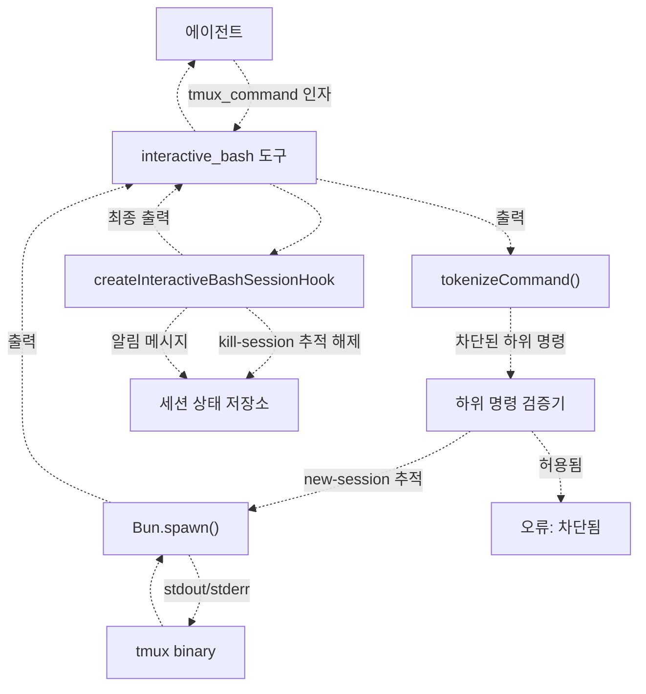
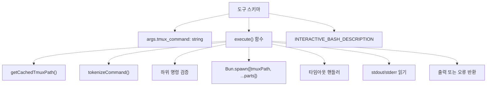
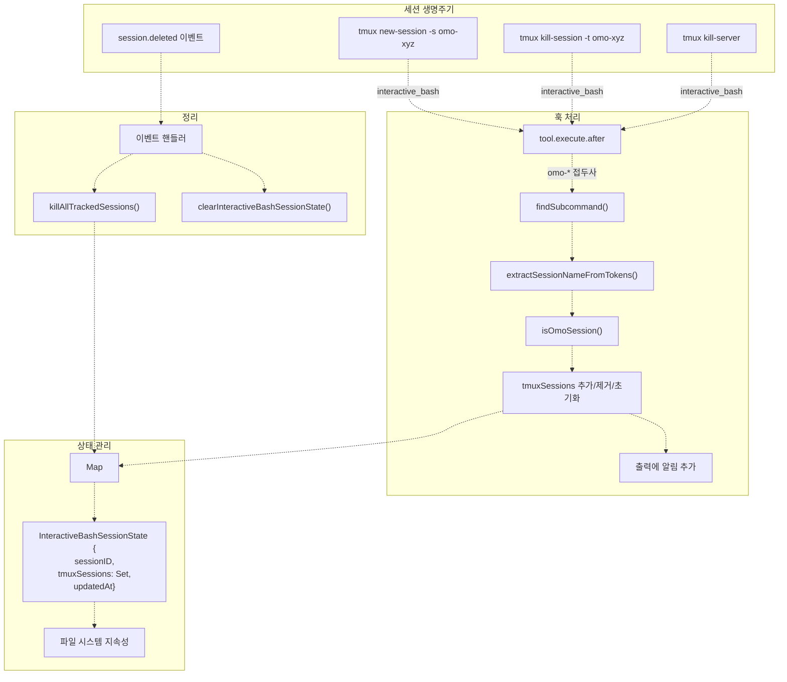
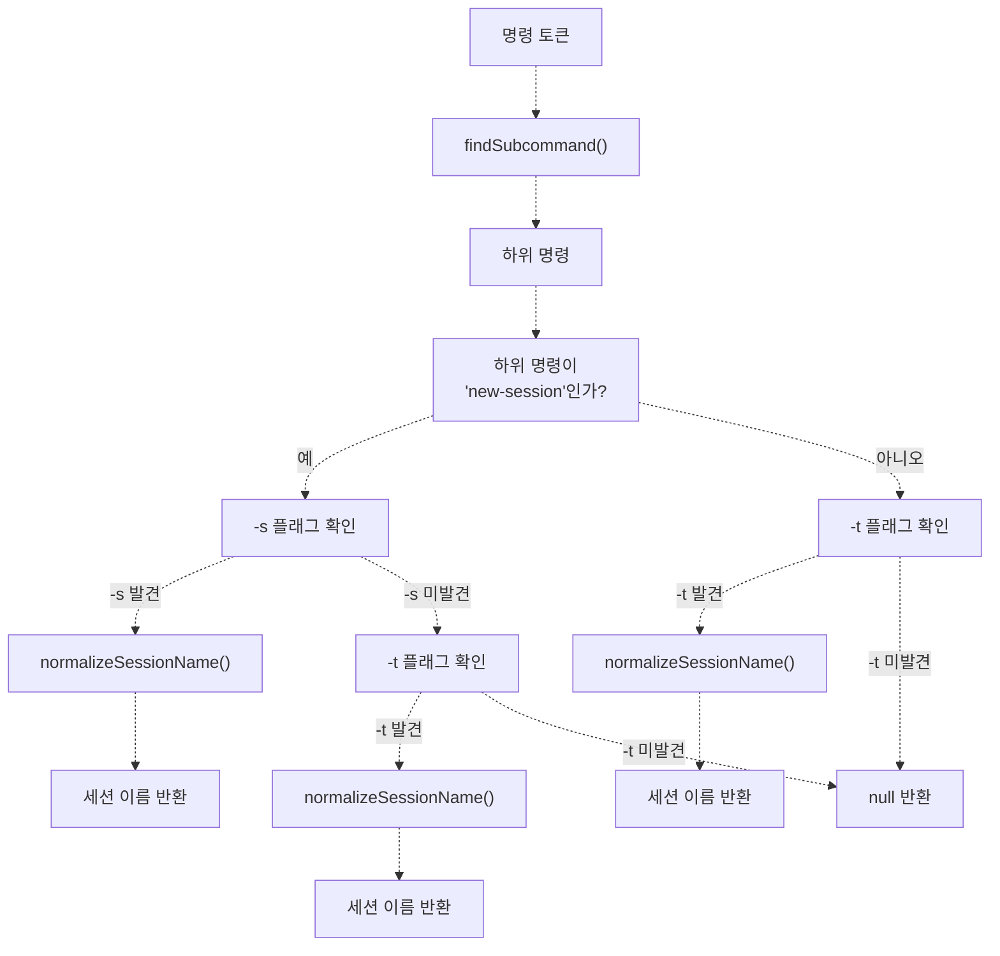
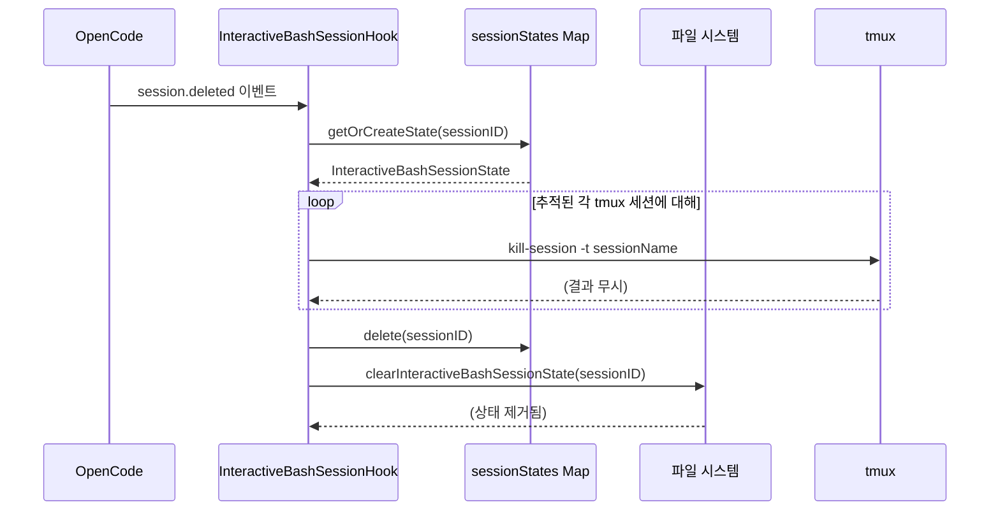
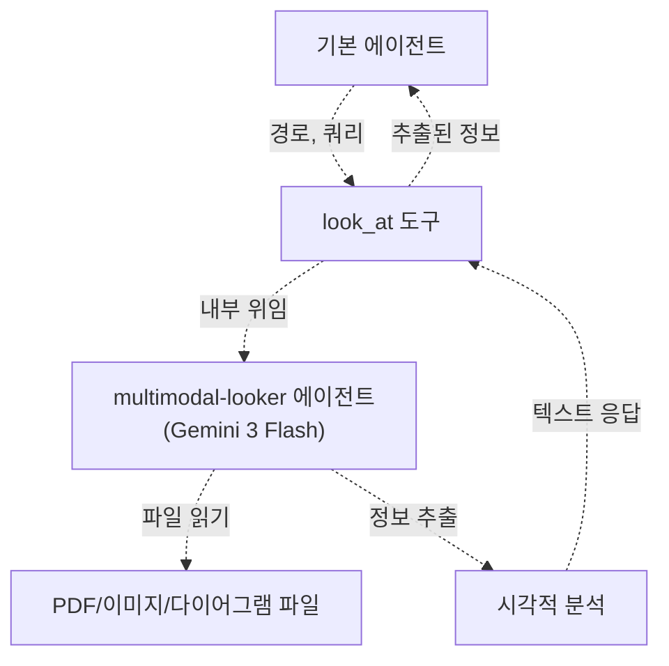
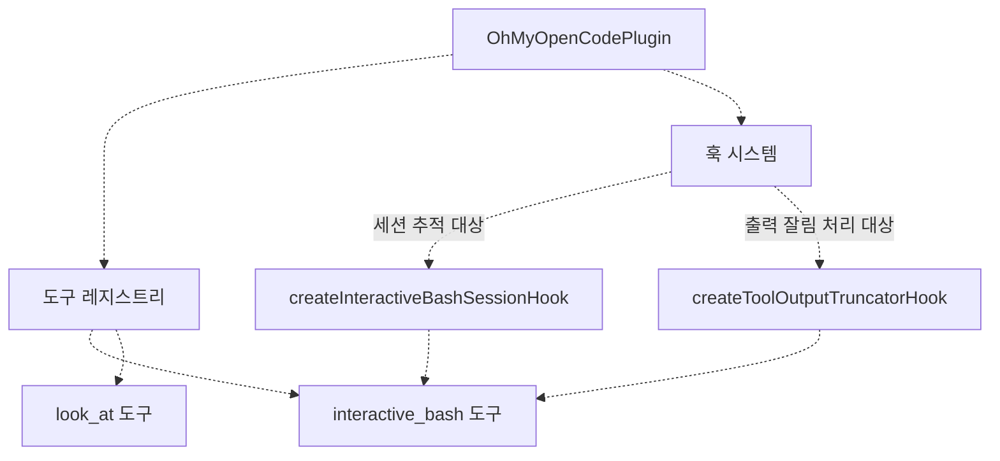

# 특화 도구 (Specialized Tools)

> **관련 소스 파일**
> * [README.ja.md](https://github.com/code-yeongyu/oh-my-opencode/blob/b92cd6ab/README.ja.md)
> * [README.ko.md](https://github.com/code-yeongyu/oh-my-opencode/blob/b92cd6ab/README.ko.md)
> * [README.md](https://github.com/code-yeongyu/oh-my-opencode/blob/b92cd6ab/README.md)
> * [README.zh-cn.md](https://github.com/code-yeongyu/oh-my-opencode/blob/b92cd6ab/README.zh-cn.md)
> * [src/shared/config-path.ts](https://github.com/code-yeongyu/oh-my-opencode/blob/b92cd6ab/src/shared/config-path.ts)
> * [src/tools/background-task/constants.ts](https://github.com/code-yeongyu/oh-my-opencode/blob/b92cd6ab/src/tools/background-task/constants.ts)
> * [src/tools/background-task/index.ts](https://github.com/code-yeongyu/oh-my-opencode/blob/b92cd6ab/src/tools/background-task/index.ts)
> * [src/tools/background-task/types.ts](https://github.com/code-yeongyu/oh-my-opencode/blob/b92cd6ab/src/tools/background-task/types.ts)
> * [src/tools/call-omo-agent/constants.ts](https://github.com/code-yeongyu/oh-my-opencode/blob/b92cd6ab/src/tools/call-omo-agent/constants.ts)
> * [src/tools/interactive-bash/constants.ts](https://github.com/code-yeongyu/oh-my-opencode/blob/b92cd6ab/src/tools/interactive-bash/constants.ts)
> * [src/tools/look-at/constants.ts](https://github.com/code-yeongyu/oh-my-opencode/blob/b92cd6ab/src/tools/look-at/constants.ts)
> * [src/tools/look-at/tools.ts](https://github.com/code-yeongyu/oh-my-opencode/blob/b92cd6ab/src/tools/look-at/tools.ts)

이 페이지는 미디어 분석, 지속적인 터미널 세션, 스킬 실행 등 도메인별 기능을 위해 oh-my-opencode에서 제공하는 특화 도구들을 설명합니다. 이 도구들은 집중적이고 가치 높은 기능을 통해 에이전트의 능력을 확장합니다.

LSP 도구에 대한 정보는 [LSP 도구](/code-yeongyu/oh-my-opencode/5.1-lsp-tools)를 참조하세요. AST-Grep 도구는 [AST-Grep 도구](/code-yeongyu/oh-my-opencode/5.2-ast-grep-tools), 백그라운드 작업 실행은 [백그라운드 작업 도구](/code-yeongyu/oh-my-opencode/5.3-background-task-tools), 세션 관리 도구는 [세션 관리 도구](/code-yeongyu/oh-my-opencode/5.4-session-management-tools)에서 확인할 수 있습니다.

## 개요 (Overview)

oh-my-opencode는 세 가지 특화 도구를 제공합니다:

| 도구 | 목적 | 주요 기능 |
| --- | --- | --- |
| `look_at` | 멀티모달(Multimodal) 콘텐츠 분석 | 위임된 에이전트를 통한 PDF/이미지/비디오 분석 |
| `interactive_bash` | Tmux 세션 관리 | 상태 추적이 가능한 지속적인 터미널 세션 |
| `skill` | 스킬 실행 | `~/.claude/skills/`에 정의된 워크플로우 실행 |

출처: [README.md L569-L577](https://github.com/code-yeongyu/oh-my-opencode/blob/b92cd6ab/README.md#L569-L577), [src/tools/look-at/constants.ts L3](https://github.com/code-yeongyu/oh-my-opencode/blob/b92cd6ab/src/tools/look-at/constants.ts#L3-L3), [src/tools/interactive-bash/constants.ts L14-L16](https://github.com/code-yeongyu/oh-my-opencode/blob/b92cd6ab/src/tools/interactive-bash/constants.ts#L14-L16)

## Interactive Bash 도구

### 목적 및 아키텍처

`interactive_bash` 도구는 에이전트가 지속적인 tmux 터미널 세션을 생성하고 관리할 수 있게 해줍니다. 일회성 셸에서 명령을 실행하는 표준 `bash` 도구와 달리, `interactive_bash`를 사용하면 에이전트가 장시간 실행되는 프로세스, 대화형 애플리케이션 및 상태가 유지되는 터미널 환경을 유지할 수 있습니다.



**출처:** [src/tools/interactive-bash/tools.ts L1-L104](https://github.com/code-yeongyu/oh-my-opencode/blob/b92cd6ab/src/tools/interactive-bash/tools.ts#L1-L104), [src/hooks/interactive-bash-session/index.ts L1-L262](https://github.com/code-yeongyu/oh-my-opencode/blob/b92cd6ab/src/hooks/interactive-bash-session/index.ts#L1-L262)

### 도구 정의

`interactive_bash` 도구는 플러그인 도구 API를 사용하여 [src/tools/interactive-bash/tools.ts L50-L104](https://github.com/code-yeongyu/oh-my-opencode/blob/b92cd6ab/src/tools/interactive-bash/tools.ts#L50-L104)에 정의되어 있습니다:



주요 구현 세부 사항:

* **인자:** 단일 `tmux_command` 문자열 (`tmux` 접두사 제외)
* **실행:** [src/tools/interactive-bash/tools.ts L70](https://github.com/code-yeongyu/oh-my-opencode/blob/b92cd6ab/src/tools/interactive-bash/tools.ts#L70-L70)에서 `Bun.spawn()`을 통해 tmux 하위 프로세스 생성
* **타임아웃:** [src/tools/interactive-bash/tools.ts L75-L81](https://github.com/code-yeongyu/oh-my-opencode/blob/b92cd6ab/src/tools/interactive-bash/tools.ts#L75-L81)에서 `DEFAULT_TIMEOUT_MS` 적용
* **오류 처리:** [src/tools/interactive-bash/tools.ts L94-L97](https://github.com/code-yeongyu/oh-my-opencode/blob/b92cd6ab/src/tools/interactive-bash/tools.ts#L94-L97)에서 종료 코드(exit code) 확인

**출처:** [src/tools/interactive-bash/tools.ts L50-L104](https://github.com/code-yeongyu/oh-my-opencode/blob/b92cd6ab/src/tools/interactive-bash/tools.ts#L50-L104)

### 명령 토큰화 (Command Tokenization)

이 도구는 따옴표가 포함된 문자열과 이스케이프 시퀀스를 포함하는 tmux 명령을 안전하게 파싱하기 위해 따옴표를 인식하는 커스텀 토크나이저(tokenizer)를 사용합니다.

[src/tools/interactive-bash/tools.ts L9-L48](https://github.com/code-yeongyu/oh-my-opencode/blob/b92cd6ab/src/tools/interactive-bash/tools.ts#L9-L48)에 있는 `tokenizeCommand()` 함수는 다음을 처리합니다:

* **단일/이중 따옴표:** 따옴표로 묶인 문자열 내의 공백 보존
* **백슬래시 이스케이프:** `\`는 다음 문자를 이스케이프함
* **예외 케이스:** 끝부분의 이스케이프, 닫히지 않은 따옴표, 빈 토큰 처리

**출처:** [src/tools/interactive-bash/tools.ts L9-L48](https://github.com/code-yeongyu/oh-my-opencode/blob/b92cd6ab/src/tools/interactive-bash/tools.ts#L9-L48), [src/hooks/interactive-bash-session/index.ts L34-L73](https://github.com/code-yeongyu/oh-my-opencode/blob/b92cd6ab/src/hooks/interactive-bash-session/index.ts#L34-L73)

### 하위 명령 검증 (Subcommand Validation)

보안을 위해 특정 tmux 하위 명령은 [src/tools/interactive-bash/tools.ts L65-L68](https://github.com/code-yeongyu/oh-my-opencode/blob/b92cd6ab/src/tools/interactive-bash/tools.ts#L65-L68)에서 차단됩니다:

```
BLOCKED_TMUX_SUBCOMMANDS = ["capture-pane", "show-buffer", "save-buffer", ...]
```

차단된 명령은 에이전트가 출력을 캡처하기 위해 표준 `bash` 도구를 사용하도록 유도하여 다음을 방지합니다:

* 적절한 출력 처리를 우회하는 버퍼 접근
* 직접적인 터미널 출력 조작
* 안전하지 않은 상태 수정

**출처:** [src/tools/interactive-bash/constants.ts](https://github.com/code-yeongyu/oh-my-opencode/blob/b92cd6ab/src/tools/interactive-bash/constants.ts) (참조됨), [src/tools/interactive-bash/tools.ts L65-L68](https://github.com/code-yeongyu/oh-my-opencode/blob/b92cd6ab/src/tools/interactive-bash/tools.ts#L65-L68)

### 세션 상태 추적 (Session State Tracking)

[src/hooks/interactive-bash-session/index.ts L149-L262](https://github.com/code-yeongyu/oh-my-opencode/blob/b92cd6ab/src/hooks/interactive-bash-session/index.ts#L149-L262)에 있는 `createInteractiveBashSessionHook`은 에이전트가 생성한 tmux 세션을 추적합니다:



**주요 동작:**

1. **세션 감지:** [src/hooks/interactive-bash-session/index.ts L165-L167](https://github.com/code-yeongyu/oh-my-opencode/blob/b92cd6ab/src/hooks/interactive-bash-session/index.ts#L165-L167)에서 `OMO_SESSION_PREFIX`(일반적으로 `"omo-"`)가 있는 세션만 추적합니다.
2. **상태 변경:**
    * `new-session`: [src/hooks/interactive-bash-session/index.ts L215-L217](https://github.com/code-yeongyu/oh-my-opencode/blob/b92cd6ab/src/hooks/interactive-bash-session/index.ts#L215-L217)에서 `tmuxSessions` Set에 추가합니다.
    * `kill-session`: [src/hooks/interactive-bash-session/index.ts L218-L220](https://github.com/code-yeongyu/oh-my-opencode/blob/b92cd6ab/src/hooks/interactive-bash-session/index.ts#L218-L220)에서 Set에서 제거합니다.
    * `kill-server`: [src/hooks/interactive-bash-session/index.ts L221-L223](https://github.com/code-yeongyu/oh-my-opencode/blob/b92cd6ab/src/hooks/interactive-bash-session/index.ts#L221-L223)에서 전체 Set을 비웁니다.
3. **지속성:** [src/hooks/interactive-bash-session/index.ts L228](https://github.com/code-yeongyu/oh-my-opencode/blob/b92cd6ab/src/hooks/interactive-bash-session/index.ts#L228-L228)에서 `saveInteractiveBashSessionState()`를 통해 상태를 파일 시스템에 저장합니다.
4. **알림 메시지:** [src/hooks/interactive-bash-session/index.ts L233-L239](https://github.com/code-yeongyu/oh-my-opencode/blob/b92cd6ab/src/hooks/interactive-bash-session/index.ts#L233-L239)에서 `buildSessionReminderMessage()`를 통해 도구 출력에 추가됩니다.

**출처:** [src/hooks/interactive-bash-session/index.ts L149-L262](https://github.com/code-yeongyu/oh-my-opencode/blob/b92cd6ab/src/hooks/interactive-bash-session/index.ts#L149-L262), [src/hooks/interactive-bash-session/types.ts](https://github.com/code-yeongyu/oh-my-opencode/blob/b92cd6ab/src/hooks/interactive-bash-session/types.ts) (참조됨), [src/hooks/interactive-bash-session/constants.ts](https://github.com/code-yeongyu/oh-my-opencode/blob/b92cd6ab/src/hooks/interactive-bash-session/constants.ts) (참조됨)

### 세션 이름 추출 (Session Name Extraction)

훅은 [src/hooks/interactive-bash-session/index.ts L83-L106](https://github.com/code-yeongyu/oh-my-opencode/blob/b92cd6ab/src/hooks/interactive-bash-session/index.ts#L83-L106)에서 tmux 명령 플래그로부터 세션 이름을 추출합니다:



**세션 이름 정규화:**

[src/hooks/interactive-bash-session/index.ts L79-L81](https://github.com/code-yeongyu/oh-my-opencode/blob/b92cd6ab/src/hooks/interactive-bash-session/index.ts#L79-L81)에 있는 `normalizeSessionName()` 함수는 tmux 접미사를 제거합니다:

* `"omo-x:1"` → `"omo-x"` (`:window` 제거)
* `"omo-x:1.2"` → `"omo-x"` (`:window.pane` 제거)

이를 통해 윈도우/패인 지정자에 관계없이 일관된 추적이 가능합니다.

**하위 명령 감지:**

[src/hooks/interactive-bash-session/index.ts L116-L148](https://github.com/code-yeongyu/oh-my-opencode/blob/b92cd6ab/src/hooks/interactive-bash-session/index.ts#L116-L148)에 있는 `findSubcommand()` 함수는 tmux 전역 옵션을 처리합니다:

* 인자가 있는 옵션 건너뛰기: `-L`, `-S`, `-f`, `-c`, `-T`
* 단독 플래그 건너뛰기: `-C`, `-v`, `-V`
* `--` 옵션 종료 마커 처리
* 옵션이 아닌 첫 번째 토큰을 하위 명령으로 반환

**출처:** [src/hooks/interactive-bash-session/index.ts L79-L148](https://github.com/code-yeongyu/oh-my-opencode/blob/b92cd6ab/src/hooks/interactive-bash-session/index.ts#L79-L148)

### 자동 정리 (Automatic Cleanup)

OpenCode 세션이 삭제되면, 훅은 추적된 모든 tmux 세션을 자동으로 종료합니다:



[src/hooks/interactive-bash-session/index.ts L242-L256](https://github.com/code-yeongyu/oh-my-opencode/blob/b92cd6ab/src/hooks/interactive-bash-session/index.ts#L242-L256)의 정리 로직:

1. [src/hooks/interactive-bash-session/index.ts L250](https://github.com/code-yeongyu/oh-my-opencode/blob/b92cd6ab/src/hooks/interactive-bash-session/index.ts#L250-L250)에서 디스크로부터 저장된 상태를 로드합니다.
2. [src/hooks/interactive-bash-session/index.ts L172-L180](https://github.com/code-yeongyu/oh-my-opencode/blob/b92cd6ab/src/hooks/interactive-bash-session/index.ts#L172-L180)에서 추적된 각 세션에 대해 `tmux kill-session`을 실행합니다.
3. [src/hooks/interactive-bash-session/index.ts L252](https://github.com/code-yeongyu/oh-my-opencode/blob/b92cd6ab/src/hooks/interactive-bash-session/index.ts#L252-L252)에서 메모리 내 상태를 제거합니다.
4. [src/hooks/interactive-bash-session/index.ts L253](https://github.com/code-yeongyu/oh-my-opencode/blob/b92cd6ab/src/hooks/interactive-bash-session/index.ts#L253-L253)에서 저장된 상태 파일을 삭제합니다.

**출처:** [src/hooks/interactive-bash-session/index.ts L242-L256](https://github.com/code-yeongyu/oh-my-opencode/blob/b92cd6ab/src/hooks/interactive-bash-session/index.ts#L242-L256), [src/hooks/interactive-bash-session/index.ts L170-L181](https://github.com/code-yeongyu/oh-my-opencode/blob/b92cd6ab/src/hooks/interactive-bash-session/index.ts#L170-L181), [src/hooks/interactive-bash-session/storage.ts](https://github.com/code-yeongyu/oh-my-opencode/blob/b92cd6ab/src/hooks/interactive-bash-session/storage.ts) (참조됨)

### 상태 지속성 형식 (State Persistence Format)

[src/hooks/interactive-bash-session/index.ts L8](https://github.com/code-yeongyu/oh-my-opencode/blob/b92cd6ab/src/hooks/interactive-bash-session/index.ts#L8-L8)에서 참조되는 `InteractiveBashSessionState` 타입:

```yaml
interface InteractiveBashSessionState {
  sessionID: string
  tmuxSessions: Set<string>
  updatedAt: number
}
```

상태는 `src/hooks/interactive-bash-session/storage.ts`(참조됨)의 함수들을 통해 유지됩니다:

* `loadInteractiveBashSessionState(sessionID)`: 디스크에서 상태 로드
* `saveInteractiveBashSessionState(state)`: 상태를 직렬화하여 기록
* `clearInteractiveBashSessionState(sessionID)`: 상태 파일 삭제

저장 위치는 XDG Base Directory 사양을 따릅니다 (경로 확인은 [설정 시스템](/code-yeongyu/oh-my-opencode/3.2-configuration-system) 참조).

**출처:** [src/hooks/interactive-bash-session/types.ts](https://github.com/code-yeongyu/oh-my-opencode/blob/b92cd6ab/src/hooks/interactive-bash-session/types.ts) (참조됨), [src/hooks/interactive-bash-session/storage.ts](https://github.com/code-yeongyu/oh-my-opencode/blob/b92cd6ab/src/hooks/interactive-bash-session/storage.ts) (참조됨), [src/hooks/interactive-bash-session/index.ts L154-L159](https://github.com/code-yeongyu/oh-my-opencode/blob/b92cd6ab/src/hooks/interactive-bash-session/index.ts#L154-L159)

## 멀티모달 Looker 도구

### 목적 및 기능

`look_at` 도구는 에이전트가 파일 전체를 컨텍스트에 읽어들이지 않고도 시각적 콘텐츠(PDF, 이미지, 다이어그램)를 분석할 수 있게 해줍니다. AmpCode에서 영감을 받은 이 도구는 분석 작업을 특화된 멀티모달 에이전트(일반적으로 Google Gemini 3 Flash)에게 위임합니다.



**주요 장점:**

* **컨텍스트 보존:** 원본 파일 내용이 아닌 추출된 정보만 기본 에이전트의 컨텍스트에 들어갑니다.
* **토큰 효율성:** 대규모 바이너리/이미지 데이터가 컨텍스트 창을 소모하는 것을 방지합니다.
* **특화된 모델:** 시각적 이해에 최적화된 멀티모달 지원 모델을 사용합니다.

**출처:** [README.md L583-L585](https://github.com/code-yeongyu/oh-my-opencode/blob/b92cd6ab/README.md#L583-L585), [README.md L519-L521](https://github.com/code-yeongyu/oh-my-opencode/blob/b92cd6ab/README.md#L519-L521)

### 사용 패턴 (Usage Pattern)

일반적인 워크플로우:

1. 기본 에이전트가 분석이 필요한 시각적 콘텐츠를 발견합니다.
2. 파일 경로와 구체적인 쿼리를 사용하여 `look_at`을 호출합니다.
3. `multimodal-looker` 에이전트가 위임된 요청을 받습니다.
4. 에이전트가 파일을 읽고 시각적 콘텐츠를 분석합니다.
5. 텍스트 요약/답변을 기본 에이전트에게 반환합니다.
6. 기본 에이전트는 추출된 정보를 바탕으로 작업을 계속합니다.

이 패턴은 백그라운드 에이전트 시스템([백그라운드 작업 도구](/code-yeongyu/oh-my-opencode/5.3-background-task-tools) 참조)과 유사하지만, 병렬 실행보다는 콘텐츠 추출에 초점을 맞춘 동기식 방식입니다.

**출처:** [README.md L494-L496](https://github.com/code-yeongyu/oh-my-opencode/blob/b92cd6ab/README.md#L494-L496), [README.md L583-L585](https://github.com/code-yeongyu/oh-my-opencode/blob/b92cd6ab/README.md#L583-L585)

### 에이전트 설정

`multimodal-looker` 에이전트는 에이전트 시스템에서 설정됩니다 ([구현 에이전트](/code-yeongyu/oh-my-opencode/4.3-agent-configuration) 참조):

* **기본 모델:** `google/gemini-3-flash` (빠르고 비용 효율적인 멀티모달 모델)
* **설정 가능:** `oh-my-opencode.json`을 통해 모델을 재정의할 수 있습니다:

```json
{
  "agents": {
    "multimodal-looker": {
      "model": "anthropic/claude-opus-4-5"
    }
  }
}
```

Google 인증을 사용할 수 없는 경우, 도구는 설정된 대체 모델로 폴백(fallback)합니다.

**출처:** [README.md L496](https://github.com/code-yeongyu/oh-my-opencode/blob/b92cd6ab/README.md#L496-L496), [README.md L236-L244](https://github.com/code-yeongyu/oh-my-opencode/blob/b92cd6ab/README.md#L236-L244)

## 도구 등록 (Tool Registration)

두 커스텀 도구 모두 플러그인의 도구 시스템에 등록됩니다:



**통합 지점:**

* **도구 등록:** 플러그인 도구 API를 통해 도구 노출
* **훅 조정:** `interactive_bash`는 세션 추적 훅과 연동됨
* **출력 처리:** 도구 출력은 `tool-output-truncator` 훅에 의해 잘릴 수 있음 ([도구 강화 훅](/code-yeongyu/oh-my-opencode/7.3-todo-continuation-enforcer) 참조)

**출처:** [src/tools/interactive-bash/tools.ts L50](https://github.com/code-yeongyu/oh-my-opencode/blob/b92cd6ab/src/tools/interactive-bash/tools.ts#L50-L50), [src/hooks/interactive-bash-session/index.ts L149](https://github.com/code-yeongyu/oh-my-opencode/blob/b92cd6ab/src/hooks/interactive-bash-session/index.ts#L149-L149), [src/hooks/tool-output-truncator.ts L17-L19](https://github.com/code-yeongyu/oh-my-opencode/blob/b92cd6ab/src/hooks/tool-output-truncator.ts#L17-L19)

## 설정 (Configuration)

### Interactive Bash 권한

에이전트 권한 시스템은 `interactive_bash` 접근을 제어합니다 ([에이전트 설정](#4.4) 참조):

```json
{
  "agents": {
    "explore": {
      "permission": {
        "bash": "deny"
      }
    }
  }
}
```

`"bash": "deny"`로 설정하면 에이전트가 `bash`와 `interactive_bash` 도구 모두를 사용할 수 없게 됩니다.

**출처:** [README.md L771-L787](https://github.com/code-yeongyu/oh-my-opencode/blob/b92cd6ab/README.md#L771-L787)

### 출력 잘림 (Output Truncation)

`interactive_bash` 도구는 [src/hooks/tool-output-truncator.ts L17-L19](https://github.com/code-yeongyu/oh-my-opencode/blob/b92cd6ab/src/hooks/tool-output-truncator.ts#L17-L19)에서 도구 출력 잘림 처리 대상이 됩니다:

```
TRUNCATABLE_TOOLS = [
  ...,
  "interactive_bash",
  "Interactive_bash",
]
```

출력은 남은 컨텍스트 창에 따라 동적으로 잘립니다 ([도구 강화 훅](/code-yeongyu/oh-my-opencode/7.3-todo-continuation-enforcer) 참조).

모든 도구 출력을 자르려면 실험적 플래그를 활성화하세요:

```json
{
  "experimental": {
    "truncate_all_tool_outputs": true
  }
}
```

**출처:** [src/hooks/tool-output-truncator.ts L5-L28](https://github.com/code-yeongyu/oh-my-opencode/blob/b92cd6ab/src/hooks/tool-output-truncator.ts#L5-L28)