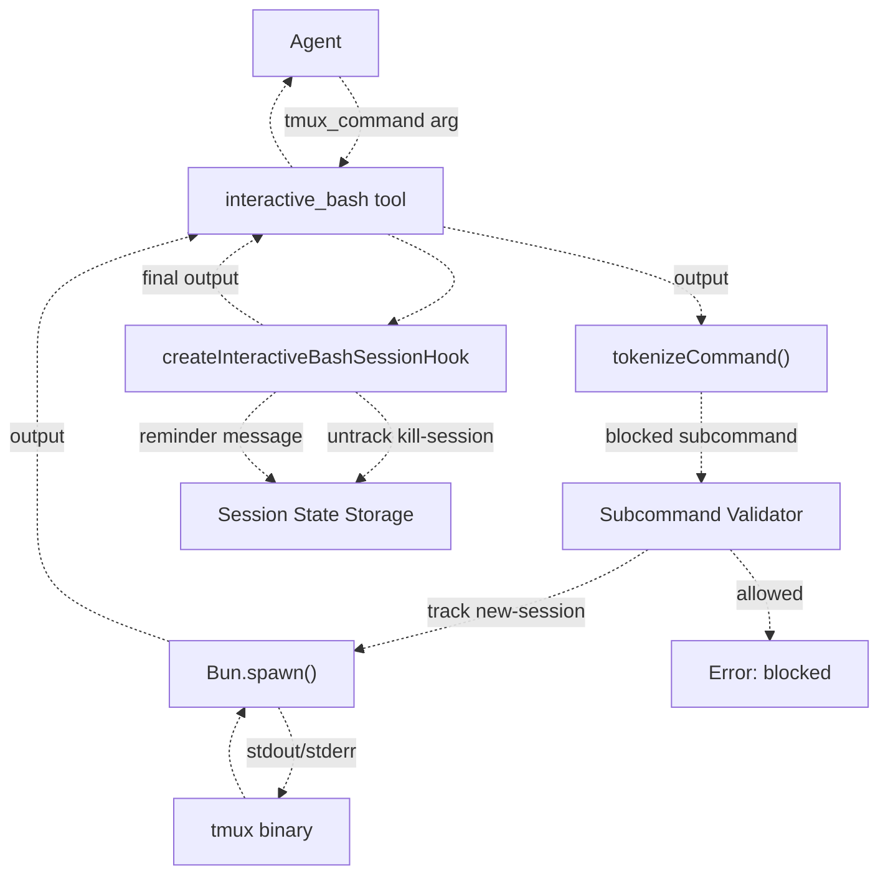
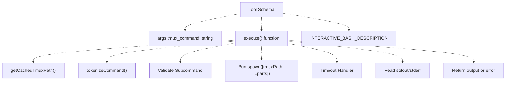
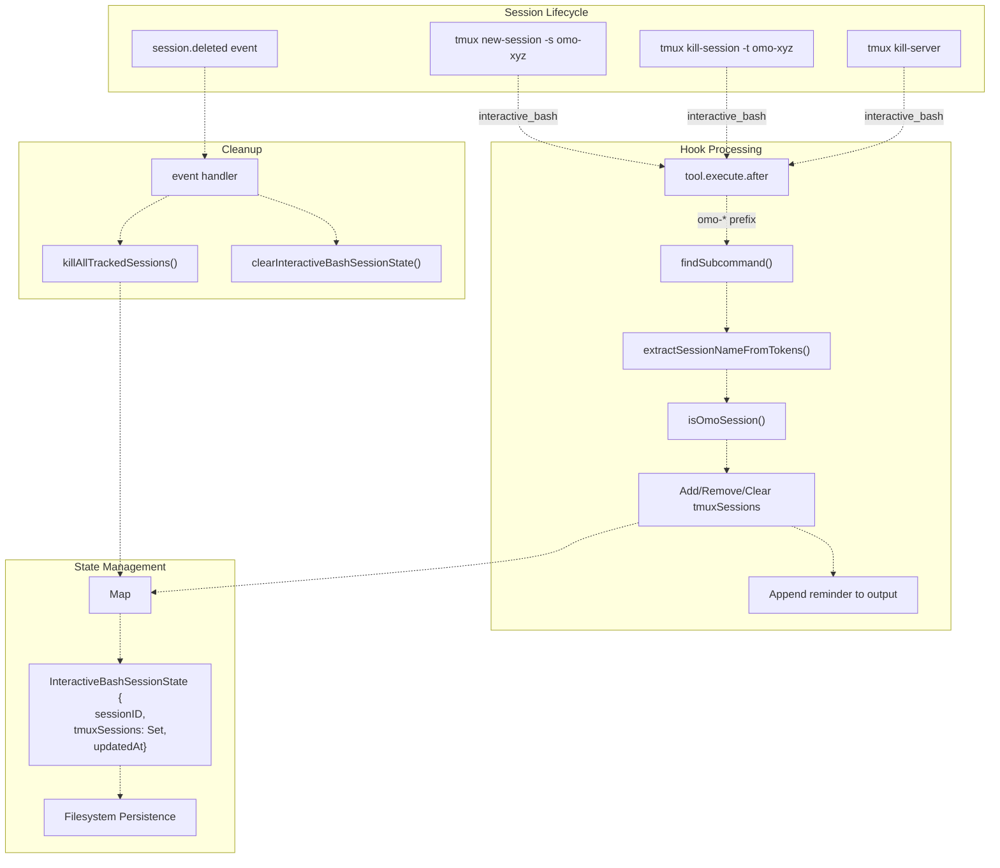
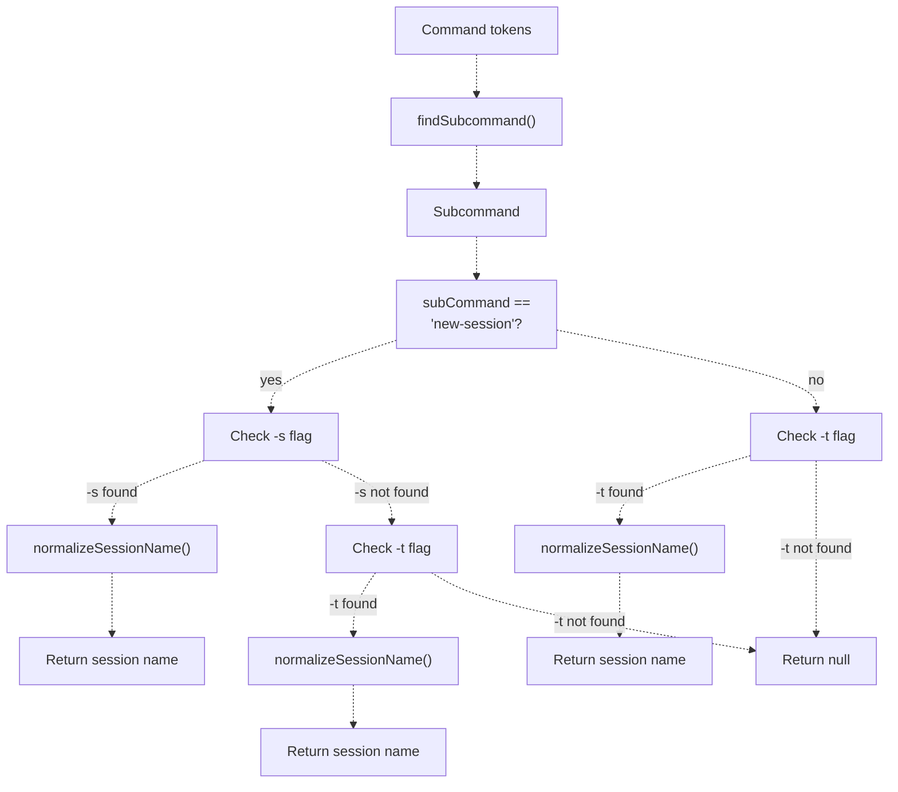
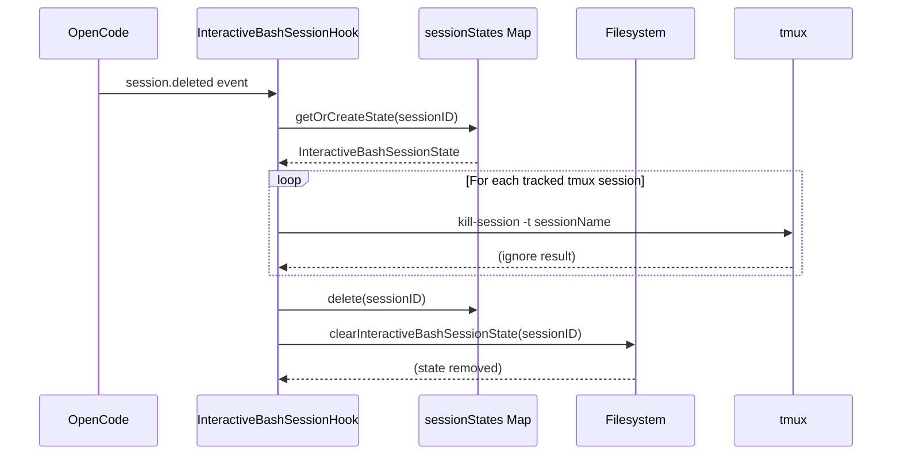
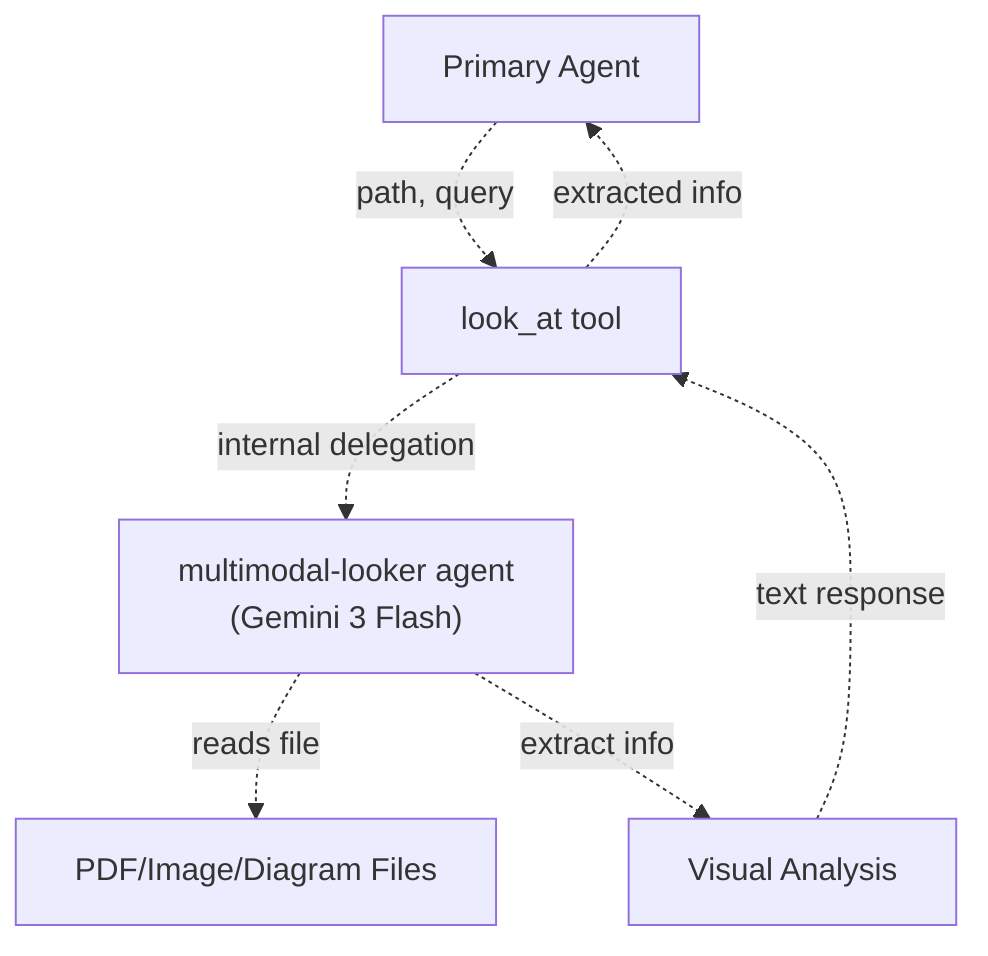
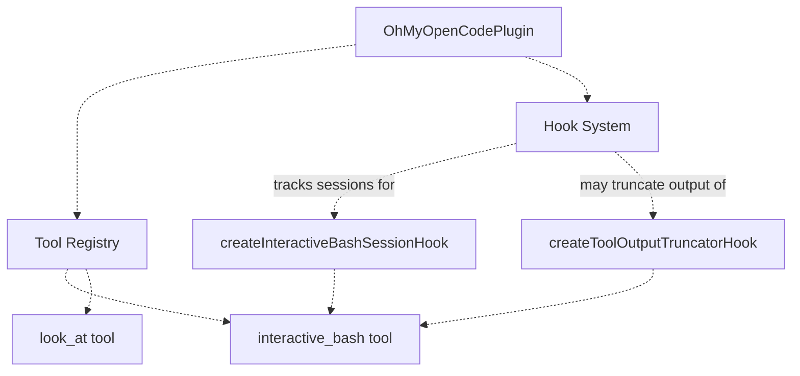

# Specialized Tools

> **Relevant source files**
> * [README.ja.md](https://github.com/code-yeongyu/oh-my-opencode/blob/b92cd6ab/README.ja.md)
> * [README.ko.md](https://github.com/code-yeongyu/oh-my-opencode/blob/b92cd6ab/README.ko.md)
> * [README.md](https://github.com/code-yeongyu/oh-my-opencode/blob/b92cd6ab/README.md)
> * [README.zh-cn.md](https://github.com/code-yeongyu/oh-my-opencode/blob/b92cd6ab/README.zh-cn.md)
> * [src/shared/config-path.ts](https://github.com/code-yeongyu/oh-my-opencode/blob/b92cd6ab/src/shared/config-path.ts)
> * [src/tools/background-task/constants.ts](https://github.com/code-yeongyu/oh-my-opencode/blob/b92cd6ab/src/tools/background-task/constants.ts)
> * [src/tools/background-task/index.ts](https://github.com/code-yeongyu/oh-my-opencode/blob/b92cd6ab/src/tools/background-task/index.ts)
> * [src/tools/background-task/types.ts](https://github.com/code-yeongyu/oh-my-opencode/blob/b92cd6ab/src/tools/background-task/types.ts)
> * [src/tools/call-omo-agent/constants.ts](https://github.com/code-yeongyu/oh-my-opencode/blob/b92cd6ab/src/tools/call-omo-agent/constants.ts)
> * [src/tools/interactive-bash/constants.ts](https://github.com/code-yeongyu/oh-my-opencode/blob/b92cd6ab/src/tools/interactive-bash/constants.ts)
> * [src/tools/look-at/constants.ts](https://github.com/code-yeongyu/oh-my-opencode/blob/b92cd6ab/src/tools/look-at/constants.ts)
> * [src/tools/look-at/tools.ts](https://github.com/code-yeongyu/oh-my-opencode/blob/b92cd6ab/src/tools/look-at/tools.ts)

This page documents specialized tools provided by oh-my-opencode for domain-specific functionality: media analysis, persistent terminal sessions, and skill execution. These tools extend agent capabilities with focused, high-value features.

For information about LSP tools, see [LSP Tools](/code-yeongyu/oh-my-opencode/5.1-lsp-tools). For AST-Grep tools, see [AST-Grep Tools](/code-yeongyu/oh-my-opencode/5.2-ast-grep-tools). For background task execution, see [Background Task Tools](/code-yeongyu/oh-my-opencode/5.3-background-task-tools). For session management tools, see [Session Management Tools](/code-yeongyu/oh-my-opencode/5.4-session-management-tools).

## Overview

Oh-my-opencode provides three specialized tools:

| Tool | Purpose | Key Capability |
| --- | --- | --- |
| `look_at` | Multimodal content analysis | PDF/image/video analysis via delegated agent |
| `interactive_bash` | Tmux session management | Persistent terminal sessions with state tracking |
| `skill` | Skill execution | Execute predefined workflows from ~/.claude/skills/ |

Sources: [README.md L569-L577](https://github.com/code-yeongyu/oh-my-opencode/blob/b92cd6ab/README.md#L569-L577)

 [src/tools/look-at/constants.ts L3](https://github.com/code-yeongyu/oh-my-opencode/blob/b92cd6ab/src/tools/look-at/constants.ts#L3-L3)

 [src/tools/interactive-bash/constants.ts L14-L16](https://github.com/code-yeongyu/oh-my-opencode/blob/b92cd6ab/src/tools/interactive-bash/constants.ts#L14-L16)

## Interactive Bash Tool

### Purpose and Architecture

The `interactive_bash` tool enables agents to create and manage persistent tmux terminal sessions. Unlike the standard `bash` tool, which executes commands in ephemeral shells, `interactive_bash` allows agents to maintain long-running processes, interactive applications, and stateful terminal environments.



**Sources:** [src/tools/interactive-bash/tools.ts L1-L104](https://github.com/code-yeongyu/oh-my-opencode/blob/b92cd6ab/src/tools/interactive-bash/tools.ts#L1-L104)

 [src/hooks/interactive-bash-session/index.ts L1-L262](https://github.com/code-yeongyu/oh-my-opencode/blob/b92cd6ab/src/hooks/interactive-bash-session/index.ts#L1-L262)

### Tool Definition

The `interactive_bash` tool is defined in [src/tools/interactive-bash/tools.ts L50-L104](https://github.com/code-yeongyu/oh-my-opencode/blob/b92cd6ab/src/tools/interactive-bash/tools.ts#L50-L104)

 using the plugin tool API:



Key implementation details:

* **Argument:** Single `tmux_command` string (without `tmux` prefix)
* **Execution:** Spawns tmux subprocess via `Bun.spawn()` at [src/tools/interactive-bash/tools.ts L70](https://github.com/code-yeongyu/oh-my-opencode/blob/b92cd6ab/src/tools/interactive-bash/tools.ts#L70-L70)
* **Timeout:** `DEFAULT_TIMEOUT_MS` enforced at [src/tools/interactive-bash/tools.ts L75-L81](https://github.com/code-yeongyu/oh-my-opencode/blob/b92cd6ab/src/tools/interactive-bash/tools.ts#L75-L81)
* **Error Handling:** Exit code checking at [src/tools/interactive-bash/tools.ts L94-L97](https://github.com/code-yeongyu/oh-my-opencode/blob/b92cd6ab/src/tools/interactive-bash/tools.ts#L94-L97)

**Sources:** [src/tools/interactive-bash/tools.ts L50-L104](https://github.com/code-yeongyu/oh-my-opencode/blob/b92cd6ab/src/tools/interactive-bash/tools.ts#L50-L104)

### Command Tokenization

The tool uses a custom quote-aware tokenizer to safely parse tmux commands containing quoted strings and escape sequences:

```

```

The `tokenizeCommand()` function at [src/tools/interactive-bash/tools.ts L9-L48](https://github.com/code-yeongyu/oh-my-opencode/blob/b92cd6ab/src/tools/interactive-bash/tools.ts#L9-L48)

 handles:

* **Single/double quotes:** Preserves spaces within quoted strings
* **Backslash escapes:** `\` escapes the next character
* **Edge cases:** Trailing escapes, unclosed quotes, empty tokens

**Sources:** [src/tools/interactive-bash/tools.ts L9-L48](https://github.com/code-yeongyu/oh-my-opencode/blob/b92cd6ab/src/tools/interactive-bash/tools.ts#L9-L48)

 [src/hooks/interactive-bash-session/index.ts L34-L73](https://github.com/code-yeongyu/oh-my-opencode/blob/b92cd6ab/src/hooks/interactive-bash-session/index.ts#L34-L73)

### Subcommand Validation

For security, certain tmux subcommands are blocked at [src/tools/interactive-bash/tools.ts L65-L68](https://github.com/code-yeongyu/oh-my-opencode/blob/b92cd6ab/src/tools/interactive-bash/tools.ts#L65-L68)

:

```
BLOCKED_TMUX_SUBCOMMANDS = ["capture-pane", "show-buffer", "save-buffer", ...]
```

Blocked commands redirect agents to use the standard `bash` tool for output capture, preventing:

* Buffer access that bypasses proper output handling
* Direct terminal output manipulation
* Unsafe state modifications

**Sources:** [src/tools/interactive-bash/constants.ts](https://github.com/code-yeongyu/oh-my-opencode/blob/b92cd6ab/src/tools/interactive-bash/constants.ts)

 (referenced), [src/tools/interactive-bash/tools.ts L65-L68](https://github.com/code-yeongyu/oh-my-opencode/blob/b92cd6ab/src/tools/interactive-bash/tools.ts#L65-L68)

### Session State Tracking

The `createInteractiveBashSessionHook` at [src/hooks/interactive-bash-session/index.ts L149-L262](https://github.com/code-yeongyu/oh-my-opencode/blob/b92cd6ab/src/hooks/interactive-bash-session/index.ts#L149-L262)

 tracks tmux sessions created by agents:



**Key behaviors:**

1. **Session detection:** Only tracks sessions with `OMO_SESSION_PREFIX` (typically `"omo-"`) at [src/hooks/interactive-bash-session/index.ts L165-L167](https://github.com/code-yeongyu/oh-my-opencode/blob/b92cd6ab/src/hooks/interactive-bash-session/index.ts#L165-L167)
2. **State mutations:** * `new-session`: Adds to `tmuxSessions` Set at [src/hooks/interactive-bash-session/index.ts L215-L217](https://github.com/code-yeongyu/oh-my-opencode/blob/b92cd6ab/src/hooks/interactive-bash-session/index.ts#L215-L217) * `kill-session`: Removes from Set at [src/hooks/interactive-bash-session/index.ts L218-L220](https://github.com/code-yeongyu/oh-my-opencode/blob/b92cd6ab/src/hooks/interactive-bash-session/index.ts#L218-L220) * `kill-server`: Clears entire Set at [src/hooks/interactive-bash-session/index.ts L221-L223](https://github.com/code-yeongyu/oh-my-opencode/blob/b92cd6ab/src/hooks/interactive-bash-session/index.ts#L221-L223)
3. **Persistence:** State saved to filesystem via `saveInteractiveBashSessionState()` at [src/hooks/interactive-bash-session/index.ts L228](https://github.com/code-yeongyu/oh-my-opencode/blob/b92cd6ab/src/hooks/interactive-bash-session/index.ts#L228-L228)
4. **Reminder messages:** Appended to tool output via `buildSessionReminderMessage()` at [src/hooks/interactive-bash-session/index.ts L233-L239](https://github.com/code-yeongyu/oh-my-opencode/blob/b92cd6ab/src/hooks/interactive-bash-session/index.ts#L233-L239)

**Sources:** [src/hooks/interactive-bash-session/index.ts L149-L262](https://github.com/code-yeongyu/oh-my-opencode/blob/b92cd6ab/src/hooks/interactive-bash-session/index.ts#L149-L262)

 [src/hooks/interactive-bash-session/types.ts](https://github.com/code-yeongyu/oh-my-opencode/blob/b92cd6ab/src/hooks/interactive-bash-session/types.ts)

 (referenced), [src/hooks/interactive-bash-session/constants.ts](https://github.com/code-yeongyu/oh-my-opencode/blob/b92cd6ab/src/hooks/interactive-bash-session/constants.ts)

 (referenced)

### Session Name Extraction

The hook extracts session names from tmux command flags at [src/hooks/interactive-bash-session/index.ts L83-L106](https://github.com/code-yeongyu/oh-my-opencode/blob/b92cd6ab/src/hooks/interactive-bash-session/index.ts#L83-L106)

:



**Session name normalization:**

The `normalizeSessionName()` function at [src/hooks/interactive-bash-session/index.ts L79-L81](https://github.com/code-yeongyu/oh-my-opencode/blob/b92cd6ab/src/hooks/interactive-bash-session/index.ts#L79-L81)

 strips tmux suffixes:

* `"omo-x:1"` → `"omo-x"` (removes `:window`)
* `"omo-x:1.2"` → `"omo-x"` (removes `:window.pane`)

This ensures consistent tracking regardless of window/pane specifiers.

**Subcommand detection:**

The `findSubcommand()` function at [src/hooks/interactive-bash-session/index.ts L116-L148](https://github.com/code-yeongyu/oh-my-opencode/blob/b92cd6ab/src/hooks/interactive-bash-session/index.ts#L116-L148)

 handles tmux global options:

* Skips options with arguments: `-L`, `-S`, `-f`, `-c`, `-T`
* Skips standalone flags: `-C`, `-v`, `-V`
* Handles `--` end-of-options marker
* Returns first non-option token as subcommand

**Sources:** [src/hooks/interactive-bash-session/index.ts L79-L148](https://github.com/code-yeongyu/oh-my-opencode/blob/b92cd6ab/src/hooks/interactive-bash-session/index.ts#L79-L148)

### Automatic Cleanup

When an OpenCode session is deleted, the hook automatically terminates all tracked tmux sessions:



The cleanup logic at [src/hooks/interactive-bash-session/index.ts L242-L256](https://github.com/code-yeongyu/oh-my-opencode/blob/b92cd6ab/src/hooks/interactive-bash-session/index.ts#L242-L256)

:

1. Loads persisted state from disk at [src/hooks/interactive-bash-session/index.ts L250](https://github.com/code-yeongyu/oh-my-opencode/blob/b92cd6ab/src/hooks/interactive-bash-session/index.ts#L250-L250)
2. Spawns `tmux kill-session` for each tracked session at [src/hooks/interactive-bash-session/index.ts L172-L180](https://github.com/code-yeongyu/oh-my-opencode/blob/b92cd6ab/src/hooks/interactive-bash-session/index.ts#L172-L180)
3. Removes in-memory state at [src/hooks/interactive-bash-session/index.ts L252](https://github.com/code-yeongyu/oh-my-opencode/blob/b92cd6ab/src/hooks/interactive-bash-session/index.ts#L252-L252)
4. Deletes persisted state file at [src/hooks/interactive-bash-session/index.ts L253](https://github.com/code-yeongyu/oh-my-opencode/blob/b92cd6ab/src/hooks/interactive-bash-session/index.ts#L253-L253)

**Sources:** [src/hooks/interactive-bash-session/index.ts L242-L256](https://github.com/code-yeongyu/oh-my-opencode/blob/b92cd6ab/src/hooks/interactive-bash-session/index.ts#L242-L256)

 [src/hooks/interactive-bash-session/index.ts L170-L181](https://github.com/code-yeongyu/oh-my-opencode/blob/b92cd6ab/src/hooks/interactive-bash-session/index.ts#L170-L181)

 [src/hooks/interactive-bash-session/storage.ts](https://github.com/code-yeongyu/oh-my-opencode/blob/b92cd6ab/src/hooks/interactive-bash-session/storage.ts)

 (referenced)

### State Persistence Format

The `InteractiveBashSessionState` type at [src/hooks/interactive-bash-session/index.ts L8](https://github.com/code-yeongyu/oh-my-opencode/blob/b92cd6ab/src/hooks/interactive-bash-session/index.ts#L8-L8)

 (referenced):

```yaml
interface InteractiveBashSessionState {
  sessionID: string
  tmuxSessions: Set<string>
  updatedAt: number
}
```

State is persisted via functions in `src/hooks/interactive-bash-session/storage.ts` (referenced):

* `loadInteractiveBashSessionState(sessionID)`: Loads state from disk
* `saveInteractiveBashSessionState(state)`: Serializes and writes state
* `clearInteractiveBashSessionState(sessionID)`: Deletes state file

Storage location follows XDG Base Directory Specification (see [Configuration System](/code-yeongyu/oh-my-opencode/3.2-configuration-system) for path resolution).

**Sources:** [src/hooks/interactive-bash-session/types.ts](https://github.com/code-yeongyu/oh-my-opencode/blob/b92cd6ab/src/hooks/interactive-bash-session/types.ts)

 (referenced), [src/hooks/interactive-bash-session/storage.ts](https://github.com/code-yeongyu/oh-my-opencode/blob/b92cd6ab/src/hooks/interactive-bash-session/storage.ts)

 (referenced), [src/hooks/interactive-bash-session/index.ts L154-L159](https://github.com/code-yeongyu/oh-my-opencode/blob/b92cd6ab/src/hooks/interactive-bash-session/index.ts#L154-L159)

## Multimodal Looker Tool

### Purpose and Functionality

The `look_at` tool enables agents to analyze visual content (PDFs, images, diagrams) without reading entire files into context. Inspired by AmpCode, this tool delegates analysis to a specialized multimodal agent (typically Google Gemini 3 Flash).



**Key benefits:**

* **Context preservation:** Only extracted information enters main agent's context, not raw file content
* **Token efficiency:** Prevents massive binary/image data from consuming context window
* **Specialized model:** Uses multimodal-capable model optimized for visual understanding

**Sources:** [README.md L583-L585](https://github.com/code-yeongyu/oh-my-opencode/blob/b92cd6ab/README.md#L583-L585)

 [README.md L519-L521](https://github.com/code-yeongyu/oh-my-opencode/blob/b92cd6ab/README.md#L519-L521)

### Usage Pattern

Typical workflow:

1. Primary agent encounters visual content needing analysis
2. Calls `look_at` with file path and specific query
3. `multimodal-looker` agent receives delegated request
4. Agent reads file and analyzes visual content
5. Returns textual summary/answer to primary agent
6. Primary agent continues with extracted information

This pattern is analogous to the background agent system (see [Background Task Tools](/code-yeongyu/oh-my-opencode/5.3-background-task-tools)), but synchronous and focused on content extraction rather than parallel execution.

**Sources:** [README.md L494-L496](https://github.com/code-yeongyu/oh-my-opencode/blob/b92cd6ab/README.md#L494-L496)

 [README.md L583-L585](https://github.com/code-yeongyu/oh-my-opencode/blob/b92cd6ab/README.md#L583-L585)

### Agent Configuration

The `multimodal-looker` agent is configured in the agent system (see [Implementation Agents](/code-yeongyu/oh-my-opencode/4.3-agent-configuration)):

* **Default model:** `google/gemini-3-flash` (fast, cost-effective multimodal)
* **Configurable:** Can override model via `oh-my-opencode.json`:

```json
{
  "agents": {
    "multimodal-looker": {
      "model": "anthropic/claude-opus-4-5"
    }
  }
}
```

When Google auth is unavailable, the tool falls back to configured alternative models.

**Sources:** [README.md L496](https://github.com/code-yeongyu/oh-my-opencode/blob/b92cd6ab/README.md#L496-L496)

 [README.md L236-L244](https://github.com/code-yeongyu/oh-my-opencode/blob/b92cd6ab/README.md#L236-L244)

## Tool Registration

Both custom tools are registered in the plugin's tool system:



**Integration points:**

* **Tool registration:** Tools exposed via plugin tool API
* **Hook coordination:** `interactive_bash` coordinated with session tracking hook
* **Output processing:** Tool output may be truncated by `tool-output-truncator` hook (see [Tool Enhancement Hooks](/code-yeongyu/oh-my-opencode/7.3-todo-continuation-enforcer))

**Sources:** [src/tools/interactive-bash/tools.ts L50](https://github.com/code-yeongyu/oh-my-opencode/blob/b92cd6ab/src/tools/interactive-bash/tools.ts#L50-L50)

 [src/hooks/interactive-bash-session/index.ts L149](https://github.com/code-yeongyu/oh-my-opencode/blob/b92cd6ab/src/hooks/interactive-bash-session/index.ts#L149-L149)

 [src/hooks/tool-output-truncator.ts L17-L19](https://github.com/code-yeongyu/oh-my-opencode/blob/b92cd6ab/src/hooks/tool-output-truncator.ts#L17-L19)

## Configuration

### Interactive Bash Permissions

Agent permission system controls `interactive_bash` access (see [Agent Configuration](#4.4)):

```json
{
  "agents": {
    "explore": {
      "permission": {
        "bash": "deny"
      }
    }
  }
}
```

Setting `"bash": "deny"` prevents the agent from using both `bash` and `interactive_bash` tools.

**Sources:** [README.md L771-L787](https://github.com/code-yeongyu/oh-my-opencode/blob/b92cd6ab/README.md#L771-L787)

### Output Truncation

The `interactive_bash` tool is subject to the tool output truncator at [src/hooks/tool-output-truncator.ts L17-L19](https://github.com/code-yeongyu/oh-my-opencode/blob/b92cd6ab/src/hooks/tool-output-truncator.ts#L17-L19)

:

```
TRUNCATABLE_TOOLS = [
  ...,
  "interactive_bash",
  "Interactive_bash",
]
```

Output is dynamically truncated based on remaining context window (see [Tool Enhancement Hooks](/code-yeongyu/oh-my-opencode/7.3-todo-continuation-enforcer)).

To truncate all tool outputs, enable experimental flag:

```json
{
  "experimental": {
    "truncate_all_tool_outputs": true
  }
}
```

**Sources:** [src/hooks/tool-output-truncator.ts L5-L28](https://github.com/code-yeongyu/oh-my-opencode/blob/b92cd6ab/src/hooks/tool-output-truncator.ts#L5-L28)