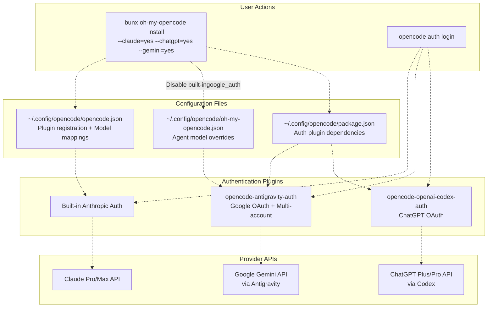
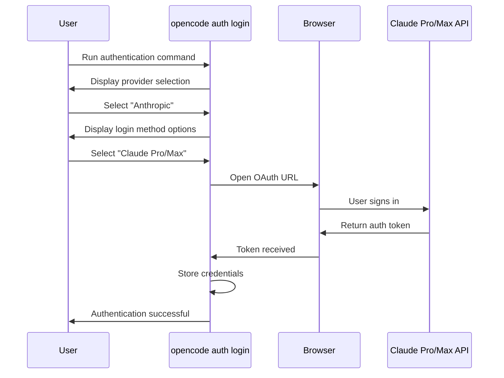
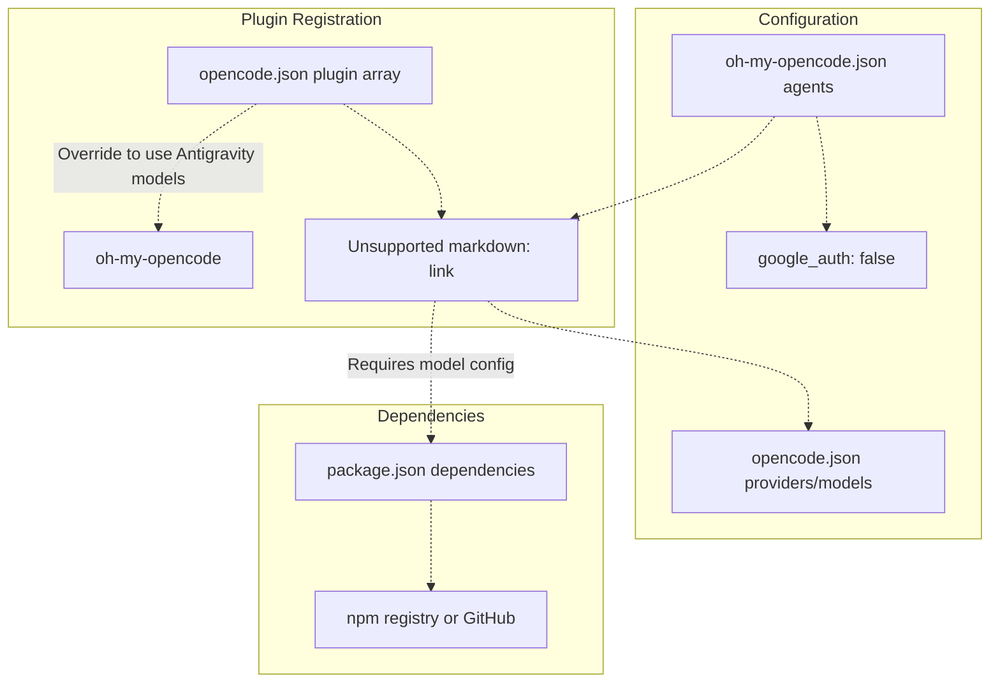
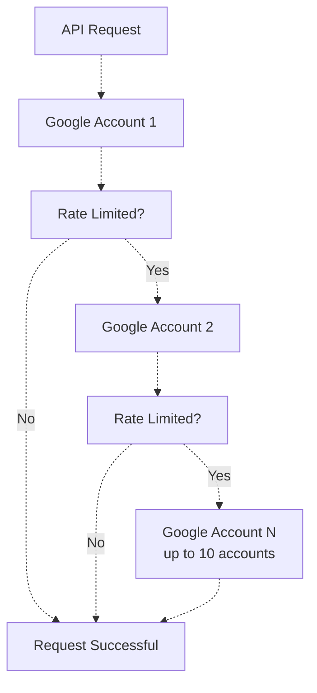
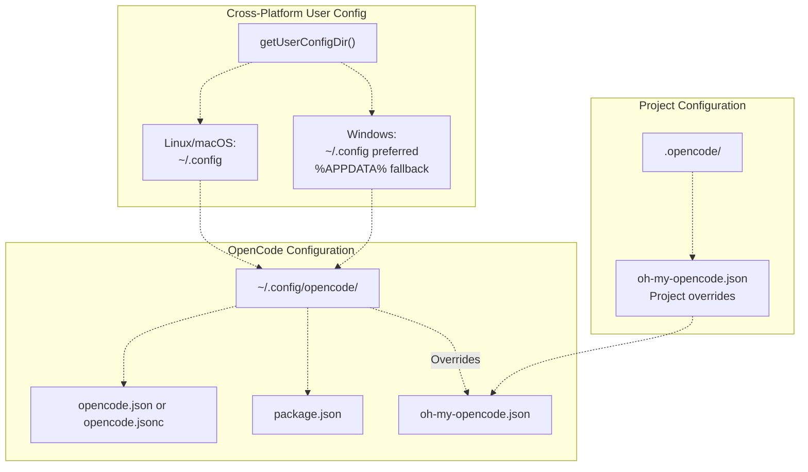

# Authentication Setup

> **Relevant source files**
> * [README.ja.md](https://github.com/code-yeongyu/oh-my-opencode/blob/b92cd6ab/README.ja.md)
> * [README.ko.md](https://github.com/code-yeongyu/oh-my-opencode/blob/b92cd6ab/README.ko.md)
> * [README.md](https://github.com/code-yeongyu/oh-my-opencode/blob/b92cd6ab/README.md)
> * [README.zh-cn.md](https://github.com/code-yeongyu/oh-my-opencode/blob/b92cd6ab/README.zh-cn.md)
> * [bun.lock](https://github.com/code-yeongyu/oh-my-opencode/blob/b92cd6ab/bun.lock)
> * [package.json](https://github.com/code-yeongyu/oh-my-opencode/blob/b92cd6ab/package.json)
> * [src/cli/config-manager.ts](https://github.com/code-yeongyu/oh-my-opencode/blob/b92cd6ab/src/cli/config-manager.ts)
> * [src/shared/config-path.ts](https://github.com/code-yeongyu/oh-my-opencode/blob/b92cd6ab/src/shared/config-path.ts)
> * [src/shared/jsonc-parser.test.ts](https://github.com/code-yeongyu/oh-my-opencode/blob/b92cd6ab/src/shared/jsonc-parser.test.ts)
> * [src/shared/jsonc-parser.ts](https://github.com/code-yeongyu/oh-my-opencode/blob/b92cd6ab/src/shared/jsonc-parser.ts)

This page covers the authentication configuration for AI providers used by oh-my-opencode. Authentication enables oh-my-opencode agents to use models from Anthropic (Claude), Google (Gemini), and OpenAI (ChatGPT) through your existing subscriptions.

For the overall installation process, see [Installation](../getting-started/Installation.md). For configuration file structure and options, see [Configuration Files](../getting-started/Configuration-Files.md).

## Purpose and Scope

Authentication setup establishes connections between oh-my-opencode and AI model providers. This involves:

* Installing provider-specific authentication plugins (for Gemini and ChatGPT)
* Running OAuth flows through the `opencode auth login` command
* Configuring model mappings in `opencode.json`
* Setting agent model overrides in `oh-my-opencode.json`

## Authentication Architecture



**Authentication Flow Overview**

The diagram shows how user actions, configuration files, authentication plugins, and provider APIs interact during authentication setup.

Sources: [README.md L283-L383](https://github.com/code-yeongyu/oh-my-opencode/blob/b92cd6ab/README.md#L283-L383)

 [src/cli/config-manager.ts L1-L248](https://github.com/code-yeongyu/oh-my-opencode/blob/b92cd6ab/src/cli/config-manager.ts#L1-L248)

## Provider Configuration Summary

| Provider | Auth Method | Plugin Required | Multi-Account | Configuration Files |
| --- | --- | --- | --- | --- |
| **Anthropic (Claude)** | Built-in OAuth | No | No | `opencode.json` |
| **Google (Gemini)** | Antigravity OAuth | `opencode-antigravity-auth@1.1.2` | Yes (up to 10) | `opencode.json`, `package.json`, `oh-my-opencode.json` |
| **OpenAI (ChatGPT)** | Codex OAuth | `opencode-openai-codex-auth@4.1.1` | No | `opencode.json`, `package.json` |

Sources: [README.md L84-L88](https://github.com/code-yeongyu/oh-my-opencode/blob/b92cd6ab/README.md#L84-L88)

 [README.md L286-L383](https://github.com/code-yeongyu/oh-my-opencode/blob/b92cd6ab/README.md#L286-L383)

## Anthropic (Claude) Authentication

### Authentication Process

Claude authentication uses OpenCode's built-in Anthropic provider. No external plugins are required.



**Claude Authentication Flow**

Sources: [README.md L286-L295](https://github.com/code-yeongyu/oh-my-opencode/blob/b92cd6ab/README.md#L286-L295)

### CLI Commands

```sql
opencode auth login
# Interactive Terminal: Provider → Select "Anthropic"
# Interactive Terminal: Login method → Select "Claude Pro/Max"
# Complete OAuth flow in browser
# Wait for completion confirmation
```

### Configuration Impact

After successful authentication, Claude models become available in `opencode.json`:

```json
{
  "providers": {
    "anthropic": {
      "models": {
        "claude-opus-4-5": {},
        "claude-sonnet-4-5": {},
        "claude-haiku-4-5": {}
      }
    }
  }
}
```

### Model Selection by Subscription Tier

The installer configures agent models based on your Claude subscription:

| Subscription | Sisyphus Model | Explore Model | Oracle Fallback |
| --- | --- | --- | --- |
| **Claude Pro (non-max20)** | `anthropic/claude-opus-4-5` | `opencode/big-pickle` | `anthropic/claude-opus-4-5` |
| **Claude Max (max20)** | `anthropic/claude-opus-4-5` | `anthropic/claude-haiku-4-5` | `anthropic/claude-opus-4-5` |
| **No subscription** | `opencode/big-pickle` | `opencode/big-pickle` | `opencode/big-pickle` |

Sources: [src/cli/config-manager.ts L138-L186](https://github.com/code-yeongyu/oh-my-opencode/blob/b92cd6ab/src/cli/config-manager.ts#L138-L186)

 [README.md L224-L231](https://github.com/code-yeongyu/oh-my-opencode/blob/b92cd6ab/README.md#L224-L231)

## Google Gemini Authentication (Antigravity)

### Plugin Installation

Gemini authentication requires the external `opencode-antigravity-auth` plugin, which provides OAuth authentication and multi-account load balancing.



**Gemini Plugin Configuration Structure**

Sources: [README.md L298-L330](https://github.com/code-yeongyu/oh-my-opencode/blob/b92cd6ab/README.md#L298-L330)

### Step 1: Add Plugin to opencode.json

Edit `~/.config/opencode/opencode.json`:

```json
{
  "plugin": [
    "oh-my-opencode",
    "opencode-antigravity-auth@1.1.2"
  ]
}
```

Sources: [README.md L300-L308](https://github.com/code-yeongyu/oh-my-opencode/blob/b92cd6ab/README.md#L300-L308)

### Step 2: Configure Provider and Models

Add complete provider configuration to `opencode.json`. Refer to the [opencode-antigravity-auth README](https://github.com/code-yeongyu/oh-my-opencode/blob/b92cd6ab/opencode-antigravity-auth README)

 for the full provider/models structure.

Available model names:

* `google/gemini-3-pro-high`
* `google/gemini-3-pro-medium`
* `google/gemini-3-pro-low`
* `google/gemini-3-flash`
* `google/gemini-3-flash-lite`
* `google/claude-sonnet-4-5`
* `google/claude-sonnet-4-5-thinking`
* `google/claude-opus-4-5-thinking`
* `google/gpt-oss-120b-medium`

Sources: [README.md L310-L330](https://github.com/code-yeongyu/oh-my-opencode/blob/b92cd6ab/README.md#L310-L330)

### Step 3: Override Agent Models

Edit `~/.config/opencode/oh-my-opencode.json` or `.opencode/oh-my-opencode.json`:

```json
{
  "google_auth": false,
  "agents": {
    "frontend-ui-ux-engineer": { "model": "google/gemini-3-pro-high" },
    "document-writer": { "model": "google/gemini-3-flash" },
    "multimodal-looker": { "model": "google/gemini-3-flash" }
  }
}
```

**Critical Configuration:** Setting `google_auth: false` disables oh-my-opencode's built-in Google auth, preventing conflicts with the Antigravity plugin.

Sources: [README.md L315-L328](https://github.com/code-yeongyu/oh-my-opencode/blob/b92cd6ab/README.md#L315-L328)

 [src/cli/config-manager.ts L143-L178](https://github.com/code-yeongyu/oh-my-opencode/blob/b92cd6ab/src/cli/config-manager.ts#L143-L178)

### Step 4: Run Authentication

```sql
opencode auth login
# Interactive Terminal: Provider → Select "Google"
# Interactive Terminal: Login method → Select "OAuth with Google (Antigravity)"
# Browser auto-detects and opens sign-in page
# Complete Google OAuth flow
# Optional: Add additional accounts for load balancing
```

### Multi-Account Load Balancing

The Antigravity plugin supports up to 10 Google accounts. When one account hits rate limits, it automatically switches to the next available account.



**Multi-Account Load Balancing Flow**

Sources: [README.md L342-L344](https://github.com/code-yeongyu/oh-my-opencode/blob/b92cd6ab/README.md#L342-L344)

### Model Assignment by Installer

The installer automatically configures Gemini models when `--gemini=yes` is specified:

```
// src/cli/config-manager.ts:153-178
if (installConfig.hasGemini) {
  agents["librarian"] = { model: "google/gemini-3-flash" }
  agents["explore"] = { model: "google/gemini-3-flash" }
  agents["frontend-ui-ux-engineer"] = { model: "google/gemini-3-pro-high" }
  agents["document-writer"] = { model: "google/gemini-3-flash" }
  agents["multimodal-looker"] = { model: "google/gemini-3-flash" }
}
```

Sources: [src/cli/config-manager.ts L153-L178](https://github.com/code-yeongyu/oh-my-opencode/blob/b92cd6ab/src/cli/config-manager.ts#L153-L178)

## OpenAI (ChatGPT) Authentication (Codex)

### Plugin Installation with Hotfix

ChatGPT authentication requires the external `opencode-openai-codex-auth` plugin. **The official npm package currently has a bug causing 400 errors.** Use the hotfix branch until the fix is released.

### Step 1: Add Plugin to opencode.json

Edit `~/.config/opencode/opencode.json`:

```json
{
  "plugin": [
    "oh-my-opencode",
    "opencode-openai-codex-auth@4.1.1"
  ]
}
```

Sources: [README.md L347-L356](https://github.com/code-yeongyu/oh-my-opencode/blob/b92cd6ab/README.md#L347-L356)

### Step 2: Apply Hotfix (Critical)

Edit `~/.config/opencode/package.json` to use the hotfix branch:

```css
{
  "dependencies": {
    "opencode-openai-codex-auth": "code-yeongyu/opencode-openai-codex-auth#fix/orphaned-function-call-output-with-tools"
  }
}
```

Then install dependencies:

```
cd ~/.config/opencode && bun i
```

**Important:** In `opencode.json`, use `"opencode-openai-codex-auth"` without the version suffix.

Sources: [README.md L358-L368](https://github.com/code-yeongyu/oh-my-opencode/blob/b92cd6ab/README.md#L358-L368)

 [src/cli/config-manager.ts L15](https://github.com/code-yeongyu/oh-my-opencode/blob/b92cd6ab/src/cli/config-manager.ts#L15-L15)

### Step 3: Configure Provider and Models

Add complete provider configuration to `opencode.json`. Refer to [`config/full-opencode.json`](https://github.com/code-yeongyu/oh-my-opencode/blob/b92cd6ab/`config/full-opencode.json`)

 in the plugin repository for the full structure.

Sources: [README.md L370-L372](https://github.com/code-yeongyu/oh-my-opencode/blob/b92cd6ab/README.md#L370-L372)

### Step 4: Run Authentication

```sql
opencode auth login
# Interactive Terminal: Provider → Select "OpenAI"
# Interactive Terminal: Login method → Select "ChatGPT Plus/Pro (Codex Subscription)"
# Complete OAuth flow in browser
# Wait for completion confirmation
```

Sources: [README.md L376-L383](https://github.com/code-yeongyu/oh-my-opencode/blob/b92cd6ab/README.md#L376-L383)

### Model Assignment by Installer

When `--chatgpt=yes` is specified, the installer keeps the default Oracle agent model as `openai/gpt-5.2`:

```yaml
// src/cli/config-manager.ts:163-167
if (!installConfig.hasChatGPT) {
  agents["oracle"] = {
    model: installConfig.hasClaude ? "anthropic/claude-opus-4-5" : "opencode/big-pickle",
  }
}
```

If ChatGPT is available, Oracle uses GPT-5.2 by default (not overridden).

Sources: [src/cli/config-manager.ts L163-L167](https://github.com/code-yeongyu/oh-my-opencode/blob/b92cd6ab/src/cli/config-manager.ts#L163-L167)

## Configuration File Locations



**Configuration File Hierarchy**

Sources: [src/shared/config-path.ts L1-L48](https://github.com/code-yeongyu/oh-my-opencode/blob/b92cd6ab/src/shared/config-path.ts#L1-L48)

 [src/cli/config-manager.ts L7-L11](https://github.com/code-yeongyu/oh-my-opencode/blob/b92cd6ab/src/cli/config-manager.ts#L7-L11)

### User-Level Configuration

| File | Purpose | Format |
| --- | --- | --- |
| `opencode.json` or `opencode.jsonc` | Plugin registration, provider configuration | JSON/JSONC |
| `package.json` | Auth plugin dependencies | JSON |
| `oh-my-opencode.json` | Agent model overrides, feature toggles | JSON/JSONC |

**File Paths:**

* **Linux/macOS:** `~/.config/opencode/`
* **Windows:** `~/.config/opencode/` (preferred) or `%APPDATA%\opencode\` (fallback)

### Project-Level Configuration

| File | Purpose | Format |
| --- | --- | --- |
| `.opencode/oh-my-opencode.json` | Project-specific agent overrides | JSON/JSONC |

Project configuration takes precedence over user configuration when both exist.

Sources: [src/shared/config-path.ts L13-L47](https://github.com/code-yeongyu/oh-my-opencode/blob/b92cd6ab/src/shared/config-path.ts#L13-L47)

### Configuration Detection Logic

The system detects configuration files with the following precedence:

```javascript
// src/shared/config-path.ts:13-33
export function getUserConfigDir(): string {
  if (process.platform === "win32") {
    const crossPlatformDir = path.join(os.homedir(), ".config")
    const crossPlatformConfigPath = path.join(crossPlatformDir, "opencode", "oh-my-opencode.json")
    
    const appdataDir = process.env.APPDATA || path.join(os.homedir(), "AppData", "Roaming")
    const appdataConfigPath = path.join(appdataDir, "opencode", "oh-my-opencode.json")
    
    // Prefer cross-platform path, fallback to APPDATA for backward compatibility
    if (fs.existsSync(crossPlatformConfigPath)) return crossPlatformDir
    if (fs.existsSync(appdataConfigPath)) return appdataDir
    return crossPlatformDir
  }
  
  return process.env.XDG_CONFIG_HOME || path.join(os.homedir(), ".config")
}
```

For `opencode.json`, the system prefers `.jsonc` over `.json`:

```javascript
// src/cli/config-manager.ts:35-43
export function detectConfigFormat(): { format: ConfigFormat; path: string } {
  if (existsSync(OPENCODE_JSONC)) {
    return { format: "jsonc", path: OPENCODE_JSONC }
  }
  if (existsSync(OPENCODE_JSON)) {
    return { format: "json", path: OPENCODE_JSON }
  }
  return { format: "none", path: OPENCODE_JSON }
}
```

Sources: [src/shared/config-path.ts L13-L33](https://github.com/code-yeongyu/oh-my-opencode/blob/b92cd6ab/src/shared/config-path.ts#L13-L33)

 [src/cli/config-manager.ts L28-L43](https://github.com/code-yeongyu/oh-my-opencode/blob/b92cd6ab/src/cli/config-manager.ts#L28-L43)

## Automated Configuration via CLI Installer

The `bunx oh-my-opencode install` command automates authentication setup based on subscription flags.

### CLI Flags

```
bunx oh-my-opencode install --no-tui --claude=<yes|no|max20> --chatgpt=<yes|no> --gemini=<yes|no>
```

| Flag | Values | Effect |
| --- | --- | --- |
| `--claude` | `yes`, `no`, `max20` | Configures Claude models; `max20` enables Haiku for explore agent |
| `--chatgpt` | `yes`, `no` | Keeps Oracle on GPT-5.2 if yes |
| `--gemini` | `yes`, `no` | Adds Gemini models, sets `google_auth: false` |

### Configuration Generation

The installer generates `oh-my-opencode.json` based on subscription flags:

```javascript
// src/cli/config-manager.ts:138-185
export function generateOmoConfig(installConfig: InstallConfig): Record<string, unknown> {
  const config: Record<string, unknown> = {
    $schema: "https://raw.githubusercontent.com/code-yeongyu/oh-my-opencode/master/assets/oh-my-opencode.schema.json",
  }

  if (installConfig.hasGemini) {
    config.google_auth = false
  }

  const agents: Record<string, Record<string, unknown>> = {}

  // Sisyphus model selection
  if (!installConfig.hasClaude) {
    agents["Sisyphus"] = { model: "opencode/big-pickle" }
  }

  // Librarian and Explore models
  if (installConfig.hasGemini) {
    agents["librarian"] = { model: "google/gemini-3-flash" }
    agents["explore"] = { model: "google/gemini-3-flash" }
  } else if (installConfig.hasClaude && installConfig.isMax20) {
    agents["explore"] = { model: "anthropic/claude-haiku-4-5" }
  } else {
    agents["librarian"] = { model: "opencode/big-pickle" }
    agents["explore"] = { model: "opencode/big-pickle" }
  }

  // Oracle model (defaults to gpt-5.2 if ChatGPT available)
  if (!installConfig.hasChatGPT) {
    agents["oracle"] = {
      model: installConfig.hasClaude ? "anthropic/claude-opus-4-5" : "opencode/big-pickle",
    }
  }

  // Frontend and utility agents
  if (installConfig.hasGemini) {
    agents["frontend-ui-ux-engineer"] = { model: "google/gemini-3-pro-high" }
    agents["document-writer"] = { model: "google/gemini-3-flash" }
    agents["multimodal-looker"] = { model: "google/gemini-3-flash" }
  } else {
    const fallbackModel = installConfig.hasClaude ? "anthropic/claude-opus-4-5" : "opencode/big-pickle"
    agents["frontend-ui-ux-engineer"] = { model: fallbackModel }
    agents["document-writer"] = { model: fallbackModel }
    agents["multimodal-looker"] = { model: fallbackModel }
  }

  if (Object.keys(agents).length > 0) {
    config.agents = agents
  }

  return config
}
```

Sources: [src/cli/config-manager.ts L138-L185](https://github.com/code-yeongyu/oh-my-opencode/blob/b92cd6ab/src/cli/config-manager.ts#L138-L185)

## Authentication Verification

After completing authentication setup, verify the configuration:

### Check OpenCode Version

```markdown
opencode --version  # Should be 1.0.150 or higher
```

### Verify Plugin Registration

```markdown
cat ~/.config/opencode/opencode.json
# Should contain "oh-my-opencode" in plugin array
```

### Verify Agent Models

```markdown
cat ~/.config/opencode/oh-my-opencode.json
# Check agent model assignments match your subscriptions
```

Sources: [README.md L276-L279](https://github.com/code-yeongyu/oh-my-opencode/blob/b92cd6ab/README.md#L276-L279)

## Common Authentication Issues

### Issue: "No tool call found for function call output with call_id" (ChatGPT)

**Cause:** Official npm package bug in `opencode-openai-codex-auth@4.1.1`

**Solution:** Use the hotfix branch as described in [OpenAI (ChatGPT) Authentication](https://github.com/code-yeongyu/oh-my-opencode/blob/b92cd6ab/OpenAI (ChatGPT) Authentication)

Sources: [README.md L358-L368](https://github.com/code-yeongyu/oh-my-opencode/blob/b92cd6ab/README.md#L358-L368)

### Issue: Google Auth Conflicts

**Cause:** Both built-in `google_auth` and Antigravity plugin enabled simultaneously

**Solution:** Set `google_auth: false` in `oh-my-opencode.json`

```json
{
  "google_auth": false
}
```

Sources: [README.md L317-L328](https://github.com/code-yeongyu/oh-my-opencode/blob/b92cd6ab/README.md#L317-L328)

### Issue: Wrong Model Names with Antigravity

**Cause:** Antigravity plugin uses different model naming convention (e.g., `google/gemini-3-pro-high` vs built-in names)

**Solution:** Use Antigravity model names in agent overrides as documented in [Step 3](https://github.com/code-yeongyu/oh-my-opencode/blob/b92cd6ab/Step 3#LNaN-LNaN)

Sources: [README.md L315-L330](https://github.com/code-yeongyu/oh-my-opencode/blob/b92cd6ab/README.md#L315-L330)

### Issue: Authentication Flow Not Starting

**Cause:** tmux or interactive terminal not available

**Solution:** Ensure `opencode auth login` is run in an interactive terminal (tmux recommended for LLM agents performing installation)

Sources: [README.md L244-L258](https://github.com/code-yeongyu/oh-my-opencode/blob/b92cd6ab/README.md#L244-L258)