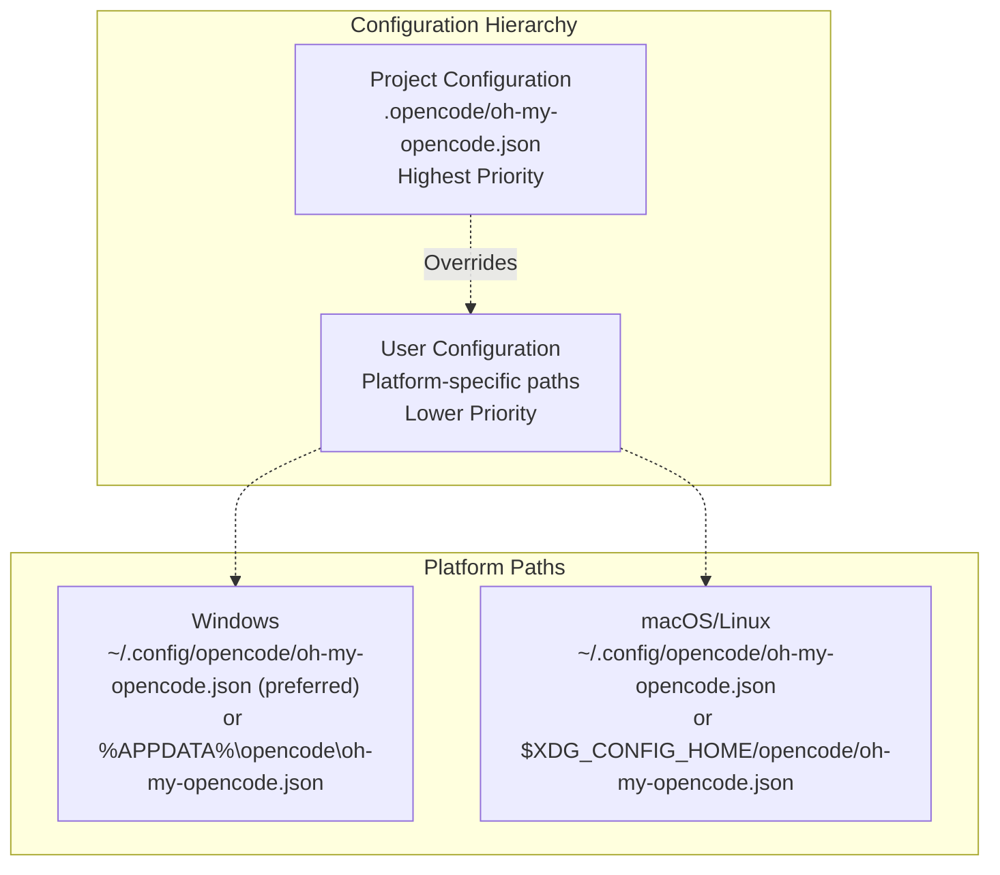

# Configuration Files

> **Relevant source files**
> * [README.ja.md](https://github.com/code-yeongyu/oh-my-opencode/blob/b92cd6ab/README.ja.md)
> * [README.ko.md](https://github.com/code-yeongyu/oh-my-opencode/blob/b92cd6ab/README.ko.md)
> * [README.md](https://github.com/code-yeongyu/oh-my-opencode/blob/b92cd6ab/README.md)
> * [README.zh-cn.md](https://github.com/code-yeongyu/oh-my-opencode/blob/b92cd6ab/README.zh-cn.md)
> * [assets/oh-my-opencode.schema.json](https://github.com/code-yeongyu/oh-my-opencode/blob/b92cd6ab/assets/oh-my-opencode.schema.json)
> * [bun.lock](https://github.com/code-yeongyu/oh-my-opencode/blob/b92cd6ab/bun.lock)
> * [package.json](https://github.com/code-yeongyu/oh-my-opencode/blob/b92cd6ab/package.json)
> * [src/cli/config-manager.ts](https://github.com/code-yeongyu/oh-my-opencode/blob/b92cd6ab/src/cli/config-manager.ts)
> * [src/config/schema.ts](https://github.com/code-yeongyu/oh-my-opencode/blob/b92cd6ab/src/config/schema.ts)
> * [src/hooks/index.ts](https://github.com/code-yeongyu/oh-my-opencode/blob/b92cd6ab/src/hooks/index.ts)
> * [src/index.ts](https://github.com/code-yeongyu/oh-my-opencode/blob/b92cd6ab/src/index.ts)
> * [src/shared/config-path.ts](https://github.com/code-yeongyu/oh-my-opencode/blob/b92cd6ab/src/shared/config-path.ts)
> * [src/shared/jsonc-parser.test.ts](https://github.com/code-yeongyu/oh-my-opencode/blob/b92cd6ab/src/shared/jsonc-parser.test.ts)
> * [src/shared/jsonc-parser.ts](https://github.com/code-yeongyu/oh-my-opencode/blob/b92cd6ab/src/shared/jsonc-parser.ts)

Configuration files control oh-my-opencode behavior including agent settings, hook toggles, MCP servers, and Claude Code compatibility. This page explains where configuration files are located, basic structure, and how to use them.

For detailed configuration loading and merging logic, see [Configuration System](/code-yeongyu/oh-my-opencode/3.2-configuration-system). For specific agent configuration options, see [Agent Configuration](#4.4).

## File Locations

oh-my-opencode uses a two-tier configuration system: user-level and project-level. Project settings override user settings.



**Configuration File Hierarchy**

| Level | Path | Platform | Priority |
| --- | --- | --- | --- |
| Project | `.opencode/oh-my-opencode.json` | All | 1 (highest) |
| User | `~/.config/opencode/oh-my-opencode.json` | Windows (preferred), macOS, Linux | 2 |
| User | `%APPDATA%\opencode\oh-my-opencode.json` | Windows (fallback) | 2 |

The user configuration path follows XDG Base Directory Specification on Unix systems. On Windows, `~/.config/opencode/` is preferred for cross-platform consistency, with `%APPDATA%\opencode\` as fallback for backward compatibility.

Sources: [src/shared/config-path.ts L1-L48](https://github.com/code-yeongyu/oh-my-opencode/blob/b92cd6ab/src/shared/config-path.ts#L1-L48)

 [README.md L707-L715](https://github.com/code-yeongyu/oh-my-opencode/blob/b92cd6ab/README.md#L707-L715)

## Basic Structure

Configuration files are JSON with optional schema reference for IDE autocomplete:

```json
{
  "$schema": "https://raw.githubusercontent.com/code-yeongyu/oh-my-opencode/master/assets/oh-my-opencode.schema.json",
  "agents": {
    "explore": {
      "model": "anthropic/claude-haiku-4-5"
    }
  },
  "disabled_hooks": ["comment-checker"],
  "disabled_mcps": ["websearch_exa"]
}
```

Project configuration overrides user configuration. For nested objects like `agents`, project settings merge with user settings rather than replacing entirely. This allows partial overrides - for example, changing only `agents.explore.model` without affecting other `explore` settings.

For detailed merging behavior, see [Configuration System](/code-yeongyu/oh-my-opencode/3.2-configuration-system).

Sources: [README.md L718-L722](https://github.com/code-yeongyu/oh-my-opencode/blob/b92cd6ab/README.md#L718-L722)

 [assets/oh-my-opencode.schema.json L1-L10](https://github.com/code-yeongyu/oh-my-opencode/blob/b92cd6ab/assets/oh-my-opencode.schema.json#L1-L10)

## Configuration Reference

### Top-Level Fields

| Field | Type | Schema | Description |
| --- | --- | --- | --- |
| `$schema` | string | optional | URL for JSON Schema validation |
| `disabled_mcps` | string[] | `McpNameSchema[]` | MCP servers to disable |
| `disabled_agents` | string[] | `BuiltinAgentNameSchema[]` | Built-in agents to disable |
| `disabled_hooks` | string[] | `HookNameSchema[]` | Hooks to disable |
| `agents` | object | `AgentOverridesSchema` | Agent configuration overrides |
| `claude_code` | object | `ClaudeCodeConfigSchema` | Claude Code compatibility toggles |
| `google_auth` | boolean | optional | Enable Google Antigravity OAuth |
| `omo_agent` | object | `OmoAgentConfigSchema` | OmO agent enablement |

Sources: [src/config/schema.ts L108-L117](https://github.com/code-yeongyu/oh-my-opencode/blob/b92cd6ab/src/config/schema.ts#L108-L117)

 [assets/oh-my-opencode.schema.json L1-L1211](https://github.com/code-yeongyu/oh-my-opencode/blob/b92cd6ab/assets/oh-my-opencode.schema.json#L1-L1211)

### Agent Configuration

Each agent can be configured with the following options:

| Field | Type | Description | Example |
| --- | --- | --- | --- |
| `model` | string | Model identifier | `"anthropic/claude-opus-4-5"` |
| `temperature` | number (0.0-2.0) | Sampling temperature | `0.7` |
| `top_p` | number (0.0-1.0) | Nucleus sampling | `0.95` |
| `prompt` | string | System prompt override | Custom instructions |
| `tools` | object | Tool access control | `{"bash": false}` |
| `disable` | boolean | Disable agent | `true` |
| `description` | string | Agent description | Custom description |
| `mode` | string | Invocation mode | `"subagent"`, `"primary"`, `"all"` |
| `color` | string | UI color (hex) | `"#FF6B35"` |
| `permission` | object | Permissions | See below |

Permission options:

| Permission | Values | Description |
| --- | --- | --- |
| `edit` | `ask`, `allow`, `deny` | File editing permission |
| `bash` | `ask`, `allow`, `deny`, or object | Bash execution (can be per-command) |
| `webfetch` | `ask`, `allow`, `deny` | Web request permission |
| `doom_loop` | `ask`, `allow`, `deny` | Infinite loop override |
| `external_directory` | `ask`, `allow`, `deny` | Access outside project root |

**Example:**

```json
{
  "agents": {
    "explore": {
      "model": "anthropic/claude-haiku-4-5",
      "temperature": 0.5,
      "permission": {
        "edit": "deny",
        "bash": "ask"
      }
    }
  }
}
```

Available agents: `Sisyphus`, `Planner-Sisyphus`, `build`, `plan`, `oracle`, `librarian`, `explore`, `frontend-ui-ux-engineer`, `document-writer`, `multimodal-looker`

Agent names are case-insensitive (e.g., `"omo"`, `"OmO"`, `"OMO"` all work).

Sources: [README.md L751-L796](https://github.com/code-yeongyu/oh-my-opencode/blob/b92cd6ab/README.md#L751-L796)

 [assets/oh-my-opencode.schema.json L66-L400](https://github.com/code-yeongyu/oh-my-opencode/blob/b92cd6ab/assets/oh-my-opencode.schema.json#L66-L400)

### Claude Code Compatibility

The `claude_code` object controls Claude Code compatibility features. All features are enabled by default.

| Field | Default | Disables Loading From |
| --- | --- | --- |
| `mcp` | `true` | `~/.claude/.mcp.json`, `./.mcp.json`, `./.claude/.mcp.json` |
| `commands` | `true` | `~/.claude/commands/*.md`, `./.claude/commands/*.md` |
| `skills` | `true` | `~/.claude/skills/*/SKILL.md` |
| `agents` | `true` | `~/.claude/agents/*.md` |
| `hooks` | `true` | `~/.claude/settings.json`, `./.claude/settings.local.json` |

Built-in features (built-in agents, built-in MCPs, OpenCode commands) are unaffected by these toggles.

**Example:**

```json
{
  "claude_code": {
    "mcp": false,
    "commands": false
  }
}
```

For full compatibility details, see [Claude Code Compatibility](/code-yeongyu/oh-my-opencode/9-claude-code-compatibility).

Sources: [README.md L656-L677](https://github.com/code-yeongyu/oh-my-opencode/blob/b92cd6ab/README.md#L656-L677)

### Sisyphus Agent

The `sisyphus_agent` object controls whether Sisyphus orchestrator replaces default agents:

| Field | Type | Default | Effect |
| --- | --- | --- | --- |
| `disabled` | boolean | `false` | When `true`, restores `build`/`plan` as primary agents |

When disabled, the original OpenCode `build` and `plan` agents remain primary. When enabled (default), Sisyphus and Planner-Sisyphus become primary agents, with `build` and `plan` demoted to subagents.

**Example:**

```json
{
  "sisyphus_agent": {
    "disabled": true
  }
}
```

Sources: [README.md L809-L845](https://github.com/code-yeongyu/oh-my-opencode/blob/b92cd6ab/README.md#L809-L845)

### Other Configuration Options

**Disabling Features:**

```json
{
  "disabled_agents": ["oracle", "frontend-ui-ux-engineer"],
  "disabled_mcps": ["websearch_exa", "context7"],
  "disabled_hooks": ["comment-checker", "agent-usage-reminder"]
}
```

Available MCPs: `websearch_exa`, `context7`, `grep_app`

Available hooks: `todo-continuation-enforcer`, `context-window-monitor`, `session-recovery`, `session-notification`, `comment-checker`, `grep-output-truncator`, `tool-output-truncator`, `directory-agents-injector`, `directory-readme-injector`, `empty-task-response-detector`, `think-mode`, `anthropic-auto-compact`, `rules-injector`, `background-notification`, `auto-update-checker`, `startup-toast`, `keyword-detector`, `agent-usage-reminder`, `non-interactive-env`, `interactive-bash-session`, `empty-message-sanitizer`

**Google Authentication:**

```json
{
  "google_auth": true
}
```

When using external plugins like `opencode-antigravity-auth`, disable built-in auth:

```json
{
  "google_auth": false,
  "agents": {
    "frontend-ui-ux-engineer": { "model": "google/gemini-3-pro-high" }
  }
}
```

**Experimental Features:**

```json
{
  "experimental": {
    "aggressive_truncation": true,
    "auto_resume": true
  }
}
```

Sources: [README.md L798-L808](https://github.com/code-yeongyu/oh-my-opencode/blob/b92cd6ab/README.md#L798-L808)

 [README.md L847-L855](https://github.com/code-yeongyu/oh-my-opencode/blob/b92cd6ab/README.md#L847-L855)

## JSON Schema Support

The plugin provides a JSON Schema file for IDE autocomplete support at `assets/oh-my-opencode.schema.json`. Users can reference it with:

```json
{
  "$schema": "https://raw.githubusercontent.com/code-yeongyu/oh-my-opencode/master/assets/oh-my-opencode.schema.json"
}
```

The JSON Schema mirrors the Zod schema structure defined in [src/config/schema.ts L108-L117](https://github.com/code-yeongyu/oh-my-opencode/blob/b92cd6ab/src/config/schema.ts#L108-L117)

 and provides validation, autocomplete, and documentation in IDEs that support JSON Schema.

Sources: [assets/oh-my-opencode.schema.json L1-L1211](https://github.com/code-yeongyu/oh-my-opencode/blob/b92cd6ab/assets/oh-my-opencode.schema.json#L1-L1211)

 [README.md L485-L491](https://github.com/code-yeongyu/oh-my-opencode/blob/b92cd6ab/README.md#L485-L491)