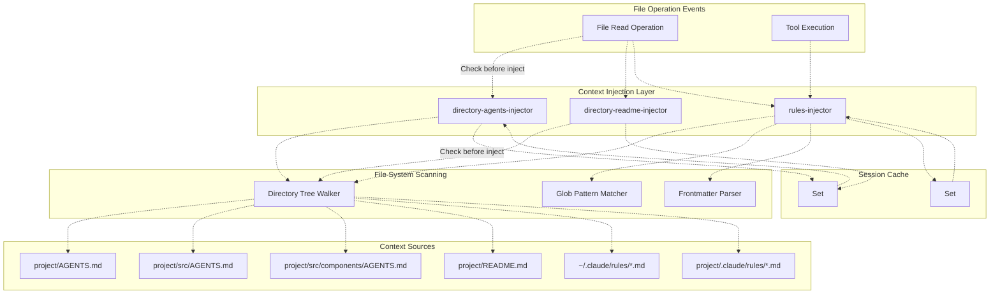
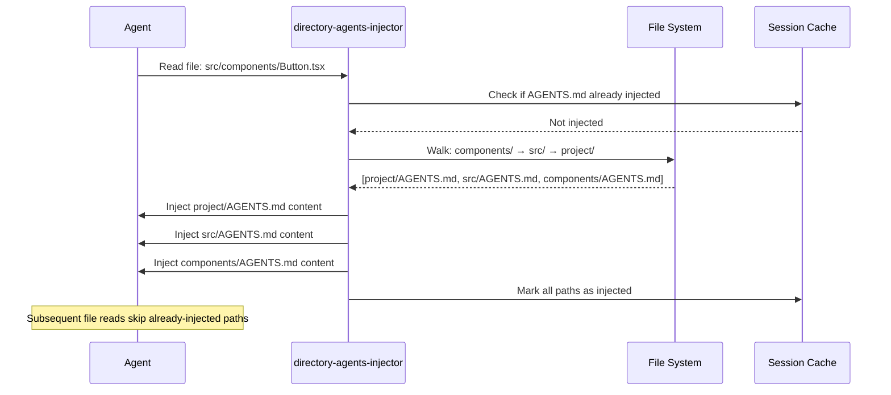
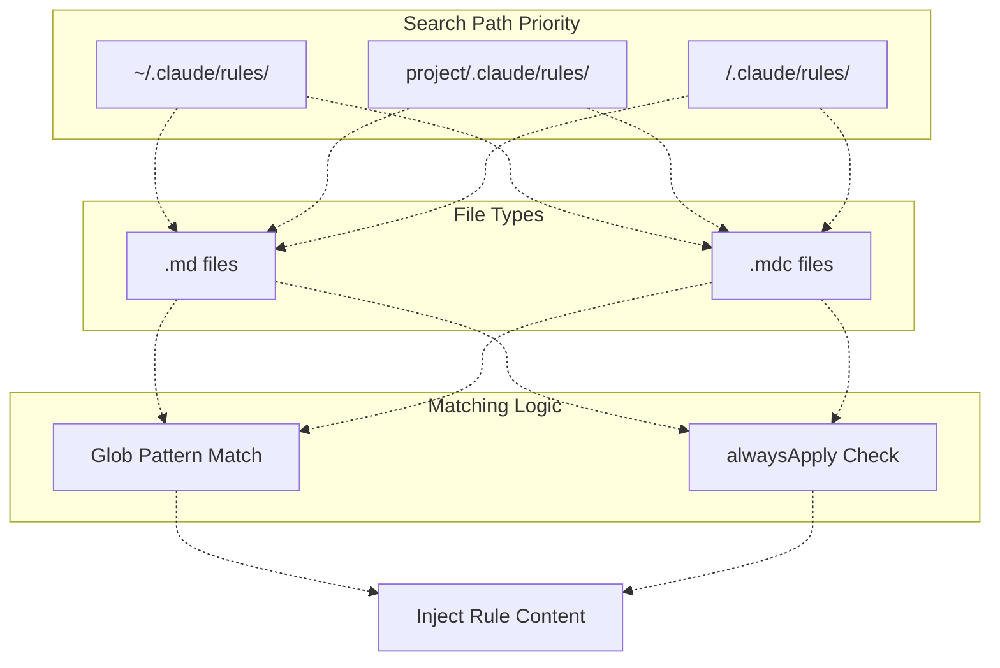

# Context Injection Hooks

> **Relevant source files**
> * [README.ja.md](https://github.com/code-yeongyu/oh-my-opencode/blob/b92cd6ab/README.ja.md)
> * [README.ko.md](https://github.com/code-yeongyu/oh-my-opencode/blob/b92cd6ab/README.ko.md)
> * [README.md](https://github.com/code-yeongyu/oh-my-opencode/blob/b92cd6ab/README.md)
> * [README.zh-cn.md](https://github.com/code-yeongyu/oh-my-opencode/blob/b92cd6ab/README.zh-cn.md)
> * [assets/oh-my-opencode.schema.json](https://github.com/code-yeongyu/oh-my-opencode/blob/b92cd6ab/assets/oh-my-opencode.schema.json)
> * [src/config/schema.ts](https://github.com/code-yeongyu/oh-my-opencode/blob/b92cd6ab/src/config/schema.ts)
> * [src/hooks/index.ts](https://github.com/code-yeongyu/oh-my-opencode/blob/b92cd6ab/src/hooks/index.ts)
> * [src/index.ts](https://github.com/code-yeongyu/oh-my-opencode/blob/b92cd6ab/src/index.ts)
> * [src/shared/config-path.ts](https://github.com/code-yeongyu/oh-my-opencode/blob/b92cd6ab/src/shared/config-path.ts)

This document describes the context injection hooks that automatically enrich agent context with project-specific information. These hooks inject relevant documentation and rules when agents interact with files, eliminating the need for manual context management.

For information about context window management and token limits, see [7.4 Context Management Hooks](/code-yeongyu/oh-my-opencode/7.4-context-management-hooks). For general hook configuration, see [7.7 Other Hooks](/code-yeongyu/oh-my-opencode/7.7-other-hooks).

---

## Purpose and Scope

Context injection hooks provide automatic, intelligent context enrichment by:

* Walking directory trees to collect hierarchical `AGENTS.md` files
* Injecting project documentation from `README.md` files
* Loading conditional coding rules based on file patterns
* Caching injected context to avoid redundant operations within a session

These hooks operate transparently during file read operations and tool executions, ensuring agents always have relevant contextual information without cluttering the conversation history.

**Sources:** [README.md L538-L568](https://github.com/code-yeongyu/oh-my-opencode/blob/b92cd6ab/README.md#L538-L568)

 [src/index.ts L254-L281](https://github.com/code-yeongyu/oh-my-opencode/blob/b92cd6ab/src/index.ts#L254-L281)

---

## System Architecture



**Diagram: Context Injection System Architecture**

The system operates in three phases:

1. **Event Detection**: File read operations and tool executions trigger injection hooks
2. **Context Discovery**: Directory tree walking finds relevant files, glob matching filters rules
3. **Session Caching**: Injected contexts are tracked to ensure once-per-session injection

**Sources:** [src/index.ts L254-L281](https://github.com/code-yeongyu/oh-my-opencode/blob/b92cd6ab/src/index.ts#L254-L281)

 [src/index.ts L558-L567](https://github.com/code-yeongyu/oh-my-opencode/blob/b92cd6ab/src/index.ts#L558-L567)

 [README.md L538-L568](https://github.com/code-yeongyu/oh-my-opencode/blob/b92cd6ab/README.md#L538-L568)

---

## Directory AGENTS.md Injector

### Overview

The `directory-agents-injector` hook automatically injects hierarchical project context by walking the directory tree from a target file up to the project root, collecting all `AGENTS.md` files encountered along the path.

### Directory Tree Walking Strategy

When a file is accessed, the injector:

1. Starts at the file's parent directory
2. Walks upward toward the project root
3. Collects all `AGENTS.md` files in each directory
4. Stops at the project root (workspace directory)
5. Injects files in root-to-leaf order (project-wide → specific)

**Example hierarchy:**

```markdown
project/
├── AGENTS.md              # Injected first (project-wide)
├── src/
│   ├── AGENTS.md          # Injected second (src-specific)
│   └── components/
│       ├── AGENTS.md      # Injected third (component-specific)
│       └── Button.tsx     # Target file
```

When an agent reads `Button.tsx`, all three `AGENTS.md` files are injected in the order shown.

**Sources:** [README.md L538-L549](https://github.com/code-yeongyu/oh-my-opencode/blob/b92cd6ab/README.md#L538-L549)

### Injection Order and Content Structure



**Diagram: AGENTS.md Injection Sequence**

**Sources:** [README.md L538-L549](https://github.com/code-yeongyu/oh-my-opencode/blob/b92cd6ab/README.md#L538-L549)

### Session-Level Caching

Each directory's `AGENTS.md` is injected **once per session**. The hook maintains a `Set<string>` of injected file paths to prevent redundant injections when multiple files from the same directory are accessed.

**Caching Behavior:**

| First File Read | Second File Read (Same Directory) | Injection Result |
| --- | --- | --- |
| `src/utils/helper.ts` | `src/utils/formatter.ts` | `src/AGENTS.md` injected only once |
| `src/components/Button.tsx` | `src/hooks/useData.ts` | `src/AGENTS.md` already cached, skipped |

**Sources:** [README.md L538-L549](https://github.com/code-yeongyu/oh-my-opencode/blob/b92cd6ab/README.md#L538-L549)

### Hook Configuration

The hook is enabled by default and can be disabled via configuration:

```json
{
  "disabled_hooks": ["directory-agents-injector"]
}
```

**Configuration reference:** [src/config/schema.ts L53](https://github.com/code-yeongyu/oh-my-opencode/blob/b92cd6ab/src/config/schema.ts#L53-L53)

 [src/index.ts L254-L256](https://github.com/code-yeongyu/oh-my-opencode/blob/b92cd6ab/src/index.ts#L254-L256)

**Sources:** [src/index.ts L254-L256](https://github.com/code-yeongyu/oh-my-opencode/blob/b92cd6ab/src/index.ts#L254-L256)

 [src/config/schema.ts L45-L68](https://github.com/code-yeongyu/oh-my-opencode/blob/b92cd6ab/src/config/schema.ts#L45-L68)

---

## Directory README.md Injector

### Overview

The `directory-readme-injector` hook operates identically to the AGENTS.md injector but targets `README.md` files. It provides project and module-level documentation context to agents.

### Behavior and Hierarchy

The injection follows the same directory tree walking pattern:

```markdown
project/
├── README.md              # Project documentation
├── src/
│   ├── README.md          # Source code documentation
│   └── api/
│       ├── README.md      # API module documentation
│       └── handler.ts     # Target file
```

When `handler.ts` is accessed, all three `README.md` files are injected in root-to-leaf order.

**Sources:** [README.md L538-L549](https://github.com/code-yeongyu/oh-my-opencode/blob/b92cd6ab/README.md#L538-L549)

### Typical Use Cases

| README.md Location | Content Purpose |
| --- | --- |
| Project root | Project overview, setup instructions, architecture summary |
| Module directories | Module-specific documentation, API contracts, examples |
| Feature directories | Feature descriptions, implementation notes, dependencies |

**Sources:** [README.md L538-L549](https://github.com/code-yeongyu/oh-my-opencode/blob/b92cd6ab/README.md#L538-L549)

### Hook Configuration

```json
{
  "disabled_hooks": ["directory-readme-injector"]
}
```

**Configuration reference:** [src/config/schema.ts L54](https://github.com/code-yeongyu/oh-my-opencode/blob/b92cd6ab/src/config/schema.ts#L54-L54)

 [src/index.ts L257-L259](https://github.com/code-yeongyu/oh-my-opencode/blob/b92cd6ab/src/index.ts#L257-L259)

**Sources:** [src/index.ts L257-L259](https://github.com/code-yeongyu/oh-my-opencode/blob/b92cd6ab/src/index.ts#L257-L259)

 [src/config/schema.ts L45-L68](https://github.com/code-yeongyu/oh-my-opencode/blob/b92cd6ab/src/config/schema.ts#L45-L68)

---

## Conditional Rules Injector

### Overview

The `rules-injector` hook loads context-aware coding rules from markdown files when their glob patterns match the current file operation. This enables automatic injection of language-specific, directory-specific, or file-type-specific guidelines.

### Rule File Format

Rules are defined in markdown files with YAML frontmatter:

```typescript
---
globs: ["*.ts", "src/**/*.js"]
description: "TypeScript/JavaScript coding rules"
---
- Use PascalCase for interface names
- Use camelCase for function names
- Prefer const over let
```

**Frontmatter fields:**

| Field | Type | Purpose |
| --- | --- | --- |
| `globs` | `string[]` | Glob patterns to match against file paths |
| `description` | `string` | Human-readable rule description |
| `alwaysApply` | `boolean` | If `true`, inject regardless of file path |

**Sources:** [README.md L550-L564](https://github.com/code-yeongyu/oh-my-opencode/blob/b92cd6ab/README.md#L550-L564)

### Search Paths and Priority

The injector searches for rules in multiple locations:



**Diagram: Rules Discovery and Matching Flow**

**Directory walking strategy:**

1. Start at file's directory
2. Walk upward to project root (checking `.claude/rules/` in each directory)
3. Include user-level rules from `~/.claude/rules/`
4. Match each rule file against current file path
5. Inject matched rules (once per session)

**Sources:** [README.md L550-L564](https://github.com/code-yeongyu/oh-my-opencode/blob/b92cd6ab/README.md#L550-L564)

### Glob Pattern Examples

| Glob Pattern | Matches | Use Case |
| --- | --- | --- |
| `*.ts` | All TypeScript files | TypeScript-specific rules |
| `src/**/*.test.ts` | Test files in src/ | Testing conventions |
| `**/*.tsx` | React components | React/JSX guidelines |
| `api/**/*` | API directory files | API design rules |

**Sources:** [README.md L550-L564](https://github.com/code-yeongyu/oh-my-opencode/blob/b92cd6ab/README.md#L550-L564)

### alwaysApply Flag

Rules with `alwaysApply: true` are injected for every file operation, regardless of path:

```yaml
---
alwaysApply: true
description: "Universal coding standards"
---
- Write clear commit messages
- Keep functions under 50 lines
- Document public APIs
```

This is useful for project-wide conventions that apply universally.

**Sources:** [README.md L550-L564](https://github.com/code-yeongyu/oh-my-opencode/blob/b92cd6ab/README.md#L550-L564)

### Session Caching

Like other context injectors, the rules injector maintains a `Set<string>` of injected rule files to prevent duplicate injections within a session.

**Sources:** [README.md L550-L564](https://github.com/code-yeongyu/oh-my-opencode/blob/b92cd6ab/README.md#L550-L564)

### Hook Configuration

```json
{
  "disabled_hooks": ["rules-injector"]
}
```

**Configuration reference:** [src/config/schema.ts L58](https://github.com/code-yeongyu/oh-my-opencode/blob/b92cd6ab/src/config/schema.ts#L58-L58)

 [src/index.ts L278-L280](https://github.com/code-yeongyu/oh-my-opencode/blob/b92cd6ab/src/index.ts#L278-L280)

**Sources:** [src/index.ts L278-L280](https://github.com/code-yeongyu/oh-my-opencode/blob/b92cd6ab/src/index.ts#L278-L280)

 [src/config/schema.ts L45-L68](https://github.com/code-yeongyu/oh-my-opencode/blob/b92cd6ab/src/config/schema.ts#L45-L68)

---

## Implementation Details

### Hook Registration

All three context injection hooks are registered in the plugin initialization phase:

```javascript
// src/index.ts:254-280
const directoryAgentsInjector = isHookEnabled("directory-agents-injector")
  ? createDirectoryAgentsInjectorHook(ctx)
  : null;
const directoryReadmeInjector = isHookEnabled("directory-readme-injector")
  ? createDirectoryReadmeInjectorHook(ctx)
  : null;
const rulesInjector = isHookEnabled("rules-injector")
  ? createRulesInjectorHook(ctx)
  : null;
```

**Sources:** [src/index.ts L254-L280](https://github.com/code-yeongyu/oh-my-opencode/blob/b92cd6ab/src/index.ts#L254-L280)

### Event Handler Integration

The hooks respond to session events through the plugin's event handler:

```javascript
// src/index.ts:558-567
event: async (input) => {
  // ... other hooks
  await directoryAgentsInjector?.event(input);
  await directoryReadmeInjector?.event(input);
  await rulesInjector?.event(input);
  // ... more hooks
}
```

This ensures context injection occurs automatically during file operations without explicit agent requests.

**Sources:** [src/index.ts L558-L567](https://github.com/code-yeongyu/oh-my-opencode/blob/b92cd6ab/src/index.ts#L558-L567)

### Configuration Schema

Hook names are defined in the configuration schema:

```javascript
// src/config/schema.ts:45-68
export const HookNameSchema = z.enum([
  // ...
  "directory-agents-injector",
  "directory-readme-injector",
  // ...
  "rules-injector",
  // ...
])
```

**Sources:** [src/config/schema.ts L45-L68](https://github.com/code-yeongyu/oh-my-opencode/blob/b92cd6ab/src/config/schema.ts#L45-L68)

### Hook Factory Functions

Each hook is created by a factory function that accepts the plugin context:

| Function | Returns | Purpose |
| --- | --- | --- |
| `createDirectoryAgentsInjectorHook(ctx)` | Hook instance | AGENTS.md injection logic |
| `createDirectoryReadmeInjectorHook(ctx)` | Hook instance | README.md injection logic |
| `createRulesInjectorHook(ctx)` | Hook instance | Conditional rules injection logic |

**Sources:** [src/hooks/index.ts L7-L8](https://github.com/code-yeongyu/oh-my-opencode/blob/b92cd6ab/src/hooks/index.ts#L7-L8)

 [src/hooks/index.ts L15](https://github.com/code-yeongyu/oh-my-opencode/blob/b92cd6ab/src/hooks/index.ts#L15-L15)

---

## Interaction with Other Hooks

### Context Management Hooks

Context injection hooks work in coordination with [7.4 Context Management Hooks](/code-yeongyu/oh-my-opencode/7.4-context-management-hooks):

* **Tool Output Truncator**: May truncate injected content if context window fills
* **Preemptive Compaction**: Preserves injected context during summarization via [Compaction Context Injector](https://github.com/code-yeongyu/oh-my-opencode/blob/b92cd6ab/Compaction Context Injector)

**Sources:** [src/index.ts L272-L277](https://github.com/code-yeongyu/oh-my-opencode/blob/b92cd6ab/src/index.ts#L272-L277)

### Reliability Hooks

The context injection system complements:

* **Session Recovery** ([7.1](/code-yeongyu/oh-my-opencode/7.1-session-recovery)): Injected context is re-established after recovery
* **Todo Continuation Enforcer** ([7.3](/code-yeongyu/oh-my-opencode/7.3-todo-continuation-enforcer)): Maintains context across multi-step tasks

**Sources:** [src/index.ts L238-L321](https://github.com/code-yeongyu/oh-my-opencode/blob/b92cd6ab/src/index.ts#L238-L321)

---

## Best Practices

### AGENTS.md Organization

**Recommended structure:**

```javascript
project/
├── AGENTS.md                  # Project vision, high-level architecture
├── src/
│   ├── AGENTS.md              # Code organization, module boundaries
│   ├── features/
│   │   └── auth/
│   │       ├── AGENTS.md      # Auth-specific patterns, security rules
│   │       └── login.ts
│   └── utils/
│       ├── AGENTS.md          # Utility conventions, pure function rules
│       └── format.ts
```

**Content guidelines:**

* **Project root**: Vision, conventions, setup requirements
* **Module level**: Module responsibilities, dependencies, interfaces
* **Feature level**: Feature-specific patterns, gotchas, examples

### Rules File Organization

**Recommended naming:**

```markdown
~/.claude/rules/
├── typescript.md              # Language-specific rules
├── testing.md                 # Test conventions
├── api-design.md              # API guidelines
└── security.md                # Security requirements (alwaysApply: true)
```

**Glob pattern tips:**

* Use `**/*` for recursive matching
* Be specific with file extensions to avoid over-matching
* Test patterns with real file paths before deployment

### Performance Considerations

* **Directory depth**: Deep nesting increases scanning time
* **File count**: Minimize rule files (consolidate when possible)
* **Session caching**: Subsequent file operations in cached directories have zero overhead

**Sources:** [README.md L538-L568](https://github.com/code-yeongyu/oh-my-opencode/blob/b92cd6ab/README.md#L538-L568)

---

## Configuration Reference

### Disabling Specific Injectors

Disable individual hooks while keeping others active:

```json
{
  "disabled_hooks": [
    "directory-readme-injector"
  ]
}
```

This configuration disables README.md injection but keeps AGENTS.md and rules active.

### Disabling All Context Injection

Disable all three hooks for minimal context injection:

```json
{
  "disabled_hooks": [
    "directory-agents-injector",
    "directory-readme-injector",
    "rules-injector"
  ]
}
```

**Sources:** [src/config/schema.ts L45-L68](https://github.com/code-yeongyu/oh-my-opencode/blob/b92cd6ab/src/config/schema.ts#L45-L68)

 [src/index.ts L221-L222](https://github.com/code-yeongyu/oh-my-opencode/blob/b92cd6ab/src/index.ts#L221-L222)

---

## Summary

Context injection hooks provide automatic, hierarchical context enrichment without manual intervention:

* **AGENTS.md Injector**: Project-wide → directory-specific guidance
* **README.md Injector**: Documentation at every level
* **Rules Injector**: Conditional, file-type-specific coding rules

All three hooks operate transparently with session-level caching to minimize overhead while ensuring agents always have relevant contextual information.

**Sources:** [README.md L538-L568](https://github.com/code-yeongyu/oh-my-opencode/blob/b92cd6ab/README.md#L538-L568)

 [src/index.ts L254-L280](https://github.com/code-yeongyu/oh-my-opencode/blob/b92cd6ab/src/index.ts#L254-L280)

 [src/index.ts L558-L567](https://github.com/code-yeongyu/oh-my-opencode/blob/b92cd6ab/src/index.ts#L558-L567)