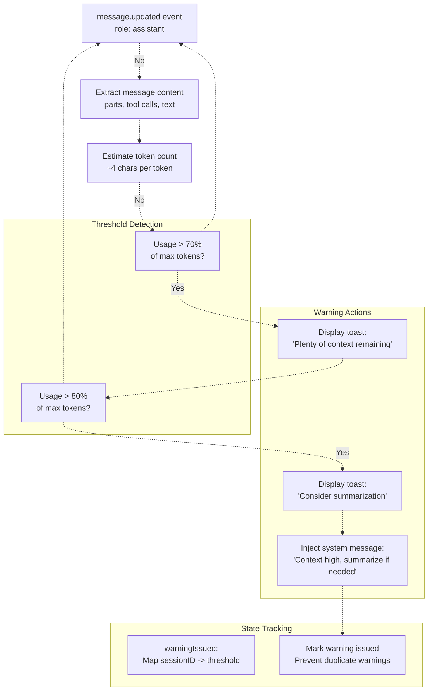
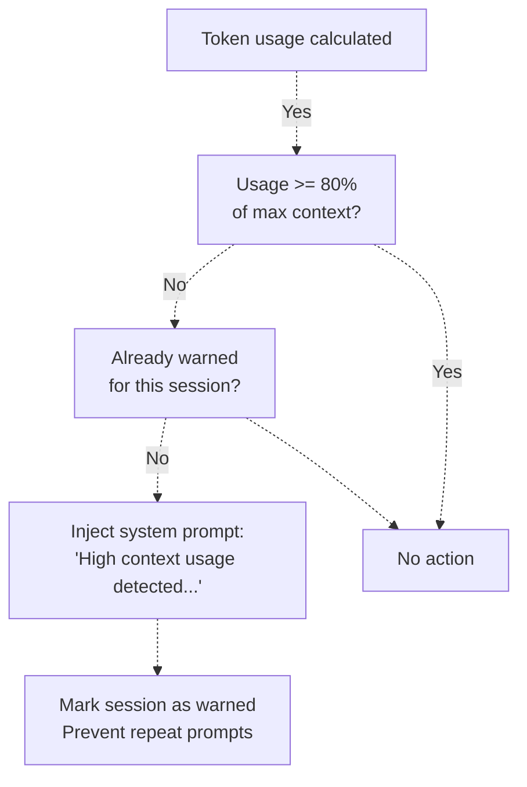
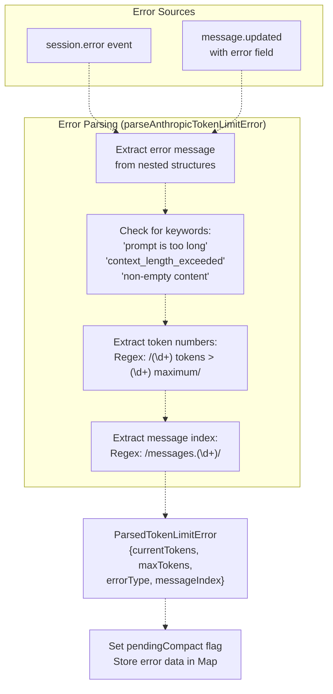
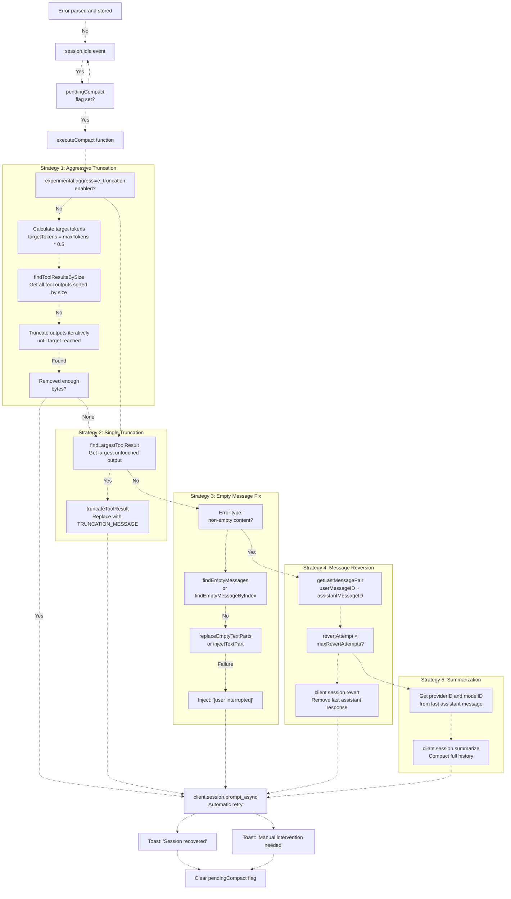
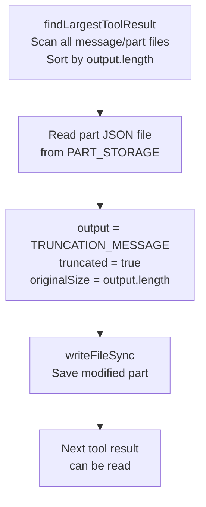
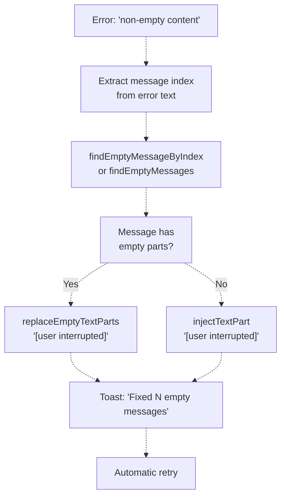
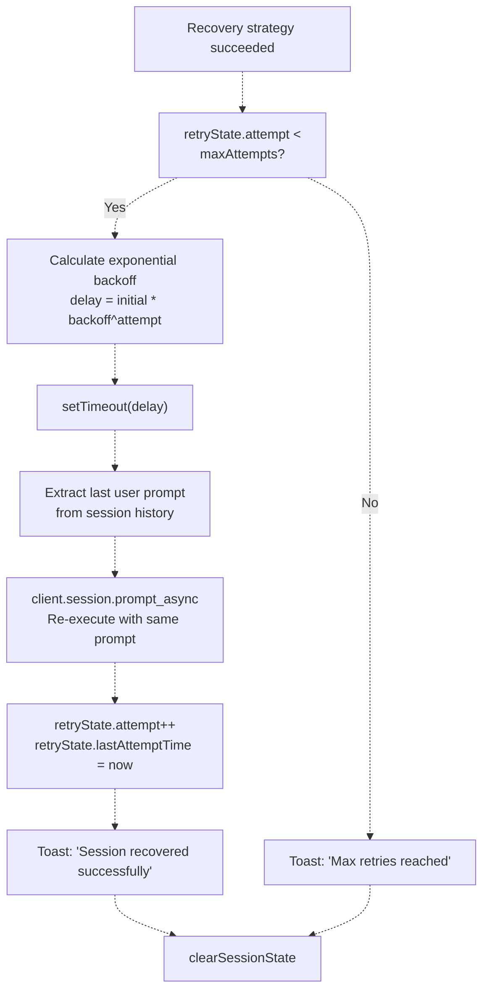
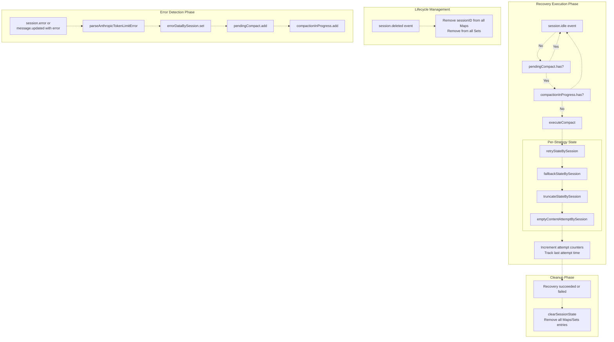
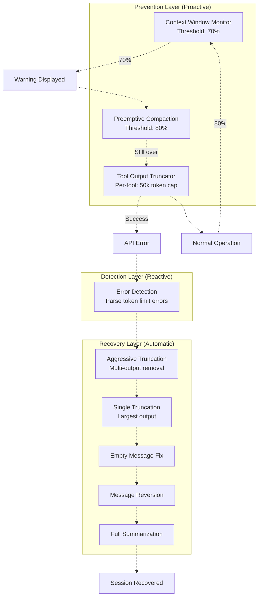

# Context Management Hooks

> **Relevant source files**
> * [README.ja.md](https://github.com/code-yeongyu/oh-my-opencode/blob/b92cd6ab/README.ja.md)
> * [README.ko.md](https://github.com/code-yeongyu/oh-my-opencode/blob/b92cd6ab/README.ko.md)
> * [README.md](https://github.com/code-yeongyu/oh-my-opencode/blob/b92cd6ab/README.md)
> * [README.zh-cn.md](https://github.com/code-yeongyu/oh-my-opencode/blob/b92cd6ab/README.zh-cn.md)
> * [assets/oh-my-opencode.schema.json](https://github.com/code-yeongyu/oh-my-opencode/blob/b92cd6ab/assets/oh-my-opencode.schema.json)
> * [src/config/schema.ts](https://github.com/code-yeongyu/oh-my-opencode/blob/b92cd6ab/src/config/schema.ts)
> * [src/hooks/index.ts](https://github.com/code-yeongyu/oh-my-opencode/blob/b92cd6ab/src/hooks/index.ts)
> * [src/index.ts](https://github.com/code-yeongyu/oh-my-opencode/blob/b92cd6ab/src/index.ts)
> * [src/shared/config-path.ts](https://github.com/code-yeongyu/oh-my-opencode/blob/b92cd6ab/src/shared/config-path.ts)

## Purpose and Scope

Context Management Hooks monitor and manage the token consumption within LLM conversation contexts to prevent context window overflow and enable graceful recovery from token limit errors. This system implements three coordinated mechanisms:

1. **Context Window Monitor**: Tracks token usage and provides proactive warnings to agents
2. **Preemptive Compaction**: Triggers at 80% context capacity to encourage summarization
3. **Anthropic Auto-Compact**: Automatically recovers from token limit errors through truncation, reversion, and summarization

These hooks implement the [Context Window Anxiety Management](https://agentic-patterns.com/patterns/context-window-anxiety-management/) pattern, preventing premature context panic while enabling seamless recovery when limits are actually reached.

For information about context enhancement through documentation injection, see [Context Injection Hooks](/code-yeongyu/oh-my-opencode/7.4-context-management-hooks). For tool output truncation, see [Tool Enhancement Hooks](/code-yeongyu/oh-my-opencode/7.3-todo-continuation-enforcer).

**Sources:** [README.md L688-L693](https://github.com/code-yeongyu/oh-my-opencode/blob/b92cd6ab/README.md#L688-L693)

 [src/hooks/anthropic-auto-compact/index.ts L1-L154](https://github.com/code-yeongyu/oh-my-opencode/blob/b92cd6ab/src/hooks/anthropic-auto-compact/index.ts#L1-L154)

## Hook Registry and Initialization

The three context management hooks are conditionally initialized based on the `disabled_hooks` configuration array:

| Hook Name | Creation Function | Config Key | Default State | Lifecycle Event |
| --- | --- | --- | --- | --- |
| Context Window Monitor | `createContextWindowMonitorHook` | `context-window-monitor` | Enabled | `message.updated` |
| Preemptive Compaction | *(Integrated with Monitor)* | *(same)* | Enabled | `message.updated` |
| Anthropic Auto-Compact | `createAnthropicAutoCompactHook` | `anthropic-auto-compact` | Enabled | `session.error`, `message.updated`, `session.idle` |

The Anthropic Auto-Compact hook accepts an `experimental` configuration object for aggressive truncation behavior:

```javascript
const anthropicAutoCompact = isHookEnabled("anthropic-auto-compact")
  ? createAnthropicAutoCompactHook(ctx, { 
      experimental: config.experimental 
    })
  : null;
```

**Sources:** [src/hooks/anthropic-auto-compact/index.ts L24-L149](https://github.com/code-yeongyu/oh-my-opencode/blob/b92cd6ab/src/hooks/anthropic-auto-compact/index.ts#L24-L149)

 [src/hooks/anthropic-auto-compact/types.ts L1-L54](https://github.com/code-yeongyu/oh-my-opencode/blob/b92cd6ab/src/hooks/anthropic-auto-compact/types.ts#L1-L54)

## Context Management Pipeline

### Event-Driven Monitoring and Recovery Flow

```mermaid
flowchart TD

AggressiveTrunc["Unsupported markdown: list"]
SessionIdle["session.idle event"]
CheckPending["pendingCompact<br>flag set?"]
ExecuteCompact["executeCompact"]
LargestTrunc["Unsupported markdown: list"]
FixEmpty["Unsupported markdown: list"]
Revert["Unsupported markdown: list"]
Summarize["Unsupported markdown: list"]
RetryPrompt["Re-prompt automatically"]
ClearState["Clear recovery state"]
SessionError["session.error event<br>or message.updated with error"]
ErrorParser["parseAnthropicTokenLimitError"]
TokenLimitCheck["Token limit<br>exceeded?"]
SetPending["Set pendingCompact flag<br>Store error data"]
EmptyContentCheck["Non-empty<br>content error?"]
MessageUpdate["message.updated event"]
ContextMonitor["Context Window Monitor"]
TokenCalc["Calculate token usage"]
CheckThreshold["Token usage > 70%?"]
Warning["Display headroom warning"]
CheckPreemptive["Token usage > 80%?"]
PreemptivePrompt["Inject compaction prompt"]

subgraph subGraph3 ["Recovery Execution"]
    SessionIdle
    CheckPending
    ExecuteCompact
    RetryPrompt
    ClearState
    SessionIdle -.->|"No"| CheckPending
    CheckPending -.->|"Yes"| ExecuteCompact
    CheckPending -.-> SessionIdle
    ExecuteCompact -.-> AggressiveTrunc
    Summarize -.-> RetryPrompt
    RetryPrompt -.->|"Yes"| ClearState

subgraph subGraph2 ["Recovery Strategies"]
    AggressiveTrunc
    LargestTrunc
    FixEmpty
    Revert
    Summarize
    AggressiveTrunc -.-> LargestTrunc
    LargestTrunc -.-> FixEmpty
    FixEmpty -.-> Revert
    Revert -.-> Summarize
end
end

subgraph subGraph1 ["Error Detection"]
    SessionError
    ErrorParser
    TokenLimitCheck
    SetPending
    EmptyContentCheck
    SessionError -.->|"Yes"| ErrorParser
    ErrorParser -.-> TokenLimitCheck
    TokenLimitCheck -.-> SetPending
    ErrorParser -.-> EmptyContentCheck
    EmptyContentCheck -.-> SetPending
end

subgraph subGraph0 ["Continuous Monitoring"]
    MessageUpdate
    ContextMonitor
    TokenCalc
    CheckThreshold
    Warning
    CheckPreemptive
    PreemptivePrompt
    MessageUpdate -.->|"No"| ContextMonitor
    ContextMonitor -.->|"No"| TokenCalc
    TokenCalc -.->|"Yes"| CheckThreshold
    CheckThreshold -.->|"Yes"| Warning
    Warning -.-> CheckPreemptive
    CheckThreshold -.-> MessageUpdate
    CheckPreemptive -.-> PreemptivePrompt
    CheckPreemptive -.-> MessageUpdate
end
```



**Key Characteristics:**

* **Proactive**: Context Window Monitor prevents issues before they occur
* **Reactive**: Auto-Compact recovers from actual errors automatically
* **Cascading**: Multiple fallback strategies ensure recovery success

**Sources:** [src/hooks/anthropic-auto-compact/index.ts L28-L143](https://github.com/code-yeongyu/oh-my-opencode/blob/b92cd6ab/src/hooks/anthropic-auto-compact/index.ts#L28-L143)

 [src/hooks/anthropic-auto-compact/executor.ts L249-L397](https://github.com/code-yeongyu/oh-my-opencode/blob/b92cd6ab/src/hooks/anthropic-auto-compact/executor.ts#L249-L397)

## Context Window Monitor

### Overview

The Context Window Monitor tracks token consumption in real-time and provides proactive warnings to agents when approaching capacity limits. This prevents "context window anxiety" where agents prematurely summarize or truncate their work due to perceived space constraints.

### Token Tracking Mechanism

The monitor observes `message.updated` events and calculates approximate token usage based on message content. When usage crosses specific thresholds, it injects warnings or prompts into the conversation.



### Warning Thresholds

| Threshold | Action | Purpose |
| --- | --- | --- |
| **70%** | Display reassurance toast | Prevent premature anxiety |
| **80%** | Display warning + inject prompt | Encourage proactive summarization |
| **100%** | Error → Auto-Compact trigger | Automatic recovery |

### Session State Management

The monitor maintains per-session state to prevent warning spam:

```yaml
interface ContextMonitorState {
  warningIssued: Map<string, number>  // sessionID -> highest threshold warned
  lastTokenCount: Map<string, number> // sessionID -> last calculated tokens
}
```

Warnings are issued once per threshold per session.

**Sources:** [README.md L688-L690](https://github.com/code-yeongyu/oh-my-opencode/blob/b92cd6ab/README.md#L688-L690)

 [README.ko.md L625-L626](https://github.com/code-yeongyu/oh-my-opencode/blob/b92cd6ab/README.ko.md#L625-L626)

## Preemptive Compaction

### Overview

Preemptive Compaction is integrated with the Context Window Monitor and activates at the 80% token threshold. Unlike reactive recovery, this mechanism proactively encourages agents to summarize or compact their context before errors occur.

### Triggering Logic



### Injection Strategy

When the 80% threshold is crossed, the monitor injects a system message:

```
High context usage detected (>80%). Consider summarizing recent tool outputs 
or delegating subtasks to background agents to free up context space.
```

This prompt:

* Appears in the conversation as a system-level message
* Suggests concrete actions (summarization, delegation)
* Does not force compaction, allowing agent discretion
* Triggers only once per session at the 80% threshold

### Behavioral Characteristics

| Aspect | Behavior |
| --- | --- |
| **Trigger Threshold** | 80% of max context tokens |
| **Action Type** | System message injection |
| **Frequency** | Once per session per threshold |
| **Agent Impact** | Suggestion, not mandatory |
| **Coordination** | Works with Auto-Compact for full coverage |

**Sources:** [README.md L688-L690](https://github.com/code-yeongyu/oh-my-opencode/blob/b92cd6ab/README.md#L688-L690)

 [README.ko.md L625-L626](https://github.com/code-yeongyu/oh-my-opencode/blob/b92cd6ab/README.ko.md#L625-L626)

## Anthropic Auto-Compact

### Overview

Anthropic Auto-Compact is the reactive recovery system that automatically handles token limit errors from Anthropic (Claude) models. When a session hits context limits, this hook executes a multi-strategy recovery pipeline without user intervention.

### Error Detection and Parsing



### Supported Error Types

| Error Type | Trigger Pattern | Recovery Strategy |
| --- | --- | --- |
| `token_limit_exceeded` | "X tokens > Y maximum" | Truncate → Revert → Summarize |
| `non-empty content` | "messages[N]: non-empty content" | Fix empty messages → Retry |
| `bedrock_input_too_long` | Bedrock-specific error | Aggressive truncation |
| `context_length_exceeded` | Generic OpenAI-style error | Standard pipeline |

**Sources:** [src/hooks/anthropic-auto-compact/parser.ts L1-L183](https://github.com/code-yeongyu/oh-my-opencode/blob/b92cd6ab/src/hooks/anthropic-auto-compact/parser.ts#L1-L183)

 [src/hooks/anthropic-auto-compact/types.ts L1-L10](https://github.com/code-yeongyu/oh-my-opencode/blob/b92cd6ab/src/hooks/anthropic-auto-compact/types.ts#L1-L10)

### Recovery Pipeline Architecture



**Pipeline Characteristics:**

* **Cascading Fallbacks**: Each strategy has increasing impact
* **State-Tracked**: Attempts are counted to prevent infinite loops
* **Automatic Retry**: Successful recovery triggers prompt re-execution

**Sources:** [src/hooks/anthropic-auto-compact/executor.ts L249-L397](https://github.com/code-yeongyu/oh-my-opencode/blob/b92cd6ab/src/hooks/anthropic-auto-compact/executor.ts#L249-L397)

 [src/hooks/anthropic-auto-compact/index.ts L107-L143](https://github.com/code-yeongyu/oh-my-opencode/blob/b92cd6ab/src/hooks/anthropic-auto-compact/index.ts#L107-L143)

### Strategy 1: Aggressive Truncation (Experimental)

Aggressive truncation removes content from multiple tool outputs simultaneously to meet a target token reduction. This is the most efficient strategy when many large outputs exist.

#### Configuration

```json
{
  "experimental": {
    "aggressive_truncation": true
  }
}
```

#### Algorithm

```
// Target: 50% of max tokens (configurable via TRUNCATE_CONFIG.targetTokenRatio)
targetTokens = maxTokens * 0.5
tokensToReduce = currentTokens - targetTokens
bytesToReduce = tokensToReduce * 4  // Assume 4 chars per token

// Find all tool results sorted by output size (largest first)
results = findToolResultsBySize(sessionID)

// Truncate iteratively until target reached
for (result of results) {
  if (totalBytesRemoved >= bytesToReduce) break
  truncateToolResult(result.partPath)
  totalBytesRemoved += result.outputSize
}
```

#### Truncation Configuration

| Constant | Value | Description |
| --- | --- | --- |
| `maxTruncateAttempts` | 20 | Maximum outputs to truncate per recovery |
| `targetTokenRatio` | 0.5 | Target 50% of max tokens after truncation |
| `charsPerToken` | 4 | Estimated characters per token |
| `minOutputSizeToTruncate` | 500 | Ignore small outputs |

**Sources:** [src/hooks/anthropic-auto-compact/executor.ts L264-L340](https://github.com/code-yeongyu/oh-my-opencode/blob/b92cd6ab/src/hooks/anthropic-auto-compact/executor.ts#L264-L340)

 [src/hooks/anthropic-auto-compact/types.ts L48-L53](https://github.com/code-yeongyu/oh-my-opencode/blob/b92cd6ab/src/hooks/anthropic-auto-compact/types.ts#L48-L53)

 [src/hooks/anthropic-auto-compact/storage.ts L195-L257](https://github.com/code-yeongyu/oh-my-opencode/blob/b92cd6ab/src/hooks/anthropic-auto-compact/storage.ts#L195-L257)

### Strategy 2: Single Output Truncation

When aggressive truncation is disabled or insufficient, the system truncates the single largest tool output.

#### Storage Structure

Tool outputs are stored in the OpenCode storage directory:

```
~/.local/share/opencode/storage/
├── message/
│   └── {sessionID}/
│       └── {messageID}.json
└── part/
    └── {messageID}/
        └── {partID}.json  ← Tool result stored here
```

Each part file contains:

```yaml
interface StoredToolPart {
  id: string
  sessionID: string
  messageID: string
  type: "tool"
  callID: string
  tool: string
  state: {
    status: "completed"
    input: Record<string, unknown>
    output: string  ← Original output
    time: { start: number, end?: number, compacted?: number }
  }
  truncated?: boolean       ← Set to true after truncation
  originalSize?: number     ← Saved for reference
}
```

#### Truncation Process



#### Truncation Message

```
[TOOL RESULT TRUNCATED - Context limit exceeded. Original output was too large 
and has been truncated to recover the session. Please re-run this tool if you 
need the full output.]
```

**Sources:** [src/hooks/anthropic-auto-compact/storage.ts L85-L154](https://github.com/code-yeongyu/oh-my-opencode/blob/b92cd6ab/src/hooks/anthropic-auto-compact/storage.ts#L85-L154)

 [src/hooks/anthropic-auto-compact/executor.ts L342-L367](https://github.com/code-yeongyu/oh-my-opencode/blob/b92cd6ab/src/hooks/anthropic-auto-compact/executor.ts#L342-L367)

### Strategy 3: Empty Message Recovery

The "non-empty content" error occurs when a message in the conversation history has no content, violating API requirements. This strategy fixes empty messages by injecting placeholder text.

#### Detection

```javascript
// Error message example:
// "messages[12]: non-empty content"

const messageIndex = extractMessageIndex(errorMessage)  // Returns: 12
const emptyMessageId = findEmptyMessageByIndex(sessionID, messageIndex)
```

#### Fix Methods

| Method | Function | Behavior |
| --- | --- | --- |
| **Replace** | `replaceEmptyTextParts` | Replaces existing empty text parts |
| **Inject** | `injectTextPart` | Adds new text part if none exist |

Both inject the placeholder: `"[user interrupted]"`

#### Recovery Flow



**Sources:** [src/hooks/anthropic-auto-compact/executor.ts L173-L247](https://github.com/code-yeongyu/oh-my-opencode/blob/b92cd6ab/src/hooks/anthropic-auto-compact/executor.ts#L173-L247)

 [src/hooks/anthropic-auto-compact/parser.ts L45-L51](https://github.com/code-yeongyu/oh-my-opencode/blob/b92cd6ab/src/hooks/anthropic-auto-compact/parser.ts#L45-L51)

### Strategy 4: Message Reversion

When truncation strategies fail, the system reverts (deletes) the last assistant message to reduce context size.

#### Reversion Logic

```javascript
// Get last user + assistant message pair
const { userMessageID, assistantMessageID } = await getLastMessagePair(sessionID, client, directory)

// Revert assistant response
await client.session.revert({
  path: { id: sessionID },
  body: { messageID: userMessageID },  // Reverts to this message
  query: { directory }
})
```

#### Reversion Limits

| Configuration | Value | Purpose |
| --- | --- | --- |
| `maxRevertAttempts` | 3 | Prevent excessive message deletion |
| `minMessagesRequired` | 2 | Ensure conversation has content |

#### State Tracking

```yaml
interface FallbackState {
  revertAttempt: number
  lastRevertedMessageID?: string  // Track what was reverted
}
```

Reversion stops after 3 attempts per session to prevent deleting the entire conversation.

**Sources:** [src/hooks/anthropic-auto-compact/executor.ts L75-L120](https://github.com/code-yeongyu/oh-my-opencode/blob/b92cd6ab/src/hooks/anthropic-auto-compact/executor.ts#L75-L120)

 [src/hooks/anthropic-auto-compact/types.ts L16-L19](https://github.com/code-yeongyu/oh-my-opencode/blob/b92cd6ab/src/hooks/anthropic-auto-compact/types.ts#L16-L19)

 [src/hooks/anthropic-auto-compact/types.ts L43-L46](https://github.com/code-yeongyu/oh-my-opencode/blob/b92cd6ab/src/hooks/anthropic-auto-compact/types.ts#L43-L46)

### Strategy 5: Summarization

Summarization is the final fallback strategy. It uses OpenCode's built-in summarization API to compact the entire conversation history into a shorter form.

#### Summarization Request

```yaml
await client.session.summarize({
  path: { id: sessionID },
  body: { 
    providerID: "anthropic",  // From last assistant message
    modelID: "claude-opus-4-5"
  },
  query: { directory }
})
```

#### Behavior

* **Model Selection**: Uses the same model as the conversation (preserves context quality)
* **Automatic Retry**: After summarization, the hook automatically re-prompts
* **State Preservation**: Session continues seamlessly from summarized state
* **Last Resort**: Only executes after all other strategies exhausted

**Sources:** [src/hooks/anthropic-auto-compact/executor.ts L369-L395](https://github.com/code-yeongyu/oh-my-opencode/blob/b92cd6ab/src/hooks/anthropic-auto-compact/executor.ts#L369-L395)

### Retry and Backoff Mechanism

After successful recovery, the system automatically retries the original prompt that caused the error.

#### Retry State

```yaml
interface RetryState {
  attempt: number           // Current retry attempt
  lastAttemptTime: number   // Timestamp of last retry
}
```

#### Retry Configuration

| Constant | Value | Purpose |
| --- | --- | --- |
| `maxAttempts` | 2 | Maximum retry attempts before failure |
| `initialDelayMs` | 2000 | Initial delay before first retry |
| `backoffFactor` | 2 | Exponential backoff multiplier |
| `maxDelayMs` | 30000 | Maximum delay cap |

#### Backoff Calculation

```javascript
const delay = Math.min(
  initialDelayMs * Math.pow(backoffFactor, attempt),
  maxDelayMs
)

// Attempt 0: 2000ms
// Attempt 1: 4000ms
// Attempt 2: 8000ms (capped at maxDelayMs)
```

#### Automatic Retry Execution



**Sources:** [src/hooks/anthropic-auto-compact/executor.ts L249-L397](https://github.com/code-yeongyu/oh-my-opencode/blob/b92cd6ab/src/hooks/anthropic-auto-compact/executor.ts#L249-L397)

 [src/hooks/anthropic-auto-compact/types.ts L11-L14](https://github.com/code-yeongyu/oh-my-opencode/blob/b92cd6ab/src/hooks/anthropic-auto-compact/types.ts#L11-L14)

 [src/hooks/anthropic-auto-compact/types.ts L36-L41](https://github.com/code-yeongyu/oh-my-opencode/blob/b92cd6ab/src/hooks/anthropic-auto-compact/types.ts#L36-L41)

## Session State Management

### Auto-Compact State Structure

The Anthropic Auto-Compact hook maintains comprehensive per-session state to coordinate recovery strategies and prevent infinite loops:

```yaml
interface AutoCompactState {
  pendingCompact: Set<string>                              // Sessions awaiting recovery
  errorDataBySession: Map<string, ParsedTokenLimitError>   // Parsed error details
  retryStateBySession: Map<string, RetryState>             // Retry attempt tracking
  fallbackStateBySession: Map<string, FallbackState>       // Reversion tracking
  truncateStateBySession: Map<string, TruncateState>       // Truncation tracking
  emptyContentAttemptBySession: Map<string, number>        // Empty fix tracking
  compactionInProgress: Set<string>                        // Prevent concurrent recovery
}
```

### State Coordination Diagram



### State Lifecycle Per Recovery Attempt

| State Map | Purpose | Cleared When | Max Value |
| --- | --- | --- | --- |
| `pendingCompact` | Flag session needs recovery | After successful recovery | N/A (Set) |
| `errorDataBySession` | Store parsed error details | After successful recovery | N/A |
| `retryStateBySession` | Track retry attempts | After max retries | `maxAttempts: 2` |
| `fallbackStateBySession` | Track reversion count | After max reverts | `maxRevertAttempts: 3` |
| `truncateStateBySession` | Track truncation count | After max truncates | `maxTruncateAttempts: 20` |
| `emptyContentAttemptBySession` | Track empty message fixes | After successful fix | Unlimited |
| `compactionInProgress` | Prevent concurrent execution | After execution completes | N/A (Set) |

### Cleanup and Memory Management

The hook listens to `session.deleted` events to prevent memory leaks:

```javascript
if (event.type === "session.deleted") {
  const sessionID = props?.info?.id
  if (sessionID) {
    autoCompactState.pendingCompact.delete(sessionID)
    autoCompactState.errorDataBySession.delete(sessionID)
    autoCompactState.retryStateBySession.delete(sessionID)
    autoCompactState.fallbackStateBySession.delete(sessionID)
    autoCompactState.truncateStateBySession.delete(sessionID)
    autoCompactState.emptyContentAttemptBySession.delete(sessionID)
    autoCompactState.compactionInProgress.delete(sessionID)
  }
}
```

**Sources:** [src/hooks/anthropic-auto-compact/types.ts L26-L34](https://github.com/code-yeongyu/oh-my-opencode/blob/b92cd6ab/src/hooks/anthropic-auto-compact/types.ts#L26-L34)

 [src/hooks/anthropic-auto-compact/index.ts L31-L42](https://github.com/code-yeongyu/oh-my-opencode/blob/b92cd6ab/src/hooks/anthropic-auto-compact/index.ts#L31-L42)

 [src/hooks/anthropic-auto-compact/executor.ts L156-L164](https://github.com/code-yeongyu/oh-my-opencode/blob/b92cd6ab/src/hooks/anthropic-auto-compact/executor.ts#L156-L164)

## Hook Configuration

### Disabling Hooks

Individual context management hooks can be disabled via configuration:

```json
{
  "disabled_hooks": [
    "context-window-monitor",
    "anthropic-auto-compact"
  ]
}
```

Configuration files are loaded from:

1. `.opencode/oh-my-opencode.json` (project-level, highest priority)
2. `~/.config/opencode/oh-my-opencode.json` (user-level)
3. `~/.config/opencode/oh-my-opencode.json` (Windows: `%APPDATA%\opencode\oh-my-opencode.json`)

### Experimental Configuration

The Anthropic Auto-Compact hook supports experimental features via the `experimental` configuration object:

```json
{
  "experimental": {
    "aggressive_truncation": true,
    "auto_resume": true
  }
}
```

| Option | Default | Description |
| --- | --- | --- |
| `aggressive_truncation` | `false` | Enable multi-output truncation to reach 50% target tokens |
| `auto_resume` | `false` | Automatically retry after successful recovery from thinking errors |

### Platform-Specific Configuration Paths

The plugin determines the user configuration directory based on platform:

```javascript
// getUserConfigDir() implementation
if (process.platform === "win32") {
  // Prioritize cross-platform ~/.config
  const crossPlatform = "~/.config/opencode/oh-my-opencode.json"
  if (exists(crossPlatform)) return crossPlatform
  
  // Fallback to Windows-native %APPDATA%
  return "%APPDATA%/opencode/oh-my-opencode.json"
}

// Linux/macOS: XDG_CONFIG_HOME or ~/.config
return "$XDG_CONFIG_HOME/opencode/oh-my-opencode.json"
```

**Sources:** [src/shared/config-path.ts L1-L48](https://github.com/code-yeongyu/oh-my-opencode/blob/b92cd6ab/src/shared/config-path.ts#L1-L48)

 [src/hooks/anthropic-auto-compact/index.ts L8-L10](https://github.com/code-yeongyu/oh-my-opencode/blob/b92cd6ab/src/hooks/anthropic-auto-compact/index.ts#L8-L10)

 [README.md L836-L853](https://github.com/code-yeongyu/oh-my-opencode/blob/b92cd6ab/README.md#L836-L853)

## Integration with Tool Output Truncation

Context management hooks coordinate with the tool output truncator to provide comprehensive context window management:

### Coordination Strategy

| Component | Role | Timing |
| --- | --- | --- |
| **Context Window Monitor** | Proactive warning at 70%+ usage | During conversation (`message.updated`) |
| **Preemptive Compaction** | Suggestion at 80% usage | During conversation (`message.updated`) |
| **Tool Output Truncator** | Per-tool dynamic truncation | After tool execution (`tool.execute.after`) |
| **Anthropic Auto-Compact** | Emergency recovery | After API error (`session.error`, `session.idle`) |

### Layered Defense Architecture



This multi-layered approach ensures:

1. **Prevention**: Agents are warned before limits
2. **Mitigation**: Tool outputs are truncated proactively
3. **Recovery**: Errors are handled automatically without user intervention

For per-tool truncation details, see [Tool Enhancement Hooks](/code-yeongyu/oh-my-opencode/7.3-todo-continuation-enforcer).

**Sources:** [README.md L688-L701](https://github.com/code-yeongyu/oh-my-opencode/blob/b92cd6ab/README.md#L688-L701)

 [src/hooks/anthropic-auto-compact/executor.ts L264-L397](https://github.com/code-yeongyu/oh-my-opencode/blob/b92cd6ab/src/hooks/anthropic-auto-compact/executor.ts#L264-L397)

## Storage System Architecture

### OpenCode Storage Directory Structure

Anthropic Auto-Compact operates on OpenCode's persistent storage layer:

```
~/.local/share/opencode/storage/  (or ~/.local/share on macOS via xdg-basedir)
├── message/
│   ├── {sessionID}/
│   │   └── {messageID}.json          ← Message metadata
│   └── {workspaceID}/
│       └── {sessionID}/
│           └── {messageID}.json
└── part/
    └── {messageID}/
        ├── {partID}.json              ← Tool result content
        ├── {partID}.json
        └── {partID}.json
```

### Part File Schema

Each tool result is stored as a JSON file in the `part/` directory:

```yaml
interface StoredToolPart {
  id: string                    // Part UUID
  sessionID: string             // Parent session
  messageID: string             // Parent message
  type: "tool"                  // Part type
  callID: string                // Tool invocation ID
  tool: string                  // Tool name (e.g., "grep", "read")
  state: {
    status: "pending" | "running" | "completed" | "error"
    input: Record<string, unknown>     // Tool arguments
    output?: string                    // Tool result (can be large)
    error?: string                     // Error message if failed
    time?: {
      start: number                    // Timestamp: tool start
      end?: number                     // Timestamp: tool end
      compacted?: number               // Timestamp: when truncated
    }
  }
  truncated?: boolean           // Set to true after truncation
  originalSize?: number         // Saved for metrics
}
```

### Storage Manipulation Operations

| Operation | Function | Purpose | File System Impact |
| --- | --- | --- | --- |
| **Find Largest** | `findLargestToolResult` | Identify biggest output | Read-only scan |
| **Find By Size** | `findToolResultsBySize` | Get sorted list | Read-only scan |
| **Truncate** | `truncateToolResult` | Replace output with message | Write (modify part file) |
| **Count Truncated** | `countTruncatedResults` | Track recovery stats | Read-only scan |
| **Get Total Size** | `getTotalToolOutputSize` | Calculate total output bytes | Read-only scan |

### Cross-Platform Path Resolution

The storage module handles platform-specific XDG directory resolution:

```javascript
// Default: Use xdg-basedir
let OPENCODE_STORAGE = join(xdgData ?? "", "opencode", "storage")

// macOS Fix: xdg-basedir → ~/Library/Application Support
// But OpenCode CLI uses ~/.local/share
if (process.platform === "darwin" && !existsSync(OPENCODE_STORAGE)) {
  const localShare = join(homedir(), ".local", "share", "opencode", "storage")
  if (existsSync(localShare)) {
    OPENCODE_STORAGE = localShare
  }
}
```

This ensures compatibility with OpenCode's actual storage location on macOS.

**Sources:** [src/hooks/anthropic-auto-compact/storage.ts L1-L258](https://github.com/code-yeongyu/oh-my-opencode/blob/b92cd6ab/src/hooks/anthropic-auto-compact/storage.ts#L1-L258)

 [src/shared/config-path.ts L1-L48](https://github.com/code-yeongyu/oh-my-opencode/blob/b92cd6ab/src/shared/config-path.ts#L1-L48)

## Technical Implementation Details

### Hook Creation Pattern

The Anthropic Auto-Compact hook follows the standard factory pattern:

```javascript
export function createAnthropicAutoCompactHook(
  ctx: PluginInput, 
  options?: AnthropicAutoCompactOptions
) {
  const autoCompactState = createAutoCompactState()
  const experimental = options?.experimental
  
  const eventHandler = async ({ event }) => {
    // Handle session.error, message.updated, session.idle
  }
  
  return {
    event: eventHandler
  }
}
```

**Key Characteristics:**

* **State Encapsulation**: `autoCompactState` is closure-captured
* **Options Support**: `experimental` config passed at creation time
* **Event-Driven**: Returns single `event` handler for multiple event types

### Event Handler Signature

The hook implements a unified event handler for multiple event types:

```typescript
interface EventHandler {
  event: (context: { 
    event: { 
      type: "session.error" | "message.updated" | "session.idle" | "session.deleted",
      properties?: unknown 
    } 
  }) => Promise<void>
}
```

**Event Type Dispatch:**

* `session.error`: Parse error and set pending flag
* `message.updated`: Extract inline errors from assistant messages
* `session.idle`: Execute recovery if pending flag set
* `session.deleted`: Clean up session state

### Asynchronous Recovery Execution

Recovery strategies use async/await with OpenCode's client APIs:

```javascript
// Tool truncation: synchronous file I/O
const result = truncateToolResult(partPath)  // fs.readFileSync + fs.writeFileSync

// Message reversion: async API call
await client.session.revert({
  path: { id: sessionID },
  body: { messageID },
  query: { directory }
})

// Summarization: async API call
await client.session.summarize({
  path: { id: sessionID },
  body: { providerID, modelID },
  query: { directory }
})

// Retry prompt: async API call
await client.session.prompt_async({
  path: { sessionID },
  body: { parts: [{ type: "text", text: lastPrompt }] },
  query: { directory }
})
```

**Error Handling**: All API calls use `.catch(() => {})` for non-critical operations (e.g., toast notifications) to prevent hook failures from crashing the session.

**Sources:** [src/hooks/anthropic-auto-compact/index.ts L24-L149](https://github.com/code-yeongyu/oh-my-opencode/blob/b92cd6ab/src/hooks/anthropic-auto-compact/index.ts#L24-L149)

 [src/hooks/anthropic-auto-compact/executor.ts L249-L397](https://github.com/code-yeongyu/oh-my-opencode/blob/b92cd6ab/src/hooks/anthropic-auto-compact/executor.ts#L249-L397)

## Comparison with Other Hook Categories

| Hook Category | Execution Phase | Mutates Output | Session State | Purpose |
| --- | --- | --- | --- | --- |
| **Context Enhancement** | `tool.execute.after` | Yes (append) | Per-directory/rule | Add background knowledge |
| **Tool Management** | `tool.execute.after` | Yes (truncate) | Per-tool-call | Control output size |
| **Quality Assurance** | `event` listener | Indirect | Per-session | Enforce completeness |
| **Session Recovery** | `event` listener | Indirect | Per-error | Error correction |

Context Enhancement hooks are unique in their hierarchical approach to context accumulation and their session-scoped deduplication strategy.

**Sources:** [src/index.ts L185-L248](https://github.com/code-yeongyu/oh-my-opencode/blob/b92cd6ab/src/index.ts#L185-L248)

 [src/index.ts L383-L398](https://github.com/code-yeongyu/oh-my-opencode/blob/b92cd6ab/src/index.ts#L383-L398)

 [src/index.ts L521-L541](https://github.com/code-yeongyu/oh-my-opencode/blob/b92cd6ab/src/index.ts#L521-L541)