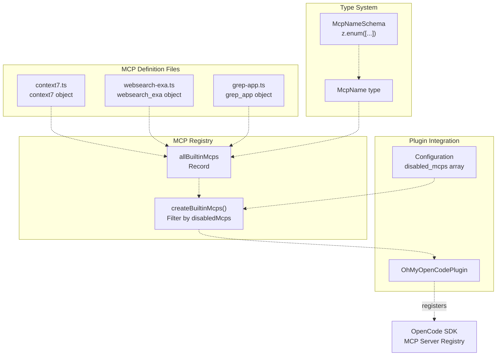
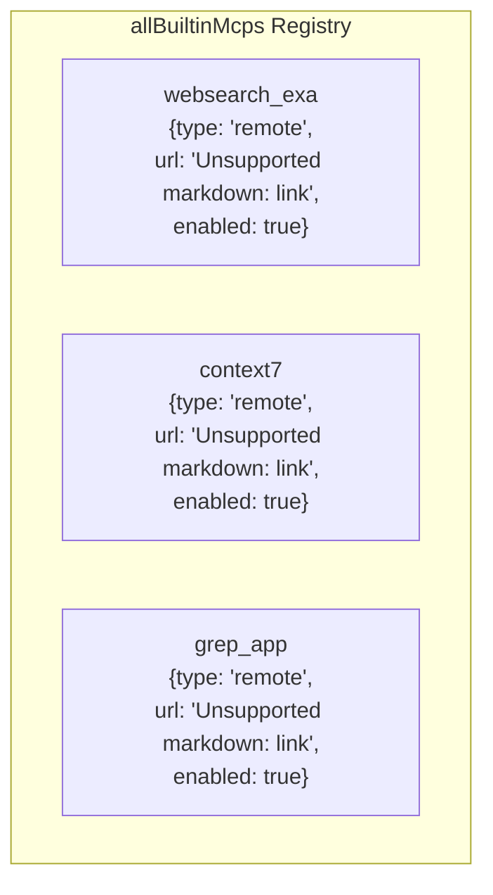
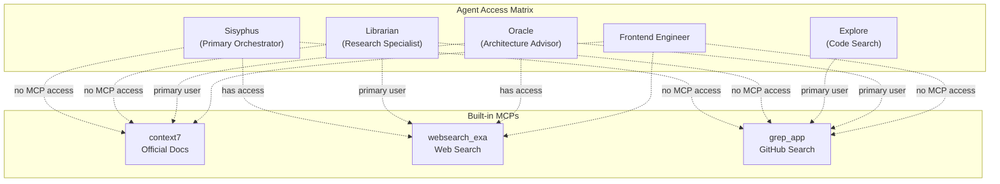

# Built-in MCPs

> **Relevant source files**
> * [LICENSE.md](https://github.com/code-yeongyu/oh-my-opencode/blob/b92cd6ab/LICENSE.md)
> * [README.ja.md](https://github.com/code-yeongyu/oh-my-opencode/blob/b92cd6ab/README.ja.md)
> * [README.ko.md](https://github.com/code-yeongyu/oh-my-opencode/blob/b92cd6ab/README.ko.md)
> * [README.md](https://github.com/code-yeongyu/oh-my-opencode/blob/b92cd6ab/README.md)
> * [README.zh-cn.md](https://github.com/code-yeongyu/oh-my-opencode/blob/b92cd6ab/README.zh-cn.md)
> * [src/mcp/context7.ts](https://github.com/code-yeongyu/oh-my-opencode/blob/b92cd6ab/src/mcp/context7.ts)
> * [src/mcp/grep-app.ts](https://github.com/code-yeongyu/oh-my-opencode/blob/b92cd6ab/src/mcp/grep-app.ts)
> * [src/mcp/index.ts](https://github.com/code-yeongyu/oh-my-opencode/blob/b92cd6ab/src/mcp/index.ts)
> * [src/mcp/types.ts](https://github.com/code-yeongyu/oh-my-opencode/blob/b92cd6ab/src/mcp/types.ts)
> * [src/mcp/websearch-exa.ts](https://github.com/code-yeongyu/oh-my-opencode/blob/b92cd6ab/src/mcp/websearch-exa.ts)
> * [src/shared/config-path.ts](https://github.com/code-yeongyu/oh-my-opencode/blob/b92cd6ab/src/shared/config-path.ts)

This page documents the three built-in Micro-Capability Providers (MCPs) that extend oh-my-opencode with external knowledge sources: official documentation lookup, real-time web search, and GitHub code search. These MCPs enable agents to access information beyond the local codebase.

For information about the MCP integration architecture and how to load external MCP servers, see [MCP System Overview](/code-yeongyu/oh-my-opencode/8.1-mcp-system-overview). For configuration of MCP-specific settings, see [Configuration > MCPs](#114).

## Overview

oh-my-opencode includes three built-in remote MCPs that provide external knowledge capabilities to agents. Each MCP connects to a remote service via HTTP and exposes tools that agents can invoke:

| MCP Name | Service URL | Primary Use Case | Used By |
| --- | --- | --- | --- |
| `context7` | [https://mcp.context7.com/mcp](https://mcp.context7.com/mcp) | Official package documentation (NPM, PyPI, Cargo, etc.) | Librarian |
| `websearch_exa` | [https://mcp.exa.ai/mcp](https://mcp.exa.ai/mcp) | Real-time web search with 2025+ filtering | Librarian, Sisyphus |
| `grep_app` | [https://mcp.grep.app](https://mcp.grep.app) | GitHub code search across public repositories | Librarian, Explore |

Unlike Claude Code's custom MCP servers (loaded from `.mcp.json` files), these built-in MCPs are registered directly by oh-my-opencode and enabled by default. They can be selectively disabled via configuration.

**Sources:** [README.md L565-L568](https://github.com/code-yeongyu/oh-my-opencode/blob/b92cd6ab/README.md#L565-L568)

 [src/mcp/index.ts L8-L12](https://github.com/code-yeongyu/oh-my-opencode/blob/b92cd6ab/src/mcp/index.ts#L8-L12)

## MCP Registration Architecture



**Diagram: Built-in MCP registration flow from definitions to OpenCode SDK**

The `createBuiltinMcps` function at [src/mcp/index.ts L14-L24](https://github.com/code-yeongyu/oh-my-opencode/blob/b92cd6ab/src/mcp/index.ts#L14-L24)

 filters the complete MCP registry based on the `disabledMcps` array from configuration. Each enabled MCP is registered with OpenCode as a remote server with its corresponding service URL.

**Sources:** [src/mcp/index.ts L1-L24](https://github.com/code-yeongyu/oh-my-opencode/blob/b92cd6ab/src/mcp/index.ts#L1-L24)

 [src/mcp/types.ts L1-L5](https://github.com/code-yeongyu/oh-my-opencode/blob/b92cd6ab/src/mcp/types.ts#L1-L5)

## MCP Configuration Structure

Each built-in MCP follows an identical structure:

```yaml
{
  type: "remote" as const,
  url: string,
  enabled: boolean
}
```

This configuration object defines:

* **type**: Always `"remote"`, indicating the MCP communicates via HTTP with an external service
* **url**: The HTTP endpoint for the MCP service
* **enabled**: Default enablement state (all three default to `true`)

The `allBuiltinMcps` constant at [src/mcp/index.ts L8-L12](https://github.com/code-yeongyu/oh-my-opencode/blob/b92cd6ab/src/mcp/index.ts#L8-L12)

 provides the central registry:



**Diagram: Built-in MCP registry structure with configuration objects**

**Sources:** [src/mcp/index.ts L8-L12](https://github.com/code-yeongyu/oh-my-opencode/blob/b92cd6ab/src/mcp/index.ts#L8-L12)

 [src/mcp/context7.ts L1-L5](https://github.com/code-yeongyu/oh-my-opencode/blob/b92cd6ab/src/mcp/context7.ts#L1-L5)

 [src/mcp/websearch-exa.ts L1-L5](https://github.com/code-yeongyu/oh-my-opencode/blob/b92cd6ab/src/mcp/websearch-exa.ts#L1-L5)

 [src/mcp/grep-app.ts L1-L5](https://github.com/code-yeongyu/oh-my-opencode/blob/b92cd6ab/src/mcp/grep-app.ts#L1-L5)

## context7: Official Documentation MCP

The `context7` MCP provides access to official documentation for package registries across multiple ecosystems:

* **NPM**: JavaScript/TypeScript packages
* **PyPI**: Python packages
* **Cargo**: Rust crates
* **Maven**: Java packages
* **NuGet**: .NET packages
* **And more**: Additional package registries

### Implementation

[src/mcp/context7.ts L1-L5](https://github.com/code-yeongyu/oh-my-opencode/blob/b92cd6ab/src/mcp/context7.ts#L1-L5)

 defines the `context7` object:

```javascript
export const context7 = {
  type: "remote" as const,
  url: "https://mcp.context7.com/mcp",
  enabled: true,
}
```

### Use Cases

The Librarian agent uses `context7` to:

* Look up API documentation when implementing library features
* Verify correct usage patterns for dependencies
* Find migration guides for version upgrades
* Discover available methods and configuration options

### Tool Access

When registered, `context7` exposes tools that allow querying package documentation by name and optionally version. The exact tool schema is provided by the remote MCP server at connection time.

**Sources:** [src/mcp/context7.ts L1-L5](https://github.com/code-yeongyu/oh-my-opencode/blob/b92cd6ab/src/mcp/context7.ts#L1-L5)

 [README.md L565](https://github.com/code-yeongyu/oh-my-opencode/blob/b92cd6ab/README.md#L565-L565)

## websearch_exa: Web Search MCP

The `websearch_exa` MCP enables real-time web search using the Exa AI search engine, with explicit filtering for recent content (2025+) to avoid outdated information.

### Implementation

[src/mcp/websearch-exa.ts L1-L5](https://github.com/code-yeongyu/oh-my-opencode/blob/b92cd6ab/src/mcp/websearch-exa.ts#L1-L5)

 defines the `websearch_exa` object:

```javascript
export const websearch_exa = {
  type: "remote" as const,
  url: "https://mcp.exa.ai/mcp?tools=web_search_exa",
  enabled: true,
}
```

Note the URL includes a query parameter `?tools=web_search_exa` that specifies which tool subset to expose from the Exa MCP server.

### Use Cases

Both Librarian and Sisyphus use `websearch_exa` for:

* Finding recent blog posts about emerging technologies
* Researching best practices with explicit recency requirements
* Looking up breaking changes in newly released frameworks
* Discovering community discussions about specific problems

The 2025+ filtering ensures agents don't rely on outdated information that might contradict current library behavior.

**Sources:** [src/mcp/websearch-exa.ts L1-L5](https://github.com/code-yeongyu/oh-my-opencode/blob/b92cd6ab/src/mcp/websearch-exa.ts#L1-L5)

 [README.md L566](https://github.com/code-yeongyu/oh-my-opencode/blob/b92cd6ab/README.md#L566-L566)

## grep_app: GitHub Code Search MCP

The `grep_app` MCP provides ultra-fast code search across millions of public GitHub repositories, enabling agents to find real-world implementation examples.

### Implementation

[src/mcp/grep-app.ts L1-L5](https://github.com/code-yeongyu/oh-my-opencode/blob/b92cd6ab/src/mcp/grep-app.ts#L1-L5)

 defines the `grep_app` object:

```javascript
export const grep_app = {
  type: "remote" as const,
  url: "https://mcp.grep.app",
  enabled: true,
}
```

### Use Cases

Both Librarian and Explore agents use `grep_app` to:

* Find implementation examples of specific library APIs
* Discover how other projects structure similar features
* Locate test cases for complex scenarios
* Research edge case handling patterns

The grep.app service indexes public GitHub repositories and provides fast full-text search with regex support.

### Performance Characteristics

Unlike local code search tools (LSP, ast-grep), `grep_app` searches external repositories. This means:

* Higher latency (network request to remote service)
* Broader scope (millions of repositories vs. single codebase)
* Different use case (finding external examples vs. navigating local code)

**Sources:** [src/mcp/grep-app.ts L1-L5](https://github.com/code-yeongyu/oh-my-opencode/blob/b92cd6ab/src/mcp/grep-app.ts#L1-L5)

 [README.md L567](https://github.com/code-yeongyu/oh-my-opencode/blob/b92cd6ab/README.md#L567-L567)

## Agent Access Patterns



**Diagram: Agent access patterns for built-in MCPs**

### Access Control Strategy

The agent system differentiates MCP access based on agent responsibilities:

* **Sisyphus (full access)**: As the primary orchestrator, Sisyphus has unrestricted access to all MCPs. However, the system design encourages delegating research tasks to specialized agents via background tasks.
* **Librarian (primary user)**: Librarian's entire purpose is external research, making it the primary consumer of all three MCPs. Its prompts explicitly guide it to use these tools for documentation lookup, implementation examples, and web research.
* **Explore (grep_app only)**: Explore uses `grep_app` for finding code patterns across GitHub repositories. It does not need documentation or general web search capabilities.
* **Oracle (no access)**: Oracle is an expensive reasoning model (GPT-5.2) focused on architecture decisions. It operates on information provided to it rather than conducting research, so MCP access is denied to prevent wasteful API calls.
* **Frontend/DocWriter/Multimodal (no access)**: These specialized agents focus on specific implementation tasks and do not need external research capabilities.

**Sources:** [README.md L565-L568](https://github.com/code-yeongyu/oh-my-opencode/blob/b92cd6ab/README.md#L565-L568)

 High-level architecture diagrams

## Configuration and Selective Disabling

Built-in MCPs can be disabled via the `disabled_mcps` configuration array:

```json
{
  "disabled_mcps": ["websearch_exa", "grep_app"]
}
```

This configuration at user level (`~/.config/opencode/oh-my-opencode.json`) or project level (`.opencode/oh-my-opencode.json`) prevents the specified MCPs from being registered.

### Type Safety

The `McpNameSchema` at [src/mcp/types.ts L3](https://github.com/code-yeongyu/oh-my-opencode/blob/b92cd6ab/src/mcp/types.ts#L3-L3)

 uses Zod's enum type to ensure type-safe MCP names:

```javascript
export const McpNameSchema = z.enum(["websearch_exa", "context7", "grep_app"])
export type McpName = z.infer<typeof McpNameSchema>
```

Invalid MCP names in the `disabled_mcps` array will be caught during configuration validation.

### Filtering Logic

The `createBuiltinMcps` function at [src/mcp/index.ts L14-L24](https://github.com/code-yeongyu/oh-my-opencode/blob/b92cd6ab/src/mcp/index.ts#L14-L24)

 implements the filtering:

1. Iterate over all entries in `allBuiltinMcps`
2. For each MCP, check if its name appears in the `disabledMcps` array
3. If not disabled, include it in the returned registry
4. Return filtered registry for OpenCode registration

This approach ensures:

* Default behavior includes all MCPs (empty `disabledMcps` array)
* Explicit opt-out mechanism (list disabled MCPs)
* No partial state (MCPs are either fully enabled or fully disabled)

**Sources:** [src/mcp/index.ts L14-L24](https://github.com/code-yeongyu/oh-my-opencode/blob/b92cd6ab/src/mcp/index.ts#L14-L24)

 [src/mcp/types.ts L1-L5](https://github.com/code-yeongyu/oh-my-opencode/blob/b92cd6ab/src/mcp/types.ts#L1-L5)

 [README.md L114](https://github.com/code-yeongyu/oh-my-opencode/blob/b92cd6ab/README.md#L114-L114)

## Relationship to Claude Code MCP Loader

Built-in MCPs are distinct from Claude Code's custom MCP system:

| Feature | Built-in MCPs | Claude Code MCPs |
| --- | --- | --- |
| Definition location | `src/mcp/*.ts` | `.mcp.json` files |
| Registration | Automatic (via plugin) | Loaded from filesystem |
| Configuration | `disabled_mcps` array | `claude_code.mcp` toggle |
| Default state | Enabled | Enabled (if `claude_code.mcp` is true) |
| Service type | Always remote | Remote or stdio |

Both systems coexist. A typical oh-my-opencode installation includes:

* **3 built-in MCPs** (context7, websearch_exa, grep_app)
* **0+ custom MCPs** from `~/.claude/.mcp.json`, `./.mcp.json`, or `./.claude/.mcp.json`

The custom MCP loader (see [Configuration Migration](/code-yeongyu/oh-my-opencode/9.1-configuration-migration)) respects the `claude_code.mcp` toggle. Built-in MCPs use the separate `disabled_mcps` array.

**Sources:** [README.md L656-L663](https://github.com/code-yeongyu/oh-my-opencode/blob/b92cd6ab/README.md#L656-L663)

 [src/mcp/index.ts L1-L24](https://github.com/code-yeongyu/oh-my-opencode/blob/b92cd6ab/src/mcp/index.ts#L1-L24)

## Remote MCP Communication

All three built-in MCPs use the `"remote"` type, indicating HTTP-based communication with external services. The OpenCode SDK handles:

1. **Connection establishment**: Initial HTTP handshake with the MCP server
2. **Tool discovery**: Fetching available tools and their schemas from the server
3. **Tool invocation**: Sending tool call requests with arguments and receiving results
4. **Error handling**: Managing timeouts, network failures, and service errors

The plugin itself only provides the URL and enablement state. The actual MCP protocol implementation lives in the OpenCode SDK.

### Service Dependencies

Built-in MCPs depend on external services:

* **context7.com**: Must be reachable for documentation queries
* **exa.ai**: Must be reachable for web searches
* **grep.app**: Must be reachable for GitHub code searches

If a service is unavailable, tool calls to that MCP will fail. Agents handle these failures gracefully by reporting the error to the user and potentially retrying or using alternative approaches.

**Sources:** [src/mcp/context7.ts L1-L5](https://github.com/code-yeongyu/oh-my-opencode/blob/b92cd6ab/src/mcp/context7.ts#L1-L5)

 [src/mcp/websearch-exa.ts L1-L5](https://github.com/code-yeongyu/oh-my-opencode/blob/b92cd6ab/src/mcp/websearch-exa.ts#L1-L5)

 [src/mcp/grep-app.ts L1-L5](https://github.com/code-yeongyu/oh-my-opencode/blob/b92cd6ab/src/mcp/grep-app.ts#L1-L5)