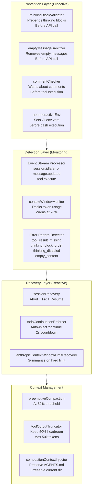
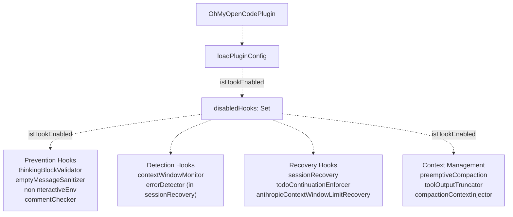
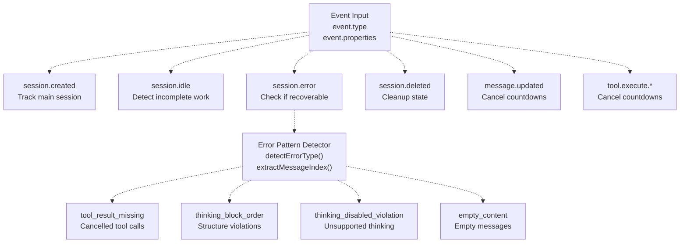
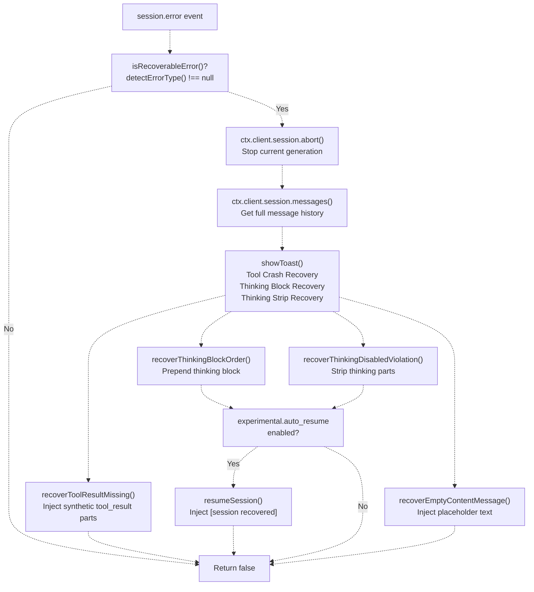
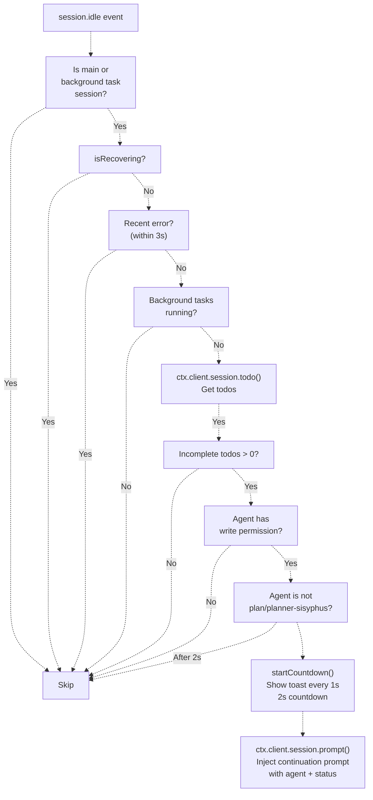
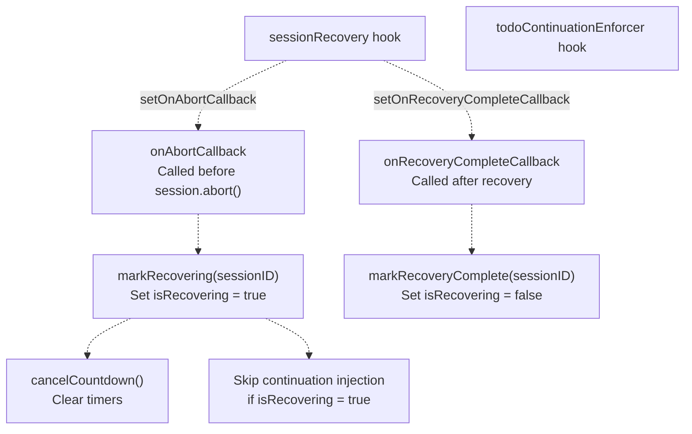
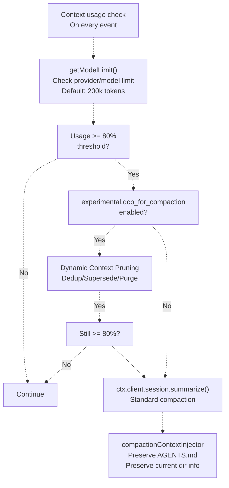
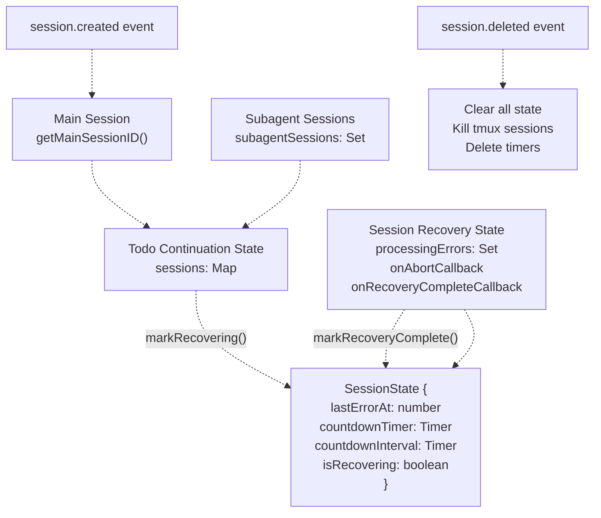

# Reliability System

> **Relevant source files**
> * [assets/oh-my-opencode.schema.json](https://github.com/code-yeongyu/oh-my-opencode/blob/b92cd6ab/assets/oh-my-opencode.schema.json)
> * [src/config/schema.ts](https://github.com/code-yeongyu/oh-my-opencode/blob/b92cd6ab/src/config/schema.ts)
> * [src/hooks/index.ts](https://github.com/code-yeongyu/oh-my-opencode/blob/b92cd6ab/src/hooks/index.ts)
> * [src/hooks/non-interactive-env/constants.ts](https://github.com/code-yeongyu/oh-my-opencode/blob/b92cd6ab/src/hooks/non-interactive-env/constants.ts)
> * [src/hooks/non-interactive-env/detector.ts](https://github.com/code-yeongyu/oh-my-opencode/blob/b92cd6ab/src/hooks/non-interactive-env/detector.ts)
> * [src/hooks/non-interactive-env/index.ts](https://github.com/code-yeongyu/oh-my-opencode/blob/b92cd6ab/src/hooks/non-interactive-env/index.ts)
> * [src/hooks/non-interactive-env/types.ts](https://github.com/code-yeongyu/oh-my-opencode/blob/b92cd6ab/src/hooks/non-interactive-env/types.ts)
> * [src/hooks/session-recovery/index.ts](https://github.com/code-yeongyu/oh-my-opencode/blob/b92cd6ab/src/hooks/session-recovery/index.ts)
> * [src/hooks/session-recovery/storage.ts](https://github.com/code-yeongyu/oh-my-opencode/blob/b92cd6ab/src/hooks/session-recovery/storage.ts)
> * [src/hooks/session-recovery/types.ts](https://github.com/code-yeongyu/oh-my-opencode/blob/b92cd6ab/src/hooks/session-recovery/types.ts)
> * [src/hooks/thinking-block-validator/index.ts](https://github.com/code-yeongyu/oh-my-opencode/blob/b92cd6ab/src/hooks/thinking-block-validator/index.ts)
> * [src/hooks/todo-continuation-enforcer.test.ts](https://github.com/code-yeongyu/oh-my-opencode/blob/b92cd6ab/src/hooks/todo-continuation-enforcer.test.ts)
> * [src/hooks/todo-continuation-enforcer.ts](https://github.com/code-yeongyu/oh-my-opencode/blob/b92cd6ab/src/hooks/todo-continuation-enforcer.ts)
> * [src/index.ts](https://github.com/code-yeongyu/oh-my-opencode/blob/b92cd6ab/src/index.ts)

The Reliability System implements a defense-in-depth architecture to ensure robust agent operation across prevention, detection, and recovery layers. The system prevents errors before they reach the API, monitors for problems during execution, and recovers automatically when failures occur. All reliability hooks are conditionally initialized via the `disabled_hooks` configuration array and integrate seamlessly with the plugin lifecycle.

For details about specific reliability mechanisms, see: [Session Recovery](/code-yeongyu/oh-my-opencode/7.1-session-recovery), [Message Validation](/code-yeongyu/oh-my-opencode/7.2-message-validation), [Todo Continuation Enforcer](/code-yeongyu/oh-my-opencode/7.3-todo-continuation-enforcer), [Context Management Hooks](/code-yeongyu/oh-my-opencode/7.4-context-management-hooks), [Context Injection Hooks](/code-yeongyu/oh-my-opencode/7.5-context-injection-hooks), [Non-Interactive Environment](/code-yeongyu/oh-my-opencode/7.6-non-interactive-environment), and [Other Hooks](/code-yeongyu/oh-my-opencode/7.7-other-hooks).

---

## Defense-in-Depth Architecture

The Reliability System implements three defensive layers that work together to prevent, detect, and recover from failures:

### Reliability Layers Overview



**Sources:** [src/index.ts L238-L306](https://github.com/code-yeongyu/oh-my-opencode/blob/b92cd6ab/src/index.ts#L238-L306)

 [src/hooks/index.ts L1-L25](https://github.com/code-yeongyu/oh-my-opencode/blob/b92cd6ab/src/hooks/index.ts#L1-L25)

### Initialization and Registration

All reliability hooks are initialized in [src/index.ts L238-L306](https://github.com/code-yeongyu/oh-my-opencode/blob/b92cd6ab/src/index.ts#L238-L306)

 during plugin startup. The `isHookEnabled` function at [src/index.ts L222](https://github.com/code-yeongyu/oh-my-opencode/blob/b92cd6ab/src/index.ts#L222-L222)

 checks the `disabled_hooks` configuration to conditionally create each hook:



**Sources:** [src/index.ts L219-L306](https://github.com/code-yeongyu/oh-my-opencode/blob/b92cd6ab/src/index.ts#L219-L306)

 [src/config/schema.ts L45-L68](https://github.com/code-yeongyu/oh-my-opencode/blob/b92cd6ab/src/config/schema.ts#L45-L68)

### Event Dispatch Pipeline

Reliability hooks intercept events at strategic points in the plugin lifecycle to prevent, detect, and recover from failures:

```mermaid
flowchart TD

OpenCodeEvents["OpenCode Events"]
MessagesTransform["experimental.chat.messages.transform<br>(Before API call)"]
ToolBefore["tool.execute.before"]
EventHandler["event handler"]
ToolAfter["tool.execute.after"]
ThinkValidator["thinkingBlockValidator<br>Prepend thinking blocks"]
EmptySanitizer["emptyMessageSanitizer<br>Remove empty messages"]
NonInteractive["nonInteractiveEnv<br>Set CI env vars"]
CommentCheck["commentChecker<br>Warn about comments"]
SessionRecovery["sessionRecovery<br>Detect & fix errors"]
TodoEnforcer["todoContinuationEnforcer<br>Auto-continue tasks"]
ContextMonitor["contextWindowMonitor<br>Track token usage"]
PreemptiveCompact["preemptiveCompaction<br>Trigger at 80%"]
AnthropicLimit["anthropicContextWindowLimitRecovery<br>Handle hard limits"]
ToolTruncator["toolOutputTruncator<br>Truncate outputs"]
EmptyTask["emptyTaskResponseDetector<br>Detect empty responses"]

OpenCodeEvents -.-> MessagesTransform
OpenCodeEvents -.-> ToolBefore
OpenCodeEvents -.-> EventHandler
OpenCodeEvents -.-> ToolAfter
MessagesTransform -.-> ThinkValidator
MessagesTransform -.-> EmptySanitizer
ToolBefore -.-> NonInteractive
ToolBefore -.-> CommentCheck
EventHandler -.-> SessionRecovery
EventHandler -.-> TodoEnforcer
EventHandler -.-> ContextMonitor
EventHandler -.-> PreemptiveCompact
EventHandler -.-> AnthropicLimit
ToolAfter -.-> ToolTruncator
ToolAfter -.-> EmptyTask
```



**Sources:** [src/index.ts L347-L652](https://github.com/code-yeongyu/oh-my-opencode/blob/b92cd6ab/src/index.ts#L347-L652)

Each handler invokes hooks sequentially using async/await, ensuring hooks can perform asynchronous operations like API calls or file I/O before proceeding.

---

## Prevention Layer (Proactive)

The Prevention Layer stops errors before they reach the API through validation and sanitization hooks.

### Message Validation Hooks

| Hook Name | Implementation | Prevention Mechanism |
| --- | --- | --- |
| `thinkingBlockValidator` | [src/hooks/thinking-block-validator/index.ts](https://github.com/code-yeongyu/oh-my-opencode/blob/b92cd6ab/src/hooks/thinking-block-validator/index.ts) | Prepends thinking blocks to assistant messages before API call to prevent "Expected thinking/redacted_thinking but found tool_use" errors |
| `emptyMessageSanitizer` | [src/hooks/empty-message-sanitizer.ts](https://github.com/code-yeongyu/oh-my-opencode/blob/b92cd6ab/src/hooks/empty-message-sanitizer.ts) | Removes messages with empty content arrays before API call to prevent "messages[i].content: Expected array but received []" errors |

**Hook Point:** `experimental.chat.messages.transform` (runs before messages are converted to API format)

**Sources:** [src/index.ts L300-L360](https://github.com/code-yeongyu/oh-my-opencode/blob/b92cd6ab/src/index.ts#L300-L360)

 [src/hooks/thinking-block-validator/index.ts L1-L172](https://github.com/code-yeongyu/oh-my-opencode/blob/b92cd6ab/src/hooks/thinking-block-validator/index.ts#L1-L172)

### Tool Execution Prevention

| Hook Name | Implementation | Prevention Mechanism |
| --- | --- | --- |
| `nonInteractiveEnv` | [src/hooks/non-interactive-env/index.ts](https://github.com/code-yeongyu/oh-my-opencode/blob/b92cd6ab/src/hooks/non-interactive-env/index.ts) | Injects 11+ environment variables (`CI=true`, `DEBIAN_FRONTEND=noninteractive`, etc.) to prevent bash commands from hanging on user input |
| `commentChecker` | [src/hooks/comment-checker.ts](https://github.com/code-yeongyu/oh-my-opencode/blob/b92cd6ab/src/hooks/comment-checker.ts) | Warns agents about leaving TODO comments in code before tool execution completes |

**Hook Points:** `tool.execute.before`, `tool.execute.after`

**Environment Variables Set:** [src/hooks/non-interactive-env/constants.ts L3-L23](https://github.com/code-yeongyu/oh-my-opencode/blob/b92cd6ab/src/hooks/non-interactive-env/constants.ts#L3-L23)

* `CI=true`
* `DEBIAN_FRONTEND=noninteractive`
* `GIT_TERMINAL_PROMPT=0`
* `GIT_EDITOR=true`, `EDITOR=true`, `VISUAL=true` (block interactive editors)
* `GIT_PAGER=cat`, `PAGER=cat` (block pagers)
* `npm_config_yes=true`, `PIP_NO_INPUT=1`, `YARN_ENABLE_IMMUTABLE_INSTALLS=false`

**Banned Commands Detected:** [src/hooks/non-interactive-env/constants.ts L54-L59](https://github.com/code-yeongyu/oh-my-opencode/blob/b92cd6ab/src/hooks/non-interactive-env/constants.ts#L54-L59)

* Editors: `vim`, `nano`, `vi`, `emacs`
* Pagers: `less`, `more`, `man`
* Interactive modes: `git add -p`, `git rebase -i`

**Sources:** [src/index.ts L294-L623](https://github.com/code-yeongyu/oh-my-opencode/blob/b92cd6ab/src/index.ts#L294-L623)

 [src/hooks/non-interactive-env/index.ts L22-L53](https://github.com/code-yeongyu/oh-my-opencode/blob/b92cd6ab/src/hooks/non-interactive-env/index.ts#L22-L53)

 [src/hooks/non-interactive-env/constants.ts L1-L70](https://github.com/code-yeongyu/oh-my-opencode/blob/b92cd6ab/src/hooks/non-interactive-env/constants.ts#L1-L70)

---

## Detection Layer (Monitoring)

The Detection Layer monitors execution in real-time to identify problems early.

### Event Stream Monitoring

The event handler at [src/index.ts L558-L618](https://github.com/code-yeongyu/oh-my-opencode/blob/b92cd6ab/src/index.ts#L558-L618)

 processes all session lifecycle events:



**Sources:** [src/index.ts L558-L618](https://github.com/code-yeongyu/oh-my-opencode/blob/b92cd6ab/src/index.ts#L558-L618)

 [src/hooks/session-recovery/index.ts L125-L147](https://github.com/code-yeongyu/oh-my-opencode/blob/b92cd6ab/src/hooks/session-recovery/index.ts#L125-L147)

### Context Window Monitoring

The `contextWindowMonitor` hook tracks token usage across the session and warns at critical thresholds:

| Threshold | Action |
| --- | --- |
| 70% | Warning toast: "Context window approaching limit" |
| 80% | Triggers preemptive compaction (if enabled) |
| 95% | Anthropic auto-compacts automatically |

**Token Tracking:** The monitor updates on every tool execution via `tool.execute.after` hook.

**Sources:** [src/index.ts L238-L644](https://github.com/code-yeongyu/oh-my-opencode/blob/b92cd6ab/src/index.ts#L238-L644)

### Error Pattern Detection

The session recovery hook implements error detection via string matching at [src/hooks/session-recovery/index.ts L125-L147](https://github.com/code-yeongyu/oh-my-opencode/blob/b92cd6ab/src/hooks/session-recovery/index.ts#L125-L147)

:

```javascript
function detectErrorType(error: unknown): RecoveryErrorType {
  const message = getErrorMessage(error)

  if (message.includes("tool_use") && message.includes("tool_result")) {
    return "tool_result_missing"
  }

  if (
    message.includes("thinking") &&
    (message.includes("first block") ||
      message.includes("must start with") ||
      message.includes("preceeding") ||
      (message.includes("expected") && message.includes("found")))
  ) {
    return "thinking_block_order"
  }

  if (message.includes("thinking is disabled") && message.includes("cannot contain")) {
    return "thinking_disabled_violation"
  }

  return null
}
```

**Sources:** [src/hooks/session-recovery/index.ts L91-L147](https://github.com/code-yeongyu/oh-my-opencode/blob/b92cd6ab/src/hooks/session-recovery/index.ts#L91-L147)

---

## Recovery Layer (Reactive)

The Recovery Layer automatically fixes detected problems through targeted interventions.

### Session Recovery Strategies

The `sessionRecovery` hook implements four recovery strategies:

| Error Type | Detection Pattern | Recovery Strategy | Implementation |
| --- | --- | --- | --- |
| `tool_result_missing` | "tool_use" + "tool_result" in error | Inject synthetic `tool_result` parts with "Operation cancelled by user (ESC pressed)" | [src/hooks/session-recovery/index.ts L153-L192](https://github.com/code-yeongyu/oh-my-opencode/blob/b92cd6ab/src/hooks/session-recovery/index.ts#L153-L192) |
| `thinking_block_order` | "thinking" + "first block"/"must start with" | Prepend thinking block to target message, reuse content from previous turn | [src/hooks/session-recovery/index.ts L194-L223](https://github.com/code-yeongyu/oh-my-opencode/blob/b92cd6ab/src/hooks/session-recovery/index.ts#L194-L223) |
| `thinking_disabled_violation` | "thinking is disabled" + "cannot contain" | Strip all thinking parts from messages | [src/hooks/session-recovery/index.ts L225-L244](https://github.com/code-yeongyu/oh-my-opencode/blob/b92cd6ab/src/hooks/session-recovery/index.ts#L225-L244) |
| `empty_content` | Empty content arrays | Inject placeholder text "[user interrupted]" or replace empty text parts | [src/hooks/session-recovery/index.ts L248-L305](https://github.com/code-yeongyu/oh-my-opencode/blob/b92cd6ab/src/hooks/session-recovery/index.ts#L248-L305) |

**Recovery Flow:**



**Sources:** [src/hooks/session-recovery/index.ts L319-L430](https://github.com/code-yeongyu/oh-my-opencode/blob/b92cd6ab/src/hooks/session-recovery/index.ts#L319-L430)

 [src/index.ts L593-L616](https://github.com/code-yeongyu/oh-my-opencode/blob/b92cd6ab/src/index.ts#L593-L616)

### Todo Continuation Enforcer

The `todoContinuationEnforcer` automatically resumes work when tasks are incomplete:

**Countdown Flow:**



**Continuation Prompt Template:** [src/hooks/todo-continuation-enforcer.ts L38-L44](https://github.com/code-yeongyu/oh-my-opencode/blob/b92cd6ab/src/hooks/todo-continuation-enforcer.ts#L38-L44)

```
[SYSTEM REMINDER - TODO CONTINUATION]

Incomplete tasks remain in your todo list. Continue working on the next pending task.

- Proceed without asking for permission
- Mark each task complete when finished
- Do not stop until all tasks are done
```

**Cancellation Events:**

* `message.updated` (role: user) - User sends new message
* `message.updated` (role: assistant) - Agent starts responding
* `message.part.updated` (role: assistant) - Agent streams response
* `tool.execute.before` / `tool.execute.after` - Tool execution starts
* `session.deleted` - Session is deleted

**Sources:** [src/hooks/todo-continuation-enforcer.ts L1-L377](https://github.com/code-yeongyu/oh-my-opencode/blob/b92cd6ab/src/hooks/todo-continuation-enforcer.ts#L1-L377)

 [src/index.ts L309-L563](https://github.com/code-yeongyu/oh-my-opencode/blob/b92cd6ab/src/index.ts#L309-L563)

### Coordination Between Recovery and Continuation

Session recovery and todo continuation coordinate via callbacks to prevent conflicting behavior:



**Implementation:** [src/index.ts L313-L316](https://github.com/code-yeongyu/oh-my-opencode/blob/b92cd6ab/src/index.ts#L313-L316)

```
if (sessionRecovery && todoContinuationEnforcer) {
  sessionRecovery.setOnAbortCallback(todoContinuationEnforcer.markRecovering);
  sessionRecovery.setOnRecoveryCompleteCallback(todoContinuationEnforcer.markRecoveryComplete);
}
```

**Sources:** [src/index.ts L313-L316](https://github.com/code-yeongyu/oh-my-opencode/blob/b92cd6ab/src/index.ts#L313-L316)

 [src/hooks/todo-continuation-enforcer.ts L124-L137](https://github.com/code-yeongyu/oh-my-opencode/blob/b92cd6ab/src/hooks/todo-continuation-enforcer.ts#L124-L137)

 [src/hooks/session-recovery/index.ts L312-L420](https://github.com/code-yeongyu/oh-my-opencode/blob/b92cd6ab/src/hooks/session-recovery/index.ts#L312-L420)

---

## Context Management System

Context management hooks prevent token limit errors through proactive truncation and compaction.

### Preemptive Compaction

Triggers automatic summarization at configurable threshold (default 80%):



**Configuration Options:** [src/config/schema.ts L163-L176](https://github.com/code-yeongyu/oh-my-opencode/blob/b92cd6ab/src/config/schema.ts#L163-L176)

* `experimental.preemptive_compaction` (boolean, default: true)
* `experimental.preemptive_compaction_threshold` (number, 0.5-0.95, default: 0.80)
* `experimental.dcp_for_compaction` (boolean, default: false)

**Sources:** [src/index.ts L273-L277](https://github.com/code-yeongyu/oh-my-opencode/blob/b92cd6ab/src/index.ts#L273-L277)

 [src/hooks/preemptive-compaction.ts](https://github.com/code-yeongyu/oh-my-opencode/blob/b92cd6ab/src/hooks/preemptive-compaction.ts)

### Tool Output Truncation

Dynamically truncates tool outputs to maintain 50% context headroom:

**Truncatable Tools:** [src/hooks/tool-output-truncator.ts L5-L19](https://github.com/code-yeongyu/oh-my-opencode/blob/b92cd6ab/src/hooks/tool-output-truncator.ts#L5-L19)

* `safe_grep`, `glob`, `Glob`, `safe_glob`
* `lsp_find_references`, `lsp_document_symbols`, `lsp_workspace_symbols`, `lsp_diagnostics`
* `ast_grep_search`
* `interactive_bash`, `Interactive_bash`

**Truncation Strategy:**

1. Get current context usage from `contextWindowMonitor`
2. Calculate max safe output size: `(limit - usage) * 0.5`
3. If output exceeds max, truncate to max tokens (capped at 50k)
4. Append warning message with truncation stats

**Whitelist Mode:** If `experimental.truncate_all_tool_outputs=false`, only listed tools are truncated.

**Sources:** [src/hooks/tool-output-truncator.ts L1-L41](https://github.com/code-yeongyu/oh-my-opencode/blob/b92cd6ab/src/hooks/tool-output-truncator.ts#L1-L41)

 [src/index.ts L251-L643](https://github.com/code-yeongyu/oh-my-opencode/blob/b92cd6ab/src/index.ts#L251-L643)

### Anthropic Context Window Limit Recovery

Handles hard context limit errors from Anthropic API:

**Detection:** Monitors for "context window limit" or "prompt is too long" in error messages.

**Response:** Automatically triggers `ctx.client.session.summarize()` to compact the session history.

**Sources:** [src/index.ts L269-L569](https://github.com/code-yeongyu/oh-my-opencode/blob/b92cd6ab/src/index.ts#L269-L569)

 [src/hooks/anthropic-context-window-limit-recovery.ts](https://github.com/code-yeongyu/oh-my-opencode/blob/b92cd6ab/src/hooks/anthropic-context-window-limit-recovery.ts)

### Compaction Context Injector

Preserves critical context during summarization:

**Injected Content:**

1. **AGENTS.md** - Complete agent documentation from directory tree walk
2. **Current Directory Info** - Working directory and project structure
3. **Session Metadata** - Agent name, model, and session ID

**Hook Point:** `onBeforeSummarize` callback in preemptive compaction

**Sources:** [src/index.ts L272-L276](https://github.com/code-yeongyu/oh-my-opencode/blob/b92cd6ab/src/index.ts#L272-L276)

 [src/hooks/compaction-context-injector.ts](https://github.com/code-yeongyu/oh-my-opencode/blob/b92cd6ab/src/hooks/compaction-context-injector.ts)

---

## Session State Management

### Session State Tracking

The reliability system maintains per-session state to coordinate recovery and continuation:



**Main Session Registration:** [src/index.ts L577-L584](https://github.com/code-yeongyu/oh-my-opencode/blob/b92cd6ab/src/index.ts#L577-L584)

```typescript
if (event.type === "session.created") {
  const sessionInfo = props?.info as { id?: string; parentID?: string } | undefined;
  if (!sessionInfo?.parentID) {
    setMainSession(sessionInfo?.id);
  }
}
```

**Subagent Session Tracking:** Background tasks register themselves in `subagentSessions` set for continuation eligibility.

**Sources:** [src/features/claude-code-session-state.ts](https://github.com/code-yeongyu/oh-my-opencode/blob/b92cd6ab/src/features/claude-code-session-state.ts)

 [src/hooks/todo-continuation-enforcer.ts L31-L103](https://github.com/code-yeongyu/oh-my-opencode/blob/b92cd6ab/src/hooks/todo-continuation-enforcer.ts#L31-L103)

 [src/index.ts L577-L591](https://github.com/code-yeongyu/oh-my-opencode/blob/b92cd6ab/src/index.ts#L577-L591)

### State Cleanup on Session Deletion

Multiple hooks perform cleanup when sessions are deleted:

| Hook | Cleanup Actions |
| --- | --- |
| `todoContinuationEnforcer` | Clear countdown timers, remove session state |
| `interactiveBashSession` | Kill all tracked tmux sessions, delete state file |
| `sessionRecovery` | Remove from processing set |

**Implementation:** [src/hooks/todo-continuation-enforcer.ts L362-L368](https://github.com/code-yeongyu/oh-my-opencode/blob/b92cd6ab/src/hooks/todo-continuation-enforcer.ts#L362-L368)

```typescript
if (event.type === "session.deleted") {
  const sessionInfo = props?.info as { id?: string } | undefined;
  if (sessionInfo?.id) {
    cleanup(sessionInfo.id);
    log(`[${HOOK_NAME}] Session deleted: cleaned up`, { sessionID: sessionInfo.id });
  }
}
```

**Sources:** [src/hooks/todo-continuation-enforcer.ts L119-L368](https://github.com/code-yeongyu/oh-my-opencode/blob/b92cd6ab/src/hooks/todo-continuation-enforcer.ts#L119-L368)

 [src/hooks/interactive-bash-session/index.ts L169-L181](https://github.com/code-yeongyu/oh-my-opencode/blob/b92cd6ab/src/hooks/interactive-bash-session/index.ts#L169-L181)

---

## Reliability Configuration

### Disabling Reliability Hooks

Individual reliability hooks can be disabled via the `disabled_hooks` array:

```
{
  "disabled_hooks": [
    "session-recovery",           // Disable automatic error recovery
    "todo-continuation-enforcer", // Disable automatic task continuation
    "thinking-block-validator",   // Disable proactive thinking validation
    "empty-message-sanitizer",    // Disable empty message removal
    "non-interactive-env",        // Disable bash environment injection
    "tool-output-truncator",      // Disable output truncation
    "context-window-monitor"      // Disable token tracking
  ]
}
```

**Configuration Hierarchy:**

1. User-level: `~/.config/opencode/oh-my-opencode.json`
2. Project-level: `.opencode/oh-my-opencode.json` (overrides user-level)

**Sources:** [src/index.ts L189-L217](https://github.com/code-yeongyu/oh-my-opencode/blob/b92cd6ab/src/index.ts#L189-L217)

 [src/config/schema.ts L45-L68](https://github.com/code-yeongyu/oh-my-opencode/blob/b92cd6ab/src/config/schema.ts#L45-L68)

### Experimental Reliability Features

Advanced reliability features are controlled via the `experimental` configuration object:

```python
{
  "experimental": {
    // Session Recovery
    "auto_resume": false,  // Auto-inject "continue" after recovery (default: false)
    
    // Context Management
    "aggressive_truncation": false,  // Truncate all tools, not just whitelist (default: false)
    "preemptive_compaction": true,   // Enable preemptive compaction (default: true)
    "preemptive_compaction_threshold": 0.80,  // Trigger at 80% usage (default: 0.80)
    "truncate_all_tool_outputs": true,  // Truncate all tools vs whitelist (default: true)
    "dcp_for_compaction": false,  // Use DCP before summarization (default: false)
    
    // Dynamic Context Pruning
    "dynamic_context_pruning": {
      "enabled": false,  // Enable DCP (default: false)
      "notification": "detailed",  // Notification level: off/minimal/detailed
      "turn_protection": {
        "enabled": true,  // Protect recent turns from pruning (default: true)
        "turns": 3  // Number of turns to protect (default: 3)
      },
      "protected_tools": [
        "task", "todowrite", "todoread",
        "lsp_rename", "lsp_code_action_resolve",
        "session_read", "session_write", "session_search"
      ],
      "strategies": {
        "deduplication": { "enabled": true },  // Remove duplicate tool calls
        "supersede_writes": { 
          "enabled": true,
          "aggressive": false  // Prune any write if ANY subsequent read
        },
        "purge_errors": { 
          "enabled": true,
          "turns": 5  // Prune errored tools after 5 turns
        }
      }
    }
  }
}
```

**Schema Definition:** [src/config/schema.ts L163-L176](https://github.com/code-yeongyu/oh-my-opencode/blob/b92cd6ab/src/config/schema.ts#L163-L176)

**Sources:** [src/config/schema.ts L127-L176](https://github.com/code-yeongyu/oh-my-opencode/blob/b92cd6ab/src/config/schema.ts#L127-L176)

 [src/index.ts L242-L274](https://github.com/code-yeongyu/oh-my-opencode/blob/b92cd6ab/src/index.ts#L242-L274)

### Hook Name Schema

All reliability hook names are validated against `HookNameSchema`:

**Core Reliability Hooks:** [src/config/schema.ts L45-L68](https://github.com/code-yeongyu/oh-my-opencode/blob/b92cd6ab/src/config/schema.ts#L45-L68)

* `session-recovery`
* `todo-continuation-enforcer`
* `context-window-monitor`
* `tool-output-truncator`
* `empty-message-sanitizer`
* `thinking-block-validator`
* `non-interactive-env`
* `anthropic-context-window-limit-recovery`

**Sources:** [src/config/schema.ts L45-L68](https://github.com/code-yeongyu/oh-my-opencode/blob/b92cd6ab/src/config/schema.ts#L45-L68)

 [assets/oh-my-opencode.schema.json L37-L64](https://github.com/code-yeongyu/oh-my-opencode/blob/b92cd6ab/assets/oh-my-opencode.schema.json#L37-L64)

---

## Reliability Metrics and Observability

### Logging and Debugging

All reliability hooks use the centralized logger at [src/shared/logger.ts](https://github.com/code-yeongyu/oh-my-opencode/blob/b92cd6ab/src/shared/logger.ts)

 with structured context:

```yaml
log(`[${HOOK_NAME}] Event description`, {
  sessionID: "sess_123",
  additionalContext: value
})
```

**Log Examples:**

**Todo Continuation Enforcer:**

```
log(`[todo-continuation-enforcer] Countdown started`, { 
  sessionID, seconds: 2, incompleteCount 
})
log(`[todo-continuation-enforcer] Injection successful`, { sessionID })
log(`[todo-continuation-enforcer] Skipped: in recovery`, { sessionID })
```

**Session Recovery:**

```
console.error("[session-recovery] Recovery failed:", err)
```

**Non-Interactive Environment:**

```yaml
log(`[non-interactive-env] Set non-interactive environment variables`, {
  sessionID: input.sessionID,
  env: NON_INTERACTIVE_ENV,
})
```

**Sources:** [src/hooks/todo-continuation-enforcer.ts L128-L218](https://github.com/code-yeongyu/oh-my-opencode/blob/b92cd6ab/src/hooks/todo-continuation-enforcer.ts#L128-L218)

 [src/hooks/session-recovery/index.ts L412](https://github.com/code-yeongyu/oh-my-opencode/blob/b92cd6ab/src/hooks/session-recovery/index.ts#L412-L412)

 [src/hooks/non-interactive-env/index.ts L47-L50](https://github.com/code-yeongyu/oh-my-opencode/blob/b92cd6ab/src/hooks/non-interactive-env/index.ts#L47-L50)

### Toast Notifications

Reliability hooks display user-facing notifications for important events:

| Hook | Notification | Variant | Duration |
| --- | --- | --- | --- |
| `sessionRecovery` | "Tool Crash Recovery: Injecting cancelled tool results..." | warning | 3000ms |
| `sessionRecovery` | "Thinking Block Recovery: Fixing message structure..." | warning | 3000ms |
| `sessionRecovery` | "Thinking Strip Recovery: Stripping thinking blocks..." | warning | 3000ms |
| `todoContinuationEnforcer` | "Todo Continuation: Resuming in 2s... (N tasks remaining)" | warning | 900ms |
| `contextWindowMonitor` | "Context window approaching limit (70%)" | warning | varies |

**Implementation:** All toasts use `ctx.client.tui.showToast()` with error suppression via `.catch(() => {})`.

**Sources:** [src/hooks/session-recovery/index.ts L368-L388](https://github.com/code-yeongyu/oh-my-opencode/blob/b92cd6ab/src/hooks/session-recovery/index.ts#L368-L388)

 [src/hooks/todo-continuation-enforcer.ts L139-L148](https://github.com/code-yeongyu/oh-my-opencode/blob/b92cd6ab/src/hooks/todo-continuation-enforcer.ts#L139-L148)

---

## Reliability Hook Integration Patterns

### Hook Callback Interface

Reliability hooks that need inter-hook coordination implement callback setters:

```typescript
export interface SessionRecoveryHook {
  handleSessionRecovery: (info: MessageInfo) => Promise<boolean>
  isRecoverableError: (error: unknown) => boolean
  setOnAbortCallback: (callback: (sessionID: string) => void) => void
  setOnRecoveryCompleteCallback: (callback: (sessionID: string) => void) => void
}
```

**Callback Registration:** [src/index.ts L313-L316](https://github.com/code-yeongyu/oh-my-opencode/blob/b92cd6ab/src/index.ts#L313-L316)

```
if (sessionRecovery && todoContinuationEnforcer) {
  sessionRecovery.setOnAbortCallback(todoContinuationEnforcer.markRecovering);
  sessionRecovery.setOnRecoveryCompleteCallback(todoContinuationEnforcer.markRecoveryComplete);
}
```

**Sources:** [src/hooks/session-recovery/index.ts L312-L331](https://github.com/code-yeongyu/oh-my-opencode/blob/b92cd6ab/src/hooks/session-recovery/index.ts#L312-L331)

 [src/index.ts L313-L316](https://github.com/code-yeongyu/oh-my-opencode/blob/b92cd6ab/src/index.ts#L313-L316)

### Shared State Access

Reliability hooks access shared state via centralized modules:

**Session State:** [src/features/claude-code-session-state.ts](https://github.com/code-yeongyu/oh-my-opencode/blob/b92cd6ab/src/features/claude-code-session-state.ts)

```javascript
import { getMainSessionID, subagentSessions } from "../features/claude-code-session-state"

const mainSessionID = getMainSessionID()
const isBackgroundTask = subagentSessions.has(sessionID)
```

**Message Storage:** [src/features/hook-message-injector.ts](https://github.com/code-yeongyu/oh-my-opencode/blob/b92cd6ab/src/features/hook-message-injector.ts)

```javascript
import { MESSAGE_STORAGE, findNearestMessageWithFields } from "../features/hook-message-injector"

const messageDir = getMessageDir(sessionID)
const prevMessage = findNearestMessageWithFields(messageDir)
```

**Sources:** [src/hooks/todo-continuation-enforcer.ts L4-L196](https://github.com/code-yeongyu/oh-my-opencode/blob/b92cd6ab/src/hooks/todo-continuation-enforcer.ts#L4-L196)

 [src/hooks/session-recovery/storage.ts L1-L28](https://github.com/code-yeongyu/oh-my-opencode/blob/b92cd6ab/src/hooks/session-recovery/storage.ts#L1-L28)

---

## File-Level Architecture Map

The reliability system is implemented across multiple files with clear separation of concerns:

### Core Hook Implementations

| File Path | Reliability Layer | Primary Responsibility |
| --- | --- | --- |
| [src/hooks/thinking-block-validator/index.ts L1-L172](https://github.com/code-yeongyu/oh-my-opencode/blob/b92cd6ab/src/hooks/thinking-block-validator/index.ts#L1-L172) | Prevention | Validate and fix thinking block ordering before API call |
| [src/hooks/empty-message-sanitizer.ts](https://github.com/code-yeongyu/oh-my-opencode/blob/b92cd6ab/src/hooks/empty-message-sanitizer.ts) | Prevention | Remove empty messages before API call |
| [src/hooks/non-interactive-env/index.ts L22-L53](https://github.com/code-yeongyu/oh-my-opencode/blob/b92cd6ab/src/hooks/non-interactive-env/index.ts#L22-L53) | Prevention | Inject environment variables to prevent bash hangs |
| [src/hooks/session-recovery/index.ts L1-L430](https://github.com/code-yeongyu/oh-my-opencode/blob/b92cd6ab/src/hooks/session-recovery/index.ts#L1-L430) | Recovery | Detect and recover from 4 error types |
| [src/hooks/session-recovery/storage.ts L1-L391](https://github.com/code-yeongyu/oh-my-opencode/blob/b92cd6ab/src/hooks/session-recovery/storage.ts#L1-L391) | Recovery | File system operations for message manipulation |
| [src/hooks/todo-continuation-enforcer.ts L1-L377](https://github.com/code-yeongyu/oh-my-opencode/blob/b92cd6ab/src/hooks/todo-continuation-enforcer.ts#L1-L377) | Recovery | Automatic task continuation with countdown |
| [src/hooks/context-window-monitor.ts](https://github.com/code-yeongyu/oh-my-opencode/blob/b92cd6ab/src/hooks/context-window-monitor.ts) | Detection | Track token usage and warn at thresholds |
| [src/hooks/tool-output-truncator.ts L1-L41](https://github.com/code-yeongyu/oh-my-opencode/blob/b92cd6ab/src/hooks/tool-output-truncator.ts#L1-L41) | Context Mgmt | Dynamic output truncation |
| [src/hooks/preemptive-compaction.ts](https://github.com/code-yeongyu/oh-my-opencode/blob/b92cd6ab/src/hooks/preemptive-compaction.ts) | Context Mgmt | Trigger compaction at 80% threshold |
| [src/hooks/anthropic-context-window-limit-recovery.ts](https://github.com/code-yeongyu/oh-my-opencode/blob/b92cd6ab/src/hooks/anthropic-context-window-limit-recovery.ts) | Recovery | Handle Anthropic hard limits |
| [src/hooks/compaction-context-injector.ts](https://github.com/code-yeongyu/oh-my-opencode/blob/b92cd6ab/src/hooks/compaction-context-injector.ts) | Context Mgmt | Preserve context during summarization |

**Sources:** Files listed above

### Configuration and Schema

| File Path | Purpose |
| --- | --- |
| [src/config/schema.ts L45-L68](https://github.com/code-yeongyu/oh-my-opencode/blob/b92cd6ab/src/config/schema.ts#L45-L68) | `HookNameSchema` - Valid hook names |
| [src/config/schema.ts L127-L176](https://github.com/code-yeongyu/oh-my-opencode/blob/b92cd6ab/src/config/schema.ts#L127-L176) | `ExperimentalConfigSchema` - Reliability feature flags |
| [assets/oh-my-opencode.schema.json L37-L64](https://github.com/code-yeongyu/oh-my-opencode/blob/b92cd6ab/assets/oh-my-opencode.schema.json#L37-L64) | JSON schema for IDE validation |

**Sources:** [src/config/schema.ts](https://github.com/code-yeongyu/oh-my-opencode/blob/b92cd6ab/src/config/schema.ts)

 [assets/oh-my-opencode.schema.json](https://github.com/code-yeongyu/oh-my-opencode/blob/b92cd6ab/assets/oh-my-opencode.schema.json)

### Supporting Infrastructure

| File Path | Purpose |
| --- | --- |
| [src/features/claude-code-session-state.ts](https://github.com/code-yeongyu/oh-my-opencode/blob/b92cd6ab/src/features/claude-code-session-state.ts) | Main session tracking and subagent registration |
| [src/features/hook-message-injector.ts](https://github.com/code-yeongyu/oh-my-opencode/blob/b92cd6ab/src/features/hook-message-injector.ts) | Message storage paths and field extraction |
| [src/shared/logger.ts](https://github.com/code-yeongyu/oh-my-opencode/blob/b92cd6ab/src/shared/logger.ts) | Centralized structured logging |
| [src/shared/dynamic-truncator.ts](https://github.com/code-yeongyu/oh-my-opencode/blob/b92cd6ab/src/shared/dynamic-truncator.ts) | Token-aware truncation algorithm |

**Sources:** Files listed above

---

## Summary Table: All Built-in Hooks

| Hook Name | Category | Event Type | Primary Function |
| --- | --- | --- | --- |
| `todo-continuation-enforcer` | Quality | `session.idle`, `session.error`, `message.updated`, `session.deleted` | Injects continuation prompts for incomplete TODOs |
| `context-window-monitor` | Quality | `event`, `tool.execute.after` | Tracks token usage and warns at 70% |
| `comment-checker` | Quality | `tool.execute.before`, `tool.execute.after` | Validates code comments |
| `empty-task-response-detector` | Quality | `tool.execute.after` | Detects empty Task tool responses |
| `tool-output-truncator` | Tool Mgmt | `tool.execute.after` | Truncates output from grep, glob, LSP, AST tools |
| `grep-output-truncator` | Tool Mgmt | `tool.execute.after` | Specialized grep truncation |
| `non-interactive-env` | Tool Mgmt | `tool.execute.before` | Adapts bash for non-interactive mode |
| `interactive-bash-session` | Tool Mgmt | `tool.execute.after`, `event` | Tracks tmux sessions and cleanup |
| `directory-agents-injector` | Context | `event`, `tool.execute.after` | Injects AGENTS.md files |
| `directory-readme-injector` | Context | `event`, `tool.execute.after` | Injects README.md files |
| `rules-injector` | Context | `event`, `tool.execute.after` | Conditionally injects .claude/rules/ |
| `session-recovery` | Session | `event` (session.error) | Detects and recovers from 4 error types |
| `session-notification` | Session | `event` (session.idle) | Sends OS notifications |
| `background-notification` | Session | `event` (session.idle) | Notifies about background task completion |
| `keyword-detector` | UX | `chat.message`, `event` | Detects "ultrawork", "ultrathink" keywords |
| `agent-usage-reminder` | UX | `event`, `tool.execute.after` | Suggests using specialized agents |
| `auto-update-checker` | UX | `event` | Checks npm for updates |
| `startup-toast` | UX | (via auto-update-checker) | Shows welcome message |
| `claude-code-hooks` | Integration | `chat.message`, `event`, `tool.execute.before`, `tool.execute.after` | Executes external scripts |
| `think-mode` | Advanced | `event` | Activates extended thinking |
| `anthropic-auto-compact` | Advanced | `event` | Auto-compacts Claude sessions |

**Sources:** [src/config/schema.ts L44-L65](https://github.com/code-yeongyu/oh-my-opencode/blob/b92cd6ab/src/config/schema.ts#L44-L65)

 [src/index.ts L185-L248](https://github.com/code-yeongyu/oh-my-opencode/blob/b92cd6ab/src/index.ts#L185-L248)

 [src/hooks/index.ts L1-L22](https://github.com/code-yeongyu/oh-my-opencode/blob/b92cd6ab/src/hooks/index.ts#L1-L22)