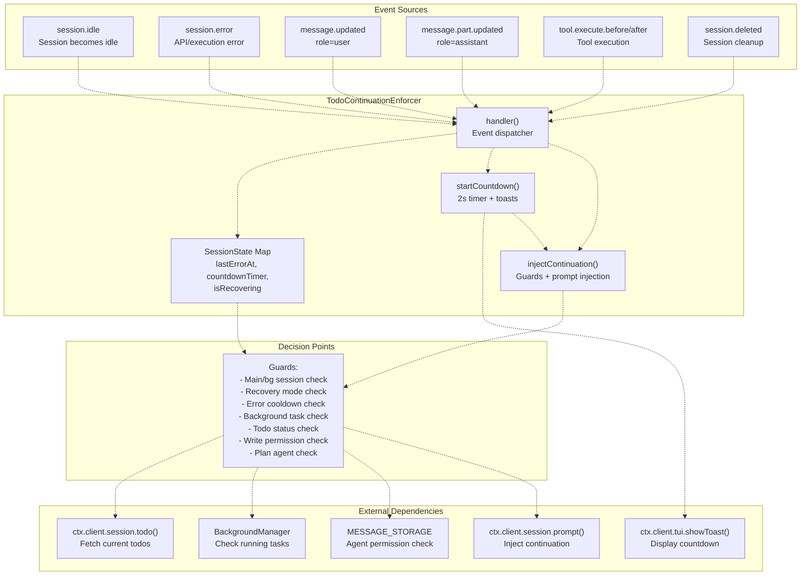
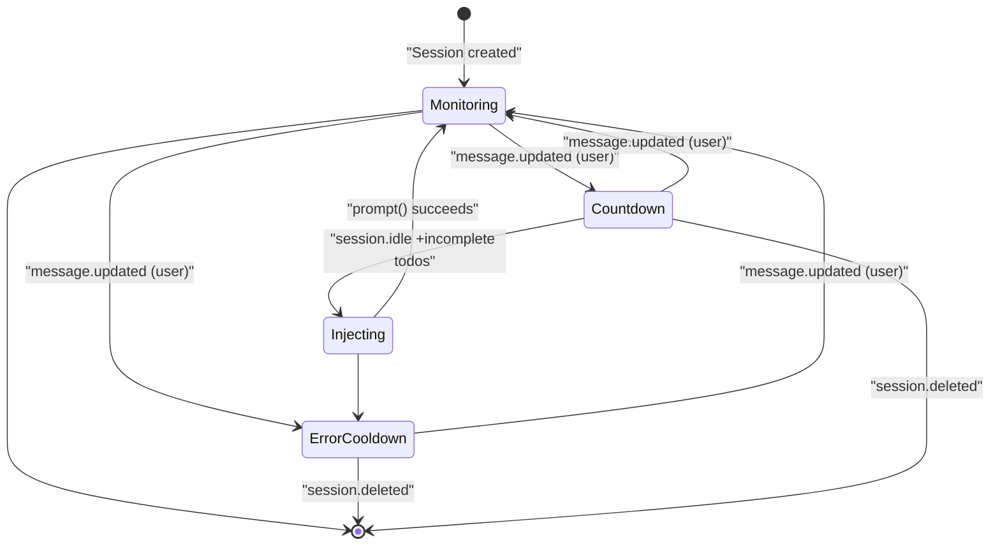
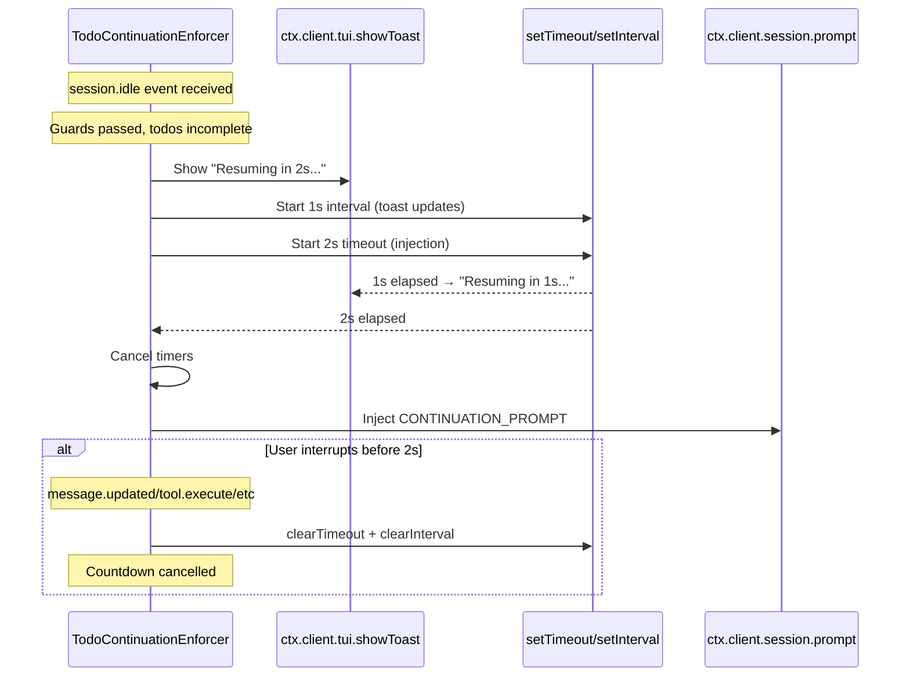
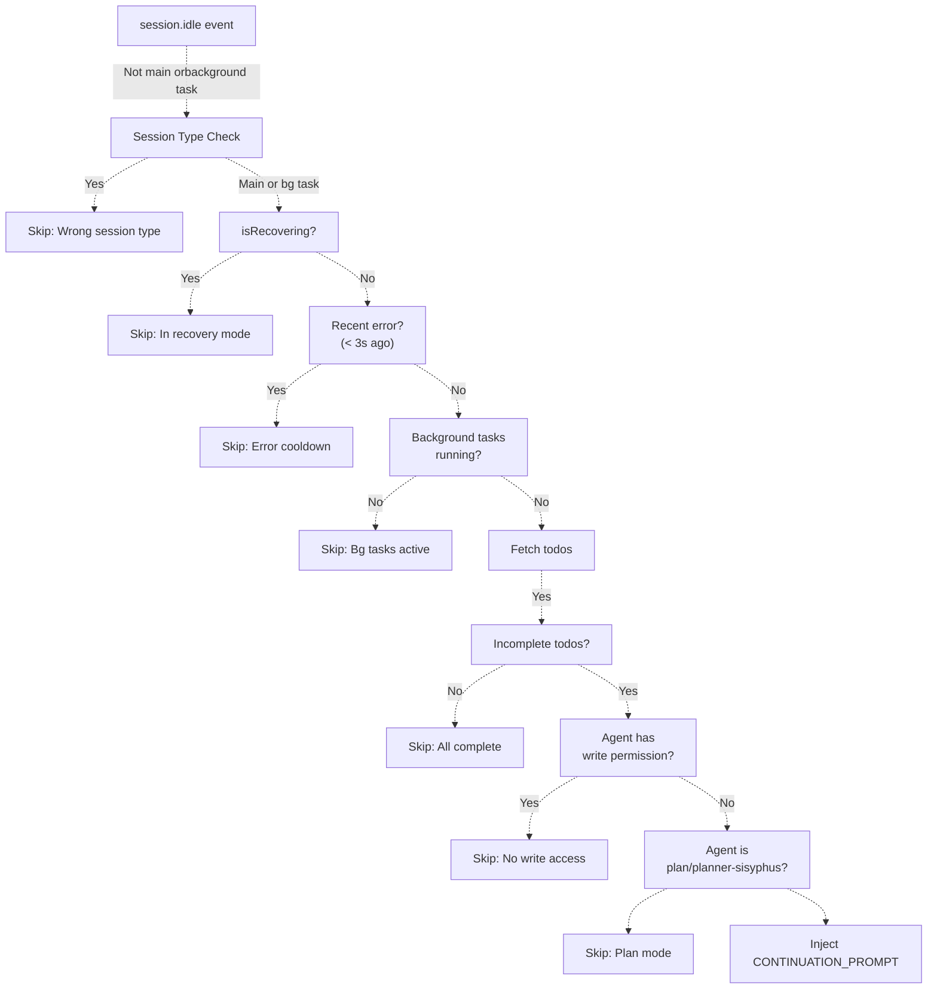
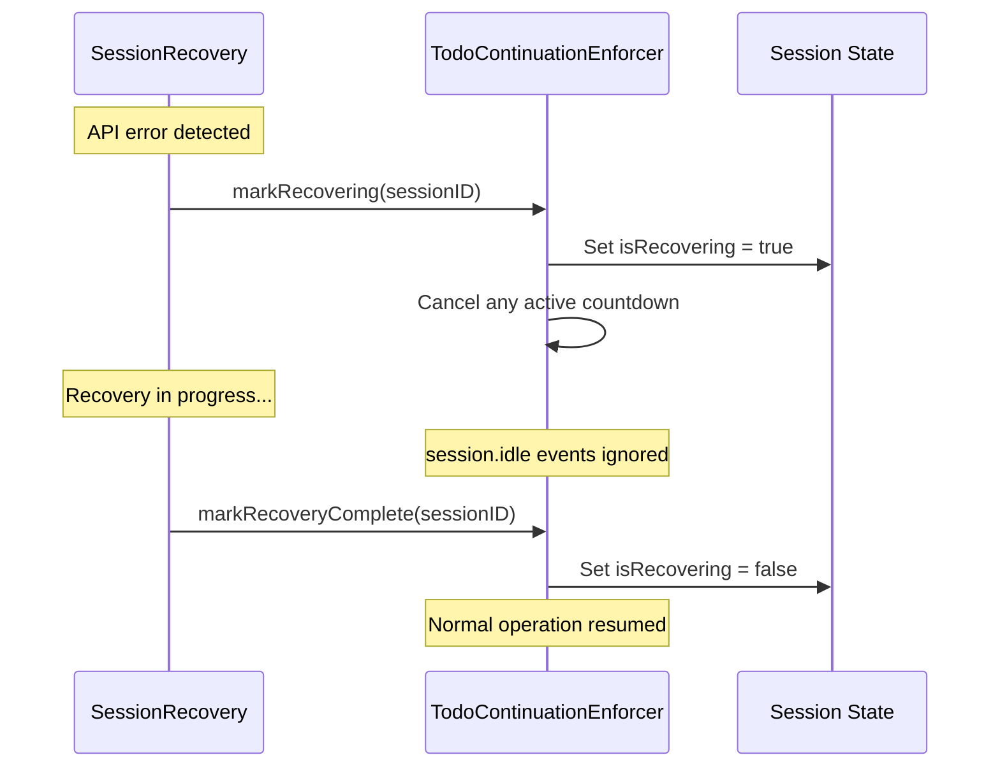
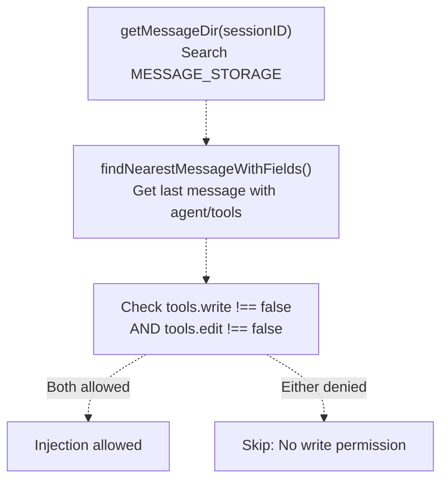
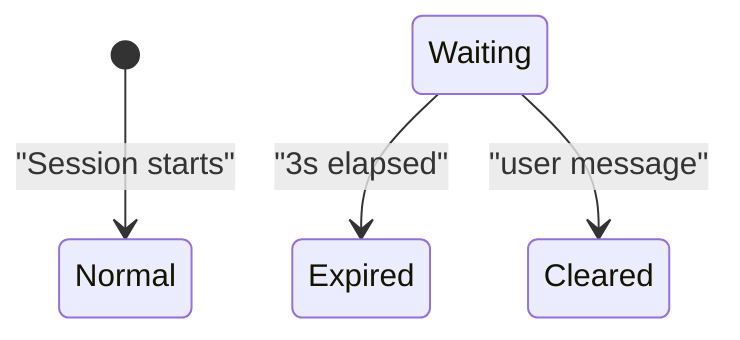

# Todo Continuation Enforcer

> **Relevant source files**
> * [src/hooks/non-interactive-env/constants.ts](https://github.com/code-yeongyu/oh-my-opencode/blob/b92cd6ab/src/hooks/non-interactive-env/constants.ts)
> * [src/hooks/non-interactive-env/detector.ts](https://github.com/code-yeongyu/oh-my-opencode/blob/b92cd6ab/src/hooks/non-interactive-env/detector.ts)
> * [src/hooks/non-interactive-env/index.ts](https://github.com/code-yeongyu/oh-my-opencode/blob/b92cd6ab/src/hooks/non-interactive-env/index.ts)
> * [src/hooks/non-interactive-env/types.ts](https://github.com/code-yeongyu/oh-my-opencode/blob/b92cd6ab/src/hooks/non-interactive-env/types.ts)
> * [src/hooks/todo-continuation-enforcer.test.ts](https://github.com/code-yeongyu/oh-my-opencode/blob/b92cd6ab/src/hooks/todo-continuation-enforcer.test.ts)
> * [src/hooks/todo-continuation-enforcer.ts](https://github.com/code-yeongyu/oh-my-opencode/blob/b92cd6ab/src/hooks/todo-continuation-enforcer.ts)

## Purpose and Scope

The Todo Continuation Enforcer is an automatic task completion system that monitors session idle events and injects continuation prompts when incomplete todos remain. This hook ensures agents complete multi-step tasks without manual user intervention by automatically prompting "continue" after a 2-second countdown when the session becomes idle.

This page documents the enforcer's event-driven architecture, countdown system, session state management, and coordination mechanisms. For information about Sisyphus's todo management workflow rules, see [Todo Management](/code-yeongyu/oh-my-opencode/4.1.2-todo-management). For session recovery error handling, see [Session Recovery](/code-yeongyu/oh-my-opencode/7.1-session-recovery).

**Sources:** [src/hooks/todo-continuation-enforcer.ts L1-L378](https://github.com/code-yeongyu/oh-my-opencode/blob/b92cd6ab/src/hooks/todo-continuation-enforcer.ts#L1-L378)

## System Overview

The Todo Continuation Enforcer operates as a passive monitor that listens to session lifecycle events and intervenes only when specific conditions are met: the session is idle, todos are incomplete, and no conflicting operations are in progress.



**Sources:** [src/hooks/todo-continuation-enforcer.ts L89-L377](https://github.com/code-yeongyu/oh-my-opencode/blob/b92cd6ab/src/hooks/todo-continuation-enforcer.ts#L89-L377)

## Core Components

### Factory Function

The `createTodoContinuationEnforcer` factory creates an enforcer instance with optional background manager integration:

| Parameter | Type | Purpose |
| --- | --- | --- |
| `ctx` | `PluginInput` | OpenCode plugin context for API access |
| `options.backgroundManager` | `BackgroundManager?` | Optional integration to check running background tasks |

**Returns:** Object with `handler`, `markRecovering`, and `markRecoveryComplete` methods.

**Sources:** [src/hooks/todo-continuation-enforcer.ts L89-L92](https://github.com/code-yeongyu/oh-my-opencode/blob/b92cd6ab/src/hooks/todo-continuation-enforcer.ts#L89-L92)

### Session State Structure

Each monitored session maintains state tracking:

```sql
interface SessionState {
  lastErrorAt?: number          // Timestamp of last error (for cooldown)
  countdownTimer?: ReturnType<typeof setTimeout>  // 2s injection timer
  countdownInterval?: ReturnType<typeof setInterval>  // 1s toast update interval
  isRecovering?: boolean        // Recovery coordination flag
}
```

The state map is stored in memory per enforcer instance and cleaned up when sessions are deleted.

**Sources:** [src/hooks/todo-continuation-enforcer.ts L31-L36](https://github.com/code-yeongyu/oh-my-opencode/blob/b92cd6ab/src/hooks/todo-continuation-enforcer.ts#L31-L36)

 [src/hooks/todo-continuation-enforcer.ts L94-L103](https://github.com/code-yeongyu/oh-my-opencode/blob/b92cd6ab/src/hooks/todo-continuation-enforcer.ts#L94-L103)

## Event Flow Architecture

The enforcer's event handling follows a state machine pattern:



### Event Handler Dispatch Table

| Event Type | Action | State Modification |
| --- | --- | --- |
| `session.idle` | Check guards → start countdown | None (countdown managed separately) |
| `session.error` | Record error timestamp, cancel countdown | `lastErrorAt = Date.now()` |
| `message.updated` (user) | Clear error state, cancel countdown | `lastErrorAt = undefined` |
| `message.updated` (assistant) | Cancel countdown | None |
| `message.part.updated` (assistant) | Cancel countdown | None |
| `tool.execute.before` | Cancel countdown | None |
| `tool.execute.after` | Cancel countdown | None |
| `session.deleted` | Cleanup timers and state | Session removed from map |

**Sources:** [src/hooks/todo-continuation-enforcer.ts L246-L370](https://github.com/code-yeongyu/oh-my-opencode/blob/b92cd6ab/src/hooks/todo-continuation-enforcer.ts#L246-L370)

## Countdown System

### Countdown Lifecycle

When `session.idle` passes all guards, a 2-second countdown begins:



**Constants:**

* `COUNTDOWN_SECONDS = 2`: Time before injection [src/hooks/todo-continuation-enforcer.ts L46](https://github.com/code-yeongyu/oh-my-opencode/blob/b92cd6ab/src/hooks/todo-continuation-enforcer.ts#L46-L46)
* `TOAST_DURATION_MS = 900`: How long each toast displays [src/hooks/todo-continuation-enforcer.ts L47](https://github.com/code-yeongyu/oh-my-opencode/blob/b92cd6ab/src/hooks/todo-continuation-enforcer.ts#L47-L47)

**Sources:** [src/hooks/todo-continuation-enforcer.ts L224-L244](https://github.com/code-yeongyu/oh-my-opencode/blob/b92cd6ab/src/hooks/todo-continuation-enforcer.ts#L224-L244)

 [src/hooks/todo-continuation-enforcer.ts L139-L148](https://github.com/code-yeongyu/oh-my-opencode/blob/b92cd6ab/src/hooks/todo-continuation-enforcer.ts#L139-L148)

### Cancellation Triggers

The countdown is cancelled immediately when any of these events occur:

1. **User Activity**: `message.updated` with `role="user"` [src/hooks/todo-continuation-enforcer.ts L328-L335](https://github.com/code-yeongyu/oh-my-opencode/blob/b92cd6ab/src/hooks/todo-continuation-enforcer.ts#L328-L335)
2. **Assistant Activity**: `message.updated` or `message.part.updated` with `role="assistant"` [src/hooks/todo-continuation-enforcer.ts L337-L351](https://github.com/code-yeongyu/oh-my-opencode/blob/b92cd6ab/src/hooks/todo-continuation-enforcer.ts#L337-L351)
3. **Tool Execution**: `tool.execute.before` or `tool.execute.after` [src/hooks/todo-continuation-enforcer.ts L354-L360](https://github.com/code-yeongyu/oh-my-opencode/blob/b92cd6ab/src/hooks/todo-continuation-enforcer.ts#L354-L360)
4. **Session Deletion**: `session.deleted` [src/hooks/todo-continuation-enforcer.ts L362-L369](https://github.com/code-yeongyu/oh-my-opencode/blob/b92cd6ab/src/hooks/todo-continuation-enforcer.ts#L362-L369)

This ensures the enforcer never interrupts active work.

**Sources:** [src/hooks/todo-continuation-enforcer.ts L105-L117](https://github.com/code-yeongyu/oh-my-opencode/blob/b92cd6ab/src/hooks/todo-continuation-enforcer.ts#L105-L117)

## Injection Logic and Guards

### Guard Conditions

The `injectContinuation` function enforces multiple guards before injecting a prompt:



### Guard Implementation Details

| Guard | Location | Logic |
| --- | --- | --- |
| **Session Type** | [src/hooks/todo-continuation-enforcer.ts L267-L274](https://github.com/code-yeongyu/oh-my-opencode/blob/b92cd6ab/src/hooks/todo-continuation-enforcer.ts#L267-L274) | Only main session (via `getMainSessionID()`) or background task sessions (via `subagentSessions`) |
| **Recovery Mode** | [src/hooks/todo-continuation-enforcer.ts L153-L156](https://github.com/code-yeongyu/oh-my-opencode/blob/b92cd6ab/src/hooks/todo-continuation-enforcer.ts#L153-L156) | Skip if `state.isRecovering === true` |
| **Error Cooldown** | [src/hooks/todo-continuation-enforcer.ts L158-L161](https://github.com/code-yeongyu/oh-my-opencode/blob/b92cd6ab/src/hooks/todo-continuation-enforcer.ts#L158-L161) | Skip if `Date.now() - state.lastErrorAt < 3000` |
| **Background Tasks** | [src/hooks/todo-continuation-enforcer.ts L163-L170](https://github.com/code-yeongyu/oh-my-opencode/blob/b92cd6ab/src/hooks/todo-continuation-enforcer.ts#L163-L170) | Skip if `backgroundManager.getTasksByParentSession(sessionID).some(t => t.status === "running")` |
| **Incomplete Todos** | [src/hooks/todo-continuation-enforcer.ts L172-L185](https://github.com/code-yeongyu/oh-my-opencode/blob/b92cd6ab/src/hooks/todo-continuation-enforcer.ts#L172-L185) | Fetch todos via API, count incomplete (status != "completed" && status != "cancelled") |
| **Write Permission** | [src/hooks/todo-continuation-enforcer.ts L187-L196](https://github.com/code-yeongyu/oh-my-opencode/blob/b92cd6ab/src/hooks/todo-continuation-enforcer.ts#L187-L196) | Check `MESSAGE_STORAGE` for agent's `tools.write !== false` and `tools.edit !== false` |
| **Plan Agent** | [src/hooks/todo-continuation-enforcer.ts L198-L202](https://github.com/code-yeongyu/oh-my-opencode/blob/b92cd6ab/src/hooks/todo-continuation-enforcer.ts#L198-L202) | Skip if agent name is "plan" or "planner-sisyphus" |

**Sources:** [src/hooks/todo-continuation-enforcer.ts L150-L222](https://github.com/code-yeongyu/oh-my-opencode/blob/b92cd6ab/src/hooks/todo-continuation-enforcer.ts#L150-L222)

 [src/hooks/todo-continuation-enforcer.ts L261-L318](https://github.com/code-yeongyu/oh-my-opencode/blob/b92cd6ab/src/hooks/todo-continuation-enforcer.ts#L261-L318)

### Continuation Prompt

When all guards pass, the following prompt is injected:

```
[SYSTEM REMINDER - TODO CONTINUATION]

Incomplete tasks remain in your todo list. Continue working on the next pending task.

- Proceed without asking for permission
- Mark each task complete when finished
- Do not stop until all tasks are done

[Status: X/Y completed, Z remaining]
```

The status line is dynamically generated with actual completion counts.

**Sources:** [src/hooks/todo-continuation-enforcer.ts L38-L45](https://github.com/code-yeongyu/oh-my-opencode/blob/b92cd6ab/src/hooks/todo-continuation-enforcer.ts#L38-L45)

 [src/hooks/todo-continuation-enforcer.ts L204-L221](https://github.com/code-yeongyu/oh-my-opencode/blob/b92cd6ab/src/hooks/todo-continuation-enforcer.ts#L204-L221)

## Coordination with Other Systems

### Session Recovery Integration

The enforcer provides coordination methods for the session recovery system:



**Methods:**

* `markRecovering(sessionID)`: Sets recovery flag, cancels countdown [src/hooks/todo-continuation-enforcer.ts L124-L129](https://github.com/code-yeongyu/oh-my-opencode/blob/b92cd6ab/src/hooks/todo-continuation-enforcer.ts#L124-L129)
* `markRecoveryComplete(sessionID)`: Clears recovery flag [src/hooks/todo-continuation-enforcer.ts L131-L137](https://github.com/code-yeongyu/oh-my-opencode/blob/b92cd6ab/src/hooks/todo-continuation-enforcer.ts#L131-L137)

This prevents the enforcer from interfering with session recovery operations.

**Sources:** [src/hooks/todo-continuation-enforcer.ts L18-L22](https://github.com/code-yeongyu/oh-my-opencode/blob/b92cd6ab/src/hooks/todo-continuation-enforcer.ts#L18-L22)

 [src/hooks/todo-continuation-enforcer.ts L124-L137](https://github.com/code-yeongyu/oh-my-opencode/blob/b92cd6ab/src/hooks/todo-continuation-enforcer.ts#L124-L137)

### Background Manager Integration

The enforcer queries the background manager to avoid conflicts:

```javascript
const hasRunningBgTasks = backgroundManager
  ? backgroundManager.getTasksByParentSession(sessionID).some(t => t.status === "running")
  : false
```

If background tasks are running for the session, continuation is skipped. This prevents premature continuation while agents like Explore or Librarian are still working in parallel.

**Sources:** [src/hooks/todo-continuation-enforcer.ts L163-L170](https://github.com/code-yeongyu/oh-my-opencode/blob/b92cd6ab/src/hooks/todo-continuation-enforcer.ts#L163-L170)

 [src/hooks/todo-continuation-enforcer.ts L288-L295](https://github.com/code-yeongyu/oh-my-opencode/blob/b92cd6ab/src/hooks/todo-continuation-enforcer.ts#L288-L295)

### Todo System Integration

The enforcer fetches the current todo list via the OpenCode API:

```javascript
const response = await ctx.client.session.todo({ path: { id: sessionID } })
const todos = (response.data ?? response) as Todo[]
```

Incomplete todos are counted by filtering out "completed" and "cancelled" statuses:

```javascript
function getIncompleteCount(todos: Todo[]): number {
  return todos.filter(t => t.status !== "completed" && t.status !== "cancelled").length
}
```

**Sources:** [src/hooks/todo-continuation-enforcer.ts L24-L29](https://github.com/code-yeongyu/oh-my-opencode/blob/b92cd6ab/src/hooks/todo-continuation-enforcer.ts#L24-L29)

 [src/hooks/todo-continuation-enforcer.ts L85-L87](https://github.com/code-yeongyu/oh-my-opencode/blob/b92cd6ab/src/hooks/todo-continuation-enforcer.ts#L85-L87)

 [src/hooks/todo-continuation-enforcer.ts L172-L179](https://github.com/code-yeongyu/oh-my-opencode/blob/b92cd6ab/src/hooks/todo-continuation-enforcer.ts#L172-L179)

## Permission and Agent Checks

### Write Permission Detection

The enforcer reads the last message from `MESSAGE_STORAGE` to determine if the current agent has write access:



This prevents continuation for read-only agents like Oracle or Librarian.

**Sources:** [src/hooks/todo-continuation-enforcer.ts L50-L62](https://github.com/code-yeongyu/oh-my-opencode/blob/b92cd6ab/src/hooks/todo-continuation-enforcer.ts#L50-L62)

 [src/hooks/todo-continuation-enforcer.ts L187-L196](https://github.com/code-yeongyu/oh-my-opencode/blob/b92cd6ab/src/hooks/todo-continuation-enforcer.ts#L187-L196)

### Plan Agent Detection

The enforcer skips injection for plan/planner agents:

```javascript
const agentName = prevMessage?.agent?.toLowerCase() ?? ""
if (agentName === "plan" || agentName === "planner-sisyphus") {
  log(`[${HOOK_NAME}] Skipped: plan mode agent`, { sessionID, agent: prevMessage?.agent })
  return
}
```

Plan agents are intended for high-level task planning, not execution, so automatic continuation is inappropriate.

**Sources:** [src/hooks/todo-continuation-enforcer.ts L198-L202](https://github.com/code-yeongyu/oh-my-opencode/blob/b92cd6ab/src/hooks/todo-continuation-enforcer.ts#L198-L202)

## Error Handling

### Error Cooldown Mechanism

When `session.error` occurs, a 3-second cooldown prevents immediate continuation:



**Cooldown Clearing:**

1. **Time-based**: 3 seconds elapse [src/hooks/todo-continuation-enforcer.ts L158-L161](https://github.com/code-yeongyu/oh-my-opencode/blob/b92cd6ab/src/hooks/todo-continuation-enforcer.ts#L158-L161)
2. **User intervention**: User sends a message [src/hooks/todo-continuation-enforcer.ts L328-L335](https://github.com/code-yeongyu/oh-my-opencode/blob/b92cd6ab/src/hooks/todo-continuation-enforcer.ts#L328-L335)

The cooldown constant is `ERROR_COOLDOWN_MS = 3_000` (3 seconds).

**Sources:** [src/hooks/todo-continuation-enforcer.ts L48](https://github.com/code-yeongyu/oh-my-opencode/blob/b92cd6ab/src/hooks/todo-continuation-enforcer.ts#L48-L48)

 [src/hooks/todo-continuation-enforcer.ts L249-L259](https://github.com/code-yeongyu/oh-my-opencode/blob/b92cd6ab/src/hooks/todo-continuation-enforcer.ts#L249-L259)

### Abort Error Detection

The enforcer detects abort/cancellation errors to distinguish them from other errors:

```javascript
function isAbortError(error: unknown): boolean {
  // Checks for:
  // - MessageAbortedError / AbortError / DOMException names
  // - "aborted", "cancelled", "interrupted" in message
  // - String errors containing abort/cancel/interrupt
}
```

This function is logged but not currently used for differential handling.

**Sources:** [src/hooks/todo-continuation-enforcer.ts L64-L83](https://github.com/code-yeongyu/oh-my-opencode/blob/b92cd6ab/src/hooks/todo-continuation-enforcer.ts#L64-L83)

## Testing and Validation

### Test Coverage

The test suite in [src/hooks/todo-continuation-enforcer.test.ts L1-L404](https://github.com/code-yeongyu/oh-my-opencode/blob/b92cd6ab/src/hooks/todo-continuation-enforcer.test.ts#L1-L404)

 covers:

| Test Scenario | Assertion |
| --- | --- |
| Idle with incomplete todos | Countdown starts, injection occurs after 2s |
| All todos complete | No injection |
| Background tasks running | No injection |
| Non-main session | No injection (unless background task session) |
| Background task session | Injection occurs (subagent sessions allowed) |
| Recent error | No injection during cooldown |
| User message after error | Error cleared, injection resumes |
| User message during countdown | Countdown cancelled |
| Assistant activity | Countdown cancelled |
| Tool execution | Countdown cancelled |
| Recovery mode | No injection |
| Recovery complete | Injection resumes |
| Session deleted | Timers cleaned up, no injection |
| No 10s throttle | Multiple consecutive injections allowed |

**Sources:** [src/hooks/todo-continuation-enforcer.test.ts L1-L404](https://github.com/code-yeongyu/oh-my-opencode/blob/b92cd6ab/src/hooks/todo-continuation-enforcer.test.ts#L1-L404)

## Configuration

The Todo Continuation Enforcer has no user-facing configuration options. Its behavior is controlled by:

1. **Hard-coded constants** in [src/hooks/todo-continuation-enforcer.ts L46-L48](https://github.com/code-yeongyu/oh-my-opencode/blob/b92cd6ab/src/hooks/todo-continuation-enforcer.ts#L46-L48)
2. **Optional BackgroundManager** passed during construction [src/hooks/todo-continuation-enforcer.ts L14-L16](https://github.com/code-yeongyu/oh-my-opencode/blob/b92cd6ab/src/hooks/todo-continuation-enforcer.ts#L14-L16)
3. **Session-level state** managed automatically

The enforcer is always active when installed and cannot be disabled through configuration.

**Sources:** [src/hooks/todo-continuation-enforcer.ts L46-L48](https://github.com/code-yeongyu/oh-my-opencode/blob/b92cd6ab/src/hooks/todo-continuation-enforcer.ts#L46-L48)

 [src/hooks/todo-continuation-enforcer.ts L89-L92](https://github.com/code-yeongyu/oh-my-opencode/blob/b92cd6ab/src/hooks/todo-continuation-enforcer.ts#L89-L92)