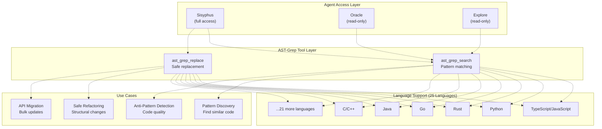
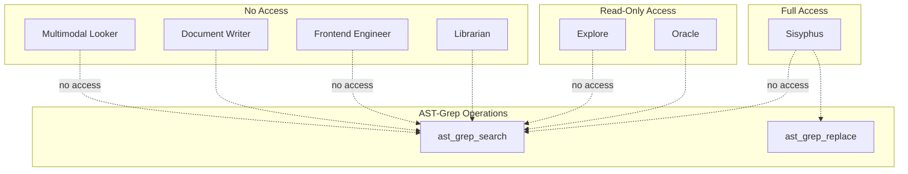
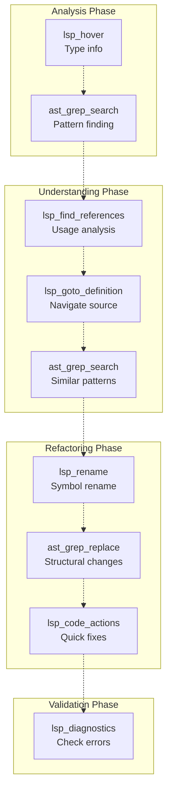
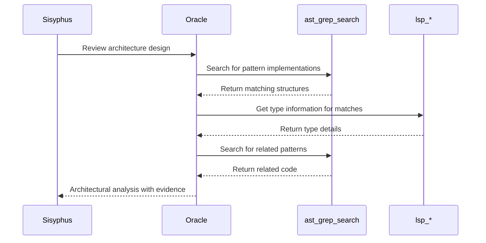
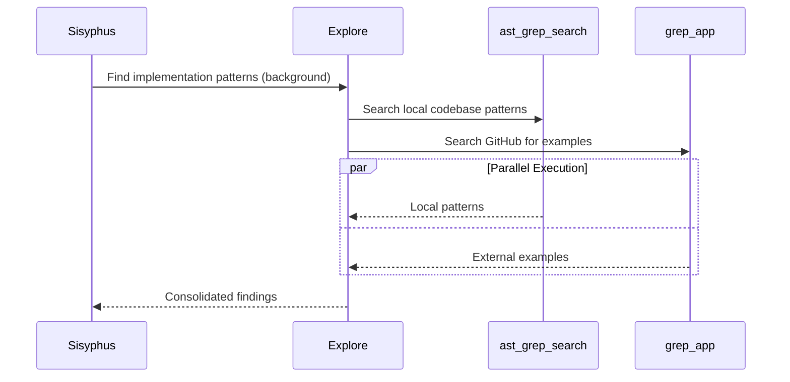
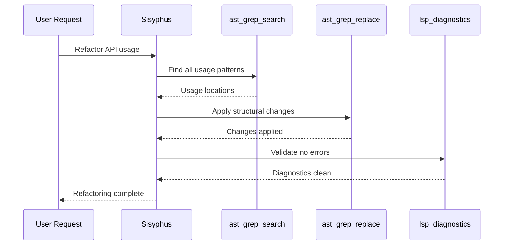

# AST-Grep Tools

> **Relevant source files**
> * [README.ja.md](https://github.com/code-yeongyu/oh-my-opencode/blob/b92cd6ab/README.ja.md)
> * [README.ko.md](https://github.com/code-yeongyu/oh-my-opencode/blob/b92cd6ab/README.ko.md)
> * [README.md](https://github.com/code-yeongyu/oh-my-opencode/blob/b92cd6ab/README.md)
> * [README.zh-cn.md](https://github.com/code-yeongyu/oh-my-opencode/blob/b92cd6ab/README.zh-cn.md)
> * [src/shared/config-path.ts](https://github.com/code-yeongyu/oh-my-opencode/blob/b92cd6ab/src/shared/config-path.ts)
> * [src/tools/background-task/constants.ts](https://github.com/code-yeongyu/oh-my-opencode/blob/b92cd6ab/src/tools/background-task/constants.ts)
> * [src/tools/background-task/index.ts](https://github.com/code-yeongyu/oh-my-opencode/blob/b92cd6ab/src/tools/background-task/index.ts)
> * [src/tools/background-task/types.ts](https://github.com/code-yeongyu/oh-my-opencode/blob/b92cd6ab/src/tools/background-task/types.ts)
> * [src/tools/call-omo-agent/constants.ts](https://github.com/code-yeongyu/oh-my-opencode/blob/b92cd6ab/src/tools/call-omo-agent/constants.ts)
> * [src/tools/interactive-bash/constants.ts](https://github.com/code-yeongyu/oh-my-opencode/blob/b92cd6ab/src/tools/interactive-bash/constants.ts)
> * [src/tools/look-at/constants.ts](https://github.com/code-yeongyu/oh-my-opencode/blob/b92cd6ab/src/tools/look-at/constants.ts)
> * [src/tools/look-at/tools.ts](https://github.com/code-yeongyu/oh-my-opencode/blob/b92cd6ab/src/tools/look-at/tools.ts)

## Purpose and Scope

This document covers the AST-Grep tool integration in oh-my-opencode, which provides Abstract Syntax Tree (AST) based code search and replacement capabilities across 25 programming languages. AST-Grep tools enable agents to perform structural code pattern matching and safe refactoring operations that go beyond simple text-based search.

For Language Server Protocol operations (type information, navigation, diagnostics), see [LSP Tools](/code-yeongyu/oh-my-opencode/5.1-lsp-tools). For agent-specific tool capabilities, see [Specialized Agents](/code-yeongyu/oh-my-opencode/4.2-specialized-agents).

Sources: [README.md L169](https://github.com/code-yeongyu/oh-my-opencode/blob/b92cd6ab/README.md#L169-L169)

 [README.md L524](https://github.com/code-yeongyu/oh-my-opencode/blob/b92cd6ab/README.md#L524-L524)

## Overview

AST-Grep tools provide syntax-aware code manipulation through two primary operations:

| Tool | Purpose | Safety Level |
| --- | --- | --- |
| `ast_grep_search` | Structural pattern matching across codebase | Read-only |
| `ast_grep_replace` | AST-aware code replacement | Write (safe refactoring) |

These tools leverage abstract syntax tree analysis to understand code structure rather than treating code as plain text. This enables precise pattern matching that respects language semantics, variable scoping, and code structure.

Sources: [README.md L524](https://github.com/code-yeongyu/oh-my-opencode/blob/b92cd6ab/README.md#L524-L524)

## Tool Architecture



Sources: [README.md L169](https://github.com/code-yeongyu/oh-my-opencode/blob/b92cd6ab/README.md#L169-L169)

 [README.md L524](https://github.com/code-yeongyu/oh-my-opencode/blob/b92cd6ab/README.md#L524-L524)

## Tool Definitions

### ast_grep_search

Pattern-based code search using AST structure. Matches code patterns while respecting language syntax and semantics.

**Key Characteristics:**

* Operates on abstract syntax trees, not text
* Supports pattern variables for flexible matching
* Language-aware matching (respects scoping, syntax)
* Returns structured results with context

**Common Pattern Types:**

* Function/method declarations
* Variable usage patterns
* Import/export statements
* Control flow structures
* Type annotations

Sources: [README.md L524](https://github.com/code-yeongyu/oh-my-opencode/blob/b92cd6ab/README.md#L524-L524)

### ast_grep_replace

Structural code replacement maintaining syntactic correctness. Performs refactoring operations that preserve code semantics.

**Safety Features:**

* Validates replacement syntax before applying
* Maintains proper indentation and formatting
* Respects language-specific syntax rules
* Preserves surrounding code structure

**Typical Operations:**

* Rename functions/variables with scope awareness
* Update API call patterns
* Modify import statements
* Refactor code structures

Sources: [README.md L524](https://github.com/code-yeongyu/oh-my-opencode/blob/b92cd6ab/README.md#L524-L524)

## Agent Access Patterns



**Access Rationale:**

* **Sisyphus**: Full access for implementation and refactoring tasks
* **Oracle**: Read-only for architectural analysis and code review
* **Explore**: Read-only for pattern discovery and codebase exploration
* **Librarian**: No access (focuses on external documentation)
* **Frontend/DocWriter/Multimodal**: No access (specialized domains)

Sources: [README.md L466-L470](https://github.com/code-yeongyu/oh-my-opencode/blob/b92cd6ab/README.md#L466-L470)

 [README.md L468-L470](https://github.com/code-yeongyu/oh-my-opencode/blob/b92cd6ab/README.md#L468-L470)

## Language Support

AST-Grep tools support 25 programming languages through unified pattern syntax:

**Web & Mobile:**

* JavaScript, TypeScript, JSX, TSX
* HTML, CSS
* Kotlin, Swift, Dart

**Systems & Backend:**

* Rust, Go, C, C++
* Java, C#, Scala

**Scripting & Data:**

* Python, Ruby, Lua
* PHP, Bash

**Other:**

* Elixir, Haskell, OCaml, Thrift

Each language's AST structure is automatically handled, allowing agents to use consistent pattern syntax across different codebases.

Sources: [README.md L524](https://github.com/code-yeongyu/oh-my-opencode/blob/b92cd6ab/README.md#L524-L524)

## Integration with Development Workflow



AST-Grep tools complement LSP operations by providing:

* Structural pattern matching beyond symbol-based search
* Cross-file refactoring capabilities
* Language-agnostic pattern syntax
* Bulk modification support

Sources: [README.md L512-L525](https://github.com/code-yeongyu/oh-my-opencode/blob/b92cd6ab/README.md#L512-L525)

## Common Usage Patterns

### Pattern Discovery

Agents use `ast_grep_search` to find code patterns for:

**Architectural Understanding:**

* Identify all implementations of an interface
* Find usage patterns of specific APIs
* Locate similar error handling approaches

**Code Quality Analysis:**

* Detect anti-patterns (e.g., missing null checks)
* Find inconsistent coding styles
* Identify deprecated API usage

**Migration Assistance:**

* Locate all instances requiring update
* Identify compatibility issues
* Find version-specific code patterns

Sources: [README.md L524](https://github.com/code-yeongyu/oh-my-opencode/blob/b92cd6ab/README.md#L524-L524)

### Safe Refactoring

Agents use `ast_grep_replace` for:

**API Migrations:**

```yaml
Pattern: Old API call structure
Replacement: New API call structure
Scope: Entire codebase
```

**Consistency Enforcement:**

```yaml
Pattern: Inconsistent error handling
Replacement: Standardized error handling
Scope: Specific file patterns
```

**Structural Updates:**

```yaml
Pattern: Legacy code structure
Replacement: Modern equivalent
Scope: Targeted directories
```

Sources: [README.md L524](https://github.com/code-yeongyu/oh-my-opencode/blob/b92cd6ab/README.md#L524-L524)

## Workflow Examples

### Oracle Review Workflow



Oracle uses AST-Grep in read-only mode to gather evidence for architectural decisions without modifying code.

Sources: [README.md L466-L470](https://github.com/code-yeongyu/oh-my-opencode/blob/b92cd6ab/README.md#L466-L470)

### Explore Discovery Workflow



Explore combines AST-Grep (local patterns) with grep_app (external examples) for comprehensive pattern discovery.

Sources: [README.md L469](https://github.com/code-yeongyu/oh-my-opencode/blob/b92cd6ab/README.md#L469-L469)

### Sisyphus Refactoring Workflow



Sisyphus uses full AST-Grep access to perform safe, validated refactoring operations.

Sources: [README.md L466-L470](https://github.com/code-yeongyu/oh-my-opencode/blob/b92cd6ab/README.md#L466-L470)

## Tool Coordination Patterns

### AST-Grep + LSP Synergy

**Pattern Matching → Symbol Navigation:**

1. Use `ast_grep_search` to find structural patterns
2. Use `lsp_goto_definition` to navigate to implementations
3. Use `lsp_find_references` to understand usage

**Refactoring → Validation:**

1. Use `ast_grep_replace` for structural changes
2. Use `lsp_diagnostics` to validate correctness
3. Use `lsp_code_actions` for cleanup

Sources: [README.md L512-L525](https://github.com/code-yeongyu/oh-my-opencode/blob/b92cd6ab/README.md#L512-L525)

### Multi-Agent Pattern

**Parallel Discovery:**

* Explore uses AST-Grep for local patterns (async)
* Librarian uses external MCPs for documentation (async)
* Sisyphus aggregates findings for implementation

**Sequential Refinement:**

* Oracle uses AST-Grep to analyze existing patterns
* Sisyphus uses AST-Grep to implement improvements
* Validation through LSP diagnostics

Sources: [README.md L466-L470](https://github.com/code-yeongyu/oh-my-opencode/blob/b92cd6ab/README.md#L466-L470)

## Configuration and Customization

AST-Grep tool access is controlled through agent configuration:

```json
{
  "agents": {
    "explore": {
      "tools": {
        "ast_grep_search": true,
        "ast_grep_replace": false
      }
    },
    "oracle": {
      "tools": {
        "ast_grep_search": true,
        "ast_grep_replace": false
      }
    }
  }
}
```

Custom agents can be configured with selective AST-Grep access based on their role in the development workflow.

Sources: [README.md L772-L808](https://github.com/code-yeongyu/oh-my-opencode/blob/b92cd6ab/README.md#L772-L808)

## Performance Characteristics

**Search Performance:**

* AST parsing overhead: one-time per file
* Pattern matching: faster than regex for complex patterns
* Cross-file search: parallelized
* Result caching: enabled

**Replace Performance:**

* Syntax validation: before application
* Incremental updates: only modified files
* Rollback support: via LSP diagnostics
* Atomic operations: per-file basis

Sources: [README.md L524](https://github.com/code-yeongyu/oh-my-opencode/blob/b92cd6ab/README.md#L524-L524)

## Best Practices

**For Pattern Matching:**

* Start with specific patterns, broaden if needed
* Use pattern variables for flexibility
* Combine with LSP for type-aware search
* Validate results before bulk operations

**For Refactoring:**

* Always search before replace to preview changes
* Validate with LSP diagnostics after changes
* Use targeted scopes to limit blast radius
* Test critical paths after structural changes

**For Agent Delegation:**

* Use Explore for pattern discovery (parallel)
* Use Oracle for architectural pattern analysis
* Reserve Replace operations for Sisyphus
* Validate all changes with LSP tools

Sources: [README.md L466-L470](https://github.com/code-yeongyu/oh-my-opencode/blob/b92cd6ab/README.md#L466-L470)

 [README.md L524](https://github.com/code-yeongyu/oh-my-opencode/blob/b92cd6ab/README.md#L524-L524)