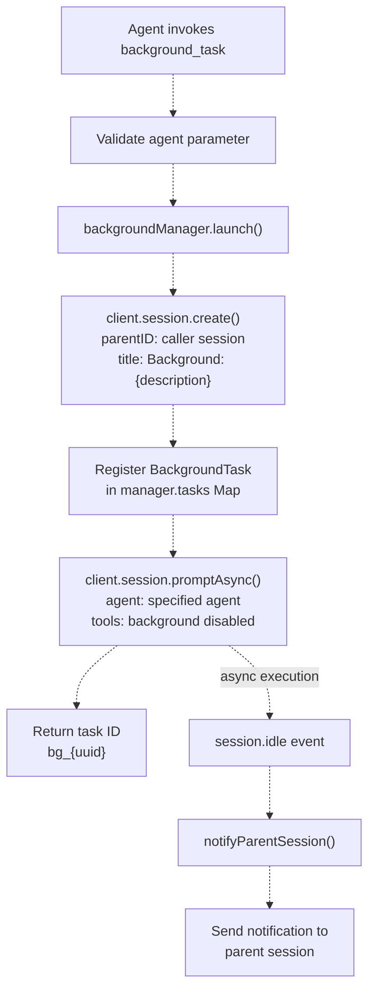
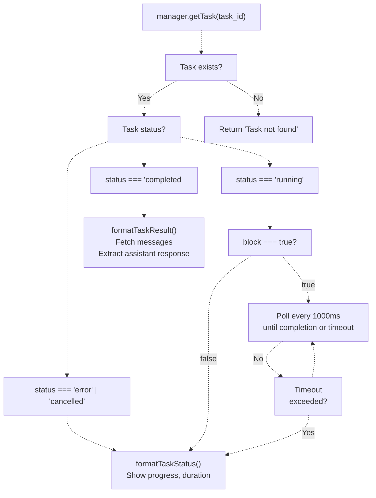
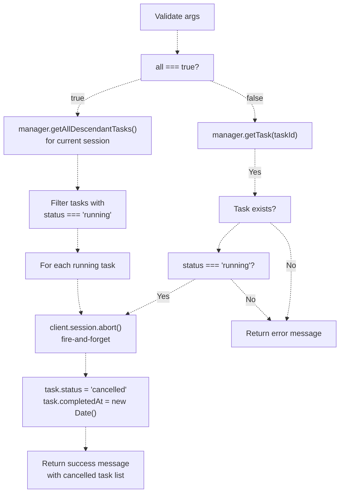
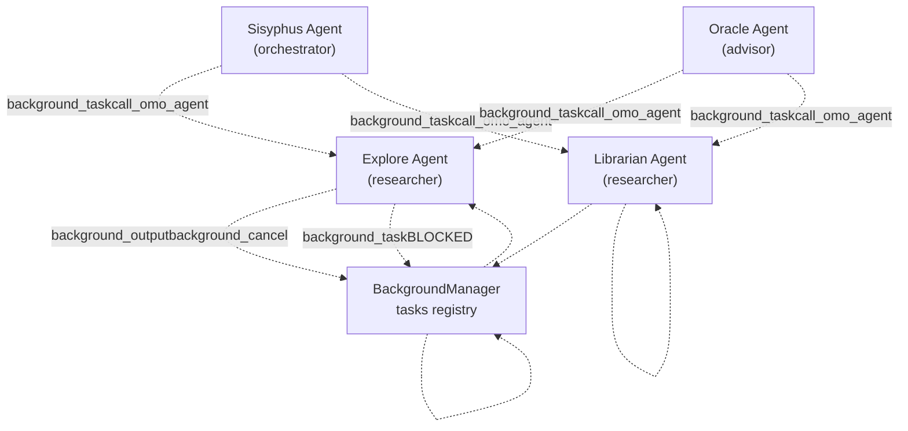

# Background Task Tools

> **Relevant source files**
> * [.opencode/background-tasks.json](https://github.com/code-yeongyu/oh-my-opencode/blob/b92cd6ab/.opencode/background-tasks.json)
> * [src/features/background-agent/index.ts](https://github.com/code-yeongyu/oh-my-opencode/blob/b92cd6ab/src/features/background-agent/index.ts)
> * [src/features/background-agent/manager.test.ts](https://github.com/code-yeongyu/oh-my-opencode/blob/b92cd6ab/src/features/background-agent/manager.test.ts)
> * [src/features/background-agent/manager.ts](https://github.com/code-yeongyu/oh-my-opencode/blob/b92cd6ab/src/features/background-agent/manager.ts)
> * [src/features/background-agent/types.ts](https://github.com/code-yeongyu/oh-my-opencode/blob/b92cd6ab/src/features/background-agent/types.ts)
> * [src/tools/background-task/constants.ts](https://github.com/code-yeongyu/oh-my-opencode/blob/b92cd6ab/src/tools/background-task/constants.ts)
> * [src/tools/background-task/index.ts](https://github.com/code-yeongyu/oh-my-opencode/blob/b92cd6ab/src/tools/background-task/index.ts)
> * [src/tools/background-task/tools.ts](https://github.com/code-yeongyu/oh-my-opencode/blob/b92cd6ab/src/tools/background-task/tools.ts)
> * [src/tools/background-task/types.ts](https://github.com/code-yeongyu/oh-my-opencode/blob/b92cd6ab/src/tools/background-task/types.ts)
> * [src/tools/call-omo-agent/constants.ts](https://github.com/code-yeongyu/oh-my-opencode/blob/b92cd6ab/src/tools/call-omo-agent/constants.ts)
> * [src/tools/call-omo-agent/tools.ts](https://github.com/code-yeongyu/oh-my-opencode/blob/b92cd6ab/src/tools/call-omo-agent/tools.ts)
> * [src/tools/interactive-bash/constants.ts](https://github.com/code-yeongyu/oh-my-opencode/blob/b92cd6ab/src/tools/interactive-bash/constants.ts)
> * [src/tools/look-at/constants.ts](https://github.com/code-yeongyu/oh-my-opencode/blob/b92cd6ab/src/tools/look-at/constants.ts)
> * [src/tools/look-at/tools.ts](https://github.com/code-yeongyu/oh-my-opencode/blob/b92cd6ab/src/tools/look-at/tools.ts)

## Purpose and Scope

Background task tools enable asynchronous agent execution within the oh-my-opencode system. This page documents the tools that create, monitor, and manage background tasks: `background_task`, `background_output`, `background_cancel`, and the async mode of `call_omo_agent`. For the background task management infrastructure, see [Background Execution System](../background-execution/). For synchronous agent delegation, see [Analytical Agents](/code-yeongyu/oh-my-opencode/4.2-specialized-agents).

These tools allow agents to spawn parallel work that executes in isolated sessions while the parent agent continues other tasks. The system automatically notifies the parent agent when background tasks complete.

---

## Tool Overview

The system provides four tools for background task management:

| Tool Name | Purpose | Returns | Primary Use Case |
| --- | --- | --- | --- |
| `background_task` | Launch any agent as background task | Task ID | Parallel execution of arbitrary agents |
| `background_output` | Get output from background task | Task status or results | Check progress or retrieve completed results |
| `background_cancel` | Cancel running background task(s) | Success/failure message | Abort unwanted tasks before final answer |
| `call_omo_agent` | Invoke explore/librarian (sync or async) | Task ID (async) or results (sync) | Specialized agent delegation |

Sources: [src/tools/background-task/tools.ts L1-L332](https://github.com/code-yeongyu/oh-my-opencode/blob/b92cd6ab/src/tools/background-task/tools.ts#L1-L332)

 [src/tools/call-omo-agent/tools.ts L1-L179](https://github.com/code-yeongyu/oh-my-opencode/blob/b92cd6ab/src/tools/call-omo-agent/tools.ts#L1-L179)

 [src/tools/background-task/constants.ts L1-L8](https://github.com/code-yeongyu/oh-my-opencode/blob/b92cd6ab/src/tools/background-task/constants.ts#L1-L8)

---

## background_task Tool

### Description

The `background_task` tool launches any registered agent as a background task, returning immediately with a task ID. The system creates an isolated session and executes the agent asynchronously, notifying the parent session upon completion.

```javascript
export const BACKGROUND_TASK_DESCRIPTION = `Run agent task in background. Returns task_id immediately; notifies on completion.

Use \`background_output\` to get results. Prompts MUST be in English.`
```

Sources: [src/tools/background-task/constants.ts L1-L3](https://github.com/code-yeongyu/oh-my-opencode/blob/b92cd6ab/src/tools/background-task/constants.ts#L1-L3)

 [src/tools/background-task/tools.ts L23-L63](https://github.com/code-yeongyu/oh-my-opencode/blob/b92cd6ab/src/tools/background-task/tools.ts#L23-L63)

### Tool Arguments

```yaml
{
  description: string  // Short task description (shown in status)
  prompt: string      // Full detailed prompt for the agent
  agent: string       // Agent type to use (any registered agent)
}
```

The `agent` parameter accepts any agent registered in the system, unlike `call_omo_agent` which restricts to explore/librarian.

Sources: [src/tools/background-task/tools.ts L26-L30](https://github.com/code-yeongyu/oh-my-opencode/blob/b92cd6ab/src/tools/background-task/tools.ts#L26-L30)

### Execution Flow



**Figure 1: background_task Execution Flow**

Sources: [src/tools/background-task/tools.ts L31-L62](https://github.com/code-yeongyu/oh-my-opencode/blob/b92cd6ab/src/tools/background-task/tools.ts#L31-L62)

 [src/features/background-agent/manager.ts L69-L137](https://github.com/code-yeongyu/oh-my-opencode/blob/b92cd6ab/src/features/background-agent/manager.ts#L69-L137)

### Return Value

```yaml
Background task launched successfully.

Task ID: bg_wzsdt60b
Session ID: ses_4f3e89f0dffeooeXNVx5QCifse
Description: Explore opencode in codebase
Agent: explore
Status: running

The system will notify you when the task completes.
Use `background_output` tool with task_id="bg_wzsdt60b" to check progress:
- block=false (default): Check status immediately - returns full status info
- block=true: Wait for completion (rarely needed since system notifies)
```

Sources: [src/tools/background-task/tools.ts L45-L56](https://github.com/code-yeongyu/oh-my-opencode/blob/b92cd6ab/src/tools/background-task/tools.ts#L45-L56)

### Tool Restrictions

Background tasks automatically disable recursive background tools:

```yaml
tools: {
  task: false,
  background_task: false,
}
```

This prevents infinite nesting of background tasks and ensures clean task hierarchies.

Sources: [src/features/background-agent/manager.ts L113-L116](https://github.com/code-yeongyu/oh-my-opencode/blob/b92cd6ab/src/features/background-agent/manager.ts#L113-L116)

### Error Handling

The tool handles several error cases:

* **Missing agent parameter**: Returns error message requesting agent specification
* **Invalid agent name**: Catches agent creation errors and provides helpful message
* **Session creation failure**: Throws error with detailed message from API

```
if (!args.agent || args.agent.trim() === "") {
  return `❌ Agent parameter is required. Please specify which agent to use (e.g., "explore", "librarian", "build", etc.)`
}
```

Sources: [src/tools/background-task/tools.ts L32-L34](https://github.com/code-yeongyu/oh-my-opencode/blob/b92cd6ab/src/tools/background-task/tools.ts#L32-L34)

 [src/features/background-agent/manager.ts L119-L134](https://github.com/code-yeongyu/oh-my-opencode/blob/b92cd6ab/src/features/background-agent/manager.ts#L119-L134)

---

## background_output Tool

### Description

The `background_output` tool retrieves status or results from a background task. It supports both non-blocking status checks and blocking waits for completion.

```javascript
export const BACKGROUND_OUTPUT_DESCRIPTION = `Get output from background task. System notifies on completion, so block=true rarely needed.`
```

Sources: [src/tools/background-task/constants.ts L5](https://github.com/code-yeongyu/oh-my-opencode/blob/b92cd6ab/src/tools/background-task/constants.ts#L5-L5)

 [src/tools/background-task/tools.ts L196-L260](https://github.com/code-yeongyu/oh-my-opencode/blob/b92cd6ab/src/tools/background-task/tools.ts#L196-L260)

### Tool Arguments

```yaml
{
  task_id: string         // Task ID to get output from
  block?: boolean        // Wait for completion (default: false)
  timeout?: number       // Max wait time in ms (default: 60000, max: 600000)
}
```

The `block` parameter is optional and defaults to `false` since the system automatically notifies when tasks complete. Blocking is rarely needed but available for edge cases.

Sources: [src/tools/background-task/tools.ts L199-L203](https://github.com/code-yeongyu/oh-my-opencode/blob/b92cd6ab/src/tools/background-task/tools.ts#L199-L203)

### Execution Logic



**Figure 2: background_output Execution Logic**

Sources: [src/tools/background-task/tools.ts L204-L258](https://github.com/code-yeongyu/oh-my-opencode/blob/b92cd6ab/src/tools/background-task/tools.ts#L204-L258)

### Response Format - Running Task

When the task is still running, `formatTaskStatus()` returns a markdown table with progress information:

```markdown
# Task Status

| Field | Value |
|-------|-------|
| Task ID | `bg_wzsdt60b` |
| Description | Explore opencode in codebase |
| Agent | explore |
| Status | **running** |
| Duration | 1m 23s |
| Session ID | `ses_4f3e89f0dffeooeXNVx5QCifse` |
| Last tool | grep |

> **Note**: No need to wait explicitly - the system will notify you when this task completes.

## Original Prompt
```

Search the codebase for all references to "opencode" and summarize what you find...

```markdown
## Last Message (2025-12-11T06:27:30.000Z)
```

I found 47 references to "opencode" across the codebase...

```

```

Sources: [src/tools/background-task/tools.ts L74-L125](https://github.com/code-yeongyu/oh-my-opencode/blob/b92cd6ab/src/tools/background-task/tools.ts#L74-L125)

### Response Format - Completed Task

When the task is completed, `formatTaskResult()` fetches session messages and returns the final assistant response:

```yaml
Task Result

Task ID: bg_wzsdt60b
Description: Explore opencode in codebase
Duration: 2m 15s
Session ID: ses_4f3e89f0dffeooeXNVx5QCifse

---

{final assistant response text}
```

Sources: [src/tools/background-task/tools.ts L127-L194](https://github.com/code-yeongyu/oh-my-opencode/blob/b92cd6ab/src/tools/background-task/tools.ts#L127-L194)

### Blocking Behavior

When `block=true`, the tool polls the task every 1000ms until:

* Task completes (returns `formatTaskResult()`)
* Task errors or is cancelled (returns `formatTaskStatus()`)
* Timeout is exceeded (returns timeout message with current status)

```javascript
while (Date.now() - startTime < timeoutMs) {
  await delay(1000)
  
  const currentTask = manager.getTask(args.task_id)
  if (!currentTask) {
    return `Task was deleted: ${args.task_id}`
  }
  
  if (currentTask.status === "completed") {
    return await formatTaskResult(currentTask, client)
  }
  // ...
}
```

Sources: [src/tools/background-task/tools.ts L230-L247](https://github.com/code-yeongyu/oh-my-opencode/blob/b92cd6ab/src/tools/background-task/tools.ts#L230-L247)

---

## background_cancel Tool

### Description

The `background_cancel` tool cancels running background tasks, either individually by task ID or all tasks at once. This is particularly useful before providing final answers to ensure no lingering background work.

```javascript
export const BACKGROUND_CANCEL_DESCRIPTION = `Cancel running background task(s). Use all=true to cancel ALL before final answer.`
```

Sources: [src/tools/background-task/constants.ts L7](https://github.com/code-yeongyu/oh-my-opencode/blob/b92cd6ab/src/tools/background-task/constants.ts#L7-L7)

 [src/tools/background-task/tools.ts L262-L331](https://github.com/code-yeongyu/oh-my-opencode/blob/b92cd6ab/src/tools/background-task/tools.ts#L262-L331)

### Tool Arguments

```
{
  taskId?: string      // Task ID to cancel (required if all=false)
  all?: boolean       // Cancel all running background tasks (default: false)
}
```

Either `taskId` or `all=true` must be provided. The tool validates this requirement.

Sources: [src/tools/background-task/tools.ts L265-L268](https://github.com/code-yeongyu/oh-my-opencode/blob/b92cd6ab/src/tools/background-task/tools.ts#L265-L268)

### Cancellation Logic



**Figure 3: background_cancel Cancellation Flow**

Sources: [src/tools/background-task/tools.ts L269-L330](https://github.com/code-yeongyu/oh-my-opencode/blob/b92cd6ab/src/tools/background-task/tools.ts#L269-L330)

### Cancel All Mode

When `all=true`, the tool:

1. Retrieves all descendant tasks of the current session using `manager.getAllDescendantTasks()`
2. Filters to only running tasks
3. Aborts each task's session via `client.session.abort()` (fire-and-forget)
4. Updates task status to `"cancelled"` in the registry

```javascript
const tasks = manager.getAllDescendantTasks(toolContext.sessionID)
const runningTasks = tasks.filter(t => t.status === "running")

for (const task of runningTasks) {
  client.session.abort({
    path: { id: task.sessionID },
  }).catch(() => {})
  
  task.status = "cancelled"
  task.completedAt = new Date()
}
```

Sources: [src/tools/background-task/tools.ts L278-L294](https://github.com/code-yeongyu/oh-my-opencode/blob/b92cd6ab/src/tools/background-task/tools.ts#L278-L294)

### Single Task Cancellation

When cancelling a specific task:

1. Validates task exists
2. Checks task is currently running (only running tasks can be cancelled)
3. Aborts the session (fire-and-forget to avoid aborting main session)
4. Updates task status to `"cancelled"`

**Important**: The abort request is fire-and-forget (no `await`) to prevent aborting the main session.

```javascript
// Fire-and-forget: abort request without await
client.session.abort({
  path: { id: task.sessionID },
}).catch(() => {})

task.status = "cancelled"
task.completedAt = new Date()
```

Sources: [src/tools/background-task/tools.ts L311-L318](https://github.com/code-yeongyu/oh-my-opencode/blob/b92cd6ab/src/tools/background-task/tools.ts#L311-L318)

---

## call_omo_agent Tool (Async Mode)

### Overview

The `call_omo_agent` tool provides specialized agent delegation for explore and librarian agents. When used with `run_in_background=true`, it functions as a background task tool with additional agent restrictions. For synchronous execution details, see [Analytical Agents](/code-yeongyu/oh-my-opencode/4.2-specialized-agents).

```javascript
export const CALL_OMO_AGENT_DESCRIPTION = `Spawn explore/librarian agent. run_in_background REQUIRED (true=async with task_id, false=sync).

Available: {agents}

Prompts MUST be in English. Use \`background_output\` for async results.`
```

Sources: [src/tools/call-omo-agent/constants.ts L3-L8](https://github.com/code-yeongyu/oh-my-opencode/blob/b92cd6ab/src/tools/call-omo-agent/constants.ts#L3-L8)

 [src/tools/call-omo-agent/tools.ts L7-L46](https://github.com/code-yeongyu/oh-my-opencode/blob/b92cd6ab/src/tools/call-omo-agent/tools.ts#L7-L46)

### Tool Arguments

```yaml
{
  description: string           // Short (3-5 words) task description
  prompt: string               // Full detailed prompt for the subagent
  subagent_type: string        // "explore" or "librarian" only
  run_in_background: boolean   // REQUIRED: true=async, false=sync
  session_id?: string          // Continue session (sync mode only)
}
```

The `subagent_type` is restricted to explore and librarian to prevent recursion:

```javascript
export const ALLOWED_AGENTS = ["explore", "librarian"] as const
```

Sources: [src/tools/call-omo-agent/tools.ts L18-L28](https://github.com/code-yeongyu/oh-my-opencode/blob/b92cd6ab/src/tools/call-omo-agent/tools.ts#L18-L28)

 [src/tools/call-omo-agent/constants.ts L1](https://github.com/code-yeongyu/oh-my-opencode/blob/b92cd6ab/src/tools/call-omo-agent/constants.ts#L1-L1)

### Async Execution

When `run_in_background=true`, the tool delegates to `BackgroundManager.launch()` identically to `background_task`:

```javascript
async function executeBackground(
  args: CallOmoAgentArgs,
  toolContext: { sessionID: string; messageID: string },
  manager: BackgroundManager
): Promise<string> {
  const task = await manager.launch({
    description: args.description,
    prompt: args.prompt,
    agent: args.subagent_type,
    parentSessionID: toolContext.sessionID,
    parentMessageID: toolContext.messageID,
  })
  
  return `Background agent task launched successfully.
Task ID: ${task.id}
...`
}
```

Sources: [src/tools/call-omo-agent/tools.ts L48-L77](https://github.com/code-yeongyu/oh-my-opencode/blob/b92cd6ab/src/tools/call-omo-agent/tools.ts#L48-L77)

### Comparison to background_task

| Feature | background_task | call_omo_agent (async) |
| --- | --- | --- |
| **Agent Restriction** | Any registered agent | explore, librarian only |
| **Synchronous Mode** | Not available | Available with `run_in_background=false` |
| **Session Continuation** | Not supported | Supported in sync mode only |
| **Use Case** | Generic background work | Research/exploration delegation |
| **Implementation** | Direct BackgroundManager call | Delegates to BackgroundManager in async mode |

Both tools use the same `BackgroundManager.launch()` method for async execution, with `call_omo_agent` adding agent restrictions and sync mode support.

Sources: [src/tools/call-omo-agent/tools.ts L36-L46](https://github.com/code-yeongyu/oh-my-opencode/blob/b92cd6ab/src/tools/call-omo-agent/tools.ts#L36-L46)

 [src/tools/background-task/tools.ts L31-L62](https://github.com/code-yeongyu/oh-my-opencode/blob/b92cd6ab/src/tools/background-task/tools.ts#L31-L62)

---

## Tool Access Control

All four background task tools are controlled through agent configuration:

| Tool | Sisyphus | Oracle | Explore | Librarian | Other Agents |
| --- | --- | --- | --- | --- | --- |
| `background_task` | ✅ | ✅ | ❌ | ❌ | ✅ (default) |
| `background_output` | ✅ | ✅ | ✅ | ✅ | ✅ (default) |
| `background_cancel` | ✅ | ✅ | ✅ | ✅ | ✅ (default) |
| `call_omo_agent` | ✅ | ✅ | ❌ | ❌ | ✅ (default) |

**Rationale for explore/librarian restrictions**:

* These agents are read-only research agents designed to be invoked, not to invoke others
* Allowing `background_task` would enable recursion (explore → background explore → ...)
* They can still retrieve background results via `background_output`
* They can cancel unwanted tasks via `background_cancel`

Sources: [Diagram 2 from architecture overview](https://github.com/code-yeongyu/oh-my-opencode/blob/b92cd6ab/Diagram 2 from architecture overview)

### Recursion Prevention



**Figure 4: Tool Access Prevents Recursion**

Background task creation tools (`background_task`, `call_omo_agent`) are disabled for explore and librarian to prevent recursive delegation. These agents can still interact with existing background tasks via output/cancel tools.

Sources: [Diagram 2 from architecture overview](https://github.com/code-yeongyu/oh-my-opencode/blob/b92cd6ab/Diagram 2 from architecture overview)

---

## Integration with BackgroundManager

All background task tools interact with the `BackgroundManager` class, which orchestrates task lifecycle management.

### Task Lifecycle State Machine

```mermaid
stateDiagram-v2
    [*] --> creating : "background_task orcall_omo_agent (async)"
    creating --> running : "manager.launch()promptAsync() sent"
    running --> completed : "promptAsync() error"
    running --> error : "promptAsync() error"
    running --> cancelled : "background_cancelor session.deleted"
    completed --> notified : "notifyParentSession()"
    error --> notified : "notifyParentSession()"
    notified --> retrieved : "background_output"
    retrieved --> [*] : "task data persists"
    cancelled --> [*] : "task removed"
```



**Figure 5: Background Task State Transitions**

Sources: [src/features/background-agent/manager.ts L69-L137](https://github.com/code-yeongyu/oh-my-opencode/blob/b92cd6ab/src/features/background-agent/manager.ts#L69-L137)

 [src/features/background-agent/manager.ts L192-L256](https://github.com/code-yeongyu/oh-my-opencode/blob/b92cd6ab/src/features/background-agent/manager.ts#L192-L256)

### BackgroundManager Key Methods

| Method | Purpose | Called By |
| --- | --- | --- |
| `launch(LaunchInput)` | Create and start background task | background_task, call_omo_agent |
| `getTask(id)` | Retrieve task by ID | background_output |
| `getTasksByParentSession(sessionID)` | Get direct child tasks | background_cancel (all mode) |
| `getAllDescendantTasks(sessionID)` | Recursively get all descendants | background_cancel (all mode) |
| `findBySession(sessionID)` | Find task by session ID | Internal event handlers |
| `handleEvent(event)` | Process session events for tasks | Plugin event system |
| `notifyParentSession(task)` | Send completion notification | Internal on completion |

Sources: [src/features/background-agent/manager.ts L55-L442](https://github.com/code-yeongyu/oh-my-opencode/blob/b92cd6ab/src/features/background-agent/manager.ts#L55-L442)

### BackgroundTask Data Structure

```sql
interface BackgroundTask {
  id: string                    // "bg_{uuid}" format
  sessionID: string             // Created child session ID
  parentSessionID: string       // Parent session ID
  parentMessageID: string       // Message that launched task
  description: string           // Short task description
  prompt: string               // Full prompt sent to agent
  agent: string                // Agent type (any registered agent)
  status: "running" | "completed" | "error" | "cancelled"
  startedAt: Date
  completedAt?: Date
  error?: string
  progress?: {
    toolCalls: number          // Total tool invocations
    lastTool?: string          // Most recent tool name
    lastUpdate: Date           // Last progress update time
    lastMessage?: string       // Most recent assistant message
    lastMessageAt?: Date       // Timestamp of last message
  }
}
```

This structure is populated during `manager.launch()` and updated via event handlers throughout the task lifecycle.

Sources: [src/features/background-agent/manager.ts L88-L102](https://github.com/code-yeongyu/oh-my-opencode/blob/b92cd6ab/src/features/background-agent/manager.ts#L88-L102)

### Progress Tracking

The BackgroundManager tracks task progress through two mechanisms:

1. **Event-driven updates**: `message.part.updated` events increment `toolCalls` and update `lastTool`
2. **Polling mechanism**: Every 2 seconds, fetches session messages to update progress for all running tasks

```javascript
private async pollRunningTasks(): Promise<void> {
  for (const task of this.tasks.values()) {
    if (task.status !== "running") continue
    
    const messagesResult = await this.client.session.messages({
      path: { id: task.sessionID },
    })
    
    // Count tool calls and extract last message
    if (!task.progress) {
      task.progress = { toolCalls: 0, lastUpdate: new Date() }
    }
    task.progress.toolCalls = toolCalls
    task.progress.lastTool = lastTool
    task.progress.lastMessage = lastMessage
    // ...
  }
}
```

Sources: [src/features/background-agent/manager.ts L362-L441](https://github.com/code-yeongyu/oh-my-opencode/blob/b92cd6ab/src/features/background-agent/manager.ts#L362-L441)

---

## Usage Patterns

### Pattern 1: Launch and Poll

Basic pattern for background task execution:

```yaml
// Step 1: Launch background task
background_task({
  description: "Analyze codebase structure",
  prompt: "Analyze the overall architecture and module organization of this codebase",
  agent: "explore",
})

// Returns immediately:
// Task ID: bg_a1b2c3d4
// Status: running

// Step 2: Check progress (optional)
background_output({
  task_id: "bg_a1b2c3d4",
  block: false,
})

// Returns status with progress info:
// Status: **running**
// Last tool: grep
// Duration: 45s

// Step 3: System auto-notifies when complete
// [BACKGROUND TASK COMPLETED] Task "Analyze codebase structure" finished in 2m 15s.

// Step 4: Retrieve final results
background_output({
  task_id: "bg_a1b2c3d4",
  block: false,
})

// Returns completed results:
// Task Result
// {full assistant response}
```

Sources: [src/tools/background-task/tools.ts L31-L62](https://github.com/code-yeongyu/oh-my-opencode/blob/b92cd6ab/src/tools/background-task/tools.ts#L31-L62)

 [src/tools/background-task/tools.ts L204-L258](https://github.com/code-yeongyu/oh-my-opencode/blob/b92cd6ab/src/tools/background-task/tools.ts#L204-L258)

### Pattern 2: Parallel Multi-Agent Execution

Launch multiple agents simultaneously for parallel work:

```sql
// Launch 3 background tasks in parallel
background_task({
  description: "Explore frontend code",
  prompt: "Analyze React components and state management patterns",
  agent: "explore",
})
// Returns: bg_task1

background_task({
  description: "Research testing strategies",
  prompt: "Find documentation on React Testing Library best practices",
  agent: "librarian",
})
// Returns: bg_task2

background_task({
  description: "Generate API docs",
  prompt: "Create comprehensive API documentation for all REST endpoints",
  agent: "document-writer",
})
// Returns: bg_task3

// All three tasks execute concurrently
// Agent continues other work
// Notifications arrive as tasks complete
```

This enables the parallel execution pattern shown in Diagram 5 from the architecture overview.

Sources: [Diagram 5 from architecture overview](https://github.com/code-yeongyu/oh-my-opencode/blob/b92cd6ab/Diagram 5 from architecture overview)

 [src/tools/background-task/tools.ts L23-L63](https://github.com/code-yeongyu/oh-my-opencode/blob/b92cd6ab/src/tools/background-task/tools.ts#L23-L63)

### Pattern 3: Cancel Before Final Answer

Clean up running background tasks before providing final response:

```yaml
// Agent has launched several background tasks
// but decides they're no longer needed

// Cancel all running background tasks
background_cancel({
  all: true,
})

// Returns:
// ✅ Cancelled 3 background task(s):
// - bg_task1: Explore frontend code
// - bg_task2: Research testing strategies
// - bg_task3: Generate API docs

// Now safe to provide final answer without lingering work
```

This is the recommended pattern in the tool description: "Use all=true to cancel ALL before final answer."

Sources: [src/tools/background-task/tools.ts L278-L298](https://github.com/code-yeongyu/oh-my-opencode/blob/b92cd6ab/src/tools/background-task/tools.ts#L278-L298)

 [src/tools/background-task/constants.ts L7](https://github.com/code-yeongyu/oh-my-opencode/blob/b92cd6ab/src/tools/background-task/constants.ts#L7-L7)

### Pattern 4: Blocking Wait (Rare)

Occasionally used when immediate results are required despite system notifications:

```yaml
// Launch task and wait for completion
background_task({
  description: "Quick search",
  prompt: "Find the main configuration file",
  agent: "explore",
})
// Returns: Task ID: bg_xyz123

// Block until completion (with 30s timeout)
background_output({
  task_id: "bg_xyz123",
  block: true,
  timeout: 30000,
})

// Blocks for up to 30 seconds
// Returns either:
// - Completed results if task finishes
// - Timeout message if still running after 30s
```

The tool description notes this is "rarely needed since system notifies".

Sources: [src/tools/background-task/tools.ts L229-L254](https://github.com/code-yeongyu/oh-my-opencode/blob/b92cd6ab/src/tools/background-task/tools.ts#L229-L254)

 [src/tools/background-task/constants.ts L5](https://github.com/code-yeongyu/oh-my-opencode/blob/b92cd6ab/src/tools/background-task/constants.ts#L5-L5)

### Pattern 5: Specialized Agent Delegation (call_omo_agent)

Use `call_omo_agent` for explore/librarian delegation with extra constraints:

```yaml
// Delegate to explore agent (async mode)
call_omo_agent({
  description: "Search for tests",
  prompt: "Find all test files and summarize the testing approach",
  subagent_type: "explore",
  run_in_background: true,
})

// Functionally equivalent to:
background_task({
  description: "Search for tests",
  prompt: "Find all test files and summarize the testing approach",
  agent: "explore",
})

// Use call_omo_agent when:
// - Agent restrictions (explore/librarian only) are desired
// - Consistency with sync mode usage (session continuation)
// - Working with code that expects call_omo_agent specifically
```

Sources: [src/tools/call-omo-agent/tools.ts L48-L77](https://github.com/code-yeongyu/oh-my-opencode/blob/b92cd6ab/src/tools/call-omo-agent/tools.ts#L48-L77)

 [src/tools/background-task/tools.ts L31-L62](https://github.com/code-yeongyu/oh-my-opencode/blob/b92cd6ab/src/tools/background-task/tools.ts#L31-L62)

---

## Tool Definition Location

The complete implementation of `call_omo_agent` is located in:

* **Tool definition**: [src/tools/call-omo-agent/tools.ts L7-L178](https://github.com/code-yeongyu/oh-my-opencode/blob/b92cd6ab/src/tools/call-omo-agent/tools.ts#L7-L178)
* **Type definitions**: [src/tools/call-omo-agent/types.ts L1-L28](https://github.com/code-yeongyu/oh-my-opencode/blob/b92cd6ab/src/tools/call-omo-agent/types.ts#L1-L28)
* **Constants**: [src/tools/call-omo-agent/constants.ts L1-L24](https://github.com/code-yeongyu/oh-my-opencode/blob/b92cd6ab/src/tools/call-omo-agent/constants.ts#L1-L24)
* **Public exports**: [src/tools/call-omo-agent/index.ts L1-L4](https://github.com/code-yeongyu/oh-my-opencode/blob/b92cd6ab/src/tools/call-omo-agent/index.ts#L1-L4)

The tool is registered with the plugin system during initialization and made available to agents based on their permission configuration.

Sources: [src/tools/call-omo-agent/tools.ts L1-L179](https://github.com/code-yeongyu/oh-my-opencode/blob/b92cd6ab/src/tools/call-omo-agent/tools.ts#L1-L179)

 [src/tools/call-omo-agent/index.ts L1-L4](https://github.com/code-yeongyu/oh-my-opencode/blob/b92cd6ab/src/tools/call-omo-agent/index.ts#L1-L4)