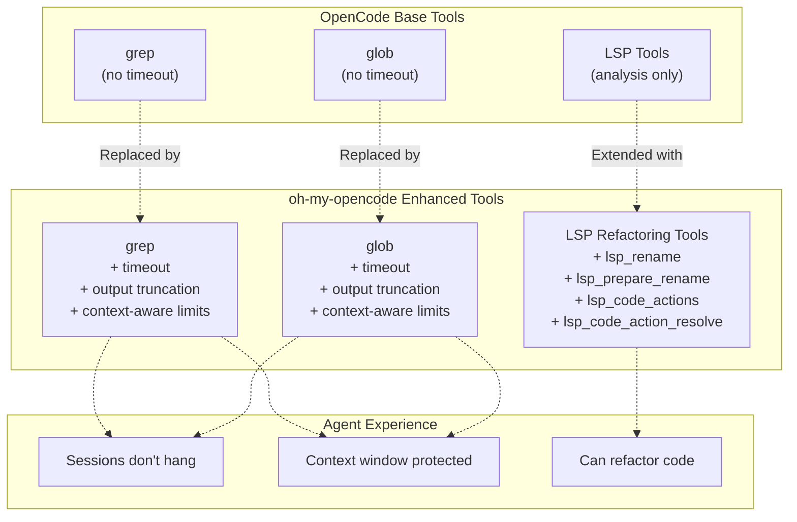
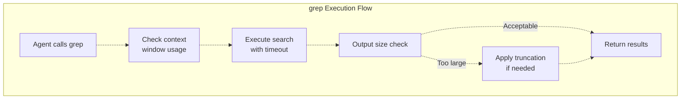
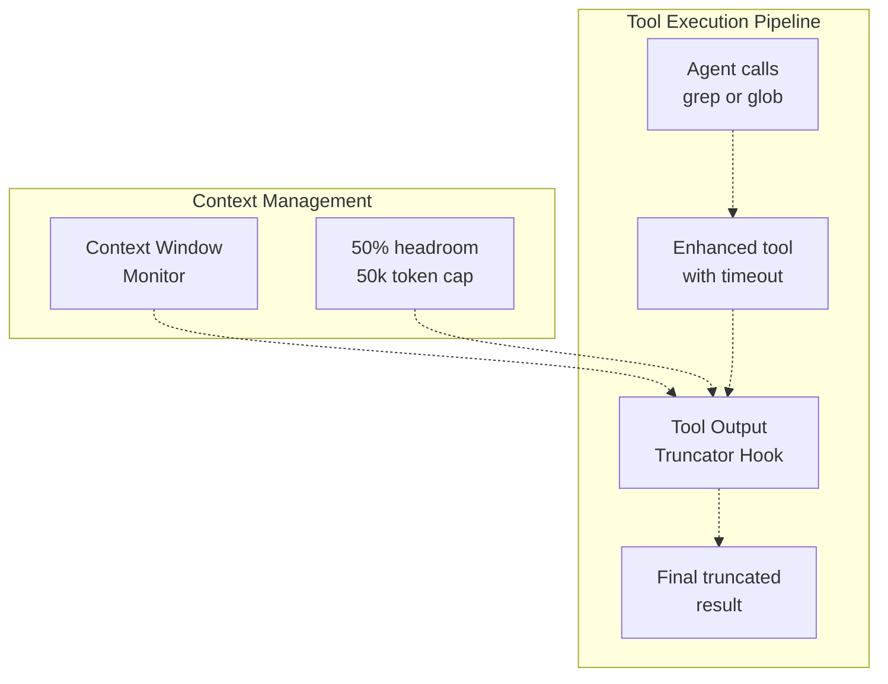
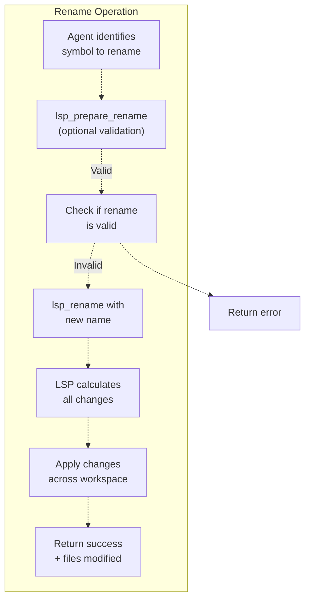
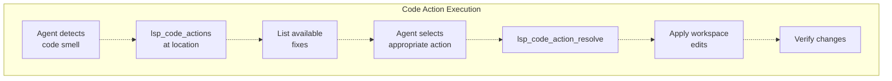
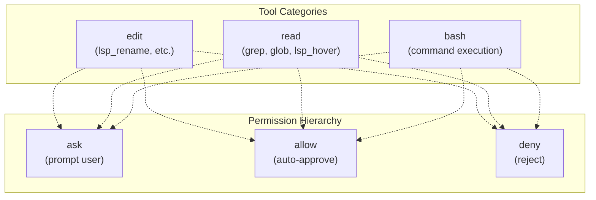
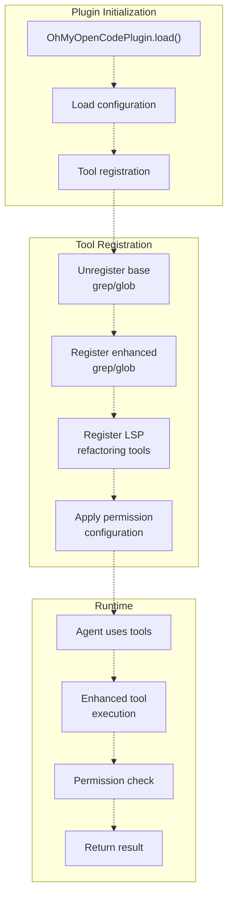

# Enhanced Base Tools

> **Relevant source files**
> * [README.ja.md](https://github.com/code-yeongyu/oh-my-opencode/blob/b92cd6ab/README.ja.md)
> * [README.ko.md](https://github.com/code-yeongyu/oh-my-opencode/blob/b92cd6ab/README.ko.md)
> * [README.md](https://github.com/code-yeongyu/oh-my-opencode/blob/b92cd6ab/README.md)
> * [README.zh-cn.md](https://github.com/code-yeongyu/oh-my-opencode/blob/b92cd6ab/README.zh-cn.md)
> * [src/shared/config-path.ts](https://github.com/code-yeongyu/oh-my-opencode/blob/b92cd6ab/src/shared/config-path.ts)
> * [src/tools/background-task/constants.ts](https://github.com/code-yeongyu/oh-my-opencode/blob/b92cd6ab/src/tools/background-task/constants.ts)
> * [src/tools/background-task/index.ts](https://github.com/code-yeongyu/oh-my-opencode/blob/b92cd6ab/src/tools/background-task/index.ts)
> * [src/tools/background-task/types.ts](https://github.com/code-yeongyu/oh-my-opencode/blob/b92cd6ab/src/tools/background-task/types.ts)
> * [src/tools/call-omo-agent/constants.ts](https://github.com/code-yeongyu/oh-my-opencode/blob/b92cd6ab/src/tools/call-omo-agent/constants.ts)
> * [src/tools/interactive-bash/constants.ts](https://github.com/code-yeongyu/oh-my-opencode/blob/b92cd6ab/src/tools/interactive-bash/constants.ts)
> * [src/tools/look-at/constants.ts](https://github.com/code-yeongyu/oh-my-opencode/blob/b92cd6ab/src/tools/look-at/constants.ts)
> * [src/tools/look-at/tools.ts](https://github.com/code-yeongyu/oh-my-opencode/blob/b92cd6ab/src/tools/look-at/tools.ts)

This page documents oh-my-opencode's improvements to OpenCode's base tool system. Enhanced base tools address critical limitations in OpenCode's built-in `grep` and `glob` tools (timeout handling, output truncation) and extend LSP capabilities beyond analysis to include refactoring operations. For structural code search using AST-aware patterns, see [Search and Analysis Tools](/code-yeongyu/oh-my-opencode/5.2-ast-grep-tools). For custom tools like `interactive_bash` and `look_at`, see [Custom Tools](/code-yeongyu/oh-my-opencode/5.4-session-management-tools).

---

## Overview

OpenCode provides several base tools that agents use to interact with codebases. However, these tools have limitations that can degrade agent performance or cause sessions to hang. oh-my-opencode replaces problematic base tools with enhanced versions and extends LSP capabilities with refactoring operations.

### Tool Enhancement Strategy



**Sources:** README.md:586-587, Diagram 5 from system architecture

---

## Enhanced grep Tool

The enhanced `grep` tool addresses critical issues in OpenCode's base implementation by adding timeout protection and output truncation.

### Problems with Base grep

| Issue | Impact | Agent Behavior |
| --- | --- | --- |
| No timeout mechanism | Infinite hang on large searches | Session becomes unresponsive |
| Unlimited output | Context window overflow | Agent loses important context |
| No early termination | Resource exhaustion | System slowdown |

### Enhancement Features

**Timeout Protection**

The enhanced grep implements configurable timeouts to prevent infinite hangs:

* Default timeout prevents indefinite blocking
* Graceful termination when timeout exceeded
* Error messages indicate timeout occurred

**Output Truncation**

Dynamic output limiting based on context window usage:

* Monitors remaining context window capacity
* Truncates output to maintain 50% headroom
* Maximum cap of 50,000 tokens per result
* Preserves most relevant matches at start of output

**Context-Aware Behavior**



**Sources:** README.md:699-701, Diagram 5

---

## Enhanced glob Tool

The enhanced `glob` tool mirrors grep enhancements, providing timeout protection and output management for file pattern matching operations.

### Problems with Base glob

| Issue | Impact | Agent Behavior |
| --- | --- | --- |
| No timeout on large directories | Session hangs during recursive glob | Agent cannot proceed |
| Unlimited file list output | Context window overflow | Agent loses workspace awareness |
| No result limiting | Performance degradation | Slow response times |

### Enhancement Features

**Timeout Protection**

* Prevents infinite recursion in deep directory trees
* Configurable timeout per glob operation
* Graceful fallback when timeout exceeded

**Output Management**

* Limits number of matching files returned
* Truncates file lists when too large
* Maintains context window budget
* Prioritizes most relevant matches

### Integration with Tool Output Truncator

Both enhanced grep and glob work in conjunction with the Tool Output Truncator hook (see [Tool Enhancement Hooks](/code-yeongyu/oh-my-opencode/7.3-todo-continuation-enforcer)):



**Sources:** README.md:699-702, README.md:586-587

---

## LSP Refactoring Tools

OpenCode provides LSP tools for analysis (hover, goto definition, find references). oh-my-opencode extends this with refactoring capabilities that enable agents to modify code structurally.

### Available LSP Tools

#### Analysis Tools (OpenCode Base)

| Tool | Description | Use Case |
| --- | --- | --- |
| `lsp_hover` | Type info, docs, signatures at cursor position | Understanding code semantics |
| `lsp_goto_definition` | Jump to symbol definition | Code navigation |
| `lsp_find_references` | Find all symbol usages | Impact analysis |
| `lsp_document_symbols` | File symbol outline | Understanding file structure |
| `lsp_workspace_symbols` | Search symbols by name | Finding declarations |
| `lsp_diagnostics` | Get errors/warnings | Pre-build validation |
| `lsp_servers` | List available LSP servers | Tool availability |

#### Refactoring Tools (oh-my-opencode)

| Tool | Description | Use Case |
| --- | --- | --- |
| `lsp_prepare_rename` | Validate rename operation before execution | Safety check |
| `lsp_rename` | Rename symbol across entire workspace | Refactoring |
| `lsp_code_actions` | Get available quick fixes and refactorings | Discovering fixes |
| `lsp_code_action_resolve` | Apply selected code action | Executing refactoring |

### lsp_rename Tool

Enables workspace-wide symbol renaming with LSP accuracy.

**Input Schema:**

* `path`: File containing the symbol
* `position`: Cursor position on symbol (line, character)
* `newName`: New name for the symbol

**Workflow:**



**Example Use Cases:**

* Renaming a function used across multiple files
* Changing a class name and updating all references
* Refactoring variable names for clarity

### lsp_code_actions Tool

Retrieves available quick fixes and refactorings for a code location.

**Input Schema:**

* `path`: File path
* `range`: Text range (start/end line and character)
* `diagnostics`: Optional diagnostics to filter actions

**Output:**

* List of available code actions (quick fixes, refactorings, source actions)
* Each action includes: kind, title, edit details

**Action Kinds:**

* `quickfix`: Fix errors or warnings
* `refactor`: Structural refactorings
* `refactor.extract`: Extract method/variable
* `refactor.inline`: Inline variable/method
* `refactor.rewrite`: Rewrite code structure
* `source`: Source-level actions (organize imports, etc.)

### lsp_code_action_resolve Tool

Executes a selected code action from `lsp_code_actions`.

**Input Schema:**

* `codeAction`: The code action object to execute

**Workflow:**



### LSP Server Configuration

LSP tools require LSP servers to be configured in OpenCode. oh-my-opencode respects all OpenCode LSP configuration and adds additional configuration options.

**Configuration Location:**

* `~/.config/opencode/oh-my-opencode.json` (user)
* `.opencode/oh-my-opencode.json` (project)

**Example Configuration:**

```json
{
  "lsp": {
    "typescript-language-server": {
      "command": ["typescript-language-server", "--stdio"],
      "extensions": [".ts", ".tsx"],
      "priority": 10
    },
    "pylsp": {
      "command": ["pylsp"],
      "extensions": [".py"],
      "disabled": false
    }
  }
}
```

**Configuration Options:**

| Option | Type | Description |
| --- | --- | --- |
| `command` | string[] | Command and arguments to start LSP server |
| `extensions` | string[] | File extensions this server handles |
| `priority` | number | Server priority when multiple match |
| `env` | object | Environment variables for server process |
| `initialization` | object | LSP initialization options |
| `disabled` | boolean | Disable this server |

**Sources:** README.md:536-549, README.md:812-839

---

## Tool Permission System

Enhanced tools respect OpenCode's permission system, which can be configured per-agent.

### Permission Levels



### Configuring Tool Permissions

Permissions are set per-agent in the configuration:

```json
{
  "agents": {
    "explore": {
      "permission": {
        "edit": "deny",
        "bash": "ask",
        "webfetch": "allow"
      }
    }
  }
}
```

**Permission Categories:**

| Category | Affected Tools | Default |
| --- | --- | --- |
| `edit` | `lsp_rename`, `lsp_code_action_resolve`, file write operations | `ask` |
| `bash` | Command execution tools | `ask` |
| `webfetch` | Web request tools | `ask` |
| `external_directory` | Access outside project root | `deny` |

**Sources:** README.md:773-796, Diagram 5

---

## Tool Registration Flow

Enhanced tools are registered during plugin initialization, replacing or extending base OpenCode tools.



**Sources:** Diagram 1, Diagram 5

---

## Summary

Enhanced base tools provide critical improvements to OpenCode's tool system:

| Enhancement | Problem Solved | Agent Benefit |
| --- | --- | --- |
| grep timeout | Infinite hangs | Reliable search operations |
| glob timeout | Infinite recursion | Safe file system traversal |
| Output truncation | Context overflow | Maintained context awareness |
| LSP refactoring | Analysis-only limitation | Structural code modifications |
| Permission system | Unrestricted tool access | Safe agent operations |

These enhancements enable agents to work more reliably and safely while maintaining full IDE-level capabilities for code navigation and refactoring.

**Sources:** README.md:522-589, Diagram 5, README.md:812-839