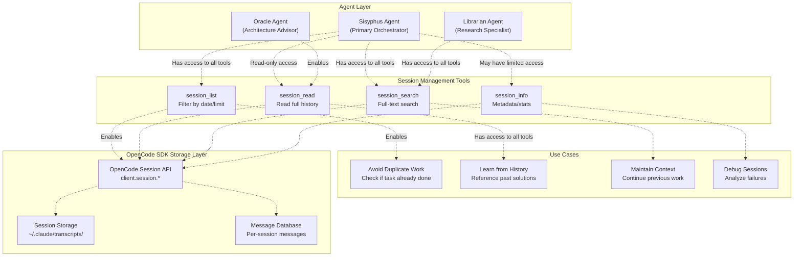
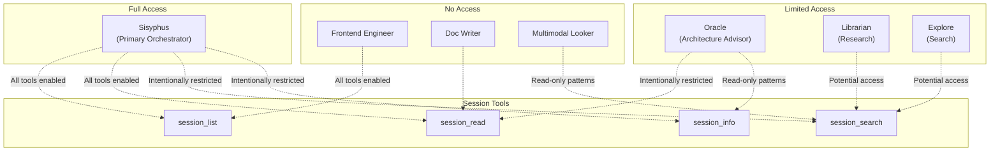
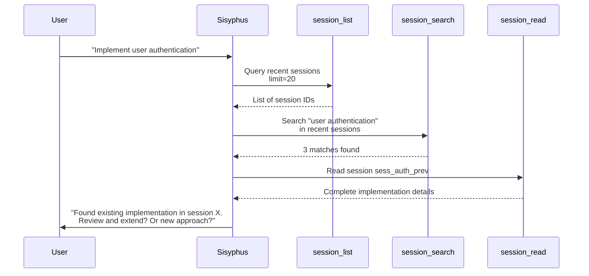
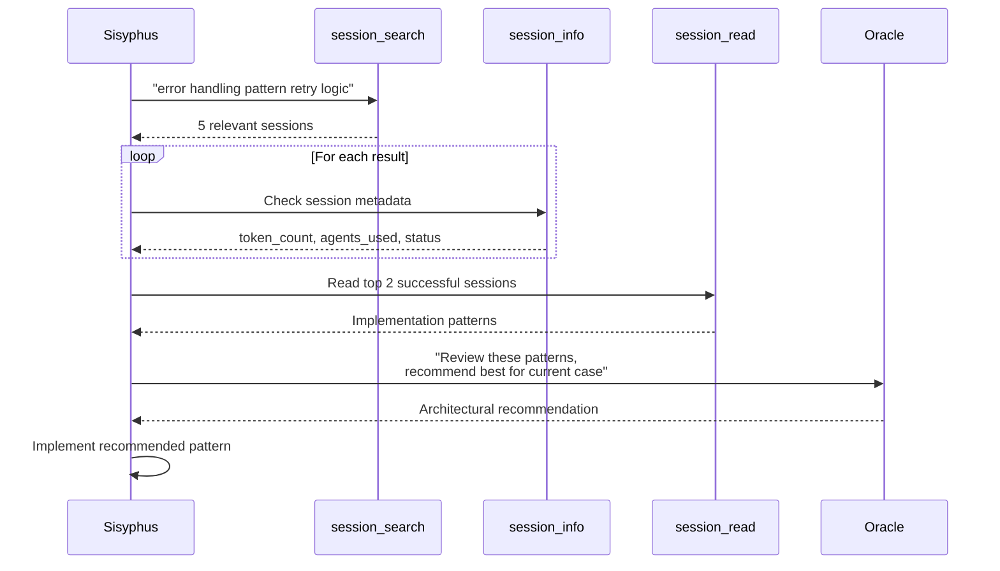
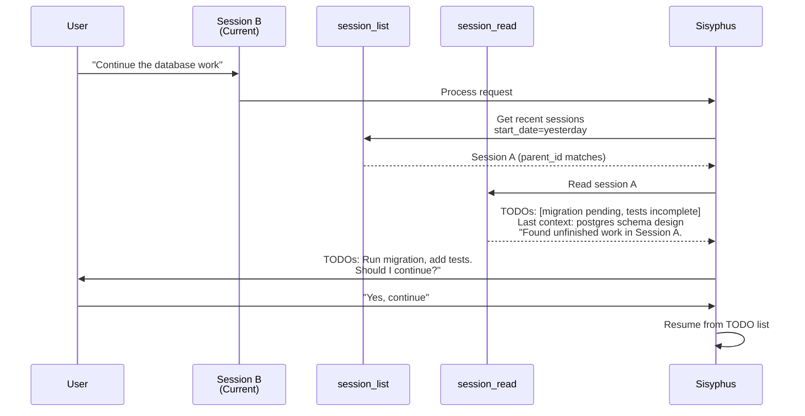
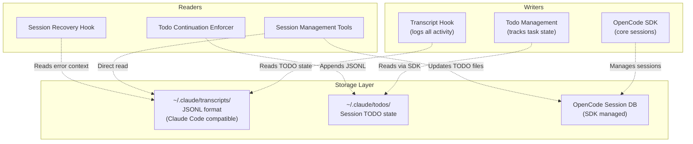
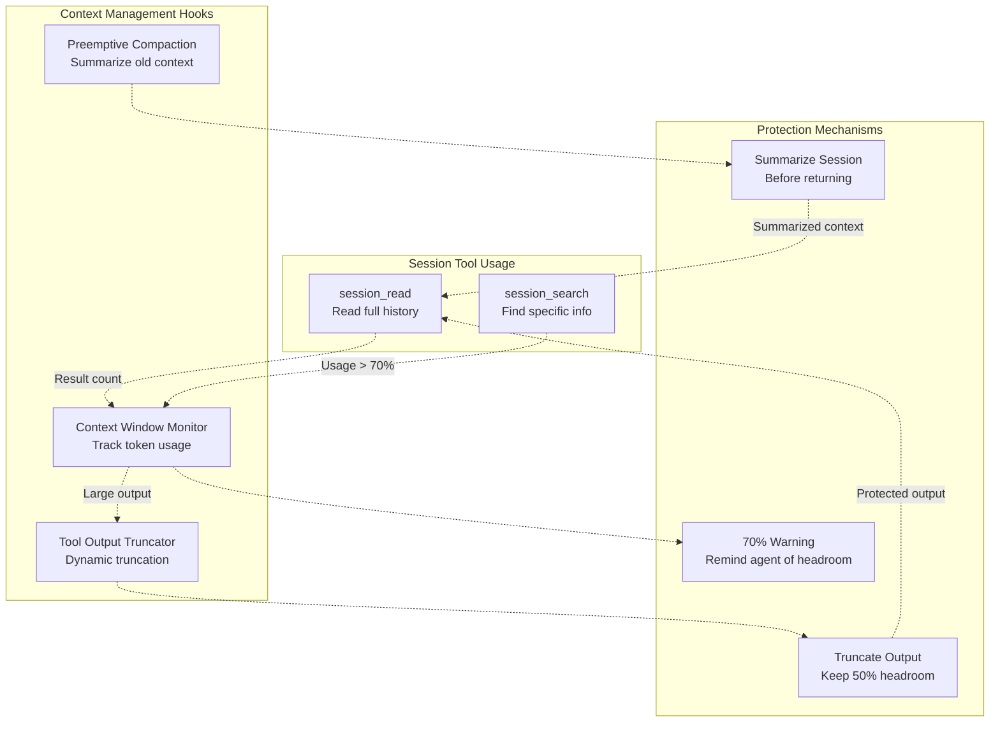

# Session Management Tools

> **Relevant source files**
> * [README.ja.md](https://github.com/code-yeongyu/oh-my-opencode/blob/b92cd6ab/README.ja.md)
> * [README.ko.md](https://github.com/code-yeongyu/oh-my-opencode/blob/b92cd6ab/README.ko.md)
> * [README.md](https://github.com/code-yeongyu/oh-my-opencode/blob/b92cd6ab/README.md)
> * [README.zh-cn.md](https://github.com/code-yeongyu/oh-my-opencode/blob/b92cd6ab/README.zh-cn.md)
> * [src/shared/config-path.ts](https://github.com/code-yeongyu/oh-my-opencode/blob/b92cd6ab/src/shared/config-path.ts)
> * [src/tools/background-task/constants.ts](https://github.com/code-yeongyu/oh-my-opencode/blob/b92cd6ab/src/tools/background-task/constants.ts)
> * [src/tools/background-task/index.ts](https://github.com/code-yeongyu/oh-my-opencode/blob/b92cd6ab/src/tools/background-task/index.ts)
> * [src/tools/background-task/types.ts](https://github.com/code-yeongyu/oh-my-opencode/blob/b92cd6ab/src/tools/background-task/types.ts)
> * [src/tools/call-omo-agent/constants.ts](https://github.com/code-yeongyu/oh-my-opencode/blob/b92cd6ab/src/tools/call-omo-agent/constants.ts)
> * [src/tools/interactive-bash/constants.ts](https://github.com/code-yeongyu/oh-my-opencode/blob/b92cd6ab/src/tools/interactive-bash/constants.ts)
> * [src/tools/look-at/constants.ts](https://github.com/code-yeongyu/oh-my-opencode/blob/b92cd6ab/src/tools/look-at/constants.ts)
> * [src/tools/look-at/tools.ts](https://github.com/code-yeongyu/oh-my-opencode/blob/b92cd6ab/src/tools/look-at/tools.ts)

## Purpose and Scope

Session Management Tools provide programmatic access to OpenCode session history, enabling agents to reference previous conversations, search across past interactions, and maintain continuity across sessions. These tools allow agents to learn from historical context, avoid repeating completed work, and make informed decisions based on prior session outcomes.

For information about other tool categories, see:

* Background execution tools: [Background Task Tools](/code-yeongyu/oh-my-opencode/5.3-background-task-tools)
* LSP-based development tools: [LSP Tools](/code-yeongyu/oh-my-opencode/5.1-lsp-tools)
* Code search and refactoring tools: [AST-Grep Tools](/code-yeongyu/oh-my-opencode/5.2-ast-grep-tools)
* Media analysis tools: [Specialized Tools](/code-yeongyu/oh-my-opencode/5.5-specialized-tools)

**Sources:** [README.md L528-L537](https://github.com/code-yeongyu/oh-my-opencode/blob/b92cd6ab/README.md#L528-L537)

 [Diagram 5](https://github.com/code-yeongyu/oh-my-opencode/blob/b92cd6ab/Diagram 5#LNaN-LNaN)

---

## Tool Overview

The session management system provides four complementary tools for historical analysis:

| Tool | Purpose | Primary Use Case | Return Type |
| --- | --- | --- | --- |
| `session_list` | Enumerate sessions with filtering | Discover recent or relevant sessions by date range | List of session metadata |
| `session_read` | Retrieve complete session content | Access full conversation history and context | Messages and session data |
| `session_search` | Full-text search across sessions | Find specific information or patterns | Matching messages with context |
| `session_info` | Get session metadata and statistics | Understand session characteristics (duration, token count, agents used) | Structured metadata object |

These tools are designed to work together: use `session_list` to find relevant sessions, `session_info` to validate session relevance, `session_read` to retrieve detailed content, and `session_search` for targeted information extraction.

**Sources:** [README.md L528-L537](https://github.com/code-yeongyu/oh-my-opencode/blob/b92cd6ab/README.md#L528-L537)

 [Diagram 5](https://github.com/code-yeongyu/oh-my-opencode/blob/b92cd6ab/Diagram 5#LNaN-LNaN)

---

## System Architecture

### Session Management Tool Integration



**Architecture Notes:**

* Session management tools interface with the OpenCode SDK's session API ([`@opencode-ai/sdk`](https://github.com/code-yeongyu/oh-my-opencode/blob/b92cd6ab/`@opencode-ai/sdk`) ), which provides access to session storage
* Storage follows Claude Code compatibility pattern with transcripts in `~/.claude/transcripts/` (see [Claude Code Compatibility](/code-yeongyu/oh-my-opencode/9-claude-code-compatibility))
* Tools are primarily exposed to Sisyphus (unrestricted access) for orchestration workflows
* Oracle may have read-only access to understand historical context without modification capabilities
* All tools operate through the `ctx.client.session.*` API provided by the plugin context

**Sources:** [Diagram 1](https://github.com/code-yeongyu/oh-my-opencode/blob/b92cd6ab/Diagram 1#LNaN-LNaN)

 [Diagram 5](https://github.com/code-yeongyu/oh-my-opencode/blob/b92cd6ab/Diagram 5#LNaN-LNaN)

 [README.md L528-L537](https://github.com/code-yeongyu/oh-my-opencode/blob/b92cd6ab/README.md#L528-L537)

---

## Tool Definitions

### session_list

Lists all available OpenCode sessions with optional filtering by date range and result limit.

**Purpose:** Enable discovery of relevant sessions without loading full content. Useful for finding recent sessions, sessions within a specific timeframe, or getting an overview of session history.

**Arguments:**

| Argument | Type | Required | Description |
| --- | --- | --- | --- |
| `start_date` | string (ISO 8601) | No | Filter sessions created on or after this date |
| `end_date` | string (ISO 8601) | No | Filter sessions created on or before this date |
| `limit` | number | No | Maximum number of sessions to return (default: 50) |

**Returns:** Array of session metadata objects containing:

* Session ID
* Title
* Creation timestamp
* Last activity timestamp
* Parent session ID (if applicable)

**Example Usage:**

```python
// List last 10 sessions
session_list({ limit: 10 })

// Find sessions from last week
session_list({ 
  start_date: "2025-01-10T00:00:00Z",
  limit: 20 
})
```

**Implementation Pattern:**
Based on other tool implementations [src/tools/look-at/tools.ts L46-L137](https://github.com/code-yeongyu/oh-my-opencode/blob/b92cd6ab/src/tools/look-at/tools.ts#L46-L137)

 the tool likely:

1. Accepts arguments validated through `tool.schema.string()` and `tool.schema.number()` validators
2. Calls `ctx.client.session.list()` with filter parameters
3. Returns formatted session metadata array

**Sources:** [README.md L531](https://github.com/code-yeongyu/oh-my-opencode/blob/b92cd6ab/README.md#L531-L531)

 [Diagram 5](https://github.com/code-yeongyu/oh-my-opencode/blob/b92cd6ab/Diagram 5#LNaN-LNaN)

---

### session_read

Retrieves complete message history and metadata for a specific session.

**Purpose:** Access full conversation content from a previous session. Used when agents need detailed context about prior work, including all messages, tool calls, and responses.

**Arguments:**

| Argument | Type | Required | Description |
| --- | --- | --- | --- |
| `session_id` | string | Yes | Unique identifier of the session to read |
| `include_tool_calls` | boolean | No | Include tool execution details (default: true) |

**Returns:** Session object containing:

* Complete message array with role, content, and timestamps
* Tool call history with arguments and results
* Session metadata (title, agents used, token counts)
* Parent/child session relationships

**Example Usage:**

```yaml
// Read complete session history
session_read({ 
  session_id: "sess_abc123xyz"
})

// Read without tool execution details
session_read({ 
  session_id: "sess_abc123xyz",
  include_tool_calls: false
})
```

**Key Behaviors:**

* Messages returned in chronological order
* Tool calls include both arguments and results for full transparency
* Handles both parent sessions and child sessions (e.g., background tasks)
* Large sessions may be truncated with summary (see [Context Management Hooks](/code-yeongyu/oh-my-opencode/7.4-context-management-hooks))

**Sources:** [README.md L532](https://github.com/code-yeongyu/oh-my-opencode/blob/b92cd6ab/README.md#L532-L532)

 [Diagram 5](https://github.com/code-yeongyu/oh-my-opencode/blob/b92cd6ab/Diagram 5#LNaN-LNaN)

---

### session_search

Performs full-text search across all session messages to find specific information.

**Purpose:** Locate specific discussions, decisions, or information without reading entire sessions. Particularly useful for finding how previous issues were resolved or locating specific technical decisions.

**Arguments:**

| Argument | Type | Required | Description |
| --- | --- | --- | --- |
| `query` | string | Yes | Search query string |
| `limit` | number | No | Maximum results to return (default: 10) |
| `session_ids` | string[] | No | Restrict search to specific sessions |
| `start_date` | string (ISO 8601) | No | Only search sessions after this date |

**Returns:** Array of search result objects containing:

* Matching message text with context
* Session ID and title
* Message timestamp
* Relevance score
* Surrounding context (messages before/after match)

**Example Usage:**

```yaml
// Search for error handling discussions
session_search({ 
  query: "error handling strategy",
  limit: 5
})

// Search within specific recent sessions
session_search({
  query: "database migration",
  session_ids: ["sess_abc", "sess_xyz"],
  start_date: "2025-01-01T00:00:00Z"
})
```

**Search Capabilities:**

* Full-text matching with relevance scoring
* Case-insensitive by default
* Matches across all message content including tool results
* Returns contextual snippets (configurable window around matches)

**Sources:** [README.md L533](https://github.com/code-yeongyu/oh-my-opencode/blob/b92cd6ab/README.md#L533-L533)

 [Diagram 5](https://github.com/code-yeongyu/oh-my-opencode/blob/b92cd6ab/Diagram 5#LNaN-LNaN)

---

### session_info

Retrieves metadata and statistics about a session without loading full message content.

**Purpose:** Quickly assess session characteristics to determine relevance. Useful for understanding session scope, duration, resource usage, and participants before committing to a full read.

**Arguments:**

| Argument | Type | Required | Description |
| --- | --- | --- | --- |
| `session_id` | string | Yes | Unique identifier of the session |

**Returns:** Metadata object containing:

| Field | Description |
| --- | --- |
| `id` | Session unique identifier |
| `title` | Session title/description |
| `created_at` | Session creation timestamp |
| `updated_at` | Last activity timestamp |
| `message_count` | Total number of messages |
| `token_count` | Approximate total tokens used |
| `agents_used` | List of agents that participated |
| `parent_id` | Parent session ID (if child session) |
| `child_sessions` | Array of child session IDs |
| `status` | Session status (active/completed/failed) |
| `duration_seconds` | Total session duration |

**Example Usage:**

```yaml
// Get session statistics
session_info({ 
  session_id: "sess_abc123xyz"
})
```

**Typical Workflow:**

1. Use `session_list` to find potential sessions
2. Use `session_info` to check relevance (token count, agents used, duration)
3. Use `session_read` only for confirmed relevant sessions

**Sources:** [README.md L534](https://github.com/code-yeongyu/oh-my-opencode/blob/b92cd6ab/README.md#L534-L534)

 [Diagram 5](https://github.com/code-yeongyu/oh-my-opencode/blob/b92cd6ab/Diagram 5#LNaN-LNaN)

---

## Agent Access Patterns

### Tool Availability by Agent



**Access Rationale:**

**Sisyphus (Full Access):**

* Primary orchestrator needs complete historical awareness
* Uses session tools to avoid duplicate work
* References past solutions and patterns
* Maintains continuity across multi-session workflows
* Example: "Check if we already implemented authentication in previous sessions"

**Oracle (Read-Only Access):**

* May access historical architectural decisions via `session_read`
* Uses `session_info` to understand session context
* Restricted from list/search to prevent context overload
* Example: "Review how we structured the database schema last time"

**Librarian & Explore (Search Access):**

* May use `session_search` for code pattern discovery
* Limited access prevents inappropriate self-referencing
* Focuses on external research rather than internal history

**Specialized Agents (No Access):**

* Frontend Engineer: Focuses on current implementation only
* Doc Writer: Works with provided context, not history mining
* Multimodal Looker: Single-purpose file analysis, no session awareness
* Rationale: Prevents context bloat and maintains agent specialization

**Sources:** [Diagram 5](https://github.com/code-yeongyu/oh-my-opencode/blob/b92cd6ab/Diagram 5#LNaN-LNaN)

 [README.md L464-L473](https://github.com/code-yeongyu/oh-my-opencode/blob/b92cd6ab/README.md#L464-L473)

---

## Usage Patterns and Workflows

### Pattern 1: Duplicate Work Prevention



**Description:** Before starting significant work, Sisyphus checks if similar work was completed in previous sessions. This prevents wasted effort and maintains consistency.

**Implementation Steps:**

1. Extract task keywords from user request
2. Query recent sessions with `session_list`
3. Search for keywords with `session_search`
4. Read matching sessions with `session_read`
5. Present findings and proposed action to user

**Sources:** [Diagram 3](https://github.com/code-yeongyu/oh-my-opencode/blob/b92cd6ab/Diagram 3#LNaN-LNaN)

 [README.md L528-L537](https://github.com/code-yeongyu/oh-my-opencode/blob/b92cd6ab/README.md#L528-L537)

---

### Pattern 2: Learning from Historical Solutions



**Description:** When facing design decisions, agents can search historical sessions for similar problems and their solutions, then consult Oracle for current context adaptation.

**Workflow Benefits:**

* Maintains consistency across sessions
* Leverages proven patterns
* Avoids repeating past mistakes (failed sessions excluded)
* Enables knowledge accumulation over time

**Sources:** [Diagram 3](https://github.com/code-yeongyu/oh-my-opencode/blob/b92cd6ab/Diagram 3#LNaN-LNaN)

 [README.md L467-L469](https://github.com/code-yeongyu/oh-my-opencode/blob/b92cd6ab/README.md#L467-L469)

---

### Pattern 3: Context Continuation Across Sessions



**Description:** When users start a new session referencing previous work, Sisyphus can automatically locate and continue from the previous session's state, including incomplete TODO items.

**Key Features:**

* Detects session relationships via parent_id
* Reads TODO state from Claude Code-compatible storage (`~/.claude/todos/`)
* Maintains workflow continuity despite session boundaries
* Prevents context loss between sessions

**Sources:** [Diagram 3](https://github.com/code-yeongyu/oh-my-opencode/blob/b92cd6ab/Diagram 3#LNaN-LNaN)

 [README.md L169-L171](https://github.com/code-yeongyu/oh-my-opencode/blob/b92cd6ab/README.md#L169-L171)

 [README.md L636-L638](https://github.com/code-yeongyu/oh-my-opencode/blob/b92cd6ab/README.md#L636-L638)

---

## Integration with Related Systems

### Storage Backend Compatibility

Session management tools read from storage maintained by multiple systems:



**Storage Locations:**

* **Transcripts:** `~/.claude/transcripts/<session_id>.jsonl` - Complete activity log in JSONL format for replay and analysis
* **TODOs:** `~/.claude/todos/<session_id>.json` - Session TODO lists in Claude Code compatible format
* **Session DB:** Managed by OpenCode SDK, accessed via `ctx.client.session.*` API

**Compatibility:**

* Claude Code users migrating to oh-my-opencode can access their existing session history
* Transcript format enables session replay for debugging
* TODO format shared with [Todo Continuation Enforcer](/code-yeongyu/oh-my-opencode/7.3-todo-continuation-enforcer) for workflow continuity

**Sources:** [README.md L636-L639](https://github.com/code-yeongyu/oh-my-opencode/blob/b92cd6ab/README.md#L636-L639)

 [Diagram 1](https://github.com/code-yeongyu/oh-my-opencode/blob/b92cd6ab/Diagram 1#LNaN-LNaN)

---

### Context Management Integration

Session management tools interact with context management hooks to prevent token overload:



**Protection Strategies:**

1. **Output Truncation:** * Tool Output Truncator (see [Context Management Hooks](/code-yeongyu/oh-my-opencode/7.4-context-management-hooks)) applies to session tool results * Dynamically truncates based on remaining context window * Maintains 50% headroom, caps at 50k tokens * Implementation: [README.md L686-L689](https://github.com/code-yeongyu/oh-my-opencode/blob/b92cd6ab/README.md#L686-L689)
2. **Context Window Monitoring:** * Tracks token usage at 70%+ threshold * Warns agents about remaining capacity * Prevents "context anxiety" leading to rushed work * Pattern: [Context Window Anxiety Management](https://agentic-patterns.com/patterns/context-window-anxiety-management/) * Implementation: [README.md L677-L679](https://github.com/code-yeongyu/oh-my-opencode/blob/b92cd6ab/README.md#L677-L679)
3. **Preemptive Compaction:** * Summarizes large session reads before adding to context * Triggered proactively at 80% threshold * Preserves critical information (AGENTS.md, current directory) * Implementation: [README.md L689-L691](https://github.com/code-yeongyu/oh-my-opencode/blob/b92cd6ab/README.md#L689-L691)

**Agent Behavior:**
When session tools return large outputs, agents receive truncated/summarized versions automatically. The agent is notified about truncation and can request specific sections if needed.

**Sources:** [README.md L677-L691](https://github.com/code-yeongyu/oh-my-opencode/blob/b92cd6ab/README.md#L677-L691)

 [Diagram 4](https://github.com/code-yeongyu/oh-my-opencode/blob/b92cd6ab/Diagram 4#LNaN-LNaN)

---

## Configuration and Customization

### Disabling Session Tools

Session management tools can be disabled via agent tool configuration:

```json
{
  "agents": {
    "Sisyphus": {
      "tools": {
        "session_list": false,
        "session_read": false,
        "session_search": false,
        "session_info": false
      }
    }
  }
}
```

**When to Disable:**

* Privacy-sensitive environments where session history should not be accessible
* Greenfield projects with no relevant history
* Preventing context bloat in specialized agents
* Performance optimization (reduces tool count in prompt)

**Sources:** [README.md L773-L789](https://github.com/code-yeongyu/oh-my-opencode/blob/b92cd6ab/README.md#L773-L789)

---

### Agent-Specific Access Control

Fine-grained control via permission system (see [Agent Configuration](/code-yeongyu/oh-my-opencode/4.3-agent-configuration)):

```
{
  "agents": {
    "custom-agent": {
      "tools": {
        // Allow metadata queries only
        "session_list": true,
        "session_info": true,
        
        // Block content access
        "session_read": false,
        "session_search": false
      }
    }
  }
}
```

**Access Patterns:**

* **Discovery Only:** Enable `session_list` + `session_info` for browsing without content access
* **Search Only:** Enable `session_search` for targeted lookups without full history access
* **Read-Only Archive:** Enable all session tools but disable modification tools (`edit`, `write`, `bash`)

**Sources:** [README.md L796-L817](https://github.com/code-yeongyu/oh-my-opencode/blob/b92cd6ab/README.md#L796-L817)

---

## Error Handling and Edge Cases

### Common Error Scenarios

| Error | Cause | Tool Behavior | Agent Response |
| --- | --- | --- | --- |
| Session Not Found | Invalid `session_id` | Returns error message | Request user to verify session ID or use `session_list` |
| Empty Search Results | No matches for query | Returns empty array with message | Broaden search terms or adjust date filters |
| Session Still Active | Reading from current session | May return incomplete data | Tool warns about active session, agent decides whether to proceed |
| Truncated Output | Large session exceeds context limit | Returns truncated with notation | Agent can request specific message ranges |
| Permission Denied | Accessing restricted session | Returns permission error | Agent escalates to user for authorization |

### Session State Handling

Sessions have lifecycle states affecting tool behavior:

```mermaid
stateDiagram-v2
    [*] --> session_read returns partialsession_info shows "active" : "session.create()"
    session_read returns partialsession_info shows "active" --> session_read returns completesession_info shows "idle" : "New message"
    session_read returns completesession_info shows "idle" --> session_read returns partialsession_info shows "active" : "New message"
    session_read returns partialsession_info shows "active" --> All tools return complete data : "Task finished"
    session_read returns partialsession_info shows "active" --> Tools include error context : "Error/abort"
    All tools return complete data --> [*]
    Tools include error context --> [*]
```

**State-Specific Behaviors:**

* **Active Sessions:** `session_read` may return incomplete message history (current conversation in progress)
* **Idle Sessions:** All tools return complete data; session may be resumed
* **Completed Sessions:** Immutable history, optimal for analysis
* **Failed Sessions:** Include error context and stack traces (useful for debugging)

**Sources:** [Diagram 4](https://github.com/code-yeongyu/oh-my-opencode/blob/b92cd6ab/Diagram 4#LNaN-LNaN)

 [README.md L681-L682](https://github.com/code-yeongyu/oh-my-opencode/blob/b92cd6ab/README.md#L681-L682)

---

## Performance Considerations

### Optimization Strategies

**1. Incremental Session Reading:**
Instead of reading entire sessions, use targeted queries:

```javascript
// Inefficient: Read everything
const fullSession = session_read({ session_id: "sess_abc" })

// Efficient: Search first, read selectively
const matches = session_search({ 
  query: "authentication implementation",
  session_ids: ["sess_abc"]
})
// Then read only relevant message ranges
```

**2. Metadata-First Workflow:**
Use `session_info` before committing to `session_read`:

```javascript
// Check session size first
const info = session_info({ session_id: "sess_abc" })
if (info.message_count > 100 || info.token_count > 50000) {
  // Use session_search instead of session_read
  // Or request user confirmation
}
```

**3. Date Filtering:**
Limit search scope to reduce processing time:

```yaml
// Inefficient: Search all history
session_search({ query: "bug fix" })

// Efficient: Limit to recent sessions
session_search({ 
  query: "bug fix",
  start_date: "2025-01-01T00:00:00Z",
  limit: 10
})
```

**4. Result Limits:**
Always specify appropriate limits:

```yaml
// Default behavior may return too much
session_list({})

// Controlled results
session_list({ 
  limit: 10,
  start_date: last_week
})
```

**Sources:** [README.md L686-L689](https://github.com/code-yeongyu/oh-my-opencode/blob/b92cd6ab/README.md#L686-L689)

 [Context Management Hooks](/code-yeongyu/oh-my-opencode/7.4-context-management-hooks)

---

## Summary

Session Management Tools provide essential historical analysis capabilities for oh-my-opencode agents:

**Core Capabilities:**

* **session_list:** Enumerate and filter sessions by date/limit
* **session_read:** Access complete conversation history
* **session_search:** Full-text search across sessions
* **session_info:** Retrieve metadata and statistics

**Key Benefits:**

* Enables agents to learn from past sessions
* Prevents duplicate work across sessions
* Maintains workflow continuity despite session boundaries
* Supports debugging through historical analysis

**Integration Points:**

* Primary user: Sisyphus orchestrator for workflow continuity
* Storage: Claude Code compatible (`~/.claude/transcripts/`, `~/.claude/todos/`)
* Protection: Context management hooks prevent token overload
* Access control: Configurable per-agent via tool permissions

**Design Philosophy:**
Session management follows the "learn from history" principle, allowing agents to accumulate knowledge over time rather than treating each session as isolated. This enables continuous improvement and consistent patterns across user interactions.

**Sources:** [README.md L528-L537](https://github.com/code-yeongyu/oh-my-opencode/blob/b92cd6ab/README.md#L528-L537)

 [Diagram 5](https://github.com/code-yeongyu/oh-my-opencode/blob/b92cd6ab/Diagram 5#LNaN-LNaN)

 [Diagram 1](https://github.com/code-yeongyu/oh-my-opencode/blob/b92cd6ab/Diagram 1#LNaN-LNaN)