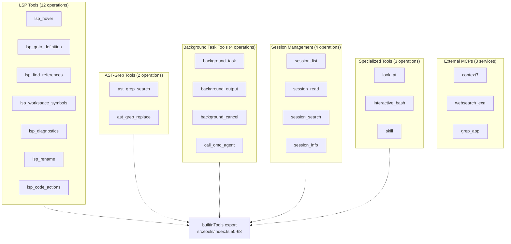
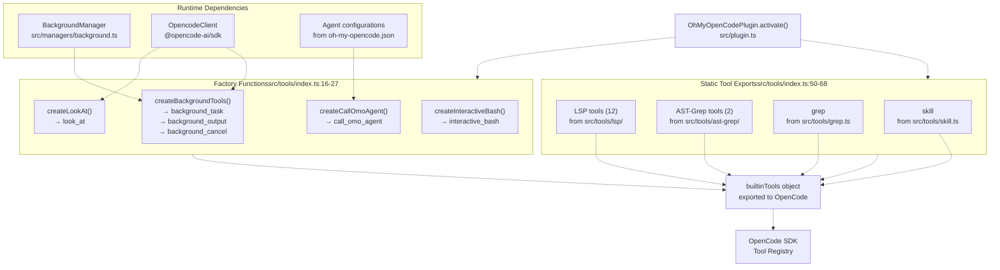
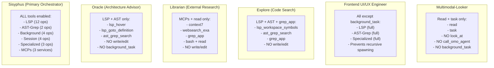
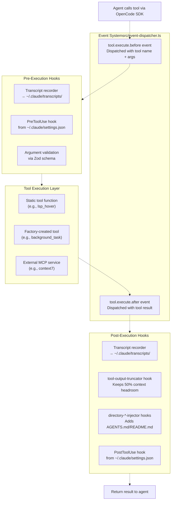
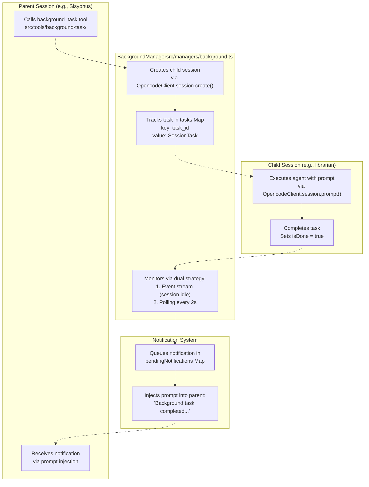
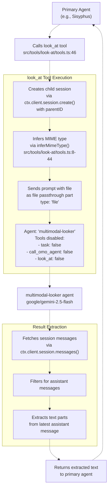

# Tool System

> **Relevant source files**
> * [README.ja.md](https://github.com/code-yeongyu/oh-my-opencode/blob/b92cd6ab/README.ja.md)
> * [README.ko.md](https://github.com/code-yeongyu/oh-my-opencode/blob/b92cd6ab/README.ko.md)
> * [README.md](https://github.com/code-yeongyu/oh-my-opencode/blob/b92cd6ab/README.md)
> * [README.zh-cn.md](https://github.com/code-yeongyu/oh-my-opencode/blob/b92cd6ab/README.zh-cn.md)
> * [src/shared/config-path.ts](https://github.com/code-yeongyu/oh-my-opencode/blob/b92cd6ab/src/shared/config-path.ts)
> * [src/tools/background-task/constants.ts](https://github.com/code-yeongyu/oh-my-opencode/blob/b92cd6ab/src/tools/background-task/constants.ts)
> * [src/tools/background-task/index.ts](https://github.com/code-yeongyu/oh-my-opencode/blob/b92cd6ab/src/tools/background-task/index.ts)
> * [src/tools/background-task/types.ts](https://github.com/code-yeongyu/oh-my-opencode/blob/b92cd6ab/src/tools/background-task/types.ts)
> * [src/tools/call-omo-agent/constants.ts](https://github.com/code-yeongyu/oh-my-opencode/blob/b92cd6ab/src/tools/call-omo-agent/constants.ts)
> * [src/tools/interactive-bash/constants.ts](https://github.com/code-yeongyu/oh-my-opencode/blob/b92cd6ab/src/tools/interactive-bash/constants.ts)
> * [src/tools/look-at/constants.ts](https://github.com/code-yeongyu/oh-my-opencode/blob/b92cd6ab/src/tools/look-at/constants.ts)
> * [src/tools/look-at/tools.ts](https://github.com/code-yeongyu/oh-my-opencode/blob/b92cd6ab/src/tools/look-at/tools.ts)

The Tool System provides agents with a comprehensive ecosystem of 30+ tools for code analysis, manipulation, execution, and orchestration. Tools are organized into six functional categories and integrated through a centralized registration system at [src/tools/index.ts L1-L68](https://github.com/code-yeongyu/oh-my-opencode/blob/b92cd6ab/src/tools/index.ts#L1-L68)

 This page covers the complete tool landscape, differential access patterns by agent role, and the integration architecture that enables coordinated multi-agent workflows.

For detailed information about specific tool categories, see:

* **LSP Tools** (page 5.1) - 12 Language Server Protocol operations for type information, navigation, diagnostics, and refactoring
* **AST-Grep Tools** (page 5.2) - Structural code search and replacement across 25 languages
* **Background Task Tools** (page 5.3) - Asynchronous agent orchestration with `background_task`, `background_output`, `background_cancel`, and `call_omo_agent`
* **Session Management Tools** (page 5.4) - Historical analysis with `session_list`, `session_read`, `session_search`, and `session_info`
* **Specialized Tools** (page 5.5) - `look_at` for multimodal analysis, `interactive_bash` for tmux management, and `skill` execution

## Complete Tool Ecosystem

oh-my-opencode provides 30+ tools organized into six functional categories. The ecosystem extends OpenCode's built-in capabilities with specialized tools for LSP operations, AST manipulation, background task orchestration, session management, and multimodal analysis.

**Tool Ecosystem Architecture**



**Tool Categories Overview**

| Category | Tool Count | Primary Use Case | Implementation |
| --- | --- | --- | --- |
| LSP Tools | 12 | Type information, navigation, refactoring | [src/tools/lsp/](https://github.com/code-yeongyu/oh-my-opencode/blob/b92cd6ab/src/tools/lsp/) |
| AST-Grep | 2 | Structural code search/replace | [src/tools/ast-grep/](https://github.com/code-yeongyu/oh-my-opencode/blob/b92cd6ab/src/tools/ast-grep/) |
| Background Tasks | 4 | Async agent orchestration | [src/tools/background-task/](https://github.com/code-yeongyu/oh-my-opencode/blob/b92cd6ab/src/tools/background-task/) |
| Session Management | 4 | Historical analysis | OpenCode SDK built-in |
| Specialized | 3 | Media analysis, tmux, skills | [src/tools/look-at/](https://github.com/code-yeongyu/oh-my-opencode/blob/b92cd6ab/src/tools/look-at/) <br>  [src/tools/interactive-bash/](https://github.com/code-yeongyu/oh-my-opencode/blob/b92cd6ab/src/tools/interactive-bash/) |
| External MCPs | 3 | Documentation, web search, GitHub search | MCP protocol integration |

Sources: [src/tools/index.ts L1-L68](https://github.com/code-yeongyu/oh-my-opencode/blob/b92cd6ab/src/tools/index.ts#L1-L68)

 [README.md L512-L525](https://github.com/code-yeongyu/oh-my-opencode/blob/b92cd6ab/README.md#L512-L525)

 [README.md L531-L537](https://github.com/code-yeongyu/oh-my-opencode/blob/b92cd6ab/README.md#L531-L537)

## Tool Registration and Integration

Tools are centrally registered through [src/tools/index.ts L1-L68](https://github.com/code-yeongyu/oh-my-opencode/blob/b92cd6ab/src/tools/index.ts#L1-L68)

 using two distinct patterns: static exports for stateless tools and factory functions for tools requiring runtime dependencies.

**Tool Registration Flow to OpenCode SDK**



**Tool Registration Patterns**

| Pattern | Example Tools | Characteristics | Implementation |
| --- | --- | --- | --- |
| Static Export | `lsp_hover`, `ast_grep_search`, `grep` | No runtime dependencies, pure functions | Direct import/re-export at [src/tools/index.ts L50-L68](https://github.com/code-yeongyu/oh-my-opencode/blob/b92cd6ab/src/tools/index.ts#L50-L68) |
| Factory Function | `background_task`, `call_omo_agent`, `look_at` | Requires injected dependencies | Factory invoked during plugin activation |

Factory functions enable dependency injection for tools that need:

* **`createBackgroundTools(manager, client)`** - Injects `BackgroundManager` instance and `OpencodeClient` for orchestrating async agents
* **`createCallOmoAgent(config, context)`** - Injects agent configurations to delegate to `explore` or `librarian` agents per [src/tools/call-omo-agent/constants.ts L1](https://github.com/code-yeongyu/oh-my-opencode/blob/b92cd6ab/src/tools/call-omo-agent/constants.ts#L1-L1)
* **`createLookAt(ctx)`** - Injects plugin context to spawn child sessions with `multimodal-looker` agent per [src/tools/look-at/tools.ts L46-L137](https://github.com/code-yeongyu/oh-my-opencode/blob/b92cd6ab/src/tools/look-at/tools.ts#L46-L137)

Sources: [src/tools/index.ts L1-L68](https://github.com/code-yeongyu/oh-my-opencode/blob/b92cd6ab/src/tools/index.ts#L1-L68)

 [src/tools/background-task/](https://github.com/code-yeongyu/oh-my-opencode/blob/b92cd6ab/src/tools/background-task/)

 [src/tools/call-omo-agent/constants.ts L1](https://github.com/code-yeongyu/oh-my-opencode/blob/b92cd6ab/src/tools/call-omo-agent/constants.ts#L1-L1)

 [src/tools/look-at/tools.ts L46-L137](https://github.com/code-yeongyu/oh-my-opencode/blob/b92cd6ab/src/tools/look-at/tools.ts#L46-L137)

## Tool Registration and Export System

Tools are centrally registered in [src/tools/index.ts L1-L68](https://github.com/code-yeongyu/oh-my-opencode/blob/b92cd6ab/src/tools/index.ts#L1-L68)

 and exported for use by the plugin system. The registration system distinguishes between static tools (imported and re-exported) and dynamic tools (created by factory functions that inject runtime dependencies).

**Tool Registration Flow**

```mermaid
flowchart TD

PluginInit["OhMyOpenCodePlugin.activate()<br>(src/plugin.ts)"]
builtinTools["builtinTools object<br>(18 static tools)"]
LSPTools["LSP tools from src/tools/lsp/"]
ASTTools["AST tools from src/tools/ast-grep/"]
GrepTool["grep from src/tools/grep.ts"]
GlobTool["glob (OpenCode base)"]
ClaudeTools["slashcommand, skill"]
createBgTools["createBackgroundTools()<br>→ background_task<br>→ background_output<br>→ background_cancel"]
createAgent["createCallOmoAgent()<br>→ call_omo_agent"]
createLook["createLookAt()<br>→ look_at"]
BgManager["BackgroundManager instance"]
OcClient["OpencodeClient instance"]
AgentConfig["Agent configurations"]
MultimodalAgent["multimodal-looker agent"]
RegisterTools["Register with OpenCode"]

BgManager -.-> createBgTools
OcClient -.-> createBgTools
AgentConfig -.-> createAgent
MultimodalAgent -.-> createLook
builtinTools -.-> RegisterTools
createBgTools -.-> RegisterTools
createAgent -.-> RegisterTools
createLook -.-> RegisterTools
PluginInit -.-> StaticExport
PluginInit -.-> DynamicFactories

subgraph Runtime ["Runtime Dependencies"]
    BgManager
    OcClient
    AgentConfig
    MultimodalAgent
end

subgraph DynamicFactories ["Dynamic Tool Factories (src/tools/index.ts)"]
    createBgTools
    createAgent
    createLook
end

subgraph StaticExport ["Static Tool Export (src/tools/index.ts)"]
    builtinTools
    LSPTools
    ASTTools
    GrepTool
    GlobTool
    ClaudeTools
    LSPTools -.-> builtinTools
    ASTTools -.-> builtinTools
    GrepTool -.-> builtinTools
    GlobTool -.-> builtinTools
    ClaudeTools -.-> builtinTools
end
```



**Static vs Dynamic Tool Registration**

| Registration Type | Tool Count | Examples | Initialization |
| --- | --- | --- | --- |
| Static (`builtinTools`) | 18 | `lsp_hover`, `ast_grep_search`, `grep`, `glob` | Import and re-export from [src/tools/index.ts L50-L68](https://github.com/code-yeongyu/oh-my-opencode/blob/b92cd6ab/src/tools/index.ts#L50-L68) |
| Dynamic (factories) | 5 | `background_task`, `call_omo_agent`, `look_at` | Created during plugin activation with injected dependencies |

Dynamic tool factory functions:

* **`createBackgroundTools(manager, client)`** - Injects `BackgroundManager` and `OpencodeClient` instances to enable background task orchestration
* **`createCallOmoAgent(config, context)`** - Injects agent configurations and session context for sub-agent delegation
* **`createLookAt(agent)`** - Injects reference to `multimodal-looker` agent for visual content analysis

Sources: [src/tools/index.ts L1-L68](https://github.com/code-yeongyu/oh-my-opencode/blob/b92cd6ab/src/tools/index.ts#L1-L68)

 [src/plugin.ts](https://github.com/code-yeongyu/oh-my-opencode/blob/b92cd6ab/src/plugin.ts)

## Differential Tool Access by Agent

Agent tool access follows the principle of role-based restriction to enforce specialization and prevent infinite recursion. The access control system is implemented through per-agent tool configuration at session creation time.

**Agent Tool Access Patterns**



**Tool Access Control Matrix**

| Agent | LSP Tools | AST-Grep | Background Tools | Session Tools | Specialized | MCPs | Write/Edit |
| --- | --- | --- | --- | --- | --- | --- | --- |
| **Sisyphus** | ✓ (12) | ✓ (2) | ✓ (4) | ✓ (4) | ✓ (3) | ✓ (3) | ✓ |
| **Oracle** | ✓ (read-only) | ✓ (search) | ✗ | ✓ | ✗ | ✗ | ✗ |
| **Librarian** | ✗ | ✗ | ✗ | ✓ | ✗ | ✓ (3) | ✗ |
| **Explore** | ✓ (search) | ✓ (search) | ✗ | ✓ | ✗ | ✓ (grep_app) | ✗ |
| **Frontend** | ✓ (12) | ✓ (2) | ✗ | ✓ (4) | ✓ (2) | ✓ (3) | ✓ |
| **Multimodal** | ✗ | ✗ | ✗ | ✗ | ✗ (no look_at) | ✗ | ✗ |

**Key Access Control Rules**

1. **Recursion Prevention**: `explore` and `librarian` cannot use `call_omo_agent` to prevent infinite delegation loops where Sisyphus → explore → Sisyphus → explore...
2. **Visual Analysis Isolation**: `multimodal-looker` cannot use `look_at` because it IS invoked BY `look_at` tool per [src/tools/look-at/tools.ts L87](https://github.com/code-yeongyu/oh-my-opencode/blob/b92cd6ab/src/tools/look-at/tools.ts#L87-L87)
3. **Frontend Task Isolation**: `frontend-ui-ux-engineer` cannot use `background_task` to prevent recursive agent spawning that could create unmanaged background sessions
4. **Read-Only Specialists**: `oracle`, `librarian`, and `explore` have NO write/edit permissions - they provide analysis and research without modifying code

Sources: [README.md L463-L482](https://github.com/code-yeongyu/oh-my-opencode/blob/b92cd6ab/README.md#L463-L482)

 [src/tools/look-at/tools.ts L87](https://github.com/code-yeongyu/oh-my-opencode/blob/b92cd6ab/src/tools/look-at/tools.ts#L87-L87)

 [src/tools/call-omo-agent/constants.ts L1](https://github.com/code-yeongyu/oh-my-opencode/blob/b92cd6ab/src/tools/call-omo-agent/constants.ts#L1-L1)

## Tool Execution and Integration Architecture

Tool invocations flow through a multi-stage pipeline integrating with OpenCode's event system, hook execution, and reliability layers. The architecture enables context management, output truncation, and failure recovery.

**Tool Execution Pipeline Architecture**



**Hook Integration Points**

| Hook Type | Execution Point | Purpose | Configuration |
| --- | --- | --- | --- |
| PreToolUse | Before tool execution | Validate inputs, modify arguments, block execution | `~/.claude/settings.json` per README.md:586-610 |
| PostToolUse | After tool execution | Add warnings, inject context, log results | `~/.claude/settings.json` per README.md:586-610 |
| tool-output-truncator | After tool result | Prevent context overflow by truncating large outputs | Automatically active, no config |
| directory-*-injector | After file read tools | Inject directory-specific AGENTS.md and README.md | Automatically active for read operations |

**Tool Result Processing Flow**

For tools that return large outputs (e.g., `grep`, `ast_grep_search`, `lsp_find_references`), the post-execution pipeline applies dynamic truncation:

1. **Context calculation**: Measure remaining context window space
2. **Headroom preservation**: Maintain 50% headroom for agent response
3. **Token limit**: Cap output at 50k tokens maximum
4. **Truncation marker**: Add "... (output truncated)" suffix when truncated

Sources: [README.md L586-L610](https://github.com/code-yeongyu/oh-my-opencode/blob/b92cd6ab/README.md#L586-L610)

 [README.md L686-L688](https://github.com/code-yeongyu/oh-my-opencode/blob/b92cd6ab/README.md#L686-L688)

## Background Task Integration Architecture

Background task tools integrate with the `BackgroundManager` class to enable true parallel agent execution. The architecture creates child sessions, monitors completion via dual event/polling strategy, and notifies parent sessions upon completion.

**Background Task Architecture**



**Background Task Tool Descriptions**

| Tool | Description from Constants | Usage Pattern |
| --- | --- | --- |
| `background_task` | "Run agent task in background. Returns task_id immediately; notifies on completion." per [src/tools/background-task/constants.ts L1-L3](https://github.com/code-yeongyu/oh-my-opencode/blob/b92cd6ab/src/tools/background-task/constants.ts#L1-L3) | Create async task, receive task_id, continue work |
| `background_output` | "Get output from background task. System notifies on completion, so block=true rarely needed." per [src/tools/background-task/constants.ts L5](https://github.com/code-yeongyu/oh-my-opencode/blob/b92cd6ab/src/tools/background-task/constants.ts#L5-L5) | Poll for results or block until ready |
| `background_cancel` | "Cancel running background task(s). Use all=true to cancel ALL before final answer." per [src/tools/background-task/constants.ts L7](https://github.com/code-yeongyu/oh-my-opencode/blob/b92cd6ab/src/tools/background-task/constants.ts#L7-L7) | Terminate tasks on error or completion |

**Agent Delegation via call_omo_agent**

The `call_omo_agent` tool provides controlled delegation to specialized agents with explicit background execution control:

```yaml
Description: "Spawn explore/librarian agent. run_in_background REQUIRED (true=async with task_id, false=sync)."
Available agents: ["explore", "librarian"]
```

Source: [src/tools/call-omo-agent/constants.ts L1-L7](https://github.com/code-yeongyu/oh-my-opencode/blob/b92cd6ab/src/tools/call-omo-agent/constants.ts#L1-L7)

The `run_in_background` parameter is REQUIRED (not optional) to force agents to explicitly decide between:

* **`true`**: Async execution via `background_task` (returns task_id, continues immediately)
* **`false`**: Sync execution (blocks until agent completes)

This prevents accidental synchronous blocking when async execution is intended.

Sources: [src/tools/background-task/constants.ts L1-L8](https://github.com/code-yeongyu/oh-my-opencode/blob/b92cd6ab/src/tools/background-task/constants.ts#L1-L8)

 [src/tools/call-omo-agent/constants.ts L1-L7](https://github.com/code-yeongyu/oh-my-opencode/blob/b92cd6ab/src/tools/call-omo-agent/constants.ts#L1-L7)

 [README.md L486-L497](https://github.com/code-yeongyu/oh-my-opencode/blob/b92cd6ab/README.md#L486-L497)

## Specialized Tool Implementations

Several tools require specialized integration patterns beyond simple function calls. These tools demonstrate the flexibility of the tool system's architecture.

**Multimodal Analysis via look_at Tool**

The `look_at` tool implements a delegation pattern where the primary agent offloads visual analysis to a specialized `multimodal-looker` agent:



**Tool Description from Constants**

```python
Description: "Analyze media files (PDFs, images, diagrams) that require interpretation 
beyond raw text. Extracts specific information or summaries from documents, describes 
visual content. Use when you need analyzed/extracted data rather than literal file contents."
```

Source: [src/tools/look-at/constants.ts L3](https://github.com/code-yeongyu/oh-my-opencode/blob/b92cd6ab/src/tools/look-at/constants.ts#L3-L3)

**Tmux Integration via interactive_bash**

The `interactive_bash` tool provides tmux session management with security restrictions:

```
Description: "Execute tmux commands. Use 'omo-{name}' session pattern.
Blocked (use bash instead): capture-pane, save-buffer, show-buffer, pipe-pane."
```

Source: [src/tools/interactive-bash/constants.ts L14-L16](https://github.com/code-yeongyu/oh-my-opencode/blob/b92cd6ab/src/tools/interactive-bash/constants.ts#L14-L16)

**Blocked Subcommands** (security measure): `["capture-pane", "capturep", "save-buffer", "saveb", "show-buffer", "showb", "pipe-pane", "pipep"]` per [src/tools/interactive-bash/constants.ts L3-L12](https://github.com/code-yeongyu/oh-my-opencode/blob/b92cd6ab/src/tools/interactive-bash/constants.ts#L3-L12)

These subcommands are blocked because they could leak session content or create security vulnerabilities. Agents must use the standard `bash` tool for these operations instead.

**Session Management Tools**

Session management tools enable agents to reference previous conversations and maintain continuity:

| Tool | Purpose | Usage |
| --- | --- | --- |
| `session_list` | List all sessions with date filtering | Find sessions from specific time periods |
| `session_read` | Read complete message history | Retrieve previous conversation context |
| `session_search` | Full-text search across messages | Find specific discussions or decisions |
| `session_info` | Get metadata and statistics | Analyze session characteristics |

Source: [README.md L528-L536](https://github.com/code-yeongyu/oh-my-opencode/blob/b92cd6ab/README.md#L528-L536)

Sources: [src/tools/look-at/tools.ts L46-L137](https://github.com/code-yeongyu/oh-my-opencode/blob/b92cd6ab/src/tools/look-at/tools.ts#L46-L137)

 [src/tools/look-at/constants.ts L3](https://github.com/code-yeongyu/oh-my-opencode/blob/b92cd6ab/src/tools/look-at/constants.ts#L3-L3)

 [src/tools/interactive-bash/constants.ts L3-L16](https://github.com/code-yeongyu/oh-my-opencode/blob/b92cd6ab/src/tools/interactive-bash/constants.ts#L3-L16)

 [README.md L528-L536](https://github.com/code-yeongyu/oh-my-opencode/blob/b92cd6ab/README.md#L528-L536)

## Command Tokenization for Interactive Bash

The `interactive_bash` tool implements quote-aware command tokenization to properly handle complex tmux commands:

```javascript
// From src/tools/interactive-bash/tools.ts:9-48
export function tokenizeCommand(cmd: string): string[] {
  const tokens: string[] = []
  let current = ""
  let inQuote = false
  let quoteChar = ""
  let escaped = false

  for (let i = 0; i < cmd.length; i++) {
    const char = cmd[i]

    if (escaped) {
      current += char
      escaped = false
      continue
    }

    if (char === "\\") {
      escaped = true
      continue
    }

    if ((char === "'" || char === '"') && !inQuote) {
      inQuote = true
      quoteChar = char
    } else if (char === quoteChar && inQuote) {
      inQuote = false
      quoteChar = ""
    } else if (char === " " && !inQuote) {
      if (current) {
        tokens.push(current)
        current = ""
      }
    } else {
      current += char
    }
  }

  if (current) tokens.push(current)
  return tokens
}
```

This tokenizer handles:

* **Single and double quotes**: Preserves spaces within quoted strings
* **Backslash escapes**: Allows escaping quote characters
* **No external dependencies**: Pure TypeScript implementation for reliability

**Example Tokenization**

| Input Command | Tokens |
| --- | --- |
| `send-keys -t session:0 "echo hello"` | `["send-keys", "-t", "session:0", "echo hello"]` |
| `send-keys -t session:0 'echo "test"'` | `["send-keys", "-t", "session:0", "echo \"test\""]` |
| `send-keys -t session:0 echo\ test` | `["send-keys", "-t", "session:0", "echo test"]` |

Sources: [src/tools/interactive-bash/tools.ts L9-L48](https://github.com/code-yeongyu/oh-my-opencode/blob/b92cd6ab/src/tools/interactive-bash/tools.ts#L9-L48)